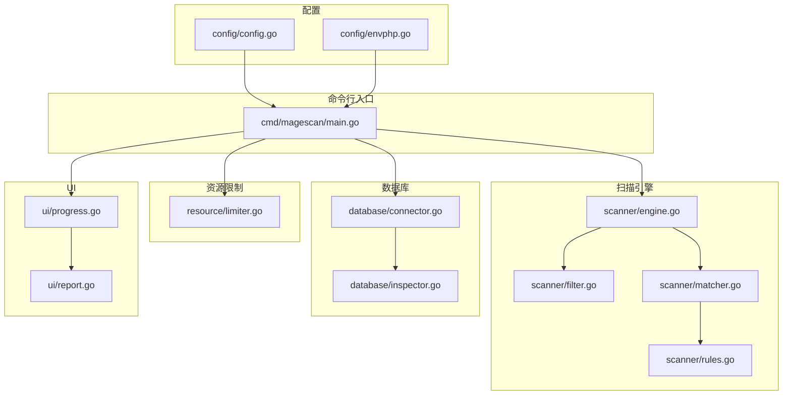
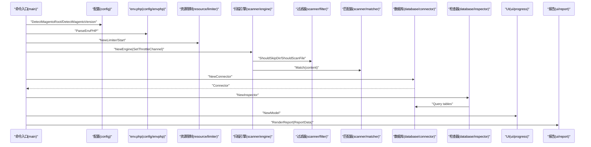
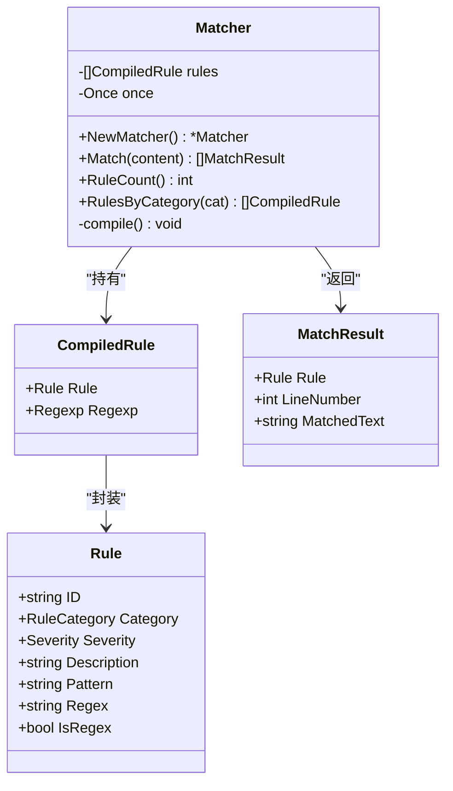
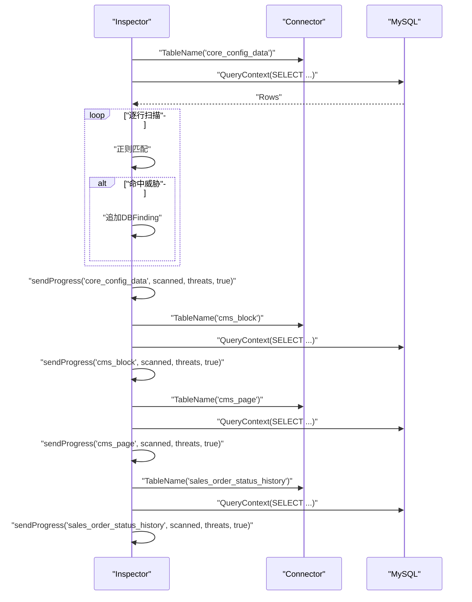
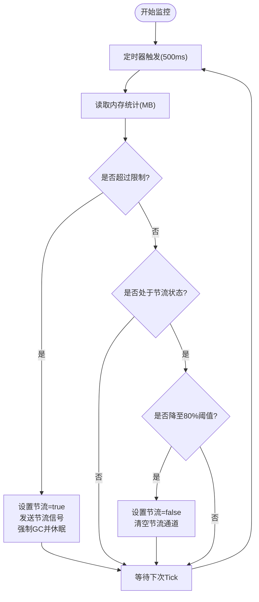
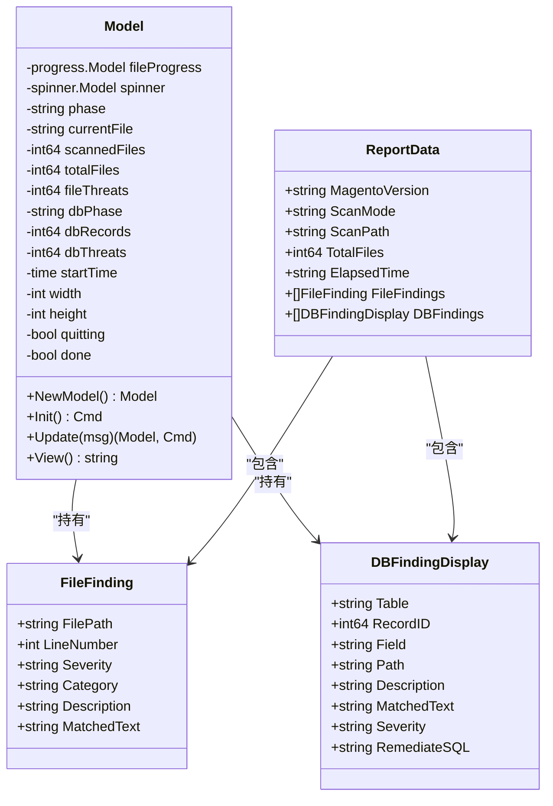
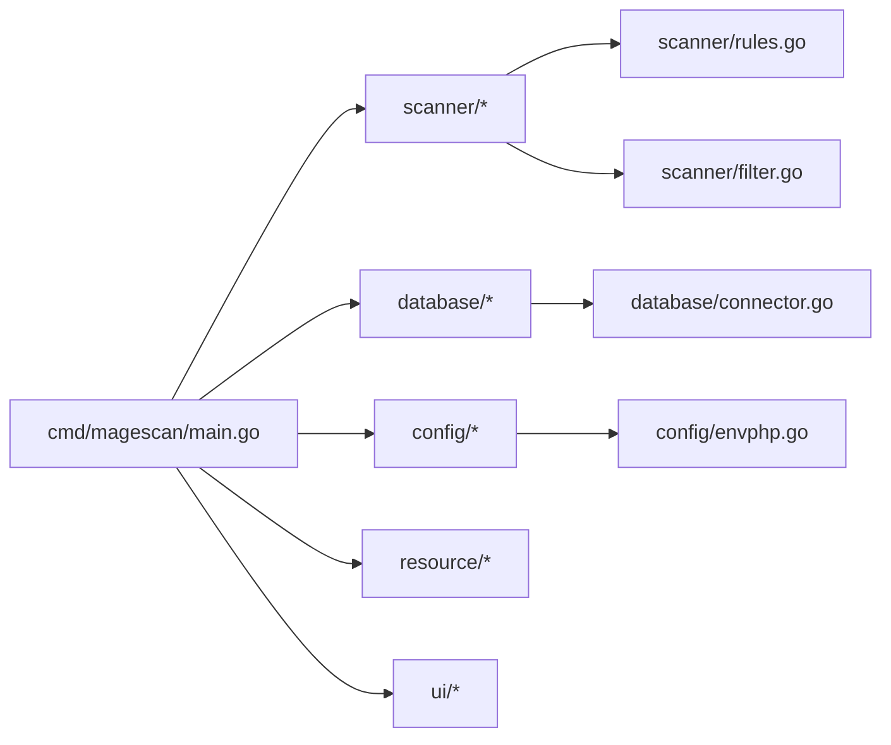

# API 参考

<cite>
**本文引用的文件**
- [cmd/magescan/main.go](file://cmd/magescan/main.go)
- [scanner/engine.go](file://scanner/engine.go)
- [scanner/filter.go](file://scanner/filter.go)
- [scanner/matcher.go](file://scanner/matcher.go)
- [scanner/rules.go](file://scanner/rules.go)
- [database/connector.go](file://database/connector.go)
- [database/inspector.go](file://database/inspector.go)
- [config/config.go](file://config/config.go)
- [config/envphp.go](file://config/envphp.go)
- [resource/limiter.go](file://resource/limiter.go)
- [ui/progress.go](file://ui/progress.go)
- [ui/report.go](file://ui/report.go)
- [README.md](file://README.md)
- [go.mod](file://go.mod)
</cite>

## 目录
1. [简介](#简介)
2. [项目结构](#项目结构)
3. [核心组件](#核心组件)
4. [架构总览](#架构总览)
5. [详细组件分析](#详细组件分析)
6. [依赖分析](#依赖分析)
7. [性能考量](#性能考量)
8. [故障排查指南](#故障排查指南)
9. [结论](#结论)
10. [附录](#附录)

## 简介
本文件为 MageScan 的完整 API 参考，覆盖扫描引擎 API、数据库检查 API、配置解析 API、资源限制器 API、UI 组件 API 等。文档面向集成开发者与第三方应用，提供接口设计模式、调用约定、参数说明、返回值类型、错误处理机制、线程安全与并发注意事项、性能特性、使用限制、版本兼容性与迁移指南，并给出最佳实践与示例路径。

## 项目结构
- 命令入口：cmd/magescan/main.go
- 扫描引擎：scanner/engine.go、scanner/filter.go、scanner/matcher.go、scanner/rules.go
- 数据库：database/connector.go、database/inspector.go
- 配置：config/config.go、config/envphp.go
- 资源限制：resource/limiter.go
- UI：ui/progress.go、ui/report.go
- 文档与模块：README.md、go.mod



图表来源
- [cmd/magescan/main.go:1-208](file://cmd/magescan/main.go#L1-L208)
- [scanner/engine.go:1-323](file://scanner/engine.go#L1-L323)
- [scanner/filter.go:1-98](file://scanner/filter.go#L1-L98)
- [scanner/matcher.go:1-168](file://scanner/matcher.go#L1-L168)
- [scanner/rules.go:1-468](file://scanner/rules.go#L1-L468)
- [database/connector.go:1-58](file://database/connector.go#L1-L58)
- [database/inspector.go:1-359](file://database/inspector.go#L1-L359)
- [config/config.go:1-108](file://config/config.go#L1-L108)
- [config/envphp.go:1-88](file://config/envphp.go#L1-L88)
- [resource/limiter.go:1-118](file://resource/limiter.go#L1-L118)
- [ui/progress.go:1-289](file://ui/progress.go#L1-L289)
- [ui/report.go:1-230](file://ui/report.go#L1-L230)

章节来源
- [README.md:239-258](file://README.md#L239-L258)

## 核心组件
- 扫描引擎 Engine：文件扫描主控，支持工作池、进度通道、节流通道、统计与结果聚合。
- 文件过滤器 ScanFilter：按模式（fast/full）决定目录与文件是否扫描。
- 匹配器 Matcher：规则编译与并发匹配，支持字面量与正则。
- 规则集：Severity、RuleCategory、Rule 定义与分组。
- 数据库连接器 Connector：只读 MySQL 连接管理与表名前缀处理。
- 数据库检查器 Inspector：对指定表执行安全扫描，生成威胁与修复 SQL。
- 配置工具：Magento 根检测、版本检测、env.php 解析。
- 资源限制器 Limiter：CPU/内存限制与自动节流。
- UI 模型与报告：TUI 消息、进度显示、最终报告渲染。

章节来源
- [scanner/engine.go:47-131](file://scanner/engine.go#L47-L131)
- [scanner/filter.go:8-98](file://scanner/filter.go#L8-L98)
- [scanner/matcher.go:22-82](file://scanner/matcher.go#L22-L82)
- [scanner/rules.go:3-58](file://scanner/rules.go#L3-L58)
- [database/connector.go:10-58](file://database/connector.go#L10-L58)
- [database/inspector.go:63-114](file://database/inspector.go#L63-L114)
- [config/config.go:13-107](file://config/config.go#L13-L107)
- [config/envphp.go:10-88](file://config/envphp.go#L10-L88)
- [resource/limiter.go:11-118](file://resource/limiter.go#L11-L118)
- [ui/progress.go:14-82](file://ui/progress.go#L14-L82)
- [ui/report.go:11-230](file://ui/report.go#L11-L230)

## 架构总览
下图展示从命令入口到各子系统的调用关系与数据流。



图表来源
- [cmd/magescan/main.go:35-126](file://cmd/magescan/main.go#L35-L126)
- [config/config.go:49-107](file://config/config.go#L49-L107)
- [config/envphp.go:14-71](file://config/envphp.go#L14-L71)
- [resource/limiter.go:22-57](file://resource/limiter.go#L22-L57)
- [scanner/engine.go:60-121](file://scanner/engine.go#L60-L121)
- [scanner/filter.go:56-98](file://scanner/filter.go#L56-L98)
- [scanner/matcher.go:34-82](file://scanner/matcher.go#L34-L82)
- [database/connector.go:16-58](file://database/connector.go#L16-L58)
- [database/inspector.go:70-109](file://database/inspector.go#L70-L109)
- [ui/progress.go:116-134](file://ui/progress.go#L116-L134)
- [ui/report.go:57-168](file://ui/report.go#L57-L168)

## 详细组件分析

### 扫描引擎 API（scanner/engine.go）
- 结构体
  - Engine：包含根路径、过滤器、匹配器、工作数、统计、互斥锁、进度通道、节流通道。
  - Finding：检测到的威胁项，字段包括文件路径、行号、规则ID、类别、严重度、描述、匹配文本。
  - ScanStats：扫描统计，字段包括总文件数、已扫描文件数、威胁数、当前文件。
  - ScanProgress：进度消息，字段包括当前文件、已扫描、总数、威胁数、完成标记。
- 公共方法
  - NewEngine(rootPath, mode, progressCh)：创建引擎实例，设置工作数为 CPU 数的两倍。
  - SetThrottleChannel(ch)：设置节流通道，用于接收暂停/恢复信号。
  - Scan(ctx)：开始扫描，返回威胁列表与错误；内部进行两次遍历（计数与遍历），启动多个工作协程，发送进度消息。
  - GetStats()：返回当前统计快照。
  - countFiles(ctx)：遍历目录统计可扫描文件数。
  - walkFiles(ctx, jobs)：遍历目录并将文件路径投递至作业通道。
  - worker(ctx, jobs)：工作协程，支持节流、进度上报、威胁计数。
  - scanFile(path)：打开文件，小文件一次性读取，大文件以重叠块方式读取。
  - scanLargeFile(f, path, size)：按块读取大文件并匹配。
  - processMatches(path, content)：调用匹配器，记录威胁并发送进度。
- 错误处理
  - 遍历与读取错误会传播给调用方；上下文取消时提前返回。
- 并发与线程安全
  - 使用互斥锁保护 findings 列表写入；原子变量用于统计字段读取；进度通道为有缓冲通道。
- 性能特性
  - 工作池大小为 2×CPU；大文件采用重叠块读取避免内存峰值；进度批量上报。

章节来源
- [scanner/engine.go:47-323](file://scanner/engine.go#L47-L323)

#### 类图（Engine 与相关类型）
```mermaid
classDiagram
class Engine {
-string rootPath
-ScanFilter filter
-Matcher matcher
-int workerCount
-[]Finding findings
-ScanStats stats
-Mutex mu
-chan ScanProgress progressCh
-chan struct{} throttleCh
+NewEngine(rootPath, mode, progressCh) Engine
+SetThrottleChannel(ch) void
+Scan(ctx) ([]Finding, error)
+GetStats() ScanStats
-countFiles(ctx) int64
-walkFiles(ctx, jobs) error
-worker(ctx, jobs) void
-scanFile(path) void
-scanLargeFile(f, path, size) void
-processMatches(path, content) void
}
class Finding {
+string FilePath
+int LineNumber
+string RuleID
+RuleCategory Category
+Severity Severity
+string Description
+string MatchedText
}
class ScanStats {
+int64 TotalFiles
+int64 ScannedFiles
+int64 ThreatsFound
+string CurrentFile
}
class ScanProgress {
+string CurrentFile
+int64 ScannedFiles
+int64 TotalFiles
+int64 ThreatsFound
+bool Done
}
Engine --> Finding : "收集"
Engine --> ScanStats : "维护"
Engine --> ScanProgress : "发送"
```

图表来源
- [scanner/engine.go:47-131](file://scanner/engine.go#L47-L131)

### 文件过滤器 API（scanner/filter.go）
- 结构体
  - ScanFilter：包含扫描模式（fast/full）。
- 公共方法
  - NewScanFilter(mode)：创建过滤器。
  - ShouldSkipDir(relPath)：判断目录是否跳过（含子目录与顶层特殊目录）。
  - ShouldScanFile(fileName)：根据模式判断文件是否扫描。
- 默认排除（full 模式）
  - 多种静态资源与日志扩展名。

章节来源
- [scanner/filter.go:8-98](file://scanner/filter.go#L8-L98)

### 匹配器 API（scanner/matcher.go）
- 结构体
  - CompiledRule：规则与预编译正则。
  - MatchResult：单次匹配结果，包含规则、行号、匹配文本。
  - Matcher：规则集、一次初始化、线程安全匹配。
- 公共方法
  - NewMatcher()：单例初始化，预编译所有规则。
  - Match(content)：并发安全地对内容进行匹配，返回所有匹配结果。
  - RuleCount()、RulesByCategory(cat)：查询规则数量与分类过滤。
- 实现要点
  - 使用 sync.Once 确保规则仅编译一次；对字面量使用快速包含检查后定位行号；对正则进行逐行匹配。

章节来源
- [scanner/matcher.go:22-168](file://scanner/matcher.go#L22-L168)

#### 类图（Matcher 与规则）


图表来源
- [scanner/matcher.go:22-82](file://scanner/matcher.go#L22-L82)
- [scanner/rules.go:39-48](file://scanner/rules.go#L39-L48)

### 规则定义 API（scanner/rules.go）
- 枚举与类型
  - Severity：CRITICAL/HIGH/MEDIUM/LOW。
  - RuleCategory：WebShell/Backdoor、Payment Skimmer、Obfuscation、Magento-Specific。
  - Rule：规则定义，包含 ID、类别、严重度、描述、字面量模式或正则模式。
- 函数
  - GetAllRules()：合并四类规则集合。
  - 分类函数：getWebShellRules()/getSkimmerRules()/getObfuscationRules()/getMagentoRules()。

章节来源
- [scanner/rules.go:3-58](file://scanner/rules.go#L3-L58)
- [scanner/rules.go:65-467](file://scanner/rules.go#L65-L467)

### 数据库连接器 API（database/connector.go）
- 结构体
  - Connector：数据库连接与表前缀。
- 公共方法
  - NewConnector(host, port, username, password, dbname, tablePrefix)：构建 DSN、打开连接、Ping 校验、设置连接池。
  - Close()：关闭连接。
  - TableName(name)：返回带前缀的表名。
  - Ping()：验证连接可用性。
- 连接参数
  - DSN 包含超时与只读语义；最大连接数与空闲连接数限制。

章节来源
- [database/connector.go:10-58](file://database/connector.go#L10-L58)

### 数据库检查器 API（database/inspector.go）
- 结构体
  - DBFinding：数据库威胁项，包含表、记录ID、字段、路径、描述、匹配文本、严重度、修复 SQL。
  - DBProgress：数据库扫描进度消息。
  - Inspector：连接、进度通道、威胁列表。
- 公共方法
  - NewInspector(conn, progressCh)：创建检查器。
  - Scan(ctx)：依次扫描 core_config_data、cms_block、cms_page、sales_order_status_history；遇到不存在表时记录进度并继续。
  - GetFindings()：返回威胁列表。
- 扫描逻辑
  - 对敏感路径与可疑内容进行正则匹配，生成威胁与修复 SQL。
  - 发送阶段进度消息；支持上下文取消。

章节来源
- [database/inspector.go:63-359](file://database/inspector.go#L63-L359)

#### 序列图（数据库扫描流程）


图表来源
- [database/inspector.go:79-359](file://database/inspector.go#L79-L359)

### 配置与环境解析 API（config/config.go、config/envphp.go）
- 配置结构
  - ScanConfig：扫描会话配置，包含路径、模式、CPU/内存限制、输出格式、数据库配置、Magento 版本、表前缀。
  - DBConfig：数据库连接参数。
- 方法
  - NewDefaultConfig()：返回默认配置。
  - DetectMagentoRoot(path)：校验 Magento 根目录（存在 env.php 与 bin/magento）。
  - DetectMagentoVersion(rootPath)：从 composer.json 读取版本。
  - ParseEnvPHP(filePath)：解析 env.php，提取主机、端口、用户名、密码、数据库名、表前缀。
- 错误处理
  - 文件读取失败、解析失败、缺少必要字段均返回错误。

章节来源
- [config/config.go:13-107](file://config/config.go#L13-L107)
- [config/envphp.go:10-88](file://config/envphp.go#L10-L88)

### 资源限制器 API（resource/limiter.go）
- 结构体
  - Limiter：CPU 限制、内存限制（MB）、节流通道、停止通道、是否节流标志、原始 GOMAXPROCS。
- 公共方法
  - NewLimiter(cpuLimit, memLimitMB)：创建限制器。
  - Start()：启动后台监控 goroutine，应用 CPU 限制。
  - Stop()：停止监控并恢复原始 GOMAXPROCS。
  - ThrottleChannel()：返回工作协程检查的节流通道。
  - IsThrottled()：查询当前是否处于节流状态。
- 监控策略
  - 每 500ms 读取内存统计；超过上限触发节流信号并强制 GC；降至 80% 上限才解除节流。

章节来源
- [resource/limiter.go:11-118](file://resource/limiter.go#L11-L118)

#### 流程图（内存监控与节流）


图表来源
- [resource/limiter.go:64-118](file://resource/limiter.go#L64-L118)

### UI 组件 API（ui/progress.go、ui/report.go）
- TUI 模型与消息
  - FileProgressMsg/DBProgressMsg/ScanCompleteMsg：文件扫描、数据库扫描进度与完成消息。
  - Model：包含进度条、Spinner、阶段、文件/数据库统计、结果列表、尺寸控制、退出标志。
  - NewModel()：创建模型并初始化进度条与 Spinner。
  - Update(msg)：处理键盘事件、窗口尺寸变化、进度消息、完成消息。
  - View()：渲染标题、文件扫描进度、当前文件、威胁数、耗时；数据库扫描阶段与威胁数。
- 报告渲染
  - ReportData：包含目标、版本、模式、扫描路径、文件数、耗时、文件威胁、数据库威胁。
  - RenderReport(data)：生成最终报告字符串，包含摘要、文件威胁、数据库威胁、修复建议与页脚。

章节来源
- [ui/progress.go:14-289](file://ui/progress.go#L14-L289)
- [ui/report.go:11-230](file://ui/report.go#L11-L230)

#### 类图（UI 模型与报告）


图表来源
- [ui/progress.go:54-134](file://ui/progress.go#L54-L134)
- [ui/report.go:11-55](file://ui/report.go#L11-L55)

## 依赖分析
- 外部依赖
  - Bubble Tea UI 框架、Lip Gloss 样式库、MySQL 驱动。
- 内部模块依赖
  - cmd/magescan 依赖 scanner、database、config、resource、ui。
  - scanner 依赖 scanner/rules 与 scanner/filter。
  - database 依赖 database/connector。
  - config 依赖 config/envphp。
  - resource 与 ui 独立。



图表来源
- [go.mod:5-10](file://go.mod#L5-L10)
- [cmd/magescan/main.go:15-20](file://cmd/magescan/main.go#L15-L20)

章节来源
- [go.mod:1-31](file://go.mod#L1-L31)

## 性能考量
- 扫描引擎
  - 工作池规模：2×CPU，适合多核机器；可通过资源限制器降低并发。
  - 大文件分块：1MB 块大小与重叠避免跨边界漏检；内存占用稳定。
  - 正则编译：规则在进程生命周期内仅编译一次，减少开销。
- 资源限制
  - 内存监控周期 500ms，超过上限触发节流并强制 GC；降至 80% 阈值恢复，避免频繁抖动。
  - CPU 限制通过 GOMAXPROCS 设置，扫描期间保持稳定。
- 数据库扫描
  - 只读查询，按需扫描关键表；对不存在表进行容错处理。
- UI
  - TUI 非滚动界面，实时刷新进度与威胁数，低开销。

[本节为通用性能讨论，不直接分析具体文件]

## 故障排查指南
- 常见错误与处理
  - 环境检测失败：确认目标目录包含 app/etc/env.php 与 bin/magento。
  - 数据库连接失败：检查主机、端口、用户名、密码、数据库名；确认 MySQL 可访问且驱动可用。
  - 资源限制导致卡顿：适当提高内存上限或降低 CPU 限制；观察节流状态。
  - 表不存在：数据库扫描对缺失表进行容错，继续后续表扫描。
- 调试建议
  - 使用 -mode full 获取更全面扫描；结合 -cpu-limit/-mem-limit 控制资源。
  - 关注 UI 中“Threats”与“Elapsed”信息，定位异常耗时阶段。
  - 查看报告中的修复 SQL，先在测试环境验证再执行。

章节来源
- [cmd/magescan/main.go:35-61](file://cmd/magescan/main.go#L35-L61)
- [database/inspector.go:98-106](file://database/inspector.go#L98-L106)
- [resource/limiter.go:78-117](file://resource/limiter.go#L78-L117)

## 结论
MageScan 提供了高内聚、低耦合的模块化架构，扫描引擎与数据库检查器分别负责文件与数据库威胁检测，配合资源限制器与 UI 组件形成完整的安全扫描体验。API 设计遵循并发安全与可扩展原则，适合集成到自动化审计系统与 CI/CD 流水线中。

[本节为总结性内容，不直接分析具体文件]

## 附录

### API 版本兼容性与迁移指南
- Go 版本
  - 最低要求 Go 1.21；升级到更高版本通常无需修改。
- 数据库驱动
  - 使用 github.com/go-sql-driver/mysql v1.8.1；如需更换驱动，请替换 Connector 的 DSN 构造与导入。
- UI 框架
  - 使用 Bubble Tea v0.25.0 与 Lip Gloss v0.10.0；升级时注意消息类型与样式 API 变更。
- 迁移建议
  - 若需要 JSON 输出，请在命令入口扩展输出分支并复用现有数据结构。
  - 如需自定义规则，可在规则集中新增条目并通过 GetAllRules 合并。

章节来源
- [go.mod:3-10](file://go.mod#L3-L10)
- [cmd/magescan/main.go:30-33](file://cmd/magescan/main.go#L30-L33)

### 最佳实践
- 在生产服务器上运行前，先在测试环境验证扫描策略与资源限制。
- 对大型站点建议使用 fast 模式进行初步筛查，再按需启用 full 模式。
- 使用 -cpu-limit 与 -mem-limit 控制扫描对业务的影响。
- 数据库扫描仅执行只读查询，修复 SQL 由管理员手动审阅后执行。
- 将扫描结果纳入持续审计流程，定期复查威胁并更新规则集。

[本节为通用建议，不直接分析具体文件]