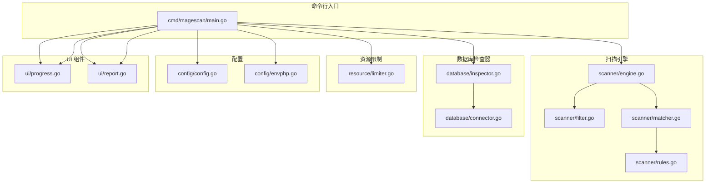
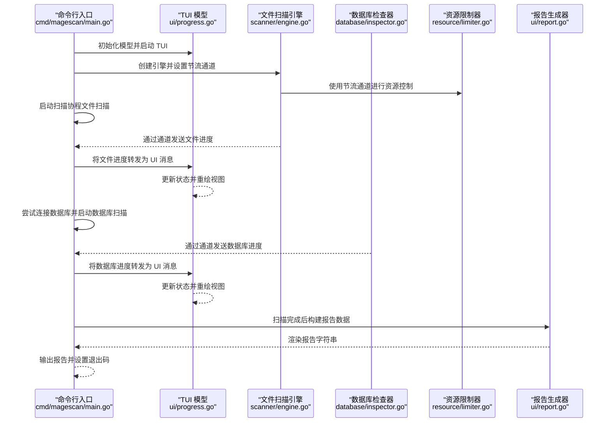
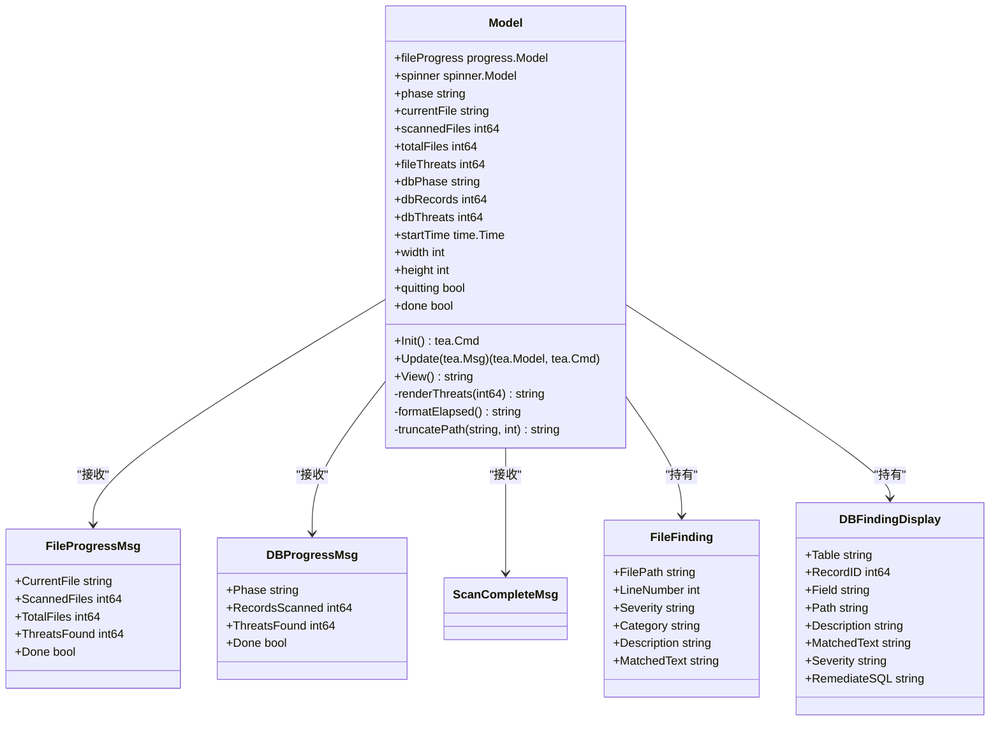
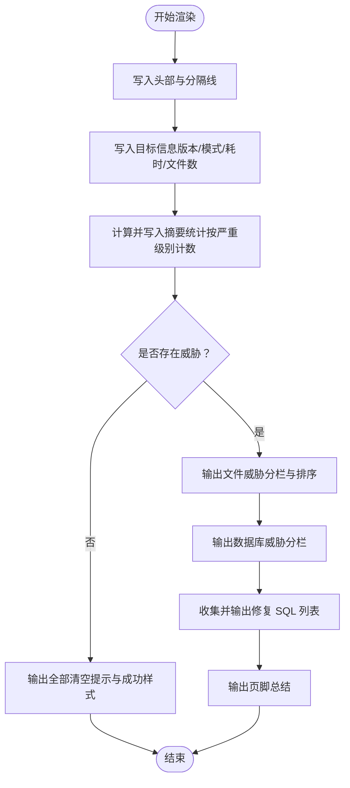
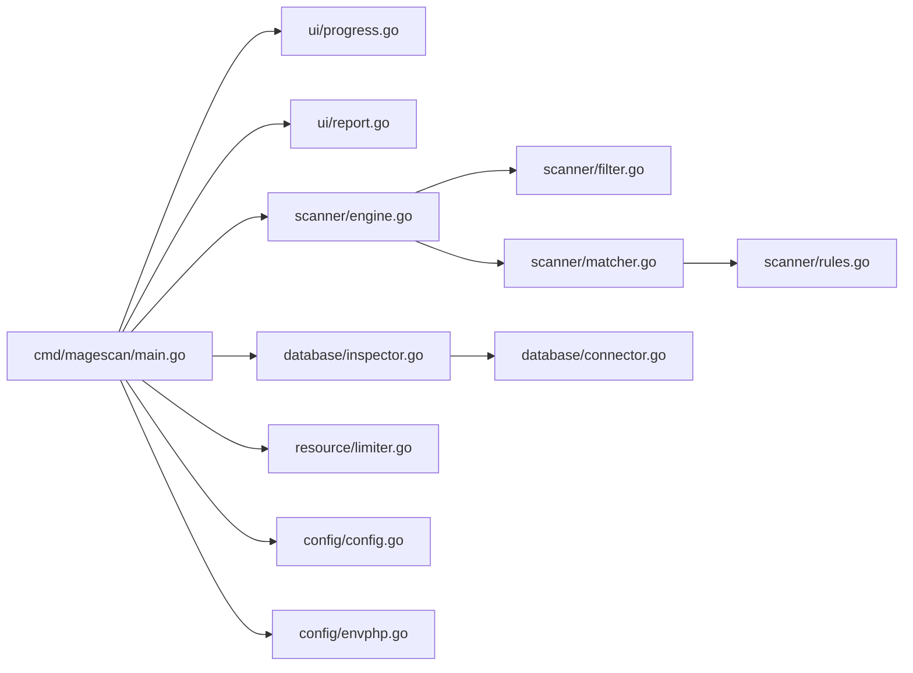

# UI 组件 API

<cite>
**本文引用的文件**
- [ui/progress.go](file://ui/progress.go)
- [ui/report.go](file://ui/report.go)
- [cmd/magescan/main.go](file://cmd/magescan/main.go)
- [scanner/engine.go](file://scanner/engine.go)
- [scanner/filter.go](file://scanner/filter.go)
- [scanner/matcher.go](file://scanner/matcher.go)
- [scanner/rules.go](file://scanner/rules.go)
- [database/inspector.go](file://database/inspector.go)
- [database/connector.go](file://database/connector.go)
- [resource/limiter.go](file://resource/limiter.go)
- [config/config.go](file://config/config.go)
- [config/envphp.go](file://config/envphp.go)
- [README.md](file://README.md)
</cite>

## 目录
1. [简介](#简介)
2. [项目结构](#项目结构)
3. [核心组件](#核心组件)
4. [架构总览](#架构总览)
5. [详细组件分析](#详细组件分析)
6. [依赖分析](#依赖分析)
7. [性能考虑](#性能考虑)
8. [故障排查指南](#故障排查指南)
9. [结论](#结论)
10. [附录](#附录)

## 简介
本文件面向 UI 组件 API，聚焦进度显示与报告生成两大模块，系统性梳理以下内容：
- 进度条组件的数据绑定、状态更新、用户交互机制
- 报告生成器的模板系统、数据格式化、输出选项
- 组件初始化、配置参数、事件回调的使用示例
- TUI 组件的生命周期管理、资源清理、错误处理
- 自定义样式、主题配置、响应式布局的实现指南
- 与扫描引擎和数据库检查器的集成模式与数据传递机制

## 项目结构
UI 组件位于 ui 包中，负责终端用户界面（TUI）的进度展示与最终报告渲染；主程序通过通道将扫描进度与结果传递给 UI 模型，再由模型驱动视图更新与报告生成。

图表来源
- [cmd/magescan/main.go:1-208](file://cmd/magescan/main.go#L1-L208)
- [ui/progress.go:1-289](file://ui/progress.go#L1-L289)
- [ui/report.go:1-230](file://ui/report.go#L1-L230)
- [scanner/engine.go:1-323](file://scanner/engine.go#L1-L323)
- [scanner/filter.go:1-98](file://scanner/filter.go#L1-L98)
- [scanner/matcher.go:1-168](file://scanner/matcher.go#L1-L168)
- [scanner/rules.go:1-468](file://scanner/rules.go#L1-L468)
- [database/inspector.go:1-359](file://database/inspector.go#L1-L359)
- [database/connector.go:1-58](file://database/connector.go#L1-L58)
- [resource/limiter.go:1-118](file://resource/limiter.go#L1-L118)
- [config/config.go:1-108](file://config/config.go#L1-L108)
- [config/envphp.go:1-88](file://config/envphp.go#L1-L88)

章节来源
- [README.md:239-258](file://README.md#L239-L258)

## 核心组件
- 进度显示组件（TUI 模型）
  - 负责文件扫描阶段与数据库扫描阶段的进度展示、威胁统计、时间计时、窗口尺寸适配与用户交互（退出键）。
  - 提供消息类型用于接收扫描进度与完成信号，并在视图中渲染进度条、当前文件、威胁数量与耗时。
- 报告生成组件
  - 负责将扫描结果汇总为可读的终端报告，包括摘要统计、文件威胁、数据库威胁、修复建议与页脚信息。
  - 支持按严重级别排序、截断匹配文本、收集可执行的修复 SQL。

章节来源
- [ui/progress.go:14-289](file://ui/progress.go#L14-L289)
- [ui/report.go:11-230](file://ui/report.go#L11-L230)

## 架构总览
下图展示了从主程序到 UI 组件的数据流与控制流，以及与扫描引擎、数据库检查器的集成方式。

图表来源
- [cmd/magescan/main.go:78-207](file://cmd/magescan/main.go#L78-L207)
- [ui/progress.go:116-197](file://ui/progress.go#L116-L197)
- [ui/report.go:57-168](file://ui/report.go#L57-L168)
- [scanner/engine.go:60-121](file://scanner/engine.go#L60-L121)
- [database/inspector.go:79-109](file://database/inspector.go#L79-L109)
- [resource/limiter.go:54-62](file://resource/limiter.go#L54-L62)

## 详细组件分析

### 进度显示组件（TUI 模型）
- 公共接口与消息类型
  - 文件进度消息：包含当前文件路径、已扫描文件数、总文件数、发现威胁数与是否完成标志。
  - 数据库进度消息：包含扫描阶段名称、已扫描记录数、发现威胁数与是否完成标志。
  - 扫描完成消息：用于触发 UI 结束与退出。
  - 内部数据结构：简化后的文件威胁与数据库威胁展示对象，便于 UI 呈现。
- 状态与生命周期
  - 初始化：启动旋转动画 tick 命令，准备 Spinner 与进度条组件。
  - 更新：处理键盘输入（退出）、窗口尺寸变化、进度消息、动画 tick 与进度条帧更新。
  - 视图：根据当前阶段（文件扫描、数据库扫描、完成）渲染标题、进度条、当前文件、威胁统计与耗时。
- 用户交互
  - 支持 Ctrl+C 或 q 键退出，设置退出标志并触发退出命令。
- 响应式布局
  - 监听窗口尺寸变化，动态调整进度条宽度与路径截断长度，确保在小窗口下仍可完整显示关键信息。
- 样式与主题
  - 使用 Lipgloss 定义标题、边框、阶段标签、威胁提示、安全提示、弱化文本与标签样式，支持颜色与边框风格定制。
- 错误处理
  - 在退出流程中返回空字符串，避免在退出后继续绘制。

图表来源
- [ui/progress.go:14-134](file://ui/progress.go#L14-L134)
- [ui/progress.go:140-197](file://ui/progress.go#L140-L197)
- [ui/progress.go:199-289](file://ui/progress.go#L199-L289)

章节来源
- [ui/progress.go:14-289](file://ui/progress.go#L14-L289)

### 报告生成组件
- 数据模型
  - 报告数据结构包含 Magento 版本、扫描模式、扫描路径、总文件数、耗时、文件威胁列表与数据库威胁列表。
- 报告模板与格式化
  - 头部与分隔线、目标信息、摘要统计（按严重级别计数）、文件威胁与数据库威胁分栏、修复建议 SQL 汇总、页脚总结。
  - 对文件威胁按严重级别排序，对过长的匹配文本进行截断。
- 输出选项
  - 当前实现为终端输出；预留 JSON 输出选项字段以便扩展。
- 错误处理
  - 在无威胁时输出“全部清空”提示与成功样式；有威胁时输出威胁总数与修复建议。

图表来源
- [ui/report.go:57-168](file://ui/report.go#L57-L168)
- [ui/report.go:186-229](file://ui/report.go#L186-L229)

章节来源
- [ui/report.go:11-230](file://ui/report.go#L11-L230)

### 组件初始化与配置参数
- TUI 模型初始化
  - 创建进度条与旋转动画，设置默认渐变与宽度，初始化阶段为文件扫描，记录起始时间，设置初始窗口尺寸。
- 配置参数
  - CLI 参数：路径、扫描模式（fast/full）、CPU 限制、内存限制、输出格式（预留）。
  - 资源限制器：最大 CPU 核心数与内存上限，自动节流与恢复逻辑。
  - 环境解析：从 env.php 中提取数据库主机、端口、用户名、密码、数据库名与表前缀。

章节来源
- [ui/progress.go:116-134](file://ui/progress.go#L116-L134)
- [cmd/magescan/main.go:24-31](file://cmd/magescan/main.go#L24-L31)
- [resource/limiter.go:22-32](file://resource/limiter.go#L22-L32)
- [config/envphp.go:14-71](file://config/envphp.go#L14-L71)

### 事件回调与数据传递机制
- 文件扫描进度
  - 扫描引擎通过通道发送进度消息，主程序将其转换为 UI 文件进度消息并发送至 TUI 模型。
- 数据库扫描进度
  - 数据库检查器通过通道发送进度消息，主程序将其转换为 UI 数据库进度消息并发送至 TUI 模型。
- 扫描完成
  - 主程序在扫描完成后发送扫描完成消息，触发 TUI 结束与退出。
- 报告生成
  - 主程序将扫描结果转换为报告数据结构，调用报告渲染函数输出最终报告。

章节来源
- [scanner/engine.go:38-45](file://scanner/engine.go#L38-L45)
- [database/inspector.go:23-29](file://database/inspector.go#L23-L29)
- [cmd/magescan/main.go:94-151](file://cmd/magescan/main.go#L94-L151)
- [ui/report.go:57-168](file://ui/report.go#L57-L168)

### 生命周期管理与资源清理
- TUI 生命周期
  - 初始化：启动旋转动画 tick。
  - 运行：接收消息、更新状态、重绘视图。
  - 退出：收到退出键或扫描完成消息后，停止动画并退出。
- 资源清理
  - 主程序在退出前关闭数据库连接（如已建立），释放资源。
  - 资源限制器在停止时恢复原始 GOMAXPROCS 设置。

章节来源
- [ui/progress.go:136-138](file://ui/progress.go#L136-L138)
- [cmd/magescan/main.go:113-114](file://cmd/magescan/main.go#L113-L114)
- [resource/limiter.go:46-52](file://resource/limiter.go#L46-L52)

### 自定义样式、主题配置与响应式布局
- 自定义样式
  - 标题、边框、阶段标签、威胁与安全提示、弱化文本与标签均使用 Lipgloss 定义，支持颜色与边框风格定制。
- 主题配置
  - 可通过修改样式常量（颜色值、边框类型、字体粗细等）实现主题切换。
- 响应式布局
  - 监听窗口尺寸变化，动态调整进度条宽度与路径显示长度，保证在不同终端尺寸下的可读性。

章节来源
- [ui/progress.go:84-114](file://ui/progress.go#L84-L114)
- [ui/progress.go:149-159](file://ui/progress.go#L149-L159)
- [ui/progress.go:279-288](file://ui/progress.go#L279-L288)

### 与扫描引擎和数据库检查器的集成模式
- 扫描引擎集成
  - 主程序创建引擎实例，设置节流通道以配合资源限制器；扫描过程中通过通道发送进度消息；扫描结束后收集文件威胁。
- 数据库检查器集成
  - 主程序解析 env.php 获取数据库配置与表前缀；创建连接器并连接数据库；创建检查器实例，扫描指定表并发送进度消息；扫描结束后收集数据库威胁。
- 数据传递
  - 通过通道进行异步消息传递，避免阻塞 UI；主程序负责将不同来源的消息转换为统一的 UI 消息类型。

章节来源
- [scanner/engine.go:60-121](file://scanner/engine.go#L60-L121)
- [database/inspector.go:79-109](file://database/inspector.go#L79-L109)
- [cmd/magescan/main.go:94-151](file://cmd/magescan/main.go#L94-L151)

## 依赖分析
- 组件耦合
  - UI 模型依赖 Bubble Tea 的消息循环与 Lipgloss 的样式系统，内部聚合进度条与旋转动画组件。
  - 主程序作为编排者，依赖扫描引擎、数据库检查器、资源限制器与配置模块，负责消息转发与报告生成。
- 外部依赖
  - Bubble Tea：TUI 框架，提供消息循环、命令与视图渲染。
  - Lipgloss：终端样式库，用于定义 UI 样式。
  - MySQL 驱动：数据库连接与查询。
- 循环依赖
  - 未发现循环依赖；各模块职责清晰，通过通道与接口解耦。

图表来源
- [cmd/magescan/main.go:1-208](file://cmd/magescan/main.go#L1-L208)
- [ui/progress.go:1-289](file://ui/progress.go#L1-L289)
- [ui/report.go:1-230](file://ui/report.go#L1-L230)
- [scanner/engine.go:1-323](file://scanner/engine.go#L1-L323)
- [scanner/filter.go:1-98](file://scanner/filter.go#L1-L98)
- [scanner/matcher.go:1-168](file://scanner/matcher.go#L1-L168)
- [scanner/rules.go:1-468](file://scanner/rules.go#L1-L468)
- [database/inspector.go:1-359](file://database/inspector.go#L1-L359)
- [database/connector.go:1-58](file://database/connector.go#L1-L58)
- [resource/limiter.go:1-118](file://resource/limiter.go#L1-L118)
- [config/config.go:1-108](file://config/config.go#L1-L108)
- [config/envphp.go:1-88](file://config/envphp.go#L1-L88)

## 性能考虑
- 进度刷新频率
  - 文件扫描采用固定间隔（每 N 个文件）发送进度消息，避免过度刷新导致 UI 卡顿。
- 资源限制与节流
  - 通过资源限制器监控内存使用，超过阈值时向扫描引擎发送节流信号，降低并发压力；内存回落至阈值的 80% 时解除节流。
- 大文件处理
  - 扫描引擎对大文件采用重叠块读取策略，减少内存峰值，提高稳定性。
- 并发与等待组
  - 扫描引擎使用工作池与等待组，充分利用多核 CPU，同时保证任务有序完成。

章节来源
- [scanner/engine.go:13-17](file://scanner/engine.go#L13-L17)
- [scanner/engine.go:196-227](file://scanner/engine.go#L196-L227)
- [resource/limiter.go:64-117](file://resource/limiter.go#L64-L117)

## 故障排查指南
- TUI 无法退出
  - 确认是否正确监听退出键（Ctrl+C 或 q），检查消息循环是否正常接收键盘消息。
- 进度条不更新
  - 检查主程序是否正确转发文件进度与数据库进度消息，确认通道未被阻塞。
- 报告为空
  - 确认扫描已完成且已发送扫描完成消息；检查报告数据构建过程中的字段映射。
- 数据库连接失败
  - 检查 env.php 解析是否成功，确认主机、端口、用户名、密码与数据库名正确；确认数据库可达且驱动可用。
- 内存过高
  - 调整内存限制参数，启用资源限制器的节流机制；检查是否有异常大文件导致内存峰值。

章节来源
- [ui/progress.go:140-197](file://ui/progress.go#L140-L197)
- [cmd/magescan/main.go:128-151](file://cmd/magescan/main.go#L128-L151)
- [config/envphp.go:14-71](file://config/envphp.go#L14-L71)
- [resource/limiter.go:78-117](file://resource/limiter.go#L78-L117)

## 结论
UI 组件 API 通过清晰的消息契约与模块化设计，实现了高效的进度展示与报告生成。其与扫描引擎、数据库检查器的集成基于通道与统一消息类型，具备良好的可扩展性与可维护性。通过资源限制与响应式布局，UI 在不同环境下均能提供稳定、直观的用户体验。

## 附录
- 使用示例（步骤说明）
  - 初始化 TUI 模型并启动程序，等待文件扫描进度消息到达，查看进度条与当前文件信息。
  - 数据库扫描阶段开始后，观察数据库扫描阶段的进度与威胁统计。
  - 扫描完成后，查看最终报告，包含摘要、威胁详情与修复建议。
- 高级功能建议
  - 自定义样式：修改 Lipgloss 样式常量以适配不同主题。
  - 响应式布局：根据窗口尺寸动态调整列宽与文本截断策略。
  - 输出扩展：在现有基础上增加 JSON 输出选项，便于与其他工具集成。