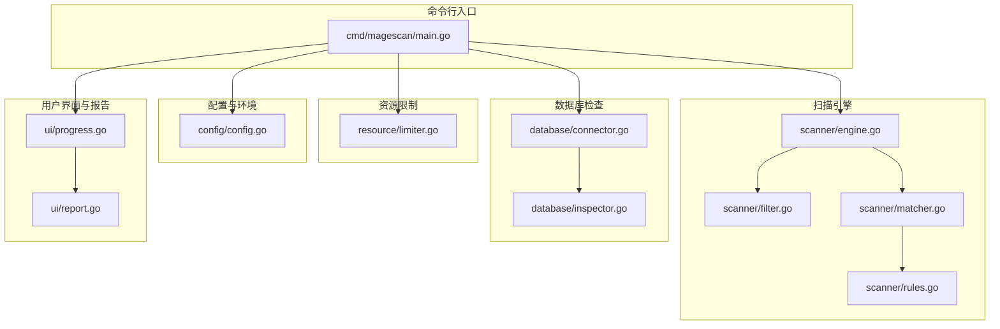
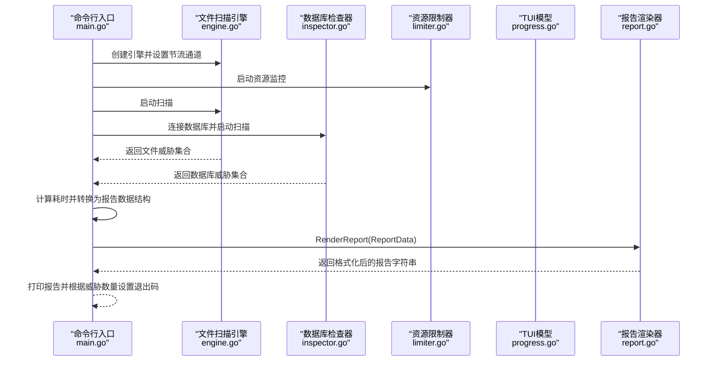
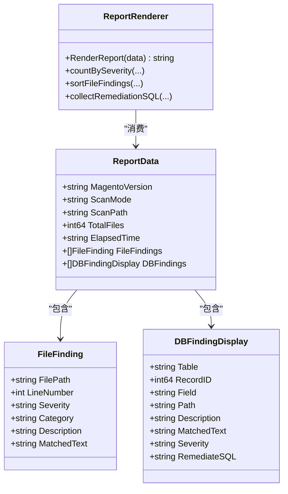
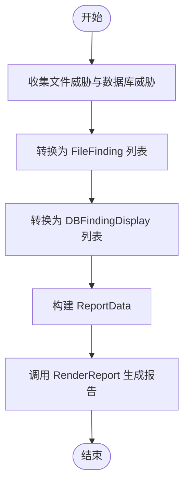
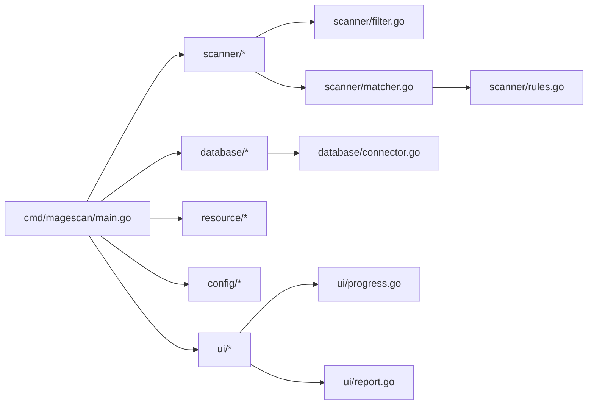

# 报告生成组件 API

<cite>
**本文引用的文件列表**
- [ui/report.go](file://ui/report.go)
- [ui/progress.go](file://ui/progress.go)
- [cmd/magescan/main.go](file://cmd/magescan/main.go)
- [scanner/engine.go](file://scanner/engine.go)
- [scanner/filter.go](file://scanner/filter.go)
- [scanner/matcher.go](file://scanner/matcher.go)
- [scanner/rules.go](file://scanner/rules.go)
- [database/inspector.go](file://database/inspector.go)
- [database/connector.go](file://database/connector.go)
- [resource/limiter.go](file://resource/limiter.go)
- [config/config.go](file://config/config.go)
- [README.md](file://README.md)
</cite>

## 目录
1. [简介](#简介)
2. [项目结构](#项目结构)
3. [核心组件](#核心组件)
4. [架构总览](#架构总览)
5. [详细组件分析](#详细组件分析)
6. [依赖关系分析](#依赖关系分析)
7. [性能考量](#性能考量)
8. [故障排查指南](#故障排查指南)
9. [结论](#结论)
10. [附录](#附录)

## 简介
本文件为“报告生成组件 API”的权威技术文档，聚焦于报告模板系统、数据格式化、输出选项等核心能力，系统性说明 FileFinding、DBFindingDisplay 等数据结构的字段定义与使用方法；解释报告生成器的初始化配置、数据绑定、格式化选项等技术实现；提供终端文本输出（当前实现）与 JSON 输出（预留扩展）的配置方法；涵盖报告内容组织结构、威胁分类展示、修复建议生成等功能；阐明与扫描结果数据的集成模式、数据转换处理、性能优化策略；并给出自定义报告模板、样式配置、批量导出等高级功能的实现指南。

## 项目结构
报告生成组件位于 ui 包中，负责将扫描引擎与数据库检查器的结果汇总为最终报告，并以终端文本形式呈现。主程序通过命令行参数控制扫描模式、资源限制与输出格式（当前实现为终端输出），随后将结果转换为报告所需的数据结构并调用渲染函数生成报告字符串。

图表来源
- [cmd/magescan/main.go:1-208](file://cmd/magescan/main.go#L1-L208)
- [scanner/engine.go:1-323](file://scanner/engine.go#L1-L323)
- [scanner/filter.go:1-98](file://scanner/filter.go#L1-L98)
- [scanner/matcher.go:1-168](file://scanner/matcher.go#L1-L168)
- [scanner/rules.go:1-468](file://scanner/rules.go#L1-L468)
- [database/connector.go:1-58](file://database/connector.go#L1-L58)
- [database/inspector.go:1-359](file://database/inspector.go#L1-L359)
- [resource/limiter.go:1-118](file://resource/limiter.go#L1-L118)
- [config/config.go:1-108](file://config/config.go#L1-L108)
- [ui/progress.go:1-289](file://ui/progress.go#L1-L289)
- [ui/report.go:1-230](file://ui/report.go#L1-L230)

章节来源
- [cmd/magescan/main.go:1-208](file://cmd/magescan/main.go#L1-L208)
- [ui/report.go:1-230](file://ui/report.go#L1-L230)
- [ui/progress.go:1-289](file://ui/progress.go#L1-L289)

## 核心组件
- 报告数据模型：ReportData 聚合 Magento 版本、扫描模式、目标路径、耗时、文件扫描威胁数、文件威胁集合、数据库威胁集合等。
- 文件威胁数据：FileFinding 表示单个文件威胁，包含文件路径、行号、严重级别、类别、描述、匹配文本等。
- 数据库威胁数据：DBFindingDisplay 表示数据库威胁，包含表名、记录ID、字段、路径（如适用）、描述、匹配文本、严重级别、修复SQL等。
- 报告渲染器：RenderReport 将上述数据结构格式化为带颜色与分隔线的终端文本报告，支持威胁计数、按严重级别排序、修复建议汇总等。
- TUI 模型与消息：用于在扫描过程中实时显示进度与状态，便于在终端中观察扫描进展。

章节来源
- [ui/report.go:11-20](file://ui/report.go#L11-L20)
- [ui/progress.go:32-52](file://ui/progress.go#L32-L52)
- [ui/report.go:57-168](file://ui/report.go#L57-L168)

## 架构总览
报告生成组件的调用链路如下：
- 主程序解析 CLI 参数，检测 Magento 根目录与版本，读取 env.php 获取数据库配置，启动资源限制器，创建扫描通道，运行文件扫描与数据库扫描。
- 扫描完成后，主程序将扫描结果转换为报告所需的简化数据结构（FileFinding、DBFindingDisplay），构建 ReportData 并调用 RenderReport 生成最终报告。
- 当前实现仅支持终端文本输出；JSON 输出为预留扩展项。

图表来源
- [cmd/magescan/main.go:94-207](file://cmd/magescan/main.go#L94-L207)
- [scanner/engine.go:76-121](file://scanner/engine.go#L76-L121)
- [database/inspector.go:79-109](file://database/inspector.go#L79-L109)
- [resource/limiter.go:34-52](file://resource/limiter.go#L34-L52)
- [ui/progress.go:140-197](file://ui/progress.go#L140-L197)
- [ui/report.go:57-168](file://ui/report.go#L57-L168)

## 详细组件分析

### 报告数据模型与渲染器
- ReportData 字段
  - MagentoVersion：Magento 版本字符串
  - ScanMode：扫描模式（例如“Fast Scan”或“Full Scan”）
  - ScanPath：扫描目标路径
  - TotalFiles：已扫描文件数（由引擎统计）
  - ElapsedTime：扫描耗时（分钟:秒）
  - FileFindings：文件威胁集合
  - DBFindings：数据库威胁集合
- 渲染流程
  - 头部标题与目标信息
  - 统计摘要（按严重级别计数）
  - 文件威胁区域（按严重级别排序展示）
  - 数据库威胁区域（含修复SQL提示）
  - 修复建议汇总（收集所有可用的修复SQL）
  - 页脚与扫描完成提示
- 风险标签与样式
  - 使用 lipgloss 对不同严重级别进行颜色标记
  - 文件路径与SQL文本采用特定样式突出显示
- 排序与聚合
  - 文件威胁按严重级别排序
  - 威胁总数按严重级别统计

图表来源
- [ui/report.go:11-20](file://ui/report.go#L11-L20)
- [ui/progress.go:32-52](file://ui/progress.go#L32-L52)
- [ui/report.go:57-168](file://ui/report.go#L57-L168)

章节来源
- [ui/report.go:11-230](file://ui/report.go#L11-L230)
- [ui/progress.go:32-52](file://ui/progress.go#L32-L52)

### 扫描结果到报告数据的转换
- 文件威胁转换
  - 将引擎返回的 Finding 结构映射为 FileFinding，包括路径、行号、严重级别（字符串）、类别、描述、匹配文本。
- 数据库威胁转换
  - 将数据库检查器返回的 DBFinding 映射为 DBFindingDisplay，包括表名、记录ID、字段、路径（如适用）、描述、匹配文本、严重级别、修复SQL。
- 报告数据构建
  - 从引擎统计与时间计算填充 ReportData，调用 RenderReport 生成最终报告。

图表来源
- [cmd/magescan/main.go:159-201](file://cmd/magescan/main.go#L159-L201)
- [ui/report.go:57-168](file://ui/report.go#L57-L168)

章节来源
- [cmd/magescan/main.go:159-201](file://cmd/magescan/main.go#L159-L201)

### 报告内容组织与威胁分类展示
- 组织结构
  - 标题与目标信息
  - 摘要（按严重级别统计）
  - 文件威胁（按严重级别排序）
  - 数据库威胁（含修复建议）
  - 修复汇总（所有可用修复SQL）
  - 页脚与扫描完成提示
- 分类与严重级别
  - 规则类别来源于扫描规则（WebShell/Backdoor、Payment Skimmer、Obfuscation、Magento-Specific）
  - 严重级别来源于 Severity 枚举（Critical、High、Medium、Low）

章节来源
- [ui/report.go:57-168](file://ui/report.go#L57-L168)
- [scanner/rules.go:29-48](file://scanner/rules.go#L29-L48)
- [scanner/rules.go:6-27](file://scanner/rules.go#L6-L27)

### 修复建议生成
- 数据库威胁包含 RemediateSQL 字段，用于生成可直接执行的修复SQL。
- 报告渲染阶段会收集所有 RemediateSQL 并汇总展示，便于管理员审阅后执行。

章节来源
- [database/inspector.go:11-21](file://database/inspector.go#L11-L21)
- [ui/report.go:149-160](file://ui/report.go#L149-L160)

### 输出格式与配置
- 当前实现
  - 终端文本输出：通过 RenderReport 生成带颜色与分隔线的文本报告。
- 预留扩展
  - CLI 提供 -output 标志，默认 terminal，预留 json 选项，可在后续版本中实现 JSON 报告输出。

章节来源
- [cmd/magescan/main.go:24-34](file://cmd/magescan/main.go#L24-L34)
- [README.md:74-83](file://README.md#L74-L83)

### 初始化配置与数据绑定
- 配置来源
  - CLI 参数：-path、-mode、-cpu-limit、-mem-limit、-output
  - 环境检测：自动检测 Magento 根目录与版本，解析 env.php 获取数据库配置
- 数据绑定
  - 扫描结果经转换后绑定到 ReportData，再交由渲染器生成报告

章节来源
- [cmd/magescan/main.go:24-65](file://cmd/magescan/main.go#L24-L65)
- [config/config.go:49-107](file://config/config.go#L49-L107)

### 自定义报告模板与样式配置
- 当前实现
  - 使用 lipgloss 定义标题、严重级别、路径、SQL、成功提示等样式，集中于全局变量。
- 自定义建议
  - 可通过扩展 ReportData 字段（如自定义元数据、Logo、公司信息）并在 RenderReport 中增加对应区块。
  - 可引入外部模板引擎（如 Go template）以支持更灵活的模板与样式分离。
  - 可新增样式配置结构体，允许在运行时注入主题色与布局参数。

章节来源
- [ui/report.go:22-55](file://ui/report.go#L22-L55)

### 批量导出与多格式支持
- 当前实现
  - 仅终端文本输出。
- 扩展建议
  - 在 RenderReport 基础上新增 JSON 渲染函数，将 ReportData 序列化为 JSON。
  - 支持将报告写入文件，结合 -output=json 与文件重定向实现批量导出。
  - 保持现有样式不变，新增格式化器以满足不同消费场景。

章节来源
- [cmd/magescan/main.go:30-34](file://cmd/magescan/main.go#L30-L34)
- [README.md:74-83](file://README.md#L74-L83)

## 依赖关系分析
- 组件耦合
  - main.go 依赖 scanner、database、resource、config、ui 模块，负责编排与数据转换。
  - scanner 依赖 filter、matcher、rules，形成规则驱动的文件扫描。
  - database 依赖 connector，提供只读连接与表前缀支持。
  - ui 依赖 progress 与 report，分别负责进度与报告渲染。
- 外部依赖
  - TUI 与样式：lipgloss、bubbletea
  - 数据库驱动：go-sql-driver/mysql
- 循环依赖
  - 未发现循环依赖，模块职责清晰。

图表来源
- [cmd/magescan/main.go:1-208](file://cmd/magescan/main.go#L1-L208)
- [scanner/filter.go:1-98](file://scanner/filter.go#L1-L98)
- [scanner/matcher.go:1-168](file://scanner/matcher.go#L1-L168)
- [scanner/rules.go:1-468](file://scanner/rules.go#L1-L468)
- [database/connector.go:1-58](file://database/connector.go#L1-L58)
- [ui/progress.go:1-289](file://ui/progress.go#L1-L289)
- [ui/report.go:1-230](file://ui/report.go#L1-L230)

章节来源
- [cmd/magescan/main.go:1-208](file://cmd/magescan/main.go#L1-L208)

## 性能考量
- 扫描引擎
  - 工作池：默认 2×CPU 核心并发扫描
  - 大文件分块：超过阈值的文件以重叠块方式读取，避免内存峰值
  - 进度与信号：支持上下文取消，优雅终止
- 资源限制
  - CPU 限制：通过 GOMAXPROCS 控制最大并发
  - 内存限制：后台监控每 500ms 检查 Alloc，超限时触发节流通道，GC 回收后恢复
- 报告渲染
  - 使用 strings.Builder 拼接，减少内存分配
  - 严重级别排序与聚合在内存中完成，复杂度与威胁数量线性相关

章节来源
- [scanner/engine.go:61-69](file://scanner/engine.go#L61-L69)
- [scanner/engine.go:248-285](file://scanner/engine.go#L248-L285)
- [resource/limiter.go:34-52](file://resource/limiter.go#L34-L52)
- [resource/limiter.go:64-117](file://resource/limiter.go#L64-L117)
- [ui/report.go:57-168](file://ui/report.go#L57-L168)

## 故障排查指南
- 环境检测失败
  - 确认目标路径包含 app/etc/env.php 与 bin/magento
  - 检查路径是否为 Magento 根目录
- 数据库连接问题
  - 确认 env.php 解析成功且数据库可达
  - 检查主机、端口、用户名、密码、数据库名
- 资源限制导致扫描缓慢
  - 调整 -cpu-limit 与 -mem-limit 参数
  - 观察内存使用，必要时降低并发或内存上限
- 报告为空或威胁数为0
  - 检查扫描模式（fast/full）与过滤器配置
  - 确认规则集覆盖目标威胁类型

章节来源
- [config/config.go:49-107](file://config/config.go#L49-L107)
- [database/connector.go:16-39](file://database/connector.go#L16-L39)
- [resource/limiter.go:34-52](file://resource/limiter.go#L34-L52)
- [scanner/filter.go:56-98](file://scanner/filter.go#L56-L98)

## 结论
报告生成组件以清晰的数据模型与稳定的渲染流程为核心，实现了从扫描结果到终端文本报告的完整闭环。当前实现专注于高质量的终端文本输出，并通过样式与结构化布局提升可读性。未来可通过引入 JSON 输出、模板引擎与样式配置，进一步增强报告的可定制性与多格式导出能力，满足更广泛的审计与合规需求。

## 附录

### API 接口规范（面向使用者）
- 输入
  - ReportData：包含目标信息、耗时、文件威胁与数据库威胁集合
- 处理
  - 按严重级别统计与排序
  - 生成文件威胁与数据库威胁区块
  - 汇总修复SQL建议
- 输出
  - 终端文本报告（带颜色与分隔线）

章节来源
- [ui/report.go:57-168](file://ui/report.go#L57-L168)

### 数据结构字段定义
- ReportData
  - MagentoVersion：字符串
  - ScanMode：字符串
  - ScanPath：字符串
  - TotalFiles：整数
  - ElapsedTime：字符串
  - FileFindings：数组（FileFinding）
  - DBFindings：数组（DBFindingDisplay）
- FileFinding
  - FilePath：字符串
  - LineNumber：整数
  - Severity：字符串（CRITICAL/HIGH/MEDIUM/LOW）
  - Category：字符串（规则类别）
  - Description：字符串
  - MatchedText：字符串
- DBFindingDisplay
  - Table：字符串
  - RecordID：整数
  - Field：字符串
  - Path：字符串（如适用）
  - Description：字符串
  - MatchedText：字符串
  - Severity：字符串（CRITICAL/HIGH/MEDIUM/LOW）
  - RemediateSQL：字符串（修复SQL）

章节来源
- [ui/report.go:11-20](file://ui/report.go#L11-L20)
- [ui/progress.go:32-52](file://ui/progress.go#L32-L52)

### 报告生成器初始化与配置
- 初始化
  - 由主程序在扫描结束后构建 ReportData 并调用 RenderReport
- 配置
  - CLI 参数控制扫描模式、资源限制与输出格式（预留 JSON）
  - 环境检测与数据库配置解析由 config 与 database 模块提供

章节来源
- [cmd/magescan/main.go:24-65](file://cmd/magescan/main.go#L24-L65)
- [config/config.go:49-107](file://config/config.go#L49-L107)

### 与扫描结果数据的集成模式
- 文件扫描
  - 引擎返回 Finding 数组，主程序转换为 FileFinding 并加入 ReportData
- 数据库扫描
  - 检查器返回 DBFinding 数组，主程序转换为 DBFindingDisplay 并加入 ReportData
- 进度与状态
  - TUI 通过消息通道接收扫描进度，最终在报告中汇总威胁统计

章节来源
- [scanner/engine.go:76-121](file://scanner/engine.go#L76-L121)
- [database/inspector.go:79-109](file://database/inspector.go#L79-L109)
- [ui/progress.go:140-197](file://ui/progress.go#L140-L197)

### 数据转换处理
- 字段映射
  - Severity、Category、Description、MatchedText 等字段从扫描结果直接映射
  - FileFindings 与 DBFindings 通过结构体转换完成
- 文本截断
  - 匹配文本在渲染前进行长度截断，确保报告可读性

章节来源
- [cmd/magescan/main.go:159-201](file://cmd/magescan/main.go#L159-L201)
- [scanner/matcher.go:145-151](file://scanner/matcher.go#L145-L151)
- [database/inspector.go:343-349](file://database/inspector.go#L343-L349)

### 性能优化策略
- 扫描阶段
  - 并发工作池、大文件分块读取、进度与信号处理
- 资源限制
  - CPU 与内存上限控制、自动节流与 GC 协调
- 渲染阶段
  - 使用高效字符串拼接与样式缓存

章节来源
- [scanner/engine.go:61-69](file://scanner/engine.go#L61-L69)
- [scanner/engine.go:248-285](file://scanner/engine.go#L248-L285)
- [resource/limiter.go:64-117](file://resource/limiter.go#L64-L117)
- [ui/report.go:57-168](file://ui/report.go#L57-L168)