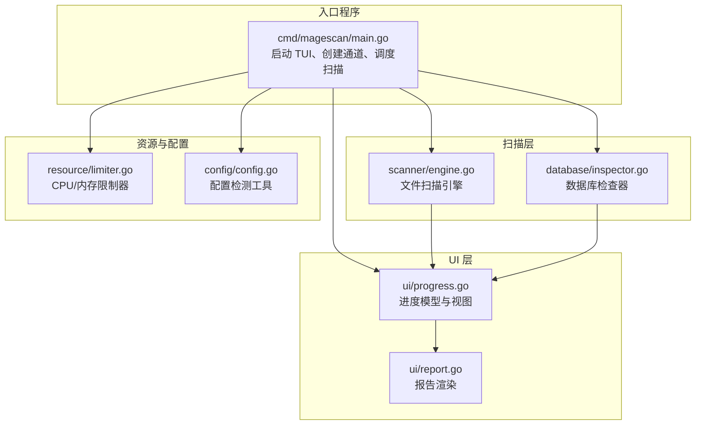
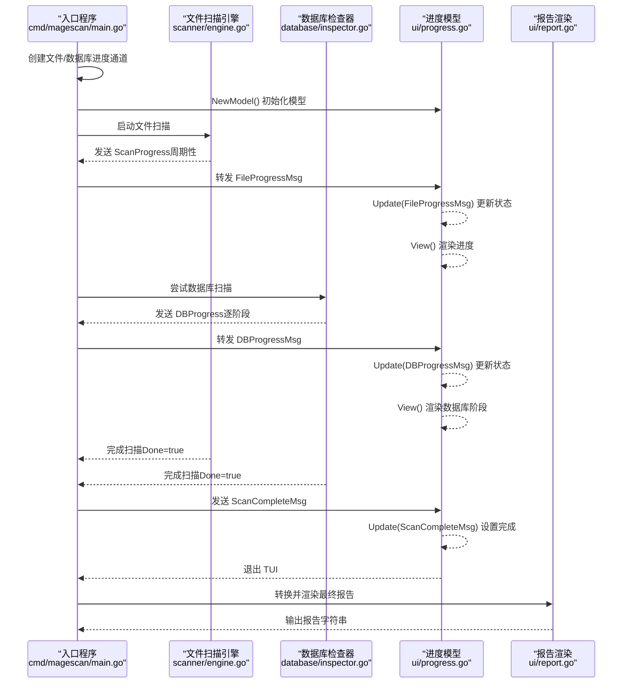
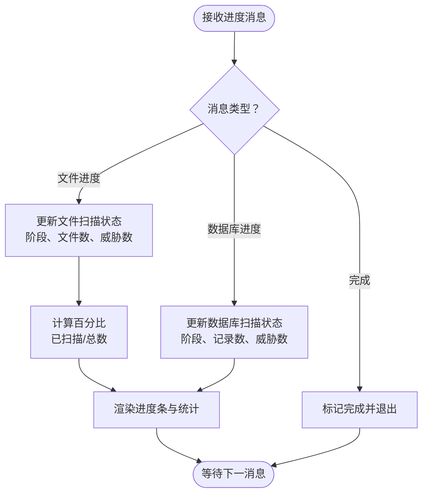
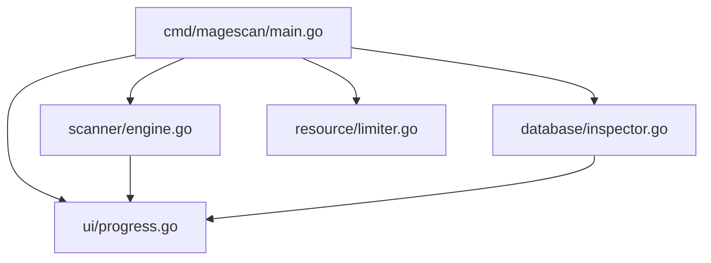

# 进度显示组件 API

<cite>
**本文档引用的文件**
- [ui/progress.go](file://ui/progress.go)
- [scanner/engine.go](file://scanner/engine.go)
- [database/inspector.go](file://database/inspector.go)
- [cmd/magescan/main.go](file://cmd/magescan/main.go)
- [ui/report.go](file://ui/report.go)
- [resource/limiter.go](file://resource/limiter.go)
- [config/config.go](file://config/config.go)
- [README.md](file://README.md)
</cite>

## 目录
1. [简介](#简介)
2. [项目结构](#项目结构)
3. [核心组件](#核心组件)
4. [架构总览](#架构总览)
5. [详细组件分析](#详细组件分析)
6. [依赖关系分析](#依赖关系分析)
7. [性能考量](#性能考量)
8. [故障排除指南](#故障排除指南)
9. [结论](#结论)
10. [附录](#附录)

## 简介
本文件为进度显示组件 API 的权威技术文档，聚焦于基于 Bubble Tea 框架的终端用户界面（TUI）实现，涵盖以下主题：
- 进度条组件与文件扫描进度、数据库扫描进度的消息类型定义与数据结构
- Model 结构体的状态管理、样式定制与用户交互处理机制
- 初始化配置、动态更新、窗口尺寸适配的技术实现
- 百分比计算、实时状态同步、事件循环与键盘快捷键支持
- 与 Bubble Tea 框架的集成方式与最佳实践

该组件在主程序中通过通道驱动，将扫描引擎与数据库检查器产生的进度信息转换为 UI 可视化，并在扫描完成后生成最终报告。

**章节来源**
- [README.md:1-272](file://README.md#L1-L272)

## 项目结构
进度显示组件位于 ui 包中，与扫描引擎、数据库检查器、资源限制器以及入口程序协同工作。整体结构如下图所示：

**图表来源**
- [cmd/magescan/main.go:1-208](file://cmd/magescan/main.go#L1-L208)
- [ui/progress.go:1-289](file://ui/progress.go#L1-L289)
- [ui/report.go:1-230](file://ui/report.go#L1-L230)
- [scanner/engine.go:1-323](file://scanner/engine.go#L1-L323)
- [database/inspector.go:1-359](file://database/inspector.go#L1-L359)
- [resource/limiter.go:1-118](file://resource/limiter.go#L1-L118)
- [config/config.go:1-108](file://config/config.go#L1-L108)

**章节来源**
- [cmd/magescan/main.go:1-208](file://cmd/magescan/main.go#L1-L208)
- [ui/progress.go:1-289](file://ui/progress.go#L1-L289)
- [ui/report.go:1-230](file://ui/report.go#L1-L230)
- [scanner/engine.go:1-323](file://scanner/engine.go#L1-L323)
- [database/inspector.go:1-359](file://database/inspector.go#L1-L359)
- [resource/limiter.go:1-118](file://resource/limiter.go#L1-L118)
- [config/config.go:1-108](file://config/config.go#L1-L108)

## 核心组件
本节对进度显示组件的关键类型、消息与方法进行系统性梳理，帮助开发者快速理解接口规范与使用方式。

- 消息类型
  - FileProgressMsg：文件扫描进度消息，包含当前文件路径、已扫描文件数、总文件数、威胁数量与是否完成标志
  - DBProgressMsg：数据库扫描进度消息，包含阶段名称、已扫描记录数、威胁数量与是否完成标志
  - ScanCompleteMsg：扫描完成消息，用于通知 UI 所有扫描阶段结束

- 数据展示结构
  - FileFinding：文件威胁简化展示结构，包含文件路径、行号、严重级别、类别、描述与匹配文本
  - DBFindingDisplay：数据库威胁简化展示结构，包含表名、记录 ID、字段、路径、描述、匹配文本、严重级别与修复 SQL

- Model 结构体
  - 进度组件：文件进度条与旋转指示器
  - 状态字段：当前阶段、当前文件、扫描统计、威胁计数、开始时间
  - 结果存储：文件与数据库威胁列表
  - 尺寸控制：宽度与高度
  - 控制标志：退出与完成标志

- 关键方法
  - NewModel：初始化进度模型，设置默认进度条与旋转指示器样式
  - Init：启动 UI 事件循环时的初始命令（旋转指示器 Tick）
  - Update：处理 Bubble Tea 消息，包括键盘输入、窗口尺寸变化、进度消息与内部组件消息
  - View：渲染标题、阶段、进度条、当前文件、威胁统计与数据库扫描状态
  - 辅助方法：威胁标签渲染、耗时格式化、路径截断

**章节来源**
- [ui/progress.go:14-114](file://ui/progress.go#L14-L114)
- [ui/progress.go:54-82](file://ui/progress.go#L54-L82)
- [ui/progress.go:116-134](file://ui/progress.go#L116-L134)
- [ui/progress.go:136-197](file://ui/progress.go#L136-L197)
- [ui/progress.go:199-289](file://ui/progress.go#L199-L289)

## 架构总览
下图展示了从入口程序到 UI 的端到端流程，包括通道驱动的进度更新与最终报告生成：

**图表来源**
- [cmd/magescan/main.go:78-157](file://cmd/magescan/main.go#L78-L157)
- [scanner/engine.go:38-45](file://scanner/engine.go#L38-L45)
- [database/inspector.go:23-29](file://database/inspector.go#L23-L29)
- [ui/progress.go:161-183](file://ui/progress.go#L161-L183)

**章节来源**
- [cmd/magescan/main.go:78-157](file://cmd/magescan/main.go#L78-L157)
- [scanner/engine.go:38-45](file://scanner/engine.go#L38-L45)
- [database/inspector.go:23-29](file://database/inspector.go#L23-L29)
- [ui/progress.go:161-183](file://ui/progress.go#L161-L183)

## 详细组件分析

### 消息类型与数据结构
- FileProgressMsg
  - 字段：当前文件路径、已扫描文件数、总文件数、威胁数量、完成标志
  - 用途：驱动文件扫描阶段的进度条与统计信息更新
  - 触发时机：文件扫描引擎周期性发送或扫描结束时

- DBProgressMsg
  - 字段：阶段名称（如 core_config_data、cms_block 等）、已扫描记录数、威胁数量、完成标志
  - 用途：驱动数据库扫描阶段的阶段切换与统计信息更新
  - 触发时机：数据库检查器每个阶段结束后发送

- ScanCompleteMsg
  - 字段：空
  - 用途：通知 UI 所有扫描阶段完成，触发退出逻辑

- FileFinding 与 DBFindingDisplay
  - 用途：将原始威胁对象映射为 UI 展示所需的最小字段集合，便于报告渲染与 UI 显示

**章节来源**
- [ui/progress.go:14-31](file://ui/progress.go#L14-L31)
- [ui/progress.go:32-52](file://ui/progress.go#L32-L52)
- [scanner/engine.go:38-45](file://scanner/engine.go#L38-L45)
- [database/inspector.go:23-29](file://database/inspector.go#L23-L29)

### Model 结构体与状态管理
- 组件字段
  - 文件进度条：progress.Model
  - 旋转指示器：spinner.Model
- 状态字段
  - 阶段：file_scan、db_scan、complete
  - 文件扫描：当前文件、已扫描文件数、总文件数、威胁数量
  - 数据库扫描：阶段名称、记录数、威胁数量
  - 时间：开始时间
- 结果存储
  - 文件威胁列表、数据库威胁列表
- 尺寸控制
  - 宽度与高度，用于自适应布局与路径截断
- 控制标志
  - 退出与完成标志，用于优雅退出与状态同步

**章节来源**
- [ui/progress.go:54-82](file://ui/progress.go#L54-L82)

### 初始化与事件循环
- NewModel
  - 初始化进度条与旋转指示器，设置默认渐变与宽度
  - 设置初始阶段为文件扫描，记录开始时间与默认尺寸
- Init
  - 返回批量命令，启动旋转指示器 Tick
- Update
  - 键盘事件：支持 Ctrl+C 与 q 退出
  - 窗口尺寸消息：动态调整进度条宽度范围
  - 文件进度消息：更新文件扫描状态与阶段
  - 数据库进度消息：更新数据库扫描状态与阶段
  - 完成消息：标记完成并退出
  - 内部组件消息：委托给进度条与旋转指示器更新
- View
  - 渲染标题、阶段、进度条与百分比、当前文件路径、威胁统计与耗时
  - 条件渲染数据库扫描阶段与结果

**章节来源**
- [ui/progress.go:116-134](file://ui/progress.go#L116-L134)
- [ui/progress.go:136-197](file://ui/progress.go#L136-L197)
- [ui/progress.go:199-289](file://ui/progress.go#L199-L289)

### 百分比计算与实时状态同步
- 百分比计算
  - 基于文件扫描：已扫描文件数除以总文件数，避免除零
  - 使用进度条组件的 ViewAs 方法渲染带百分比的进度条
- 实时状态同步
  - 文件扫描：通过通道周期性发送 ScanProgress，UI 接收后更新 Model 并重绘
  - 数据库扫描：每个阶段结束后发送 DBProgress，UI 更新阶段与统计
  - 完成信号：扫描完成后发送 ScanCompleteMsg，触发退出

**图表来源**
- [ui/progress.go:161-183](file://ui/progress.go#L161-L183)
- [ui/progress.go:217-226](file://ui/progress.go#L217-L226)

**章节来源**
- [ui/progress.go:161-183](file://ui/progress.go#L161-L183)
- [ui/progress.go:217-226](file://ui/progress.go#L217-L226)

### 与 Bubble Tea 框架的集成
- 模型接口
  - Init：返回初始命令（旋转指示器 Tick）
  - Update：处理键盘、窗口尺寸、进度消息与内部组件消息
  - View：返回渲染后的字符串
- 程序运行
  - 入口程序创建 tea.Program，启用备用屏幕，阻塞式运行直到退出
  - 通过 p.Send 将消息转发至 UI 模型

**章节来源**
- [ui/progress.go:136-197](file://ui/progress.go#L136-L197)
- [cmd/magescan/main.go:83-84](file://cmd/magescan/main.go#L83-L84)
- [cmd/magescan/main.go:153-157](file://cmd/magescan/main.go#L153-L157)

### 用户交互与快捷键
- 退出快捷键：Ctrl+C 或 q
- 事件处理：在 Update 中捕获键盘消息并设置退出标志，随后返回 tea.Quit

**章节来源**
- [ui/progress.go:142-147](file://ui/progress.go#L142-L147)

### 窗口尺寸适配
- 窗口尺寸消息：根据终端宽度动态调整进度条宽度，限定最小与最大范围
- 路径截断：当文件路径过长时，采用“...”中间截断策略，确保 UI 可读性

**章节来源**
- [ui/progress.go:149-159](file://ui/progress.go#L149-L159)
- [ui/progress.go:279-288](file://ui/progress.go#L279-L288)

### 与扫描引擎与数据库检查器的协作
- 扫描引擎
  - 发送 ScanProgress：周期性（每 N 个文件）与扫描结束时
  - 提供统计查询：GetStats 获取当前扫描统计
- 数据库检查器
  - 发送 DBProgress：每个阶段结束后
  - 支持表不存在的容错：跳过并发送完成消息

**章节来源**
- [scanner/engine.go:76-121](file://scanner/engine.go#L76-L121)
- [scanner/engine.go:123-131](file://scanner/engine.go#L123-L131)
- [database/inspector.go:79-109](file://database/inspector.go#L79-L109)
- [database/inspector.go:332-341](file://database/inspector.go#L332-L341)

### 最佳实践与使用示例
- 初始化配置
  - 使用 NewModel 创建默认进度模型
  - 在入口程序中创建 tea.Program 并启用备用屏幕
- 动态更新
  - 通过通道将扫描进度消息转发到 UI 模型
  - 在扫描结束时发送 ScanCompleteMsg
- 窗口适配
  - 监听 WindowSizeMsg，动态调整进度条宽度
- 报告生成
  - 扫描完成后，将收集到的威胁数据转换为 UI 展示结构并渲染报告

**章节来源**
- [ui/progress.go:116-134](file://ui/progress.go#L116-L134)
- [cmd/magescan/main.go:83-84](file://cmd/magescan/main.go#L83-L84)
- [cmd/magescan/main.go:125-126](file://cmd/magescan/main.go#L125-L126)
- [cmd/magescan/main.go:153-157](file://cmd/magescan/main.go#L153-L157)
- [ui/report.go:57-168](file://ui/report.go#L57-L168)

## 依赖关系分析
- UI 依赖 Bubble Tea 进度与旋转组件，以及 Lipgloss 样式库
- 入口程序依赖 UI、扫描引擎、数据库检查器与资源限制器
- 扫描引擎与数据库检查器通过通道向 UI 发送进度消息
- 资源限制器通过通道暂停/恢复扫描工作线程，间接影响进度节奏

**图表来源**
- [cmd/magescan/main.go:13-20](file://cmd/magescan/main.go#L13-L20)
- [ui/progress.go:8-11](file://ui/progress.go#L8-L11)
- [scanner/engine.go:3-11](file://scanner/engine.go#L3-L11)
- [database/inspector.go:3-9](file://database/inspector.go#L3-L9)
- [resource/limiter.go:3-9](file://resource/limiter.go#L3-L9)

**章节来源**
- [cmd/magescan/main.go:13-20](file://cmd/magescan/main.go#L13-L20)
- [ui/progress.go:8-11](file://ui/progress.go#L8-L11)
- [scanner/engine.go:3-11](file://scanner/engine.go#L3-L11)
- [database/inspector.go:3-9](file://database/inspector.go#L3-L9)
- [resource/limiter.go:3-9](file://resource/limiter.go#L3-L9)

## 性能考量
- 进度更新频率
  - 文件扫描：每 N 个文件发送一次进度消息，减少 UI 刷新压力
- 资源限制
  - 内存监控：后台定时器检查分配内存，超过阈值时通过通道暂停工作线程，降低内存峰值
  - CPU 限制：设置 GOMAXPROCS，限制并发度
- UI 渲染
  - 仅在必要时更新进度条与统计，避免频繁重绘
  - 路径截断与宽度限制，保证在小终端上可读性

**章节来源**
- [scanner/engine.go:16-17](file://scanner/engine.go#L16-L17)
- [scanner/engine.go:218-225](file://scanner/engine.go#L218-L225)
- [resource/limiter.go:64-117](file://resource/limiter.go#L64-L117)
- [ui/progress.go:149-159](file://ui/progress.go#L149-L159)

## 故障排除指南
- UI 不响应键盘
  - 确认 Update 中正确处理 tea.KeyMsg，并返回 tea.Quit 以退出
- 进度条不更新
  - 检查通道是否正确转发 FileProgressMsg 与 DBProgressMsg
  - 确认扫描引擎与数据库检查器确实发送了进度消息
- 终端尺寸异常
  - 确认收到 tea.WindowSizeMsg 并正确设置进度条宽度
- 扫描未完成
  - 确认扫描结束后发送 ScanCompleteMsg，UI 收到后退出

**章节来源**
- [ui/progress.go:142-147](file://ui/progress.go#L142-L147)
- [ui/progress.go:161-183](file://ui/progress.go#L161-L183)
- [ui/progress.go:149-159](file://ui/progress.go#L149-L159)
- [cmd/magescan/main.go:125-126](file://cmd/magescan/main.go#L125-L126)

## 结论
进度显示组件通过清晰的消息类型与简洁的 Model 设计，实现了文件扫描与数据库扫描的实时可视化。结合 Bubble Tea 的事件循环与 Lipgloss 的样式系统，提供了良好的用户体验。配合资源限制器与通道驱动的异步更新机制，组件在性能与稳定性方面表现均衡。建议在生产环境中遵循最佳实践，合理设置更新频率与资源上限，并在 UI 中保留必要的错误提示与状态反馈。

## 附录

### API 定义与使用要点
- 消息类型
  - FileProgressMsg：用于文件扫描进度更新
  - DBProgressMsg：用于数据库扫描阶段更新
  - ScanCompleteMsg：用于扫描完成通知
- Model 方法
  - NewModel：初始化 UI 模型
  - Init：启动旋转指示器
  - Update：处理消息并更新状态
  - View：渲染 UI
- 通道与集成
  - 入口程序负责创建通道并将扫描进度转发到 UI
  - UI 通过 tea.Program 驱动事件循环

**章节来源**
- [ui/progress.go:14-31](file://ui/progress.go#L14-L31)
- [ui/progress.go:116-134](file://ui/progress.go#L116-L134)
- [ui/progress.go:136-197](file://ui/progress.go#L136-L197)
- [ui/progress.go:199-289](file://ui/progress.go#L199-L289)
- [cmd/magescan/main.go:78-157](file://cmd/magescan/main.go#L78-L157)