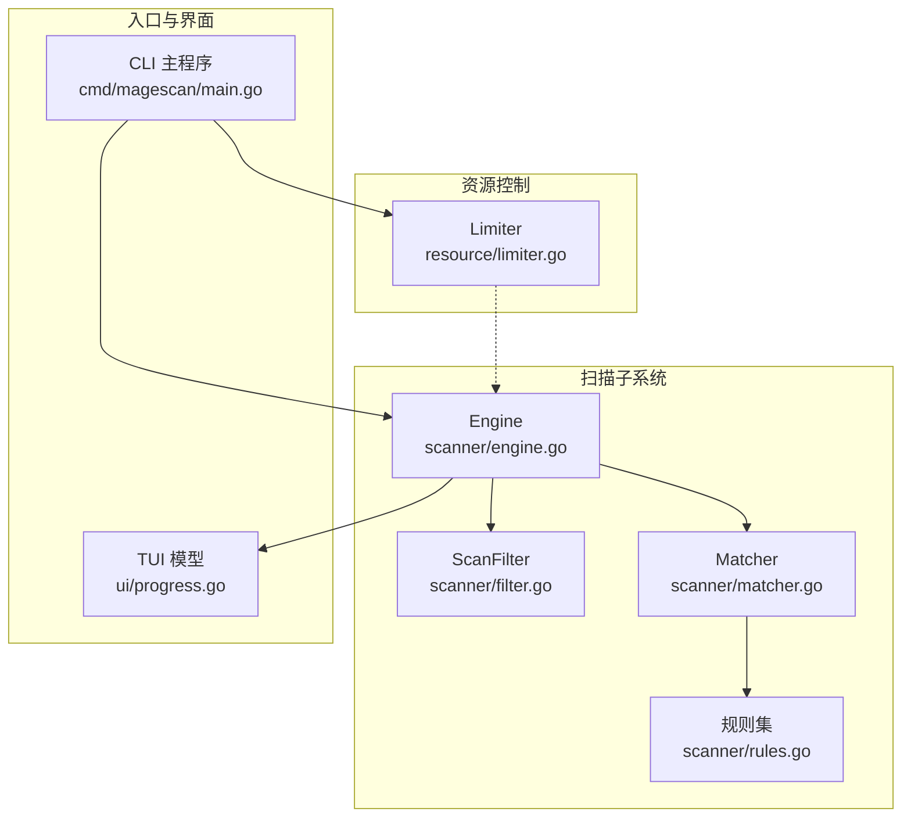
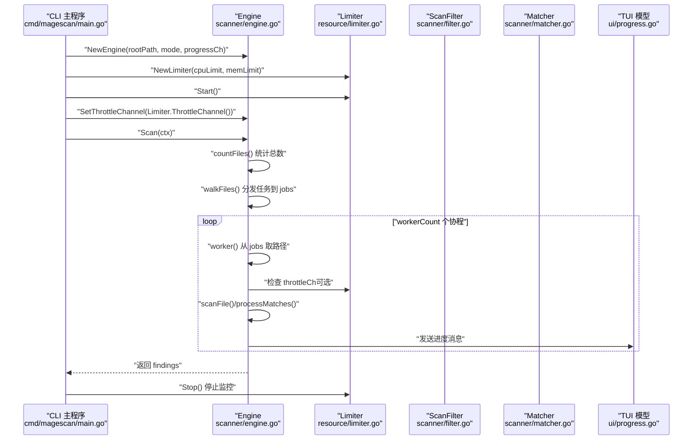
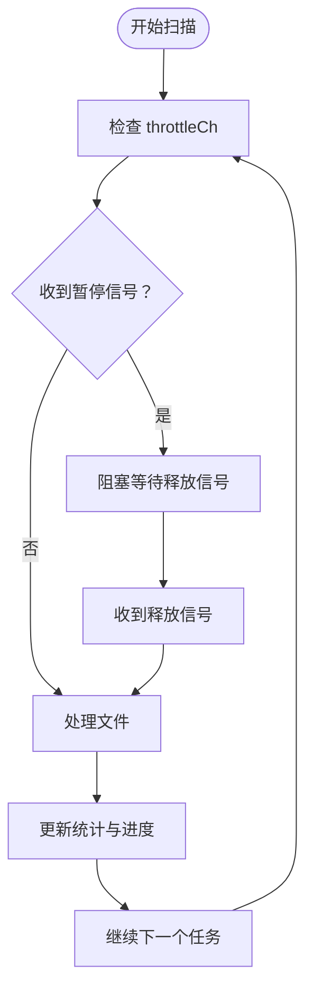

# Engine 结构体

<cite>
**本文引用的文件**
- [engine.go](file://scanner/engine.go)
- [filter.go](file://scanner/filter.go)
- [matcher.go](file://scanner/matcher.go)
- [rules.go](file://scanner/rules.go)
- [limiter.go](file://resource/limiter.go)
- [main.go](file://cmd/magescan/main.go)
- [progress.go](file://ui/progress.go)
- [README.md](file://README.md)
</cite>

## 目录
1. [简介](#简介)
2. [项目结构](#项目结构)
3. [核心组件](#核心组件)
4. [架构总览](#架构总览)
5. [详细组件分析](#详细组件分析)
6. [依赖分析](#依赖分析)
7. [性能考量](#性能考量)
8. [故障排查指南](#故障排查指南)
9. [结论](#结论)
10. [附录](#附录)

## 简介
本文件面向 Engine 结构体的 API 文档与使用指南，围绕以下目标展开：
- 全面解释 Engine 结构体的字段含义、作用与生命周期
- 提供 NewEngine() 构造函数的完整使用示例（含参数说明与初始化流程）
- 解释 Engine 的线程安全设计与并发访问模式
- 说明 SetThrottleChannel() 的使用场景与信号传递机制
- 给出 Engine 的完整生命周期管理建议（从创建到销毁）

## 项目结构
与 Engine 直接相关的模块与文件如下：
- 扫描引擎：scanner/engine.go
- 文件过滤器：scanner/filter.go
- 匹配器：scanner/matcher.go
- 规则定义：scanner/rules.go
- 资源限制器：resource/limiter.go
- CLI 入口与集成：cmd/magescan/main.go
- TUI 进度通道：ui/progress.go
- 项目说明：README.md



图表来源
- [engine.go:47-74](file://scanner/engine.go#L47-L74)
- [filter.go:8-98](file://scanner/filter.go#L8-L98)
- [matcher.go:22-42](file://scanner/matcher.go#L22-L42)
- [rules.go:50-58](file://scanner/rules.go#L50-L58)
- [limiter.go:11-32](file://resource/limiter.go#L11-L32)
- [main.go:93-126](file://cmd/magescan/main.go#L93-L126)
- [progress.go:14-31](file://ui/progress.go#L14-L31)

章节来源
- [engine.go:47-74](file://scanner/engine.go#L47-L74)
- [main.go:93-126](file://cmd/magescan/main.go#L93-L126)

## 核心组件
本节聚焦 Engine 结构体及其关键方法，结合实际代码路径进行说明。

- Engine 结构体字段
  - rootPath：扫描根目录路径，用于遍历与过滤
  - filter：扫描过滤器，决定哪些目录/文件需要跳过或扫描
  - matcher：匹配器，负责在内容中查找威胁规则
  - workerCount：工作协程数量，默认为 CPU 数量的两倍
  - findings：扫描结果集合，按文件与规则记录威胁
  - stats：扫描统计信息，原子计数器保证并发安全
  - mu：互斥锁，保护 findings 的并发写入
  - progressCh：进度通道，向 TUI 发送扫描进度
  - throttleCh：节流通道，由资源限制器通过 SetThrottleChannel 注入，用于暂停/恢复工作协程

- NewEngine() 构造函数
  - 参数：rootPath（根路径）、mode（扫描模式）、progressCh（进度通道）
  - 初始化：设置 workerCount、filter、matcher，并保存 progressCh
  - 返回：*Engine 实例

- SetThrottleChannel() 方法
  - 用途：注入资源限制器提供的节流通道，使工作协程在内存超限时暂停执行
  - 信号机制：当 Limiter 内存超限，会向 throttleCh 发送信号；工作协程收到后阻塞等待释放信号

- Scan() 方法
  - 流程：先统计文件总数，再启动多个工作协程，遍历文件并将路径分发给工作协程处理
  - 并发：使用 WaitGroup 等待所有协程完成；使用原子操作更新统计；使用互斥锁保护 findings
  - 进度：周期性发送进度消息至 progressCh

- worker() 方法
  - 逻辑：从 jobs 通道读取文件路径，检查 throttleCh 是否有暂停信号；调用 scanFile 处理文件；更新统计与进度

- scanFile()/scanLargeFile()/processMatches()
  - 小文件：一次性读取并交给匹配器
  - 大文件：以固定大小的重叠块分段读取，避免内存峰值
  - 匹配：将匹配结果转换为 Finding 并累加统计，必要时发送进度

章节来源
- [engine.go:47-74](file://scanner/engine.go#L47-L74)
- [engine.go:60-69](file://scanner/engine.go#L60-L69)
- [engine.go:71-74](file://scanner/engine.go#L71-L74)
- [engine.go:76-121](file://scanner/engine.go#L76-L121)
- [engine.go:195-227](file://scanner/engine.go#L195-L227)
- [engine.go:229-285](file://scanner/engine.go#L229-L285)
- [engine.go:287-322](file://scanner/engine.go#L287-L322)

## 架构总览
Engine 在整体架构中的位置与交互如下：



图表来源
- [main.go:93-126](file://cmd/magescan/main.go#L93-L126)
- [engine.go:60-69](file://scanner/engine.go#L60-L69)
- [engine.go:76-121](file://scanner/engine.go#L76-L121)
- [engine.go:195-227](file://scanner/engine.go#L195-L227)
- [limiter.go:22-32](file://resource/limiter.go#L22-L32)
- [limiter.go:34-52](file://resource/limiter.go#L34-L52)
- [limiter.go:54-57](file://resource/limiter.go#L54-L57)
- [limiter.go:64-117](file://resource/limiter.go#L64-L117)
- [progress.go:14-31](file://ui/progress.go#L14-L31)

## 详细组件分析

### Engine 结构体字段详解
- rootPath
  - 含义：扫描起始目录路径
  - 生命周期：构造时赋值，贯穿整个扫描过程；用于遍历与相对路径计算
  - 使用点：countFiles() 与 walkFiles() 中作为根目录
- filter
  - 含义：文件/目录过滤器，决定是否跳过某目录或扫描某文件
  - 生命周期：构造时创建，贯穿扫描；支持 fast/full 模式
  - 使用点：ShouldSkipDir() 与 ShouldScanFile() 在遍历时被调用
- matcher
  - 含义：规则匹配器，预编译规则，线程安全地执行匹配
  - 生命周期：构造时创建，全局复用；内部使用 sync.Once 避免重复编译
  - 使用点：processMatches() 中调用 Match() 获取匹配结果
- workerCount
  - 含义：工作协程数量，默认为 2×CPU 核数
  - 生命周期：构造时确定，Scan() 启动时使用
- findings
  - 含义：已发现的威胁列表
  - 生命周期：扫描过程中累积；最终在 Scan() 返回前复制一份只读副本
  - 并发：使用互斥锁保护写入
- stats
  - 含义：扫描统计信息（总数、已扫描、威胁数、当前文件）
  - 生命周期：扫描期间持续更新；使用原子计数器保证并发安全
- mu
  - 含义：互斥锁，保护 findings 的并发写入
  - 使用点：写入 findings 时加锁，返回结果前解锁
- progressCh
  - 含义：进度通道，向 TUI 发送扫描进度
  - 生命周期：构造时注入；扫描期间周期性发送进度；结束时发送 Done 标记
- throttleCh
  - 含义：节流通道，由 Limiter 注入，用于暂停/恢复工作协程
  - 生命周期：通过 SetThrottleChannel() 设置；worker() 在每次处理前检查该通道

章节来源
- [engine.go:47-74](file://scanner/engine.go#L47-L74)
- [engine.go:115-118](file://scanner/engine.go#L115-L118)
- [engine.go:124-131](file://scanner/engine.go#L124-L131)
- [matcher.go:29-42](file://scanner/matcher.go#L29-L42)

### NewEngine() 构造函数使用示例
- 参数说明
  - rootPath：目标 Magento 根目录
  - mode：扫描模式，"fast" 或 "full"
  - progressCh：进度通道，用于向 TUI 发送扫描进度
- 初始化流程
  - 创建过滤器：NewScanFilter(mode)
  - 创建匹配器：NewMatcher()
  - 计算 workerCount：runtime.NumCPU() * 2
  - 保存 progressCh
- 完整调用链参考
  - 参考路径：[NewEngine():60-69](file://scanner/engine.go#L60-L69)
  - CLI 中的典型用法：[main.go:96-97](file://cmd/magescan/main.go#L96-L97)

章节来源
- [engine.go:60-69](file://scanner/engine.go#L60-L69)
- [main.go:96-97](file://cmd/magescan/main.go#L96-L97)

### 线程安全性设计与并发访问模式
- 原子计数器
  - TotalFiles、ScannedFiles、ThreatsFound 使用原子操作更新，避免锁竞争
- 互斥锁
  - findings 的写入使用互斥锁保护；返回结果前复制一份只读副本，避免外部持有锁
- 工作协程
  - 每个 worker 独立从 jobs 通道消费任务，避免共享状态冲突
- 进度通道
  - progressCh 为带缓冲通道，避免阻塞扫描主流程
- 匹配器
  - Matcher 内部使用 sync.Once 预编译规则，Match() 方法本身是线程安全的

章节来源
- [engine.go:31-36](file://scanner/engine.go#L31-L36)
- [engine.go:53-57](file://scanner/engine.go#L53-L57)
- [engine.go:115-118](file://scanner/engine.go#L115-L118)
- [engine.go:124-131](file://scanner/engine.go#L124-L131)
- [matcher.go:29-42](file://scanner/matcher.go#L29-L42)

### SetThrottleChannel() 使用场景与信号传递机制
- 使用场景
  - 当需要限制扫描对系统资源的影响时，通过 Limiter 监控内存使用并在超限时暂停工作协程
- 信号传递机制
  - Limiter 在内存超限时向 throttleCh 发送信号；工作协程在每次处理文件前检查该通道，收到信号后阻塞等待释放信号
  - 当内存回落到阈值（80%）时，Limiter 清空 throttleCh，工作协程恢复执行
- 关键实现参考
  - 注入通道：[SetThrottleChannel():71-74](file://scanner/engine.go#L71-L74)
  - 检查与阻塞：[worker():204-213](file://scanner/engine.go#L204-L213)
  - Limiter 的节流通道与监控：[limiter.go:54-57](file://resource/limiter.go#L54-L57), [limiter.go:64-117](file://resource/limiter.go#L64-L117)



图表来源
- [engine.go:204-213](file://scanner/engine.go#L204-L213)
- [limiter.go:88-116](file://resource/limiter.go#L88-L116)

章节来源
- [engine.go:71-74](file://scanner/engine.go#L71-L74)
- [engine.go:204-213](file://scanner/engine.go#L204-L213)
- [limiter.go:54-57](file://resource/limiter.go#L54-L57)
- [limiter.go:88-116](file://resource/limiter.go#L88-L116)

### Engine 生命周期管理最佳实践
- 创建阶段
  - 使用 NewEngine() 初始化 Engine，传入 rootPath、mode 与 progressCh
  - 如需资源限制，调用 SetThrottleChannel() 注入 Limiter 的 throttleCh
- 执行阶段
  - 通过 context 控制取消与超时；在 CLI 中通常使用信号处理触发取消
  - Scan() 返回 findings 与可能的错误；如需实时进度，监听 progressCh
- 销毁阶段
  - 停止资源监控：调用 Limiter.Stop() 恢复原始 GOMAXPROCS
  - 释放 UI 资源：确保 TUI 程序退出后不再向 progressCh 发送消息
- 参考实现
  - CLI 中的完整流程：[main.go:93-126](file://cmd/magescan/main.go#L93-L126)
  - 资源限制器的启动与停止：[limiter.go:34-52](file://resource/limiter.go#L34-L52)

章节来源
- [main.go:93-126](file://cmd/magescan/main.go#L93-L126)
- [limiter.go:34-52](file://resource/limiter.go#L34-L52)

## 依赖分析
- Engine 对 Filter 的依赖
  - 用于目录跳过与文件扫描决策
- Engine 对 Matcher 的依赖
  - 用于规则匹配与威胁检测
- Engine 对 Limiter 的依赖
  - 通过 throttleCh 实现运行时暂停/恢复
- Engine 对 TUI 的依赖
  - 通过 progressCh 发送进度，驱动 UI 更新

```mermaid
classDiagram
class Engine {
+string rootPath
+ScanFilter* filter
+Matcher* matcher
+int workerCount
+[]Finding findings
+ScanStats stats
+Mutex mu
+chan ScanProgress progressCh
+chan struct{} throttleCh
+NewEngine(rootPath, mode, progressCh) Engine
+SetThrottleChannel(ch) void
+Scan(ctx) ([]Finding, error)
+GetStats() ScanStats
}
class ScanFilter {
+string Mode
+ShouldSkipDir(relPath) bool
+ShouldScanFile(fileName) bool
}
class Matcher {
+[]CompiledRule rules
+Match(content) []MatchResult
}
class Limiter {
+int cpuLimit
+int64 memLimitMB
+chan struct{} throttleCh
+Start() void
+Stop() void
+ThrottleChannel() chan struct{}
}
Engine --> ScanFilter : "使用"
Engine --> Matcher : "使用"
Engine --> Limiter : "通过 throttleCh 协调"
```

图表来源
- [engine.go:47-74](file://scanner/engine.go#L47-L74)
- [filter.go:8-98](file://scanner/filter.go#L8-L98)
- [matcher.go:22-42](file://scanner/matcher.go#L22-L42)
- [limiter.go:11-32](file://resource/limiter.go#L11-L32)

章节来源
- [engine.go:47-74](file://scanner/engine.go#L47-L74)
- [filter.go:8-98](file://scanner/filter.go#L8-L98)
- [matcher.go:22-42](file://scanner/matcher.go#L22-L42)
- [limiter.go:11-32](file://resource/limiter.go#L11-L32)

## 性能考量
- 并发模型
  - 默认 workerCount = 2×CPU，充分利用多核并行扫描
  - 使用带缓冲的任务队列（jobs），降低调度开销
- 内存优化
  - 大文件采用重叠块分段读取，避免一次性加载大文件
  - 匹配器预编译规则，减少正则编译成本
- 资源限制
  - 通过 Limiter 动态调整 CPU 使用与内存占用，防止扫描导致系统不稳定
- 进度与 UI
  - 周期性发送进度，避免阻塞扫描主流程

章节来源
- [engine.go:13-17](file://scanner/engine.go#L13-L17)
- [engine.go:66](file://scanner/engine.go#L66)
- [engine.go:86](file://scanner/engine.go#L86)
- [limiter.go:34-52](file://resource/limiter.go#L34-L52)

## 故障排查指南
- 扫描未结束或卡住
  - 检查是否设置了 throttleCh 且长时间处于暂停状态
  - 确认 Limiter 是否仍在运行，以及内存是否持续高于上限
- 进度不更新
  - 确认 progressCh 是否被正确创建与消费
  - 检查 TUI 是否仍在接收并处理进度消息
- 结果为空但存在威胁
  - 检查扫描模式（fast/full）是否覆盖了目标文件类型
  - 确认过滤器是否误跳过了某些目录或文件
- 内存占用过高
  - 调整 -mem-limit 参数，或增加 -cpu-limit 以降低并发
  - 确保 Limiter 正常工作并及时释放暂停信号

章节来源
- [main.go:93-126](file://cmd/magescan/main.go#L93-L126)
- [limiter.go:88-116](file://resource/limiter.go#L88-L116)
- [progress.go:14-31](file://ui/progress.go#L14-L31)

## 结论
Engine 结构体通过清晰的职责划分与并发设计，实现了高性能、可扩展的文件扫描能力。其线程安全策略、资源限制与进度反馈机制共同保障了在生产环境中的稳定运行。合理使用 NewEngine()、SetThrottleChannel() 与上下文取消，可获得可控、可观测的扫描体验。

## 附录
- CLI 选项与默认行为参考：[README.md:74-98](file://README.md#L74-L98)
- 架构概览与关键设计决策：[README.md:239-258](file://README.md#L239-L258)