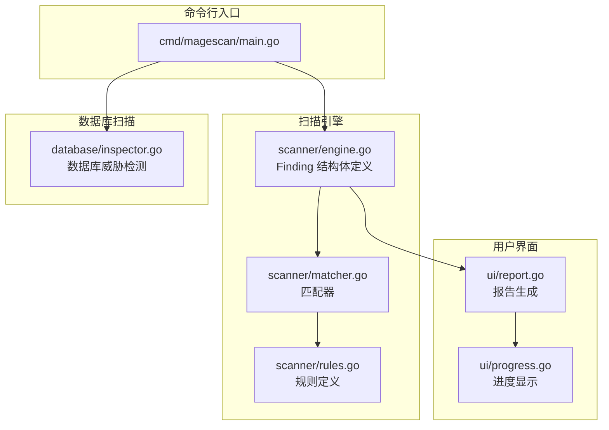
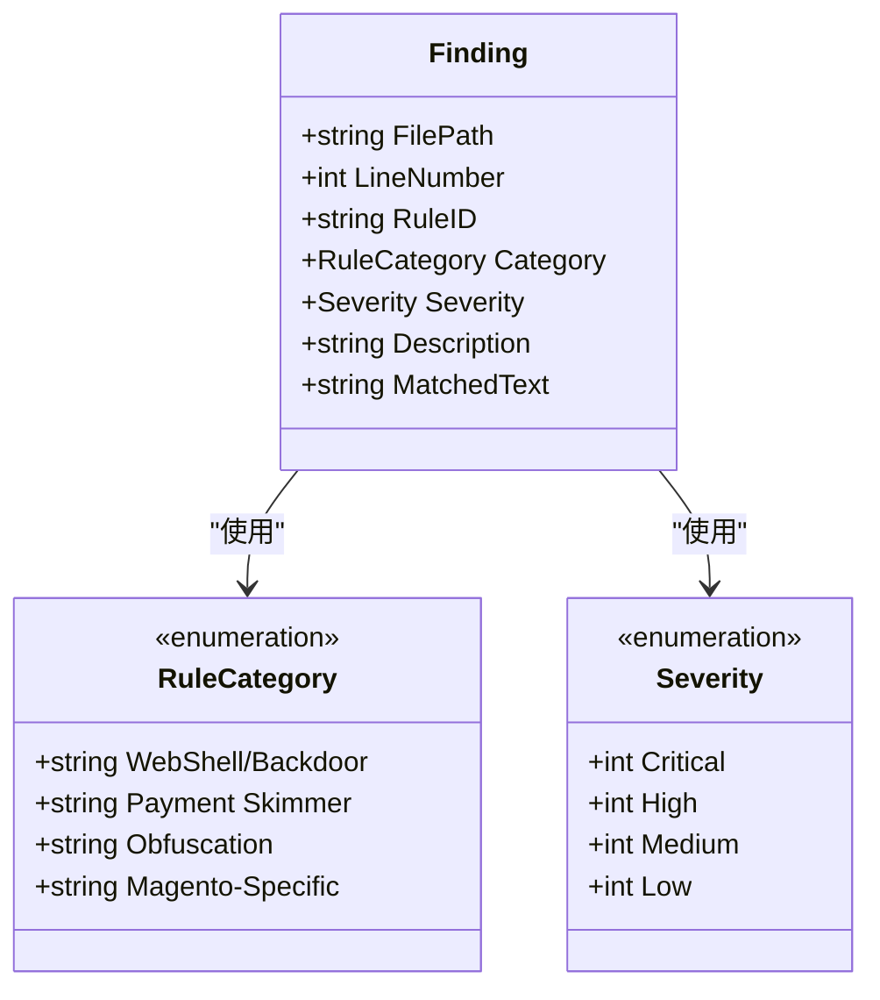
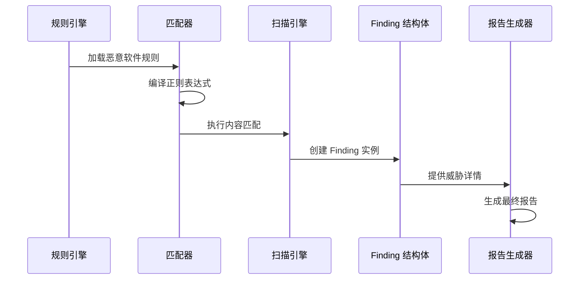
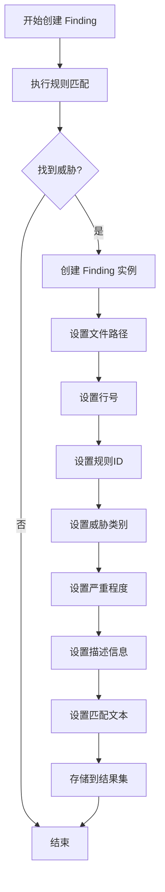
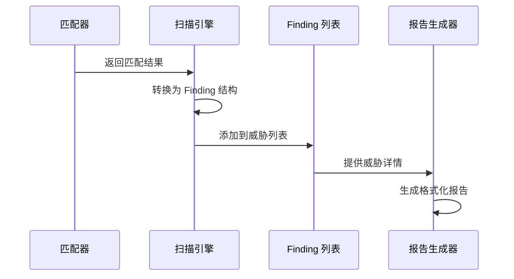
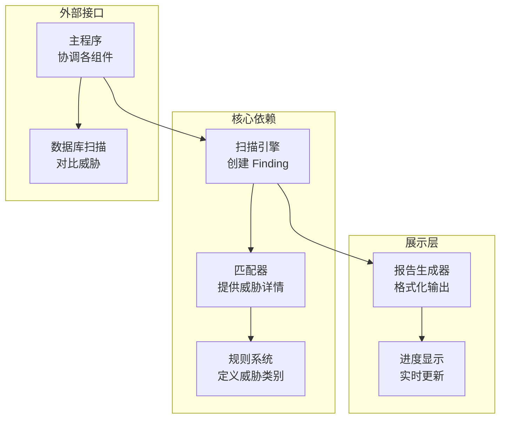

# Finding 数据结构

<cite>
**本文档引用的文件**
- [engine.go](file://scanner/engine.go)
- [matcher.go](file://scanner/matcher.go)
- [rules.go](file://scanner/rules.go)
- [main.go](file://cmd/magescan/main.go)
- [report.go](file://ui/report.go)
- [progress.go](file://ui/progress.go)
- [inspector.go](file://database/inspector.go)
</cite>

## 目录
1. [简介](#简介)
2. [项目结构](#项目结构)
3. [核心组件](#核心组件)
4. [架构概览](#架构概览)
5. [详细组件分析](#详细组件分析)
6. [依赖关系分析](#依赖关系分析)
7. [性能考虑](#性能考虑)
8. [故障排除指南](#故障排除指南)
9. [结论](#结论)

## 简介

Finding 是 MageScan 安全扫描器中的核心数据结构，用于表示在文件扫描过程中发现的安全威胁。该结构体承载了威胁检测的关键信息，包括威胁位置、严重程度、类别分类以及具体的匹配内容等。

Finding 结构体是整个威胁检测系统的基础，它不仅定义了威胁数据的存储格式，还建立了文件扫描、规则匹配、结果报告之间的桥梁。通过 Finding 结构体，用户可以获得详细的威胁信息，包括威胁文件路径、具体行号、威胁类别、严重程度等级等关键信息。

## 项目结构

MageScan 采用模块化架构设计，Finding 结构体位于扫描引擎模块中，与其他组件协同工作：

**图表来源**
- [engine.go:19-28](file://scanner/engine.go#L19-L28)
- [matcher.go:22-27](file://scanner/matcher.go#L22-L27)
- [rules.go:39-48](file://scanner/rules.go#L39-L48)

**章节来源**
- [engine.go:1-323](file://scanner/engine.go#L1-L323)
- [matcher.go:1-168](file://scanner/matcher.go#L1-L168)
- [rules.go:1-468](file://scanner/rules.go#L1-L468)

## 核心组件

Finding 结构体是威胁检测系统的核心数据载体，其设计体现了安全扫描的专业性和实用性。该结构体包含了威胁检测所需的所有关键信息，并通过严格的类型定义确保数据的准确性和一致性。

### Finding 结构体定义

Finding 结构体在扫描引擎模块中定义，作为威胁检测结果的标准数据格式：

**图表来源**
- [engine.go:19-28](file://scanner/engine.go#L19-L28)
- [rules.go:29-37](file://scanner/rules.go#L29-L37)
- [rules.go:3-11](file://scanner/rules.go#L3-L11)

**章节来源**
- [engine.go:19-28](file://scanner/engine.go#L19-L28)
- [rules.go:29-37](file://scanner/rules.go#L29-L37)
- [rules.go:3-11](file://scanner/rules.go#L3-L11)

## 架构概览

Finding 结构体在整个扫描系统中扮演着关键的数据传输角色，从规则匹配到最终报告生成，都需要通过 Finding 结构体来传递威胁信息。

**图表来源**
- [matcher.go:34-42](file://scanner/matcher.go#L34-L42)
- [engine.go:287-322](file://scanner/engine.go#L287-L322)
- [report.go:57-168](file://ui/report.go#L57-L168)

## 详细组件分析

### 字段详细说明

#### FilePath（文件路径）
- **数据类型**: string
- **取值范围**: 有效的文件系统路径字符串
- **业务含义**: 发现威胁的具体文件路径，用于定位问题文件
- **重要性**: 高度重要，直接影响用户能否快速定位和修复威胁
- **验证规则**: 必须是非空字符串，且对应的实际文件存在

#### LineNumber（行号）
- **数据类型**: int
- **取值范围**: 正整数（1 基计数）
- **业务含义**: 威胁在文件中的具体行号位置
- **重要性**: 重要，帮助用户精确定位威胁代码位置
- **验证规则**: 必须为正整数，通常通过行号计算得出

#### RuleID（规则标识符）
- **数据类型**: string
- **取值范围**: 格式化的规则编号（如 WEBSHELL-001）
- **业务含义**: 标识触发威胁检测的具体规则编号
- **重要性**: 重要，便于追踪威胁来源和规则有效性
- **验证规则**: 必须符合预定义的规则编号格式

#### Category（威胁类别）
- **数据类型**: RuleCategory（枚举类型）
- **取值范围**: 
  - WebShell/Backdoor（WebShell/后门）
  - Payment Skimmer（支付劫持）
  - Obfuscation（混淆技术）
  - Magento-Specific（Magento 特定威胁）
- **业务含义**: 威胁的分类标签，用于威胁归类和统计
- **重要性**: 重要，支持按威胁类型进行分析和报告
- **验证规则**: 必须是预定义的枚举值之一

#### Severity（严重程度）
- **数据类型**: Severity（枚举类型）
- **取值范围**:
  - Critical（严重）
  - High（高危）
  - Medium（中危）
  - Low（低危）
- **业务含义**: 威胁的严重程度等级，指导修复优先级
- **重要性**: 最重要，直接影响安全响应策略
- **验证规则**: 必须是预定义的枚举值之一

#### Description（描述信息）
- **数据类型**: string
- **取值范围**: 规则描述文本
- **业务含义**: 对威胁行为的详细描述和解释
- **重要性**: 重要，帮助用户理解威胁性质和危害
- **验证规则**: 必须是非空字符串

#### MatchedText（匹配文本）
- **数据类型**: string
- **取值范围**: 匹配到的威胁代码片段
- **业务含义**: 实际被规则匹配到的威胁代码内容
- **重要性**: 重要，提供威胁证据和上下文信息
- **验证规则**: 必须是非空字符串，通常会进行长度限制

### 创建和使用示例

#### 基本创建流程

**图表来源**
- [engine.go:287-322](file://scanner/engine.go#L287-L322)
- [matcher.go:84-143](file://scanner/matcher.go#L84-L143)

#### 处理流程

**图表来源**
- [engine.go:287-322](file://scanner/engine.go#L287-L322)
- [main.go:159-207](file://cmd/magescan/main.go#L159-L207)

**章节来源**
- [engine.go:287-322](file://scanner/engine.go#L287-L322)
- [matcher.go:84-143](file://scanner/matcher.go#L84-L143)
- [main.go:159-207](file://cmd/magescan/main.go#L159-L207)

### 存储和传递机制

Finding 结构体在系统中的存储和传递采用了线程安全的设计：

#### 内存存储
- 使用互斥锁保护共享的威胁列表
- 原子操作更新扫描统计信息
- 支持并发访问的安全存储

#### 进度传递
- 通过通道机制实时传递扫描进度
- 支持威胁发现时的即时通知
- 终止扫描时的优雅退出机制

#### 报告集成
- 与报告生成器无缝集成
- 支持多种输出格式转换
- 提供丰富的威胁可视化选项

**章节来源**
- [engine.go:47-58](file://scanner/engine.go#L47-L58)
- [engine.go:76-121](file://scanner/engine.go#L76-L121)
- [engine.go:313-322](file://scanner/engine.go#L313-L322)

## 依赖关系分析

Finding 结构体与多个组件存在紧密的依赖关系，形成了完整的威胁检测生态系统：

**图表来源**
- [engine.go:19-28](file://scanner/engine.go#L19-L28)
- [matcher.go:22-27](file://scanner/matcher.go#L22-L27)
- [rules.go:39-48](file://scanner/rules.go#L39-L48)
- [report.go:11-20](file://ui/report.go#L11-L20)

### 关联关系详解

#### 与 RuleCategory 的关联
Finding 结构体直接使用 RuleCategory 枚举类型，确保威胁分类的一致性和准确性。每种威胁类别都有明确的定义和用途：

- **WebShell/Backdoor**: 检测 WebShell 和后门程序
- **Payment Skimmer**: 检测支付劫持和数据窃取
- **Obfuscation**: 检测代码混淆和隐藏技术
- **Magento-Specific**: 检测针对 Magento 的特定威胁

#### 与 Severity 的关联
Severity 枚举提供了标准化的威胁严重程度分级，支持安全响应的优先级管理：

- **Critical**: 需要立即处理的严重威胁
- **High**: 高风险威胁，需要尽快处理
- **Medium**: 中等风险威胁，需要关注
- **Low**: 低风险威胁，可后续处理

**章节来源**
- [rules.go:29-37](file://scanner/rules.go#L29-L37)
- [rules.go:3-11](file://scanner/rules.go#L3-L11)
- [engine.go:19-28](file://scanner/engine.go#L19-L28)

## 性能考虑

Finding 结构体的设计充分考虑了性能优化，特别是在大规模文件扫描场景下的表现：

### 内存优化
- 结构体字段经过精心设计，避免不必要的内存占用
- 字符串字段采用适当的截断策略，防止内存泄漏
- 并发访问使用原子操作和互斥锁保护

### 处理效率
- 单个 Finding 实例的创建开销极小
- 支持批量处理和流式处理模式
- 减少不必要的数据复制和转换

### 扩展性
- 设计支持未来字段扩展
- 兼容不同规模的扫描需求
- 可配置的性能参数

## 故障排除指南

### 常见问题及解决方案

#### Finding 数据丢失
**症状**: 扫描结果显示威胁数量与实际不符
**原因**: 并发访问冲突或内存溢出
**解决方案**: 
- 检查互斥锁使用是否正确
- 监控内存使用情况
- 调整扫描缓冲区大小

#### 威胁分类错误
**症状**: 威胁被错误地分类
**原因**: 规则配置错误或匹配逻辑问题
**解决方案**:
- 验证规则定义的准确性
- 检查正则表达式的正确性
- 更新威胁分类标准

#### 性能问题
**症状**: 扫描速度缓慢或内存占用过高
**原因**: 大文件处理不当或规则匹配效率低
**解决方案**:
- 优化大文件读取策略
- 减少正则表达式复杂度
- 调整并发参数

**章节来源**
- [engine.go:195-227](file://scanner/engine.go#L195-L227)
- [matcher.go:44-61](file://scanner/matcher.go#L44-L61)

## 结论

Finding 数据结构作为 MageScan 安全扫描器的核心组件，成功地实现了威胁检测数据的标准化、结构化存储和高效传递。通过精心设计的字段定义、严格的类型约束和完善的生命周期管理，Finding 结构体为整个安全扫描系统提供了坚实的数据基础。

该结构体不仅满足了当前威胁检测的需求，还具备良好的扩展性和维护性，能够适应不断演进的安全威胁环境。通过与其他组件的紧密协作，Finding 结构体确保了从威胁发现到报告生成的完整流程的顺畅运行。

在未来的发展中，Finding 结构体可以进一步增强其功能，例如添加更多的元数据字段、支持更复杂的威胁关联分析，以及提供更丰富的威胁溯源能力，以更好地服务于现代安全扫描的需求。