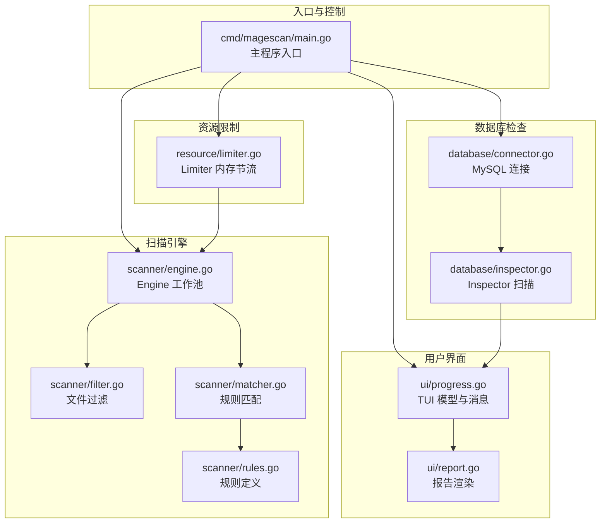
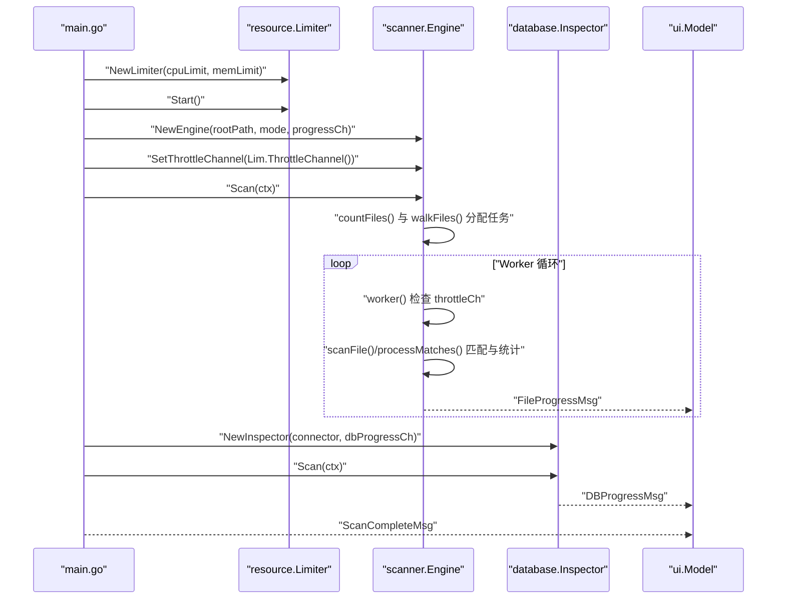
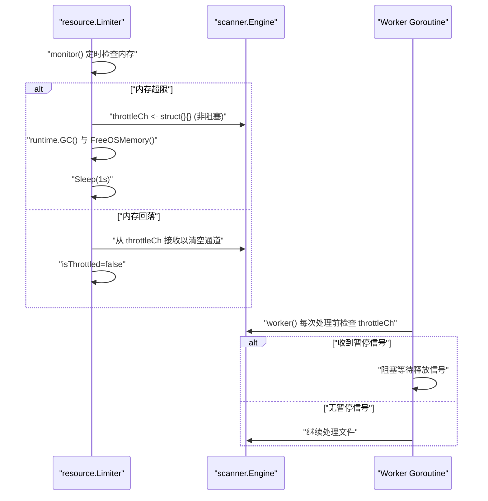
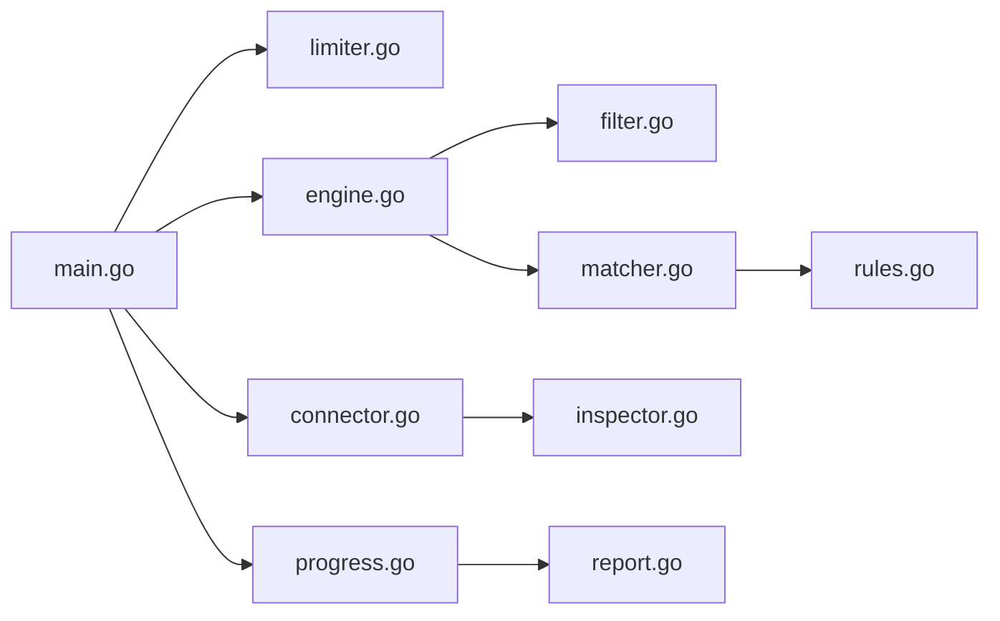

# 并发控制与节流

<cite>
**本文引用的文件列表**
- [main.go](file://cmd/magescan/main.go)
- [engine.go](file://scanner/engine.go)
- [limiter.go](file://resource/limiter.go)
- [progress.go](file://ui/progress.go)
- [filter.go](file://scanner/filter.go)
- [matcher.go](file://scanner/matcher.go)
- [rules.go](file://scanner/rules.go)
- [connector.go](file://database/connector.go)
- [inspector.go](file://database/inspector.go)
- [report.go](file://ui/report.go)
- [config.go](file://config/config.go)
</cite>

## 目录
1. [简介](#简介)
2. [项目结构](#项目结构)
3. [核心组件](#核心组件)
4. [架构总览](#架构总览)
5. [详细组件分析](#详细组件分析)
6. [依赖分析](#依赖分析)
7. [性能考量](#性能考量)
8. [故障排除指南](#故障排除指南)
9. [结论](#结论)
10. [附录](#附录)

## 简介
本文件聚焦于并发控制与节流机制的详细 API 文档，涵盖工作池架构设计、workerCount 计算方法、SetThrottleChannel() 节流机制与信号传递、throttleCh 的使用场景与控制逻辑、并发安全（原子操作、互斥锁）、进度回调的并发处理与线程安全、资源限制与内存管理、CPU 使用率控制的最佳实践，以及性能调优与故障排除建议。内容基于仓库中的实际代码进行分析，并通过图示展示关键流程与数据流。

## 项目结构
该项目采用分层模块化组织：
- 入口程序：命令行入口负责解析参数、初始化资源限制器、启动扫描引擎与数据库检查、驱动 TUI 进度显示与报告生成。
- 扫描引擎：文件扫描工作池，支持按模式过滤、大文件分块扫描、匹配规则执行、统计与进度上报。
- 资源限制器：监控内存使用，动态调整 GOMAXPROCS，并通过 throttleCh 对工作池进行节流。
- 数据库检查器：连接 MySQL，扫描敏感表，输出威胁发现与进度。
- UI 层：Bubble Tea 驱动的终端界面，接收文件与数据库进度消息，渲染实时状态与最终报告。



图表来源
- [main.go:24-157](file://cmd/magescan/main.go#L24-L157)
- [engine.go:47-121](file://scanner/engine.go#L47-L121)
- [limiter.go:11-57](file://resource/limiter.go#L11-L57)
- [filter.go:8-98](file://scanner/filter.go#L8-L98)
- [matcher.go:22-82](file://scanner/matcher.go#L22-L82)
- [rules.go:39-58](file://scanner/rules.go#L39-L58)
- [connector.go:10-58](file://database/connector.go#L10-L58)
- [inspector.go:63-109](file://database/inspector.go#L63-L109)
- [progress.go:54-197](file://ui/progress.go#L54-L197)
- [report.go:57-168](file://ui/report.go#L57-168)

章节来源
- [main.go:24-157](file://cmd/magescan/main.go#L24-L157)
- [engine.go:47-121](file://scanner/engine.go#L47-L121)
- [limiter.go:11-57](file://resource/limiter.go#L11-L57)
- [filter.go:8-98](file://scanner/filter.go#L8-L98)
- [matcher.go:22-82](file://scanner/matcher.go#L22-L82)
- [rules.go:39-58](file://scanner/rules.go#L39-L58)
- [connector.go:10-58](file://database/connector.go#L10-L58)
- [inspector.go:63-109](file://database/inspector.go#L63-L109)
- [progress.go:54-197](file://ui/progress.go#L54-L197)
- [report.go:57-168](file://ui/report.go#L57-168)

## 核心组件
- 工作池引擎（Engine）：维护 workerCount、作业队列、统计与进度通道；在 worker 中实现节流检查；并发安全地累积威胁发现。
- 资源限制器（Limiter）：周期性监控内存，必要时通过 throttleCh 发送节流信号，恢复时非阻塞清空通道。
- 文件过滤器（ScanFilter）：根据扫描模式决定跳过目录与文件类型。
- 规则匹配器（Matcher）：预编译规则，支持并发安全的匹配。
- 数据库检查器（Inspector）：按阶段扫描数据库表，发送进度消息。
- TUI 模型（Model）：接收文件与数据库进度消息，渲染界面与最终报告。

章节来源
- [engine.go:47-121](file://scanner/engine.go#L47-L121)
- [limiter.go:11-57](file://resource/limiter.go#L11-L57)
- [filter.go:8-98](file://scanner/filter.go#L8-L98)
- [matcher.go:22-82](file://scanner/matcher.go#L22-L82)
- [inspector.go:63-109](file://database/inspector.go#L63-L109)
- [progress.go:54-197](file://ui/progress.go#L54-L197)

## 架构总览
整体流程：入口程序初始化资源限制器与扫描引擎，设置节流通道，启动文件扫描与数据库扫描，同时通过独立 goroutine 将进度消息转发到 TUI，最终渲染报告。



图表来源
- [main.go:62-126](file://cmd/magescan/main.go#L62-L126)
- [limiter.go:34-57](file://resource/limiter.go#L34-L57)
- [engine.go:76-121](file://scanner/engine.go#L76-L121)
- [inspector.go:79-109](file://database/inspector.go#L79-L109)
- [progress.go:140-197](file://ui/progress.go#L140-L197)

## 详细组件分析

### 工作池架构与 workerCount 计算
- 设计原则
  - 使用固定大小的工作池，避免过多 goroutine 导致上下文切换开销与资源争用。
  - 作业队列容量为 workerCount 的若干倍，以平衡吞吐与内存占用。
  - 统一的统计与进度上报通道，便于 UI 实时反馈。
- workerCount 计算
  - 默认值为 CPU 核数的两倍，兼顾 I/O 与 CPU 密集型任务的混合场景。
  - 可通过外部资源限制器动态降低 GOMAXPROCS，从而间接限制并发度。
- 关键实现要点
  - 作业分配：遍历文件树，将路径推入 jobs 通道。
  - 工作循环：从 jobs 通道读取路径，执行扫描与匹配，周期性上报进度。
  - 统计与线程安全：使用原子计数器更新已扫描文件与威胁数量；聚合结果时使用互斥锁保护切片写入。

```mermaid
classDiagram
class Engine {
-string rootPath
-ScanFilter filter
-Matcher matcher
-int workerCount
-[]Finding findings
-ScanStats stats
-Mutex mu
-chan ScanProgress progressCh
-chan struct{} throttleCh
+Scan(ctx) ([]Finding, error)
+GetStats() ScanStats
+SetThrottleChannel(ch)
-worker(ctx, jobs)
-scanFile(path)
-processMatches(path, content)
}
class ScanFilter {
+ShouldSkipDir(relPath) bool
+ShouldScanFile(fileName) bool
}
class Matcher {
-[]CompiledRule rules
+Match(content) []MatchResult
+RuleCount() int
}
Engine --> ScanFilter : "使用"
Engine --> Matcher : "使用"
```

图表来源
- [engine.go:47-121](file://scanner/engine.go#L47-L121)
- [filter.go:8-98](file://scanner/filter.go#L8-L98)
- [matcher.go:22-82](file://scanner/matcher.go#L22-L82)

章节来源
- [engine.go:60-69](file://scanner/engine.go#L60-L69)
- [engine.go:85-103](file://scanner/engine.go#L85-L103)
- [engine.go:196-227](file://scanner/engine.go#L196-L227)
- [engine.go:309-312](file://scanner/engine.go#L309-L312)

### 节流机制与信号传递：SetThrottleChannel() 与 throttleCh
- 设置节流通道
  - 在入口程序中，将资源限制器的 throttleCh 注入到扫描引擎，使每个 worker 在处理任务前检查该通道。
- 节流控制逻辑
  - worker 在每次处理文件前尝试非阻塞检查 throttleCh，若收到信号则阻塞等待释放信号，实现“暂停-恢复”式节流。
  - 资源限制器在监控到内存超限时，向 throttleCh 发送一个信号；当内存回落到阈值以下时，清空通道以解除节流。
- 控制信号语义
  - throttleCh 是带缓冲大小为 1 的通道，用于“单次触发”。发送方非阻塞地尝试发送；接收方在有信号时阻塞等待，直到通道被清空。
- 并发安全
  - throttleCh 仅作为“信号通道”，不承载数据，避免了竞态条件。
  - 资源限制器内部使用原子布尔标记 isThrottled，配合通道操作确保状态一致。



图表来源
- [limiter.go:64-117](file://resource/limiter.go#L64-L117)
- [engine.go:204-213](file://scanner/engine.go#L204-L213)

章节来源
- [main.go:96-97](file://cmd/magescan/main.go#L96-L97)
- [engine.go:71-74](file://scanner/engine.go#L71-L74)
- [engine.go:204-213](file://scanner/engine.go#L204-L213)
- [limiter.go:54-57](file://resource/limiter.go#L54-L57)
- [limiter.go:88-116](file://resource/limiter.go#L88-L116)

### throttleCh 的使用场景与控制逻辑
- 使用场景
  - 文件扫描阶段：当内存压力过大时，通过 throttleCh 暂停部分 worker，降低 CPU 与内存占用。
  - 数据库扫描阶段：当前实现未直接接入 throttleCh，但可扩展为在内存紧张时暂停数据库查询。
- 控制逻辑
  - 发送端：非阻塞发送，避免阻塞监控循环。
  - 接收端：先非阻塞检查，再阻塞等待，确保只在需要时暂停。
  - 解除：通过从通道接收以清空信号，恢复所有 worker。
- hysteresis 设计
  - 内存回落至上限的 80% 时才解除节流，防止频繁抖动。

章节来源
- [limiter.go:88-116](file://resource/limiter.go#L88-L116)
- [engine.go:204-213](file://scanner/engine.go#L204-L213)

### 并发安全实现细节
- 原子操作
  - 统计字段（TotalFiles、ScannedFiles、ThreatsFound）使用原子计数器更新，避免锁竞争。
- 互斥锁
  - 聚合威胁发现结果时使用互斥锁保护切片写入，保证多 worker 并发写入的安全性。
- 规则匹配器
  - 规则预编译后共享，匹配函数本身是并发安全的，避免重复编译带来的开销。
- 进度通道
  - 进度消息通过无缓冲或小缓冲通道发送，保证 UI 的及时响应；通道本身是并发安全的。

章节来源
- [engine.go:31-36](file://scanner/engine.go#L31-L36)
- [engine.go:106-113](file://scanner/engine.go#L106-L113)
- [engine.go:309-312](file://scanner/engine.go#L309-L312)
- [matcher.go:22-42](file://scanner/matcher.go#L22-L42)

### 进度回调的并发处理与线程安全
- 文件扫描进度
  - 每处理一定数量文件或发现威胁时，向 progressCh 发送 ScanProgress 消息；UI 侧通过独立 goroutine 接收并转换为 FileProgressMsg。
- 数据库扫描进度
  - Inspector 按阶段扫描，每阶段结束发送 DBProgress 消息；UI 侧接收并转换为 DBProgressMsg。
- 线程安全
  - 所有发送均通过通道完成，通道天然并发安全；UI 模型在 Update 中处理消息，保证渲染一致性。
- 性能影响
  - 进度通道缓冲为 64，避免高频进度导致阻塞；可根据系统负载调整缓冲大小。

章节来源
- [engine.go:217-225](file://scanner/engine.go#L217-L225)
- [engine.go:313-321](file://scanner/engine.go#L313-L321)
- [inspector.go:332-341](file://database/inspector.go#L332-L341)
- [main.go:78-151](file://cmd/magescan/main.go#L78-L151)
- [progress.go:140-197](file://ui/progress.go#L140-L197)

### 资源限制、内存管理与 CPU 使用率控制
- CPU 限制
  - 启动时根据 cpuLimit 设置 GOMAXPROCS，限制可并行的 P 数量，从而控制 CPU 使用率。
- 内存限制
  - 定期采样运行时内存，超过阈值时触发节流；同时主动触发 GC 并归还内存给系统，缓解内存压力。
- hysteresis 回落
  - 内存回落到上限的 80% 时解除节流，避免频繁启停。
- 最佳实践
  - 合理设置 memLimit，避免过低导致频繁节流影响性能。
  - 结合 CPU 与内存限制，观察系统负载，逐步调优 workerCount 与通道缓冲。

章节来源
- [limiter.go:34-57](file://resource/limiter.go#L34-L57)
- [limiter.go:78-116](file://resource/limiter.go#L78-L116)
- [main.go:28-29](file://cmd/magescan/main.go#L28-L29)

## 依赖分析
- 组件耦合
  - 主程序与资源限制器、扫描引擎、数据库检查器之间为松耦合，通过接口与通道交互。
  - 扫描引擎依赖过滤器与匹配器，规则定义集中于 rules.go。
  - UI 通过消息与扫描器解耦，便于替换渲染层。
- 外部依赖
  - Bubble Tea 用于 TUI 渲染。
  - MySQL 驱动用于数据库连接。
- 潜在循环依赖
  - 当前模块间无循环导入，结构清晰。



图表来源
- [main.go:24-157](file://cmd/magescan/main.go#L24-L157)
- [engine.go:47-121](file://scanner/engine.go#L47-L121)
- [limiter.go:11-57](file://resource/limiter.go#L11-L57)
- [filter.go:8-98](file://scanner/filter.go#L8-L98)
- [matcher.go:22-82](file://scanner/matcher.go#L22-L82)
- [rules.go:39-58](file://scanner/rules.go#L39-L58)
- [connector.go:10-58](file://database/connector.go#L10-L58)
- [inspector.go:63-109](file://database/inspector.go#L63-L109)
- [progress.go:54-197](file://ui/progress.go#L54-L197)
- [report.go:57-168](file://ui/report.go#L57-168)

章节来源
- [main.go:24-157](file://cmd/magescan/main.go#L24-L157)
- [engine.go:47-121](file://scanner/engine.go#L47-L121)
- [limiter.go:11-57](file://resource/limiter.go#L11-L57)
- [filter.go:8-98](file://scanner/filter.go#L8-L98)
- [matcher.go:22-82](file://scanner/matcher.go#L22-L82)
- [rules.go:39-58](file://scanner/rules.go#L39-L58)
- [connector.go:10-58](file://database/connector.go#L10-L58)
- [inspector.go:63-109](file://database/inspector.go#L63-L109)
- [progress.go:54-197](file://ui/progress.go#L54-L197)
- [report.go:57-168](file://ui/report.go#L57-168)

## 性能考量
- workerCount 选择
  - 默认为 CPU 数的两倍，适合混合 I/O 与 CPU 密集任务；可通过外部限制器降低 GOMAXPROCS 以稳定性能。
- 作业队列容量
  - jobs 容量为 workerCount 的若干倍，平衡吞吐与内存；可根据文件数量与磁盘 I/O 调整。
- 进度频率
  - 每处理 N 个文件发送一次进度，减少通道压力；可按系统负载调整 N。
- 内存节流
  - 通过 throttleCh 与 hysteresis 降低内存峰值对系统的影响，避免 OOM。
- 数据库连接
  - 最大连接数与空闲连接数较小，避免过度占用数据库资源。

章节来源
- [engine.go:66](file://scanner/engine.go#L66)
- [engine.go:86](file://scanner/engine.go#L86)
- [engine.go:217-225](file://scanner/engine.go#L217-L225)
- [limiter.go:88-116](file://resource/limiter.go#L88-L116)
- [connector.go:27-28](file://database/connector.go#L27-L28)

## 故障排除指南
- 内存持续飙升
  - 检查 memLimit 是否过低；适当提高阈值或降低扫描强度。
  - 确认是否频繁触发节流，导致处理速度下降。
- CPU 使用率过高
  - 降低 GOMAXPROCS 或减少 workerCount；确认是否存在大量小文件导致调度开销。
- 进度卡顿
  - 检查进度通道缓冲是否过小；适当增大缓冲或减少进度发送频率。
- 数据库扫描失败
  - 检查表是否存在与权限；当前实现对缺失表会记录并继续。
- UI 卡死
  - 确认 UI goroutine 正常接收消息；检查通道关闭时机。

章节来源
- [limiter.go:88-116](file://resource/limiter.go#L88-L116)
- [engine.go:217-225](file://scanner/engine.go#L217-L225)
- [inspector.go:98-106](file://database/inspector.go#L98-L106)
- [progress.go:140-197](file://ui/progress.go#L140-L197)

## 结论
本项目通过工作池与资源限制器实现了稳健的并发控制与节流机制。Engine 的 workerCount 默认为 CPU 数的两倍，结合 throttleCh 与内存监控，能够在高负载下自动降载，保障系统稳定性。进度通道与 TUI 的分离设计提供了良好的用户体验。通过合理设置 CPU 与内存限制、调整 workerCount 与进度频率，可在不同硬件环境下获得最佳性能与稳定性。

## 附录
- API 一览
  - 资源限制器
    - NewLimiter(cpuLimit, memLimitMB)：创建限制器
    - Start()：启动监控
    - Stop()：停止监控并恢复设置
    - ThrottleChannel()：返回节流通道
    - IsThrottled()：查询当前是否处于节流状态
  - 扫描引擎
    - NewEngine(rootPath, mode, progressCh)：创建引擎
    - SetThrottleChannel(ch)：设置节流通道
    - Scan(ctx)：开始扫描
    - GetStats()：获取统计信息
  - 数据库检查器
    - NewInspector(connector, progressCh)：创建检查器
    - Scan(ctx)：开始扫描
    - GetFindings()：获取发现结果
  - UI 模型
    - NewModel()：创建模型
    - Update(msg)：处理消息
    - View()：渲染界面

章节来源
- [limiter.go:22-62](file://resource/limiter.go#L22-L62)
- [engine.go:60-131](file://scanner/engine.go#L60-L131)
- [inspector.go:70-114](file://database/inspector.go#L70-L114)
- [progress.go:116-197](file://ui/progress.go#L116-L197)