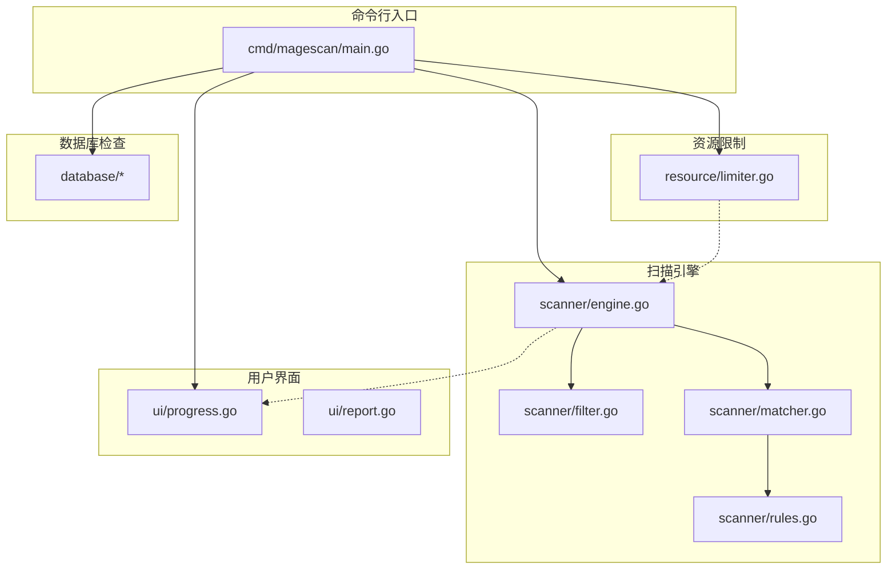
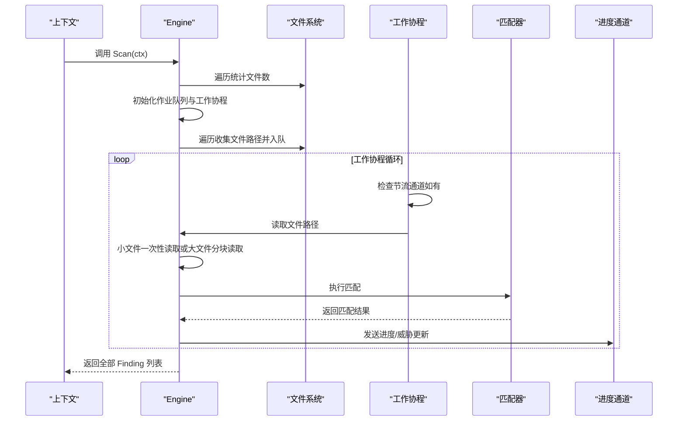

# 扫描引擎 API

<cite>
**本文引用的文件**
- [engine.go](file://scanner/engine.go)
- [filter.go](file://scanner/filter.go)
- [matcher.go](file://scanner/matcher.go)
- [rules.go](file://scanner/rules.go)
- [limiter.go](file://resource/limiter.go)
- [progress.go](file://ui/progress.go)
- [report.go](file://ui/report.go)
- [main.go](file://cmd/magescan/main.go)
- [README.md](file://README.md)
</cite>

## 目录
1. [简介](#简介)
2. [项目结构](#项目结构)
3. [核心组件](#核心组件)
4. [架构总览](#架构总览)
5. [详细组件分析](#详细组件分析)
6. [依赖分析](#依赖分析)
7. [性能考虑](#性能考虑)
8. [故障排查指南](#故障排查指南)
9. [结论](#结论)
10. [附录：API 参考与用法示例](#附录api-参考与用法示例)

## 简介
本文件为扫描引擎 API 的权威技术文档，聚焦于 Engine 结构体及其配套数据模型（Finding、ScanStats、ScanProgress），系统阐述扫描引擎的工作原理（工作池、文件遍历、并发处理、大文件分块读取）、资源限制与节流机制、进度回调与线程安全，并提供完整的方法签名、参数说明、返回值类型、错误处理策略以及性能优化建议与最佳实践。读者无需深入 Go 语言即可理解并正确使用该扫描引擎。

## 项目结构
本项目采用按领域分层的组织方式：
- cmd/magescan：CLI 入口，负责参数解析、上下文管理、TUI 进度转发、调用扫描引擎与数据库检查器、生成最终报告。
- scanner：扫描引擎核心，包含 Engine、过滤器、匹配器与规则集。
- resource：资源限制器，提供 CPU/内存限制与自动节流通道。
- ui：TUI 进度显示与报告渲染。
- database：数据库连接与安全检查（非本文重点，但与扫描流程衔接）。
- config：环境检测与配置解析（非本文重点）。



图表来源
- [main.go:1-208](file://cmd/magescan/main.go#L1-L208)
- [engine.go:1-323](file://scanner/engine.go#L1-L323)
- [filter.go:1-98](file://scanner/filter.go#L1-L98)
- [matcher.go:1-168](file://scanner/matcher.go#L1-L168)
- [rules.go:1-468](file://scanner/rules.go#L1-L468)
- [limiter.go:1-118](file://resource/limiter.go#L1-L118)
- [progress.go:1-289](file://ui/progress.go#L1-L289)
- [report.go:1-230](file://ui/report.go#L1-L230)

章节来源
- [README.md:239-258](file://README.md#L239-L258)
- [main.go:1-208](file://cmd/magescan/main.go#L1-L208)

## 核心组件
本节对 Engine 及其配套数据结构进行深入剖析，涵盖字段语义、并发安全、错误处理与典型用法。

- Engine 结构体
  - 字段概览：根路径、过滤器、匹配器、工作协程数、结果与统计、互斥锁、进度通道、节流通道。
  - 并发特性：内部使用互斥锁保护共享状态；统计字段通过原子操作更新；进度通道用于向 TUI 发送实时进度。
  - 关键行为：扫描前先计数文件，再并发遍历与分发任务；支持上下文取消；支持资源节流通道暂停工作协程。

- Finding（检测结果）
  - 字段：文件路径、行号、规则 ID、类别、严重级别、描述、命中文本片段。
  - 用途：作为扫描结果的最小单元，供 UI 报告与后续处理使用。

- ScanStats（扫描统计）
  - 字段：总文件数、已扫描文件数、威胁总数、当前文件名。
  - 用途：提供扫描过程中的关键指标，支持 UI 展示与外部监控。

- ScanProgress（进度消息）
  - 字段：当前文件、已扫描/总文件数、威胁总数、完成标记。
  - 用途：通过通道向 TUI 推送进度，驱动非滚动式终端界面刷新。

章节来源
- [engine.go:19-45](file://scanner/engine.go#L19-L45)
- [engine.go:47-58](file://scanner/engine.go#L47-L58)
- [engine.go:123-131](file://scanner/engine.go#L123-L131)

## 架构总览
扫描引擎采用“工作池 + 分布式作业”的并发模型：
- 预扫描阶段：遍历目录树统计可扫描文件数量，便于进度条初始化。
- 作业分发：构建固定容量的作业队列，启动多协程工作池消费作业。
- 文件扫描：小文件一次性读取；大文件按固定大小分块重叠读取，避免跨边界漏检。
- 匹配与记录：匹配器对内容执行规则匹配，生成 Finding 并原子累加威胁计数。
- 进度与节流：周期性发送进度消息；当资源限制器检测到内存超限，通过节流通道暂停工作协程，待阈值回落恢复。



图表来源
- [engine.go:76-121](file://scanner/engine.go#L76-L121)
- [engine.go:163-193](file://scanner/engine.go#L163-L193)
- [engine.go:195-227](file://scanner/engine.go#L195-L227)
- [engine.go:229-285](file://scanner/engine.go#L229-L285)
- [matcher.go:63-82](file://scanner/matcher.go#L63-L82)

## 详细组件分析

### Engine 结构体与方法
- NewEngine(rootPath, mode, progressCh) -> *Engine
  - 功能：创建扫描引擎实例，设置扫描模式（fast/full）、工作协程数（CPU×2）、进度通道。
  - 参数：
    - rootPath：目标根路径（必须是 Magento 根）。
    - mode：扫描模式字符串，影响过滤器行为。
    - progressCh：进度通道，用于推送 ScanProgress。
  - 返回：Engine 实例。
  - 错误：无显式错误返回；若传入无效路径，后续 WalkDir 会跳过错误项。
  - 线程安全：构造后可并发调用 Scan、GetStats、SetThrottleChannel。

- SetThrottleChannel(ch chan struct{})
  - 功能：设置资源限制器提供的节流通道，工作协程在空闲时检查该通道以响应暂停/恢复信号。
  - 注意：ch 必须由资源限制器提供；发送/接收语义遵循“阻塞/非阻塞”约定。

- Scan(ctx) -> ([]Finding, error)
  - 功能：启动扫描流程，返回所有检测到的威胁。
  - 处理步骤：
    - 预扫描：统计可扫描文件总数，写入原子统计。
    - 启动工作池：根据 CPU 数量创建 2×NumCPU 协程。
    - 第二遍遍历：将文件路径推送到作业队列，完成后关闭队列。
    - 等待完成：等待所有工作协程退出。
    - 最终进度：发送 Done=true 的进度消息。
    - 结果复制：加锁复制当前 findings，避免并发读写。
  - 返回：Finding 切片与可能的错误（主要来自上下文取消）。
  - 错误：上下文取消时返回 ctx.Err()；其他遍历错误被忽略以保证稳健性。

- GetStats() -> ScanStats
  - 功能：读取当前扫描统计快照。
  - 原子字段：TotalFiles、ScannedFiles、ThreatsFound；非原子字段 CurrentFile 通过拷贝返回。

- 内部方法（仅包内使用）
  - countFiles(ctx)：遍历统计文件数，支持上下文取消。
  - walkFiles(ctx, jobs)：遍历并将文件路径发送至作业通道。
  - worker(ctx, jobs)：工作协程主循环，支持节流、进度上报。
  - scanFile(path)：打开文件、判断大小、选择一次性读取或分块读取。
  - scanLargeFile(f, path, size)：按固定大小分块读取并重叠偏移。
  - processMatches(path, content)：匹配并生成 Finding，原子更新威胁计数，发送进度。

章节来源
- [engine.go:60-69](file://scanner/engine.go#L60-L69)
- [engine.go:71-74](file://scanner/engine.go#L71-L74)
- [engine.go:76-121](file://scanner/engine.go#L76-L121)
- [engine.go:123-131](file://scanner/engine.go#L123-L131)
- [engine.go:133-161](file://scanner/engine.go#L133-L161)
- [engine.go:163-193](file://scanner/engine.go#L163-L193)
- [engine.go:195-227](file://scanner/engine.go#L195-L227)
- [engine.go:229-285](file://scanner/engine.go#L229-L285)
- [engine.go:287-322](file://scanner/engine.go#L287-L322)

### 数据结构详解

- Finding
  - 字段含义与用途：
    - FilePath：威胁所在文件绝对路径。
    - LineNumber：规则命中的行号（从 1 开始）。
    - RuleID：规则标识符（如 WEBSHELL-001）。
    - Category：威胁类别（WebShell/Backdoor、Payment Skimmer、Obfuscation、Magento-Specific）。
    - Severity：严重级别（Critical/High/Medium/Low）。
    - Description：规则描述。
    - MatchedText：命中文本片段（截断至约 100 字符）。
  - 使用方式：作为扫描结果的载体，用于 UI 报告与修复建议生成。

- ScanStats
  - 字段含义与用途：
    - TotalFiles：预扫描得到的总文件数。
    - ScannedFiles：已扫描文件数（原子自增）。
    - ThreatsFound：发现威胁总数（原子自增）。
    - CurrentFile：当前正在扫描的文件路径。
  - 使用方式：通过 GetStats 获取实时统计，用于 UI 进度条与摘要展示。

- ScanProgress
  - 字段含义与用途：
    - CurrentFile：当前文件路径。
    - ScannedFiles/TotalFiles：已扫描/总文件数。
    - ThreatsFound：威胁总数。
    - Done：是否扫描完成（用于切换 UI 阶段）。
  - 使用方式：引擎周期性发送进度消息，TUI 订阅并渲染。

章节来源
- [engine.go:19-45](file://scanner/engine.go#L19-L45)

### 匹配器与规则
- Matcher
  - 职责：线程安全地对内容执行规则匹配，支持字面量与正则两种模式。
  - 初始化：使用 sync.Once 确保规则编译只发生一次，提升性能。
  - 匹配策略：
    - 字面量：先快速检查内容是否包含模式，再逐行定位并去重。
    - 正则：先快速检查整体是否匹配，再逐行查找并去重。
  - 线程安全：Match 方法可并发调用；内部使用 Once 保证编译阶段安全。

- 规则集
  - 类别：WebShell/Backdoor、Payment Skimmer、Obfuscation、Magento-Specific。
  - 严重级别：Critical/High/Medium/Low。
  - 规则来源：统一聚合为 Rule 列表，供匹配器编译与执行。

章节来源
- [matcher.go:22-42](file://scanner/matcher.go#L22-L42)
- [matcher.go:63-82](file://scanner/matcher.go#L63-L82)
- [matcher.go:84-143](file://scanner/matcher.go#L84-L143)
- [rules.go:29-58](file://scanner/rules.go#L29-L58)

### 过滤器
- ScanFilter
  - 模式：fast/full。
  - 快速模式：仅扫描 .php 与 .phtml。
  - 完整模式：排除常见静态/日志/压缩/媒体等扩展，其余文件均扫描。
  - 目录跳过：内置大量目录白名单（如 var/cache、pub/media、generated、vendor 等），支持子目录与顶层基名匹配。

章节来源
- [filter.go:8-59](file://scanner/filter.go#L8-L59)
- [filter.go:61-85](file://scanner/filter.go#L61-L85)
- [filter.go:87-97](file://scanner/filter.go#L87-L97)

### 资源限制与节流
- Limiter
  - 功能：限制 CPU 核心数与内存使用，超过阈值自动节流，低于阈值恢复。
  - 监控：每 500ms 采样一次内存分配，触发 GC 与回收。
  - 节流通道：提供一个带缓冲的通道，工作协程在空闲时检查以响应暂停/恢复。
  - 滞回机制：内存降至上限的 80% 时才解除节流，避免频繁抖动。

章节来源
- [limiter.go:11-32](file://resource/limiter.go#L11-L32)
- [limiter.go:64-117](file://resource/limiter.go#L64-L117)

### 进度与报告
- 进度通道
  - 引擎通过 ScanProgress 推送文件级进度；TUI 订阅并渲染。
  - UI 模型包含文件扫描阶段与数据库扫描阶段，支持 Done 标记切换。

- 报告渲染
  - 收集 Finding 与数据库威胁，按严重级别统计并排序，输出结构化报告。
  - 提供修复建议 SQL（数据库威胁）。

章节来源
- [progress.go:14-31](file://ui/progress.go#L14-L31)
- [progress.go:54-82](file://ui/progress.go#L54-L82)
- [report.go:11-21](file://ui/report.go#L11-L21)
- [report.go:57-168](file://ui/report.go#L57-L168)

## 依赖分析
- 组件耦合
  - Engine 依赖 Filter 与 Matcher；Matcher 依赖规则集；Limiter 通过通道与 Engine 协作。
  - UI 通过通道与 Engine 解耦；CLI 负责编排与上下文管理。
- 外部依赖
  - Go 标准库（context、fs、os、filepath、sync、sync/atomic、runtime、time、regexp 等）。
  - TUI 框架（Bubble Tea）用于终端交互。
- 循环依赖
  - 未发现循环导入；模块职责清晰，接口单向依赖。

```mermaid
graph LR
ENG["Engine"] --> FIL["ScanFilter"]
ENG --> MAT["Matcher"]
MAT --> RUL["规则集"]
LIM["Limiter"] -- "节流通道" --> ENG
PROG["TUI 进度"] <- --> ENG
CMD["CLI"] --> ENG
CMD --> LIM
CMD --> PROG
```

图表来源
- [engine.go:47-58](file://scanner/engine.go#L47-L58)
- [matcher.go:24-27](file://scanner/matcher.go#L24-L27)
- [limiter.go:15-18](file://resource/limiter.go#L15-L18)
- [progress.go:15-31](file://ui/progress.go#L15-L31)
- [main.go:94-126](file://cmd/magescan/main.go#L94-L126)

章节来源
- [engine.go:1-323](file://scanner/engine.go#L1-L323)
- [matcher.go:1-168](file://scanner/matcher.go#L1-L168)
- [limiter.go:1-118](file://resource/limiter.go#L1-L118)
- [progress.go:1-289](file://ui/progress.go#L1-L289)
- [main.go:1-208](file://cmd/magescan/main.go#L1-L208)

## 性能考虑
- 并发策略
  - 工作协程数为 CPU 核心数的两倍，充分利用 I/O 密集场景下的吞吐。
  - 作业队列容量为工作协程数的四倍，降低调度开销。
- I/O 优化
  - 小文件一次性读取，减少系统调用次数。
  - 大文件按固定大小（1MB）分块读取并带重叠（100 字节），避免跨边界漏检。
- 匹配优化
  - 规则编译一次性完成，匹配阶段仅做快速检查与逐行定位。
  - 命中去重（按行号），避免重复记录同一位置。
- 内存与 CPU
  - 资源限制器定期采样内存，超过阈值自动节流并触发 GC，防止 OOM。
  - 滞回机制降低频繁启停带来的抖动。
- 上下文取消
  - 支持 SIGINT/SIGTERM 优雅退出，避免资源泄漏。

章节来源
- [engine.go:13-17](file://scanner/engine.go#L13-L17)
- [engine.go:66-68](file://scanner/engine.go#L66-L68)
- [engine.go:195-227](file://scanner/engine.go#L195-L227)
- [engine.go:261-285](file://scanner/engine.go#L261-L285)
- [matcher.go:44-61](file://scanner/matcher.go#L44-L61)
- [limiter.go:64-117](file://resource/limiter.go#L64-L117)
- [main.go:67-76](file://cmd/magescan/main.go#L67-L76)

## 故障排查指南
- 扫描无结果或结果异常
  - 检查扫描模式：fast 模式仅扫描 .php/.phtml；full 模式会排除大量静态/日志/媒体文件。
  - 确认根路径正确且具备读权限。
- 进度不更新或卡住
  - 检查进度通道是否被阻塞；确认 TUI 是否正常运行。
  - 若启用内存限制，观察 Limiter 是否处于节流状态。
- 内存占用过高或 OOM
  - 降低 CPU/内存限制；增大 mem-limit 或减少并发。
  - 确保大文件分块读取逻辑生效（默认 1MB）。
- 上下文取消
  - Ctrl+C 会触发取消；检查是否提前终止导致结果不完整。
- 规则匹配异常
  - 检查规则是否有效（正则编译失败会被跳过）；确认内容编码与换行符。

章节来源
- [filter.go:87-97](file://scanner/filter.go#L87-L97)
- [limiter.go:78-117](file://resource/limiter.go#L78-L117)
- [main.go:67-76](file://cmd/magescan/main.go#L67-L76)

## 结论
扫描引擎以简洁而稳健的设计实现了高性能、可扩展的文件扫描能力。通过工作池并发、分块读取、规则编译缓存与资源限制，既能满足快速扫描需求，又能在受限环境下保持稳定。结合进度通道与 TUI，用户可以直观掌握扫描状态。建议在生产环境中合理设置 CPU/内存限制，并优先使用 fast 模式进行初步筛查，必要时再切换到 full 模式进行深度检查。

## 附录：API 参考与用法示例

### Engine API 参考
- NewEngine(rootPath string, mode string, progressCh chan ScanProgress) -> *Engine
  - 作用：创建扫描引擎实例。
  - 参数：
    - rootPath：目标路径（需为 Magento 根）。
    - mode："fast" 或 "full"。
    - progressCh：进度通道（可选，nil 表示不推送进度）。
  - 返回：Engine 指针。
  - 示例：参见 CLI 中的创建与设置节流通道流程。

- SetThrottleChannel(ch chan struct{})
  - 作用：设置资源限制器提供的节流通道。
  - 参数：ch 来自 Limiter.ThrottleChannel()。
  - 示例：参见 CLI 中的设置与使用。

- Scan(ctx context.Context) -> ([]Finding, error)
  - 作用：启动扫描并返回所有威胁。
  - 参数：ctx 支持取消。
  - 返回：Finding 列表与错误（通常为 ctx.Err()）。
  - 示例：参见 CLI 中的并发扫描与进度转发。

- GetStats() -> ScanStats
  - 作用：获取当前扫描统计。
  - 返回：ScanStats 副本（原子字段已同步）。

章节来源
- [engine.go:60-69](file://scanner/engine.go#L60-L69)
- [engine.go:71-74](file://scanner/engine.go#L71-L74)
- [engine.go:76-121](file://scanner/engine.go#L76-L121)
- [engine.go:123-131](file://scanner/engine.go#L123-L131)
- [main.go:94-126](file://cmd/magescan/main.go#L94-L126)

### 数据结构定义
- Finding
  - 字段：FilePath、LineNumber、RuleID、Category、Severity、Description、MatchedText。
  - 用途：表示单个威胁发现。

- ScanStats
  - 字段：TotalFiles、ScannedFiles、ThreatsFound、CurrentFile。
  - 用途：扫描过程统计。

- ScanProgress
  - 字段：CurrentFile、ScannedFiles、TotalFiles、ThreatsFound、Done。
  - 用途：TUI 进度与阶段切换。

章节来源
- [engine.go:19-45](file://scanner/engine.go#L19-L45)

### 扫描模式与过滤规则
- fast 模式：仅扫描 .php 与 .phtml。
- full 模式：排除常见静态/日志/媒体/压缩等扩展，其余文件均扫描。
- 目录跳过：内置大量目录白名单（如 var/cache、pub/media、generated、vendor 等）。

章节来源
- [filter.go:87-97](file://scanner/filter.go#L87-L97)

### 资源限制与节流
- Limiter.Start()：启动后台监控，应用 CPU 限制。
- Limiter.Stop()：停止监控并恢复原始 GOMAXPROCS。
- Limiter.ThrottleChannel()：返回节流通道，供 Engine.Worker 检查。
- Limiter.IsThrottled()：查询当前是否处于节流状态。

章节来源
- [limiter.go:34-57](file://resource/limiter.go#L34-L57)
- [limiter.go:64-117](file://resource/limiter.go#L64-L117)

### 进度回调与 UI 集成
- 引擎通过 ScanProgress 推送进度；CLI 订阅并转发给 TUI。
- TUI 模型包含文件扫描与数据库扫描两个阶段，支持 Done 标记切换。

章节来源
- [progress.go:15-31](file://ui/progress.go#L15-L31)
- [progress.go:54-82](file://ui/progress.go#L54-L82)
- [main.go:128-151](file://cmd/magescan/main.go#L128-L151)

### 线程安全性与并发使用注意事项
- Engine 内部使用互斥锁保护 findings 与部分统计字段；统计字段通过原子操作更新。
- GetStats 返回的是快照副本，适合并发读取。
- SetThrottleChannel 与 Scan 可并发调用，但需确保在 Scan 启动前设置节流通道。
- 进度通道应有足够缓冲区，避免阻塞引擎工作协程。

章节来源
- [engine.go:54-57](file://scanner/engine.go#L54-L57)
- [engine.go:123-131](file://scanner/engine.go#L123-L131)
- [engine.go:195-227](file://scanner/engine.go#L195-L227)

### 性能优化建议与最佳实践
- 合理设置 CPU/内存限制：在资源受限服务器上开启 Limiter，避免 OOM。
- 优先使用 fast 模式进行初步筛查，full 模式仅在需要时启用。
- 控制进度通道缓冲：避免过多堆积导致内存压力。
- 监控威胁增长趋势：通过 GetStats 与进度消息评估扫描效率。
- 优雅取消：通过上下文取消中断长时间扫描，释放资源。

章节来源
- [limiter.go:22-32](file://resource/limiter.go#L22-L32)
- [engine.go:66-68](file://scanner/engine.go#L66-L68)
- [main.go:67-76](file://cmd/magescan/main.go#L67-L76)