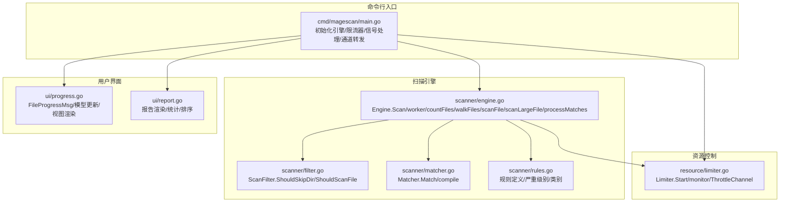
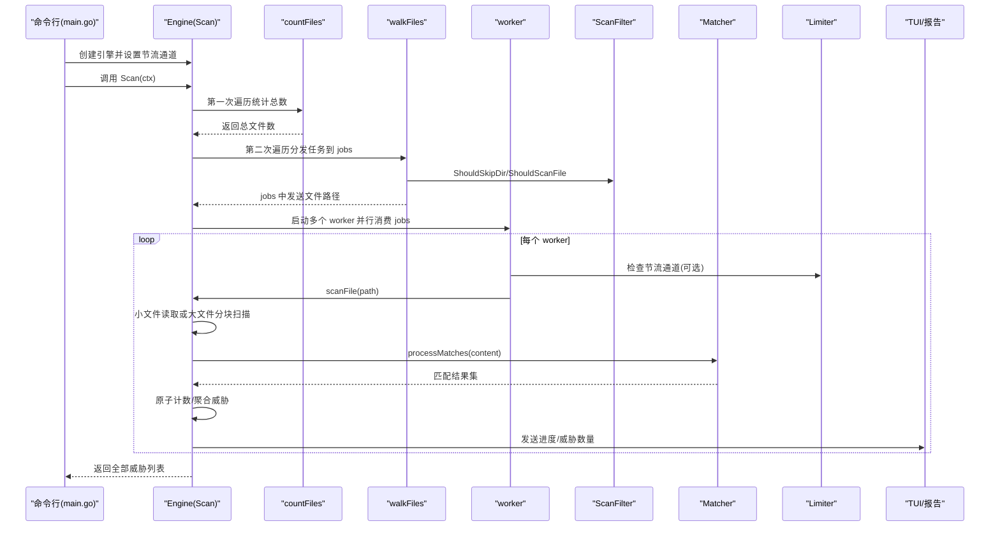
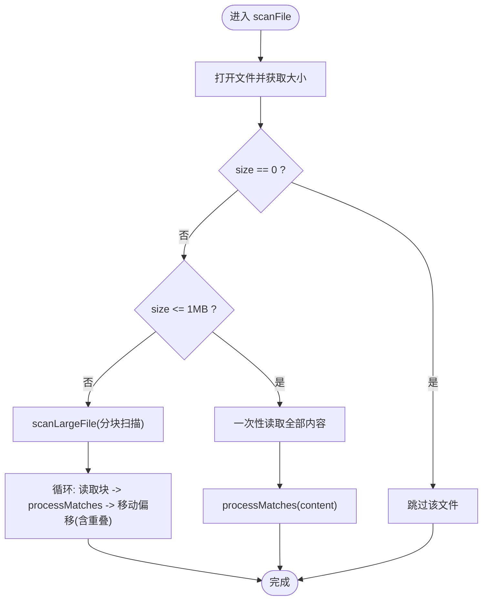

# 扫描方法

<cite>
**本文引用的文件**
- [engine.go](file://scanner/engine.go)
- [matcher.go](file://scanner/matcher.go)
- [filter.go](file://scanner/filter.go)
- [rules.go](file://scanner/rules.go)
- [limiter.go](file://resource/limiter.go)
- [progress.go](file://ui/progress.go)
- [report.go](file://ui/report.go)
- [main.go](file://cmd/magescan/main.go)
- [README.md](file://README.md)
</cite>

## 目录
1. [简介](#简介)
2. [项目结构](#项目结构)
3. [核心组件](#核心组件)
4. [架构总览](#架构总览)
5. [详细组件分析](#详细组件分析)
6. [依赖分析](#依赖分析)
7. [性能考虑](#性能考虑)
8. [故障排查指南](#故障排查指南)
9. [结论](#结论)
10. [附录：API 参考与最佳实践](#附录api-参考与最佳实践)

## 简介
本文件聚焦于扫描引擎的核心方法，系统性地梳理 Scan() 的完整工作流程（文件计数、工作池启动、文件遍历、并发处理），解释 countFiles() 与 walkFiles() 的区别与协作关系，worker() 的并发处理机制与任务分配策略，scanFile() 与 scanLargeFile() 的文件处理逻辑（小文件与大文件不同策略），以及 processMatches() 的匹配处理与威胁记录机制。同时提供每个方法的参数说明、返回值类型、错误处理方式、使用示例与性能优化建议。

## 项目结构
扫描引擎位于 scanner 包中，核心入口为 Engine 结构体及其方法；资源限制由 resource 包中的 Limiter 提供；UI 层通过通道向终端实时展示进度与报告。



图表来源
- [engine.go:47-323](file://scanner/engine.go#L47-L323)
- [filter.go:8-98](file://scanner/filter.go#L8-L98)
- [matcher.go:22-168](file://scanner/matcher.go#L22-L168)
- [rules.go:39-468](file://scanner/rules.go#L39-L468)
- [limiter.go:11-118](file://resource/limiter.go#L11-L118)
- [progress.go:54-289](file://ui/progress.go#L54-L289)
- [report.go:11-230](file://ui/report.go#L11-L230)
- [main.go:24-208](file://cmd/magescan/main.go#L24-L208)

章节来源
- [README.md:239-258](file://README.md#L239-L258)
- [main.go:24-208](file://cmd/magescan/main.go#L24-L208)

## 核心组件
- Engine：扫描引擎主体，负责统计文件、启动工作池、分发任务、并发扫描、进度上报与结果聚合。
- Matcher：规则匹配器，预编译规则，支持正则与字面量匹配，并行安全。
- ScanFilter：过滤器，决定目录跳过与文件扫描范围（fast/full 模式）。
- Limiter：资源限制器，监控内存并在阈值触发时对工作池进行节流。
- UI 进度与报告：通过通道接收扫描进度，渲染 TUI 并生成最终报告。

章节来源
- [engine.go:47-131](file://scanner/engine.go#L47-L131)
- [matcher.go:22-82](file://scanner/matcher.go#L22-L82)
- [filter.go:8-98](file://scanner/filter.go#L8-L98)
- [limiter.go:11-62](file://resource/limiter.go#L11-L62)
- [progress.go:54-197](file://ui/progress.go#L54-L197)
- [report.go:11-168](file://ui/report.go#L11-L168)

## 架构总览
下图展示了从命令行到扫描引擎、资源限制器与 UI 的端到端调用链路。



图表来源
- [main.go:94-126](file://cmd/magescan/main.go#L94-L126)
- [engine.go:76-121](file://scanner/engine.go#L76-L121)
- [engine.go:133-193](file://scanner/engine.go#L133-L193)
- [engine.go:195-227](file://scanner/engine.go#L195-L227)
- [engine.go:229-285](file://scanner/engine.go#L229-L285)
- [matcher.go:63-82](file://scanner/matcher.go#L63-L82)
- [limiter.go:54-62](file://resource/limiter.go#L54-L62)
- [progress.go:161-169](file://ui/progress.go#L161-L169)

## 详细组件分析

### Engine.Scan() 工作流程
- 输入
  - ctx：上下文，用于取消与超时控制
- 步骤
  1) countFiles() 首次遍历统计可扫描文件总数，写入原子统计字段
  2) 创建 jobs 通道（容量为 workerCount 的若干倍）
  3) 启动 workerCount 个 worker 协程，每个 worker 从 jobs 通道消费文件路径
  4) walkFiles() 第二次遍历，根据过滤器将符合条件的文件路径发送至 jobs
  5) 关闭 jobs，等待所有 worker 完成
  6) 发送最终进度 Done=true
  7) 加锁复制 findings 列表并返回
- 错误处理
  - 若 countFiles() 出错，直接返回错误
  - worker 内部对打开/读取失败的文件采用“跳过”策略，不中断整体扫描
- 性能要点
  - workerCount 默认为 CPU 核数的两倍，提升吞吐
  - 使用原子变量更新扫描统计，避免频繁加锁
  - 进度按固定步长发送，减少 UI 压力

章节来源
- [engine.go:76-121](file://scanner/engine.go#L76-L121)
- [engine.go:133-161](file://scanner/engine.go#L133-L161)
- [engine.go:163-193](file://scanner/engine.go#L163-L193)
- [engine.go:195-227](file://scanner/engine.go#L195-L227)

### countFiles() 与 walkFiles() 的区别与协作
- countFiles()
  - 作用：仅统计可扫描文件数量，不实际读取内容
  - 行为：遍历目录树，使用过滤器判断是否跳过目录/文件，累加计数
  - 返回：int64 文件总数
- walkFiles()
  - 作用：在第二次遍历时将文件路径推送到 jobs 通道
  - 行为：与 countFiles() 类似，但遇到可扫描文件时向 jobs 发送路径
  - 返回：遍历错误（若发生）
- 协作关系
  - 先统计总数，再分发任务，确保 UI 能显示准确的总进度
  - 两者共享相同的过滤逻辑，保证一致性

章节来源
- [engine.go:133-161](file://scanner/engine.go#L133-L161)
- [engine.go:163-193](file://scanner/engine.go#L163-L193)
- [filter.go:61-97](file://scanner/filter.go#L61-L97)

### worker() 并发处理机制与任务分配
- 任务来源：jobs 通道（由 walkFiles() 推送）
- 分配策略：
  - 每个 worker 从通道阻塞读取，直到通道关闭
  - 支持节流：若设置了节流通道，worker 在继续前检查是否有暂停信号，收到后阻塞直至恢复
- 处理流程：
  - 节流检查
  - 调用 scanFile() 对单个文件进行扫描
  - 原子更新已扫描文件数，按固定步长发送进度
- 并发特性：
  - 多 worker 并行，jobs 通道容量为 workerCount 的若干倍，避免阻塞

章节来源
- [engine.go:195-227](file://scanner/engine.go#L195-L227)
- [engine.go:71-74](file://scanner/engine.go#L71-L74)

### scanFile() 与 scanLargeFile() 的文件处理逻辑
- scanFile(path)
  - 打开只读文件，获取大小
  - 若 size==0 或打开失败，跳过
  - 若 size<=maxFileSize（默认 1MB），一次性读取整个文件内容并交给 processMatches()
  - 否则调用 scanLargeFile() 进行分块扫描
- scanLargeFile(f, path, size)
  - 以 maxFileSize 为块大小，按 chunkOverlap（默认 100 字节）重叠滑动
  - 使用 ReadAt 从偏移位置读取，逐块调用 processMatches()
  - 移动步长为块大小减去重叠，直到 EOF 或读取不足



图表来源
- [engine.go:229-285](file://scanner/engine.go#L229-L285)

章节来源
- [engine.go:229-285](file://scanner/engine.go#L229-L285)

### processMatches() 的匹配处理与威胁记录机制
- 输入：文件路径与字节内容
- 流程：
  - 调用 Matcher.Match(content) 获取匹配结果集
  - 若无匹配，直接返回
  - 将每个匹配转换为 Finding 结构（包含文件路径、行号、规则ID、类别、严重级别、描述、匹配文本）
  - 原子增加威胁计数
  - 加锁追加到 findings 切片
  - 若存在进度通道，发送当前文件与累计威胁数
- 输出：无（副作用：更新统计与 findings）

章节来源
- [engine.go:287-322](file://scanner/engine.go#L287-L322)
- [matcher.go:63-82](file://scanner/matcher.go#L63-L82)

### 规则系统与匹配器
- 规则定义
  - 规则包含 ID、类别、严重级别、描述、字面量模式或正则表达式、是否正则标记
  - 严重级别：Critical/High/Medium/Low
  - 类别：WebShell/Backdoor、Payment Skimmer、Obfuscation、Magento-Specific
- 匹配器
  - 预编译所有规则的正则表达式，避免重复编译
  - Match(content)：按行扫描，分别处理字面量与正则匹配
  - 字面量匹配使用快速包含检查，再定位行号
  - 正则匹配先做全局快速匹配，再逐行定位
- 并发安全：Matcher 是线程安全的，可被多 worker 并行调用

章节来源
- [rules.go:39-468](file://scanner/rules.go#L39-L468)
- [matcher.go:22-168](file://scanner/matcher.go#L22-L168)

### 资源限制与节流
- Limiter
  - Start()：设置 GOMAXPROCS（可选），启动后台监控
  - monitor()：每 500ms 读取内存，超过阈值则置位 isThrottled 并通过 throttleCh 发送暂停信号
  - checkMemory()：内存回收与 hysteresis（降至 80% 阈值才恢复）
  - Stop()：停止监控并恢复原始 GOMAXPROCS
- Engine.SetThrottleChannel()
  - worker() 在每次处理前检查 throttleCh，收到暂停信号则阻塞等待恢复信号

章节来源
- [limiter.go:34-118](file://resource/limiter.go#L34-L118)
- [engine.go:71-74](file://scanner/engine.go#L71-L74)
- [engine.go:195-227](file://scanner/engine.go#L195-L227)

### UI 进度与报告
- 进度通道
  - Engine 将 ScanProgress 发送到通道，main.go 转发给 TUI 模型
  - TUI 模型接收 FileProgressMsg/DBProgressMsg，更新进度条、当前文件、威胁数与阶段
- 报告
  - 统计各严重级别的威胁数量，按严重程度排序输出
  - 生成修复建议 SQL（数据库威胁）

章节来源
- [progress.go:15-289](file://ui/progress.go#L15-L289)
- [report.go:11-230](file://ui/report.go#L11-L230)
- [main.go:128-151](file://cmd/magescan/main.go#L128-L151)

## 依赖分析
- Engine 依赖
  - Filter：决定目录跳过与文件扫描范围
  - Matcher：执行规则匹配
  - Limiter：可选的资源节流通道
  - UI：通过通道接收进度
- 数据结构耦合
  - Finding/ScanStats/ScanProgress 作为跨层数据载体
  - 规则系统独立于引擎，通过 Matcher 注入

```mermaid
classDiagram
class Engine {
+rootPath string
+filter *ScanFilter
+matcher *Matcher
+workerCount int
+findings []Finding
+stats ScanStats
+progressCh chan ScanProgress
+throttleCh chan struct{}
+Scan(ctx) ([]Finding, error)
+GetStats() ScanStats
+SetThrottleChannel(ch)
+countFiles(ctx) int64
+walkFiles(ctx, jobs) error
+worker(ctx, jobs)
+scanFile(path)
+scanLargeFile(f, path, size)
+processMatches(path, content)
}
class ScanFilter {
+Mode string
+ShouldSkipDir(relPath) bool
+ShouldScanFile(fileName) bool
}
class Matcher {
+Match(content) []MatchResult
+RuleCount() int
+RulesByCategory(cat) []CompiledRule
}
class Limiter {
+Start()
+Stop()
+ThrottleChannel() chan struct{}
+IsThrottled() bool
}
Engine --> ScanFilter : "使用"
Engine --> Matcher : "使用"
Engine --> Limiter : "可选使用"
```

图表来源
- [engine.go:47-323](file://scanner/engine.go#L47-L323)
- [filter.go:8-98](file://scanner/filter.go#L8-L98)
- [matcher.go:22-168](file://scanner/matcher.go#L22-L168)
- [limiter.go:11-118](file://resource/limiter.go#L11-L118)

章节来源
- [engine.go:47-131](file://scanner/engine.go#L47-L131)
- [filter.go:8-98](file://scanner/filter.go#L8-L98)
- [matcher.go:22-82](file://scanner/matcher.go#L22-L82)
- [limiter.go:11-62](file://resource/limiter.go#L11-L62)

## 性能考虑
- 并发策略
  - workerCount 默认为 2×CPU 核数，适合 I/O 密集型扫描
  - jobs 通道容量为 workerCount 的若干倍，降低阻塞概率
- 内存与 CPU
  - 大文件采用分块扫描与重叠滑动，避免一次性加载导致内存峰值
  - Limiter 通过 GOMAXPROCS 限制并发度，结合内存监控实现自适应节流
- I/O 与磁盘
  - 小文件一次性读取，减少系统调用次数
  - 大文件分块读取，兼顾内存占用与命中率
- 进度与 UI
  - 固定步长发送进度，避免 UI 高频刷新造成额外开销

章节来源
- [engine.go:13-17](file://scanner/engine.go#L13-L17)
- [engine.go:60-69](file://scanner/engine.go#L60-L69)
- [limiter.go:34-52](file://resource/limiter.go#L34-L52)

## 故障排查指南
- 扫描未结束或卡住
  - 检查是否设置了资源限制且处于节流状态
  - 查看 Limiter.IsThrottled() 与 throttleCh 是否被阻塞
- 威胁数为 0
  - 确认扫描模式（fast/full）与过滤器是否正确
  - 检查规则是否被正确编译（无效正则会被跳过）
- 进度不更新
  - 确认 progressCh 是否被 main.go 正确转发到 TUI
- 大文件扫描异常
  - 检查文件权限与大小，确认 ReadAt 是否成功
  - 调整 chunkOverlap 与 maxFileSize 参数（代码内常量）

章节来源
- [limiter.go:59-62](file://resource/limiter.go#L59-L62)
- [matcher.go:44-61](file://scanner/matcher.go#L44-L61)
- [progress.go:161-169](file://ui/progress.go#L161-L169)
- [engine.go:261-285](file://scanner/engine.go#L261-L285)

## 结论
扫描引擎通过“两次遍历 + 工作池 + 分块扫描 + 资源节流”的组合，在保证高吞吐的同时兼顾内存与 CPU 的稳定性。countFiles() 与 walkFiles() 的职责分离确保了进度与任务分发的准确性；processMatches() 将匹配结果标准化为统一的数据结构，便于 UI 与报告模块复用。通过合理配置扫描模式与资源限制，可在不同环境中获得稳定可靠的扫描体验。

## 附录：API 参考与最佳实践

### Engine.API
- Scan(ctx) ([]Finding, error)
  - 功能：启动扫描，返回全部威胁
  - 参数：ctx 上下文（支持取消）
  - 返回：威胁列表、错误
  - 使用示例：参见命令行入口对引擎的调用
- GetStats() ScanStats
  - 功能：获取当前扫描统计
  - 返回：总文件数、已扫描文件数、威胁数、当前文件名
- SetThrottleChannel(ch)
  - 功能：设置资源节流通道（可选）
  - 参数：ch 为 struct{} 通道
- countFiles(ctx) int64
  - 功能：统计可扫描文件总数
  - 返回：文件数
- walkFiles(ctx, jobs) error
  - 功能：遍历并分发文件路径到 jobs
  - 返回：遍历错误
- worker(ctx, jobs)
  - 功能：从 jobs 消费并处理文件
  - 返回：无
- scanFile(path)
  - 功能：根据文件大小选择读取策略
  - 返回：无
- scanLargeFile(f, path, size)
  - 功能：大文件分块扫描
  - 返回：无
- processMatches(path, content)
  - 功能：匹配并记录威胁
  - 返回：无

章节来源
- [engine.go:76-131](file://scanner/engine.go#L76-L131)
- [engine.go:133-193](file://scanner/engine.go#L133-L193)
- [engine.go:195-285](file://scanner/engine.go#L195-L285)

### Matcher.API
- Match(content) []MatchResult
  - 功能：对内容进行规则匹配
  - 返回：匹配结果集合
- RuleCount() int / RulesByCategory(cat) []CompiledRule
  - 功能：查询规则数量与按类别筛选

章节来源
- [matcher.go:63-168](file://scanner/matcher.go#L63-L168)

### ScanFilter.API
- ShouldSkipDir(relPath) bool / ShouldScanFile(fileName) bool
  - 功能：基于模式与扩展名决定是否跳过

章节来源
- [filter.go:61-97](file://scanner/filter.go#L61-L97)

### Limiter.API
- Start() / Stop()
  - 功能：启动/停止资源监控
- ThrottleChannel() chan struct{} / IsThrottled() bool
  - 功能：获取节流通道与状态

章节来源
- [limiter.go:34-118](file://resource/limiter.go#L34-L118)

### 最佳实践
- 扫描模式选择
  - 快速扫描：仅扫描 .php/.phtml，适合日常巡检
  - 全量扫描：排除常见静态资源，适合深度审计
- 资源限制
  - 在生产服务器上设置合理的 CPU 与内存上限，避免影响业务
  - 使用 Limiter 的 hysteresis 机制，避免频繁启停
- 并发与 I/O
  - 硬盘随机访问场景建议适当降低 workerCount，避免过多小文件争抢
  - 对网络存储建议开启更保守的内存上限
- 进度与可观测性
  - 通过 progressCh 与 TUI 实时掌握扫描进度
  - 记录日志以便问题定位（可在应用层扩展）