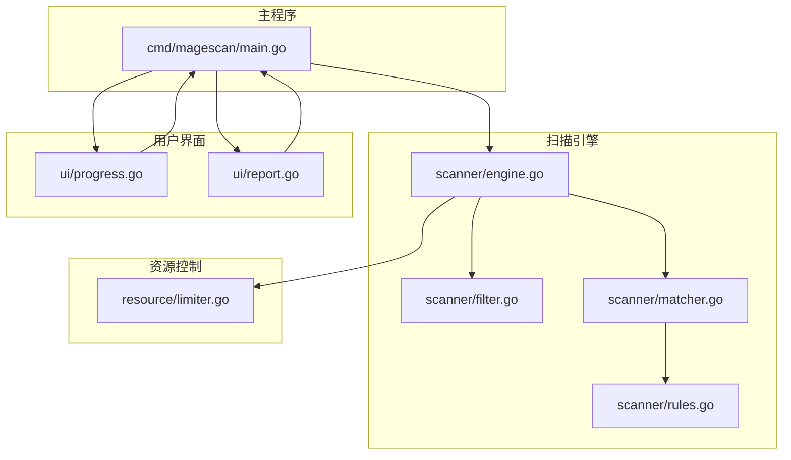
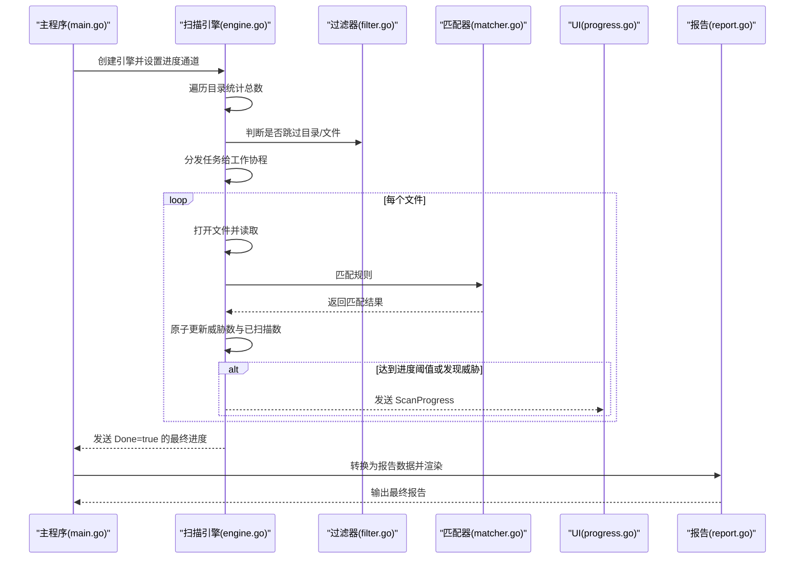
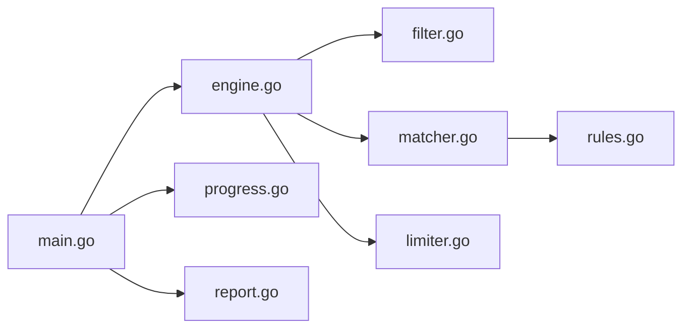

# 扫描统计与进度

<cite>
**本文引用的文件**
- [engine.go](file://scanner/engine.go)
- [progress.go](file://ui/progress.go)
- [report.go](file://ui/report.go)
- [main.go](file://cmd/magescan/main.go)
- [filter.go](file://scanner/filter.go)
- [matcher.go](file://scanner/matcher.go)
- [rules.go](file://scanner/rules.go)
- [limiter.go](file://resource/limiter.go)
- [config.go](file://config/config.go)
</cite>

## 目录
1. [简介](#简介)
2. [项目结构](#项目结构)
3. [核心组件](#核心组件)
4. [架构总览](#架构总览)
5. [详细组件分析](#详细组件分析)
6. [依赖分析](#依赖分析)
7. [性能考量](#性能考量)
8. [故障排查指南](#故障排查指南)
9. [结论](#结论)
10. [附录](#附录)

## 简介
本文件聚焦于扫描统计与进度相关的数据结构与流程，系统性说明以下内容：
- ScanStats 与 ScanProgress 的字段含义、使用场景与更新机制
- 统计字段 TotalFiles、ScannedFiles、ThreatsFound、CurrentFile 的语义与来源
- Done 字段在扫描完成标识中的作用
- GetStats() 方法的使用方式与统计数据的获取
- 进度回调机制与实时更新的实现原理（通道驱动）
- 进度计算公式与性能优化要点
- 统计数据的可视化与报告生成示例

## 项目结构
围绕“扫描统计与进度”的关键模块分布如下：
- 扫描引擎：负责文件遍历、匹配检测、统计更新与进度推送
- 用户界面：接收进度消息，渲染进度条、威胁数与耗时等信息
- 主程序：协调引擎、数据库扫描与 UI 渲染，汇总最终报告

图表来源
- [main.go:78-151](file://cmd/magescan/main.go#L78-L151)
- [engine.go:48-121](file://scanner/engine.go#L48-L121)
- [progress.go:55-82](file://ui/progress.go#L55-L82)
- [report.go:11-21](file://ui/report.go#L11-L21)
- [filter.go:8-59](file://scanner/filter.go#L8-L59)
- [matcher.go:22-42](file://scanner/matcher.go#L22-L42)
- [rules.go:39-58](file://scanner/rules.go#L39-L58)
- [limiter.go:11-32](file://resource/limiter.go#L11-L32)

章节来源
- [main.go:78-151](file://cmd/magescan/main.go#L78-L151)
- [engine.go:48-121](file://scanner/engine.go#L48-L121)
- [progress.go:55-82](file://ui/progress.go#L55-L82)
- [report.go:11-21](file://ui/report.go#L11-L21)
- [filter.go:8-59](file://scanner/filter.go#L8-L59)
- [matcher.go:22-42](file://scanner/matcher.go#L22-L42)
- [rules.go:39-58](file://scanner/rules.go#L39-L58)
- [limiter.go:11-32](file://resource/limiter.go#L11-L32)

## 核心组件
本节聚焦两类核心数据结构及其职责：
- ScanStats：扫描过程中的累计统计，供外部查询
- ScanProgress：用于向 UI 推送的进度消息，包含当前文件、已扫描数、总数、威胁数与完成标志

章节来源
- [engine.go:30-45](file://scanner/engine.go#L30-L45)

## 架构总览
下图展示从扫描引擎到 UI 的完整数据流，以及主程序如何协调各组件。

图表来源
- [main.go:94-126](file://cmd/magescan/main.go#L94-L126)
- [engine.go:77-121](file://scanner/engine.go#L77-L121)
- [filter.go:61-97](file://scanner/filter.go#L61-L97)
- [matcher.go:63-82](file://scanner/matcher.go#L63-L82)
- [progress.go:161-169](file://ui/progress.go#L161-L169)
- [report.go:57-168](file://ui/report.go#L57-L168)

## 详细组件分析

### 数据结构定义与字段说明
- ScanStats
  - TotalFiles：扫描开始前通过一次遍历统计得到的总文件数（原子写入）
  - ScannedFiles：已扫描文件数量（原子累加）
  - ThreatsFound：检测到的威胁总数（原子累加）
  - CurrentFile：当前正在扫描的文件路径（由工作协程更新）

- ScanProgress
  - CurrentFile：当前文件路径
  - ScannedFiles：已扫描文件数量
  - TotalFiles：总文件数量
  - ThreatsFound：威胁总数
  - Done：扫描完成标志（仅在最终进度中置为 true）

章节来源
- [engine.go:30-45](file://scanner/engine.go#L30-L45)

### 统计字段的含义与更新机制
- TotalFiles
  - 来源：扫描开始前进行一次目录遍历，仅统计符合过滤条件的文件数量
  - 更新：在扫描启动时一次性写入，后续不再变更
  - 使用：用于计算进度百分比与显示“已扫描/总数”

- ScannedFiles
  - 来源：每个工作协程处理完一个文件后原子递增
  - 更新：每次文件处理完成后原子累加
  - 使用：用于实时进度与百分比计算

- ThreatsFound
  - 来源：每次匹配到威胁时，原子累加威胁计数
  - 更新：匹配阶段即时更新
  - 使用：用于 UI 展示威胁数量与最终报告统计

- CurrentFile
  - 来源：工作协程在扫描文件时更新
  - 更新：每次处理新文件时覆盖
  - 使用：用于 UI 显示当前扫描文件名

- Done
  - 来源：扫描结束时发送的最终进度消息
  - 更新：仅在扫描完成时置为 true
  - 使用：UI 切换到数据库扫描阶段或进入完成态

章节来源
- [engine.go:77-121](file://scanner/engine.go#L77-L121)
- [engine.go:134-161](file://scanner/engine.go#L134-L161)
- [engine.go:196-227](file://scanner/engine.go#L196-L227)
- [engine.go:288-322](file://scanner/engine.go#L288-L322)

### GetStats() 方法的使用与统计数据获取
- GetStats() 提供线程安全的统计数据快照，内部通过原子读取保证并发安全
- 使用场景
  - 外部监控：在非 UI 线程中定期拉取统计数据
  - 报告生成：主程序在扫描结束后汇总统计数据
- 获取方式
  - 调用引擎实例的 GetStats() 方法，返回 ScanStats 结构体副本

章节来源
- [engine.go:123-131](file://scanner/engine.go#L123-L131)
- [main.go:190-198](file://cmd/magescan/main.go#L190-L198)

### 进度回调机制与实时更新原理
- 通道驱动
  - 主程序创建两个进度通道：文件扫描进度通道与数据库扫描进度通道
  - 扫描引擎在满足阈值或发现威胁时向通道发送 ScanProgress
  - 主程序分别转发到 UI 的 FileProgressMsg 与 DBProgressMsg
- 实时更新策略
  - 文件扫描：每处理 N 个文件（默认阈值）发送一次进度
  - 威胁发现：一旦匹配到威胁即刻发送进度
  - 扫描结束：发送 Done=true 的最终进度，通知 UI 切换阶段
- UI 渲染
  - UI 模型接收进度消息后更新状态，并根据 totalFiles 计算百分比
  - 当 Done=true 时切换到数据库扫描阶段

章节来源
- [main.go:78-151](file://cmd/magescan/main.go#L78-L151)
- [engine.go:217-225](file://scanner/engine.go#L217-L225)
- [engine.go:313-321](file://scanner/engine.go#L313-L321)
- [engine.go:105-113](file://scanner/engine.go#L105-L113)
- [progress.go:161-169](file://ui/progress.go#L161-L169)

### 进度计算公式与性能考虑
- 进度计算
  - 百分比 = 已扫描文件数 / 总文件数
  - UI 中以该比例渲染进度条与百分比文本
- 性能优化点
  - 原子操作：TotalFiles、ScannedFiles、ThreatsFound 使用原子读写，避免锁竞争
  - 进度阈值：按固定步长发送进度，降低通道压力
  - 资源限制：内存超限时通过限流通道暂停工作协程，防止 OOM
  - 大文件扫描：采用重叠分块读取，兼顾性能与覆盖率

章节来源
- [engine.go:13-17](file://scanner/engine.go#L13-L17)
- [engine.go:217-225](file://scanner/engine.go#L217-L225)
- [limiter.go:64-117](file://resource/limiter.go#L64-L117)
- [engine.go:261-285](file://scanner/engine.go#L261-L285)

### 统计数据的可视化与报告生成
- UI 可视化
  - 文件扫描阶段：显示进度条、当前文件、威胁数与耗时
  - 数据库扫描阶段：显示阶段名称、记录扫描数与威胁数
  - 完成阶段：提示扫描完成并退出
- 报告生成
  - 主程序将扫描结果转换为报告数据结构，包含目标路径、模式、耗时、文件威胁与数据库威胁
  - 报告按严重级别统计威胁数量，并输出详细列表与修复建议

章节来源
- [progress.go:199-263](file://ui/progress.go#L199-L263)
- [report.go:57-168](file://ui/report.go#L57-L168)
- [main.go:159-201](file://cmd/magescan/main.go#L159-L201)

## 依赖分析
- 扫描引擎依赖过滤器与匹配器，匹配器依赖规则集
- 主程序依赖引擎、UI 与报告模块，同时通过通道与 UI 协作
- 资源限制器通过通道影响工作协程的执行节奏

图表来源
- [main.go:94-126](file://cmd/magescan/main.go#L94-L126)
- [engine.go:48-69](file://scanner/engine.go#L48-L69)
- [filter.go:8-59](file://scanner/filter.go#L8-L59)
- [matcher.go:22-42](file://scanner/matcher.go#L22-L42)
- [rules.go:39-58](file://scanner/rules.go#L39-L58)
- [progress.go:55-82](file://ui/progress.go#L55-L82)
- [report.go:11-21](file://ui/report.go#L11-L21)
- [limiter.go:11-32](file://resource/limiter.go#L11-L32)

章节来源
- [main.go:94-126](file://cmd/magescan/main.go#L94-L126)
- [engine.go:48-69](file://scanner/engine.go#L48-L69)
- [filter.go:8-59](file://scanner/filter.go#L8-L59)
- [matcher.go:22-42](file://scanner/matcher.go#L22-L42)
- [rules.go:39-58](file://scanner/rules.go#L39-L58)
- [progress.go:55-82](file://ui/progress.go#L55-L82)
- [report.go:11-21](file://ui/report.go#L11-L21)
- [limiter.go:11-32](file://resource/limiter.go#L11-L32)

## 性能考量
- 原子计数：TotalFiles、ScannedFiles、ThreatsFound 使用原子读写，避免锁竞争
- 进度阈值：按固定步长发送进度，减少通道阻塞与 UI 渲染压力
- 内存限制：当分配内存超过阈值时触发限流，暂停工作协程并强制 GC
- 大文件处理：采用重叠分块读取，兼顾性能与覆盖率
- 并发模型：工作协程池大小为 CPU 核数的两倍，充分利用多核

章节来源
- [engine.go:13-17](file://scanner/engine.go#L13-L17)
- [engine.go:217-225](file://scanner/engine.go#L217-L225)
- [limiter.go:64-117](file://resource/limiter.go#L64-L117)
- [engine.go:261-285](file://scanner/engine.go#L261-L285)

## 故障排查指南
- 扫描未开始或进度停滞
  - 检查过滤器是否误判导致文件被跳过
  - 确认工作协程是否因内存限制被暂停
- 威胁数异常
  - 检查匹配器规则是否正确加载
  - 确认大文件分块读取是否正常
- UI 不显示进度
  - 检查主程序是否正确转发进度通道消息
  - 确认 UI 模型是否收到 Done=true 的最终消息

章节来源
- [filter.go:61-97](file://scanner/filter.go#L61-L97)
- [limiter.go:88-116](file://resource/limiter.go#L88-L116)
- [matcher.go:44-61](file://scanner/matcher.go#L44-L61)
- [main.go:128-151](file://cmd/magescan/main.go#L128-L151)
- [progress.go:161-169](file://ui/progress.go#L161-L169)

## 结论
本文系统梳理了扫描统计与进度相关的数据结构与流程，明确了 ScanStats 与 ScanProgress 的字段语义、更新机制与使用方式；解释了进度回调与实时更新的实现原理；给出了进度计算公式与性能优化要点；并提供了统计数据的可视化与报告生成示例。通过通道驱动与原子计数，系统在保证高并发性能的同时实现了清晰的进度反馈与可扩展的报告能力。

## 附录
- 使用示例（GetStats）
  - 在需要获取当前扫描统计时，调用引擎实例的 GetStats() 方法，即可获得 TotalFiles、ScannedFiles、ThreatsFound、CurrentFile 的快照
  - 示例路径参考：[engine.go:123-131](file://scanner/engine.go#L123-L131)
- 进度回调示例
  - 主程序通过通道将 ScanProgress 转发至 UI 的 FileProgressMsg 或 DBProgressMsg，UI 根据 Done 字段切换阶段
  - 示例路径参考：[main.go:128-151](file://cmd/magescan/main.go#L128-L151)、[progress.go:161-169](file://ui/progress.go#L161-L169)
- 报告生成示例
  - 主程序将扫描结果转换为 ReportData 并调用 RenderReport 输出最终报告
  - 示例路径参考：[main.go:159-201](file://cmd/magescan/main.go#L159-L201)、[report.go:57-168](file://ui/report.go#L57-L168)