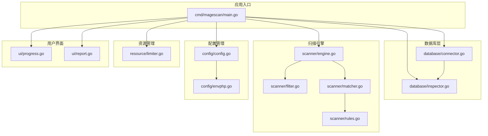
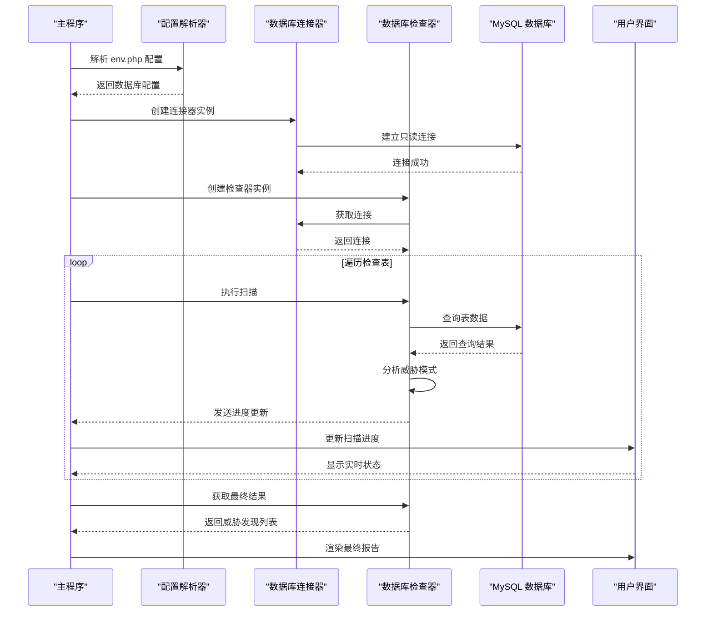
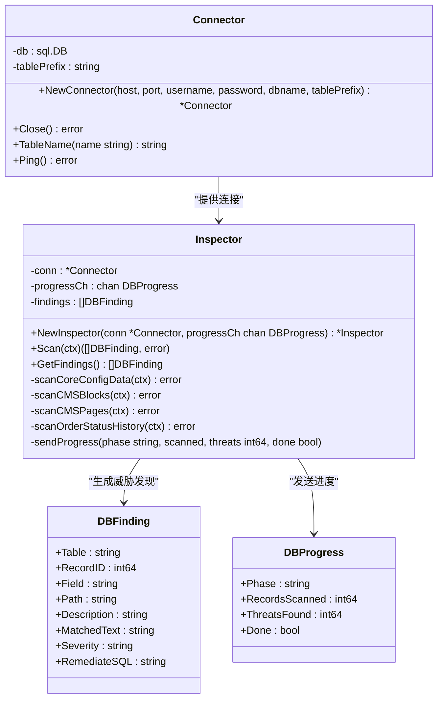
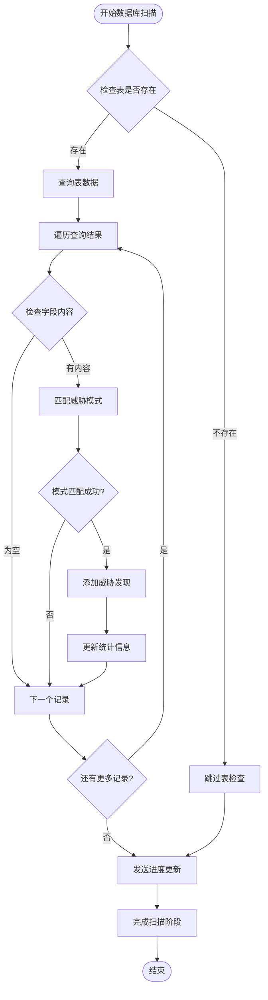
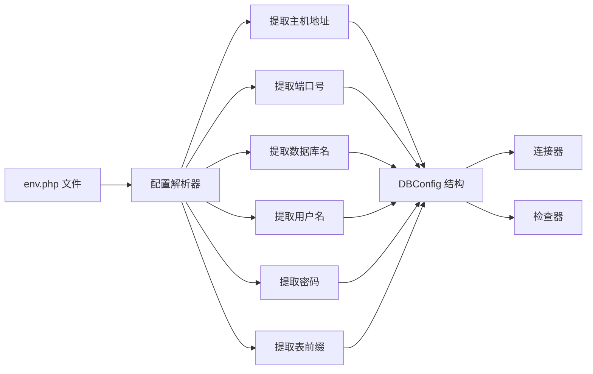
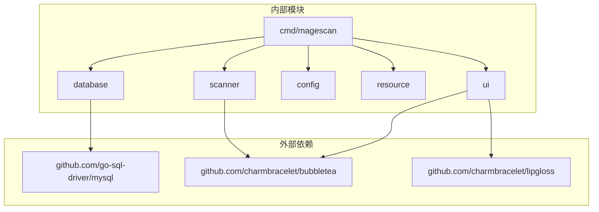

# 数据库检查 API

<cite>
**本文档引用的文件**
- [main.go](file://cmd/magescan/main.go)
- [connector.go](file://database/connector.go)
- [inspector.go](file://database/inspector.go)
- [engine.go](file://scanner/engine.go)
- [filter.go](file://scanner/filter.go)
- [matcher.go](file://scanner/matcher.go)
- [rules.go](file://scanner/rules.go)
- [config.go](file://config/config.go)
- [envphp.go](file://config/envphp.go)
- [limiter.go](file://resource/limiter.go)
- [progress.go](file://ui/progress.go)
- [report.go](file://ui/report.go)
- [go.mod](file://go.mod)
</cite>

## 目录
1. [简介](#简介)
2. [项目结构](#项目结构)
3. [核心组件](#核心组件)
4. [架构概览](#架构概览)
5. [详细组件分析](#详细组件分析)
6. [依赖分析](#依赖分析)
7. [性能考虑](#性能考虑)
8. [故障排除指南](#故障排除指南)
9. [结论](#结论)

## 简介

数据库检查 API 是 MageScan 安全扫描器的核心组件之一，专门用于检测 Magento 2 应用程序中的数据库威胁。该 API 提供了完整的数据库连接管理、查询执行和威胁检测功能，能够识别恶意脚本注入、支付数据窃取、CMS 内容篡改等安全威胁。

该系统采用模块化设计，通过连接器管理数据库连接，通过检查器执行威胁检测，通过资源限制器控制扫描性能，并通过用户界面提供实时进度反馈。所有组件都经过精心设计以确保高可靠性、高性能和易用性。

## 项目结构

项目采用清晰的分层架构，每个目录负责特定的功能领域：

**图表来源**
- [main.go:1-208](file://cmd/magescan/main.go#L1-L208)
- [connector.go:1-58](file://database/connector.go#L1-L58)
- [inspector.go:1-359](file://database/inspector.go#L1-L359)

**章节来源**
- [main.go:1-208](file://cmd/magescan/main.go#L1-L208)
- [go.mod:1-31](file://go.mod#L1-L31)

## 核心组件

### 数据库连接器 (Connector)

数据库连接器是数据库检查 API 的基础组件，负责管理 MySQL 连接和表前缀处理。

**主要功能：**
- 建立只读 MySQL 连接
- 管理连接池参数
- 处理表名前缀
- 验证连接有效性

**关键特性：**
- 使用只读连接确保扫描不会修改数据库
- 配置连接池大小（最大连接数 3，空闲连接 1）
- 自动超时设置（连接超时 10 秒，读取超时 30 秒）
- 支持动态表前缀处理

**章节来源**
- [connector.go:10-58](file://database/connector.go#L10-L58)

### 数据库检查器 (Inspector)

数据库检查器是威胁检测的核心组件，负责扫描指定的数据库表并识别潜在的安全威胁。

**支持的检查类型：**
1. **核心配置数据检查** (`core_config_data`)
2. **CMS 区块内容检查** (`cms_block`)
3. **CMS 页面内容检查** (`cms_page`)
4. **订单状态历史检查** (`sales_order_status_history`)

**威胁检测模式：**
- 外部脚本注入检测
- XSS 攻击模式识别
- 恶意 JavaScript 代码检测
- 支付数据窃取模式
- 跨站请求伪造攻击

**章节来源**
- [inspector.go:63-109](file://database/inspector.go#L63-L109)
- [inspector.go:38-50](file://database/inspector.go#L38-L50)

### 扫描引擎 (Scanner Engine)

虽然主要用于文件扫描，但扫描引擎的概念同样适用于数据库检查，提供了并发处理和进度跟踪能力。

**核心特性：**
- 并发工作线程池
- 进度监控和报告
- 资源使用限制
- 可取消的上下文支持

**章节来源**
- [engine.go:47-121](file://scanner/engine.go#L47-L121)

## 架构概览

数据库检查 API 采用分层架构设计，确保各组件职责明确且松耦合：

**图表来源**
- [main.go:105-126](file://cmd/magescan/main.go#L105-L126)
- [connector.go:16-39](file://database/connector.go#L16-L39)
- [inspector.go:79-109](file://database/inspector.go#L79-L109)

## 详细组件分析

### 数据库连接器类图

**图表来源**
- [connector.go:10-58](file://database/connector.go#L10-L58)
- [inspector.go:63-77](file://database/inspector.go#L63-L77)
- [inspector.go:11-30](file://database/inspector.go#L11-L30)

### 威胁检测算法流程

数据库威胁检测采用多模式匹配算法，针对不同类型的威胁使用不同的检测策略：

**图表来源**
- [inspector.go:116-177](file://database/inspector.go#L116-L177)
- [inspector.go:179-281](file://database/inspector.go#L179-L281)
- [inspector.go:283-330](file://database/inspector.go#L283-L330)

### 配置管理系统

数据库检查 API 通过配置系统自动从 Magento 配置文件中提取数据库连接信息：

**图表来源**
- [envphp.go:14-71](file://config/envphp.go#L14-L71)
- [config.go:25-32](file://config/config.go#L25-L32)

**章节来源**
- [envphp.go:10-88](file://config/envphp.go#L10-L88)
- [config.go:13-47](file://config/config.go#L13-L47)

## 依赖分析

数据库检查 API 的依赖关系相对简单，主要依赖于标准库和 MySQL 驱动：

**图表来源**
- [go.mod:5-10](file://go.mod#L5-L10)
- [main.go:15-20](file://cmd/magescan/main.go#L15-L20)

**章节来源**
- [go.mod:1-31](file://go.mod#L1-L31)

## 性能考虑

### 连接池管理

数据库连接器实现了优化的连接池配置：
- 最大连接数：3 个（避免过度占用数据库资源）
- 最大空闲连接：1 个（保持少量空闲连接以提高响应速度）
- 连接超时：10 秒（防止长时间阻塞）
- 读取超时：30 秒（允许长时间查询完成）

### 内存使用优化

系统采用了多种内存优化策略：
- 流式查询处理，避免一次性加载大量数据
- 内容截断机制，限制威胁内容显示长度
- 进度通道缓冲，支持异步处理
- 资源限制器监控，防止内存泄漏

### 并发处理

虽然数据库检查主要是串行操作，但系统支持以下并发特性：
- 多表并行检查（在扫描器层面）
- 异步进度报告
- 资源使用监控
- 可取消的上下文支持

## 故障排除指南

### 常见连接问题

**问题：无法连接到数据库**
- 检查数据库服务是否运行
- 验证主机地址和端口配置
- 确认网络连接正常
- 检查防火墙设置

**问题：认证失败**
- 验证用户名和密码正确性
- 检查用户权限设置
- 确认数据库名称正确
- 验证字符集和排序规则

### 性能问题

**问题：扫描速度慢**
- 检查数据库服务器性能
- 调整连接池大小
- 优化查询执行计划
- 考虑分批处理大数据表

**问题：内存使用过高**
- 检查资源限制器配置
- 监控内存使用情况
- 考虑减少并发连接数
- 优化正则表达式模式

### 威胁检测准确性

**问题：误报过多**
- 调整威胁检测模式
- 自定义敏感路径列表
- 优化正则表达式规则
- 增加上下文检查

**问题：漏报严重**
- 增强威胁检测模式
- 添加新的恶意模式
- 优化表扫描范围
- 提高检测阈值

**章节来源**
- [connector.go:27-33](file://database/connector.go#L27-L33)
- [limiter.go:78-117](file://resource/limiter.go#L78-L117)

## 结论

数据库检查 API 提供了一个完整、可靠且高效的 Magento 2 数据库安全扫描解决方案。通过模块化的架构设计、严格的威胁检测算法和优化的性能管理，该系统能够在不影响生产环境的情况下提供全面的安全评估。

**主要优势：**
- **安全性**：使用只读连接，确保扫描过程不会修改任何数据
- **可靠性**：完善的错误处理和异常恢复机制
- **性能**：优化的连接池管理和内存使用策略
- **可扩展性**：模块化设计支持功能扩展和定制
- **易用性**：简洁的 API 接口和详细的错误报告

**最佳实践建议：**
- 在非生产环境进行扫描以避免影响业务
- 定期更新威胁检测规则以应对新威胁
- 监控系统资源使用情况，根据环境调整配置
- 结合文件扫描结果进行全面的安全评估
- 制定标准化的修复流程和应急响应计划

该数据库检查 API 为 Magento 2 应用程序的安全维护提供了强有力的技术支持，有助于及时发现和解决潜在的安全威胁。