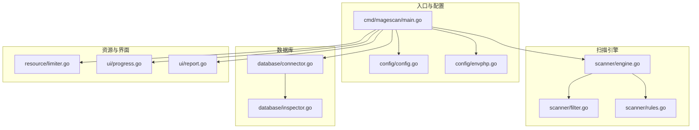
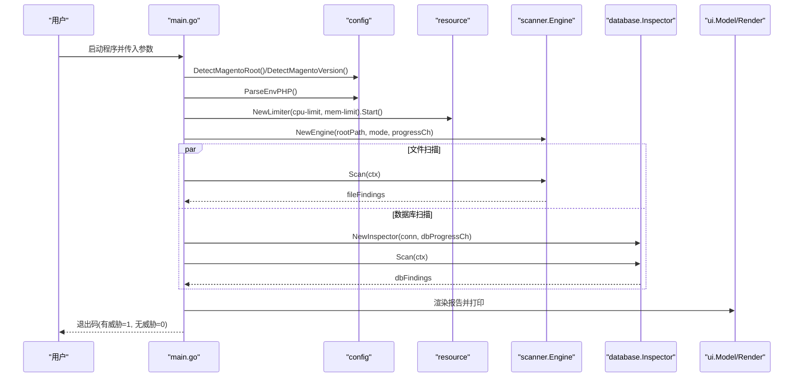
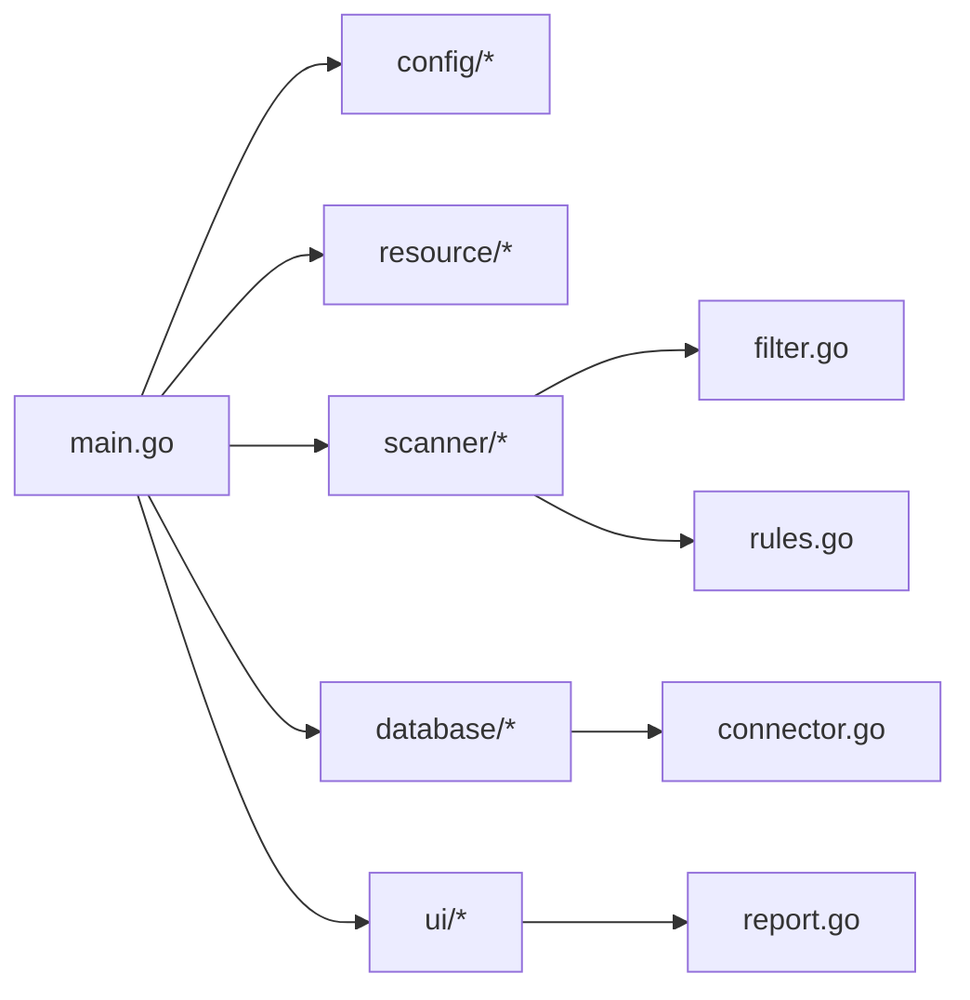

# 快速开始

<cite>
**本文引用的文件列表**
- [README.md](file://README.md)
- [go.mod](file://go.mod)
- [cmd/magescan/main.go](file://cmd/magescan/main.go)
- [config/config.go](file://config/config.go)
- [config/envphp.go](file://config/envphp.go)
- [scanner/engine.go](file://scanner/engine.go)
- [scanner/filter.go](file://scanner/filter.go)
- [scanner/rules.go](file://scanner/rules.go)
- [database/connector.go](file://database/connector.go)
- [database/inspector.go](file://database/inspector.go)
- [resource/limiter.go](file://resource/limiter.go)
- [ui/progress.go](file://ui/progress.go)
- [ui/report.go](file://ui/report.go)
</cite>

## 目录
1. [简介](#简介)
2. [项目结构](#项目结构)
3. [核心组件](#核心组件)
4. [架构总览](#架构总览)
5. [详细组件解析](#详细组件解析)
6. [依赖关系分析](#依赖关系分析)
7. [性能与资源限制](#性能与资源限制)
8. [常见用法与示例](#常见用法与示例)
9. [输出格式与退出代码](#输出格式与退出代码)
10. [故障排除与常见问题](#故障排除与常见问题)
11. [结论](#结论)

## 简介
MageScan 是一款面向 Magento 2 的高并发只读安全扫描器，支持文件系统与数据库双重检测，提供实时 TUI 进度界面与可读性强的报告输出。它内置 70+ 恶意签名，覆盖 Web Shell、支付劫持、混淆技术与 Magento 特定威胁，并支持 CPU/内存资源限制与优雅中断（SIGINT/SIGTERM）。

## 项目结构
仓库采用按功能域分层的组织方式：
- cmd/magescan：CLI 入口、参数解析、控制流编排
- config：Magento 根路径检测、版本识别、env.php 解析
- scanner：文件扫描引擎、过滤器、匹配器与规则集
- database：数据库连接器、安全检查器、修复建议 SQL
- resource：CPU/内存资源限制器与自动节流
- ui：TUI 进度模型与最终报告渲染

图表来源
- [cmd/magescan/main.go:1-208](file://cmd/magescan/main.go#L1-L208)
- [config/config.go:1-108](file://config/config.go#L1-L108)
- [config/envphp.go:1-88](file://config/envphp.go#L1-L88)
- [scanner/engine.go:1-323](file://scanner/engine.go#L1-L323)
- [scanner/filter.go:1-98](file://scanner/filter.go#L1-L98)
- [scanner/rules.go:1-468](file://scanner/rules.go#L1-L468)
- [database/connector.go:1-58](file://database/connector.go#L1-L58)
- [database/inspector.go:1-359](file://database/inspector.go#L1-L359)
- [resource/limiter.go:1-118](file://resource/limiter.go#L1-L118)
- [ui/progress.go:1-289](file://ui/progress.go#L1-L289)
- [ui/report.go:1-230](file://ui/report.go#L1-L230)

章节来源
- [README.md:240-258](file://README.md#L240-L258)
- [go.mod:1-31](file://go.mod#L1-L31)

## 核心组件
- CLI 入口与控制流：解析参数、检测 Magento 根、解析数据库配置、初始化资源限制器、启动 TUI、运行文件扫描与数据库扫描、汇总报告与退出码
- 配置模块：根路径检测、版本识别、env.php 解析
- 扫描引擎：工作池、文件遍历、大文件分块读取、匹配器与规则集
- 数据库检查：连接管理、多表扫描、威胁识别与修复 SQL 生成
- 资源限制：CPU/GOMAXPROCS 设置、周期性内存监控、自动节流通道
- UI：TUI 模型与进度、最终报告渲染

章节来源
- [cmd/magescan/main.go:24-207](file://cmd/magescan/main.go#L24-L207)
- [config/config.go:49-107](file://config/config.go#L49-L107)
- [scanner/engine.go:47-131](file://scanner/engine.go#L47-L131)
- [database/inspector.go:63-109](file://database/inspector.go#L63-L109)
- [resource/limiter.go:11-62](file://resource/limiter.go#L11-L62)
- [ui/progress.go:54-82](file://ui/progress.go#L54-L82)

## 架构总览
下图展示了从 CLI 到扫描与报告的端到端流程。

图表来源
- [cmd/magescan/main.go:35-126](file://cmd/magescan/main.go#L35-L126)
- [config/config.go:49-107](file://config/config.go#L49-L107)
- [config/envphp.go:14-70](file://config/envphp.go#L14-L70)
- [resource/limiter.go:34-51](file://resource/limiter.go#L34-L51)
- [scanner/engine.go:76-121](file://scanner/engine.go#L76-L121)
- [database/inspector.go:79-109](file://database/inspector.go#L79-L109)
- [ui/report.go:57-168](file://ui/report.go#L57-L168)

## 详细组件解析

### 命令行参数与默认值
- -path：目标 Magento 根目录，默认为当前目录
- -mode：扫描模式，fast 或 full，默认 fast
- -cpu-limit：最大 CPU 核数（0 表示不限制）
- -mem-limit：最大内存 MB（0 表示不限制）
- -output：输出格式，terminal 或 json（预留字段）

章节来源
- [cmd/magescan/main.go:26-31](file://cmd/magescan/main.go#L26-L31)
- [README.md:74-83](file://README.md#L74-L83)

### 安装与构建
- 使用 Go 1.21+ 从源码构建二进制
- 构建后得到独立可执行文件，无需 PHP 环境

章节来源
- [README.md:50-58](file://README.md#L50-L58)
- [go.mod:3](file://go.mod#L3)

### Magento 根路径检测与版本识别
- 校验 app/etc/env.php 与 bin/magento 是否存在
- 从 composer.json 中提取版本信息

章节来源
- [config/config.go:49-107](file://config/config.go#L49-L107)

### 数据库配置解析
- 从 env.php 提取主机、端口、用户名、密码、数据库名与表前缀
- 支持 host:port 形式的主机字符串

章节来源
- [config/envphp.go:14-70](file://config/envphp.go#L14-L70)

### 扫描引擎与规则
- 工作池规模为 CPU 数量的两倍
- 大文件采用 1MB 分块重叠读取，避免内存峰值
- 过滤器在 fast 模式仅扫描 .php 与 .phtml，在 full 模式排除静态资源等扩展
- 规则集包含 70+ 签名，覆盖四类威胁

章节来源
- [scanner/engine.go:61-69](file://scanner/engine.go#L61-L69)
- [scanner/engine.go:133-161](file://scanner/engine.go#L133-L161)
- [scanner/engine.go:229-285](file://scanner/engine.go#L229-L285)
- [scanner/filter.go:56-97](file://scanner/filter.go#L56-L97)
- [scanner/rules.go:50-58](file://scanner/rules.go#L50-L58)

### 数据库检查器
- 连接只读查询，支持多表扫描
- 检测范围：core_config_data、cms_block、cms_page、sales_order_status_history
- 生成修复 SQL 供管理员审阅与执行

章节来源
- [database/connector.go:16-39](file://database/connector.go#L16-L39)
- [database/inspector.go:79-109](file://database/inspector.go#L79-L109)
- [database/inspector.go:116-177](file://database/inspector.go#L116-L177)
- [database/inspector.go:179-281](file://database/inspector.go#L179-L281)
- [database/inspector.go:283-330](file://database/inspector.go#L283-L330)

### 资源限制与自动节流
- 启动时设置 GOMAXPROCS，周期性监控内存
- 超限时通过节流通道阻塞工作协程，恢复阈值为上限的 80%
- 支持优雅停止与恢复

章节来源
- [resource/limiter.go:34-51](file://resource/limiter.go#L34-L51)
- [resource/limiter.go:64-117](file://resource/limiter.go#L64-L117)
- [scanner/engine.go:204-213](file://scanner/engine.go#L204-L213)

### TUI 与报告
- 实时显示文件扫描进度、当前文件、威胁计数与耗时
- 数据库阶段显示扫描表名与记录数
- 最终报告按严重级别排序，包含修复 SQL

章节来源
- [ui/progress.go:116-134](file://ui/progress.go#L116-L134)
- [ui/progress.go:161-183](file://ui/progress.go#L161-L183)
- [ui/report.go:57-168](file://ui/report.go#L57-L168)

## 依赖关系分析
- CLI 依赖配置、资源、扫描引擎、数据库与 UI 模块
- 扫描引擎依赖过滤器与规则集
- 数据库检查器依赖连接器
- 资源限制器与扫描引擎协作实现节流

图表来源
- [cmd/magescan/main.go:15-20](file://cmd/magescan/main.go#L15-L20)
- [scanner/engine.go:1-11](file://scanner/engine.go#L1-L11)
- [database/inspector.go:1-9](file://database/inspector.go#L1-L9)
- [ui/report.go:1-9](file://ui/report.go#L1-L9)

## 性能与资源限制
- 并发策略：工作协程数量为 CPU 数量的两倍，提升吞吐
- 大文件处理：1MB 分块 + 100 字节重叠，兼顾性能与完整性
- 内存保护：后台定时器每 500ms 检查已分配内存，超限触发节流，降至 80% 恢复
- CPU 限制：通过 GOMAXPROCS 控制并发上限
- 优雅中断：支持 SIGINT/SIGTERM 取消上下文，尽快结束扫描

章节来源
- [scanner/engine.go:61-69](file://scanner/engine.go#L61-L69)
- [scanner/engine.go:248-285](file://scanner/engine.go#L248-L285)
- [resource/limiter.go:64-117](file://resource/limiter.go#L64-L117)
- [cmd/magescan/main.go:67-76](file://cmd/magescan/main.go#L67-L76)

## 常见用法与示例
以下示例均来自官方 README，适合初学者快速上手。

- 快速扫描当前目录（必须是 Magento 根）
  - ./magescan
- 指定 Magento 根目录
  - ./magescan -path /var/www/magento
- 快速扫描（仅 PHP/PHTML）
  - ./magescan -path /var/www/magento -mode fast
- 完整扫描（全量可疑文件）
  - ./magescan -path /var/www/magento -mode full
- 限制资源（2 核心、256MB）
  - ./magescan -path /var/www/magento -cpu-limit 2 -mem-limit 256
- 全扫描保守配置（1 核心、128MB）
  - ./magescan -path /var/www/magento -mode full -cpu-limit 1 -mem-limit 128

章节来源
- [README.md:64-98](file://README.md#L64-L98)

## 输出格式与退出代码
- 终端输出包含标题、目标路径、版本、模式、耗时、文件扫描统计与威胁汇总
- 文件威胁与数据库威胁分别列出，含严重级别、描述与匹配片段
- 若存在威胁，退出码为 1；若无威胁，退出码为 0

章节来源
- [ui/report.go:57-168](file://ui/report.go#L57-L168)
- [cmd/magescan/main.go:203-207](file://cmd/magescan/main.go#L203-L207)
- [README.md:136](file://README.md#L136)

## 故障排除与常见问题
- 目标不是 Magento 根
  - 现象：提示缺少 app/etc/env.php 或 bin/magento
  - 处理：确认 -path 指向正确的 Magento 根目录
- 无法解析数据库配置
  - 现象：警告无法解析 env.php 中的 DB 配置或无法连接数据库
  - 处理：检查 app/etc/env.php 的数据库键值是否存在且正确；确认 MySQL 可访问
- 数据库表不存在
  - 现象：某些表扫描报错（如 1146/doesn't exist）
  - 处理：属于预期行为，扫描器会跳过并继续；不影响其他表扫描
- 扫描时间过长或内存占用过高
  - 处理：使用 -cpu-limit 与 -mem-limit 限制资源；必要时切换到 fast 模式
- 优雅中断
  - 说明：支持 Ctrl+C 或发送 SIGINT/SIGTERM 结束扫描
- JSON 输出
  - 说明：-output 当前为 terminal/json 预留，实际以终端报告为主

章节来源
- [config/config.go:49-71](file://config/config.go#L49-L71)
- [config/envphp.go:14-70](file://config/envphp.go#L14-L70)
- [database/inspector.go:98-106](file://database/inspector.go#L98-L106)
- [cmd/magescan/main.go:117-122](file://cmd/magescan/main.go#L117-L122)
- [README.md:136](file://README.md#L136)

## 结论
MageScan 提供了从安装、使用到深入理解扫描机制的完整路径。通过合理的资源限制与双模式扫描策略，既能满足日常快速巡检，也能在生产环境进行更全面的安全审计。建议在授权范围内使用，并结合报告中的修复 SQL 对数据库威胁进行清理。