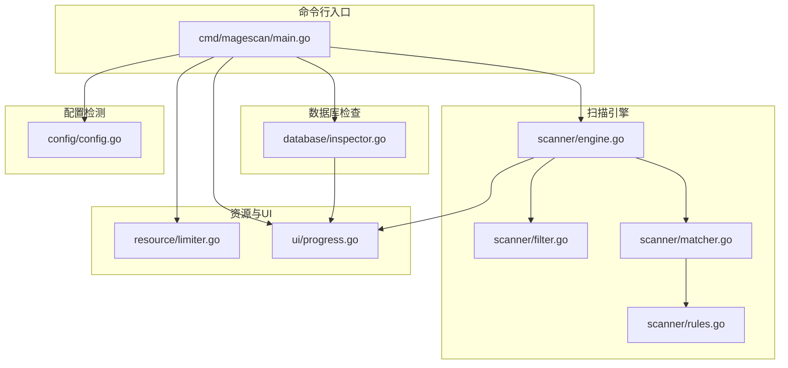
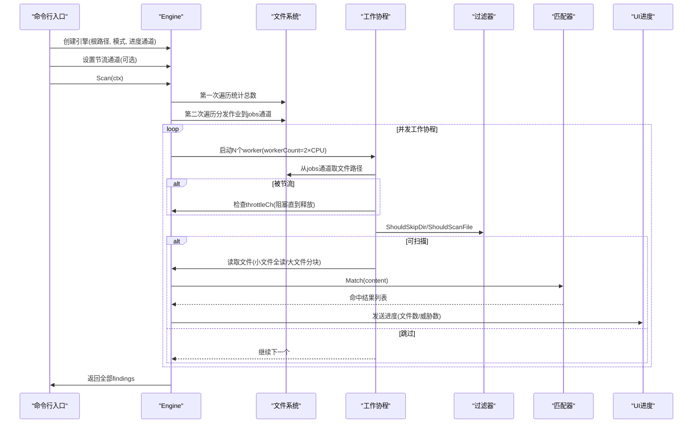
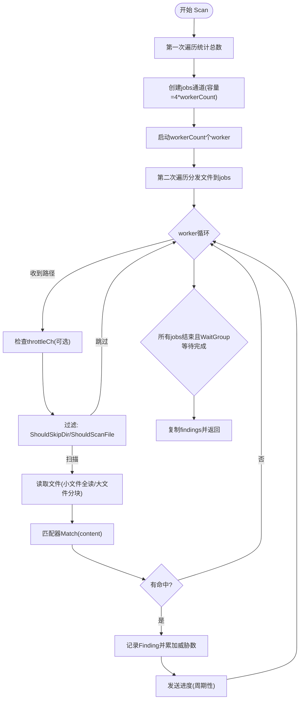
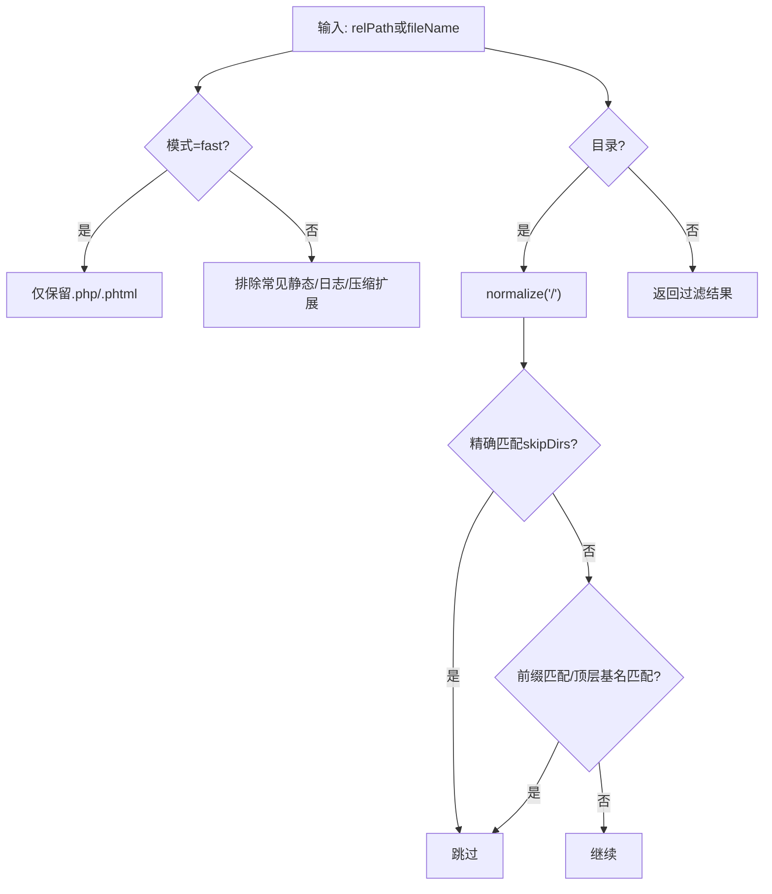
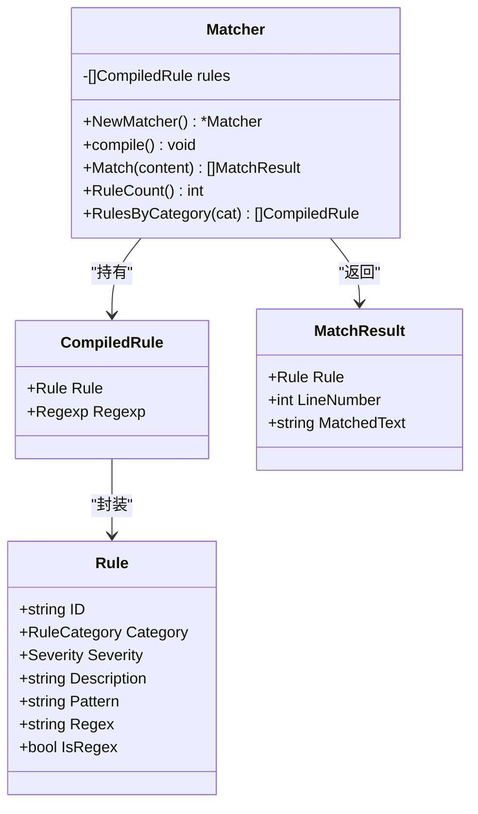
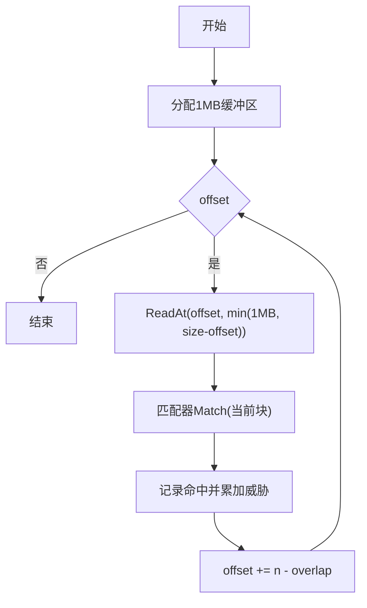
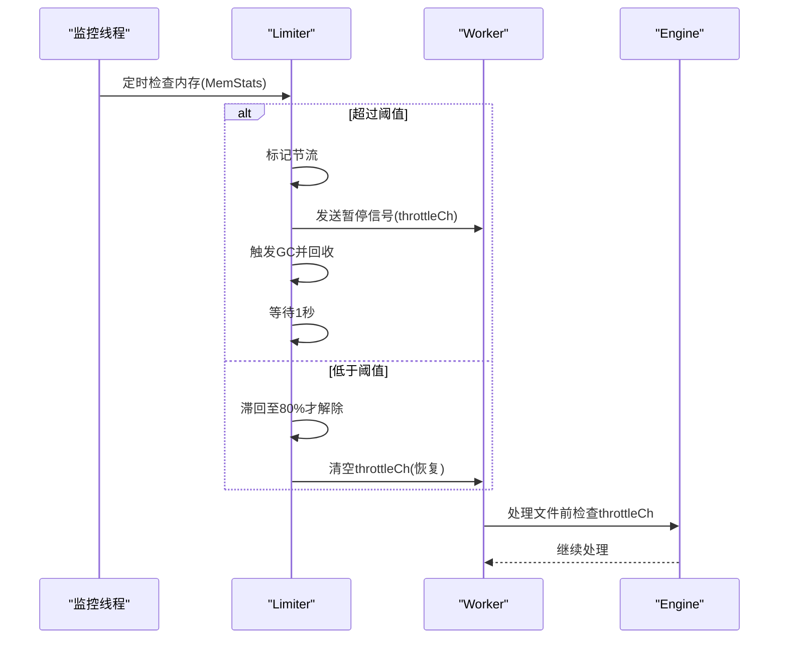
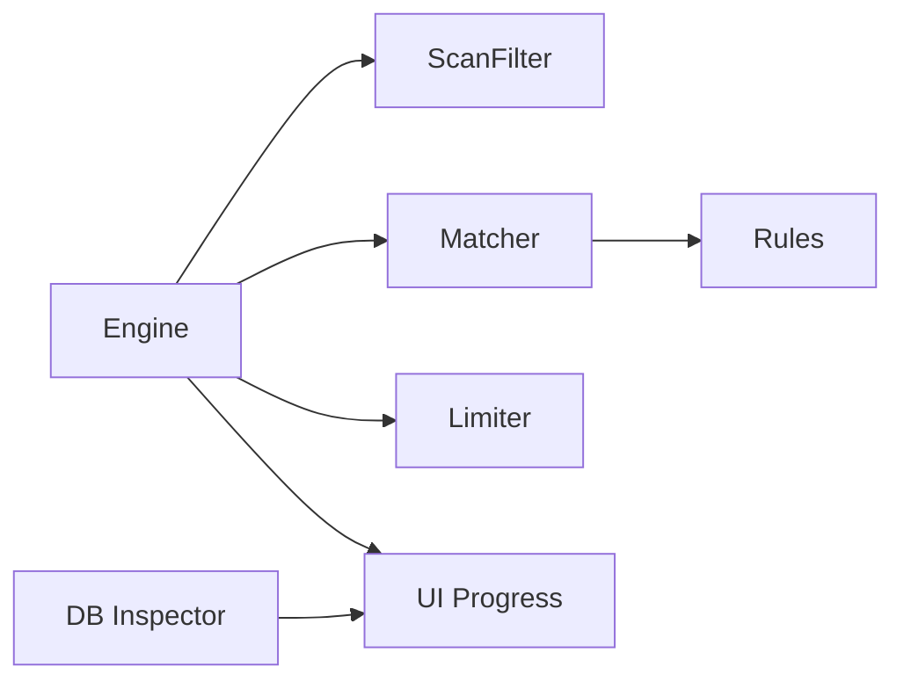

# 扫描引擎

<cite>
**本文引用的文件**
- [engine.go](file://scanner/engine.go)
- [filter.go](file://scanner/filter.go)
- [matcher.go](file://scanner/matcher.go)
- [rules.go](file://scanner/rules.go)
- [main.go](file://cmd/magescan/main.go)
- [limiter.go](file://resource/limiter.go)
- [progress.go](file://ui/progress.go)
- [inspector.go](file://database/inspector.go)
- [config.go](file://config/config.go)
- [README.md](file://README.md)
</cite>

## 目录
1. [简介](#简介)
2. [项目结构](#项目结构)
3. [核心组件](#核心组件)
4. [架构总览](#架构总览)
5. [详细组件分析](#详细组件分析)
6. [依赖分析](#依赖分析)
7. [性能考量](#性能考量)
8. [故障排查指南](#故障排查指南)
9. [结论](#结论)
10. [附录](#附录)

## 简介
本文件面向 MageScan 的扫描引擎，系统性阐述文件扫描子系统的设计与实现，包括：
- 工作池并发架构与资源节流
- 文件过滤机制（类型识别、大小限制、路径排除）
- 内容匹配算法（正则与字面量、多规则并行、性能优化）
- 大文件处理策略（分块读取与重叠窗口）
- 扫描模式选择逻辑（快速扫描 vs 完整扫描）
- 规则系统扩展与自定义规则添加
- 性能优化技巧与最佳实践
- 面向开发者的实现细节与扩展指导

## 项目结构
扫描引擎位于 scanner 包中，配合资源限制、UI 进度显示、数据库检查与配置检测共同构成完整的安全扫描流程。

图表来源
- [main.go:1-208](file://cmd/magescan/main.go#L1-L208)
- [engine.go:1-323](file://scanner/engine.go#L1-L323)
- [filter.go:1-98](file://scanner/filter.go#L1-L98)
- [matcher.go:1-168](file://scanner/matcher.go#L1-L168)
- [rules.go:1-468](file://scanner/rules.go#L1-L468)
- [limiter.go:1-118](file://resource/limiter.go#L1-L118)
- [progress.go:1-289](file://ui/progress.go#L1-L289)
- [inspector.go:1-359](file://database/inspector.go#L1-L359)
- [config.go:1-108](file://config/config.go#L1-L108)

章节来源
- [README.md:239-258](file://README.md#L239-L258)
- [main.go:1-208](file://cmd/magescan/main.go#L1-L208)

## 核心组件
- 引擎 Engine：负责目录遍历、任务分发、并发扫描、进度上报与结果聚合。
- 过滤器 ScanFilter：根据扫描模式决定是否跳过目录与文件。
- 匹配器 Matcher：预编译规则，执行字面量与正则匹配，返回命中结果。
- 规则集 Rules：集中定义威胁类别、严重级别与具体签名。
- 资源限制 Limiter：监控内存使用，动态节流以避免 OOM。
- UI 进度：通过通道驱动 TUI 实时展示扫描进度。

章节来源
- [engine.go:47-131](file://scanner/engine.go#L47-L131)
- [filter.go:8-97](file://scanner/filter.go#L8-L97)
- [matcher.go:22-82](file://scanner/matcher.go#L22-L82)
- [rules.go:3-58](file://scanner/rules.go#L3-L58)
- [limiter.go:11-62](file://resource/limiter.go#L11-L62)
- [progress.go:14-82](file://ui/progress.go#L14-L82)

## 架构总览
扫描引擎采用“工作池 + 分布式作业”的并发模型，结合资源节流与进度通道，确保在大型项目上高效、稳定地完成扫描。

图表来源
- [engine.go:76-121](file://scanner/engine.go#L76-L121)
- [engine.go:163-193](file://scanner/engine.go#L163-L193)
- [engine.go:195-227](file://scanner/engine.go#L195-L227)
- [engine.go:229-285](file://scanner/engine.go#L229-L285)
- [matcher.go:63-82](file://scanner/matcher.go#L63-L82)
- [filter.go:61-97](file://scanner/filter.go#L61-L97)
- [limiter.go:54-62](file://resource/limiter.go#L54-L62)

## 详细组件分析

### 引擎 Engine
- 并发控制
  - workerCount 默认为 2×CPU 核心数，提升吞吐。
  - 使用带缓冲的 jobs 通道，缓冲大小为 workerCount 的 4 倍，降低调度抖动。
  - 使用 WaitGroup 等待所有 worker 结束。
- 目录遍历与统计
  - 第一次遍历统计可扫描文件总数，用于进度计算。
  - 遍历时调用过滤器判断目录是否跳过，避免进入缓存、日志、静态资源等目录。
- 文件扫描策略
  - 小于等于 1MB 的文件一次性读取。
  - 大于 1MB 的文件按 1MB 分块读取，每次移动步长为 chunkOverlap（100 字节），保证跨边界匹配不遗漏。
- 进度与结果
  - 周期性发送进度（每扫描 N 个文件触发一次）。
  - 命中后原子累加威胁计数，并将结果写入共享切片，最终复制返回。

图表来源
- [engine.go:76-121](file://scanner/engine.go#L76-L121)
- [engine.go:133-161](file://scanner/engine.go#L133-L161)
- [engine.go:163-193](file://scanner/engine.go#L163-L193)
- [engine.go:195-227](file://scanner/engine.go#L195-L227)
- [engine.go:229-285](file://scanner/engine.go#L229-L285)
- [engine.go:287-322](file://scanner/engine.go#L287-L322)

章节来源
- [engine.go:13-17](file://scanner/engine.go#L13-L17)
- [engine.go:47-131](file://scanner/engine.go#L47-L131)
- [engine.go:133-161](file://scanner/engine.go#L133-L161)
- [engine.go:163-193](file://scanner/engine.go#L163-L193)
- [engine.go:195-227](file://scanner/engine.go#L195-L227)
- [engine.go:229-285](file://scanner/engine.go#L229-L285)
- [engine.go:287-322](file://scanner/engine.go#L287-L322)

### 文件过滤器 ScanFilter
- 目录跳过
  - 内置常见目录白名单（如 var/cache、pub/static、generated、.git、node_modules 等）。
  - 支持子目录前缀匹配与顶层基名匹配，避免误杀。
- 文件类型过滤
  - 快速模式仅扫描 .php 与 .phtml。
  - 完整模式排除常见静态资源与压缩包等扩展名，其余均扫描。
- 模式选择
  - 由外部传入模式字符串，引擎据此决定过滤策略。

图表来源
- [filter.go:61-97](file://scanner/filter.go#L61-L97)
- [filter.go:13-28](file://scanner/filter.go#L13-L28)

章节来源
- [filter.go:8-97](file://scanner/filter.go#L8-L97)

### 匹配器 Matcher 与规则系统
- 规则数据结构
  - Rule：包含 ID、类别、严重级别、描述、字面量模式或正则模式、是否正则标记。
  - RuleCategory：WebShell/Backdoor、Payment Skimmer、Obfuscation、Magento-Specific。
  - Severity：Critical/High/Medium/Low。
- 匹配器设计
  - 单例化：使用 sync.Once 确保规则只编译一次，避免重复开销。
  - CompiledRule：封装已编译的正则或字面量规则，提高运行时效率。
  - Match(content)：按行分割内容，分别对字面量与正则规则进行匹配，去重行号并截断匹配文本长度。
- 字面量匹配
  - 先做全内容包含检查，再逐行定位，减少不必要的正则计算。
- 正则匹配
  - 先做全内容快速匹配，再逐行查找，避免全局扫描的性能浪费。
- 规则扩展
  - 新增规则：在对应分类函数中追加 Rule；规则加载由 GetAllRules 汇总。
  - 自定义规则：可通过新增分类或修改现有分类规则，保持 IsRegex 与 Pattern 的一致性。

图表来源
- [rules.go:39-48](file://scanner/rules.go#L39-L48)
- [matcher.go:9-27](file://scanner/matcher.go#L9-L27)
- [matcher.go:22-82](file://scanner/matcher.go#L22-L82)
- [matcher.go:84-143](file://scanner/matcher.go#L84-L143)

章节来源
- [rules.go:3-58](file://scanner/rules.go#L3-L58)
- [matcher.go:22-82](file://scanner/matcher.go#L22-L82)
- [matcher.go:84-143](file://scanner/matcher.go#L84-L143)

### 大文件处理策略
- 分块读取
  - 以 1MB 为块大小，按 chunkOverlap（100 字节）重叠滑动，确保跨边界内容被覆盖。
  - 对于最后不足 1MB 的尾部，按实际长度读取。
- 逐块匹配
  - 每块交给匹配器进行规则匹配，命中即记录，不中断后续块。
- 内存友好
  - 固定大小缓冲区，避免一次性加载超大文件导致内存峰值过高。

图表来源
- [engine.go:261-285](file://scanner/engine.go#L261-L285)

章节来源
- [engine.go:13-17](file://scanner/engine.go#L13-L17)
- [engine.go:261-285](file://scanner/engine.go#L261-L285)

### 扫描模式选择逻辑
- 快速扫描（fast）
  - 仅扫描 .php 与 .phtml 文件，适合快速验证关键入口点。
- 完整扫描（full）
  - 排除常见静态/日志/压缩扩展，扫描其余可疑文件，覆盖面更广但耗时更长。
- 模式传递
  - 引擎构造时接收模式参数，过滤器据此决定 ShouldScanFile 行为。

章节来源
- [filter.go:87-97](file://scanner/filter.go#L87-L97)
- [main.go:25-31](file://cmd/magescan/main.go#L25-L31)

### 资源限制与节流
- CPU 限制
  - 启动时设置 GOMAXPROCS 到指定核数，避免过度并发。
- 内存监控
  - 后台定时器每 500ms 读取内存统计，超过阈值则：
    - 标记节流状态
    - 通过 throttleCh 发送暂停信号
    - 触发 GC 与内存回收
    - 等待一段时间恢复
  - 解除节流采用滞回策略：降至阈值的 80% 才解除。
- 工作协程协作
  - worker 在处理每个文件前检查 throttleCh，若被暂停则阻塞直至恢复。

图表来源
- [limiter.go:64-117](file://resource/limiter.go#L64-L117)
- [engine.go:195-227](file://scanner/engine.go#L195-L227)

章节来源
- [limiter.go:11-62](file://resource/limiter.go#L11-L62)
- [limiter.go:64-117](file://resource/limiter.go#L64-L117)
- [engine.go:195-227](file://scanner/engine.go#L195-L227)

### UI 进度与报告
- 进度通道
  - 文件扫描与数据库扫描分别通过独立通道推送进度消息。
  - TUI 模型接收消息后更新界面状态与进度条。
- 报告渲染
  - 主程序将 findings 转换为报告数据结构并输出人类可读的报告。
- 退出码
  - 若发现威胁，退出码为 1；否则为 0。

章节来源
- [progress.go:14-82](file://ui/progress.go#L14-L82)
- [progress.go:199-289](file://ui/progress.go#L199-L289)
- [main.go:159-207](file://cmd/magescan/main.go#L159-L207)

## 依赖分析
- 组件耦合
  - Engine 依赖 Filter 与 Matcher；Matcher 依赖 Rules。
  - 资源限制通过 throttleCh 与 Engine 协作，不影响匹配器内部逻辑。
  - UI 通过通道与引擎/数据库解耦，便于替换或扩展。
- 外部依赖
  - Go 标准库（context、fs、os、sync、regexp 等）。
  - 第三方 UI 框架 Bubble Tea（用于 TUI）。
- 循环依赖
  - 未见循环导入；模块职责清晰，接口边界明确。

图表来源
- [engine.go:47-58](file://scanner/engine.go#L47-L58)
- [matcher.go:22-42](file://scanner/matcher.go#L22-L42)
- [limiter.go:54-57](file://resource/limiter.go#L54-L57)
- [progress.go:14-31](file://ui/progress.go#L14-L31)
- [inspector.go:63-77](file://database/inspector.go#L63-L77)

章节来源
- [engine.go:47-58](file://scanner/engine.go#L47-L58)
- [matcher.go:22-42](file://scanner/matcher.go#L22-L42)
- [limiter.go:54-57](file://resource/limiter.go#L54-L57)
- [progress.go:14-31](file://ui/progress.go#L14-L31)
- [inspector.go:63-77](file://database/inspector.go#L63-L77)

## 性能考量
- 并发与调度
  - workerCount=2×CPU，充分利用 I/O 密集场景下的并发能力。
  - jobs 缓冲区降低上下文切换与调度开销。
- 匹配优化
  - 字面量先做全内容包含检查，再逐行定位，避免正则开销。
  - 正则先做全内容快速匹配，再逐行查找，减少正则引擎压力。
  - 规则预编译一次，运行时直接使用。
- I/O 与内存
  - 大文件分块读取，固定缓冲大小，避免内存峰值。
  - 重叠窗口确保跨边界不漏检。
- 资源节流
  - 内存阈值触发暂停，GC 回收，滞回策略防止频繁抖动。
- 扫描模式权衡
  - 快速模式仅扫描 PHP/PHTML，显著缩短时间。
  - 完整模式覆盖面更广，适合深度审计。

[本节为通用性能讨论，无需特定文件来源]

## 故障排查指南
- 扫描卡住或缓慢
  - 检查是否存在大量超大文件；考虑增大 -mem-limit 或使用快速模式。
  - 查看 UI 进度确认是否处于节流状态。
- 内存占用过高
  - 调整 -mem-limit；观察 Limiter 是否频繁触发节流。
- 命中结果异常
  - 检查规则是否正确编译；无效正则会被跳过，不会导致崩溃。
  - 确认过滤器是否误判了目标文件类型。
- 中断扫描
  - Ctrl+C 发送取消信号，引擎会等待当前 worker 完成当前文件处理后退出。
- 数据库扫描失败
  - 确认数据库连接信息与表前缀；某些表可能不存在，扫描器会跳过并继续。

章节来源
- [limiter.go:78-117](file://resource/limiter.go#L78-L117)
- [matcher.go:44-61](file://scanner/matcher.go#L44-L61)
- [filter.go:87-97](file://scanner/filter.go#L87-L97)
- [main.go:67-77](file://cmd/magescan/main.go#L67-L77)
- [inspector.go:98-106](file://database/inspector.go#L98-L106)

## 结论
MageScan 的扫描引擎通过“工作池 + 分布式作业 + 资源节流 + 规则预编译 + 分块读取”的组合，在保证覆盖率的同时兼顾性能与稳定性。快速扫描与完整扫描的双模式设计满足不同场景需求；规则系统的模块化与单例化匹配器为扩展提供了清晰路径。建议在生产环境中结合资源限制与扫描模式，平衡速度与深度。

[本节为总结性内容，无需特定文件来源]

## 附录

### 扩展规则系统与自定义规则
- 新增规则步骤
  - 在对应分类函数中添加新的 Rule（保持 ID 唯一、描述清晰、严重级别合理）。
  - 确保 Pattern 或 Regex 至少设置其一；若使用正则，IsRegex=true。
  - 规则由 GetAllRules 汇总，无需手动注册。
- 规则分类参考
  - WebShell/Backdoor：远程执行、上传后门、编码混淆等。
  - Payment Skimmer：数据窃取、外链注入、键盘记录等。
  - Obfuscation：编码、拼接、变量变量等隐藏手法。
  - Magento-Specific：配置篡改、路径遍历、凭证提取等。

章节来源
- [rules.go:50-58](file://scanner/rules.go#L50-L58)
- [rules.go:66-239](file://scanner/rules.go#L66-L239)
- [rules.go:247-325](file://scanner/rules.go#L247-L325)
- [rules.go:333-396](file://scanner/rules.go#L333-L396)
- [rules.go:404-467](file://scanner/rules.go#L404-L467)

### 最佳实践
- 快速扫描优先：日常巡检使用 fast 模式，发现问题后再用 full 深度扫描。
- 合理设置资源限制：根据目标服务器资源设定 -cpu-limit 与 -mem-limit。
- 监控与日志：关注 UI 进度与节流提示，必要时调整阈值。
- 规则维护：定期更新规则集，关注新威胁趋势。
- 输出与修复：结合报告中的 Remediation SQL 进行修复，数据库扫描为只读，SQL 仅为建议。

章节来源
- [README.md:26-98](file://README.md#L26-L98)
- [README.md:150-200](file://README.md#L150-L200)
- [README.md:203-235](file://README.md#L203-L235)