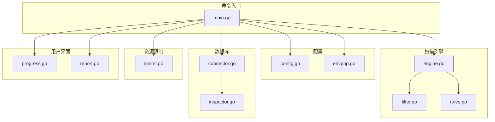
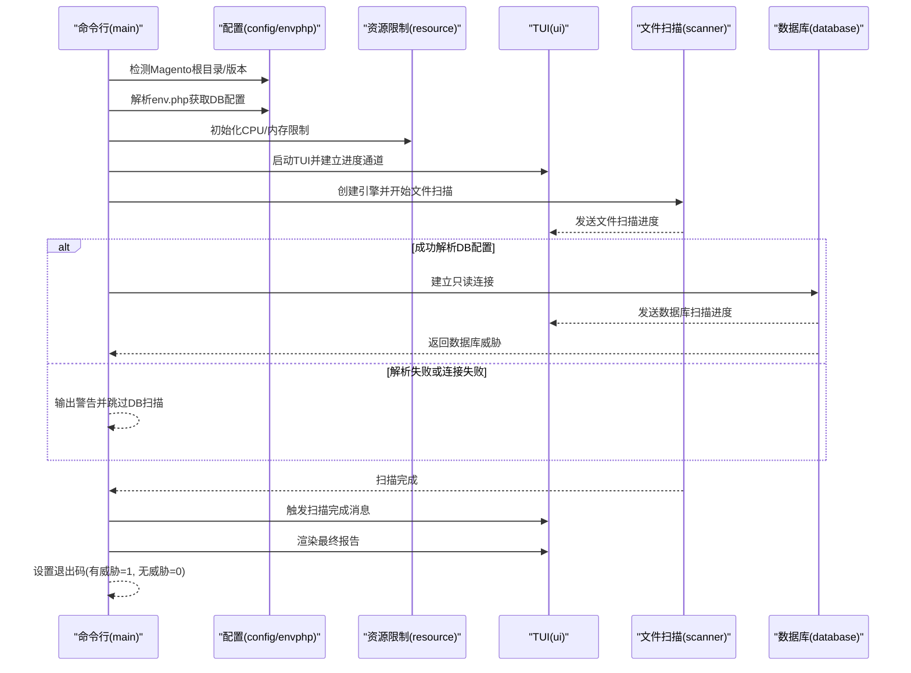
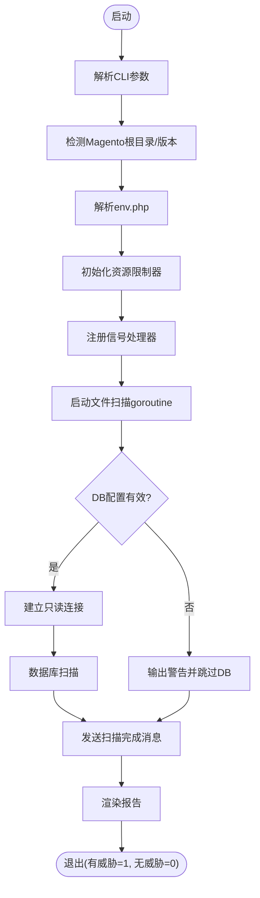
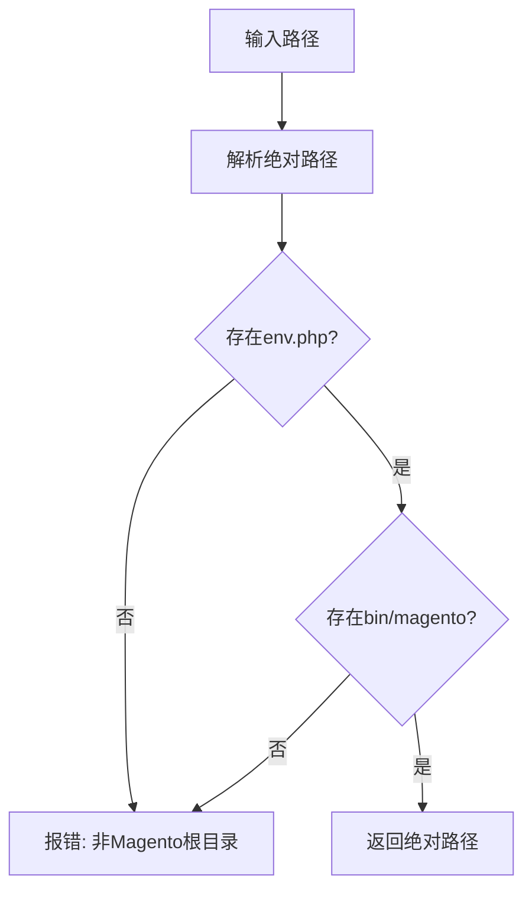
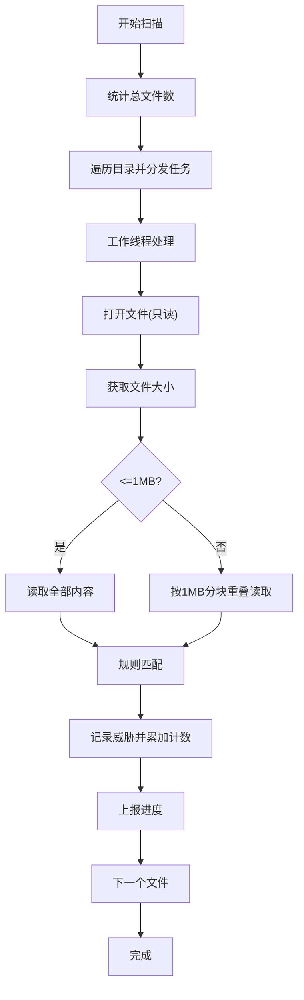
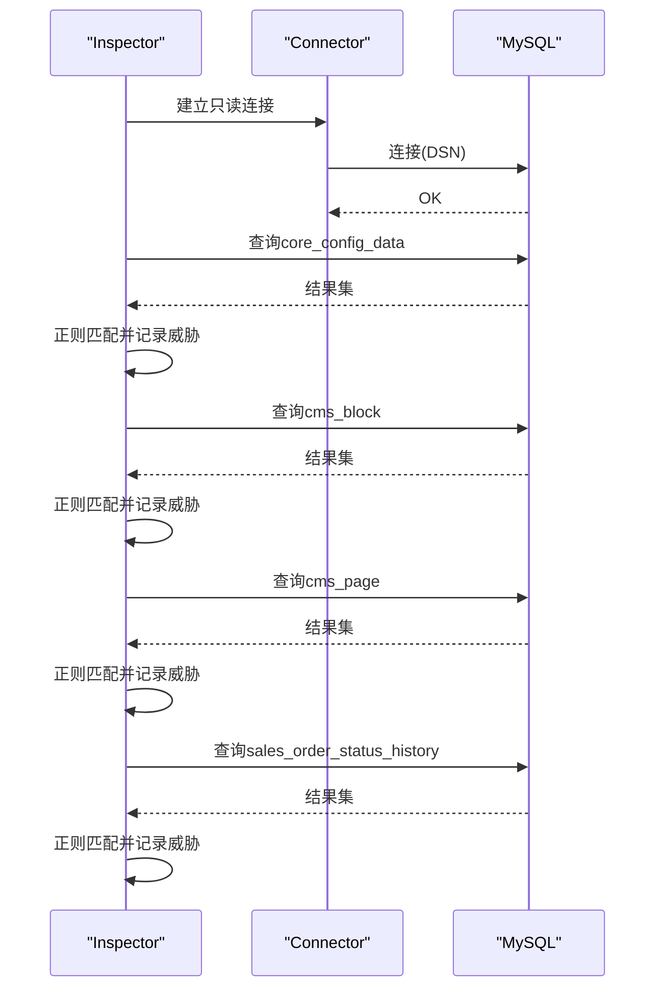
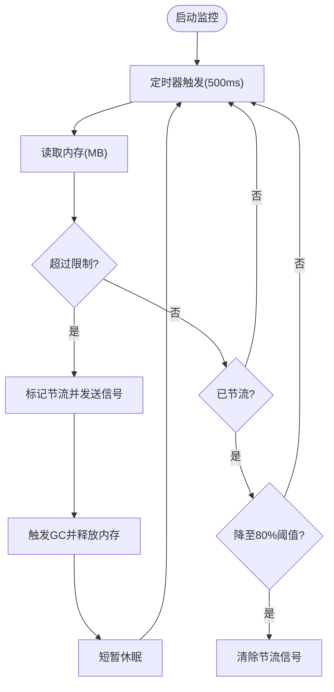
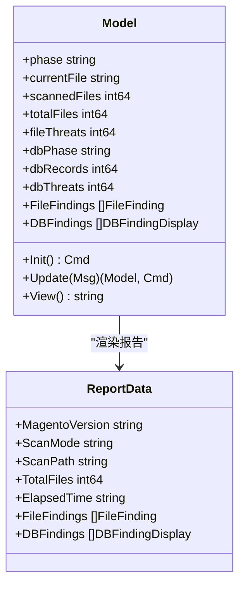
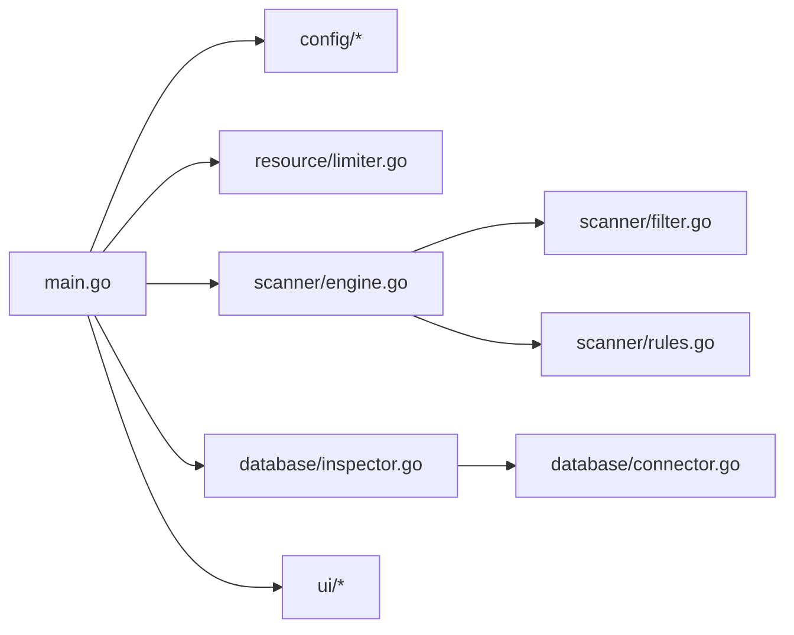

# 故障排除

<cite>
**本文引用的文件**
- [cmd/magescan/main.go](file://cmd/magescan/main.go)
- [config/config.go](file://config/config.go)
- [config/envphp.go](file://config/envphp.go)
- [scanner/engine.go](file://scanner/engine.go)
- [scanner/filter.go](file://scanner/filter.go)
- [scanner/rules.go](file://scanner/rules.go)
- [database/connector.go](file://database/connector.go)
- [database/inspector.go](file://database/inspector.go)
- [resource/limiter.go](file://resource/limiter.go)
- [ui/progress.go](file://ui/progress.go)
- [ui/report.go](file://ui/report.go)
- [README.md](file://README.md)
</cite>

## 目录
1. [简介](#简介)
2. [项目结构](#项目结构)
3. [核心组件](#核心组件)
4. [架构总览](#架构总览)
5. [详细组件分析](#详细组件分析)
6. [依赖分析](#依赖分析)
7. [性能考虑](#性能考虑)
8. [故障排除指南](#故障排除指南)
9. [结论](#结论)
10. [附录](#附录)

## 简介
本指南面向使用 MageScan 的安全工程师与运维人员，聚焦于安装、配置、运行时问题、性能瓶颈与资源限制、错误解读与排障流程。文档基于仓库源码与官方说明，提供系统化诊断方法、调试技巧、常见问题解答与性能调优建议，并给出跨平台与环境差异注意事项及获取帮助的渠道。

## 项目结构
- 命令入口：cmd/magescan/main.go 负责解析参数、检测 Magento 根目录、读取版本、解析 env.php、初始化资源限制器、启动 TUI、协调文件扫描与数据库扫描、生成最终报告。
- 配置模块：config/config.go 提供默认配置、根目录检测、版本检测；config/envphp.go 解析数据库连接与表前缀。
- 扫描引擎：scanner/engine.go 实现文件扫描的并发工作池、进度统计、大文件分块读取与匹配；scanner/filter.go 控制扫描范围（快/全模式）；scanner/rules.go 定义威胁规则集。
- 数据库模块：database/connector.go 建立只读 MySQL 连接；database/inspector.go 扫描核心配置、CMS 内容与订单状态历史，生成威胁与修复 SQL。
- 资源限制：resource/limiter.go 监控内存并自动节流，避免扫描期间内存溢出。
- 用户界面：ui/progress.go 提供 TUI 进度显示；ui/report.go 渲染最终报告与修复建议。

图表来源
- [cmd/magescan/main.go:24-207](file://cmd/magescan/main.go#L24-L207)
- [config/config.go:13-107](file://config/config.go#L13-L107)
- [config/envphp.go:14-87](file://config/envphp.go#L14-L87)
- [scanner/engine.go:47-322](file://scanner/engine.go#L47-L322)
- [scanner/filter.go:8-97](file://scanner/filter.go#L8-L97)
- [scanner/rules.go:39-58](file://scanner/rules.go#L39-L58)
- [database/connector.go:10-57](file://database/connector.go#L10-L57)
- [database/inspector.go:63-109](file://database/inspector.go#L63-L109)
- [resource/limiter.go:11-117](file://resource/limiter.go#L11-L117)
- [ui/progress.go:54-288](file://ui/progress.go#L54-L288)
- [ui/report.go:11-167](file://ui/report.go#L11-L167)

章节来源
- [cmd/magescan/main.go:24-207](file://cmd/magescan/main.go#L24-L207)
- [README.md:240-258](file://README.md#L240-L258)

## 核心组件
- 命令行入口与控制流：负责参数解析、环境检测、资源限制、信号处理、TUI 启停、扫描协调与退出码设置。
- 配置与环境：自动检测 Magento 根目录与版本，解析 env.php 获取数据库连接与表前缀。
- 文件扫描引擎：并发工作池、进度统计、大文件分块读取、规则匹配与威胁记录。
- 数据库扫描器：对核心配置、CMS 区块/页面、订单状态历史进行模式匹配，生成修复 SQL。
- 资源限制器：周期性监控内存，超过阈值时通过通道阻塞工作线程，降低内存占用。
- 用户界面：实时进度展示与最终报告渲染。

章节来源
- [cmd/magescan/main.go:24-207](file://cmd/magescan/main.go#L24-L207)
- [config/config.go:49-107](file://config/config.go#L49-L107)
- [config/envphp.go:14-87](file://config/envphp.go#L14-L87)
- [scanner/engine.go:47-322](file://scanner/engine.go#L47-L322)
- [database/inspector.go:63-109](file://database/inspector.go#L63-L109)
- [resource/limiter.go:34-117](file://resource/limiter.go#L34-L117)
- [ui/progress.go:140-197](file://ui/progress.go#L140-L197)
- [ui/report.go:57-167](file://ui/report.go#L57-L167)

## 架构总览
下图展示了从命令行到扫描与报告的端到端流程，以及各模块间的交互关系。

图表来源
- [cmd/magescan/main.go:35-126](file://cmd/magescan/main.go#L35-L126)
- [config/envphp.go:14-87](file://config/envphp.go#L14-L87)
- [database/connector.go:18-39](file://database/connector.go#L18-L39)
- [database/inspector.go:79-109](file://database/inspector.go#L79-L109)
- [ui/progress.go:161-183](file://ui/progress.go#L161-L183)
- [ui/report.go:57-167](file://ui/report.go#L57-L167)

## 详细组件分析

### 命令行入口与控制流
- 参数解析：路径、扫描模式、CPU/内存限制、输出格式。
- 环境检测：根目录校验、版本读取、env.php 解析。
- 资源限制：根据 CPU/内存限制初始化限速器并启动后台监控。
- 信号处理：捕获中断信号以优雅取消扫描。
- 并发扫描：文件扫描在 goroutine 中执行，数据库扫描在成功解析 DB 配置后执行。
- TUI 协调：通过通道将文件/数据库进度转发至 TUI，完成后渲染报告并设置退出码。

图表来源
- [cmd/magescan/main.go:24-207](file://cmd/magescan/main.go#L24-L207)

章节来源
- [cmd/magescan/main.go:24-207](file://cmd/magescan/main.go#L24-L207)

### 配置与环境检测
- 根目录检测：要求存在 app/etc/env.php 与 bin/magento。
- 版本检测：从 composer.json 读取版本号，若缺失则尝试从包名推断。
- env.php 解析：提取主机、端口、数据库名、用户名、密码与表前缀，支持 host:port 格式。

图表来源
- [config/config.go:52-71](file://config/config.go#L52-L71)

章节来源
- [config/config.go:49-107](file://config/config.go#L49-L107)
- [config/envphp.go:14-87](file://config/envphp.go#L14-L87)

### 文件扫描引擎
- 工作池：工作线程数为 CPU 数的两倍。
- 计数与遍历：先统计总文件数，再遍历分发任务。
- 大文件处理：1MB 分块重叠读取，避免内存峰值。
- 匹配与记录：命中规则即记录威胁，原子计数与通道上报进度。
- 进度上报：批量上报扫描进度与威胁数量。

图表来源
- [scanner/engine.go:77-322](file://scanner/engine.go#L77-L322)

章节来源
- [scanner/engine.go:47-322](file://scanner/engine.go#L47-L322)
- [scanner/filter.go:8-97](file://scanner/filter.go#L8-L97)
- [scanner/rules.go:39-58](file://scanner/rules.go#L39-L58)

### 数据库扫描器
- 连接：使用只读 DSN，最大连接数与空闲连接数限制，Ping 校验。
- 扫描阶段：依次扫描 core_config_data、cms_block、cms_page、sales_order_status_history。
- 模式匹配：对敏感路径与可疑内容进行正则匹配，记录威胁并生成修复 SQL。
- 容错：表不存在时记录进度并继续下一阶段。

图表来源
- [database/connector.go:18-39](file://database/connector.go#L18-L39)
- [database/inspector.go:79-330](file://database/inspector.go#L79-L330)

章节来源
- [database/connector.go:10-57](file://database/connector.go#L10-L57)
- [database/inspector.go:63-359](file://database/inspector.go#L63-L359)

### 资源限制器
- CPU 限制：通过 GOMAXPROCS 限制并发数。
- 内存监控：每 500ms 读取内存，超过阈值触发节流通道，强制 GC 并短暂休眠；降至阈值 80% 时解除节流。
- 停止恢复：停止时恢复原始并发数。

图表来源
- [resource/limiter.go:64-117](file://resource/limiter.go#L64-L117)

章节来源
- [resource/limiter.go:11-117](file://resource/limiter.go#L11-L117)

### 用户界面与报告
- TUI：显示文件扫描进度、当前文件、威胁计数、数据库扫描阶段与威胁计数。
- 报告：汇总威胁数量与严重级别，按严重程度排序，输出修复 SQL。

图表来源
- [ui/progress.go:54-288](file://ui/progress.go#L54-L288)
- [ui/report.go:11-167](file://ui/report.go#L11-L167)

章节来源
- [ui/progress.go:140-197](file://ui/progress.go#L140-L197)
- [ui/report.go:57-167](file://ui/report.go#L57-L167)

## 依赖分析
- 组件耦合：
  - main.go 依赖 config、resource、scanner、database、ui 模块。
  - scanner/engine.go 依赖 scanner/filter.go 与 scanner/rules.go。
  - database/inspector.go 依赖 database/connector.go。
  - resource/limiter.go 与 scanner/engine.go 通过通道耦合。
  - ui/progress.go 与 ui/report.go 通过数据结构解耦。
- 外部依赖：
  - MySQL 驱动用于数据库连接。
  - Bubble Tea 用于 TUI。
  - Lipgloss 用于样式渲染。

图表来源
- [cmd/magescan/main.go:15-20](file://cmd/magescan/main.go#L15-L20)
- [scanner/engine.go:1-11](file://scanner/engine.go#L1-L11)
- [database/inspector.go:1-9](file://database/inspector.go#L1-L9)
- [resource/limiter.go:1-9](file://resource/limiter.go#L1-L9)
- [ui/progress.go:1-12](file://ui/progress.go#L1-L12)
- [ui/report.go:1-9](file://ui/report.go#L1-L9)

章节来源
- [cmd/magescan/main.go:15-20](file://cmd/magescan/main.go#L15-L20)
- [scanner/engine.go:1-11](file://scanner/engine.go#L1-L11)
- [database/inspector.go:1-9](file://database/inspector.go#L1-L9)
- [resource/limiter.go:1-9](file://resource/limiter.go#L1-L9)
- [ui/progress.go:1-12](file://ui/progress.go#L1-L12)
- [ui/report.go:1-9](file://ui/report.go#L1-L9)

## 性能考虑
- 并发策略：文件扫描使用 2×CPU 的工作线程，适合多核环境提升吞吐。
- 大文件处理：1MB 分块重叠读取，平衡内存占用与匹配完整性。
- 资源节流：内存超限时自动暂停工作线程，触发 GC 并短暂休眠，待内存回落至 80% 阈值后恢复。
- 数据库连接：最大连接数与空闲连接数限制，避免过度占用数据库资源。
- 模式匹配：正则表达式在数据库扫描中使用，注意复杂正则可能影响性能。

章节来源
- [scanner/engine.go:61-69](file://scanner/engine.go#L61-L69)
- [scanner/engine.go:262-284](file://scanner/engine.go#L262-L284)
- [resource/limiter.go:64-117](file://resource/limiter.go#L64-L117)
- [database/connector.go:27-28](file://database/connector.go#L27-L28)
- [database/inspector.go:38-50](file://database/inspector.go#L38-L50)

## 故障排除指南

### 一、安装与环境问题
- 症状：无法找到可执行文件或构建失败
  - 排查要点：
    - 确认 Go 版本满足要求（1.21+）。
    - 使用 go build 从 cmd/magescan 构建二进制。
  - 参考来源
    - [README.md:40-58](file://README.md#L40-L58)

- 症状：提示不是 Magento 根目录
  - 排查要点：
    - 确认目标路径包含 app/etc/env.php 与 bin/magento。
    - 使用绝对路径或确保当前目录正确。
  - 参考来源
    - [config/config.go:52-71](file://config/config.go#L52-L71)

- 症状：版本检测失败
  - 排查要点：
    - 检查 composer.json 是否存在且可读。
    - 若版本字段缺失，尝试从包名推断。
  - 参考来源
    - [config/config.go:82-107](file://config/config.go#L82-L107)

- 症状：数据库扫描被跳过
  - 排查要点：
    - 检查 app/etc/env.php 是否可读。
    - 确认主机、端口、数据库名、用户名、密码是否正确。
    - 确认数据库可达且具备只读权限。
  - 参考来源
    - [config/envphp.go:14-87](file://config/envphp.go#L14-L87)
    - [database/connector.go:18-39](file://database/connector.go#L18-L39)

### 二、配置错误
- 症状：扫描模式无效或参数未生效
  - 排查要点：
    - -mode 仅支持 fast/full。
    - -cpu-limit 与 -mem-limit 为 0 表示不限制。
  - 参考来源
    - [cmd/magescan/main.go:26-31](file://cmd/magescan/main.go#L26-L31)
    - [README.md:74-83](file://README.md#L74-L83)

- 症状：扫描范围不符合预期
  - 排查要点：
    - 快模式仅扫描 .php/.phtml；全模式排除静态资源与日志等扩展名。
    - 生成目录与缓存目录默认跳过。
  - 参考来源
    - [scanner/filter.go:13-28](file://scanner/filter.go#L13-L28)
    - [scanner/filter.go:87-97](file://scanner/filter.go#L87-L97)

### 三、扫描失败与异常
- 症状：文件扫描卡住或长时间无响应
  - 排查要点：
    - 检查磁盘访问权限与文件系统状态。
    - 尝试增加 -cpu-limit 或 -mem-limit 以缓解资源压力。
  - 参考来源
    - [resource/limiter.go:64-117](file://resource/limiter.go#L64-L117)

- 症状：数据库扫描报错
  - 排查要点：
    - 表不存在属于预期容错，会记录进度并继续。
    - 其他错误需检查 DSN、网络连通性与只读权限。
  - 参考来源
    - [database/inspector.go:98-106](file://database/inspector.go#L98-L106)
    - [database/inspector.go:351-359](file://database/inspector.go#L351-L359)

- 症状：TUI 显示异常或崩溃
  - 排查要点：
    - 确保终端支持颜色与非滚动模式。
    - 按 q 退出，查看 stderr 错误信息。
  - 参考来源
    - [ui/progress.go:140-197](file://ui/progress.go#L140-L197)
    - [cmd/magescan/main.go:154-157](file://cmd/magescan/main.go#L154-L157)

### 四、性能问题与资源限制
- 症状：内存占用过高导致扫描缓慢或失败
  - 排查要点：
    - 设置合理的 -mem-limit（单位 MB），观察资源限制器节流行为。
    - 在高内存环境下可适当提高 -mem-limit。
  - 参考来源
    - [resource/limiter.go:78-117](file://resource/limiter.go#L78-L117)

- 症状：CPU 使用率过高影响系统稳定性
  - 排查要点：
    - 设置 -cpu-limit 限制并发工作线程数。
    - 在服务器上建议保守设置，避免抢占业务进程。
  - 参考来源
    - [resource/limiter.go:36-42](file://resource/limiter.go#L36-L42)

- 症状：大文件扫描耗时长
  - 排查要点：
    - 大文件采用分块读取，时间与文件大小成正比。
    - 可考虑在快模式下减少扫描范围。
  - 参考来源
    - [scanner/engine.go:262-284](file://scanner/engine.go#L262-L284)

### 五、错误解读与退出码
- 退出码 1：发现威胁（文件或数据库）
  - 处理建议：参考报告中的修复 SQL，逐项清理并验证。
  - 参考来源
    - [cmd/magescan/main.go:203-207](file://cmd/magescan/main.go#L203-L207)
    - [ui/report.go:163-167](file://ui/report.go#L163-L167)

- 退出码 0：未发现威胁
  - 处理建议：保持现状，定期重复扫描。
  - 参考来源
    - [cmd/magescan/main.go:203-207](file://cmd/magescan/main.go#L203-L207)

- 数据库扫描警告：无法连接或解析 env.php
  - 处理建议：检查数据库凭据与网络连通性；确认 env.php 权限与格式。
  - 参考来源
    - [cmd/magescan/main.go:117-122](file://cmd/magescan/main.go#L117-L122)
    - [config/envphp.go:14-87](file://config/envphp.go#L14-L87)

### 六、跨平台与环境注意事项
- Linux/macOS/Windows：均支持，但需确保：
  - 目标系统为 Magento 2 安装（含 app/etc/env.php 与 bin/magento）。
  - 数据库访问（如启用数据库扫描）需要 MySQL 可用。
- Docker 环境：建议将二进制复制到容器内执行，避免依赖缺失。
- 云环境：注意 CPU/内存配额限制，合理设置 -cpu-limit 与 -mem-limit。

章节来源
- [README.md:40-47](file://README.md#L40-L47)
- [README.md:240-258](file://README.md#L240-L258)

### 七、获取详细调试信息与报告问题
- 日志与输出：
  - TUI 展示实时进度与威胁计数；stderr 输出 TUI 错误与数据库警告。
  - 最终报告包含威胁统计、严重级别分布与修复 SQL。
- 退出码：
  - 1：存在威胁；0：无威胁。
- 报告问题：
  - 收集以下信息以便复现与定位：
    - 命令行参数与版本信息（通过 banner 输出）。
    - 磁盘空间与内存使用情况。
    - 数据库连接信息（DSN、表前缀）。
    - 目标 Magento 版本与安装路径。
  - 参考来源
    - [cmd/magescan/main.go:48-56](file://cmd/magescan/main.go#L48-L56)
    - [ui/report.go:57-167](file://ui/report.go#L57-L167)

### 八、自助排查清单
- 环境与安装
  - Go 版本满足要求；二进制可执行；目标为 Magento 根目录。
- 配置与参数
  - -mode、-cpu-limit、-mem-limit 设置合理；env.php 可读。
- 扫描过程
  - TUI 正常显示；文件/数据库阶段均有进度；无异常退出。
- 结果与修复
  - 退出码符合预期；按报告修复 SQL 清理威胁。

章节来源
- [README.md:74-98](file://README.md#L74-L98)
- [cmd/magescan/main.go:24-207](file://cmd/magescan/main.go#L24-L207)

## 结论
MageScan 通过清晰的模块划分与稳健的资源控制，提供了高性能、可诊断的安全扫描能力。遵循本指南的排障步骤与性能调优建议，可在不同环境中稳定运行并快速定位问题。遇到复杂问题时，请结合 TUI 输出、报告与退出码进行综合判断，并按需调整资源限制与扫描范围。

## 附录
- 社区支持与帮助
  - 本项目为独立工具，未内置社区支持渠道。请在使用过程中遵循授权条款并在授权范围内进行安全审计。
  - 参考来源
    - [README.md:261-272](file://README.md#L261-L272)