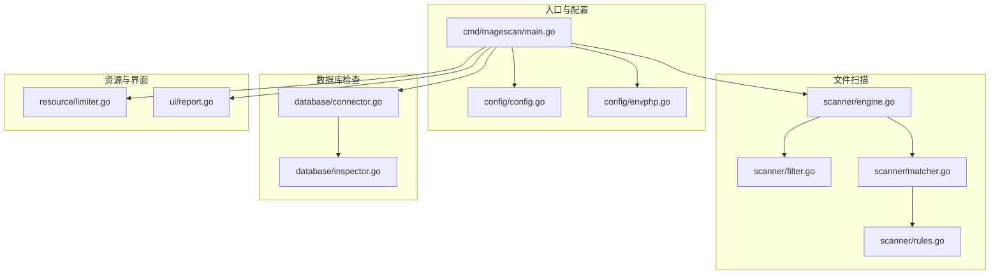
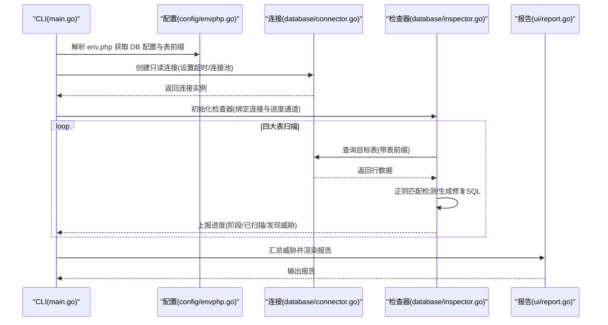
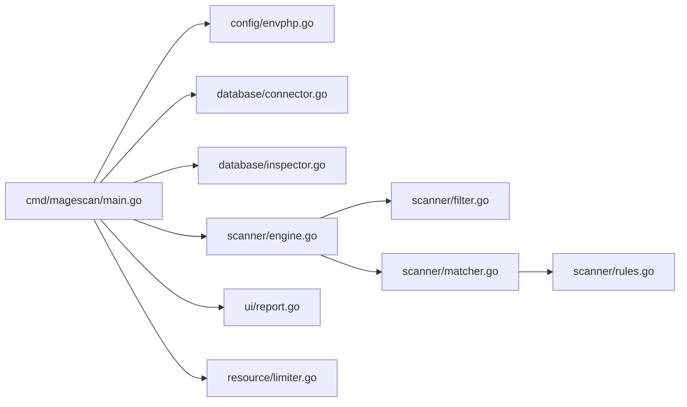

# 数据库检查

<cite>
**本文引用的文件列表**
- [cmd/magescan/main.go](file://cmd/magescan/main.go)
- [config/config.go](file://config/config.go)
- [config/envphp.go](file://config/envphp.go)
- [database/connector.go](file://database/connector.go)
- [database/inspector.go](file://database/inspector.go)
- [scanner/engine.go](file://scanner/engine.go)
- [scanner/filter.go](file://scanner/filter.go)
- [scanner/matcher.go](file://scanner/matcher.go)
- [scanner/rules.go](file://scanner/rules.go)
- [resource/limiter.go](file://resource/limiter.go)
- [ui/report.go](file://ui/report.go)
- [go.mod](file://go.mod)
- [README.md](file://README.md)
</cite>

## 目录
1. [简介](#简介)
2. [项目结构](#项目结构)
3. [核心组件](#核心组件)
4. [架构总览](#架构总览)
5. [详细组件分析](#详细组件分析)
6. [依赖关系分析](#依赖关系分析)
7. [性能与资源控制](#性能与资源控制)
8. [安全与合规](#安全与合规)
9. [故障排除指南](#故障排除指南)
10. [结论](#结论)
11. [附录](#附录)

## 简介
本文件聚焦于 MageScan 的数据库检查功能，系统化阐述数据库连接管理（连接池、超时、错误恢复）、四大检查表（core_config_data、cms_block、cms_page、sales_order_status_history）的扫描逻辑与威胁检测算法、数据库威胁检测模式（脚本注入、iframe 注入、eval 执行、可疑外链等）、自动修复 SQL 生成机制与安全考量、Magento 表前缀处理与兼容性支持、性能优化建议与安全最佳实践，并提供故障排除指南与常见问题解决方案，帮助数据库管理员与安全工程师高效落地使用。

## 项目结构
项目采用分层模块化组织：
- cmd/magescan：CLI 入口，负责参数解析、环境探测、并发扫描编排、进度与报告输出
- config：Magento 根目录检测、版本识别、env.php 解析（含数据库配置与表前缀）
- scanner：文件扫描引擎（工作池、过滤器、匹配器、规则集）
- database：数据库连接器与安全检查器（四大表扫描、威胁检测、进度上报、修复 SQL）
- resource：CPU/内存限制与自动节流
- ui：终端 UI 进度与最终报告渲染

图表来源
- [cmd/magescan/main.go:1-208](file://cmd/magescan/main.go#L1-L208)
- [config/config.go:1-108](file://config/config.go#L1-L108)
- [config/envphp.go:1-88](file://config/envphp.go#L1-L88)
- [scanner/engine.go:1-323](file://scanner/engine.go#L1-L323)
- [scanner/filter.go:1-98](file://scanner/filter.go#L1-L98)
- [scanner/matcher.go:1-168](file://scanner/matcher.go#L1-L168)
- [scanner/rules.go:1-468](file://scanner/rules.go#L1-L468)
- [database/connector.go:1-58](file://database/connector.go#L1-L58)
- [database/inspector.go:1-359](file://database/inspector.go#L1-L359)
- [resource/limiter.go:1-118](file://resource/limiter.go#L1-L118)
- [ui/report.go:1-230](file://ui/report.go#L1-L230)

章节来源
- [cmd/magescan/main.go:24-126](file://cmd/magescan/main.go#L24-L126)
- [config/envphp.go:14-71](file://config/envphp.go#L14-L71)
- [database/connector.go:16-39](file://database/connector.go#L16-L39)
- [database/inspector.go:79-109](file://database/inspector.go#L79-L109)

## 核心组件
- 数据库连接器（Connector）：封装只读 MySQL 连接，设置连接池大小、读取超时、Ping 校验；提供表名前缀拼接能力
- 数据库检查器（Inspector）：按顺序扫描四大表，执行正则匹配检测，记录威胁并生成修复 SQL
- 规则与匹配器：定义威胁规则集合，预编译正则，线程安全地在文件内容中匹配
- 资源限制器：监控内存使用，动态节流文件扫描工作池，避免 OOM
- 报告与 UI：汇总文件与数据库威胁，渲染可读报告，展示修复 SQL

章节来源
- [database/connector.go:10-58](file://database/connector.go#L10-L58)
- [database/inspector.go:63-114](file://database/inspector.go#L63-L114)
- [scanner/matcher.go:22-82](file://scanner/matcher.go#L22-L82)
- [resource/limiter.go:11-118](file://resource/limiter.go#L11-L118)
- [ui/report.go:57-168](file://ui/report.go#L57-L168)

## 架构总览
数据库检查流程从 CLI 入口开始，解析 env.php 获取数据库配置与表前缀，创建只读连接，初始化检查器，依次扫描四大表，将结果通过通道上报到 UI，最终生成报告。

图表来源
- [cmd/magescan/main.go:105-126](file://cmd/magescan/main.go#L105-L126)
- [config/envphp.go:14-71](file://config/envphp.go#L14-L71)
- [database/connector.go:16-39](file://database/connector.go#L16-L39)
- [database/inspector.go:79-109](file://database/inspector.go#L79-L109)
- [ui/report.go:57-168](file://ui/report.go#L57-L168)

## 详细组件分析

### 数据库连接管理机制
- 连接参数与只读策略
  - DSN 使用用户:密码@tcp(主机:端口)/数据库?timeout=10s&readTimeout=30s，明确连接建立与读取超时
  - 使用只读连接，避免任何写操作
- 连接池配置
  - 最大打开连接数：3
  - 最大空闲连接数：1
  - 启动后立即 Ping 校验连通性
- 错误恢复与健壮性
  - Ping 失败直接关闭连接并返回错误
  - 表不存在时捕获特定错误码/文本，跳过该表继续扫描
- 表前缀处理
  - Connector 提供 TableName 方法，统一拼接表前缀，兼容不同安装场景

章节来源
- [database/connector.go:16-39](file://database/connector.go#L16-L39)
- [database/connector.go:49-57](file://database/connector.go#L49-L57)
- [database/inspector.go:351-359](file://database/inspector.go#L351-L359)

### 四大检查表扫描逻辑与威胁检测

#### core_config_data
- 扫描范围
  - 精选敏感路径集合（如 head/includes、footer/absolute_footer、scripts 等）
  - 包含“script”或“html”的任意路径
- 检测算法
  - 对每个记录的 value 字段进行正则匹配，命中即记录威胁
  - 生成修复 SQL：清空对应 config_id 的 value
- 性能与健壮性
  - 使用占位符构建 IN 子句，避免拼接注入
  - 行遍历中跳过空值，减少无效匹配

章节来源
- [database/inspector.go:116-177](file://database/inspector.go#L116-L177)
- [database/inspector.go:52-61](file://database/inspector.go#L52-L61)

#### cms_block
- 扫描范围
  - 全量扫描所有块（block_id、identifier、content）
- 检测算法
  - 对 content 字段进行正则匹配，命中即记录威胁
  - 生成修复 SQL：清空对应 block_id 的 content，并附带注释提示人工审查
- 性能与健壮性
  - 逐行扫描，跳过空值
  - 仅当匹配到首个威胁时记录一次，避免重复

章节来源
- [database/inspector.go:179-229](file://database/inspector.go#L179-L229)

#### cms_page
- 扫描范围
  - 全量扫描所有页面（page_id、identifier、content）
- 检测算法
  - 对 content 字段进行正则匹配，命中即记录威胁
  - 生成修复 SQL：清空对应 page_id 的 content，并附带注释提示人工审查
- 性能与健壮性
  - 逐行扫描，跳过空值
  - 仅当匹配到首个威胁时记录一次

章节来源
- [database/inspector.go:231-281](file://database/inspector.go#L231-L281)

#### sales_order_status_history
- 扫描范围
  - 仅扫描最近 1000 条记录（按 entity_id 倒序），平衡性能与覆盖面
- 检测算法
  - 对 comment 字段进行正则匹配，命中即记录威胁
  - 生成修复 SQL：清空对应 entity_id 的 comment
- 性能与健壮性
  - 限定数量，避免全表扫描
  - 逐行扫描，跳过空值

章节来源
- [database/inspector.go:283-330](file://database/inspector.go#L283-L330)

### 数据库威胁检测模式与规则
威胁规则由正则表达式构成，覆盖以下类别：
- 外部脚本注入：检测以 http/https 加载的外部脚本
- eval 执行：检测 CMS 内容中的 eval 调用
- iframe 注入：检测潜在重定向/钓鱼的 iframe
- javascript: 协议：检测危险协议注入
- document.write 注入：检测动态写入
- base64_decode：检测 CMS 内容中的解码调用
- 可疑内联脚本：检测包含 atob/btoa/fetch/XMLHttpRequest 的内联脚本
- 事件处理器注入：onload/onerror 等
- 外部资源与可疑 TLD：检测来自非主流 CDN 的链接及可疑域名后缀
- 其他：包含“script”“html”等关键词的路径

章节来源
- [database/inspector.go:38-50](file://database/inspector.go#L38-L50)

### 自动修复 SQL 生成机制与安全考虑
- 生成策略
  - 针对每条威胁记录生成一条 UPDATE 语句，将字段置空
  - cms_block/cms_page 在 SQL 中附带注释，提示管理员审查标识符与内容
- 安全与合规
  - 生成的 SQL 仅为建议，不自动执行，避免误伤生产数据
  - CLI 明确标注“纯只读扫描”，修复 SQL 由管理员审阅后手动执行
- 可追溯性
  - 记录表名、记录 ID、字段、匹配文本截断、严重级别、修复 SQL

章节来源
- [database/inspector.go:156-167](file://database/inspector.go#L156-L167)
- [database/inspector.go:214-217](file://database/inspector.go#L214-L217)
- [database/inspector.go:266-269](file://database/inspector.go#L266-L269)
- [database/inspector.go:317](file://database/inspector.go#L317)
- [README.md:226-236](file://README.md#L226-L236)

### Magento 表前缀处理与兼容性支持
- 表前缀提取
  - 从 env.php 中提取 table_prefix 并保存
- 查询拼接
  - Connector 将表前缀与表名拼接，确保在不同前缀环境下正确查询
- 兼容性
  - 支持标准与自定义前缀的 Magento 安装
  - 对缺失表进行容错处理，继续后续表扫描

章节来源
- [config/envphp.go:62-64](file://config/envphp.go#L62-L64)
- [database/connector.go:49-52](file://database/connector.go#L49-L52)
- [database/inspector.go:117](file://database/inspector.go#L117)
- [database/inspector.go:180](file://database/inspector.go#L180)
- [database/inspector.go:232](file://database/inspector.go#L232)
- [database/inspector.go:284](file://database/inspector.go#L284)

## 依赖关系分析

图表来源
- [cmd/magescan/main.go:15-20](file://cmd/magescan/main.go#L15-L20)
- [config/envphp.go:14-71](file://config/envphp.go#L14-L71)
- [database/connector.go:16-39](file://database/connector.go#L16-L39)
- [database/inspector.go:70-77](file://database/inspector.go#L70-L77)
- [scanner/engine.go:61-69](file://scanner/engine.go#L61-L69)
- [scanner/filter.go:56-59](file://scanner/filter.go#L56-L59)
- [scanner/matcher.go:34-42](file://scanner/matcher.go#L34-L42)
- [scanner/rules.go:50-58](file://scanner/rules.go#L50-L58)
- [ui/report.go:57-168](file://ui/report.go#L57-L168)
- [resource/limiter.go:22-32](file://resource/limiter.go#L22-L32)

章节来源
- [go.mod:5-10](file://go.mod#L5-L10)

## 性能与资源控制
- 文件扫描
  - 工作池大小：CPU 数 × 2
  - 大文件分块读取（1MB，带重叠），避免内存峰值
  - 进度上报频率可控，降低 UI 压力
- 资源限制
  - CPU：GOMAXPROCS 限制最大并发
  - 内存：后台定时器每 500ms 检查 Alloc，超过阈值触发节流，降至 80% 恢复
  - 节流通道：工作池阻塞等待，释放后恢复
- 数据库扫描
  - 连接池小而稳（3/1），避免并发过高导致锁争用
  - sales_order_status_history 限制扫描数量，兼顾性能与覆盖面

章节来源
- [scanner/engine.go:61-69](file://scanner/engine.go#L61-L69)
- [scanner/engine.go:261-285](file://scanner/engine.go#L261-L285)
- [resource/limiter.go:34-57](file://resource/limiter.go#L34-L57)
- [resource/limiter.go:64-117](file://resource/limiter.go#L64-L117)
- [database/connector.go:27-28](file://database/connector.go#L27-L28)
- [database/inspector.go:285](file://database/inspector.go#L285)

## 安全与合规
- 只读原则
  - 数据库连接为只读，扫描阶段不写入任何数据
  - 修复 SQL 仅作为建议，需人工审阅后执行
- 环境验证
  - 自动检测 Magento 根目录与版本，避免误扫
- 透明度
  - 报告清晰列出威胁类型、位置、匹配片段与修复 SQL
- 合规提醒
  - CLI 与 README 明确仅用于授权审计

章节来源
- [database/connector.go:17-18](file://database/connector.go#L17-L18)
- [database/inspector.go:156-167](file://database/inspector.go#L156-L167)
- [cmd/magescan/main.go:35-46](file://cmd/magescan/main.go#L35-L46)
- [README.md:261-266](file://README.md#L261-L266)

## 故障排除指南
- 无法连接数据库
  - 检查 env.php 是否存在且可读
  - 确认 host/port/dbname/username/password 是否正确
  - 若 Ping 失败，确认网络可达与权限
  - 参考：[database/connector.go:30-33](file://database/connector.go#L30-L33)
- 表不存在
  - 某些表可能未启用或被删除，扫描器会跳过并继续
  - 参考：[database/inspector.go:98-106](file://database/inspector.go#L98-L106)
- 超时或连接过多
  - 减少并发（-cpu-limit）或提高内存上限（-mem-limit）
  - 调整连接池（当前固定为 3/1）
  - 参考：[database/connector.go:27-28](file://database/connector.go#L27-L28)
- 扫描速度慢
  - 切换到 fast 模式，仅扫描 .php/.phtml
  - 适当降低内存上限以启用节流，避免频繁 GC
  - 参考：[scanner/filter.go:87-97](file://scanner/filter.go#L87-L97)，[resource/limiter.go:78-117](file://resource/limiter.go#L78-L117)
- 修复 SQL 不生效
  - 确认表前缀是否正确，检查生成的 SQL 中的表名
  - 参考：[database/connector.go:49-52](file://database/connector.go#L49-L52)

章节来源
- [config/envphp.go:14-71](file://config/envphp.go#L14-L71)
- [database/inspector.go:98-106](file://database/inspector.go#L98-L106)
- [database/connector.go:27-28](file://database/connector.go#L27-L28)
- [scanner/filter.go:87-97](file://scanner/filter.go#L87-L97)
- [resource/limiter.go:78-117](file://resource/limiter.go#L78-L117)
- [database/connector.go:49-52](file://database/connector.go#L49-L52)

## 结论
MageScan 的数据库检查功能以只读方式对核心业务表进行威胁检测，结合严格的连接池与超时配置、表前缀适配、规则化的修复 SQL 生成，为 Magento/Adobe Commerce 环境提供了高可靠、可追溯的安全审计能力。配合文件扫描与资源限制，可在生产环境中安全稳定地运行，帮助管理员快速定位风险并制定修复计划。

## 附录
- 常用命令示例
  - 快速扫描：./magescan -path /var/www/magento -mode fast
  - 全量扫描：./magescan -path /var/www/magento -mode full
  - 限制资源：./magescan -path /var/www/magento -cpu-limit 1 -mem-limit 128
- 关键实现参考
  - 连接与表前缀：[database/connector.go:16-52](file://database/connector.go#L16-L52)
  - 四大表扫描与规则：[database/inspector.go:79-330](file://database/inspector.go#L79-L330)
  - 规则集与匹配器：[scanner/rules.go:50-468](file://scanner/rules.go#L50-L468)，[scanner/matcher.go:34-168](file://scanner/matcher.go#L34-L168)
  - 资源限制与节流：[resource/limiter.go:22-117](file://resource/limiter.go#L22-L117)
  - 报告渲染：[ui/report.go:57-168](file://ui/report.go#L57-L168)