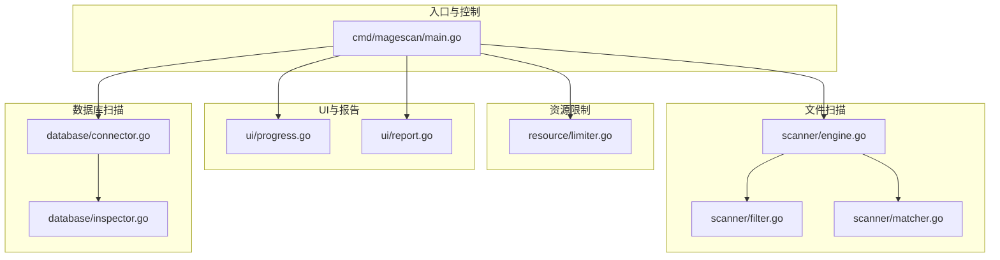
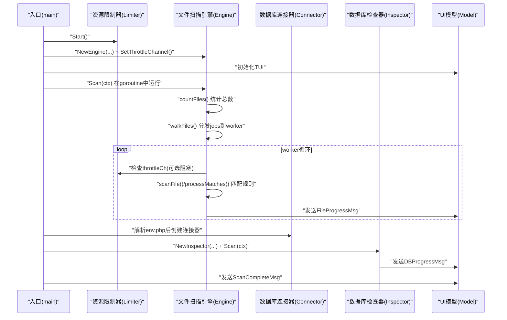
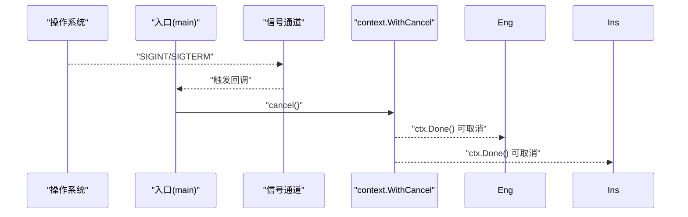
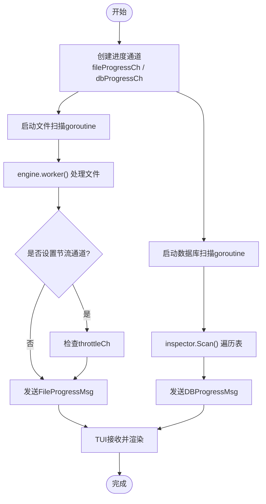
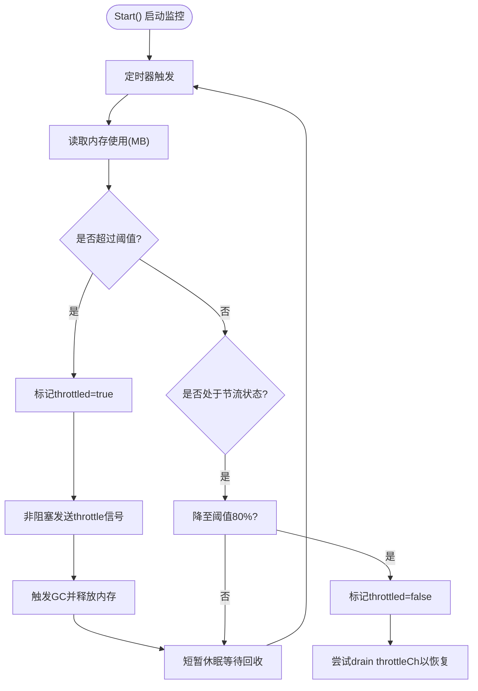
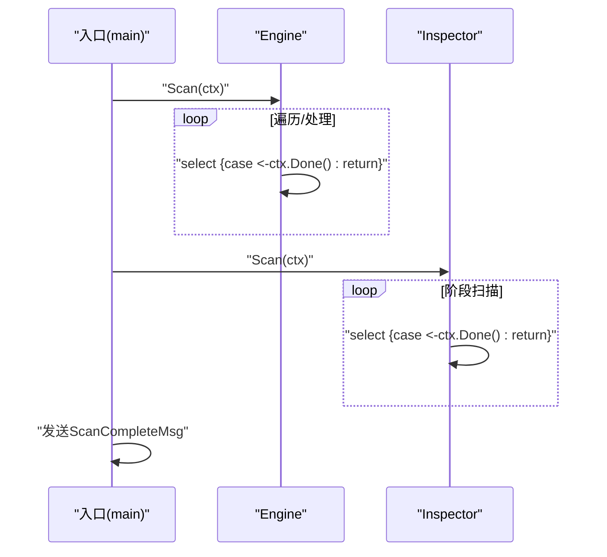
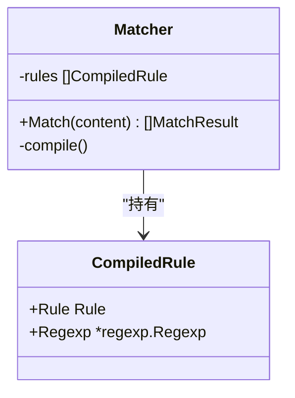
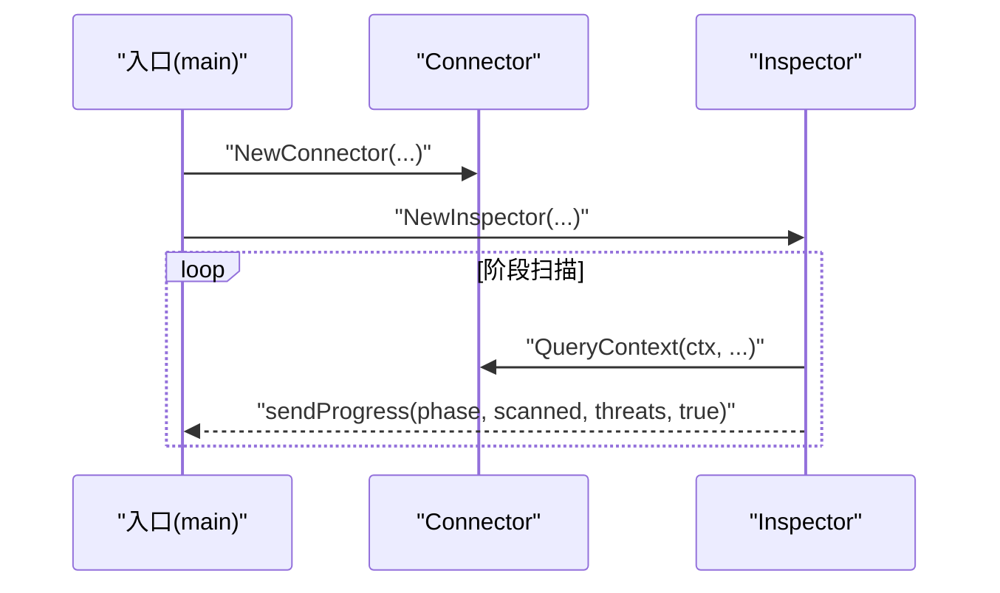
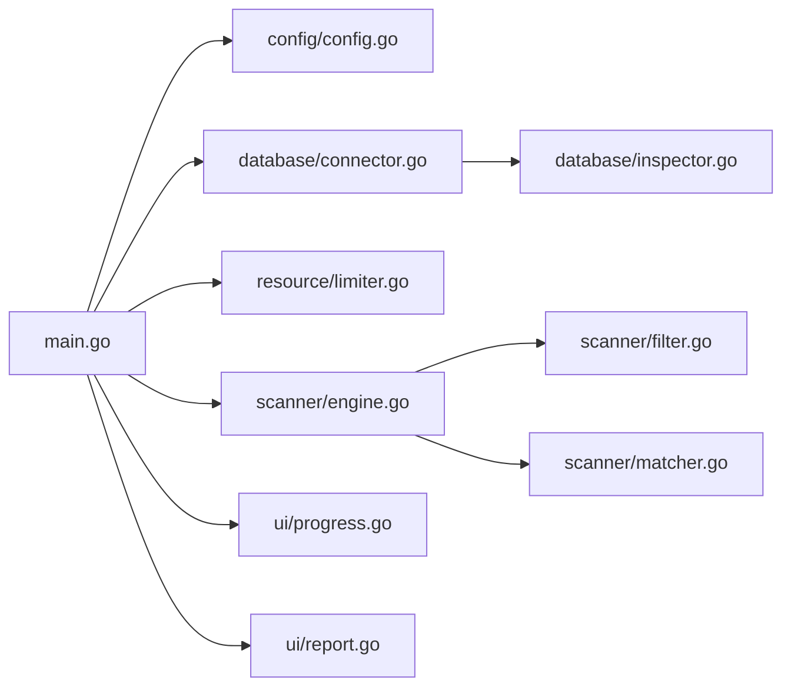

# 并发架构

<cite>
**本文引用的文件**
- [cmd/magescan/main.go](file://cmd/magescan/main.go)
- [scanner/engine.go](file://scanner/engine.go)
- [resource/limiter.go](file://resource/limiter.go)
- [ui/progress.go](file://ui/progress.go)
- [scanner/filter.go](file://scanner/filter.go)
- [scanner/matcher.go](file://scanner/matcher.go)
- [database/connector.go](file://database/connector.go)
- [database/inspector.go](file://database/inspector.go)
- [ui/report.go](file://ui/report.go)
- [config/config.go](file://config/config.go)
- [scanner/rules.go](file://scanner/rules.go)
</cite>

## 目录
1. [简介](#简介)
2. [项目结构](#项目结构)
3. [核心组件](#核心组件)
4. [架构总览](#架构总览)
5. [详细组件分析](#详细组件分析)
6. [依赖分析](#依赖分析)
7. [性能考量](#性能考量)
8. [故障排查指南](#故障排查指南)
9. [结论](#结论)

## 简介
本文件面向并发编程开发者，系统性解析 MageScan 的并发架构与实现细节。重点覆盖：
- 工作池模式在文件扫描中的应用：worker goroutine 的创建、任务分发、结果收集
- 信号处理机制：优雅处理用户中断与系统信号
- 通道通信模式：进度通知、威胁发现、停止信号等
- 资源限制器：通过通道机制控制并发度，避免系统过载
- 上下文取消机制：在长任务中传播取消信号
- 面向开发者的最佳实践与优化建议

## 项目结构
项目采用按功能域划分的模块化组织方式，核心并发逻辑分布在以下模块：
- 入口与控制流：cmd/magescan/main.go
- 文件扫描引擎：scanner/engine.go 及其子模块（过滤器、匹配器）
- 资源限制器：resource/limiter.go
- 用户界面与报告：ui/progress.go、ui/report.go
- 数据库扫描：database/connector.go、database/inspector.go
- 配置与规则：config/config.go、scanner/rules.go



图表来源
- [cmd/magescan/main.go:1-208](file://cmd/magescan/main.go#L1-L208)
- [scanner/engine.go:1-323](file://scanner/engine.go#L1-L323)
- [resource/limiter.go:1-118](file://resource/limiter.go#L1-L118)
- [ui/progress.go:1-289](file://ui/progress.go#L1-L289)
- [database/inspector.go:1-359](file://database/inspector.go#L1-L359)

章节来源
- [cmd/magescan/main.go:24-208](file://cmd/magescan/main.go#L24-L208)
- [scanner/engine.go:47-131](file://scanner/engine.go#L47-L131)
- [resource/limiter.go:11-62](file://resource/limiter.go#L11-L62)
- [ui/progress.go:54-82](file://ui/progress.go#L54-L82)
- [database/inspector.go:63-114](file://database/inspector.go#L63-L114)

## 核心组件
- 工作池引擎（Engine）：负责目录遍历、任务分发、worker 协作与统计收集
- 资源限制器（Limiter）：监控内存并通过通道对 worker 进行节流
- 扫描过滤器（ScanFilter）：决定跳过哪些目录与文件
- 匹配器（Matcher）：线程安全地执行规则匹配
- 数据库连接器（Connector）与检查器（Inspector）：数据库扫描与进度上报
- UI 模型（Model）：接收进度消息并渲染 TUI
- 报告生成器（RenderReport）：汇总最终结果

章节来源
- [scanner/engine.go:47-131](file://scanner/engine.go#L47-L131)
- [resource/limiter.go:11-62](file://resource/limiter.go#L11-L62)
- [scanner/filter.go:8-98](file://scanner/filter.go#L8-L98)
- [scanner/matcher.go:22-82](file://scanner/matcher.go#L22-L82)
- [database/connector.go:10-58](file://database/connector.go#L10-L58)
- [database/inspector.go:63-114](file://database/inspector.go#L63-L114)
- [ui/progress.go:54-82](file://ui/progress.go#L54-L82)
- [ui/report.go:11-230](file://ui/report.go#L11-L230)

## 架构总览
整体并发流程由入口程序协调，包含两条主要数据通路：
- 文件扫描通路：入口创建引擎与资源限制器，启动文件扫描 goroutine；引擎内部构建工作池，通过作业通道分发文件路径；worker 读取文件内容并进行匹配，周期性通过进度通道上报；入口将进度通道转发给 TUI 渲染。
- 数据库扫描通路：入口在解析 env.php 成功后，创建数据库连接器与检查器，运行数据库扫描 goroutine；检查器按阶段扫描表并上报进度；入口将数据库进度通道转发给 TUI 渲染。



图表来源
- [cmd/magescan/main.go:67-157](file://cmd/magescan/main.go#L67-L157)
- [scanner/engine.go:76-121](file://scanner/engine.go#L76-L121)
- [resource/limiter.go:34-52](file://resource/limiter.go#L34-L52)
- [database/inspector.go:79-109](file://database/inspector.go#L79-L109)

## 详细组件分析

### 工作池模式与文件扫描引擎
- worker 数量：默认为 CPU 核数的两倍，兼顾 I/O 与 CPU 密集场景
- 作业通道：容量为 worker 数量的 4 倍，缓解生产者与消费者速度差异
- 任务分发：遍历目录时将文件路径写入作业通道，worker 从通道读取
- 进度上报：每处理固定数量文件或发现威胁时，通过进度通道发送
- 统计与原子操作：扫描计数、威胁计数使用原子变量，避免锁竞争
- 资源节流：worker 在处理前检查资源限制器提供的节流通道，必要时阻塞等待释放

```mermaid
classDiagram
class Engine {
-rootPath string
-filter *ScanFilter
-matcher *Matcher
-workerCount int
-findings []Finding
-stats ScanStats
-mu Mutex
-progressCh chan ScanProgress
-throttleCh chan struct{}
+Scan(ctx) ([]Finding, error)
+GetStats() ScanStats
-countFiles(ctx) (int64, error)
-walkFiles(ctx, jobs) error
-worker(ctx, jobs)
-scanFile(path)
-processMatches(path, content)
}
class ScanFilter {
+ShouldSkipDir(relPath) bool
+ShouldScanFile(fileName) bool
}
class Matcher {
+Match(content) []MatchResult
}
Engine --> ScanFilter : "使用"
Engine --> Matcher : "使用"
```

图表来源
- [scanner/engine.go:47-131](file://scanner/engine.go#L47-L131)
- [scanner/filter.go:8-98](file://scanner/filter.go#L8-L98)
- [scanner/matcher.go:22-82](file://scanner/matcher.go#L22-L82)

章节来源
- [scanner/engine.go:60-121](file://scanner/engine.go#L60-L121)
- [scanner/engine.go:195-227](file://scanner/engine.go#L195-L227)
- [scanner/filter.go:56-98](file://scanner/filter.go#L56-L98)
- [scanner/matcher.go:34-82](file://scanner/matcher.go#L34-L82)

### 信号处理与上下文取消
- 信号通道：创建容量为 1 的信号通道，注册 SIGINT/SIGTERM
- 取消策略：收到信号后调用 cancel()，随后所有 goroutine 的 ctx.Done() 会收到取消
- 取消传播：引擎与检查器在关键步骤均检查 ctx.Done() 并提前返回
- 优雅退出：入口在 defer 中调用 cancel()，确保程序退出前清理资源



图表来源
- [cmd/magescan/main.go:67-76](file://cmd/magescan/main.go#L67-L76)
- [scanner/engine.go:141-144](file://scanner/engine.go#L141-L144)
- [database/inspector.go:92-96](file://database/inspector.go#L92-L96)

章节来源
- [cmd/magescan/main.go:67-76](file://cmd/magescan/main.go#L67-L76)
- [scanner/engine.go:141-144](file://scanner/engine.go#L141-L144)
- [database/inspector.go:92-96](file://database/inspector.go#L92-L96)

### 通道通信模式
- 进度通知通道：
  - 文件扫描：engine 发送 ScanProgress，入口 goroutine 将其转换为 FileProgressMsg 并发送给 TUI
  - 数据库扫描：inspector 发送 DBProgress，入口 goroutine 将其转换为 DBProgressMsg 并发送给 TUI
- 停止信号通道：资源限制器内部使用 stopCh 控制监控协程生命周期
- 节流通道：Limiter 提供 throttleCh，worker 在处理前检查该通道以实现暂停/恢复



图表来源
- [cmd/magescan/main.go:78-151](file://cmd/magescan/main.go#L78-L151)
- [scanner/engine.go:217-226](file://scanner/engine.go#L217-L226)
- [database/inspector.go:332-341](file://database/inspector.go#L332-L341)

章节来源
- [cmd/magescan/main.go:78-151](file://cmd/magescan/main.go#L78-L151)
- [scanner/engine.go:217-226](file://scanner/engine.go#L217-L226)
- [database/inspector.go:332-341](file://database/inspector.go#L332-L341)

### 资源限制器与并发度控制
- 监控策略：后台定时器周期读取内存使用，超过阈值则进入“节流”状态
- 节流机制：通过单元素缓冲通道实现“暂停/恢复”，worker 在处理前检查该通道
- 滞回策略：内存降至阈值的 80% 时才解除节流，避免频繁抖动
- CPU 限制：启动时设置 GOMAXPROCS，退出时恢复原值



图表来源
- [resource/limiter.go:64-117](file://resource/limiter.go#L64-L117)

章节来源
- [resource/limiter.go:34-52](file://resource/limiter.go#L34-L52)
- [resource/limiter.go:78-117](file://resource/limiter.go#L78-L117)

### 上下文取消在长任务中的应用
- 文件扫描：countFiles/walkFiles/worker 均在关键点检查 ctx.Done()，确保快速响应取消
- 数据库扫描：每个阶段扫描前检查 ctx.Done()，遇到错误或取消直接返回
- UI 完成：扫描完成后发送 ScanCompleteMsg，驱动 TUI 结束



图表来源
- [scanner/engine.go:141-144](file://scanner/engine.go#L141-L144)
- [scanner/engine.go:185-189](file://scanner/engine.go#L185-L189)
- [scanner/engine.go:198-201](file://scanner/engine.go#L198-L201)
- [database/inspector.go:92-96](file://database/inspector.go#L92-L96)

章节来源
- [scanner/engine.go:141-144](file://scanner/engine.go#L141-L144)
- [scanner/engine.go:185-189](file://scanner/engine.go#L185-L189)
- [scanner/engine.go:198-201](file://scanner/engine.go#L198-L201)
- [database/inspector.go:92-96](file://database/inspector.go#L92-L96)

### 规则与匹配器的并发特性
- 规则预编译：匹配器在初始化时一次性编译正则，后续 Match 为纯匹配，避免重复开销
- 线程安全：匹配器内部使用 Once 确保初始化只发生一次，Match 方法可并发调用
- 规则分类：按类别聚合，便于后续扩展与统计



图表来源
- [scanner/matcher.go:22-82](file://scanner/matcher.go#L22-L82)
- [scanner/rules.go:39-58](file://scanner/rules.go#L39-L58)

章节来源
- [scanner/matcher.go:34-82](file://scanner/matcher.go#L34-L82)
- [scanner/rules.go:39-58](file://scanner/rules.go#L39-L58)

### 数据库扫描的并发与容错
- 连接管理：最大打开连接数与空闲连接数限制，Ping 校验连通性
- 表扫描顺序：按阶段依次扫描，每个阶段独立查询并上报进度
- 错误处理：对不存在的表进行特殊处理，继续下一阶段扫描
- 上下文支持：每个阶段查询均使用 QueryContext(ctx, ...) 支持取消



图表来源
- [database/connector.go:16-58](file://database/connector.go#L16-L58)
- [database/inspector.go:79-109](file://database/inspector.go#L79-L109)

章节来源
- [database/connector.go:16-58](file://database/connector.go#L16-L58)
- [database/inspector.go:79-109](file://database/inspector.go#L79-L109)

## 依赖分析
- 入口依赖：cmd/magescan/main.go 依赖配置、数据库、资源限制、扫描引擎与 UI
- 引擎依赖：scanner/engine.go 依赖过滤器与匹配器
- 限制器依赖：resource/limiter.go 依赖 runtime 与 time
- 数据库依赖：database/inspector.go 依赖 database/sql 与 regexp
- UI 依赖：ui/progress.go 依赖 bubbletea 与 lipgloss



图表来源
- [cmd/magescan/main.go:15-20](file://cmd/magescan/main.go#L15-L20)
- [scanner/engine.go:3-11](file://scanner/engine.go#L3-L11)
- [resource/limiter.go:3-9](file://resource/limiter.go#L3-L9)
- [database/inspector.go:3-9](file://database/inspector.go#L3-L9)
- [ui/progress.go:3-12](file://ui/progress.go#L3-L12)

章节来源
- [cmd/magescan/main.go:15-20](file://cmd/magescan/main.go#L15-L20)
- [scanner/engine.go:3-11](file://scanner/engine.go#L3-L11)
- [resource/limiter.go:3-9](file://resource/limiter.go#L3-L9)
- [database/inspector.go:3-9](file://database/inspector.go#L3-L9)
- [ui/progress.go:3-12](file://ui/progress.go#L3-L12)

## 性能考量
- 工作池大小：默认 CPU×2，适合混合 I/O 与 CPU 场景；可通过参数调整
- 作业通道容量：workerCount×4，降低阻塞概率，提升吞吐
- 正则预编译：匹配器初始化时一次性编译，减少运行时开销
- 内存节流：基于滞回策略的节流通道，避免频繁切换导致抖动
- I/O 优化：大文件采用分块读取并带重叠，平衡性能与漏检风险
- 上下文取消：在长耗时操作中及时响应取消，避免资源浪费

## 故障排查指南
- 扫描卡住或过慢
  - 检查是否启用内存限制：若已节流，worker 会被阻塞等待释放
  - 查看作业通道是否积压：适当增大 workerCount 或作业通道容量
- 内存占用过高
  - 调整 mem-limit 参数；确认节流通道是否正确解除
  - 观察 GC 是否被触发，必要时降低扫描强度
- 数据库扫描失败
  - 确认表是否存在；检查连接参数与权限
  - 关注阶段扫描日志，定位具体表的异常
- UI 不更新进度
  - 确认进度通道转发 goroutine 是否正常运行
  - 检查 TUI 模型的消息处理逻辑

章节来源
- [resource/limiter.go:78-117](file://resource/limiter.go#L78-L117)
- [scanner/engine.go:195-227](file://scanner/engine.go#L195-L227)
- [database/inspector.go:92-109](file://database/inspector.go#L92-L109)
- [ui/progress.go:140-197](file://ui/progress.go#L140-L197)

## 结论
MageScan 的并发架构以“工作池 + 通道 + 上下文取消 + 资源限制器”为核心，实现了高吞吐、低耦合、可扩展且可优雅终止的扫描系统。通过明确的职责分离与清晰的通道契约，开发者可以在此基础上进一步扩展规则、优化性能，并增强可观测性与容错能力。