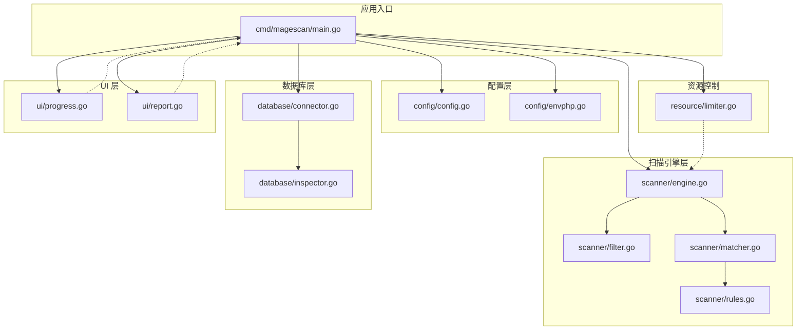
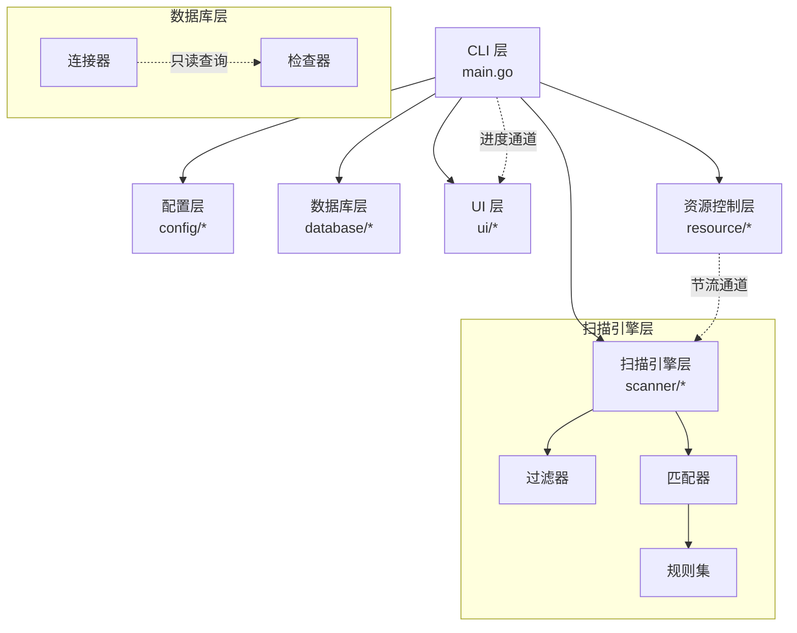
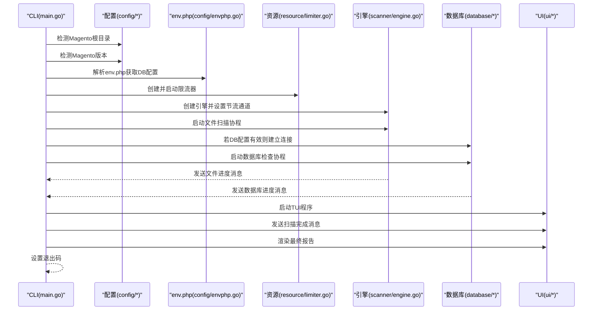
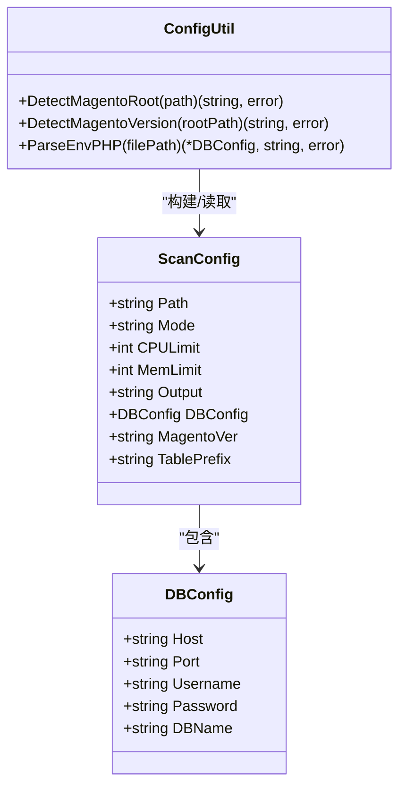
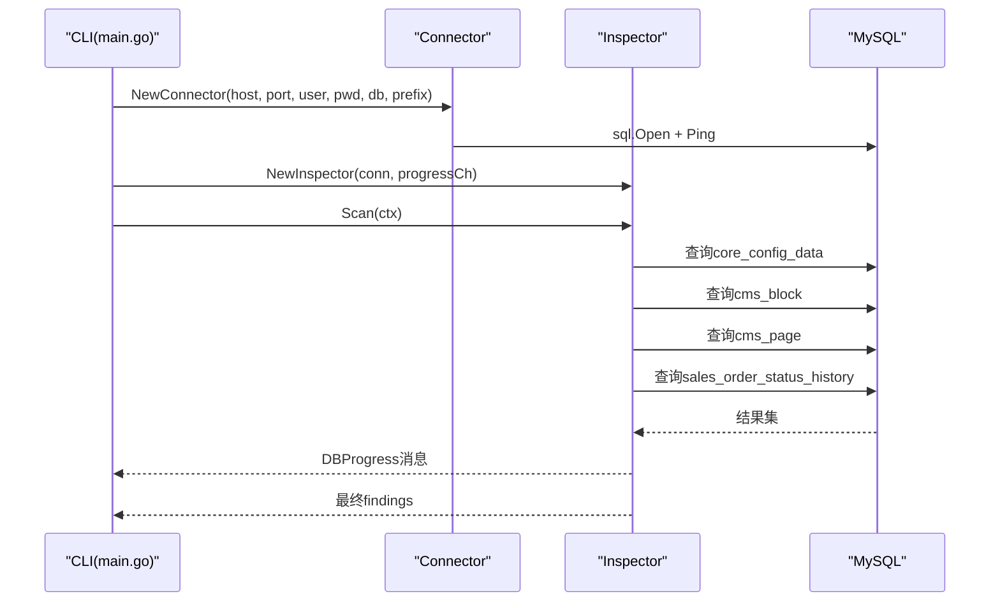
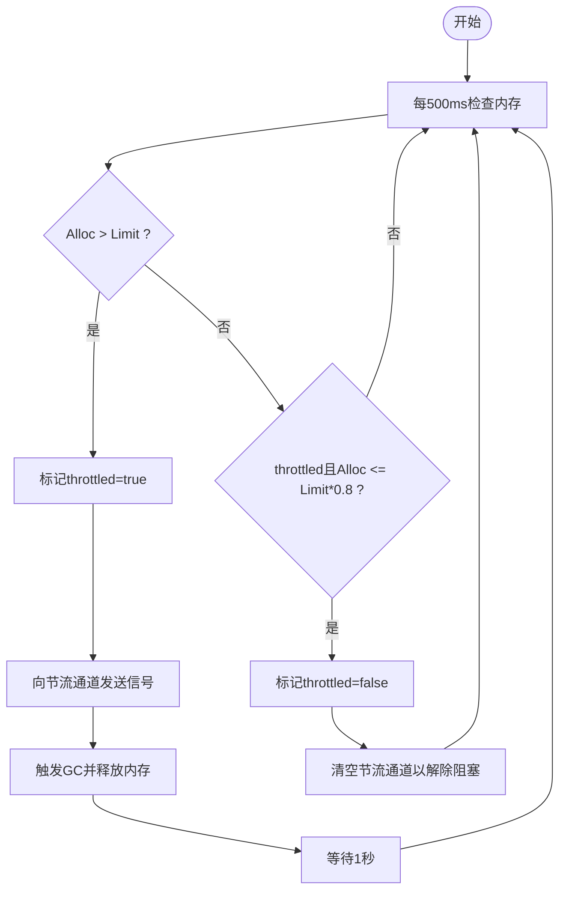
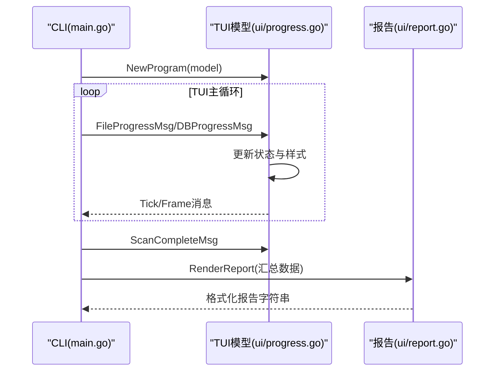
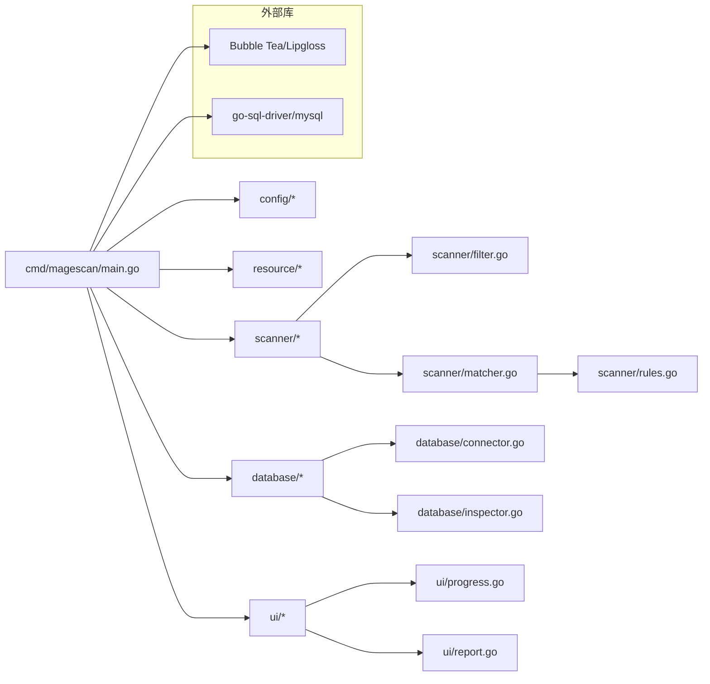

# 整体架构

<cite>
**本文引用的文件列表**
- [cmd/magescan/main.go](file://cmd/magescan/main.go)
- [config/config.go](file://config/config.go)
- [config/envphp.go](file://config/envphp.go)
- [scanner/engine.go](file://scanner/engine.go)
- [scanner/filter.go](file://scanner/filter.go)
- [scanner/matcher.go](file://scanner/matcher.go)
- [scanner/rules.go](file://scanner/rules.go)
- [database/connector.go](file://database/connector.go)
- [database/inspector.go](file://database/inspector.go)
- [resource/limiter.go](file://resource/limiter.go)
- [ui/progress.go](file://ui/progress.go)
- [ui/report.go](file://ui/report.go)
- [go.mod](file://go.mod)
- [README.md](file://README.md)
</cite>

## 目录
1. [简介](#简介)
2. [项目结构](#项目结构)
3. [核心组件](#核心组件)
4. [架构总览](#架构总览)
5. [详细组件分析](#详细组件分析)
6. [依赖关系分析](#依赖关系分析)
7. [性能考量](#性能考量)
8. [故障排查指南](#故障排查指南)
9. [结论](#结论)
10. [附录](#附录)

## 简介
本文件面向架构师与开发者，系统性阐述 MageScan 的整体架构设计，重点覆盖以下方面：
- 分层架构与模块化设计：CLI 层、配置层、扫描引擎层、数据库层、UI 层的职责与边界
- 架构模式：分层架构、模块化设计、事件驱动（消息通道）等
- 组件间依赖关系与数据流：从命令行输入到最终报告输出的完整流程
- 关键设计决策：为何选择 Bubble Tea 实现 TUI、如何设计模块解耦、资源限制策略等
- 图示化表达：系统上下文图、组件交互图、类图、时序图、流程图等

## 项目结构
项目采用按功能域划分的模块化目录结构，每个子目录聚焦单一职责：
- cmd/magescan：CLI 入口与编排
- config：环境检测与配置解析
- scanner：文件扫描引擎、规则匹配器、过滤器
- database：数据库连接器与安全检查器
- resource：CPU/内存资源限制与自动节流
- ui：TUI 进度模型与报告渲染



图表来源
- [cmd/magescan/main.go:1-208](file://cmd/magescan/main.go#L1-L208)
- [config/config.go:1-108](file://config/config.go#L1-L108)
- [config/envphp.go:1-88](file://config/envphp.go#L1-L88)
- [scanner/engine.go:1-323](file://scanner/engine.go#L1-L323)
- [scanner/filter.go:1-98](file://scanner/filter.go#L1-L98)
- [scanner/matcher.go:1-168](file://scanner/matcher.go#L1-L168)
- [scanner/rules.go:1-468](file://scanner/rules.go#L1-L468)
- [database/connector.go:1-58](file://database/connector.go#L1-L58)
- [database/inspector.go:1-359](file://database/inspector.go#L1-L359)
- [resource/limiter.go:1-118](file://resource/limiter.go#L1-L118)
- [ui/progress.go:1-289](file://ui/progress.go#L1-L289)
- [ui/report.go:1-230](file://ui/report.go#L1-L230)

章节来源
- [cmd/magescan/main.go:1-208](file://cmd/magescan/main.go#L1-L208)
- [README.md:239-259](file://README.md#L239-L259)

## 核心组件
- CLI 层（cmd/magescan/main.go）
  - 负责命令行参数解析、信号处理、并发扫描编排、进度通道转发、TUI 启动与退出码控制
- 配置层（config/config.go, config/envphp.go）
  - 提供 Magento 根路径检测、版本检测、env.php 解析与数据库配置提取
- 扫描引擎层（scanner/engine.go, scanner/filter.go, scanner/matcher.go, scanner/rules.go）
  - 文件扫描引擎（工作池）、文件过滤器、规则匹配器（预编译正则）、威胁规则集
- 数据库层（database/connector.go, database/inspector.go）
  - 只读数据库连接器、表前缀支持、多表安全检查与威胁发现
- 资源控制（resource/limiter.go）
  - CPU/内存限制、周期性监控、自动节流通道、滞后回弹恢复
- UI 层（ui/progress.go, ui/report.go）
  - Bubble Tea TUI 模型与消息、实时进度展示、最终报告渲染

章节来源
- [cmd/magescan/main.go:24-207](file://cmd/magescan/main.go#L24-L207)
- [config/config.go:13-107](file://config/config.go#L13-L107)
- [config/envphp.go:10-87](file://config/envphp.go#L10-L87)
- [scanner/engine.go:47-131](file://scanner/engine.go#L47-L131)
- [scanner/filter.go:8-97](file://scanner/filter.go#L8-L97)
- [scanner/matcher.go:22-82](file://scanner/matcher.go#L22-L82)
- [scanner/rules.go:39-58](file://scanner/rules.go#L39-L58)
- [database/connector.go:10-57](file://database/connector.go#L10-L57)
- [database/inspector.go:63-109](file://database/inspector.go#L63-L109)
- [resource/limiter.go:11-117](file://resource/limiter.go#L11-L117)
- [ui/progress.go:54-134](file://ui/progress.go#L54-L134)
- [ui/report.go:11-168](file://ui/report.go#L11-L168)

## 架构总览
系统采用“分层 + 模块化 + 事件驱动”的混合架构：
- 分层架构：CLI -> 配置 -> 引擎 -> 数据库 -> UI
- 模块化设计：各层内聚、跨层通过接口/消息解耦
- 事件驱动：使用 Go Channel 在扫描线程、数据库线程与 TUI 之间传递进度消息



图表来源
- [cmd/magescan/main.go:78-157](file://cmd/magescan/main.go#L78-L157)
- [scanner/engine.go:76-121](file://scanner/engine.go#L76-L121)
- [database/inspector.go:79-109](file://database/inspector.go#L79-L109)
- [ui/progress.go:14-31](file://ui/progress.go#L14-L31)
- [resource/limiter.go:54-62](file://resource/limiter.go#L54-L62)

## 详细组件分析

### CLI 层（cmd/magescan/main.go）
职责与行为
- 命令行参数解析：路径、扫描模式、CPU/内存限制、输出格式
- 环境检测：验证 Magento 根目录、读取版本信息
- 配置解析：解析 env.php 获取数据库连接与表前缀
- 并发编排：启动资源限制器、扫描协程、TUI 协程、信号处理
- 进度通道：将文件扫描与数据库扫描进度转发至 TUI
- 报告生成：汇总结果、渲染报告、设置退出码

关键交互
- 与配置层：调用根路径检测与版本检测；解析 env.php
- 与资源控制层：启动/停止限流器，注入节流通道
- 与扫描引擎层：创建引擎、设置节流通道、触发扫描
- 与数据库层：在配置有效时建立连接并执行检查
- 与 UI 层：启动 TUI、发送进度消息、接收完成信号、渲染最终报告



图表来源
- [cmd/magescan/main.go:24-207](file://cmd/magescan/main.go#L24-L207)
- [config/config.go:49-107](file://config/config.go#L49-L107)
- [config/envphp.go:14-71](file://config/envphp.go#L14-L71)
- [resource/limiter.go:34-62](file://resource/limiter.go#L34-L62)
- [scanner/engine.go:76-121](file://scanner/engine.go#L76-L121)
- [database/inspector.go:79-109](file://database/inspector.go#L79-L109)
- [ui/progress.go:14-31](file://ui/progress.go#L14-L31)

章节来源
- [cmd/magescan/main.go:24-207](file://cmd/magescan/main.go#L24-L207)

### 配置层（config/config.go, config/envphp.go）
职责与行为
- ScanConfig：封装一次扫描会话的全部配置项（路径、模式、CPU/内存限制、输出格式、DB 配置、版本、表前缀）
- DetectMagentoRoot：校验目标是否为 Magento 根（存在 env.php 与 bin/magento）
- DetectMagentoVersion：从 composer.json 读取版本
- ParseEnvPHP：解析 env.php 提取主机、端口、用户名、密码、数据库名、表前缀，并进行基本校验



图表来源
- [config/config.go:13-47](file://config/config.go#L13-L47)
- [config/config.go:49-107](file://config/config.go#L49-L107)
- [config/envphp.go:14-71](file://config/envphp.go#L14-L71)

章节来源
- [config/config.go:13-107](file://config/config.go#L13-L107)
- [config/envphp.go:10-87](file://config/envphp.go#L10-L87)

### 扫描引擎层（scanner/engine.go, scanner/filter.go, scanner/matcher.go, scanner/rules.go）
职责与行为
- Engine：工作池扫描引擎，负责统计文件数、分发任务、聚合结果、发送进度
- Filter：根据扫描模式决定跳过目录与扫描文件扩展名
- Matcher：线程安全的规则匹配器，预编译规则，支持字面量与正则匹配
- Rules：规则定义与分类（严重级别、类别、描述、正则/字面量）

```mermaid
classDiagram
class Engine {
-string rootPath
-ScanFilter filter
-Matcher matcher
-int workerCount
-[]Finding findings
-ScanStats stats
-chan ScanProgress progressCh
-chan struct{} throttleCh
+Scan(ctx) ([]Finding, error)
+GetStats() ScanStats
}
class ScanFilter {
-string Mode
+ShouldSkipDir(relPath) bool
+ShouldScanFile(fileName) bool
}
class Matcher {
-[]CompiledRule rules
+Match(content) []MatchResult
+RuleCount() int
+RulesByCategory(cat) []CompiledRule
}
class CompiledRule {
+Rule Rule
+regexp Regexp
}
class Rule {
+string ID
+RuleCategory Category
+Severity Severity
+string Description
+string Pattern
+string Regex
+bool IsRegex
}
Engine --> ScanFilter : "使用"
Engine --> Matcher : "使用"
Matcher --> CompiledRule : "持有"
CompiledRule --> Rule : "包装"
```

图表来源
- [scanner/engine.go:47-131](file://scanner/engine.go#L47-L131)
- [scanner/filter.go:8-97](file://scanner/filter.go#L8-L97)
- [scanner/matcher.go:22-82](file://scanner/matcher.go#L22-L82)
- [scanner/rules.go:39-58](file://scanner/rules.go#L39-L58)

章节来源
- [scanner/engine.go:47-323](file://scanner/engine.go#L47-L323)
- [scanner/filter.go:8-98](file://scanner/filter.go#L8-L98)
- [scanner/matcher.go:22-168](file://scanner/matcher.go#L22-L168)
- [scanner/rules.go:39-468](file://scanner/rules.go#L39-L468)

### 数据库层（database/connector.go, database/inspector.go）
职责与行为
- Connector：只读 MySQL 连接管理，DSN 构造、Ping 校验、表名加前缀
- Inspector：针对多张敏感表执行只读扫描，基于预设正则与敏感路径识别威胁，生成修复建议 SQL



图表来源
- [database/connector.go:16-57](file://database/connector.go#L16-L57)
- [database/inspector.go:79-109](file://database/inspector.go#L79-L109)
- [cmd/magescan/main.go:106-122](file://cmd/magescan/main.go#L106-L122)

章节来源
- [database/connector.go:10-58](file://database/connector.go#L10-L58)
- [database/inspector.go:63-359](file://database/inspector.go#L63-L359)

### 资源控制层（resource/limiter.go）
职责与行为
- 监控 goroutine 周期性检查内存占用，超过阈值时通过节流通道暂停工作协程，GC 回收后在 80% 阈值回落时恢复



图表来源
- [resource/limiter.go:64-117](file://resource/limiter.go#L64-L117)

章节来源
- [resource/limiter.go:11-118](file://resource/limiter.go#L11-L118)

### UI 层（ui/progress.go, ui/report.go）
职责与行为
- TUI 模型：定义进度消息类型、状态机（文件扫描/数据库扫描/完成）、窗口尺寸自适应、按键处理
- 报告渲染：汇总文件与数据库威胁，按严重级别统计，生成带颜色与样式的最终报告文本



图表来源
- [ui/progress.go:14-197](file://ui/progress.go#L14-L197)
- [ui/report.go:57-168](file://ui/report.go#L57-L168)
- [cmd/magescan/main.go:153-201](file://cmd/magescan/main.go#L153-L201)

章节来源
- [ui/progress.go:54-289](file://ui/progress.go#L54-L289)
- [ui/report.go:11-230](file://ui/report.go#L11-L230)

## 依赖关系分析
- 外部依赖
  - Bubble Tea 生态（bubbles/progress、bubbles/spinner、lipgloss）用于 TUI
  - go-sql-driver/mysql 用于数据库连接
- 内部依赖
  - CLI 依赖配置、资源、扫描引擎、数据库、UI
  - 扫描引擎依赖过滤器与匹配器
  - 匹配器依赖规则集
  - 数据库检查器依赖连接器



图表来源
- [go.mod:5-10](file://go.mod#L5-L10)
- [cmd/magescan/main.go:13-20](file://cmd/magescan/main.go#L13-L20)
- [scanner/matcher.go:34-42](file://scanner/matcher.go#L34-L42)
- [database/connector.go:7](file://database/connector.go#L7)

章节来源
- [go.mod:1-31](file://go.mod#L1-L31)

## 性能考量
- 工作池并发：默认工作协程数为 CPU 数的两倍，提升吞吐同时避免过度竞争
- 分块读取：大文件以重叠分块读取，降低峰值内存占用
- 正则预编译：规则在进程初始化阶段一次性编译，减少运行时开销
- 节流机制：基于内存阈值的自动节流与滞后回弹，平衡性能与稳定性
- 只读扫描：数据库侧仅执行 SELECT 查询，避免写入风险

章节来源
- [scanner/engine.go:66](file://scanner/engine.go#L66)
- [scanner/engine.go:262-285](file://scanner/engine.go#L262-L285)
- [scanner/matcher.go:34-61](file://scanner/matcher.go#L34-L61)
- [resource/limiter.go:78-117](file://resource/limiter.go#L78-L117)
- [database/inspector.go:116-330](file://database/inspector.go#L116-L330)

## 故障排查指南
- 环境检测失败
  - 症状：提示非 Magento 根或缺少 bin/magento
  - 排查：确认传入路径正确、存在 app/etc/env.php 与 bin/magento
- 版本检测异常
  - 症状：版本未知或解析 composer.json 失败
  - 排查：检查 composer.json 是否可读、字段是否存在
- env.php 解析错误
  - 症状：无法提取 DB 配置或表前缀
  - 排查：确认 env.php 存在且包含所需键值
- 数据库连接失败
  - 症状：无法连接或表不存在
  - 排查：核对主机/端口/凭据；确认表前缀；检查表是否存在
- 内存不足导致节流
  - 症状：扫描卡顿或暂停
  - 排查：提高内存上限或降低并发；观察日志中节流触发点
- TUI 显示异常
  - 症状：界面错位或按键无响应
  - 排查：调整终端尺寸；确认 Bubble Tea 依赖可用

章节来源
- [config/config.go:49-107](file://config/config.go#L49-L107)
- [config/envphp.go:14-71](file://config/envphp.go#L14-L71)
- [database/connector.go:18-38](file://database/connector.go#L18-L38)
- [database/inspector.go:116-109](file://database/inspector.go#L116-L109)
- [resource/limiter.go:78-117](file://resource/limiter.go#L78-L117)
- [ui/progress.go:140-197](file://ui/progress.go#L140-L197)

## 结论
MageScan 通过清晰的分层与模块化设计，结合事件驱动的消息通道与资源控制策略，实现了高性能、可扩展、可维护的安全扫描系统。CLI 层统一编排，配置层提供环境感知，扫描引擎层专注规则匹配与并发调度，数据库层确保只读安全检查，UI 层提供直观反馈。该架构既满足生产级性能需求，又便于后续扩展新的检测能力与输出格式。

## 附录
- 设计决策要点
  - 选择 Bubble Tea 实现 TUI：简洁的状态机模型、丰富的 UI 组件生态、良好的跨平台支持
  - 模块解耦：通过接口与消息通道隔离各层，降低耦合度，提升可测试性
  - 资源限制：以 500ms 为周期的内存监控与滞后回弹，兼顾稳定性与性能
  - 表前缀支持：数据库连接器统一处理表前缀，适配不同部署场景

章节来源
- [README.md:251-259](file://README.md#L251-L259)
- [database/connector.go:49-52](file://database/connector.go#L49-L52)
- [resource/limiter.go:64-117](file://resource/limiter.go#L64-L117)