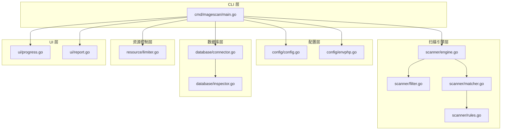
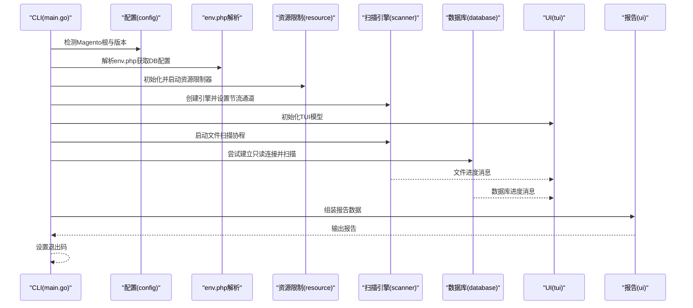
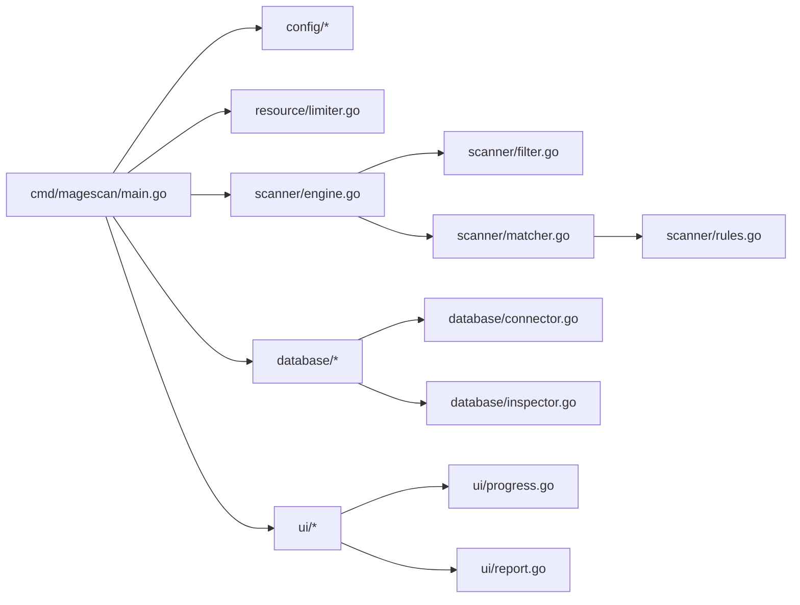

# 架构设计

<cite>
**本文引用的文件列表**
- [cmd/magescan/main.go](file://cmd/magescan/main.go)
- [config/config.go](file://config/config.go)
- [config/envphp.go](file://config/envphp.go)
- [scanner/engine.go](file://scanner/engine.go)
- [scanner/filter.go](file://scanner/filter.go)
- [scanner/matcher.go](file://scanner/matcher.go)
- [scanner/rules.go](file://scanner/rules.go)
- [database/connector.go](file://database/connector.go)
- [database/inspector.go](file://database/inspector.go)
- [resource/limiter.go](file://resource/limiter.go)
- [ui/progress.go](file://ui/progress.go)
- [ui/report.go](file://ui/report.go)
- [go.mod](file://go.mod)
- [README.md](file://README.md)
</cite>

## 目录
1. [简介](#简介)
2. [项目结构](#项目结构)
3. [核心组件](#核心组件)
4. [架构总览](#架构总览)
5. [详细组件分析](#详细组件分析)
6. [依赖关系分析](#依赖关系分析)
7. [性能与并发特性](#性能与并发特性)
8. [故障排查指南](#故障排查指南)
9. [结论](#结论)
10. [附录：设计模式与扩展性](#附录设计模式与扩展性)

## 简介
本文件面向系统架构师与高级开发者，系统化阐述 MageScan 的架构设计与实现细节。该工具是一个高性能、只读的 Magento 2 安全扫描器，支持文件系统与数据库双重扫描，具备实时 TUI 进度展示、资源限制与自动节流、规则引擎、以及可扩展的威胁检测能力。本文从分层架构视角出发，详细说明 CLI 层、配置层、扫描引擎层、数据库层、UI 层的职责与边界，并解析工作池模式、观察者模式（消息通道）、策略模式（扫描模式与规则分类）等设计模式在代码中的落地方式；同时给出系统上下文图与组件分解图，帮助读者快速把握整体设计与演进方向。

## 项目结构
项目采用按功能域划分的模块化组织方式：
- cmd/magescan：CLI 入口与编排，负责参数解析、环境探测、信号处理、并发扫描与进度转发、最终报告渲染。
- config：Magento 根目录检测、版本识别、env.php 解析与数据库配置提取。
- scanner：文件扫描引擎、过滤策略、匹配器与规则集。
- database：数据库连接器与安全检查器，负责对核心表进行只读扫描并生成修复建议。
- resource：资源限制器，基于内存阈值进行自动节流与恢复。
- ui：TUI 模型与报告渲染，使用 Bubble Tea 渲染终端界面并输出结构化报告。



图表来源
- [cmd/magescan/main.go:24-207](file://cmd/magescan/main.go#L24-L207)
- [config/config.go:13-107](file://config/config.go#L13-L107)
- [config/envphp.go:14-87](file://config/envphp.go#L14-L87)
- [scanner/engine.go:47-322](file://scanner/engine.go#L47-L322)
- [scanner/filter.go:8-97](file://scanner/filter.go#L8-L97)
- [scanner/matcher.go:22-167](file://scanner/matcher.go#L22-L167)
- [scanner/rules.go:39-58](file://scanner/rules.go#L39-L58)
- [database/connector.go:10-57](file://database/connector.go#L10-L57)
- [database/inspector.go:63-358](file://database/inspector.go#L63-L358)
- [resource/limiter.go:11-117](file://resource/limiter.go#L11-L117)
- [ui/progress.go:54-288](file://ui/progress.go#L54-L288)
- [ui/report.go:11-229](file://ui/report.go#L11-L229)

章节来源
- [README.md:239-258](file://README.md#L239-L258)

## 核心组件
- CLI 层（cmd/magescan/main.go）
  - 负责命令行参数解析、Magento 根目录与版本检测、env.php 数据库配置解析、资源限制器初始化、上下文与信号处理、并发扫描编排、TUI 初始化与进度转发、最终报告渲染与退出码设置。
- 配置层（config/config.go, config/envphp.go）
  - 提供默认扫描配置、Magento 根目录与版本检测、env.php 解析以提取数据库连接信息与表前缀。
- 扫描引擎层（scanner/engine.go, scanner/filter.go, scanner/matcher.go, scanner/rules.go）
  - 工作池驱动的文件扫描引擎，支持“快速/完整”两种扫描模式；通过过滤器排除非目标目录与文件类型；匹配器预编译规则并执行高效匹配；规则按类别与严重级别分类。
- 数据库层（database/connector.go, database/inspector.go）
  - 只读连接器封装 MySQL 连接与表前缀；检查器对核心表进行扫描，生成威胁发现与修复 SQL。
- 资源控制层（resource/limiter.go）
  - 基于 GOMAXPROCS 的 CPU 限制与周期性内存监控，超过阈值时通过通道阻塞工作池，低于阈值 80% 恢复。
- UI 层（ui/progress.go, ui/report.go）
  - TUI 使用 Bubble Tea 渲染进度与状态；报告渲染器汇总统计、按严重级别排序并输出结构化报告。

章节来源
- [cmd/magescan/main.go:24-207](file://cmd/magescan/main.go#L24-L207)
- [config/config.go:13-107](file://config/config.go#L13-L107)
- [config/envphp.go:14-87](file://config/envphp.go#L14-L87)
- [scanner/engine.go:47-322](file://scanner/engine.go#L47-L322)
- [scanner/filter.go:8-97](file://scanner/filter.go#L8-L97)
- [scanner/matcher.go:22-167](file://scanner/matcher.go#L22-L167)
- [scanner/rules.go:39-58](file://scanner/rules.go#L39-L58)
- [database/connector.go:10-57](file://database/connector.go#L10-L57)
- [database/inspector.go:63-358](file://database/inspector.go#L63-L358)
- [resource/limiter.go:11-117](file://resource/limiter.go#L11-L117)
- [ui/progress.go:54-288](file://ui/progress.go#L54-L288)
- [ui/report.go:11-229](file://ui/report.go#L11-L229)

## 架构总览
下图展示了系统上下文与主要组件交互流程：CLI 作为编排中心，协调配置、扫描引擎、数据库与 UI；资源限制器贯穿文件扫描阶段；TUI 通过消息通道接收进度并渲染；最终报告由 UI 层汇总输出。



图表来源
- [cmd/magescan/main.go:35-126](file://cmd/magescan/main.go#L35-L126)
- [config/config.go:49-107](file://config/config.go#L49-L107)
- [config/envphp.go:14-87](file://config/envphp.go#L14-L87)
- [resource/limiter.go:34-57](file://resource/limiter.go#L34-L57)
- [scanner/engine.go:76-121](file://scanner/engine.go#L76-L121)
- [database/inspector.go:79-109](file://database/inspector.go#L79-L109)
- [ui/progress.go:140-197](file://ui/progress.go#L140-L197)
- [ui/report.go:57-167](file://ui/report.go#L57-L167)

## 详细组件分析

### CLI 层（cmd/magescan/main.go）
- 职责边界
  - 参数解析与默认值设定、Magento 根目录与版本检测、env.php 数据库配置解析。
  - 初始化资源限制器、上下文与信号处理、并发扫描编排、TUI 初始化与进度转发、最终报告渲染与退出码设置。
- 关键流程
  - 并发扫描：文件扫描与数据库扫描分别在独立 goroutine 中运行，通过通道向 TUI 推送进度。
  - 优雅退出：捕获 SIGINT/SIGTERM，取消上下文，确保资源释放。
  - 报告生成：将文件与数据库发现转换为统一的报告数据结构，调用渲染器输出。
- 设计要点
  - 使用通道解耦扫描与 UI，避免阻塞主流程。
  - 通过 context 控制扫描生命周期，支持中断与超时。
  - 退出码依据是否发现威胁决定，便于 CI/CD 集成。

章节来源
- [cmd/magescan/main.go:24-207](file://cmd/magescan/main.go#L24-L207)

### 配置层（config/config.go, config/envphp.go）
- 职责边界
  - 提供默认扫描配置、验证 Magento 根目录（存在 env.php 与 bin/magento）、解析 composer.json 获取版本。
  - 解析 env.php 提取数据库主机、端口、用户名、密码、数据库名与表前缀。
- 关键流程
  - DetectMagentoRoot：绝对路径解析与关键文件校验。
  - DetectMagentoVersion：读取 composer.json 并解析版本号。
  - ParseEnvPHP：正则提取键值对，兼容 host:port 形式与空值处理。
- 设计要点
  - 仅读操作，避免修改目标系统。
  - 表前缀支持：为后续数据库查询提供前缀拼接能力。

章节来源
- [config/config.go:13-107](file://config/config.go#L13-L107)
- [config/envphp.go:14-87](file://config/envphp.go#L14-L87)

### 扫描引擎层（scanner/engine.go, scanner/filter.go, scanner/matcher.go, scanner/rules.go）
- 职责边界
  - Engine：工作池驱动的文件扫描，支持进度上报、统计与结果聚合。
  - Filter：根据扫描模式（fast/full）决定跳过目录与文件类型。
  - Matcher：线程安全的规则匹配器，预编译规则提升性能。
  - Rules：规则定义与分类，按严重级别与类别组织。
- 关键流程
  - 工作池：统计文件总数后，创建工作池（2×CPU），通过作业队列分发文件路径。
  - 大文件处理：1MB 分块并带重叠，避免跨块遗漏。
  - 匹配策略：先按字面量快速过滤，再按正则精确匹配，记录行号与截断文本。
  - 进度上报：周期性发送扫描进度，结束时发送完成信号。
- 设计要点
  - 观察者模式：通过通道向 UI 发送进度消息。
  - 策略模式：扫描模式与文件过滤策略可扩展。
  - 工厂模式：NewMatcher 单例化规则编译，避免重复开销。

```mermaid
classDiagram
class Engine {
-rootPath string
-filter *ScanFilter
-matcher *Matcher
-workerCount int
-findings []Finding
-stats ScanStats
-progressCh chan ScanProgress
-throttleCh chan struct{}
+Scan(ctx) []Finding
+GetStats() ScanStats
}
class ScanFilter {
-Mode string
+ShouldSkipDir(relPath) bool
+ShouldScanFile(fileName) bool
}
class Matcher {
-rules []CompiledRule
+Match(content) []MatchResult
+RuleCount() int
+RulesByCategory(cat) []CompiledRule
}
class ScanConfig {
+Path string
+Mode string
+CPULimit int
+MemLimit int
+Output string
+DBConfig DBConfig
+MagentoVer string
+TablePrefix string
}
Engine --> ScanFilter : "使用"
Engine --> Matcher : "使用"
Engine --> ScanConfig : "读取配置"
```

图表来源
- [scanner/engine.go:47-131](file://scanner/engine.go#L47-L131)
- [scanner/filter.go:8-97](file://scanner/filter.go#L8-L97)
- [scanner/matcher.go:22-82](file://scanner/matcher.go#L22-L82)
- [config/config.go:13-47](file://config/config.go#L13-L47)

章节来源
- [scanner/engine.go:47-322](file://scanner/engine.go#L47-L322)
- [scanner/filter.go:8-97](file://scanner/filter.go#L8-L97)
- [scanner/matcher.go:22-167](file://scanner/matcher.go#L22-L167)
- [scanner/rules.go:39-467](file://scanner/rules.go#L39-L467)

### 数据库层（database/connector.go, database/inspector.go）
- 职责边界
  - Connector：封装 MySQL 连接、只读连接池与表前缀拼接。
  - Inspector：对核心表进行只读扫描，识别注入与异常内容，生成修复 SQL。
- 关键流程
  - 连接建立：构造 DSN，设置连接池上限，Ping 校验。
  - 扫描策略：依次扫描 core_config_data、cms_block、cms_page、sales_order_status_history。
  - 异常处理：表不存在时记录进度并继续，避免中断扫描。
- 设计要点
  - 只读访问：所有查询均为 SELECT，不修改数据。
  - 前缀感知：TableName 自动拼接表前缀，适配多租户或自定义前缀场景。

章节来源
- [database/connector.go:10-57](file://database/connector.go#L10-L57)
- [database/inspector.go:63-358](file://database/inspector.go#L63-L358)

### 资源控制层（resource/limiter.go）
- 职责边界
  - 监控 CPU 与内存使用，超过阈值时通过通道暂停工作池，低于阈值 80% 恢复。
- 关键流程
  - Start：设置 GOMAXPROCS 并启动后台监控。
  - monitor：每 500ms 读取内存指标，触发节流或恢复。
  - hysteresis：防止频繁启停，提升稳定性。
- 设计要点
  - 与扫描引擎通过通道解耦，扫描侧只需检查通道即可响应节流。

章节来源
- [resource/limiter.go:11-117](file://resource/limiter.go#L11-L117)

### UI 层（ui/progress.go, ui/report.go）
- 职责边界
  - TUI 模型：接收文件与数据库进度消息，渲染进度条、当前文件、威胁数量与耗时。
  - 报告渲染：汇总统计、按严重级别排序、输出结构化报告与修复建议。
- 关键流程
  - TUI：窗口尺寸变化、键盘事件、进度更新、完成信号。
  - 报告：统计严重级别分布、排序文件威胁、收集修复 SQL。
- 设计要点
  - Bubble Tea 模型化更新，消息驱动视图刷新。
  - 退出码与报告结合，便于自动化集成。

章节来源
- [ui/progress.go:54-288](file://ui/progress.go#L54-L288)
- [ui/report.go:11-229](file://ui/report.go#L11-L229)

## 依赖关系分析
- 外部依赖
  - Bubble Tea 生态用于 TUI（bubbles、bubbletea、lipgloss）。
  - MySQL 驱动用于数据库连接。
- 内部模块依赖
  - CLI 依赖配置、资源、扫描引擎、数据库与 UI。
  - 扫描引擎依赖过滤器与匹配器，匹配器依赖规则集。
  - 数据库层依赖连接器与 Inspector。
  - UI 依赖 TUI 模型与报告渲染。



图表来源
- [go.mod:5-10](file://go.mod#L5-L10)
- [cmd/magescan/main.go:15-19](file://cmd/magescan/main.go#L15-L19)
- [scanner/engine.go:47-68](file://scanner/engine.go#L47-L68)
- [database/inspector.go:63-76](file://database/inspector.go#L63-L76)
- [ui/progress.go:54-82](file://ui/progress.go#L54-L82)

章节来源
- [go.mod:1-31](file://go.mod#L1-L31)

## 性能与并发特性
- 并发架构
  - 工作池：工作数为 2×CPU，提高磁盘与 CPU 利用率。
  - 作业队列：容量为 worker 数量的 4 倍，平衡背压与吞吐。
  - 大文件分块：1MB 分块并带重叠，避免内存峰值与漏检。
- 资源限制
  - CPU：通过 GOMAXPROCS 限制最大并发。
  - 内存：周期性监控，超过阈值暂停工作池，GC 回收后恢复。
- 上下文与信号
  - 支持 SIGINT/SIGTERM，取消扫描并清理资源。
- 匹配器优化
  - 规则预编译，字面量快速过滤，减少正则开销。
  - 线程安全，允许多 goroutine 并行匹配。

章节来源
- [scanner/engine.go:61-121](file://scanner/engine.go#L61-L121)
- [scanner/matcher.go:34-61](file://scanner/matcher.go#L34-L61)
- [resource/limiter.go:34-117](file://resource/limiter.go#L34-L117)
- [cmd/magescan/main.go:67-76](file://cmd/magescan/main.go#L67-L76)

## 故障排查指南
- 常见问题与定位
  - 无法检测到 Magento 根目录：确认目标路径包含 app/etc/env.php 与 bin/magento。
  - 版本识别失败：检查 composer.json 是否存在且可读。
  - 数据库连接失败：核对 env.php 中主机、端口、用户名、密码与数据库名；确认网络可达与只读权限。
  - 内存不足导致扫描中断：调整 -mem-limit 或降低 -cpu-limit。
  - TUI 显示异常：检查终端尺寸与颜色支持。
- 关键错误路径
  - CLI：环境探测、资源限制器启动、扫描协程与通道关闭。
  - 扫描引擎：文件遍历、大文件分块、匹配器调用。
  - 数据库：连接建立、表存在性判断、查询执行。
  - UI：消息通道接收、视图渲染、报告输出。

章节来源
- [cmd/magescan/main.go:35-126](file://cmd/magescan/main.go#L35-L126)
- [config/config.go:49-107](file://config/config.go#L49-L107)
- [config/envphp.go:14-87](file://config/envphp.go#L14-L87)
- [database/inspector.go:79-109](file://database/inspector.go#L79-L109)
- [ui/progress.go:140-197](file://ui/progress.go#L140-L197)

## 结论
MageScan 采用清晰的分层架构与多种设计模式，实现了高性能、可扩展、可维护的安全扫描系统。CLI 层负责编排与输出，配置层保障环境探测与只读访问，扫描引擎层提供高效的并发与规则匹配，数据库层专注于核心威胁识别，资源控制层确保系统稳定运行，UI 层提供直观的交互与报告。整体设计兼顾了实用性与可演进性，适合在生产环境中部署与持续迭代。

## 附录：设计模式与扩展性
- 设计模式应用
  - 工作池模式：扫描引擎通过固定大小的工作池与作业队列实现高并发与背压控制。
  - 观察者模式：通过通道向 UI 发送进度消息，实现松耦合的事件通知。
  - 策略模式：扫描模式（fast/full）、文件过滤策略、规则分类与严重级别均可扩展。
  - 工厂模式：NewMatcher 单例化规则编译，避免重复开销。
- 可扩展性设计
  - 规则扩展：新增规则类别与严重级别，无需修改核心逻辑。
  - 扫描器扩展：可插入新的扫描目标（如缓存、日志、配置文件集合）。
  - 输出扩展：预留 JSON 输出格式，便于与外部系统集成。
  - 数据库扩展：可增加更多表扫描策略，或引入更多威胁检测算法。
- 未来发展方向
  - 引入增量扫描与缓存，减少重复扫描成本。
  - 支持插件化规则加载与动态更新。
  - 增强数据库扫描覆盖范围与修复建议智能化。
  - 提供 API 服务化，支持远程调度与集中报告管理。

章节来源
- [scanner/engine.go:61-121](file://scanner/engine.go#L61-L121)
- [scanner/matcher.go:34-61](file://scanner/matcher.go#L34-L61)
- [ui/report.go:57-167](file://ui/report.go#L57-L167)
- [README.md:239-258](file://README.md#L239-L258)