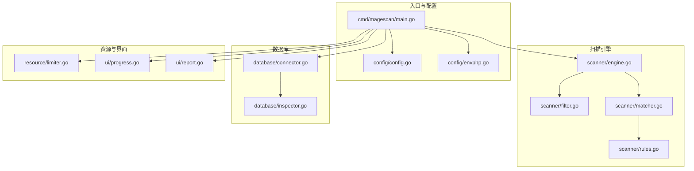
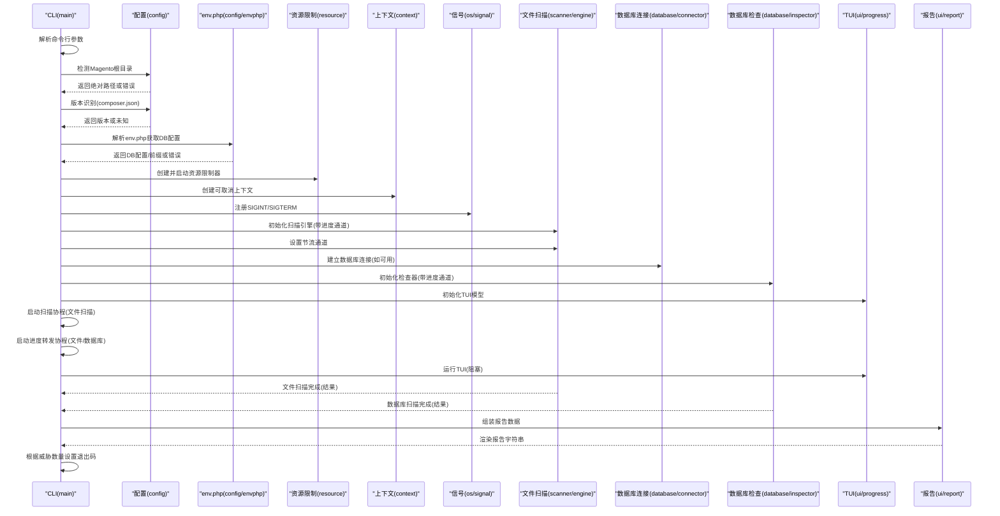
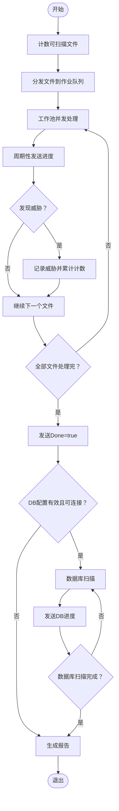
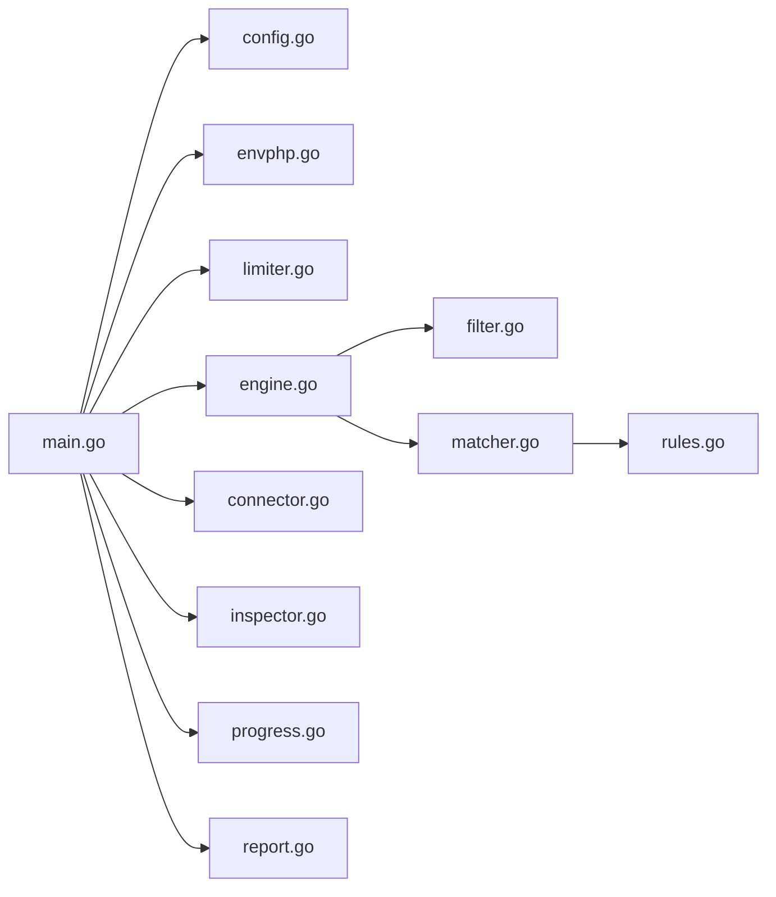

# CLI 入口点

<cite>
**本文引用的文件列表**
- [main.go](file://cmd/magescan/main.go)
- [config.go](file://config/config.go)
- [envphp.go](file://config/envphp.go)
- [engine.go](file://scanner/engine.go)
- [filter.go](file://scanner/filter.go)
- [matcher.go](file://scanner/matcher.go)
- [rules.go](file://scanner/rules.go)
- [connector.go](file://database/connector.go)
- [inspector.go](file://database/inspector.go)
- [limiter.go](file://resource/limiter.go)
- [progress.go](file://ui/progress.go)
- [report.go](file://ui/report.go)
- [go.mod](file://go.mod)
</cite>

## 目录
1. [简介](#简介)
2. [项目结构](#项目结构)
3. [核心组件](#核心组件)
4. [架构总览](#架构总览)
5. [详细组件分析](#详细组件分析)
6. [依赖分析](#依赖分析)
7. [性能考量](#性能考量)
8. [故障排查指南](#故障排查指南)
9. [结论](#结论)
10. [附录](#附录)

## 简介
本文件为 MageScan CLI 入口点组件的详细设计文档，聚焦于主程序启动流程、命令行参数解析、Magento 环境检测与版本识别、资源限制与信号处理、文件扫描与数据库扫描的协调机制、进度通道与 TUI 消息传递、错误处理与退出码策略，并通过图示与路径引用展示各组件的初始化顺序与调用关系。

## 项目结构
仓库采用按功能域分层的组织方式：
- cmd/magescan：CLI 入口点，负责参数解析、环境检测、资源限制、信号处理、扫描调度与 TUI 集成
- config：配置与环境检测（Magento 根目录、版本、env.php 解析）
- scanner：文件扫描引擎（过滤器、匹配器、规则集、工作池）
- database：数据库连接与安全检查（连接器、检查器、威胁模式）
- resource：资源限制器（CPU/内存节流）
- ui：TUI 模型与报告渲染
- go.mod：模块与依赖声明



图表来源
- [main.go:24-207](file://cmd/magescan/main.go#L24-L207)
- [config.go:49-107](file://config/config.go#L49-L107)
- [envphp.go:14-71](file://config/envphp.go#L14-L71)
- [engine.go:61-121](file://scanner/engine.go#L61-L121)
- [filter.go:57-97](file://scanner/filter.go#L57-L97)
- [matcher.go:34-82](file://scanner/matcher.go#L34-L82)
- [rules.go:50-58](file://scanner/rules.go#L50-L58)
- [connector.go:16-39](file://database/connector.go#L16-L39)
- [inspector.go:70-109](file://database/inspector.go#L70-L109)
- [limiter.go:22-57](file://resource/limiter.go#L22-L57)
- [progress.go:116-134](file://ui/progress.go#L116-L134)
- [report.go:57-168](file://ui/report.go#L57-L168)

章节来源
- [main.go:1-208](file://cmd/magescan/main.go#L1-L208)
- [go.mod:1-31](file://go.mod#L1-L31)

## 核心组件
- CLI 入口与控制流：参数解析、环境检测、版本识别、资源限制、信号处理、扫描调度、TUI 初始化与消息传递、报告生成与退出码
- 扫描引擎：文件遍历、过滤、匹配、统计与进度上报
- 数据库检查器：连接、表扫描、威胁检测与进度上报
- 资源限制器：CPU/内存监控与工作池节流
- TUI 模型：进度显示、阶段切换、结果收集与退出控制
- 报告渲染：汇总统计、排序、修复建议

章节来源
- [main.go:24-207](file://cmd/magescan/main.go#L24-L207)
- [engine.go:61-121](file://scanner/engine.go#L61-L121)
- [inspector.go:70-109](file://database/inspector.go#L70-L109)
- [limiter.go:22-57](file://resource/limiter.go#L22-L57)
- [progress.go:116-134](file://ui/progress.go#L116-L134)
- [report.go:57-168](file://ui/report.go#L57-L168)

## 架构总览
下图展示了 CLI 启动到完成的端到端流程，包括文件扫描与数据库扫描的协调、进度通道与 TUI 的交互、以及最终报告输出与退出码决策。



图表来源
- [main.go:24-207](file://cmd/magescan/main.go#L24-L207)
- [config.go:49-107](file://config/config.go#L49-L107)
- [envphp.go:14-71](file://config/envphp.go#L14-L71)
- [limiter.go:34-57](file://resource/limiter.go#L34-L57)
- [engine.go:76-121](file://scanner/engine.go#L76-L121)
- [connector.go:16-39](file://database/connector.go#L16-L39)
- [inspector.go:70-109](file://database/inspector.go#L70-L109)
- [progress.go:116-134](file://ui/progress.go#L116-L134)
- [report.go:57-168](file://ui/report.go#L57-L168)

## 详细组件分析

### CLI 启动与控制流
- 参数解析：支持 path、mode、cpu-limit、mem-limit、output；默认值与校验在入口处完成
- 环境检测：验证 Magento 根目录存在性与 bin/magento 可执行性
- 版本识别：读取 composer.json 并提取版本号，若缺失则尝试从包名推断
- env.php 解析：提取数据库主机、端口、用户名、密码、数据库名与表前缀
- 资源限制：根据 cpu-limit 与 mem-limit 初始化 Limiter，启动后台监控并在 defer 中恢复
- 信号处理：注册 SIGINT/SIGTERM，收到信号后 cancel 上下文以中断扫描
- 进度通道：创建文件扫描与数据库扫描的进度通道，容量为 64
- TUI 初始化：创建 Bubble Tea 程序，启用备用屏幕
- 扫描调度：在独立 goroutine 中运行文件扫描；完成后尝试数据库扫描（条件满足时）
- 进度转发：分别将文件与数据库进度通过通道转发至 TUI
- 报告生成：扫描完成后构建 ReportData，渲染报告并打印
- 退出码：若发现任何威胁，返回非零退出码

章节来源
- [main.go:24-207](file://cmd/magescan/main.go#L24-L207)

### 命令行参数解析与默认值
- path：Magento 根目录，默认当前目录
- mode：扫描模式，fast/full
- cpu-limit：最大 CPU 核数，0 表示不限制
- mem-limit：最大内存 MB，0 表示不限制
- output：输出格式，预留 json，当前仅 terminal

章节来源
- [main.go:25-31](file://cmd/magescan/main.go#L25-L31)

### Magento 环境检测与版本识别
- 根目录检测：要求存在 app/etc/env.php 与 bin/magento
- 版本识别：读取 composer.json，解析 version 或 name 字段
- env.php 解析：使用正则提取 host/dbname/username/password/table_prefix，支持 host:port 格式

章节来源
- [config.go:49-107](file://config/config.go#L49-L107)
- [envphp.go:14-71](file://config/envphp.go#L14-L71)

### 资源限制与信号处理
- Limiter：启动时设置 GOMAXPROCS，后台定时检查内存使用；超过阈值时通过节流通道阻塞工作池，触发 GC 并短暂休眠；低于阈值 80% 时解除节流
- 信号处理：监听 SIGINT/SIGTERM，收到后 cancel 上下文，使扫描提前结束

章节来源
- [limiter.go:34-117](file://resource/limiter.go#L34-L117)
- [main.go:67-76](file://cmd/magescan/main.go#L67-L76)

### 扫描流程编排（文件扫描与数据库扫描）
- 文件扫描：
  - 计数阶段：遍历目录统计可扫描文件数
  - 分发阶段：将文件路径发送至作业队列
  - 工作池：多协程并发处理，支持节流通道暂停
  - 进度上报：周期性发送 ScanProgress，结束时发送 Done=true
- 数据库扫描：
  - 按顺序扫描 core_config_data、cms_block、cms_page、sales_order_status_history
  - 对每个表进行查询与正则匹配，记录威胁并上报 DBProgress
  - 若表不存在，记录进度并跳过
- 协调机制：文件扫描完成后，TUI 切换到数据库扫描阶段；扫描完成后发送 ScanCompleteMsg，TUI 结束



图表来源
- [engine.go:76-121](file://scanner/engine.go#L76-L121)
- [inspector.go:79-109](file://database/inspector.go#L79-L109)

章节来源
- [engine.go:76-121](file://scanner/engine.go#L76-L121)
- [inspector.go:79-109](file://database/inspector.go#L79-L109)

### 进度通道与 TUI 消息传递
- 文件进度通道：engine 发送 ScanProgress，包含当前文件、已扫描/总数文件、威胁数、完成标志
- 数据库进度通道：inspector 发送 DBProgress，包含阶段、记录数、威胁数、完成标志
- TUI 模型：
  - 接收 FileProgressMsg/DBProgressMsg/ScanCompleteMsg
  - 切换阶段：文件扫描 -> 数据库扫描 -> 完成
  - 渲染进度条、当前文件、威胁数、耗时等
- 通道转发：两个独立 goroutine 将 engine 与 inspector 的进度转发给 TUI

章节来源
- [progress.go:14-31](file://ui/progress.go#L14-L31)
- [progress.go:161-183](file://ui/progress.go#L161-L183)
- [main.go:78-151](file://cmd/magescan/main.go#L78-L151)

### 错误处理策略与退出码
- 环境检测失败：直接打印错误并退出码 1
- 版本识别失败：降级为“未知”继续执行
- env.php 解析失败：打印警告并跳过数据库扫描
- 数据库连接失败：打印警告并跳过数据库扫描
- TUI 运行错误：打印错误并退出码 1
- 扫描完成：若存在任何威胁（文件或数据库），退出码 1；否则 0

章节来源
- [main.go:37-46](file://cmd/magescan/main.go#L37-L46)
- [main.go:117-122](file://cmd/magescan/main.go#L117-L122)
- [main.go:154-157](file://cmd/magescan/main.go#L154-L157)
- [main.go:203-207](file://cmd/magescan/main.go#L203-L207)

### 组件类图（代码级）
```mermaid
classDiagram
class Model {
+Init() Cmd
+Update(msg) (Model, Cmd)
+View() string
-fileProgress progress.Model
-spinner spinner.Model
-phase string
-currentFile string
-scannedFiles int64
-totalFiles int64
-fileThreats int64
-dbPhase string
-dbRecords int64
-dbThreats int64
-startTime time.Time
-width int
-height int
-quitting bool
-done bool
}
class Engine {
+NewEngine(rootPath, mode, progressCh) Engine
+SetThrottleChannel(ch)
+Scan(ctx) ([]Finding, error)
+GetStats() ScanStats
-countFiles(ctx) (int64, error)
-walkFiles(ctx, jobs) error
-worker(ctx, jobs)
-scanFile(path)
-scanLargeFile(f, path, size)
-processMatches(path, content)
}
class Inspector {
+NewInspector(conn, progressCh) *Inspector
+Scan(ctx) ([]DBFinding, error)
+GetFindings() []DBFinding
-scanCoreConfigData(ctx) error
-scanCMSBlocks(ctx) error
-scanCMSPages(ctx) error
-scanOrderStatusHistory(ctx) error
-sendProgress(phase, scanned, threats, done)
}
class Limiter {
+Start()
+Stop()
+ThrottleChannel() chan struct{}
+IsThrottled() bool
-monitor()
-checkMemory()
}
class Connector {
+NewConnector(host, port, username, password, dbname, tablePrefix) (*Connector, error)
+Close() error
+TableName(name) string
+Ping() error
}
Model <-- Engine : "接收进度"
Model <-- Inspector : "接收进度"
Engine --> Limiter : "使用节流通道"
Inspector --> Connector : "使用连接"
```

图表来源
- [progress.go:54-82](file://ui/progress.go#L54-L82)
- [engine.go:47-58](file://scanner/engine.go#L47-L58)
- [inspector.go:63-68](file://database/inspector.go#L63-L68)
- [limiter.go:11-20](file://resource/limiter.go#L11-L20)
- [connector.go:10-14](file://database/connector.go#L10-L14)

## 依赖分析
- 外部依赖：Bubble Tea/TUI、MySQL 驱动、颜色与终端样式
- 内部依赖：入口点依赖配置、扫描引擎、数据库检查器、资源限制器与 UI
- 关键耦合点：进度通道、上下文取消、TUI 模型状态机



图表来源
- [main.go:15-19](file://cmd/magescan/main.go#L15-L19)
- [engine.go:61-68](file://scanner/engine.go#L61-L68)
- [matcher.go:34-42](file://scanner/matcher.go#L34-L42)
- [rules.go:50-58](file://scanner/rules.go#L50-L58)

章节来源
- [go.mod:5-10](file://go.mod#L5-L10)
- [main.go:15-19](file://cmd/magescan/main.go#L15-L19)

## 性能考量
- 工作池规模：文件扫描引擎的工作协程数为 CPU 核数的两倍，平衡吞吐与资源占用
- 大文件扫描：采用 1MB 分块与重叠避免跨块漏检，减少内存峰值
- 正则匹配：预编译规则，按需匹配，避免重复编译开销
- 节流机制：基于内存阈值的动态节流，结合 hysteresis 防抖，降低频繁 GC 影响
- I/O 优化：只读打开文件，小文件整读，大文件分块读取

章节来源
- [engine.go:61-68](file://scanner/engine.go#L61-L68)
- [engine.go:261-285](file://scanner/engine.go#L261-L285)
- [matcher.go:44-61](file://scanner/matcher.go#L44-L61)
- [limiter.go:78-117](file://resource/limiter.go#L78-L117)

## 故障排查指南
- 无法识别 Magento 根目录：确认 app/etc/env.php 与 bin/magento 存在
- 版本识别失败：检查 composer.json 是否存在且可读
- env.php 解析失败：检查数据库配置键是否存在且格式正确
- 数据库连接失败：核对主机、端口、用户名、密码、数据库名；确认网络可达与权限
- TUI 异常：查看 stderr 输出的 TUI 错误信息
- 扫描卡住：检查是否被资源限制器节流；查看内存使用情况
- 退出码为 1：存在威胁，按报告中的修复建议处理

章节来源
- [config.go:52-71](file://config/config.go#L52-L71)
- [envphp.go:14-71](file://config/envphp.go#L14-L71)
- [connector.go:18-39](file://database/connector.go#L18-L39)
- [main.go:154-157](file://cmd/magescan/main.go#L154-L157)
- [limiter.go:78-117](file://resource/limiter.go#L78-L117)

## 结论
该 CLI 入口点通过清晰的职责分离与通道驱动的异步架构，实现了对 Magento 文件与数据库的高效安全扫描。入口点负责参数、环境、资源与信号的统一管理，扫描引擎与数据库检查器分别承担文件与数据层面的威胁检测，TUI 提供实时可视化反馈，最终以报告与退出码呈现结果。整体设计具备良好的扩展性与可维护性。

## 附录
- 初始化顺序与调用关系（摘要）：
  1) 解析参数 -> 2) 检测根目录 -> 3) 识别版本 -> 4) 解析 env.php -> 5) 创建 Limiter 并启动 -> 6) 注册信号 -> 7) 初始化引擎与设置节流 -> 8) 初始化数据库连接（可选）-> 9) 初始化 TUI -> 10) 启动扫描协程 -> 11) 启动进度转发协程 -> 12) 运行 TUI -> 13) 生成报告 -> 14) 设置退出码

章节来源
- [main.go:24-207](file://cmd/magescan/main.go#L24-L207)