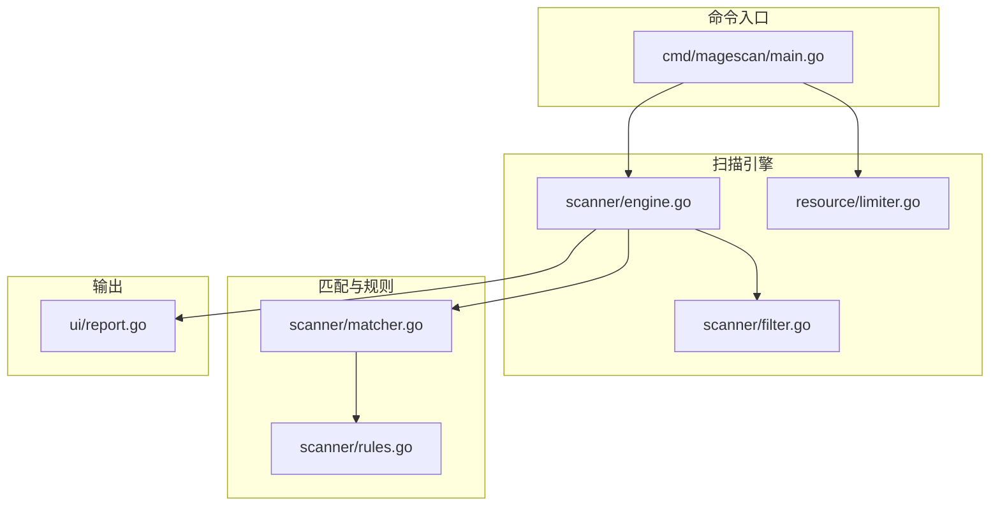
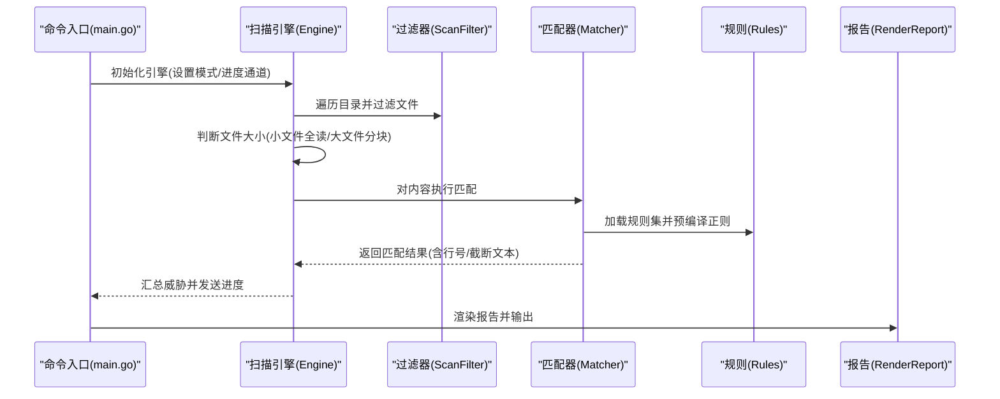
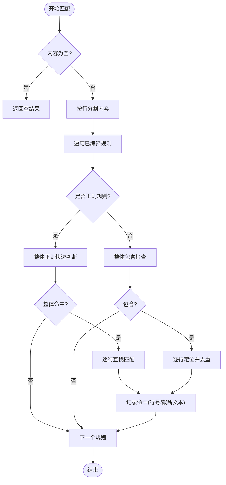
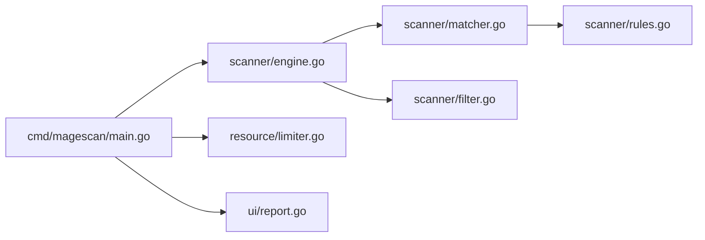

# 内容匹配器

<cite>
**本文引用的文件**
- [matcher.go](file://scanner/matcher.go)
- [rules.go](file://scanner/rules.go)
- [engine.go](file://scanner/engine.go)
- [filter.go](file://scanner/filter.go)
- [limiter.go](file://resource/limiter.go)
- [report.go](file://ui/report.go)
- [main.go](file://cmd/magescan/main.go)
- [README.md](file://README.md)
</cite>

## 目录
1. [简介](#简介)
2. [项目结构](#项目结构)
3. [核心组件](#核心组件)
4. [架构总览](#架构总览)
5. [详细组件分析](#详细组件分析)
6. [依赖关系分析](#依赖关系分析)
7. [性能考量](#性能考量)
8. [故障排查指南](#故障排查指南)
9. [结论](#结论)
10. [附录](#附录)

## 简介
本文件面向内容匹配器的算法与实现，聚焦于多模式匹配（字面量与正则）在文件扫描中的应用、正则表达式的优化策略与性能权衡、威胁检测的匹配流程与结果处理机制，并提供匹配精度优化与误报减少的技术方案。内容基于仓库中实际代码进行分析，确保可追溯性与可操作性。

## 项目结构
本项目采用分层组织：命令入口负责参数解析与进度驱动；扫描引擎负责目录遍历、并发工作池、大文件分块读取与资源限制；匹配器负责规则编译与匹配；过滤器控制扫描范围；报告模块负责输出格式化。

图表来源
- [main.go:1-208](file://cmd/magescan/main.go#L1-L208)
- [engine.go:1-323](file://scanner/engine.go#L1-L323)
- [matcher.go:1-168](file://scanner/matcher.go#L1-L168)
- [rules.go:1-468](file://scanner/rules.go#L1-L468)
- [filter.go:1-98](file://scanner/filter.go#L1-L98)
- [limiter.go:1-118](file://resource/limiter.go#L1-L118)
- [report.go:1-230](file://ui/report.go#L1-L230)

章节来源
- [README.md:239-259](file://README.md#L239-L259)
- [main.go:24-126](file://cmd/magescan/main.go#L24-L126)
- [engine.go:47-121](file://scanner/engine.go#L47-L121)

## 核心组件
- 匹配器（Matcher）
  - 负责加载规则集、预编译正则、执行字面量与正则匹配，并返回带行号与截断文本的结果。
  - 关键点：线程安全、规则按类别筛选、快速路径（先整体匹配再定位行）。
- 规则系统（Rules）
  - 定义规则结构体、严重级别、威胁分类，以及四类威胁的规则集合（WebShell/Backdoor、Payment Skimmer、Obfuscation、Magento-Specific）。
- 扫描引擎（Engine）
  - 并发工作池、目录遍历、文件大小判断、大文件重叠分块读取、统计与进度上报、结果聚合。
- 过滤器（ScanFilter）
  - 控制扫描模式（fast/full），决定跳过目录与排除扩展名。
- 资源限制器（Limiter）
  - 周期性监控内存使用，通过通道信号实现工作池节流与恢复。
- 报告（Report）
  - 将扫描结果格式化为终端报告，包含威胁计数、排序与修复建议。

章节来源
- [matcher.go:22-168](file://scanner/matcher.go#L22-L168)
- [rules.go:39-58](file://scanner/rules.go#L39-L58)
- [engine.go:47-323](file://scanner/engine.go#L47-L323)
- [filter.go:8-98](file://scanner/filter.go#L8-L98)
- [limiter.go:11-118](file://resource/limiter.go#L11-L118)
- [report.go:11-230](file://ui/report.go#L11-L230)

## 架构总览
内容匹配器位于扫描引擎与规则系统之间，承担“规则编译—内容匹配—结果聚合”的职责。扫描引擎根据过滤器与资源限制器协调工作池，将文件内容交给匹配器，最终由报告模块汇总输出。

图表来源
- [main.go:94-126](file://cmd/magescan/main.go#L94-L126)
- [engine.go:76-121](file://scanner/engine.go#L76-L121)
- [engine.go:229-285](file://scanner/engine.go#L229-L285)
- [matcher.go:34-61](file://scanner/matcher.go#L34-L61)
- [matcher.go:63-82](file://scanner/matcher.go#L63-L82)
- [report.go:57-168](file://ui/report.go#L57-L168)

## 详细组件分析

### 匹配器算法与数据结构
- 数据结构
  - CompiledRule：封装原始规则与预编译正则（若适用）。
  - MatchResult：单次命中记录，包含规则、行号、截断后的匹配文本。
  - Matcher：持有已编译规则列表，支持并发安全调用。
- 匹配流程
  - 编译阶段：初始化时加载全部规则，对正则调用编译，失败规则被跳过；字面量规则直接使用。
  - 匹配阶段：
    - 字面量匹配：先做整体包含检查，再逐行定位，避免重复行记录。
    - 正则匹配：先做整体匹配快速判断，再逐行查找，同样去重行。
  - 结果处理：将每条命中转换为Finding并累加威胁计数，同时向进度通道发送实时更新。

图表来源
- [matcher.go:63-82](file://scanner/matcher.go#L63-L82)
- [matcher.go:84-113](file://scanner/matcher.go#L84-L113)
- [matcher.go:115-143](file://scanner/matcher.go#L115-L143)

章节来源
- [matcher.go:9-27](file://scanner/matcher.go#L9-L27)
- [matcher.go:34-61](file://scanner/matcher.go#L34-L61)
- [matcher.go:63-82](file://scanner/matcher.go#L63-L82)
- [matcher.go:84-113](file://scanner/matcher.go#L84-L113)
- [matcher.go:115-143](file://scanner/matcher.go#L115-L143)

### 规则系统与威胁分类
- 规则字段：ID、分类、严重级别、描述、字面量模式、正则模式、是否正则标志。
- 分类：WebShell/Backdoor、Payment Skimmer、Obfuscation、Magento-Specific。
- 严重级别：Critical、High、Medium、Low。
- 规则来源：统一聚合函数加载四类规则集，便于后续扩展。

章节来源
- [rules.go:39-58](file://scanner/rules.go#L39-L58)
- [rules.go:66-239](file://scanner/rules.go#L66-L239)
- [rules.go:247-325](file://scanner/rules.go#L247-L325)
- [rules.go:333-396](file://scanner/rules.go#L333-L396)
- [rules.go:404-467](file://scanner/rules.go#L404-L467)

### 扫描引擎与并发控制
- 工作池：工作数量为CPU核数的两倍，提高I/O密集场景吞吐。
- 目录遍历：两阶段计数与遍历，支持上下文取消与错误跳过。
- 文件读取：
  - 小文件：一次性读取。
  - 大文件：以固定大小分块读取，块间有重叠，避免跨块边界漏检。
- 进度与统计：原子计数扫描文件数与威胁数，周期性上报。
- 结果聚合：将匹配结果转换为Finding并加锁写入全局切片。

章节来源
- [engine.go:47-121](file://scanner/engine.go#L47-L121)
- [engine.go:133-161](file://scanner/engine.go#L133-L161)
- [engine.go:163-193](file://scanner/engine.go#L163-L193)
- [engine.go:195-227](file://scanner/engine.go#L195-L227)
- [engine.go:229-285](file://scanner/engine.go#L229-L285)
- [engine.go:287-322](file://scanner/engine.go#L287-L322)

### 过滤器与扫描模式
- 模式：
  - fast：仅扫描PHP与PHTML文件，提升速度。
  - full：排除常见静态资源与日志等扩展名，扩大覆盖面。
- 目录跳过：内置多组目录白名单，支持子目录前缀匹配与顶层基名匹配。

章节来源
- [filter.go:8-98](file://scanner/filter.go#L8-L98)

### 资源限制与节流
- CPU限制：启动时设置GOMAXPROCS，停止时恢复。
- 内存监控：周期性读取运行时内存统计，超过阈值触发节流通道信号，强制GC并短暂休眠；降至阈值80%时解除节流。
- 工作池配合：工作协程在读取文件时检查节流通道，收到信号后阻塞直至恢复。

章节来源
- [limiter.go:22-57](file://resource/limiter.go#L22-L57)
- [limiter.go:64-117](file://resource/limiter.go#L64-L117)
- [engine.go:204-213](file://scanner/engine.go#L204-L213)

### 报告与结果处理
- 终端报告：统计各严重级别数量、按严重程度排序、截断显示匹配文本、输出数据库修复SQL。
- 输出格式：双线分隔符、彩色标签、清晰的标题与段落。

章节来源
- [report.go:57-168](file://ui/report.go#L57-L168)
- [report.go:186-229](file://ui/report.go#L186-L229)

## 依赖关系分析
- 匹配器依赖规则系统（加载规则、预编译正则）。
- 扫描引擎依赖匹配器、过滤器与资源限制器。
- 命令入口依赖配置、数据库、资源限制器、UI与扫描引擎。
- 报告模块依赖扫描结果数据结构。

图表来源
- [main.go:15-20](file://cmd/magescan/main.go#L15-L20)
- [engine.go:47-58](file://scanner/engine.go#L47-L58)
- [matcher.go:3-7](file://scanner/matcher.go#L3-L7)
- [rules.go:1-1](file://scanner/rules.go#L1-L1)

章节来源
- [main.go:15-20](file://cmd/magescan/main.go#L15-L20)
- [engine.go:47-58](file://scanner/engine.go#L47-L58)
- [matcher.go:3-7](file://scanner/matcher.go#L3-L7)

## 性能考量
- 规则编译与缓存
  - 在初始化阶段一次性编译所有正则，避免运行时重复编译开销。
  - 对无效正则进行跳过处理，保证稳定性。
- 快速路径优化
  - 字面量匹配先做整体包含检查，再逐行定位，减少不必要的正则计算。
  - 正则匹配先做整体匹配快速判断，避免逐行正则匹配的高成本。
- 并发与I/O
  - 工作池规模为2×CPU核，充分利用I/O并行。
  - 大文件分块读取并保留重叠，避免跨块边界漏检，同时控制内存峰值。
- 内存与CPU限制
  - 周期性监控内存，超过阈值主动节流并触发GC，降低抖动风险。
  - 可配置CPU核上限，避免过度占用宿主资源。
- 结果聚合
  - 使用原子计数与互斥锁保护共享结果，兼顾并发与一致性。

章节来源
- [matcher.go:44-61](file://scanner/matcher.go#L44-L61)
- [matcher.go:84-113](file://scanner/matcher.go#L84-L113)
- [matcher.go:115-143](file://scanner/matcher.go#L115-L143)
- [engine.go:19-17](file://scanner/engine.go#L19-L17)
- [engine.go:66-68](file://scanner/engine.go#L66-L68)
- [engine.go:261-284](file://scanner/engine.go#L261-L284)
- [limiter.go:64-117](file://resource/limiter.go#L64-L117)

## 故障排查指南
- 正则编译失败
  - 现象：规则被跳过，命中数减少。
  - 排查：确认正则语法正确，避免非法转义或不支持特性。
  - 参考位置：规则编译与跳过逻辑。
- 大文件漏检
  - 现象：跨块边界内容未命中。
  - 排查：确认分块大小与重叠设置合理，必要时增大重叠。
  - 参考位置：大文件分块读取与重叠逻辑。
- 进度卡顿
  - 现象：扫描进度长时间不变。
  - 排查：检查资源限制器是否处于节流状态；查看内存阈值与CPU核数配置。
  - 参考位置：资源限制器监控与节流通道。
- 结果重复
  - 现象：同一行多次记录。
  - 排查：确认去重逻辑（按行号去重）是否生效。
  - 参考位置：字面量与正则匹配中的行去重。

章节来源
- [matcher.go:52-57](file://scanner/matcher.go#L52-L57)
- [engine.go:261-284](file://scanner/engine.go#L261-L284)
- [limiter.go:88-116](file://resource/limiter.go#L88-L116)
- [matcher.go:95-110](file://scanner/matcher.go#L95-L110)
- [matcher.go:124-140](file://scanner/matcher.go#L124-L140)

## 结论
该内容匹配器通过“规则预编译 + 快速路径 + 行级定位 + 去重”实现了高效的多模式匹配。结合扫描引擎的并发与大文件分块策略、资源限制器的内存节流，整体在准确性与性能之间取得良好平衡。针对误报与精度问题，可通过更严格的正则边界、更细粒度的分类与严重级别、以及引入上下文启发式规则进一步优化。

## 附录

### 算法复杂度与实现要点
- 字面量匹配
  - 时间复杂度：对每条规则近似O(N)，N为内容长度；逐行定位O(L)，L为行数。
  - 优化：先整体包含检查，避免多余逐行比较。
- 正则匹配
  - 时间复杂度：整体快速判断O(N)，逐行查找O(N)；具体取决于正则复杂度。
  - 优化：预编译正则、整体快速判断、逐行定位。
- 并发与I/O
  - 工作池并发读取与匹配，I/O密集场景吞吐高；分块读取避免内存峰值。
- 去重
  - 使用行号映射避免重复记录，提升报告质量。

章节来源
- [matcher.go:84-113](file://scanner/matcher.go#L84-L113)
- [matcher.go:115-143](file://scanner/matcher.go#L115-L143)
- [engine.go:261-284](file://scanner/engine.go#L261-L284)

### 正则表达式优化策略与性能考虑
- 预编译与缓存：初始化阶段完成编译，运行时零编译开销。
- 快速路径：先做整体匹配，再逐行定位，减少正则引擎压力。
- 边界约束：尽量使用锚点与边界限定，避免贪婪回溯。
- 选择性匹配：优先使用字面量匹配的规则，仅在必要时启用正则。
- 错误容忍：对无效正则进行跳过，保证稳定性。

章节来源
- [matcher.go:44-61](file://scanner/matcher.go#L44-L61)
- [matcher.go:115-143](file://scanner/matcher.go#L115-L143)

### 匹配精度优化与误报减少技术方案
- 上下文启发式：结合文件类型、路径、关键词共现，减少误报。
- 规则优先级：对高置信度字面量规则优先匹配，降低正则误判影响。
- 严重级别分级：对低严重级别规则放宽匹配条件，提高召回率但需注意误报。
- 动态阈值：根据规则类别与上下文动态调整匹配严格度。
- 后处理去重：基于行号与匹配文本的哈希去重，避免重复报告。
- 可选的二次验证：对可疑正则命中进行二次上下文校验（如函数调用链、变量定义域）。

章节来源
- [matcher.go:95-110](file://scanner/matcher.go#L95-L110)
- [matcher.go:124-140](file://scanner/matcher.go#L124-L140)
- [rules.go:39-58](file://scanner/rules.go#L39-L58)