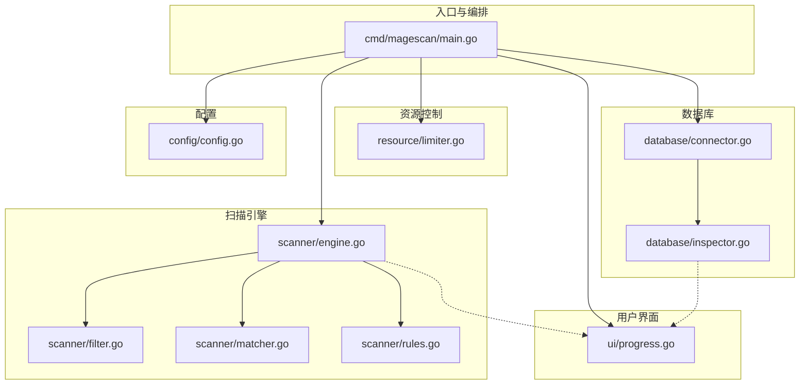
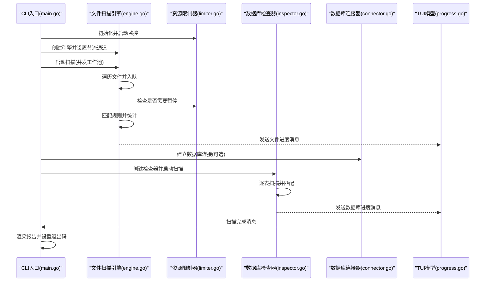
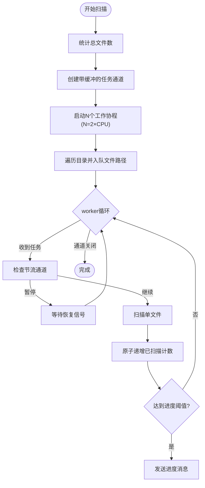
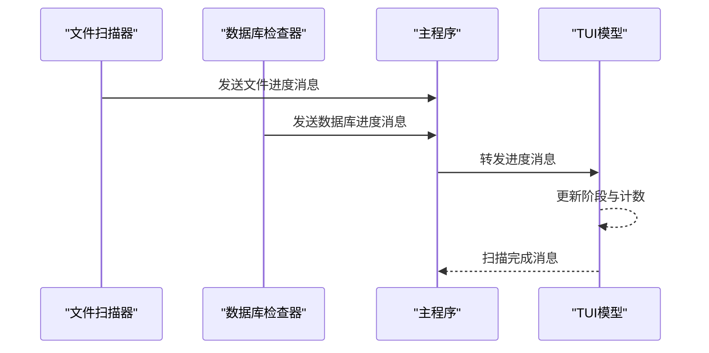
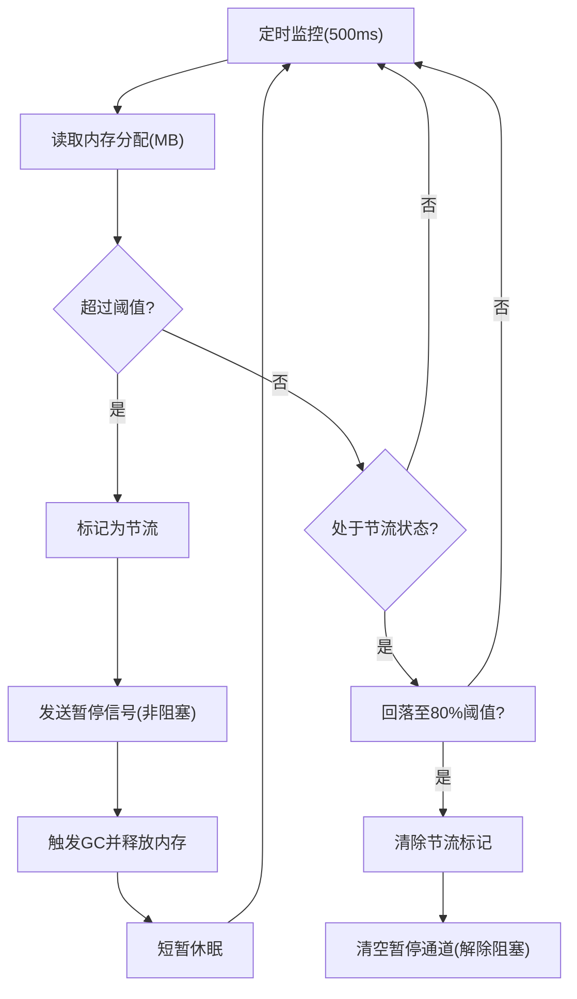
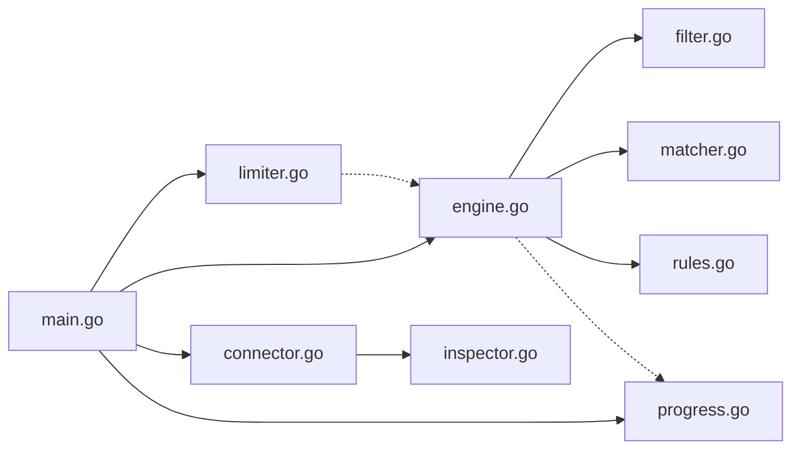

# 引擎核心架构

<cite>
**本文引用的文件列表**
- [cmd/magescan/main.go](file://cmd/magescan/main.go)
- [scanner/engine.go](file://scanner/engine.go)
- [scanner/filter.go](file://scanner/filter.go)
- [scanner/matcher.go](file://scanner/matcher.go)
- [scanner/rules.go](file://scanner/rules.go)
- [resource/limiter.go](file://resource/limiter.go)
- [ui/progress.go](file://ui/progress.go)
- [database/inspector.go](file://database/inspector.go)
- [database/connector.go](file://database/connector.go)
- [config/config.go](file://config/config.go)
</cite>

## 目录
1. [简介](#简介)
2. [项目结构](#项目结构)
3. [核心组件](#核心组件)
4. [架构总览](#架构总览)
5. [详细组件分析](#详细组件分析)
6. [依赖关系分析](#依赖关系分析)
7. [性能考量](#性能考量)
8. [故障排查指南](#故障排查指南)
9. [结论](#结论)
10. [附录](#附录)

## 简介
本文件系统性阐述引擎核心架构，重点覆盖：
- 工作池模式的设计与实现：并发数量计算、任务队列管理、协程调度与节流机制
- 扫描统计系统：原子操作、线程安全与实时统计
- 进度监控机制：通道驱动的实时更新与状态同步
- 性能调优建议与资源使用最佳实践

## 项目结构
该项目采用按功能域分层的模块化组织方式，核心模块如下：
- cmd/magescan：CLI入口、参数解析、上下文与信号处理、TUI集成、扫描编排
- scanner：文件扫描引擎（工作池）、规则匹配器、过滤器、统计与进度
- database：数据库连接器、安全检查器、进度与结果
- resource：CPU/内存限制器与自动节流
- ui：TUI模型、消息传递、报告渲染
- config：Magento根目录检测、版本识别、env.php解析



图表来源
- [cmd/magescan/main.go:1-208](file://cmd/magescan/main.go#L1-L208)
- [scanner/engine.go:1-323](file://scanner/engine.go#L1-L323)
- [scanner/filter.go:1-98](file://scanner/filter.go#L1-L98)
- [scanner/matcher.go:1-168](file://scanner/matcher.go#L1-L168)
- [scanner/rules.go:1-468](file://scanner/rules.go#L1-L468)
- [resource/limiter.go:1-118](file://resource/limiter.go#L1-L118)
- [ui/progress.go:1-289](file://ui/progress.go#L1-L289)
- [database/inspector.go:1-359](file://database/inspector.go#L1-L359)
- [database/connector.go:1-58](file://database/connector.go#L1-L58)
- [config/config.go:1-108](file://config/config.go#L1-L108)

章节来源
- [cmd/magescan/main.go:24-208](file://cmd/magescan/main.go#L24-L208)
- [README.md:239-258](file://README.md#L239-L258)

## 核心组件
- 文件扫描引擎（工作池）：负责遍历文件、分发任务、并发扫描、统计与进度上报
- 资源限制器：基于CPU/内存阈值进行动态节流，保障系统稳定性
- 规则匹配器：预编译正则、线程安全匹配、分类与严重级别
- 数据库检查器：只读扫描敏感表，生成威胁与修复建议
- TUI模型：接收进度消息、渲染实时状态、支持窗口尺寸自适应与优雅退出

章节来源
- [scanner/engine.go:47-131](file://scanner/engine.go#L47-L131)
- [resource/limiter.go:11-62](file://resource/limiter.go#L11-L62)
- [scanner/matcher.go:22-82](file://scanner/matcher.go#L22-L82)
- [database/inspector.go:63-114](file://database/inspector.go#L63-L114)
- [ui/progress.go:54-134](file://ui/progress.go#L54-L134)

## 架构总览
整体流程：
- CLI入口解析参数、检测Magento环境、初始化资源限制器与TUI
- 启动文件扫描引擎：先计数、再并发扫描；通过通道向TUI发送进度
- 尝试连接数据库（可选），启动数据库检查器并发扫描各表，同样通过通道推送进度
- TUI模型接收两类进度消息，切换阶段并更新显示
- 扫描完成后汇总结果并渲染报告，根据威胁数量设置退出码



图表来源
- [cmd/magescan/main.go:62-157](file://cmd/magescan/main.go#L62-L157)
- [scanner/engine.go:76-121](file://scanner/engine.go#L76-L121)
- [resource/limiter.go:34-52](file://resource/limiter.go#L34-L52)
- [database/inspector.go:79-109](file://database/inspector.go#L79-L109)
- [database/connector.go:16-39](file://database/connector.go#L16-L39)
- [ui/progress.go:140-197](file://ui/progress.go#L140-L197)

## 详细组件分析

### 工作池模式设计与实现
- 并发数量计算
  - 工作池大小为 CPU 数量的两倍，兼顾I/O与CPU负载平衡
  - 通过固定倍数避免过度并发导致资源争用
- 任务队列管理
  - 使用带缓冲的任务通道，缓冲大小为工作池数量的四倍，降低阻塞概率
  - 遍历时将文件路径推送到通道，扫描完成后关闭通道以通知消费者退出
- 协程调度与节流
  - 每个worker从通道拉取任务，遇到上下文取消时立即返回
  - 支持外部节流通道：当资源限制器发出暂停信号时，worker阻塞等待恢复信号
  - 进度上报采用原子计数与条件触发，减少锁竞争
- 统计与线程安全
  - 使用原子整型记录总数、已扫描数、威胁数，避免频繁加锁
  - 对共享结果集使用互斥锁保护追加写入，保证一致性



图表来源
- [scanner/engine.go:60-121](file://scanner/engine.go#L60-L121)
- [scanner/engine.go:195-227](file://scanner/engine.go#L195-L227)

章节来源
- [scanner/engine.go:60-121](file://scanner/engine.go#L60-L121)
- [scanner/engine.go:195-227](file://scanner/engine.go#L195-L227)

### 扫描统计系统与线程安全
- 原子操作
  - 总文件数、已扫描数、威胁数均使用原子整型，避免锁开销
  - 读取统计时使用原子加载，确保一致性
- 互斥保护
  - 结果数组追加以互斥锁保护，避免并发写入冲突
- 实时统计
  - 每扫描若干文件或发现威胁即发送进度消息，保证UI实时反馈
- 状态同步
  - 通过通道在扫描器与TUI之间传递状态，避免共享内存竞争

```mermaid
classDiagram
class Engine {
+rootPath string
+filter *ScanFilter
+matcher *Matcher
+workerCount int
+findings []Finding
+stats ScanStats
+mu Mutex
+progressCh chan ScanProgress
+throttleCh chan struct{}
+Scan(ctx) ([]Finding, error)
+GetStats() ScanStats
}
class ScanStats {
+TotalFiles int64
+ScannedFiles int64
+ThreatsFound int64
+CurrentFile string
}
Engine --> ScanStats : "原子计数"
Engine --> Finding : "互斥追加"
```

图表来源
- [scanner/engine.go:47-58](file://scanner/engine.go#L47-L58)
- [scanner/engine.go:30-45](file://scanner/engine.go#L30-L45)

章节来源
- [scanner/engine.go:30-45](file://scanner/engine.go#L30-L45)
- [scanner/engine.go:123-131](file://scanner/engine.go#L123-L131)
- [scanner/engine.go:307-312](file://scanner/engine.go#L307-L312)

### 进度监控机制
- 消息类型
  - 文件进度消息：当前文件、已扫描数、总数、威胁数、完成标志
  - 数据库进度消息：阶段名称、记录扫描数、威胁数、完成标志
  - 扫描完成消息：用于触发TUI退出
- TUI模型
  - 维护阶段、当前文件、扫描计数、威胁数、开始时间等状态
  - 根据消息更新UI，支持窗口尺寸变化与优雅退出
- 通道驱动
  - 文件扫描器与数据库检查器分别通过独立通道向TUI推送进度
  - 主程序在后台goroutine中转发通道消息到TUI，避免阻塞扫描主流程



图表来源
- [cmd/magescan/main.go:78-151](file://cmd/magescan/main.go#L78-L151)
- [ui/progress.go:140-197](file://ui/progress.go#L140-L197)

章节来源
- [cmd/magescan/main.go:78-151](file://cmd/magescan/main.go#L78-L151)
- [ui/progress.go:14-31](file://ui/progress.go#L14-L31)
- [ui/progress.go:140-197](file://ui/progress.go#L140-L197)

### 资源限制与自动节流
- 监控策略
  - 后台定时器每500ms读取内存分配统计
  - 当分配超过设定阈值时进入“节流”状态，向工作池发送暂停信号
  - 内存回落至阈值的80%时解除节流，恢复工作
- 动态调整
  - 可配置CPU核心数上限，运行时通过GOMAXPROCS调整并发
  - 释放内存后触发GC并短暂休眠，给GC回收时间
- 通道语义
  - 节流通道为带缓冲的单元素通道，非阻塞发送暂停信号，阻塞等待恢复



图表来源
- [resource/limiter.go:64-117](file://resource/limiter.go#L64-L117)

章节来源
- [resource/limiter.go:11-62](file://resource/limiter.go#L11-L62)
- [resource/limiter.go:64-117](file://resource/limiter.go#L64-L117)

### 规则匹配器与扫描逻辑
- 规则体系
  - 四大类别：WebShell/Backdoor、Payment Skimmer、Obfuscation、Magento-Specific
  - 每条规则包含ID、类别、严重级别、描述、字面量或正则表达式
- 匹配器
  - 预编译所有正则，使用一次性初始化避免重复开销
  - 字面量匹配使用快速包含检查，再定位行号
  - 正则匹配逐行扫描，避免全量正则导致的性能问题
- 大文件扫描
  - 超过阈值的文件采用重叠块读取，避免一次性加载造成内存峰值

章节来源
- [scanner/rules.go:39-58](file://scanner/rules.go#L39-L58)
- [scanner/matcher.go:22-82](file://scanner/matcher.go#L22-L82)
- [scanner/matcher.go:84-143](file://scanner/matcher.go#L84-L143)
- [scanner/engine.go:248-285](file://scanner/engine.go#L248-L285)

### 数据库检查器
- 表扫描顺序：core_config_data → cms_block → cms_page → sales_order_status_history
- 模式匹配：针对常见注入与可疑内容的正则集合
- 错误处理：忽略不存在的表，继续下一个阶段
- 进度上报：每个阶段结束发送扫描记录数与威胁数

章节来源
- [database/inspector.go:79-109](file://database/inspector.go#L79-L109)
- [database/inspector.go:116-177](file://database/inspector.go#L116-L177)
- [database/inspector.go:179-281](file://database/inspector.go#L179-L281)
- [database/inspector.go:283-330](file://database/inspector.go#L283-L330)

## 依赖关系分析
- 模块内聚与耦合
  - 扫描引擎内部高度内聚：过滤器、匹配器、统计、进度统一由引擎管理
  - 资源限制器与扫描引擎松耦合：通过通道解耦，便于替换与扩展
  - 数据库检查器与连接器分离，职责清晰
- 外部依赖
  - TUI框架（Bubble Tea）用于交互式界面
  - MySQL驱动用于数据库连接
  - Go标准库用于并发、原子操作、文件系统与正则



图表来源
- [scanner/engine.go:1-11](file://scanner/engine.go#L1-L11)
- [resource/limiter.go:1-9](file://resource/limiter.go#L1-L9)
- [database/connector.go:1-8](file://database/connector.go#L1-L8)
- [cmd/magescan/main.go:3-20](file://cmd/magescan/main.go#L3-L20)

章节来源
- [cmd/magescan/main.go:3-20](file://cmd/magescan/main.go#L3-L20)
- [scanner/engine.go:1-11](file://scanner/engine.go#L1-L11)
- [resource/limiter.go:1-9](file://resource/limiter.go#L1-L9)
- [database/connector.go:1-8](file://database/connector.go#L1-L8)

## 性能考量
- 并发规模
  - 工作池大小为CPU核数的两倍，适合I/O密集场景；如磁盘I/O受限，可适当降低
  - 若网络I/O成为瓶颈，可考虑增加缓冲或调整任务粒度
- 任务队列
  - 缓冲大小为工作池的四倍，建议根据目标系统I/O能力与内存预算调优
  - 过小会导致生产者阻塞，过大可能增加内存占用
- 大文件扫描
  - 重叠块读取避免内存峰值，但会增加系统调用次数；可根据文件分布调整块大小
- 正则匹配
  - 预编译正则提升性能；字面量匹配作为快速路径，减少正则开销
- 资源限制
  - 内存阈值过高可能导致OOM，过低导致频繁节流；建议结合实际内存与文件大小分布测试
  - CPU限制应留有余量，避免系统抖动
- 进度上报
  - 进度阈值影响UI刷新频率与统计开销；可根据终端吞吐量调整

## 故障排查指南
- 扫描卡住或缓慢
  - 检查是否存在大量超大文件，必要时提高内存阈值或降低并发
  - 查看磁盘I/O是否饱和，适当增大任务队列缓冲
- 内存持续上涨
  - 调整内存阈值，启用节流；确认是否存在异常大文件未被正确分块
- 数据库连接失败
  - 校验env.php解析结果与连接参数；确认数据库可达且权限足够
- TUI显示异常
  - 检查窗口尺寸变化事件处理；确认通道未被意外阻塞
- 上下文取消无效
  - 确认信号处理与上下文传播链路完整

章节来源
- [cmd/magescan/main.go:67-76](file://cmd/magescan/main.go#L67-L76)
- [resource/limiter.go:78-117](file://resource/limiter.go#L78-L117)
- [database/connector.go:16-39](file://database/connector.go#L16-L39)
- [ui/progress.go:140-197](file://ui/progress.go#L140-L197)

## 结论
该引擎以工作池为核心，结合资源限制与自动节流，在保证高性能的同时确保系统稳定性。扫描统计采用原子操作与最小化锁策略，进度监控通过通道实现解耦与实时更新。规则匹配器与大文件分块读取进一步提升了扫描效率与可靠性。建议在生产环境中根据目标系统特性调整并发与阈值，并定期评估规则集以保持检测效果。

## 附录
- 关键配置项
  - 并发：默认2×CPU核数
  - 任务队列缓冲：工作池数量的四倍
  - 进度上报阈值：每扫描N个文件触发一次
  - 内存监控周期：500ms
  - 节流回退阈值：内存阈值的80%
- 最佳实践
  - 在资源受限环境下优先启用CPU/内存限制
  - 对超大文件较多的系统适当提高内存阈值
  - 使用“快扫”模式进行初步筛查，必要时再执行“全量”扫描
  - 定期更新规则集，关注新威胁特征