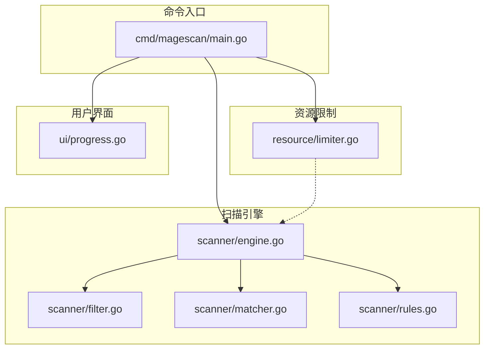
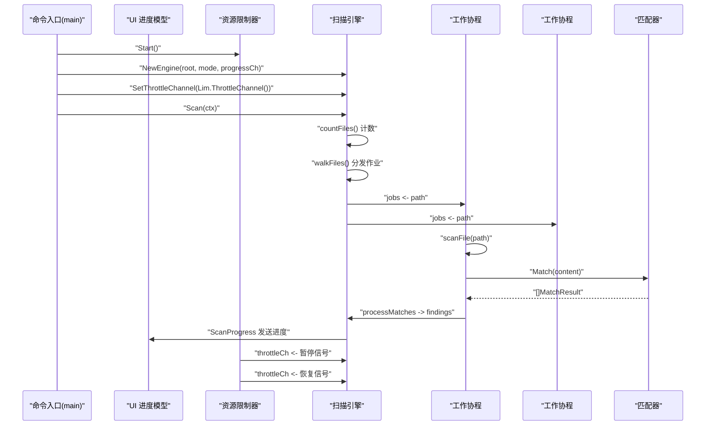
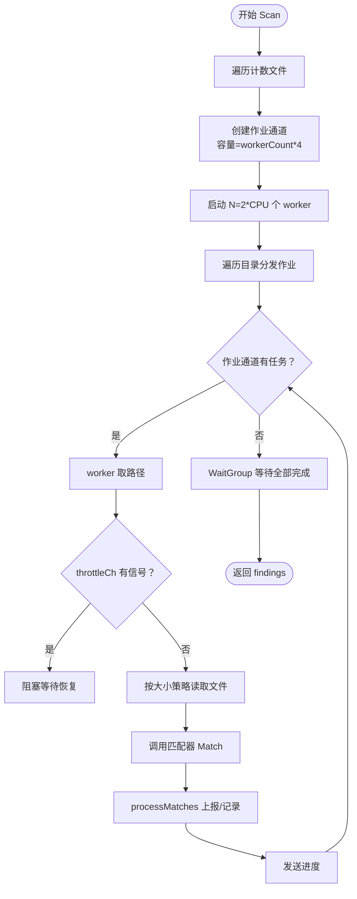
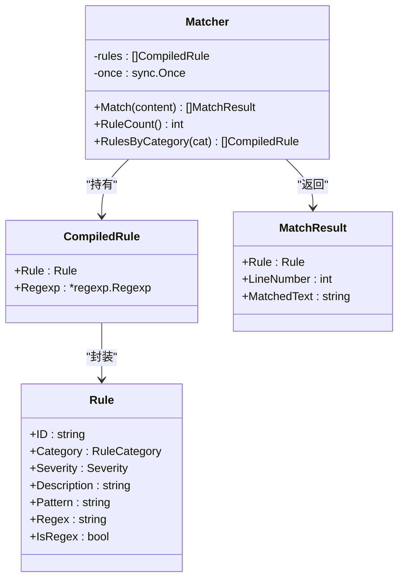
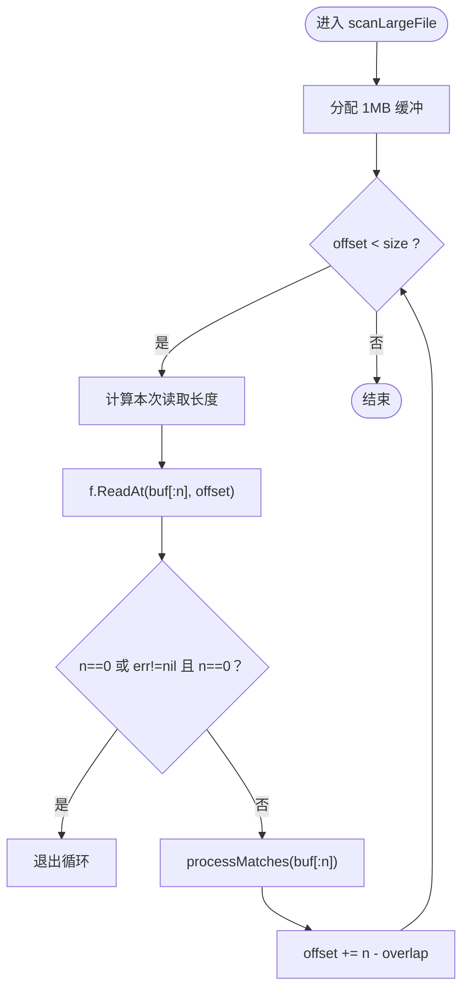
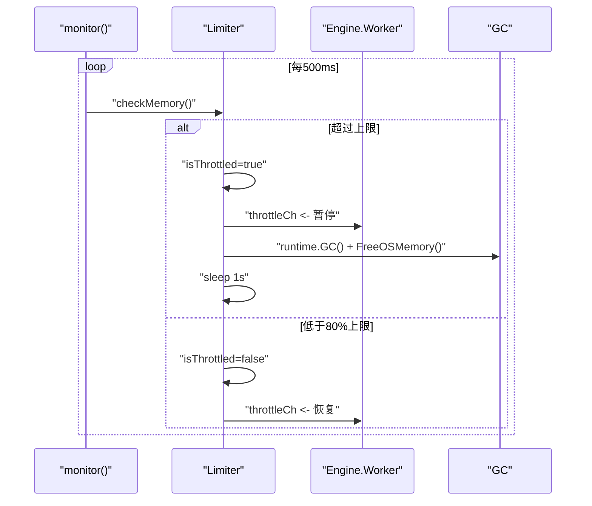
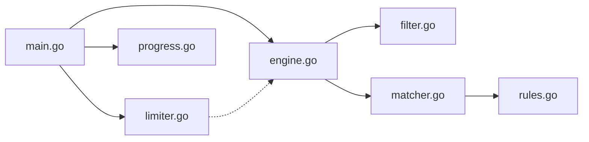

# 扫描引擎组件

<cite>
**本文引用的文件**
- [engine.go](file://scanner/engine.go)
- [filter.go](file://scanner/filter.go)
- [matcher.go](file://scanner/matcher.go)
- [rules.go](file://scanner/rules.go)
- [limiter.go](file://resource/limiter.go)
- [main.go](file://cmd/magescan/main.go)
- [progress.go](file://ui/progress.go)
- [README.md](file://README.md)
</cite>

## 目录
1. [简介](#简介)
2. [项目结构](#项目结构)
3. [核心组件](#核心组件)
4. [架构总览](#架构总览)
5. [详细组件分析](#详细组件分析)
6. [依赖关系分析](#依赖关系分析)
7. [性能考量](#性能考量)
8. [故障排查指南](#故障排查指南)
9. [结论](#结论)
10. [附录](#附录)

## 简介
本文件为扫描引擎组件的详细设计文档，聚焦以下方面：
- 工作池架构的设计理念与实现（并发控制、任务分配）
- 文件过滤器的实现逻辑（类型识别、目录跳过、大小限制）
- 匹配器的算法设计（正则优化、多模式匹配、线程安全）
- 大文件分块读取策略与内存管理
- 性能优化技巧与资源使用监控方法

该扫描引擎面向 Magento 2 安全审计，支持“快速扫描”和“完整扫描”两种模式，内置 70+ 规则签名，覆盖 Web Shell、支付窃取、混淆技术与 Magento 特定威胁四类。

章节来源
- [README.md:1-272](file://README.md#L1-L272)

## 项目结构
整体采用按功能域划分的模块化组织：命令入口、配置检测、扫描引擎、数据库检查、资源限制、UI 展示等。

图表来源
- [main.go:1-208](file://cmd/magescan/main.go#L1-L208)
- [engine.go:1-323](file://scanner/engine.go#L1-L323)
- [filter.go:1-98](file://scanner/filter.go#L1-L98)
- [matcher.go:1-168](file://scanner/matcher.go#L1-L168)
- [rules.go:1-468](file://scanner/rules.go#L1-L468)
- [limiter.go:1-118](file://resource/limiter.go#L1-L118)
- [progress.go:1-289](file://ui/progress.go#L1-L289)

章节来源
- [main.go:1-208](file://cmd/magescan/main.go#L1-L208)
- [engine.go:1-323](file://scanner/engine.go#L1-L323)
- [filter.go:1-98](file://scanner/filter.go#L1-L98)
- [matcher.go:1-168](file://scanner/matcher.go#L1-L168)
- [rules.go:1-468](file://scanner/rules.go#L1-L468)
- [limiter.go:1-118](file://resource/limiter.go#L1-L118)
- [progress.go:1-289](file://ui/progress.go#L1-L289)

## 核心组件
- 扫描引擎 Engine：负责遍历文件、分发任务、并发扫描、进度上报、统计聚合与结果收集。
- 文件过滤器 ScanFilter：根据扫描模式决定是否扫描某文件或跳过某目录。
- 匹配器 Matcher：预编译规则，对内容进行字面量与正则匹配，返回命中结果。
- 资源限制器 Limiter：周期性监控内存，必要时通过通道信号暂停/恢复工作协程。
- UI 进度模型：接收扫描进度消息，渲染实时状态。

章节来源
- [engine.go:47-131](file://scanner/engine.go#L47-L131)
- [filter.go:8-98](file://scanner/filter.go#L8-L98)
- [matcher.go:22-82](file://scanner/matcher.go#L22-L82)
- [limiter.go:11-62](file://resource/limiter.go#L11-L62)
- [progress.go:54-82](file://ui/progress.go#L54-L82)

## 架构总览
扫描流程概览如下：主程序初始化资源限制器与 UI，创建扫描引擎，启动后台扫描 goroutine；引擎先计数文件，再并发遍历并分发任务；每个 worker 从作业队列取路径，按大小策略读取文件，调用匹配器执行规则匹配，记录威胁并上报进度；资源限制器在后台周期检查内存，超过阈值时向工作池发送暂停信号，低于阈值 80% 恢复。

图表来源
- [main.go:94-126](file://cmd/magescan/main.go#L94-L126)
- [engine.go:77-121](file://scanner/engine.go#L77-L121)
- [engine.go:196-227](file://scanner/engine.go#L196-L227)
- [engine.go:229-285](file://scanner/engine.go#L229-L285)
- [matcher.go:65-82](file://scanner/matcher.go#L65-L82)
- [limiter.go:64-117](file://resource/limiter.go#L64-L117)

## 详细组件分析

### 工作池架构与并发控制
- 并发规模：工作协程数量为 CPU 核心数的两倍，兼顾吞吐与系统负载。
- 任务队列：使用带缓冲的作业通道，缓冲大小为 workerCount 的 4 倍，降低调度抖动。
- 任务分发：两次遍历：先计数，再遍历目录并将文件路径推入作业通道；遍历过程中遇到目录按过滤器决定是否跳过。
- 工作协程：每个 worker 循环从作业通道取路径，支持上下文取消；可选地检查节流通道以响应资源限制。
- 进度上报：每扫描固定数量文件或发现威胁即发送进度消息；扫描结束发送完成标记。
- 统计与结果：原子计数扫描文件数与威胁数；最终复制结果切片，避免并发写竞争。

图表来源
- [engine.go:77-121](file://scanner/engine.go#L77-L121)
- [engine.go:163-193](file://scanner/engine.go#L163-L193)
- [engine.go:196-227](file://scanner/engine.go#L196-L227)
- [engine.go:229-285](file://scanner/engine.go#L229-L285)

章节来源
- [engine.go:61-74](file://scanner/engine.go#L61-L74)
- [engine.go:77-121](file://scanner/engine.go#L77-L121)
- [engine.go:163-193](file://scanner/engine.go#L163-L193)
- [engine.go:196-227](file://scanner/engine.go#L196-L227)
- [engine.go:229-285](file://scanner/engine.go#L229-L285)

### 文件过滤器实现逻辑
- 目录跳过：内置一组需跳过的目录映射，支持精确匹配与前缀匹配；同时检查顶层基名（如 .git、node_modules、generated）。
- 文件类型：快速模式仅扫描 PHP/PHTML；完整模式排除常见静态/日志/压缩/媒体等扩展。
- 过滤器接口：提供 ShouldSkipDir 与 ShouldScanFile 两个判定函数，供遍历阶段使用。

```mermaid
flowchart TD
A["输入 relPath 或 fileName"] --> B{"是否为目录？"}
B --> |是| C["规范化斜杠"]
C --> D{"是否在 skipDirs 中？"}
D --> |是| Skip["跳过目录"]
D --> |否| E{"是否为子目录或顶层基名匹配？"}
E --> |是| Skip
E --> |否| Next["继续遍历"]
B --> |否| Mode{"扫描模式"}
Mode --> |fast| F{"扩展名是否 .php/.phtml？"}
F --> |是| Scan["加入扫描队列"]
F --> |否| SkipFile["跳过文件"]
Mode --> |full| G{"是否在排除扩展表中？"}
G --> |是| SkipFile
G --> |否| Scan
```

图表来源
- [filter.go:62-85](file://scanner/filter.go#L62-L85)
- [filter.go:87-97](file://scanner/filter.go#L87-L97)

章节来源
- [filter.go:8-98](file://scanner/filter.go#L8-L98)

### 匹配器算法设计
- 预编译规则：在单例初始化时一次性编译所有规则，避免运行时重复开销；无效正则被跳过而非中断。
- 多模式匹配：
  - 字面量匹配：先做快速包含检查，再逐行定位，去重行号，截断匹配文本长度。
  - 正则匹配：先做整段匹配快速判断，再逐行查找，同样去重行号并截断文本。
- 线程安全：匹配器内部维护只读规则集，Match 方法并发安全；规则按类别筛选与统计查询也提供只读访问。
- 结果结构：返回包含规则信息、行号与截断后的匹配文本，便于 UI 展示与报告生成。

图表来源
- [matcher.go:22-82](file://scanner/matcher.go#L22-L82)
- [matcher.go:84-143](file://scanner/matcher.go#L84-L143)
- [rules.go:39-48](file://scanner/rules.go#L39-L48)

章节来源
- [matcher.go:22-82](file://scanner/matcher.go#L22-L82)
- [matcher.go:84-143](file://scanner/matcher.go#L84-L143)
- [rules.go:39-48](file://scanner/rules.go#L39-L48)

### 大文件分块读取策略与内存管理
- 尺寸阈值：大于 1MB 的文件视为大文件，采用分块读取。
- 分块参数：每块大小为 1MB，块间重叠 100 字节，避免跨块误判。
- 读取循环：使用 ReadAt 从偏移位置读取，若读到不足块大小则提前结束；偏移前进为“块大小减去重叠”。
- 内存占用：单次仅分配 1MB 缓冲，避免一次性加载超大文件导致内存峰值过高。
- 与匹配器协作：每块内容直接交给匹配器处理，保持一致的匹配行为。

图表来源
- [engine.go:261-285](file://scanner/engine.go#L261-L285)

章节来源
- [engine.go:13-17](file://scanner/engine.go#L13-L17)
- [engine.go:261-285](file://scanner/engine.go#L261-L285)

### 资源限制与自动节流
- 监控周期：后台定时器每 500ms 读取一次内存指标。
- 阈值策略：超过设定上限时置位“节流中”，通过通道发送暂停信号；降至上限 80% 时解除节流并清空通道。
- 触发动作：触发时强制 GC 并释放未使用内存，短暂休眠以缓解压力。
- 协程配合：工作协程在处理文件前检查节流通道，收到暂停信号后阻塞直到恢复信号。

图表来源
- [limiter.go:64-117](file://resource/limiter.go#L64-L117)
- [engine.go:204-213](file://scanner/engine.go#L204-L213)

章节来源
- [limiter.go:11-62](file://resource/limiter.go#L11-L62)
- [limiter.go:64-117](file://resource/limiter.go#L64-L117)
- [engine.go:204-213](file://scanner/engine.go#L204-L213)

## 依赖关系分析
- 扫描引擎依赖文件过滤器与匹配器；匹配器依赖规则集合；资源限制器通过通道与引擎协作；主程序负责初始化、上下文取消、进度转发与 UI 渲染。
- 组件内聚高、耦合低，职责清晰：引擎专注任务分发与统计；过滤器专注选择；匹配器专注规则；限制器专注资源；UI 专注展示。

图表来源
- [main.go:94-126](file://cmd/magescan/main.go#L94-L126)
- [engine.go:48-58](file://scanner/engine.go#L48-L58)
- [matcher.go:24-42](file://scanner/matcher.go#L24-L42)
- [limiter.go:15-31](file://resource/limiter.go#L15-L31)

章节来源
- [main.go:94-126](file://cmd/magescan/main.go#L94-L126)
- [engine.go:48-58](file://scanner/engine.go#L48-L58)
- [matcher.go:24-42](file://scanner/matcher.go#L24-L42)
- [limiter.go:15-31](file://resource/limiter.go#L15-L31)

## 性能考量
- 并发度：worker 数为 CPU 核心数的两倍，适合 I/O 密集型场景；可根据磁盘与网络条件调整。
- 任务队列：缓冲大小为 worker 数的 4 倍，有助于平滑突发任务，减少调度开销。
- 规则编译：仅在首次创建匹配器时编译，后续复用，避免重复编译成本。
- 匹配策略：先做整段快速判断（字面量/正则），再逐行定位，减少不必要的正则计算。
- 大文件读取：1MB 分块 + 100 字节重叠，兼顾性能与完整性；内存峰值稳定。
- 资源限制：基于 hysteresis 的节流策略，避免频繁启停；GC 与内存回收提升稳定性。
- UI 更新：进度通道带缓冲，避免阻塞扫描主流程。

章节来源
- [engine.go:66](file://scanner/engine.go#L66)
- [engine.go:86](file://scanner/engine.go#L86)
- [matcher.go:34-42](file://scanner/matcher.go#L34-L42)
- [matcher.go:65-82](file://scanner/matcher.go#L65-L82)
- [limiter.go:64-117](file://resource/limiter.go#L64-L117)

## 故障排查指南
- 扫描卡住或缓慢
  - 检查磁盘 I/O 与网络带宽；确认未启用过小的 CPU 限制。
  - 查看 UI 进度是否停滞，确认作业通道是否积压。
- 内存飙升
  - 启用内存限制并观察节流状态；适当降低 CPU 限制或增加内存上限。
  - 确认未对超大文件启用完整模式（可能触发更多规则匹配）。
- 规则匹配异常
  - 检查规则是否有效（无效正则会被跳过）；确认规则是否按预期分类。
- 进度不更新
  - 确认进度通道已正确转发至 UI；检查 UI 是否阻塞。
- 中断扫描
  - 使用 Ctrl+C 发送取消信号；确保上下文传播到引擎与数据库检查。

章节来源
- [main.go:67-76](file://cmd/magescan/main.go#L67-L76)
- [limiter.go:88-116](file://resource/limiter.go#L88-L116)
- [matcher.go:52-58](file://scanner/matcher.go#L52-L58)
- [progress.go:140-197](file://ui/progress.go#L140-L197)

## 结论
该扫描引擎通过“工作池 + 分块读取 + 规则预编译 + 资源限制”的组合，在保证高性能的同时兼顾稳定性与可维护性。其设计充分考虑了 I/O 密集型扫描场景下的并发与内存控制，适配不同规模的 Magento 环境。建议在生产环境中结合实际硬件与业务需求，合理设置 CPU 与内存上限，并优先使用快速模式进行日常巡检。

## 附录
- 扫描模式
  - 快速模式：仅扫描 PHP/PHTML 文件，适合常规快速检查。
  - 完整模式：排除大量静态/日志/压缩等扩展，适合深度审计。
- 规则类别
  - Web Shell/Backdoor、Payment Skimmer、Obfuscation、Magento-Specific 四类，共计 70+ 规则。
- 输出与退出码
  - 找到威胁时退出码为 1，否则为 0；UI 提供终端与 JSON 报告能力预留。

章节来源
- [README.md:26-37](file://README.md#L26-L37)
- [README.md:150-200](file://README.md#L150-L200)
- [README.md:239-258](file://README.md#L239-L258)