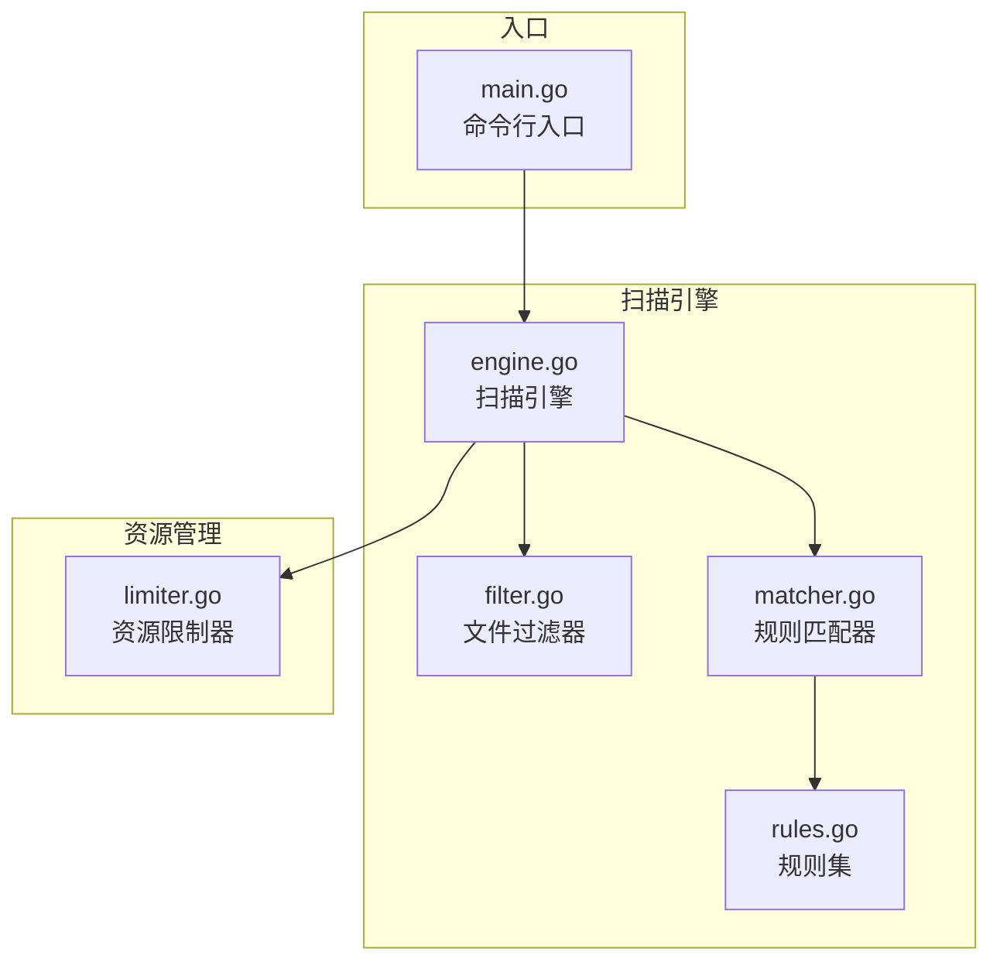
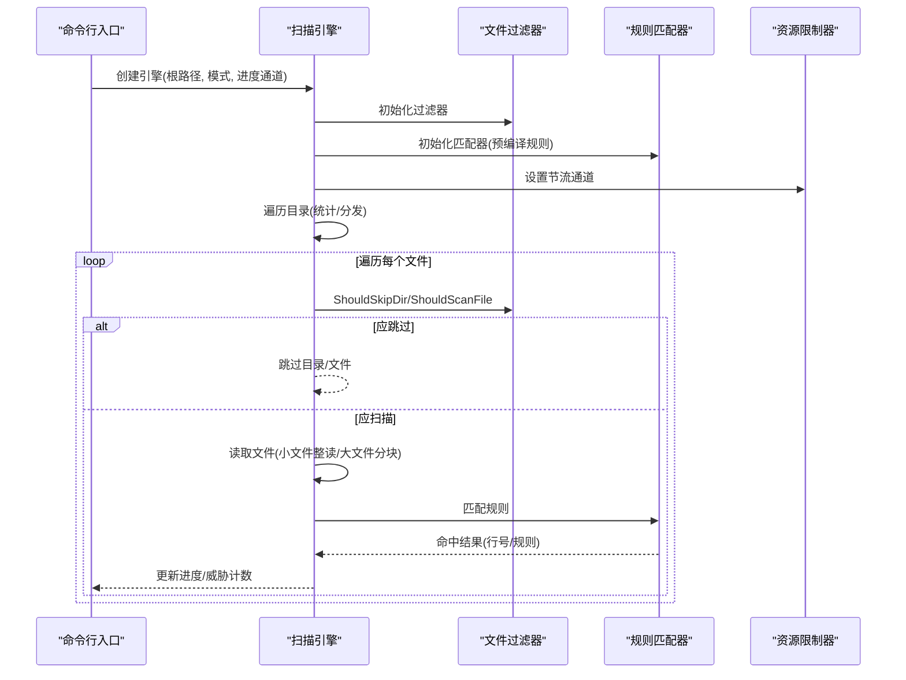
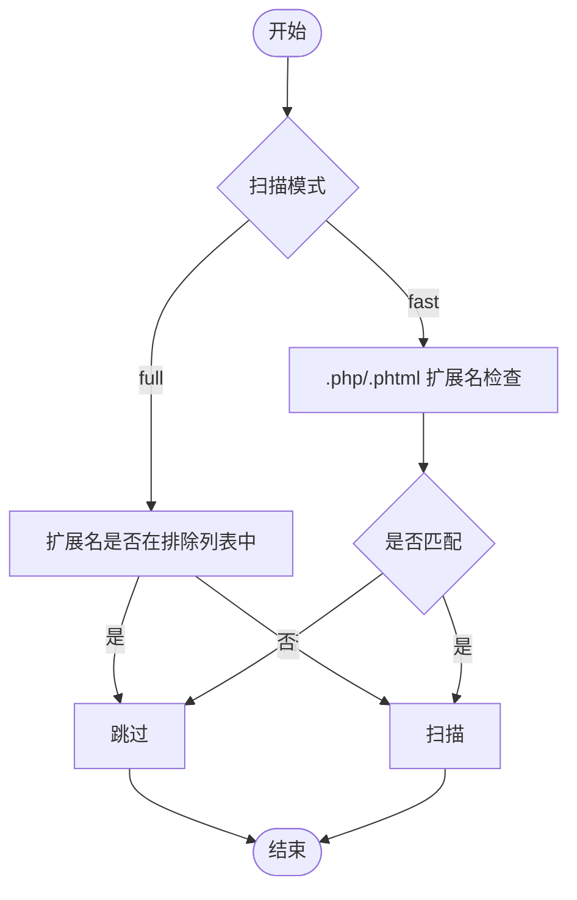
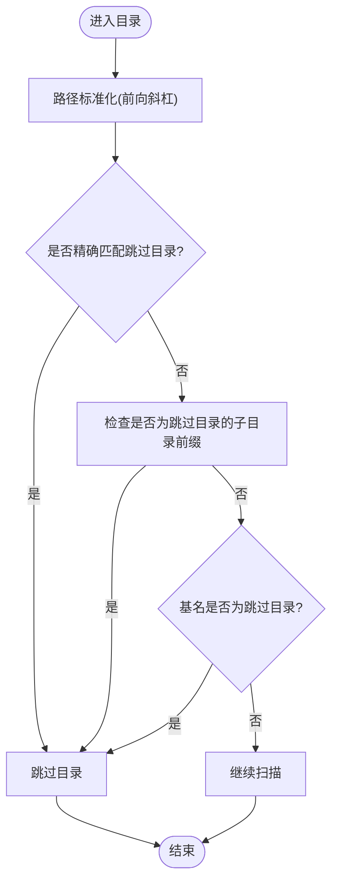
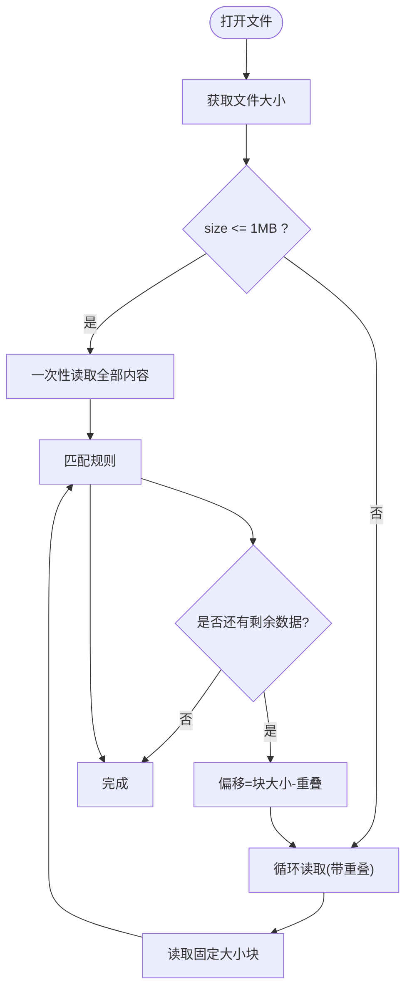
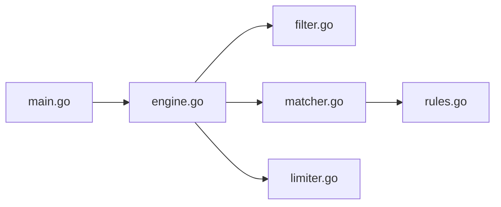

# 文件过滤器

<cite>
**本文档引用的文件**
- [scanner/filter.go](file://scanner/filter.go)
- [scanner/matcher.go](file://scanner/matcher.go)
- [scanner/rules.go](file://scanner/rules.go)
- [scanner/engine.go](file://scanner/engine.go)
- [resource/limiter.go](file://resource/limiter.go)
- [cmd/magescan/main.go](file://cmd/magescan/main.go)
- [README.md](file://README.md)
</cite>

## 目录
1. [简介](#简介)
2. [项目结构](#项目结构)
3. [核心组件](#核心组件)
4. [架构总览](#架构总览)
5. [详细组件分析](#详细组件分析)
6. [依赖分析](#依赖分析)
7. [性能考虑](#性能考虑)
8. [故障排除指南](#故障排除指南)
9. [结论](#结论)
10. [附录](#附录)

## 简介
本文件过滤器是 MageScan 扫描引擎中的关键模块，负责在扫描前决定哪些文件和目录应当被包含或排除。它支持两种扫描模式：
- 快速模式（fast）：仅扫描 PHP 和 PHTML 文件，以提升性能并减少误报。
- 全量模式（full）：扫描除特定二进制与资源文件外的大多数可疑文件类型，以覆盖更广的威胁面。

该过滤器还内置了针对 Magento 特定目录的跳过策略，确保缓存、媒体、静态资源、生成文件及版本控制目录等不会参与扫描，从而显著降低扫描时间与资源消耗。

## 项目结构
与文件过滤器相关的模块主要位于 scanner 包中，并与资源限制器、主程序入口协同工作：
- scanner/filter.go：定义文件过滤器与跳过规则
- scanner/engine.go：扫描引擎，使用过滤器进行目录与文件筛选
- scanner/matcher.go 与 scanner/rules.go：规则加载与匹配（用于后续威胁检测）
- resource/limiter.go：资源限制器，为扫描引擎提供节流通道
- cmd/magescan/main.go：命令行入口，解析参数并启动扫描流程
- README.md：功能与使用说明

图表来源
- [scanner/filter.go:1-98](file://scanner/filter.go#L1-L98)
- [scanner/engine.go:1-323](file://scanner/engine.go#L1-L323)
- [scanner/matcher.go:1-168](file://scanner/matcher.go#L1-L168)
- [scanner/rules.go:1-468](file://scanner/rules.go#L1-L468)
- [resource/limiter.go:1-118](file://resource/limiter.go#L1-L118)
- [cmd/magescan/main.go:1-208](file://cmd/magescan/main.go#L1-L208)

章节来源
- [scanner/filter.go:1-98](file://scanner/filter.go#L1-L98)
- [scanner/engine.go:1-323](file://scanner/engine.go#L1-L323)
- [resource/limiter.go:1-118](file://resource/limiter.go#L1-L118)
- [cmd/magescan/main.go:1-208](file://cmd/magescan/main.go#L1-L208)
- [README.md:1-272](file://README.md#L1-L272)

## 核心组件
- 文件过滤器（ScanFilter）
  - 模式字段：支持 fast 与 full 两种模式
  - 目录跳过表：预定义需要跳过的目录集合（如 var/cache、pub/static、generated、.git、node_modules 等）
  - 扩展名排除表（全量模式）：在 full 模式下排除常见二进制与资源文件类型
  - 方法：
    - ShouldSkipDir：判断目录是否应跳过（含前缀匹配与基名匹配）
    - ShouldScanFile：根据模式与扩展名决定是否扫描文件

- 扫描引擎（Engine）
  - 使用过滤器在两次遍历中完成统计与分发：
    - 第一次遍历统计可扫描文件数量
    - 第二次遍历遍历目录树，将满足条件的文件路径发送到工作池
  - 对于大文件采用分块读取策略，避免内存峰值过高

- 规则匹配器（Matcher）
  - 预编译规则，线程安全地对文件内容进行匹配
  - 支持字面量匹配与正则匹配，返回命中结果及行号

章节来源
- [scanner/filter.go:8-98](file://scanner/filter.go#L8-L98)
- [scanner/engine.go:47-121](file://scanner/engine.go#L47-L121)
- [scanner/matcher.go:22-82](file://scanner/matcher.go#L22-L82)
- [scanner/rules.go:39-58](file://scanner/rules.go#L39-L58)

## 架构总览
文件过滤器与扫描引擎的交互流程如下：
- 主程序解析参数并创建扫描引擎
- 引擎初始化过滤器与规则匹配器
- 引擎通过过滤器决定目录与文件是否纳入扫描
- 资源限制器通过节流通道影响扫描吞吐
- 命中规则后，引擎记录威胁并更新进度

图表来源
- [cmd/magescan/main.go:94-126](file://cmd/magescan/main.go#L94-L126)
- [scanner/engine.go:76-121](file://scanner/engine.go#L76-L121)
- [scanner/filter.go:61-97](file://scanner/filter.go#L61-L97)
- [scanner/matcher.go:63-82](file://scanner/matcher.go#L63-L82)
- [resource/limiter.go:54-62](file://resource/limiter.go#L54-L62)

## 详细组件分析

### 文件类型识别机制
- 快速模式（fast）
  - 仅扫描扩展名为 .php 或 .phtml 的文件，直接基于扩展名判断，无需额外开销
- 全量模式（full）
  - 排除常见二进制与资源文件类型（如图片、字体、日志、压缩包、视频等），其余文件均扫描
  - 该策略在保证覆盖面的同时，避免对非文本文件进行无意义的处理

图表来源
- [scanner/filter.go:87-97](file://scanner/filter.go#L87-L97)
- [scanner/filter.go:30-54](file://scanner/filter.go#L30-L54)

章节来源
- [scanner/filter.go:87-97](file://scanner/filter.go#L87-L97)
- [scanner/filter.go:30-54](file://scanner/filter.go#L30-L54)

### 目录跳过策略（Magento 特定）
- 内置跳过目录集合（精确匹配与前缀匹配）
  - 缓存与日志：var/cache、var/page_cache、var/session、var/log、var/report、var/tmp
  - 静态资源与媒体：pub/static、pub/media/catalog、pub/media/captcha
  - 生成文件与版本控制：generated、.git、node_modules、vendor/bin
- 基名匹配
  - 若目录基名为上述名称，也会被跳过，避免误判
- 实现细节
  - 目录路径统一转换为前向斜杠格式，便于跨平台一致性
  - 支持“子目录前缀”匹配，例如匹配到 var/cache 后，其所有子目录都会被跳过

图表来源
- [scanner/filter.go:61-85](file://scanner/filter.go#L61-L85)

章节来源
- [scanner/filter.go:13-28](file://scanner/filter.go#L13-L28)
- [scanner/filter.go:61-85](file://scanner/filter.go#L61-L85)

### 文件大小限制与性能优化
- 大小阈值
  - 单个文件超过 1MB 时，采用分块读取策略；小于等于 1MB 则一次性读取
- 分块读取
  - 每次读取固定大小的块（默认 1MB），并设置重叠区域（默认 100 字节），确保跨块的匹配不丢失
  - 通过偏移移动步长为（块大小 - 重叠），逐步推进
- 并发与吞吐控制
  - 工作池大小为 CPU 核数的两倍，提高扫描吞吐
  - 资源限制器监控内存分配，当超过阈值时通过节流通道暂停工作，降低内存压力
- 进度反馈
  - 定期发送扫描进度，便于用户了解扫描状态

图表来源
- [scanner/engine.go:243-285](file://scanner/engine.go#L243-L285)
- [scanner/engine.go:13-17](file://scanner/engine.go#L13-L17)

章节来源
- [scanner/engine.go:13-17](file://scanner/engine.go#L13-L17)
- [scanner/engine.go:243-285](file://scanner/engine.go#L243-L285)
- [resource/limiter.go:64-117](file://resource/limiter.go#L64-L117)

### 自定义过滤规则与扩展方法
- 扩展扫描模式
  - 当前仅支持 fast 与 full 两种模式。若需新增模式，可在过滤器中增加新的模式分支，并相应调整扩展名排除表或目录跳过策略
- 新增目录跳过规则
  - 在过滤器的跳过目录映射中添加新的键值对，即可实现新目录的自动跳过
  - 若需更复杂的匹配逻辑（如通配符或正则），可扩展 ShouldSkipDir 方法
- 新增文件类型排除
  - 在全量模式下的扩展名排除表中添加新的扩展名键，即可在 full 模式下自动跳过该类文件
- 新增文件类型识别规则
  - 在 ShouldScanFile 中增加新的扩展名判断，即可在 fast 模式下识别新的目标文件类型
- 配置选项建议
  - 可通过命令行参数或配置文件形式暴露模式选择与阈值设置，便于用户按环境需求调整
  - 与资源限制器结合，允许用户动态设置 CPU 与内存上限，实现更稳健的运行

章节来源
- [scanner/filter.go:8-11](file://scanner/filter.go#L8-L11)
- [scanner/filter.go:13-28](file://scanner/filter.go#L13-L28)
- [scanner/filter.go:30-54](file://scanner/filter.go#L30-L54)
- [scanner/filter.go:87-97](file://scanner/filter.go#L87-L97)
- [cmd/magescan/main.go:25-31](file://cmd/magescan/main.go#L25-L31)

## 依赖分析
- 组件耦合
  - 扫描引擎依赖文件过滤器与规则匹配器，二者职责清晰、耦合度低
  - 资源限制器通过通道与扫描引擎解耦，仅提供节流信号
- 外部依赖
  - 标准库：os、path/filepath、sync、runtime 等
  - 第三方 UI 框架：Bubble Tea（由主程序集成）

图表来源
- [scanner/engine.go:47-69](file://scanner/engine.go#L47-L69)
- [scanner/filter.go:8-11](file://scanner/filter.go#L8-L11)
- [scanner/matcher.go:22-42](file://scanner/matcher.go#L22-L42)
- [scanner/rules.go:50-58](file://scanner/rules.go#L50-L58)
- [resource/limiter.go:22-32](file://resource/limiter.go#L22-L32)
- [cmd/magescan/main.go:94-98](file://cmd/magescan/main.go#L94-L98)

章节来源
- [scanner/engine.go:47-69](file://scanner/engine.go#L47-L69)
- [scanner/filter.go:8-11](file://scanner/filter.go#L8-L11)
- [scanner/matcher.go:22-42](file://scanner/matcher.go#L22-L42)
- [scanner/rules.go:50-58](file://scanner/rules.go#L50-L58)
- [resource/limiter.go:22-32](file://resource/limiter.go#L22-L32)
- [cmd/magescan/main.go:94-98](file://cmd/magescan/main.go#L94-L98)

## 性能考虑
- 扫描模式选择
  - fast 模式仅扫描 PHP/PHTML，适合快速筛查与大规模部署
  - full 模式覆盖更多文件类型，但会增加 I/O 与 CPU 开销
- 目录跳过
  - 跳过缓存、静态资源、媒体与版本控制目录，显著减少扫描范围
- 文件读取策略
  - 小文件一次性读取，大文件分块读取并保留重叠，平衡内存占用与匹配完整性
- 并发与节流
  - 工作池大小为 CPU 数的两倍，充分利用多核
  - 资源限制器在内存接近阈值时暂停工作，降低 OOM 风险
- 进度与可观测性
  - 定期发送进度事件，便于用户感知扫描状态

章节来源
- [scanner/engine.go:13-17](file://scanner/engine.go#L13-L17)
- [scanner/engine.go:196-227](file://scanner/engine.go#L196-L227)
- [resource/limiter.go:64-117](file://resource/limiter.go#L64-L117)
- [README.md:251-258](file://README.md#L251-L258)

## 故障排除指南
- 扫描速度慢
  - 检查是否处于 full 模式且未正确跳过目录
  - 调整 CPU 与内存限制，避免频繁节流
- 内存占用高
  - 确认大文件分块读取是否生效（默认 1MB）
  - 提升内存上限或降低并发度
- 目标文件未被扫描
  - 检查文件扩展名是否在 fast 模式的白名单中
  - 检查文件所在目录是否被跳过（如 var/cache、pub/static 等）
- 进度卡住
  - 检查是否存在大量大文件导致分块读取耗时
  - 查看资源限制器是否触发节流

章节来源
- [scanner/filter.go:13-28](file://scanner/filter.go#L13-L28)
- [scanner/filter.go:87-97](file://scanner/filter.go#L87-L97)
- [scanner/engine.go:243-285](file://scanner/engine.go#L243-L285)
- [resource/limiter.go:88-116](file://resource/limiter.go#L88-L116)

## 结论
文件过滤器通过简洁而高效的规则设计，实现了对 Magento 环境的精准扫描。结合扫描引擎的并发与分块读取策略以及资源限制器的节流机制，能够在保证覆盖率的同时兼顾性能与稳定性。对于自定义场景，可通过扩展模式、目录跳过规则与文件类型识别规则来满足不同审计需求。

## 附录
- 常用命令示例
  - 快速扫描：./magescan -path /var/www/magento -mode fast
  - 全量扫描：./magescan -path /var/www/magento -mode full
  - 限制资源：./magescan -path /var/www/magento -cpu-limit 2 -mem-limit 256

章节来源
- [README.md:74-98](file://README.md#L74-L98)
- [cmd/magescan/main.go:25-31](file://cmd/magescan/main.go#L25-L31)