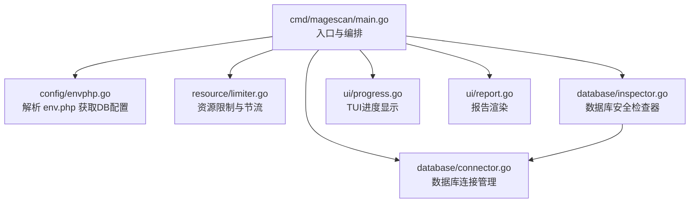
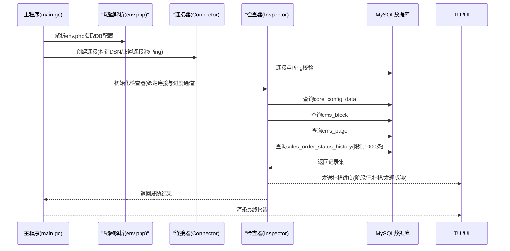
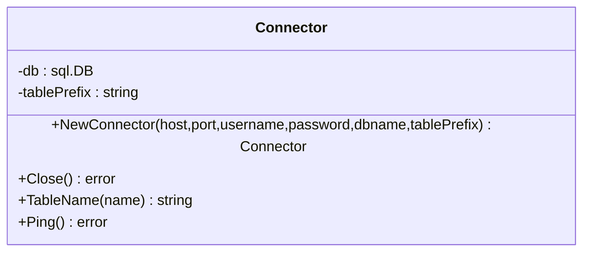
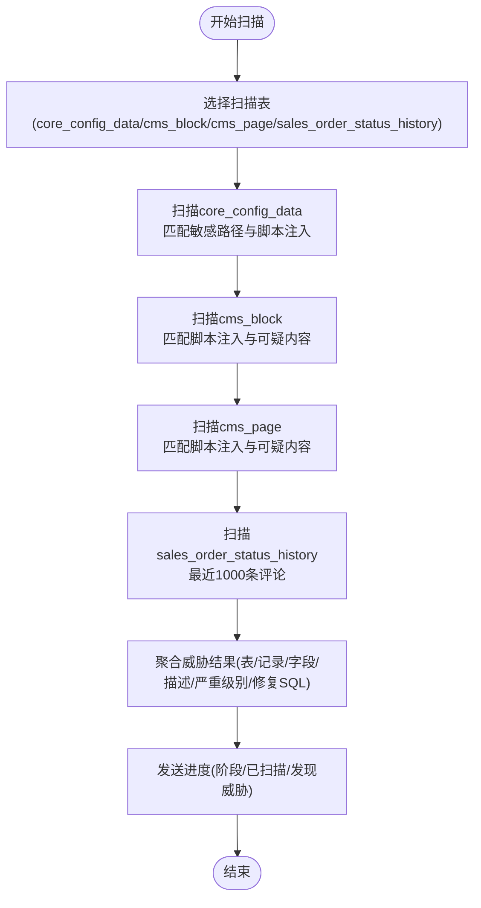
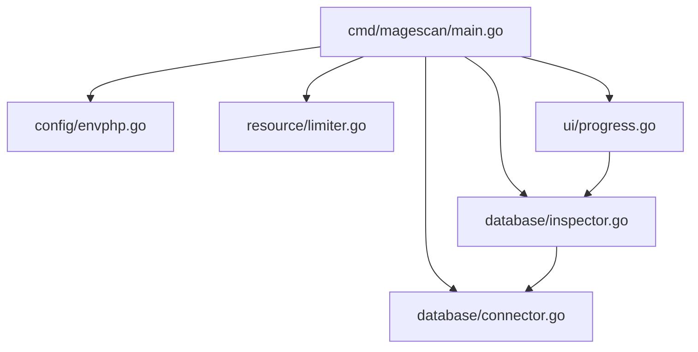

# 数据库检查组件

<cite>
**本文档引用的文件**
- [cmd/magescan/main.go](file://cmd/magescan/main.go)
- [database/connector.go](file://database/connector.go)
- [database/inspector.go](file://database/inspector.go)
- [config/config.go](file://config/config.go)
- [config/envphp.go](file://config/envphp.go)
- [resource/limiter.go](file://resource/limiter.go)
- [scanner/engine.go](file://scanner/engine.go)
- [scanner/filter.go](file://scanner/filter.go)
- [scanner/matcher.go](file://scanner/matcher.go)
- [scanner/rules.go](file://scanner/rules.go)
- [ui/progress.go](file://ui/progress.go)
- [ui/report.go](file://ui/report.go)
- [README.md](file://README.md)
</cite>

## 目录
1. [简介](#简介)
2. [项目结构](#项目结构)
3. [核心组件](#核心组件)
4. [架构总览](#架构总览)
5. [详细组件分析](#详细组件分析)
6. [依赖分析](#依赖分析)
7. [性能考虑](#性能考虑)
8. [故障排除指南](#故障排除指南)
9. [结论](#结论)
10. [附录](#附录)

## 简介
本设计文档聚焦于数据库检查组件，系统性阐述其连接管理机制（连接池与超时处理）、威胁检测算法（核心配置表检查、CMS 内容安全扫描、订单状态历史检查）、SQL 查询优化与索引利用策略、数据脱敏与隐私保护措施，以及数据库连接故障排除与性能调优指南。该组件以只读方式扫描 Magento 2 的数据库，识别潜在注入与异常内容，并生成可执行的修复 SQL，帮助管理员快速定位与修复问题。

## 项目结构
数据库检查组件位于 database 包中，配合 config、scanner、resource、ui 等模块协同工作：
- cmd/magescan/main.go：入口程序，负责解析环境配置、初始化资源限制器、启动文件扫描与数据库扫描、驱动 TUI 并输出报告。
- database/connector.go：数据库连接管理器，封装只读 MySQL 连接、DSN 构造、连接池参数与 Ping 校验。
- database/inspector.go：数据库安全检查器，定义威胁模式、扫描流程与进度上报，执行核心配置表、CMS 内容与订单状态历史的扫描。
- config/config.go 与 config/envphp.go：Magento 根目录检测、版本检测与 env.php 解析，提取数据库配置与表前缀。
- resource/limiter.go：资源限制器，控制 CPU 与内存使用，支持自动节流与恢复。
- scanner/*：文件扫描引擎（用于对比扫描范围与并发策略），为数据库扫描提供上下文与并发参考。
- ui/*：终端用户界面与报告渲染，展示扫描阶段、进度与最终报告。

图表来源
- [cmd/magescan/main.go:105-122](file://cmd/magescan/main.go#L105-L122)
- [config/envphp.go:14-71](file://config/envphp.go#L14-L71)
- [resource/limiter.go:25-57](file://resource/limiter.go#L25-L57)
- [database/connector.go:18-39](file://database/connector.go#L18-L39)
- [database/inspector.go:70-109](file://database/inspector.go#L70-L109)
- [ui/progress.go:15-28](file://ui/progress.go#L15-L28)
- [ui/report.go:58-168](file://ui/report.go#L58-L168)

章节来源
- [cmd/magescan/main.go:24-126](file://cmd/magescan/main.go#L24-L126)
- [README.md:239-258](file://README.md#L239-L258)

## 核心组件
- 数据库连接管理器（Connector）
  - 负责构建 DSN、打开连接、设置连接池参数、Ping 校验与关闭。
  - 提供表名前缀拼接与连接健康检查能力。
- 数据库安全检查器（Inspector）
  - 定义威胁模式集合与敏感路径列表。
  - 执行四类扫描：core_config_data、cms_block、cms_page、sales_order_status_history。
  - 支持按上下文取消、表不存在时的优雅降级与进度上报。
- 配置解析与环境检测
  - 从 env.php 中提取数据库主机、端口、用户名、密码、数据库名与表前缀。
  - 检测 Magento 根目录与版本信息，为扫描提供上下文。
- 资源限制器
  - 控制最大 CPU 核心数与内存上限，周期性监控并在阈值超限时触发节流，恢复采用滞回策略。

章节来源
- [database/connector.go:10-58](file://database/connector.go#L10-L58)
- [database/inspector.go:63-109](file://database/inspector.go#L63-L109)
- [config/envphp.go:14-71](file://config/envphp.go#L14-L71)
- [resource/limiter.go:11-57](file://resource/limiter.go#L11-L57)

## 架构总览
数据库检查组件在主程序中被串行调用：先完成文件扫描，再尝试数据库扫描；数据库扫描通过 Inspector 对四张关键表进行只读查询与正则匹配，同时通过通道向 TUI 发送进度消息。

图表来源
- [cmd/magescan/main.go:105-122](file://cmd/magescan/main.go#L105-L122)
- [database/connector.go:18-39](file://database/connector.go#L18-L39)
- [database/inspector.go:79-109](file://database/inspector.go#L79-L109)
- [ui/progress.go:15-28](file://ui/progress.go#L15-L28)

## 详细组件分析

### 数据库连接管理机制
- DSN 构造与参数
  - 使用标准 MySQL DSN 格式，包含用户、主机、端口、数据库名，并显式设置连接超时与读取超时，确保网络波动下的稳定性。
- 连接池设计
  - 最大打开连接数与空闲连接数均设为较小值，避免占用过多数据库资源，符合只读扫描场景。
- Ping 校验
  - 建立连接后立即执行 Ping，失败即关闭并返回错误，保证后续扫描的可用性。
- 表前缀支持
  - Connector 提供表名拼接方法，结合 env.php 中的表前缀，使查询适配不同安装环境。

图表来源
- [database/connector.go:10-58](file://database/connector.go#L10-L58)

章节来源
- [database/connector.go:16-39](file://database/connector.go#L16-L39)
- [config/envphp.go:62-71](file://config/envphp.go#L62-L71)

### 威胁检测算法
- 威胁模式集合
  - 定义一组正则表达式与敏感关键词，覆盖外部脚本注入、eval 执行、iframe 注入、JavaScript 协议、document.write、base64_decode、可疑内联脚本、事件处理器注入、可疑外部资源与可疑 TLD 等。
- 敏感路径列表（core_config_data）
  - 针对常见被攻击的配置路径（如头部/页脚脚本注入、欢迎语等）进行重点扫描。
- 扫描流程
  - 按顺序执行四类扫描：core_config_data → cms_block → cms_page → sales_order_status_history。
  - 每个扫描阶段独立处理，遇到上下文取消或表不存在错误时优雅处理。
- 结果记录
  - 记录表名、记录 ID、字段、路径（针对 core_config_data）、描述、匹配文本（截断至 200 字符）、严重级别与修复 SQL。

图表来源
- [database/inspector.go:79-109](file://database/inspector.go#L79-L109)
- [database/inspector.go:116-177](file://database/inspector.go#L116-L177)
- [database/inspector.go:179-281](file://database/inspector.go#L179-L281)
- [database/inspector.go:283-330](file://database/inspector.go#L283-L330)

章节来源
- [database/inspector.go:31-50](file://database/inspector.go#L31-L50)
- [database/inspector.go:52-61](file://database/inspector.go#L52-L61)
- [database/inspector.go:116-177](file://database/inspector.go#L116-L177)
- [database/inspector.go:179-281](file://database/inspector.go#L179-L281)
- [database/inspector.go:283-330](file://database/inspector.go#L283-L330)

### SQL 查询优化与索引利用策略
- 查询策略
  - core_config_data：基于敏感路径集合构建 IN 子句，减少全表扫描范围；同时模糊匹配包含“script”或“html”的路径，兼顾遗漏风险。
  - cms_block、cms_page：直接全表扫描，字段仅包含必要列（ID、标识符、内容），避免不必要的列传输。
  - sales_order_status_history：按实体 ID 倒序取最近 1000 条，限制扫描规模，降低 IO 压力。
- 索引建议
  - core_config_data.path：若尚未建立索引，建议在 path 列上建立索引以加速敏感路径与模糊匹配。
  - cms_block.identifier、cms_page.identifier：若存在大量内容匹配需求，可考虑在 identifier 上建立索引以提升定位效率。
  - sales_order_status_history.entity_id：作为排序与 LIMIT 的关键列，建议保持自增主键索引以支撑高效排序与分页。
- 连接池与并发
  - 连接池参数较小，适合只读扫描场景；若数据库负载较高，可考虑在业务低峰期运行扫描，或临时调整连接池参数。

章节来源
- [database/inspector.go:127-130](file://database/inspector.go#L127-L130)
- [database/inspector.go:181](file://database/inspector.go#L181)
- [database/inspector.go:233](file://database/inspector.go#L233)
- [database/inspector.go:285](file://database/inspector.go#L285)

### 数据脱敏与隐私保护
- 只读访问
  - 连接器使用只读连接，所有查询均为 SELECT，不产生任何写操作，避免对生产数据造成影响。
- 结果脱敏
  - 匹配文本在报告中截断至固定长度，防止长内容泄露敏感信息。
- 修复 SQL 生成
  - 生成的修复 SQL 仅包含清理内容的 UPDATE 语句，不涉及删除记录，便于人工审阅后再执行。
- 隐私边界
  - 组件不存储、不上传、不记录扫描结果，仅在内存中进行匹配与聚合，扫描结束后释放资源。

章节来源
- [database/connector.go:17-20](file://database/connector.go#L17-L20)
- [database/inspector.go:344-349](file://database/inspector.go#L344-L349)
- [database/inspector.go:164](file://database/inspector.go#L164)
- [database/inspector.go:215](file://database/inspector.go#L215)
- [database/inspector.go:317](file://database/inspector.go#L317)

## 依赖分析
- 主程序依赖
  - 通过 env.php 解析 DB 配置与表前缀，随后创建 Connector 并初始化 Inspector。
  - 使用资源限制器控制并发与内存，避免扫描对系统造成压力。
- 组件间耦合
  - Connector 与 Inspector 强耦合（Inspector 持有 Connector 指针），但职责清晰：连接管理与安全检查分离。
  - TUI 通过通道接收进度消息，与数据库扫描解耦。
- 外部依赖
  - MySQL 驱动（github.com/go-sql-driver/mysql）用于连接与查询。
  - Bubble Tea 用于 TUI 展示与交互。

图表来源
- [cmd/magescan/main.go:105-122](file://cmd/magescan/main.go#L105-L122)
- [database/inspector.go:70-77](file://database/inspector.go#L70-L77)
- [ui/progress.go:15-28](file://ui/progress.go#L15-L28)

章节来源
- [cmd/magescan/main.go:105-122](file://cmd/magescan/main.go#L105-L122)
- [database/inspector.go:70-77](file://database/inspector.go#L70-L77)

## 性能考虑
- 连接池参数
  - 最大打开连接数与空闲连接数较小，适合只读扫描；若数据库连接紧张，可适当提高空闲连接数以复用连接。
- 查询范围控制
  - core_config_data 使用 IN 子句与模糊匹配，缩小扫描范围；cms_* 表仅取必要列；sales_order_status_history 限制数量。
- 正则匹配成本
  - 正则表达式较多且复杂，建议在数据库侧开启合适的索引以减少全表扫描；同时可在应用层缓存敏感路径集合，减少重复构建。
- 并发与资源限制
  - 资源限制器周期性监控内存，超过阈值时触发节流，恢复采用滞回策略，避免频繁切换。

章节来源
- [database/connector.go:27-28](file://database/connector.go#L27-L28)
- [database/inspector.go:127-130](file://database/inspector.go#L127-L130)
- [resource/limiter.go:64-117](file://resource/limiter.go#L64-L117)

## 故障排除指南
- 连接失败
  - 检查 DSN 参数（主机、端口、用户名、密码、数据库名）是否正确；确认 MySQL 服务可达且允许来自扫描主机的连接。
  - 若 Ping 失败，查看数据库日志与防火墙规则，确认连接超时与读取超时设置是否合理。
- 表不存在
  - 某些表可能未启用或未安装，组件会捕获表不存在错误并跳过该阶段，不影响其他表扫描。
- 扫描缓慢
  - 为 core_config_data、cms_block、cms_page、sales_order_status_history 建立合适索引；在业务低峰期运行扫描。
  - 减少扫描模式（如使用 fast 模式）或限制资源使用（CPU/内存）以平衡速度与稳定性。
- 结果不完整
  - 确认 env.php 中的表前缀是否正确；检查数据库权限是否允许只读查询。
- 报告与修复
  - 修复 SQL 由组件生成，需人工审阅后再执行；执行前建议备份目标表。

章节来源
- [database/connector.go:30-33](file://database/connector.go#L30-L33)
- [database/inspector.go:100-104](file://database/inspector.go#L100-L104)
- [config/envphp.go:62-71](file://config/envphp.go#L62-L71)

## 结论
数据库检查组件通过只读连接与精心设计的扫描策略，有效识别 Magento 2 数据库中的注入与异常内容。其连接池与超时机制、正则匹配算法与进度上报，共同构成了稳定高效的扫描能力。配合合理的索引与资源限制策略，可在保证性能的同时满足生产环境的安全审计需求。建议在部署前完善数据库索引、审阅生成的修复 SQL，并在低峰期执行扫描以降低对业务的影响。

## 附录
- 关键配置与行为
  - DSN 超时与读取超时：确保网络波动下的稳定性。
  - 连接池参数：最小化资源占用，适合只读扫描。
  - 扫描范围：核心配置表、CMS 内容与订单状态历史，兼顾覆盖面与性能。
  - 修复 SQL：生成可执行的清理语句，便于人工审阅与执行。

章节来源
- [database/connector.go:17-20](file://database/connector.go#L17-L20)
- [database/connector.go:27-28](file://database/connector.go#L27-L28)
- [database/inspector.go:127-130](file://database/inspector.go#L127-L130)
- [database/inspector.go:181](file://database/inspector.go#L181)
- [database/inspector.go:233](file://database/inspector.go#L233)
- [database/inspector.go:285](file://database/inspector.go#L285)