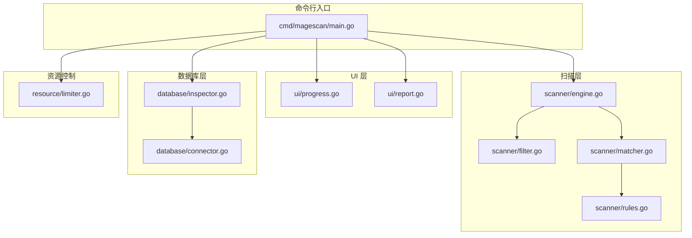
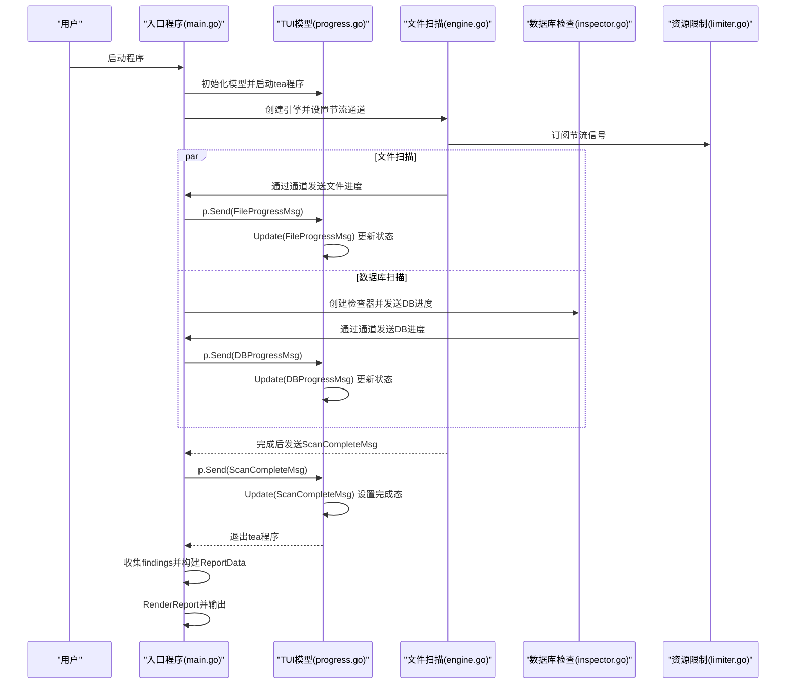
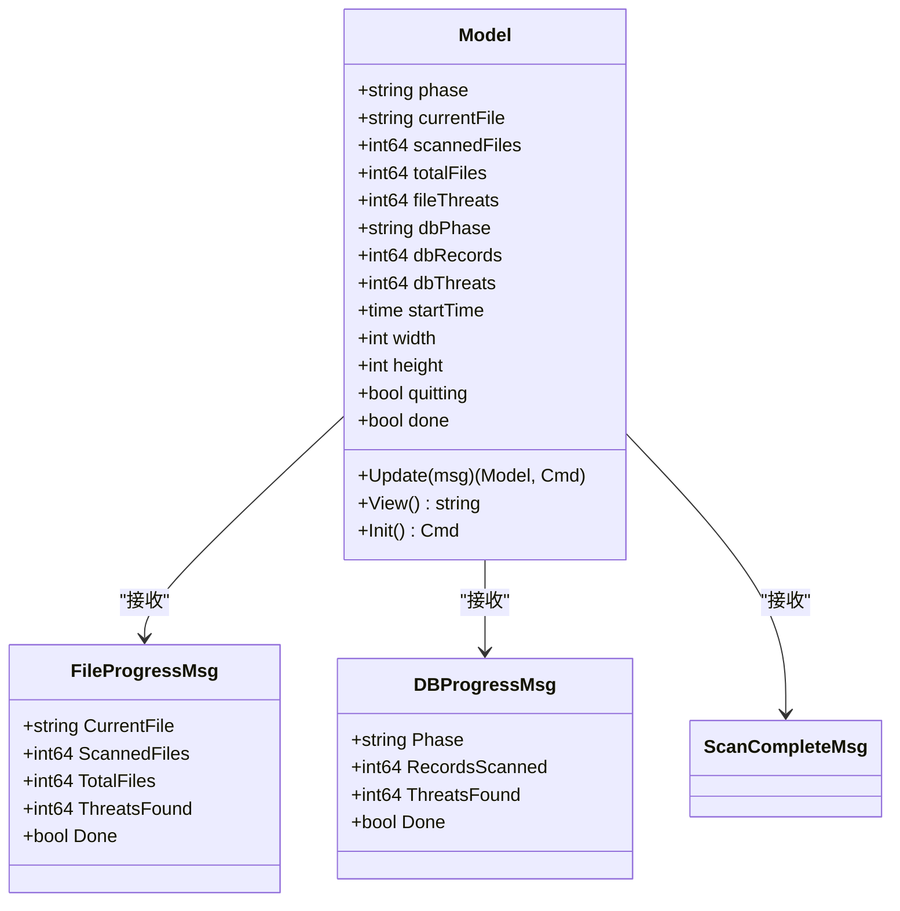
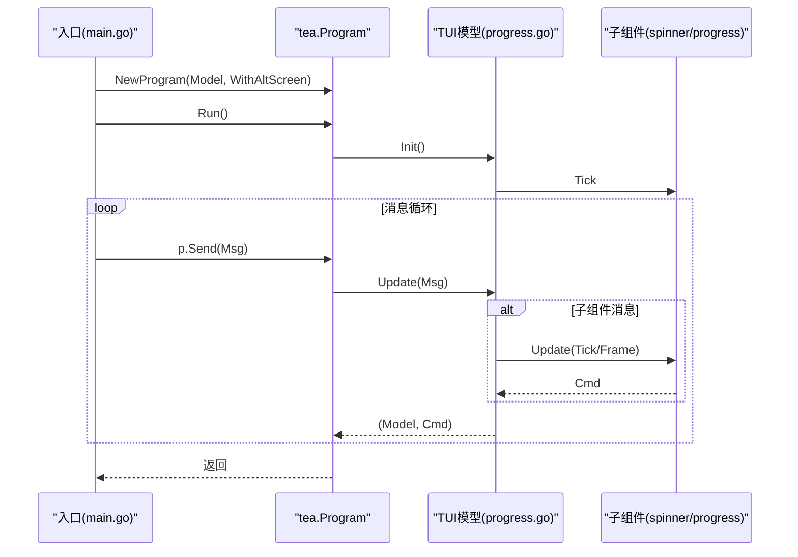
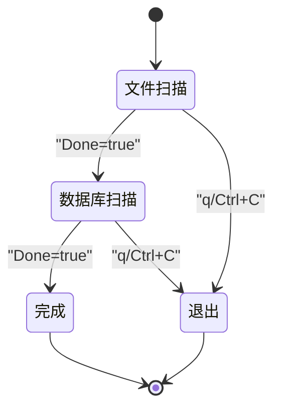
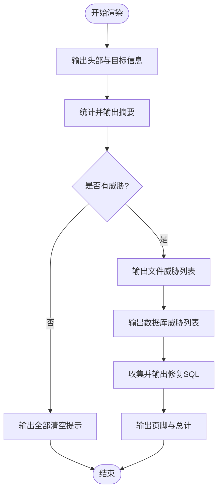
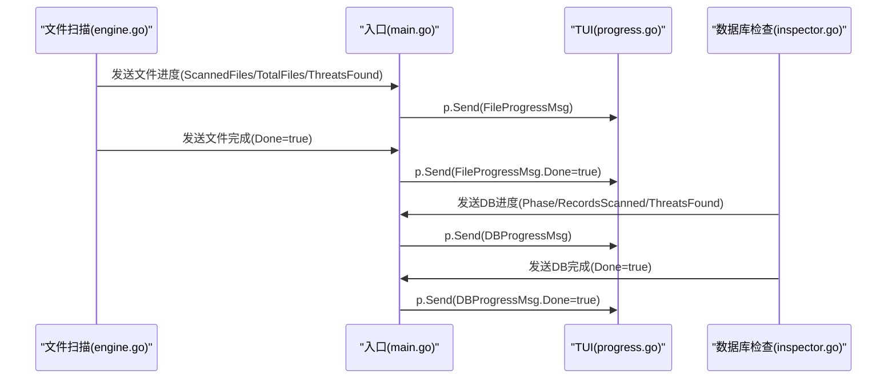
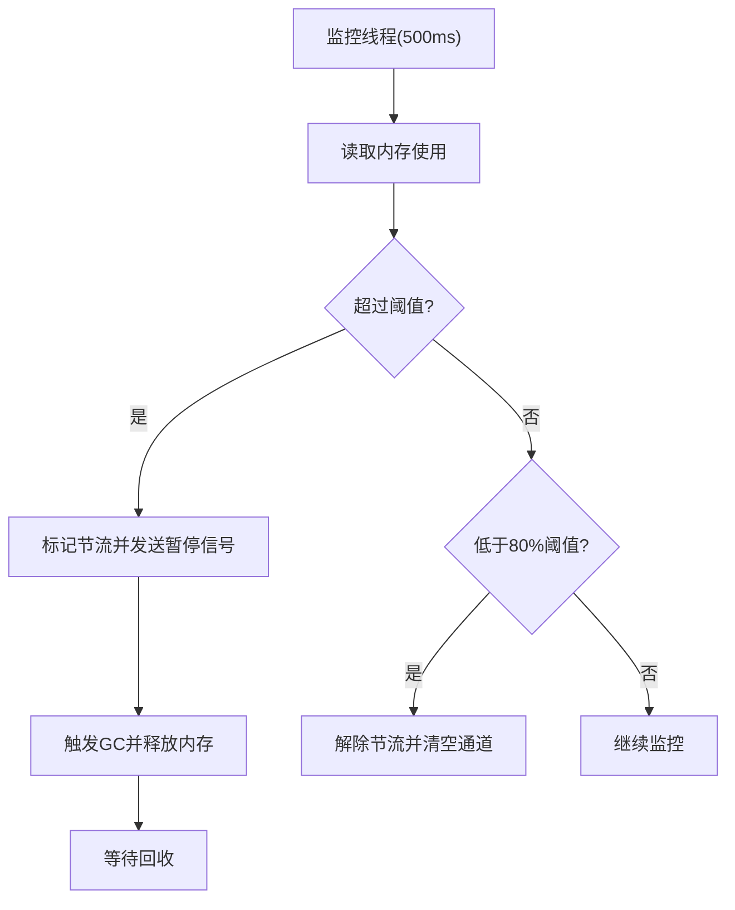
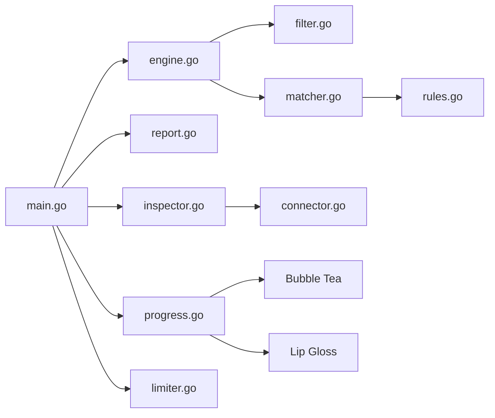

# 用户界面组件

<cite>
**本文引用的文件列表**
- [main.go](file://cmd/magescan/main.go)
- [progress.go](file://ui/progress.go)
- [report.go](file://ui/report.go)
- [engine.go](file://scanner/engine.go)
- [inspector.go](file://database/inspector.go)
- [limiter.go](file://resource/limiter.go)
- [filter.go](file://scanner/filter.go)
- [matcher.go](file://scanner/matcher.go)
- [rules.go](file://scanner/rules.go)
- [config.go](file://config/config.go)
- [connector.go](file://database/connector.go)
- [README.md](file://README.md)
</cite>

## 目录
1. [简介](#简介)
2. [项目结构](#项目结构)
3. [核心组件](#核心组件)
4. [架构总览](#架构总览)
5. [详细组件分析](#详细组件分析)
6. [依赖分析](#依赖分析)
7. [性能考量](#性能考量)
8. [故障排查指南](#故障排查指南)
9. [结论](#结论)
10. [附录](#附录)

## 简介
本设计文档聚焦于用户界面组件，特别是基于 Bubble Tea 的 TUI 进度显示与报告生成系统。内容涵盖：
- TUI 实时更新机制（消息传递、状态同步、窗口尺寸适配）
- 报告生成的数据格式设计与渲染逻辑
- Bubble Tea 集成方式与消息流
- 扫描阶段切换与状态管理
- UI 自定义与扩展最佳实践

## 项目结构
该项目采用按功能域分层的模块化组织，UI 组件位于 ui 包中，负责进度显示与最终报告渲染；扫描引擎与数据库检查器分别在 scanner 与 database 包中，通过通道向 UI 发送进度消息；资源限制器在 resource 包中为扫描工作提供节流支持；入口程序在 cmd/magescan/main.go 中编排各模块。

图表来源
- [main.go:1-208](file://cmd/magescan/main.go#L1-L208)
- [progress.go:1-289](file://ui/progress.go#L1-L289)
- [report.go:1-230](file://ui/report.go#L1-L230)
- [engine.go:1-323](file://scanner/engine.go#L1-L323)
- [filter.go:1-98](file://scanner/filter.go#L1-L98)
- [matcher.go:1-168](file://scanner/matcher.go#L1-L168)
- [rules.go:1-200](file://scanner/rules.go#L1-L200)
- [inspector.go:1-359](file://database/inspector.go#L1-L359)
- [connector.go:1-58](file://database/connector.go#L1-L58)
- [limiter.go:1-118](file://resource/limiter.go#L1-L118)

章节来源
- [README.md:239-258](file://README.md#L239-L258)
- [main.go:1-208](file://cmd/magescan/main.go#L1-L208)

## 核心组件
- TUI 模型与消息：定义了文件扫描进度、数据库扫描进度、扫描完成等消息类型，并在模型中维护阶段、计数、样式与结果集合。
- 报告数据结构：封装目标信息、统计与威胁清单，用于最终报告渲染。
- Bubble Tea 集成：使用 tea.Program 托管生命周期，处理键盘输入、窗口尺寸变化与消息循环。
- 扫描进度通道：文件扫描与数据库扫描分别通过通道向 UI 推送进度，UI 在 Update 中接收并更新状态。
- 资源限制与节流：内存监控触发扫描工作暂停，避免资源超限导致系统不稳定。

章节来源
- [progress.go:14-82](file://ui/progress.go#L14-L82)
- [report.go:11-21](file://ui/report.go#L11-L21)
- [main.go:78-157](file://cmd/magescan/main.go#L78-L157)
- [limiter.go:64-117](file://resource/limiter.go#L64-L117)

## 架构总览
下图展示从入口到 UI 的端到端流程，包括消息通道、状态更新与报告渲染。

图表来源
- [main.go:78-157](file://cmd/magescan/main.go#L78-L157)
- [progress.go:140-197](file://ui/progress.go#L140-L197)
- [engine.go:76-121](file://scanner/engine.go#L76-L121)
- [inspector.go:79-109](file://database/inspector.go#L79-L109)
- [limiter.go:64-117](file://resource/limiter.go#L64-L117)

## 详细组件分析

### TUI 模型与消息机制
- 消息类型
  - 文件进度消息：包含当前文件、已扫描文件数、总数、威胁数与是否完成标志。
  - 数据库进度消息：包含阶段名称、记录扫描数、威胁数与是否完成标志。
  - 扫描完成消息：用于通知 UI 结束并退出。
- 模型状态
  - 阶段标识：文件扫描、数据库扫描、完成。
  - 计数与时间：扫描文件数、总数、威胁数、开始时间。
  - 结果集合：文件威胁与数据库威胁的简化展示对象。
  - 尺寸与控制：窗口宽高、退出与完成标记。
- 更新逻辑
  - 键盘事件：支持退出键触发退出。
  - 窗口尺寸：动态调整进度条宽度以适配终端。
  - 进度消息：根据消息更新阶段、计数与完成态。
  - 子组件：处理 Spinner 与 Progress 的 Tick 与 Frame 消息。
- 视图渲染
  - 标题、阶段标题、进度条与百分比、当前文件路径截断、威胁统计与耗时。
  - 数据库阶段：根据阶段与完成态显示扫描状态与威胁统计。
  - 退出提示。

图表来源
- [progress.go:14-82](file://ui/progress.go#L14-L82)
- [progress.go:140-197](file://ui/progress.go#L140-L197)

章节来源
- [progress.go:14-82](file://ui/progress.go#L14-L82)
- [progress.go:140-197](file://ui/progress.go#L140-L197)
- [progress.go:199-263](file://ui/progress.go#L199-L263)

### Bubble Tea 集成与消息传递
- 程序初始化：创建 tea.Program 并启用备用屏幕。
- 生命周期：Init 返回子组件 Tick 命令；Run 阻塞直到退出。
- 消息循环：Update 处理各类消息并返回子组件命令；View 渲染当前帧。
- 通道桥接：入口程序通过 p.Send 将扫描进度与完成消息转发给 TUI。

图表来源
- [main.go:82-157](file://cmd/magescan/main.go#L82-L157)
- [progress.go:136-138](file://ui/progress.go#L136-L138)
- [progress.go:140-197](file://ui/progress.go#L140-L197)

章节来源
- [main.go:82-157](file://cmd/magescan/main.go#L82-L157)
- [progress.go:136-138](file://ui/progress.go#L136-L138)
- [progress.go:140-197](file://ui/progress.go#L140-L197)

### 扫描阶段切换与状态管理
- 阶段流转
  - 文件扫描阶段：收到文件进度消息后更新计数与当前文件，当 Done 为真时切换至数据库扫描阶段。
  - 数据库扫描阶段：收到数据库进度消息后更新阶段、记录扫描数与威胁数，当 Done 为真时切换至完成阶段。
  - 完成阶段：收到扫描完成消息或数据库阶段 Done 时，设置完成态并退出。
- 状态同步
  - 文件扫描：通过通道持续推送进度，每 N 个文件或发现威胁时发送一次。
  - 数据库扫描：逐表扫描，每张表结束发送一次进度，最后汇总。
- 用户交互
  - 支持 q 或 Ctrl+C 退出，设置退出标记并调用 Quit 命令。

图表来源
- [progress.go:161-178](file://ui/progress.go#L161-L178)
- [progress.go:142-147](file://ui/progress.go#L142-L147)

章节来源
- [progress.go:161-178](file://ui/progress.go#L161-L178)
- [progress.go:142-147](file://ui/progress.go#L142-L147)

### 报告生成系统：数据格式与渲染逻辑
- 数据格式设计
  - 报告数据结构包含目标信息（版本、模式、路径、耗时、文件数）、文件威胁与数据库威胁清单。
  - 威胁对象包含路径、行号、严重性、类别、描述、匹配文本等字段。
- 渲染逻辑
  - 汇总统计：按严重性分类统计，计算总数。
  - 条件输出：若无威胁则输出“全部清空”提示。
  - 分类展示：先文件威胁，再数据库威胁，每项包含严重性标签、路径/表名与 ID、问题描述、匹配文本与修复建议（如存在）。
  - 修复建议：收集所有数据库威胁中的修复 SQL，统一输出。
  - 样式：使用 lipgloss 定义标题、严重性、路径、SQL 等样式，保证可读性与一致性。

图表来源
- [report.go:57-168](file://ui/report.go#L57-L168)
- [report.go:186-229](file://ui/report.go#L186-L229)

章节来源
- [report.go:11-21](file://ui/report.go#L11-L21)
- [report.go:57-168](file://ui/report.go#L57-L168)
- [report.go:186-229](file://ui/report.go#L186-L229)

### 扫描引擎与数据库检查器的进度推送
- 文件扫描引擎
  - 统计总文件数、并发工作池、分片读取大文件、按阈值周期性发送进度。
  - 发现威胁时立即发送进度，确保 UI 及时反映威胁数量变化。
- 数据库检查器
  - 依次扫描敏感表，逐表结束发送进度；对不存在的表进行容错处理。
  - 对每个威胁生成修复 SQL，便于报告输出。

图表来源
- [engine.go:76-121](file://scanner/engine.go#L76-L121)
- [engine.go:218-225](file://scanner/engine.go#L218-L225)
- [engine.go:314-321](file://scanner/engine.go#L314-L321)
- [inspector.go:79-109](file://database/inspector.go#L79-L109)
- [inspector.go:332-341](file://database/inspector.go#L332-L341)
- [main.go:128-151](file://cmd/magescan/main.go#L128-L151)

章节来源
- [engine.go:76-121](file://scanner/engine.go#L76-L121)
- [engine.go:218-225](file://scanner/engine.go#L218-L225)
- [engine.go:314-321](file://scanner/engine.go#L314-L321)
- [inspector.go:79-109](file://database/inspector.go#L79-L109)
- [inspector.go:332-341](file://database/inspector.go#L332-L341)
- [main.go:128-151](file://cmd/magescan/main.go#L128-L151)

### 资源限制与 UI 协同
- 内存监控：后台定时器检测分配内存，超过阈值触发节流，阻塞扫描工作；低于阈值（80%）解除节流。
- 工作暂停：扫描工作在处理文件前检查节流通道，收到暂停信号后阻塞直至恢复。
- UI 体验：节流期间 UI 仍可正常刷新，但扫描速度下降，避免终端卡死或系统过载。

图表来源
- [limiter.go:64-117](file://resource/limiter.go#L64-L117)
- [engine.go:204-213](file://scanner/engine.go#L204-L213)

章节来源
- [limiter.go:64-117](file://resource/limiter.go#L64-L117)
- [engine.go:204-213](file://scanner/engine.go#L204-L213)

## 依赖分析
- UI 依赖
  - Bubble Tea：提供程序生命周期与消息循环。
  - Lip Gloss：提供样式与渲染能力。
- 扫描依赖
  - 规则集：由规则文件加载，匹配器预编译正则提升性能。
  - 文件过滤：根据模式决定扫描范围。
- 数据库依赖
  - MySQL 驱动：连接与查询。
  - 表前缀：兼容不同部署环境。
- 入口依赖
  - 信号处理：优雅关闭上下文。
  - 通道：解耦扫描与 UI。

图表来源
- [main.go:1-208](file://cmd/magescan/main.go#L1-L208)
- [progress.go:1-12](file://ui/progress.go#L1-L12)
- [report.go:1-9](file://ui/report.go#L1-L9)
- [engine.go:1-11](file://scanner/engine.go#L1-L11)
- [inspector.go:1-9](file://database/inspector.go#L1-L9)
- [limiter.go:1-10](file://resource/limiter.go#L1-L10)
- [filter.go:1-6](file://scanner/filter.go#L1-L6)
- [matcher.go:1-7](file://scanner/matcher.go#L1-L7)
- [rules.go:1-11](file://scanner/rules.go#L1-L11)
- [connector.go:1-8](file://database/connector.go#L1-L8)

章节来源
- [main.go:1-208](file://cmd/magescan/main.go#L1-L208)
- [progress.go:1-12](file://ui/progress.go#L1-L12)
- [report.go:1-9](file://ui/report.go#L1-L9)
- [engine.go:1-11](file://scanner/engine.go#L1-L11)
- [inspector.go:1-9](file://database/inspector.go#L1-L9)
- [limiter.go:1-10](file://resource/limiter.go#L1-L10)
- [filter.go:1-6](file://scanner/filter.go#L1-L6)
- [matcher.go:1-7](file://scanner/matcher.go#L1-L7)
- [rules.go:1-11](file://scanner/rules.go#L1-L11)
- [connector.go:1-8](file://database/connector.go#L1-L8)

## 性能考量
- UI 刷新
  - 使用非滚动终端与固定布局，减少重绘开销。
  - 进度条宽度随窗口尺寸动态调整，避免溢出。
- 扫描性能
  - 工作池大小为 CPU 数的两倍，充分利用多核。
  - 大文件分片读取并带重叠，避免内存峰值。
  - 正则预编译与字面量快速匹配结合，降低匹配成本。
- 资源控制
  - 内存监控与节流机制保障系统稳定性，防止 OOM。
  - 80% 滞回阈值避免频繁启停。
- 报告渲染
  - 分类排序与样式化输出，兼顾可读性与性能。

## 故障排查指南
- UI 不刷新或卡顿
  - 检查是否正确发送消息：确认入口程序的通道发送逻辑与 p.Send 调用。
  - 检查窗口尺寸消息：确保 Update 中处理 WindowSizeMsg 并更新进度条宽度。
- 进度不准确
  - 文件扫描：确认进度阈值与原子计数使用，避免竞态。
  - 数据库扫描：确认每张表结束后发送进度，注意容错处理。
- 资源限制无效
  - 检查内存监控线程是否运行，阈值设置是否合理。
  - 确认扫描工作在处理文件前检查节流通道。
- 报告缺失修复 SQL
  - 检查数据库威胁对象是否包含修复 SQL 字段。
  - 确认收集函数是否遍历所有威胁并去空。

章节来源
- [progress.go:149-159](file://ui/progress.go#L149-L159)
- [engine.go:218-225](file://scanner/engine.go#L218-L225)
- [inspector.go:332-341](file://database/inspector.go#L332-L341)
- [limiter.go:64-117](file://resource/limiter.go#L64-L117)
- [report.go:221-229](file://ui/report.go#L221-L229)

## 结论
该 UI 组件通过清晰的消息模型与 Bubble Tea 集成，实现了高效的实时进度显示与可读的报告渲染。扫描引擎与数据库检查器通过通道将状态同步到 UI，配合资源限制器确保系统稳定。整体设计具备良好的扩展性与可维护性。

## 附录
- UI 自定义与扩展最佳实践
  - 样式与主题：集中定义样式变量，便于统一风格与主题切换。
  - 消息扩展：新增消息类型时，同步更新模型 Update 与视图渲染。
  - 子组件：保持子组件职责单一，通过命令与消息解耦。
  - 报告扩展：新增威胁类别时，补充统计与渲染逻辑，确保样式一致。
  - 性能优化：避免在 Update 中执行重计算，尽量在后台 goroutine 中准备数据。