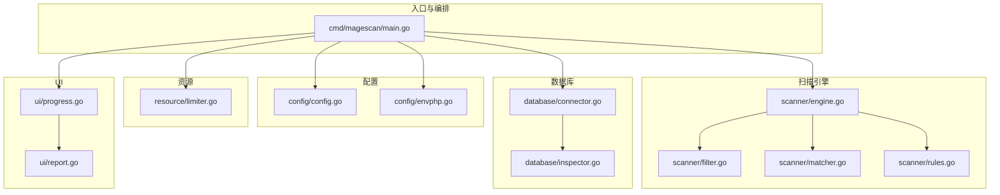
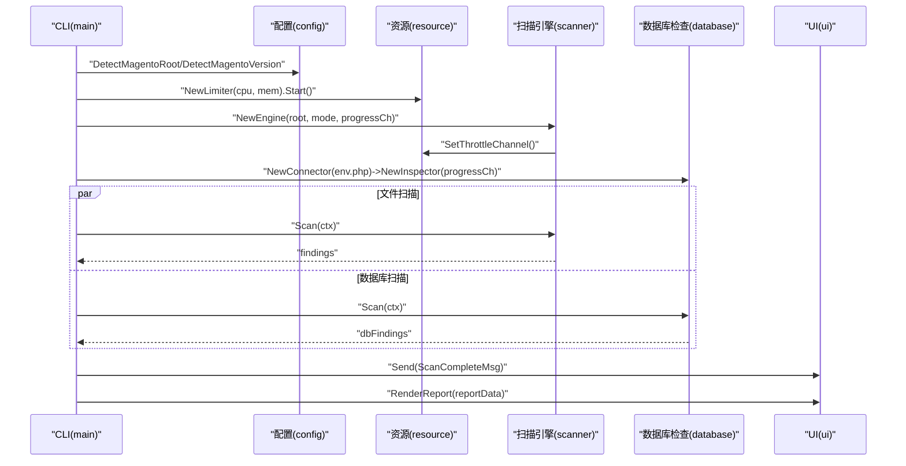
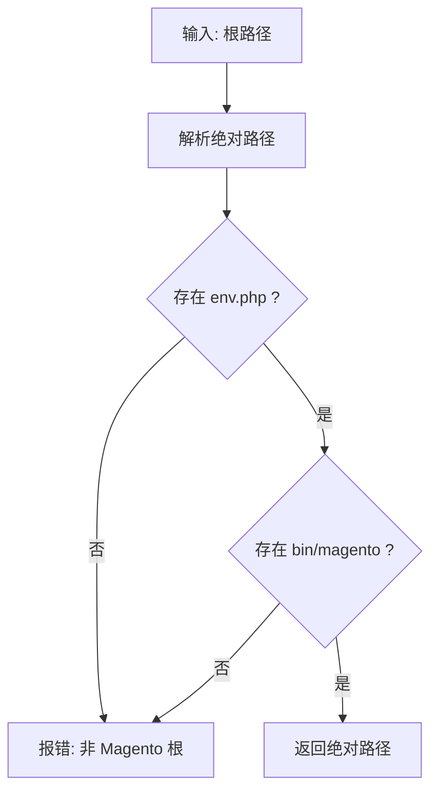
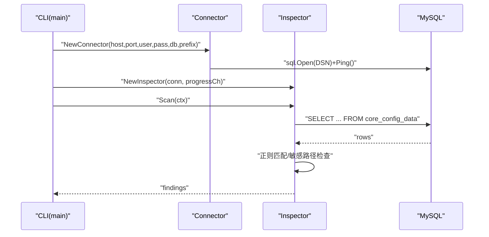
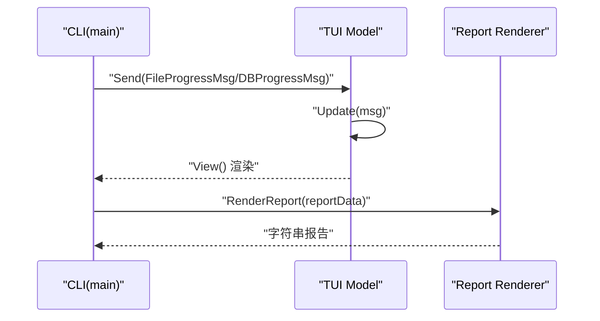
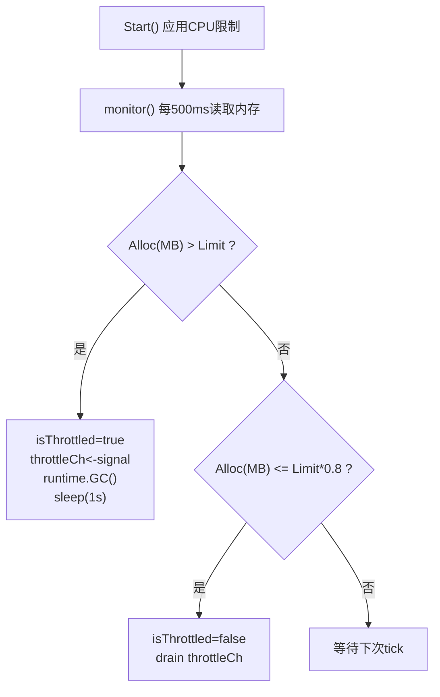
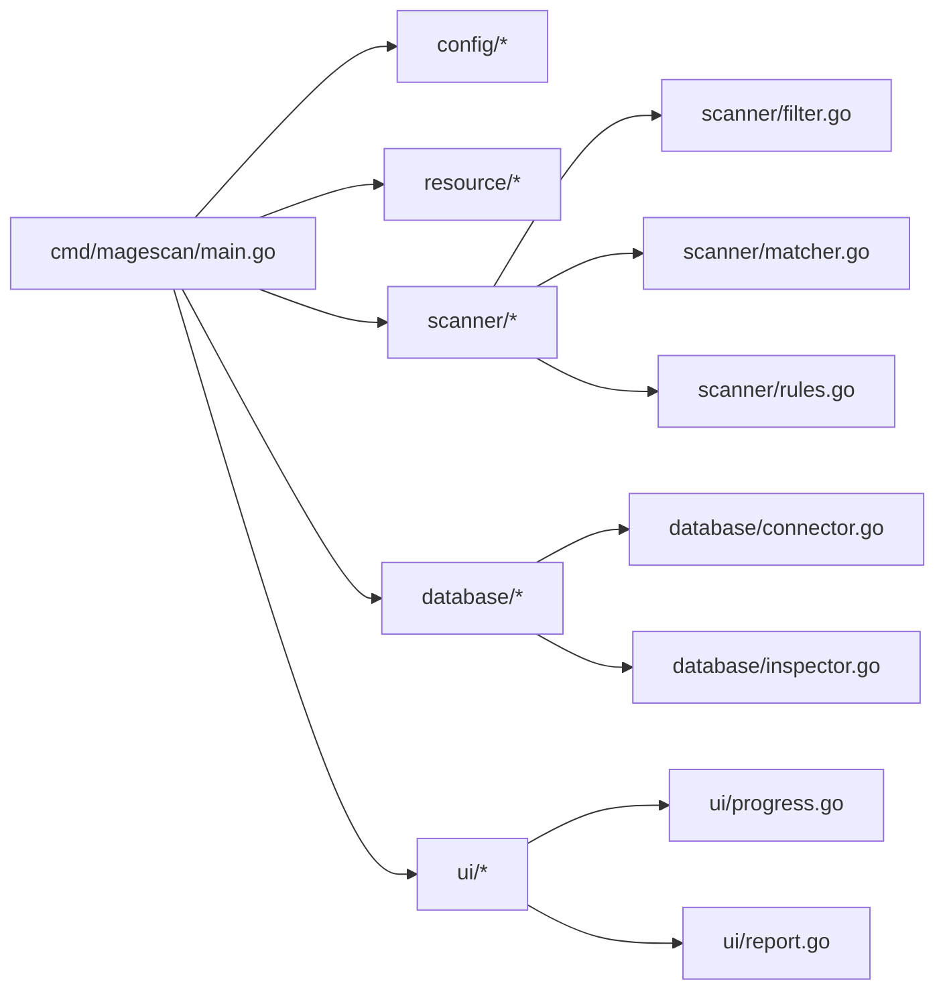

# 组件设计

<cite>
**本文引用的文件列表**
- [cmd/magescan/main.go](file://cmd/magescan/main.go)
- [config/config.go](file://config/config.go)
- [config/envphp.go](file://config/envphp.go)
- [scanner/engine.go](file://scanner/engine.go)
- [scanner/filter.go](file://scanner/filter.go)
- [scanner/matcher.go](file://scanner/matcher.go)
- [scanner/rules.go](file://scanner/rules.go)
- [database/connector.go](file://database/connector.go)
- [database/inspector.go](file://database/inspector.go)
- [resource/limiter.go](file://resource/limiter.go)
- [ui/progress.go](file://ui/progress.go)
- [ui/report.go](file://ui/report.go)
- [README.md](file://README.md)
- [go.mod](file://go.mod)
</cite>

## 目录
1. [简介](#简介)
2. [项目结构](#项目结构)
3. [核心组件](#核心组件)
4. [架构总览](#架构总览)
5. [详细组件分析](#详细组件分析)
6. [依赖关系分析](#依赖关系分析)
7. [性能考量](#性能考量)
8. [故障排查指南](#故障排查指南)
9. [结论](#结论)
10. [附录](#附录)

## 简介
本设计文档面向 MageScan 的核心组件，系统阐述配置管理、扫描引擎、数据库检查、UI 组件与资源管理五大模块的设计理念、实现方式与交互机制。文档同时给出接口设计、内部状态管理、错误处理策略，并通过可视化图示展示组件间通信（通道、事件、回调）与数据流，帮助开发者快速理解与扩展。

## 项目结构
项目采用按功能域分层的模块化组织：
- cmd/magescan：CLI 入口与编排
- config：环境检测与 env.php 解析
- scanner：文件扫描引擎、过滤器、匹配器与规则集
- database：数据库连接器与安全检查器
- resource：CPU/内存限制与自动节流
- ui：TUI 进度模型与报告渲染



图表来源
- [cmd/magescan/main.go:24-207](file://cmd/magescan/main.go#L24-L207)
- [config/config.go:49-107](file://config/config.go#L49-L107)
- [config/envphp.go:14-71](file://config/envphp.go#L14-L71)
- [scanner/engine.go:60-322](file://scanner/engine.go#L60-L322)
- [scanner/filter.go:56-97](file://scanner/filter.go#L56-L97)
- [scanner/matcher.go:34-167](file://scanner/matcher.go#L34-L167)
- [scanner/rules.go:50-467](file://scanner/rules.go#L50-L467)
- [database/connector.go:16-57](file://database/connector.go#L16-L57)
- [database/inspector.go:79-359](file://database/inspector.go#L79-L359)
- [resource/limiter.go:22-117](file://resource/limiter.go#L22-L117)
- [ui/progress.go:116-289](file://ui/progress.go#L116-L289)
- [ui/report.go:57-230](file://ui/report.go#L57-L230)

章节来源
- [README.md:239-258](file://README.md#L239-L258)
- [go.mod:1-31](file://go.mod#L1-L31)

## 核心组件
- 配置管理组件：检测 Magento 根目录、读取版本信息、解析 env.php 获取数据库配置与表前缀。
- 扫描引擎组件：工作池架构、并发设计、大文件分块扫描、进度上报。
- 数据库检查组件：只读连接、多表扫描、威胁检测算法、修复建议 SQL。
- UI 组件：TUI 模型与消息驱动、实时更新、报告渲染。
- 资源管理组件：CPU/内存限制、后台监控、自动节流与回滞恢复。

章节来源
- [config/config.go:13-107](file://config/config.go#L13-L107)
- [scanner/engine.go:47-322](file://scanner/engine.go#L47-L322)
- [database/inspector.go:63-359](file://database/inspector.go#L63-L359)
- [ui/progress.go:54-289](file://ui/progress.go#L54-L289)
- [resource/limiter.go:11-117](file://resource/limiter.go#L11-L117)

## 架构总览
整体流程：入口解析参数与信号，检测 Magento 环境，初始化资源限制器，启动文件扫描引擎与数据库检查器，通过通道向 TUI 推送进度，最终生成报告并设置退出码。



图表来源
- [cmd/magescan/main.go:35-207](file://cmd/magescan/main.go#L35-L207)
- [config/config.go:49-107](file://config/config.go#L49-L107)
- [resource/limiter.go:34-57](file://resource/limiter.go#L34-L57)
- [scanner/engine.go:76-121](file://scanner/engine.go#L76-L121)
- [database/inspector.go:79-109](file://database/inspector.go#L79-L109)
- [ui/progress.go:161-183](file://ui/progress.go#L161-L183)

## 详细组件分析

### 配置管理组件
- 设计理念
  - 仅读操作，避免对目标系统产生副作用。
  - 提供默认配置与环境探测，兼容不同部署形态。
- 关键接口
  - DetectMagentoRoot：校验 app/etc/env.php 与 bin/magento 存在性。
  - DetectMagentoVersion：从 composer.json 读取版本号。
  - ParseEnvPHP：解析 env.php 中的数据库连接参数与表前缀。
- 内部状态
  - ScanConfig/DBConfig 结构体承载扫描会话配置与数据库连接参数。
- 错误处理
  - 对缺失文件、解析失败、版本不可识别等情况返回可诊断的错误。
- 外部依赖
  - 依赖 Go 标准库进行路径解析、文件读取与 JSON 解析。



图表来源
- [config/config.go:52-71](file://config/config.go#L52-L71)

章节来源
- [config/config.go:13-107](file://config/config.go#L13-L107)
- [config/envphp.go:14-71](file://config/envphp.go#L14-L71)

### 扫描引擎组件
- 设计理念
  - 工作池架构：每核 2 个 worker，最大化并发；支持上下文取消与优雅停机。
  - 分块扫描：大文件以重叠窗口分块读取，避免内存峰值。
  - 进度上报：周期性发送扫描统计到 UI。
- 关键接口
  - NewEngine：创建引擎并注入过滤器与匹配器。
  - SetThrottleChannel：接入资源限制器的节流通道。
  - Scan：两阶段遍历（计数→分发），等待所有 worker 完成。
  - GetStats：原子读取扫描统计。
- 内部状态
  - 统计计数器（总数、已扫描、威胁数）、当前文件名、互斥锁保护结果。
- 并发与通道
  - jobs 通道承载文件路径；progressCh 通道向 UI 发送进度。
  - throttleCh 用于阻塞式暂停/恢复工作。
- 错误处理
  - 遍历过程中忽略单文件错误；上下文取消时终止扫描。
- 性能特性
  - 匹配器预编译正则，字节级快速查找，减少正则开销。
  - 大文件重叠分块，兼顾完整性与性能。

```mermaid
classDiagram
class Engine {
-rootPath string
-filter *ScanFilter
-matcher *Matcher
-workerCount int
-findings []Finding
-stats ScanStats
-mu Mutex
-progressCh chan ScanProgress
-throttleCh chan struct{}
+Scan(ctx) ([]Finding, error)
+GetStats() ScanStats
+SetThrottleChannel(ch)
}
class ScanFilter {
-Mode string
+ShouldSkipDir(relPath) bool
+ShouldScanFile(fileName) bool
}
class Matcher {
-rules []CompiledRule
+Match(content) []MatchResult
+RuleCount() int
+RulesByCategory(cat) []CompiledRule
}
Engine --> ScanFilter : "使用"
Engine --> Matcher : "使用"
```

图表来源
- [scanner/engine.go:47-131](file://scanner/engine.go#L47-L131)
- [scanner/filter.go:8-97](file://scanner/filter.go#L8-L97)
- [scanner/matcher.go:22-167](file://scanner/matcher.go#L22-L167)

章节来源
- [scanner/engine.go:47-322](file://scanner/engine.go#L47-L322)
- [scanner/filter.go:8-97](file://scanner/filter.go#L8-L97)
- [scanner/matcher.go:22-167](file://scanner/matcher.go#L22-L167)
- [scanner/rules.go:39-467](file://scanner/rules.go#L39-L467)

### 数据库检查组件
- 设计理念
  - 只读连接：最大连接数与空闲连接数严格限制，确保不影响生产数据库。
  - 多表扫描：针对核心配置、CMS 内容与订单历史进行威胁检测。
  - 表前缀感知：统一通过 Connector.TableName 前缀拼接。
- 关键接口
  - NewConnector：构建 DSN，Ping 校验，设置连接池上限。
  - NewInspector：注入连接与进度通道。
  - Scan：顺序扫描 core_config_data、cms_block、cms_page、sales_order_status_history。
- 威胁检测算法
  - 预定义正则模式集合，匹配 CMS 内容、脚本注入、可疑外链等。
  - 对敏感配置路径进行专项查询，提升命中率。
- 修复建议
  - 为每个发现生成可执行的 SQL 语句，便于管理员清理。
- 错误处理
  - 表不存在时记录并继续；其他错误直接返回。



图表来源
- [database/connector.go:16-57](file://database/connector.go#L16-L57)
- [database/inspector.go:79-359](file://database/inspector.go#L79-L359)

章节来源
- [database/connector.go:10-57](file://database/connector.go#L10-L57)
- [database/inspector.go:63-359](file://database/inspector.go#L63-L359)

### UI 组件
- 设计理念
  - 基于 Bubble Tea 的消息驱动模型，非滚动界面，实时刷新。
  - 通过通道消息驱动状态变更，最终渲染报告。
- 关键接口
  - NewModel：初始化进度条与旋转器样式。
  - Update：处理键盘事件、窗口尺寸变化、进度消息与完成消息。
  - View：根据状态渲染标题、进度、威胁数、阶段与提示。
  - RenderReport：汇总文件与数据库威胁，生成带颜色与格式化的报告文本。
- 通道与事件
  - FileProgressMsg/DBProgressMsg：文件扫描与数据库扫描进度。
  - ScanCompleteMsg：扫描完成，触发退出。
- 错误处理
  - TUI 运行错误通过标准错误输出并退出。



图表来源
- [ui/progress.go:116-289](file://ui/progress.go#L116-L289)
- [ui/report.go:57-230](file://ui/report.go#L57-L230)
- [cmd/magescan/main.go:128-201](file://cmd/magescan/main.go#L128-L201)

章节来源
- [ui/progress.go:54-289](file://ui/progress.go#L54-L289)
- [ui/report.go:11-230](file://ui/report.go#L11-L230)

### 资源管理组件
- 设计理念
  - 通过后台定时器监控内存分配，超过阈值自动节流，回落至 80% 阈值后恢复。
  - 支持 CPU 核心数限制，运行时动态调整 GOMAXPROCS。
- 关键接口
  - NewLimiter：构造限制器，设置 CPU/内存限制。
  - Start：应用 CPU 限制并启动监控协程。
  - Stop：停止监控并恢复原始 GOMAXPROCS。
  - ThrottleChannel：返回节流通道，供扫描引擎 worker 检查。
  - IsThrottled：查询当前是否处于节流状态。
- 内部状态
  - throttleCh：单缓冲通道，用于阻塞/释放 worker。
  - isThrottled：原子布尔标记。
- 错误处理
  - 监控协程在停止信号后退出；内存超限触发 GC 与休眠以回收内存。



图表来源
- [resource/limiter.go:34-117](file://resource/limiter.go#L34-L117)

章节来源
- [resource/limiter.go:11-117](file://resource/limiter.go#L11-L117)

## 依赖关系分析
- 外部依赖
  - Bubble Tea 生态：bubbles/progress、bubbles/spinner、bubbletea、lipgloss。
  - MySQL 驱动：github.com/go-sql-driver/mysql。
- 内部模块耦合
  - main 作为编排者，依赖 config、scanner、database、resource、ui。
  - scanner 依赖 filter、matcher、rules。
  - database 依赖 connector 与 inspector。
  - resource 与 scanner 通过 throttleCh 解耦。
  - ui 通过消息与 main 解耦。



图表来源
- [go.mod:5-10](file://go.mod#L5-L10)
- [cmd/magescan/main.go:15-20](file://cmd/magescan/main.go#L15-L20)

章节来源
- [go.mod:1-31](file://go.mod#L1-L31)

## 性能考量
- 并发与吞吐
  - worker 数量为 2×CPU，适合 I/O 密集型文件扫描。
  - jobs 缓冲队列长度为 worker 数的 4 倍，降低调度抖动。
- 内存与 CPU
  - 大文件分块扫描，重叠窗口避免跨边界遗漏。
  - 资源限制器基于 hysteresis 控制节流，避免频繁启停。
- I/O 与网络
  - 数据库连接池最小化，只读查询，避免影响生产。
- 可观测性
  - 周期性进度上报，便于用户感知扫描进度与威胁发现。

## 故障排查指南
- 环境检测失败
  - 症状：提示非 Magento 根或缺少关键文件。
  - 排查：确认路径指向正确的 Magento 根，检查 app/etc/env.php 与 bin/magento 是否存在。
- 版本检测失败
  - 症状：版本显示为 Unknown 或解析 composer.json 失败。
  - 排查：检查 composer.json 权限与内容完整性。
- 数据库连接失败
  - 症状：无法连接或 Ping 失败。
  - 排查：核对 env.php 中主机、端口、用户名、密码与数据库名；确认网络可达与权限正确。
- 扫描中断或卡住
  - 症状：SIGINT/SIGTERM 后仍长时间不退出。
  - 排查：确认上下文传播与通道关闭；检查资源限制器是否持续节流。
- TUI 显示异常
  - 症状：界面不刷新或布局错乱。
  - 排查：检查窗口尺寸消息与样式配置；确认通道消息未被阻塞。

章节来源
- [config/config.go:49-107](file://config/config.go#L49-L107)
- [database/connector.go:16-39](file://database/connector.go#L16-L39)
- [cmd/magescan/main.go:67-76](file://cmd/magescan/main.go#L67-L76)
- [ui/progress.go:140-197](file://ui/progress.go#L140-L197)

## 结论
MageScan 通过清晰的模块划分与消息驱动的解耦设计，在保证只读安全扫描的前提下，实现了高性能、可观测且可扩展的 Magento 安全扫描能力。配置管理、扫描引擎、数据库检查、UI 与资源管理各司其职，配合通道与上下文机制，形成稳定可靠的扫描流水线。建议在生产环境中结合资源限制与只读数据库策略，确保扫描过程对业务系统零影响。

## 附录
- 最佳实践
  - 使用 -mode full 时配合 -cpu-limit 与 -mem-limit，避免资源耗尽。
  - 在 CI 环境中使用 -output terminal 输出报告，结合退出码判断风险。
  - 数据库扫描前先验证连接与权限，优先使用只读账号。
  - 对大站点建议先小范围测试，观察扫描时间与内存占用再扩大范围。
- 扩展方向
  - 规则集维护：定期更新规则与正则，覆盖新威胁。
  - 扫描策略：增加白名单/黑名单、自定义规则加载。
  - UI 增强：支持 JSON 输出、导出报告、多主题切换。
  - 资源策略：引入更细粒度的 CPU/IO 限制与自适应节流。