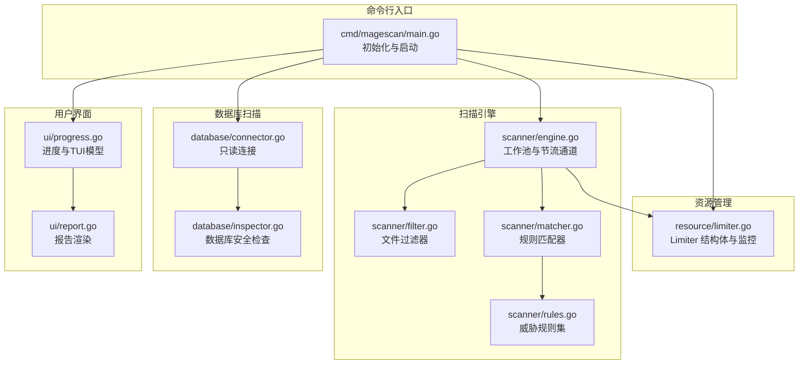
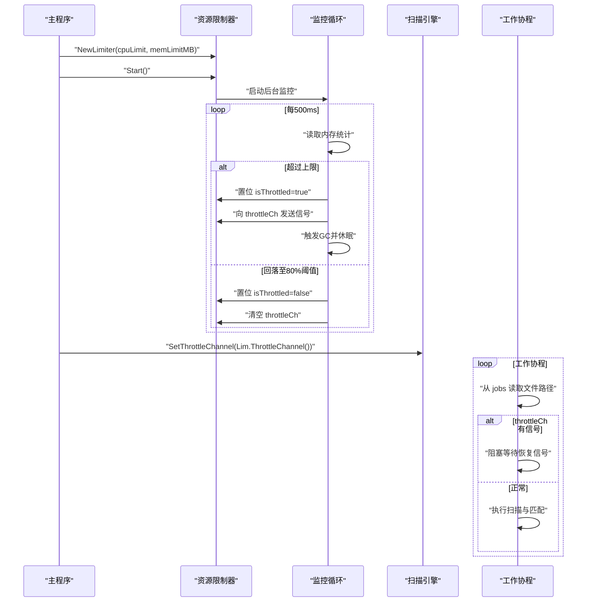
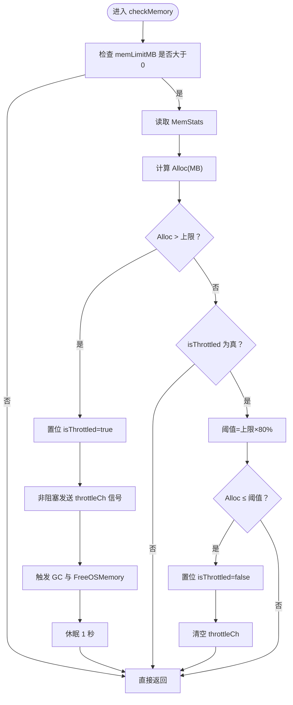
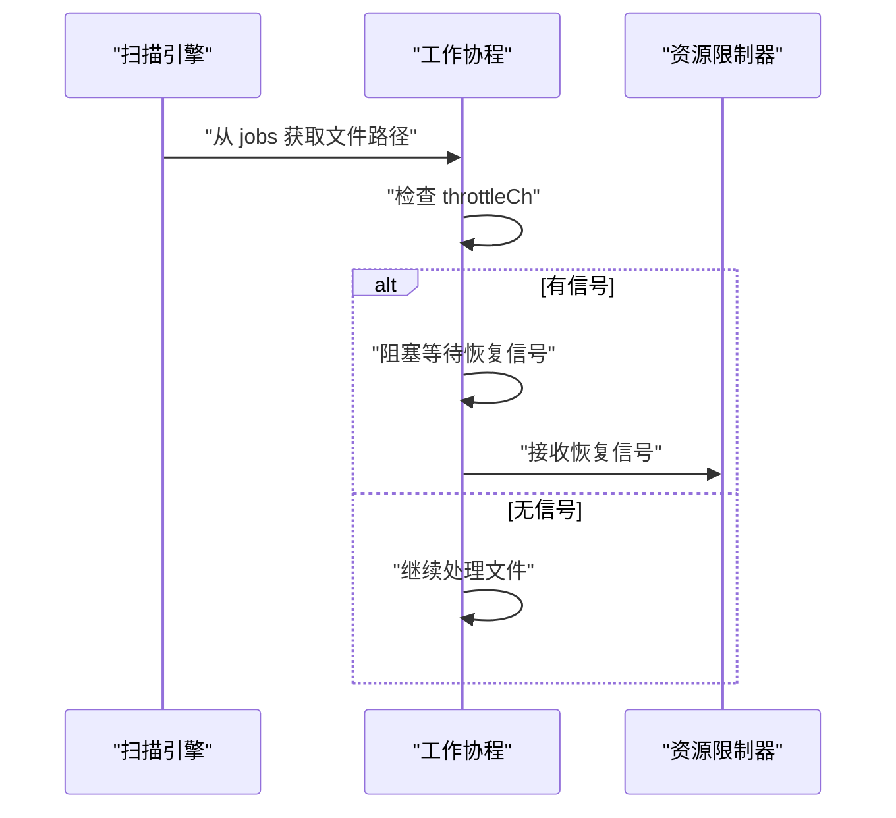
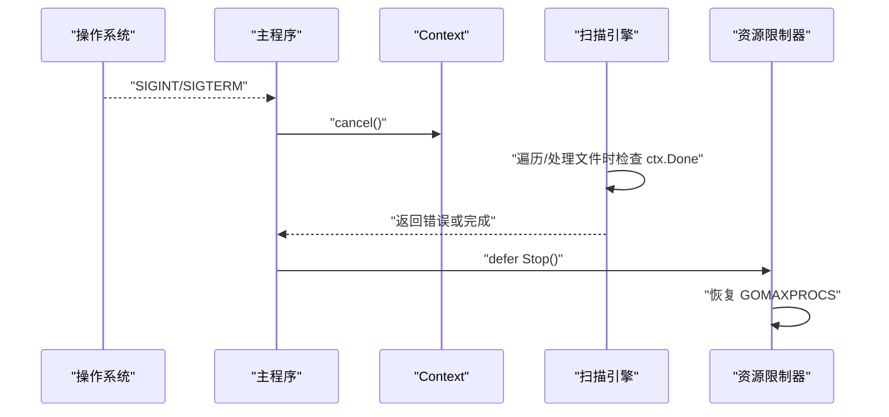
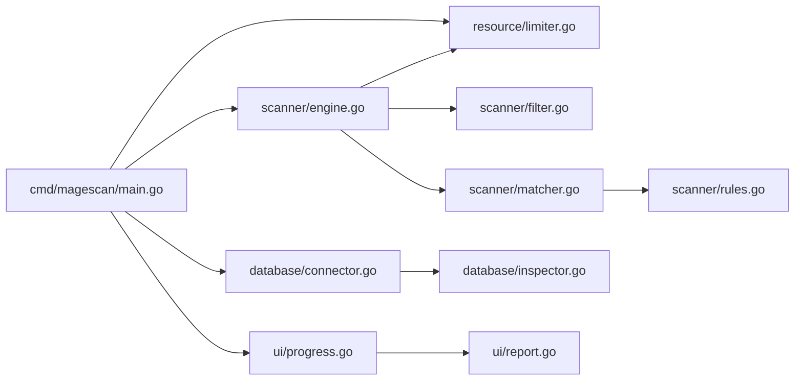

# 资源管理组件

<cite>
**本文档引用的文件**
- [limiter.go](file://resource/limiter.go)
- [main.go](file://cmd/magescan/main.go)
- [engine.go](file://scanner/engine.go)
- [progress.go](file://ui/progress.go)
- [config.go](file://config/config.go)
- [envphp.go](file://config/envphp.go)
- [connector.go](file://database/connector.go)
- [inspector.go](file://database/inspector.go)
- [filter.go](file://scanner/filter.go)
- [matcher.go](file://scanner/matcher.go)
- [rules.go](file://scanner/rules.go)
- [report.go](file://ui/report.go)
- [README.md](file://README.md)
</cite>

## 目录
1. [简介](#简介)
2. [项目结构](#项目结构)
3. [核心组件](#核心组件)
4. [架构总览](#架构总览)
5. [详细组件分析](#详细组件分析)
6. [依赖关系分析](#依赖关系分析)
7. [性能考量](#性能考量)
8. [故障排查指南](#故障排查指南)
9. [结论](#结论)
10. [附录](#附录)

## 简介
本设计文档聚焦于资源管理组件，系统性阐述 CPU 与内存限制的实现机制、动态调整与阈值监控、节流通道的工作原理与流量控制策略、资源使用统计与性能指标采集、高负载降级与优雅关闭机制，并提供配置最佳实践与性能调优建议。该组件以轻量、可插拔的方式集成到扫描引擎中，通过后台监控与通道信号实现对工作线程的自动节流，确保在高负载场景下稳定运行。

## 项目结构
资源管理组件位于 resource 包，核心为 Limiter 结构体及其配套方法；在主程序入口中初始化并启动 Limiter，随后将其节流通道注入扫描引擎；扫描引擎在工作协程中检查节流信号以实现暂停/恢复。



图表来源
- [main.go:62-126](file://cmd/magescan/main.go#L62-L126)
- [limiter.go:25-52](file://resource/limiter.go#L25-L52)
- [engine.go:61-74](file://scanner/engine.go#L61-L74)
- [engine.go:196-227](file://scanner/engine.go#L196-L227)
- [filter.go:57-97](file://scanner/filter.go#L57-L97)
- [matcher.go:34-42](file://scanner/matcher.go#L34-L42)
- [rules.go:50-58](file://scanner/rules.go#L50-L58)
- [connector.go:18-39](file://database/connector.go#L18-L39)
- [inspector.go:70-109](file://database/inspector.go#L70-L109)
- [progress.go:116-134](file://ui/progress.go#L116-L134)
- [report.go:57-168](file://ui/report.go#L57-L168)

章节来源
- [main.go:24-126](file://cmd/magescan/main.go#L24-L126)
- [limiter.go:11-52](file://resource/limiter.go#L11-L52)
- [engine.go:47-74](file://scanner/engine.go#L47-L74)

## 核心组件
- 资源限制器（Limiter）
  - 负责设置 CPU 核心上限与内存上限，启动后台监控，提供节流通道与状态查询接口。
  - 关键字段：CPU 限制、内存限制、节流通道、停止通道、是否节流标记、原始 GOMAXPROCS。
  - 关键方法：Start、Stop、ThrottleChannel、IsThrottled。
- 扫描引擎（Engine）
  - 维护工作池、进度通道、节流通道；在工作协程中检查节流信号以暂停处理。
  - 关键字段：根路径、过滤器、匹配器、工作协程数、统计数据、进度通道、节流通道。
  - 关键方法：SetThrottleChannel、Scan、worker。
- 主程序（main）
  - 解析 CLI 参数，初始化 Limiter 并启动；将 Limiter 注入扫描引擎；设置信号处理与优雅退出；驱动 UI 与报告输出。

章节来源
- [limiter.go:11-52](file://resource/limiter.go#L11-L52)
- [engine.go:47-74](file://scanner/engine.go#L47-L74)
- [main.go:62-126](file://cmd/magescan/main.go#L62-L126)

## 架构总览
资源管理组件采用“监控-通知-暂停”的闭环机制：
- 后台定时器周期性检查内存使用；
- 当超过阈值时，置位节流标志并通过节流通道发送信号；
- 工作协程在处理前检查节流通道，收到信号后阻塞直至恢复；
- 内存回落至 80% 阈值时解除节流，清空通道以释放等待的协程。



图表来源
- [limiter.go:64-117](file://resource/limiter.go#L64-L117)
- [engine.go:196-227](file://scanner/engine.go#L196-L227)
- [main.go:94-126](file://cmd/magescan/main.go#L94-L126)

## 详细组件分析

### 资源限制器（Limiter）设计
- CPU 限制
  - 在 Start 中根据配置调用 runtime.GOMAXPROCS 设置最大并发；若未设置或超出可用核数，则回退到当前设置。
- 内存限制与阈值监控
  - 后台定时器每 500ms 读取 runtime.MemStats，计算已分配内存（MB）。
  - 超限时：
    - 置位 isThrottled；
    - 非阻塞地向 throttleCh 发送信号；
    - 触发 runtime.GC 与 debug.FreeOSMemory 以回收内存；
    - 休眠 1 秒给 GC 时间。
  - 回落阈值：当内存回落至上限的 80% 时解除节流，清空 throttleCh 以释放等待的协程。
- 停止与恢复
  - Stop 使用 once 保证幂等，关闭 stopCh 并恢复原始 GOMAXPROCS。



图表来源
- [limiter.go:78-117](file://resource/limiter.go#L78-L117)

章节来源
- [limiter.go:25-52](file://resource/limiter.go#L25-L52)
- [limiter.go:64-117](file://resource/limiter.go#L64-L117)

### 节流通道与流量控制策略
- 节流通道（throttleCh）
  - 类型为带缓冲的 struct{} 通道，容量为 1，用于单次节流信号的传递。
  - 工作协程在每次处理前检查该通道：若有信号则阻塞等待恢复信号；否则继续处理。
- 流量控制策略
  - 即时暂停：超限即刻发送信号，避免进一步内存增长。
  - 恢复条件：内存回落至 80% 阈值才解除节流，防止频繁抖动。
  - 非阻塞发送：避免监控线程被阻塞影响下一次检查。
  - 清空通道：解除节流时清空通道，确保所有等待的协程被释放。



图表来源
- [engine.go:196-227](file://scanner/engine.go#L196-L227)
- [limiter.go:89-116](file://resource/limiter.go#L89-L116)

章节来源
- [engine.go:196-227](file://scanner/engine.go#L196-L227)
- [limiter.go:29-57](file://resource/limiter.go#L29-L57)

### 扫描引擎中的资源管理集成
- 初始化与注入
  - 主程序创建 Limiter 并启动；随后创建 Engine 并调用 SetThrottleChannel 注入节流通道。
- 工作协程逻辑
  - 每个工作协程从 jobs 通道消费文件路径；
  - 处理前检查 throttleCh：若有信号则阻塞等待恢复信号；
  - 处理完成后按固定频率发送进度消息。
- 统计与进度
  - 引擎维护 TotalFiles、ScannedFiles、ThreatsFound 等原子计数；
  - 通过进度通道向 UI 发送实时进度。

```mermaid
classDiagram
class Engine {
+string rootPath
+ScanFilter filter
+Matcher matcher
+int workerCount
+[]Finding findings
+ScanStats stats
+chan ScanProgress progressCh
+chan struct{} throttleCh
+Scan(ctx) ([]Finding, error)
+GetStats() ScanStats
+worker(ctx, jobs)
+SetThrottleChannel(ch)
}
class Limiter {
+int cpuLimit
+int64 memLimitMB
+chan struct{} throttleCh
+chan struct{} stopCh
+Bool isThrottled
+int originalProcs
+Start()
+Stop()
+ThrottleChannel() chan struct{}
+IsThrottled() bool
}
Engine --> Limiter : "注入节流通道"
```

图表来源
- [engine.go:47-74](file://scanner/engine.go#L47-L74)
- [limiter.go:11-20](file://resource/limiter.go#L11-L20)

章节来源
- [engine.go:61-74](file://scanner/engine.go#L61-L74)
- [engine.go:196-227](file://scanner/engine.go#L196-L227)
- [main.go:94-126](file://cmd/magescan/main.go#L94-L126)

### 配置与默认行为
- CLI 参数
  - -cpu-limit：CPU 核心上限（0 表示不限制）。
  - -mem-limit：内存上限（MB，0 表示不限制）。
- 默认配置
  - config 包提供默认配置 NewDefaultConfig，其中 CPULimit 默认为 runtime.NumCPU()，MemLimit 默认为 512MB。
- 环境解析
  - config.ParseEnvPHP 从 app/etc/env.php 提取数据库配置与表前缀，供数据库扫描使用。

章节来源
- [main.go:28-29](file://cmd/magescan/main.go#L28-L29)
- [config.go:34-47](file://config/config.go#L34-L47)
- [envphp.go:14-71](file://config/envphp.go#L14-L71)

### 性能指标与统计
- 扫描引擎统计
  - TotalFiles：扫描开始前统计的文件总数；
  - ScannedFiles：已扫描文件数（原子自增）；
  - ThreatsFound：发现威胁数（原子自增）；
  - CurrentFile：当前处理文件路径。
- UI 进度
  - FileProgressMsg 与 DBProgressMsg 将扫描进度与数据库扫描阶段传递给 TUI；
  - TUI 模型根据进度更新进度条、威胁数量与耗时。

章节来源
- [engine.go:30-45](file://scanner/engine.go#L30-L45)
- [engine.go:123-131](file://scanner/engine.go#L123-L131)
- [progress.go:14-31](file://ui/progress.go#L14-L31)
- [progress.go:54-82](file://ui/progress.go#L54-L82)

### 高负载降级与优雅关闭
- 降级策略
  - 内存超限时自动节流，暂停工作协程处理，触发 GC 与内存回收，降低内存压力。
  - 回落阈值采用 80% 的滞回策略，避免频繁切换导致抖动。
- 优雅关闭
  - 主程序注册 SIGINT/SIGTERM 信号处理器，收到信号后取消上下文；
  - 扫描引擎在遍历目录与处理文件时检查 ctx.Done，及时退出；
  - Limiter 在 Stop 中恢复 GOMAXPROCS，确保资源清理。



图表来源
- [main.go:67-76](file://cmd/magescan/main.go#L67-L76)
- [main.go:94-126](file://cmd/magescan/main.go#L94-L126)
- [limiter.go:46-52](file://resource/limiter.go#L46-L52)

章节来源
- [main.go:67-76](file://cmd/magescan/main.go#L67-L76)
- [limiter.go:46-52](file://resource/limiter.go#L46-L52)

## 依赖关系分析
- 组件耦合
  - main 与 limiter：main 创建并启动 Limiter，注入到 Engine。
  - engine 与 limiter：engine 通过 SetThrottleChannel 接收节流通道。
  - engine 与 filter/matcher：engine 使用过滤器与匹配器进行内容扫描。
  - main 与 database：main 在解析 env.php 成功后创建 Connector 与 Inspector。
- 外部依赖
  - Go 标准库 runtime、time、sync、context、os/signal 等。
  - 第三方 UI 框架 Bubble Tea（tea）与样式库 lipgloss。



图表来源
- [main.go:62-126](file://cmd/magescan/main.go#L62-L126)
- [limiter.go:25-52](file://resource/limiter.go#L25-L52)
- [engine.go:61-74](file://scanner/engine.go#L61-L74)
- [matcher.go:34-42](file://scanner/matcher.go#L34-L42)
- [rules.go:50-58](file://scanner/rules.go#L50-L58)
- [connector.go:18-39](file://database/connector.go#L18-L39)
- [inspector.go:70-109](file://database/inspector.go#L70-L109)
- [progress.go:116-134](file://ui/progress.go#L116-L134)
- [report.go:57-168](file://ui/report.go#L57-L168)

章节来源
- [main.go:62-126](file://cmd/magescan/main.go#L62-L126)
- [limiter.go:25-52](file://resource/limiter.go#L25-L52)
- [engine.go:61-74](file://scanner/engine.go#L61-L74)

## 性能考量
- CPU 利用率
  - 通过 GOMAXPROCS 限制最大并发；默认不设限时使用全部 CPU 核心。
  - 扫描引擎工作协程数为 2×NumCPU，适合 I/O 密集型扫描任务。
- 内存管理
  - 大文件采用重叠分块读取（1MB），减少峰值内存占用。
  - 监控线程定期触发 GC 并释放系统内存，缓解内存压力。
- 调度与抖动抑制
  - 80% 回落阈值有效抑制频繁启停带来的抖动。
- I/O 与网络
  - 数据库连接设置最大打开连接数与空闲连接数，避免过度占用数据库资源。

章节来源
- [limiter.go:35-44](file://resource/limiter.go#L35-L44)
- [engine.go:66](file://scanner/engine.go#L66)
- [engine.go:134-161](file://scanner/engine.go#L134-L161)
- [engine.go:262-285](file://scanner/engine.go#L262-L285)
- [connector.go:27-28](file://database/connector.go#L27-L28)

## 故障排查指南
- 内存持续上涨
  - 检查 mem-limit 是否设置过低或为 0；确认监控线程是否正常运行。
  - 观察是否频繁触发 GC 与休眠，必要时提高上限或减少并发。
- 工作协程长时间阻塞
  - 确认 throttleCh 是否被正确清空；检查是否遗漏恢复信号。
- CPU 利用率异常
  - 检查 -cpu-limit 是否设置合理；确认 GOMAXPROCS 是否被正确恢复。
- 优雅关闭无效
  - 确认信号处理是否注册；检查 ctx.Done 是否在遍历与处理中被正确检查。

章节来源
- [limiter.go:64-117](file://resource/limiter.go#L64-L117)
- [engine.go:196-227](file://scanner/engine.go#L196-L227)
- [main.go:67-76](file://cmd/magescan/main.go#L67-L76)

## 结论
资源管理组件通过“后台监控 + 节流通道 + 滞回阈值”的组合，在不改变扫描逻辑的前提下实现了对 CPU 与内存的动态约束。其设计简洁可靠，具备良好的稳定性与可扩展性，适用于不同规模的 Magento 安全扫描任务。配合优雅关闭与进度反馈，能够在高负载环境下保持系统可控与用户体验良好。

## 附录

### 资源限制配置最佳实践
- CPU 限制
  - 生产环境建议设置为物理 CPU 数的一半或更低，留出余量应对突发 I/O。
  - 开发测试可设为 0 或较高值以提升吞吐。
- 内存限制
  - 默认 512MB 可作为保守起点；根据目标站点规模与文件大小逐步调优。
  - 对大型站点或大文件较多的站点，建议提高 mem-limit 至 1GB 或更高。
- 混合策略
  - 在高并发与大文件场景下，优先保证内存上限，再根据实际效果微调 CPU 限制。

章节来源
- [config.go:34-47](file://config/config.go#L34-L47)
- [README.md:74-98](file://README.md#L74-L98)

### 性能调优建议
- 文件扫描
  - 使用 fast 模式快速定位可疑文件，再按需启用 full 模式深入检查。
  - 合理设置工作协程数（默认 2×NumCPU），避免过多协程导致上下文切换开销。
- 内存优化
  - 大文件采用分块读取，避免一次性加载；监控线程定期触发 GC。
  - 在高负载场景下适当降低并发或提高内存上限。
- 数据库扫描
  - 控制数据库连接数，避免对生产库造成过大压力。
  - 仅扫描必要表，关注敏感字段与近期记录。

章节来源
- [README.md:253-257](file://README.md#L253-L257)
- [engine.go:66](file://scanner/engine.go#L66)
- [engine.go:262-285](file://scanner/engine.go#L262-L285)
- [connector.go:27-28](file://database/connector.go#L27-L28)