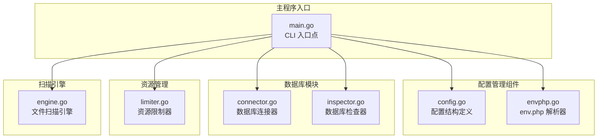
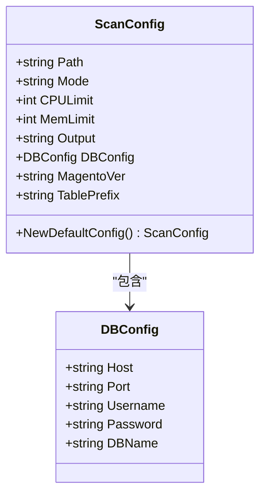
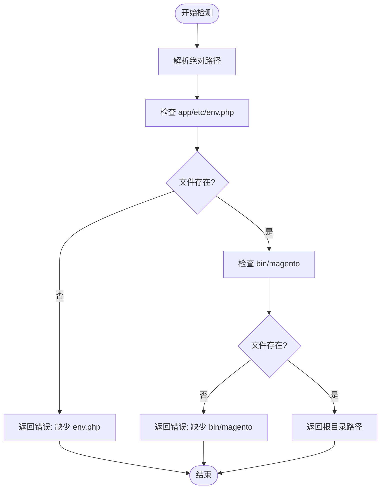
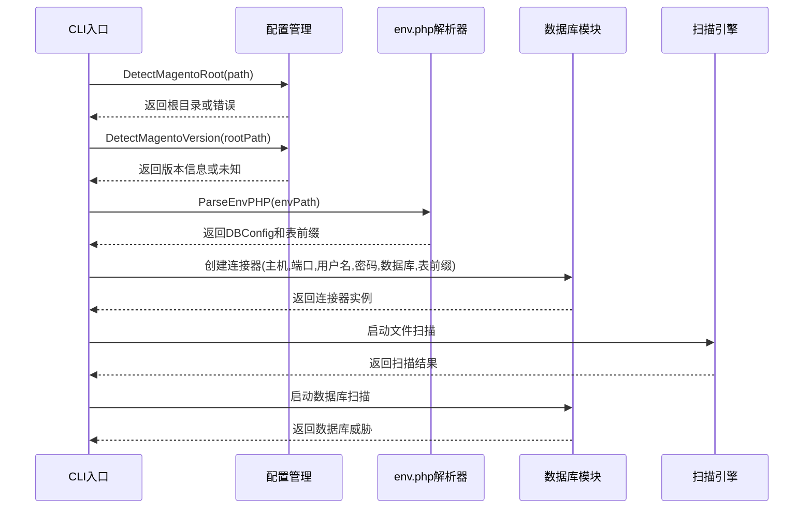
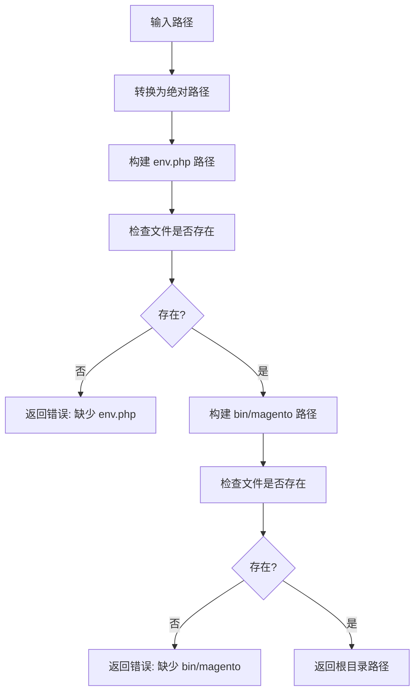
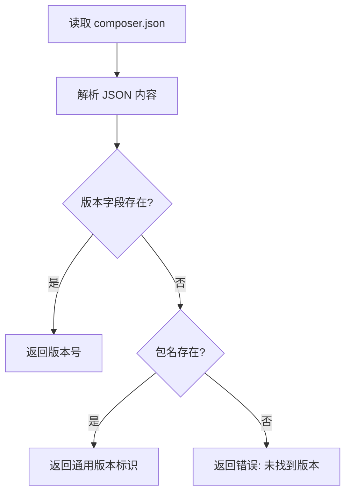
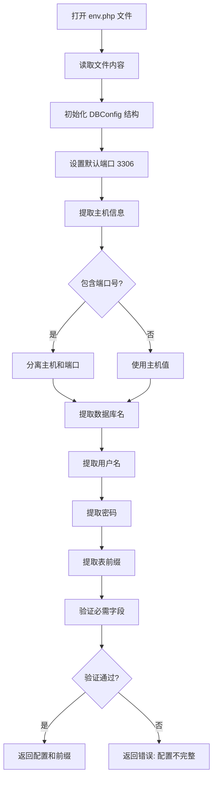
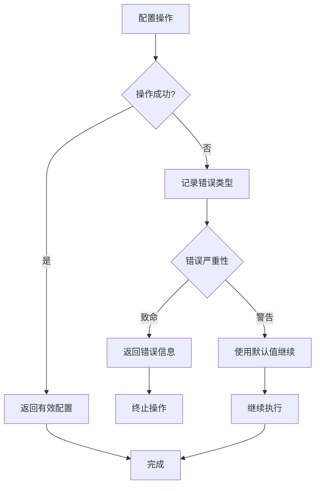
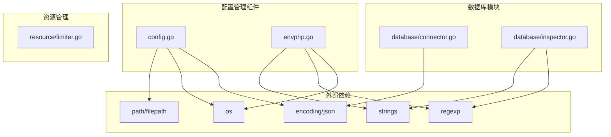

# 配置管理组件

<cite>
**本文档中引用的文件**
- [main.go](file://cmd/magescan/main.go)
- [config.go](file://config/config.go)
- [envphp.go](file://config/envphp.go)
- [connector.go](file://database/connector.go)
- [inspector.go](file://database/inspector.go)
- [limiter.go](file://resource/limiter.go)
- [engine.go](file://scanner/engine.go)
- [README.md](file://README.md)
- [go.mod](file://go.mod)
</cite>

## 目录
1. [简介](#简介)
2. [项目结构](#项目结构)
3. [核心组件](#核心组件)
4. [架构概览](#架构概览)
5. [详细组件分析](#详细组件分析)
6. [依赖关系分析](#依赖关系分析)
7. [性能考虑](#性能考虑)
8. [故障排除指南](#故障排除指南)
9. [结论](#结论)

## 简介

配置管理组件是 MageScan Magento 2 安全扫描器的核心模块，负责处理 Magento 安装环境的自动检测、版本识别、配置文件解析以及数据库连接配置。该组件确保扫描器能够正确识别目标 Magento 环境并提取必要的配置信息来进行安全扫描。

该组件主要包含三个核心功能：
- **Magento 根目录自动检测**：验证目录结构和文件存在性
- **Magento 版本检测**：从 composer.json 中提取版本信息
- **env.php 配置解析**：提取数据库连接参数和表前缀

## 项目结构

配置管理组件位于 `config/` 目录下，与应用程序的其他模块协同工作：

**图表来源**
- [config.go:1-108](file://config/config.go#L1-L108)
- [envphp.go:1-88](file://config/envphp.go#L1-L88)
- [main.go:1-208](file://cmd/magescan/main.go#L1-L208)

**章节来源**
- [config.go:1-108](file://config/config.go#L1-L108)
- [envphp.go:1-88](file://config/envphp.go#L1-L88)
- [main.go:1-208](file://cmd/magescan/main.go#L1-L208)

## 核心组件

### 配置数据结构

配置管理组件定义了两个核心数据结构来管理扫描配置：

**图表来源**
- [config.go:13-47](file://config/config.go#L13-L47)

### 自动检测机制

配置管理组件提供了完整的 Magento 环境自动检测功能：

**图表来源**
- [config.go:49-71](file://config/config.go#L49-L71)

**章节来源**
- [config.go:13-108](file://config/config.go#L13-L108)

## 架构概览

配置管理组件在整个应用程序架构中的位置和交互关系：

**图表来源**
- [main.go:35-126](file://cmd/magescan/main.go#L35-L126)
- [config.go:49-107](file://config/config.go#L49-L107)
- [envphp.go:10-71](file://config/envphp.go#L10-L71)

## 详细组件分析

### Magento 根目录检测器

Magento 根目录检测器实现了严格的目录结构验证机制：

#### 检测流程

**图表来源**
- [config.go:52-71](file://config/config.go#L52-L71)

#### 目录结构验证规则

检测器采用双文件验证机制：
- **必需文件1**: `app/etc/env.php` - Magento 配置文件
- **必需文件2**: `bin/magento` - Magento 命令行工具

这种设计确保了检测到的目录确实是有效的 Magento 2 安装根目录。

**章节来源**
- [config.go:49-71](file://config/config.go#L49-L71)

### Magento 版本检测器

版本检测器通过解析 `composer.json` 文件来确定 Magento 版本：

#### 版本检测算法

**图表来源**
- [config.go:80-107](file://config/config.go#L80-L107)

#### 版本兼容性判断

版本检测支持以下格式：
- **精确版本**: 直接返回 `composer.json` 中的版本号
- **通用版本**: 当包名为 `magento/magento2ce` 或 `magento/magento2ee` 时，返回通用标识
- **未知版本**: 当无法解析版本信息时返回错误

**章节来源**
- [config.go:73-107](file://config/config.go#L73-L107)

### env.php 配置解析器

env.php 解析器专门处理 Magento 的数据库配置文件：

#### 解析流程

**图表来源**
- [envphp.go:14-71](file://config/envphp.go#L14-L71)

#### 数据库连接参数提取

解析器支持以下配置参数的提取：
- **主机地址**: 支持 `host` 和 `host:port` 格式
- **数据库名称**: `dbname` 参数
- **用户名**: `username` 参数  
- **密码**: `password` 参数
- **表前缀**: `table_prefix` 参数（可选）

#### 表前缀识别机制

表前缀识别采用正则表达式匹配：
- 支持单引号和双引号字符串
- 处理空字符串值
- 默认端口设置为 3306

**章节来源**
- [envphp.go:10-88](file://config/envphp.go#L10-L88)

### 配置验证逻辑

配置管理组件实现了多层次的验证机制：

#### 错误处理策略

**图表来源**
- [main.go:35-46](file://cmd/magescan/main.go#L35-L46)

#### 验证规则

1. **必需配置验证**: 主机和数据库名必须同时存在
2. **文件存在性验证**: 关键配置文件必须可访问
3. **格式验证**: 配置值必须符合预期格式
4. **权限验证**: 配置文件必须具有适当的读取权限

**章节来源**
- [envphp.go:65-70](file://config/envphp.go#L65-L70)
- [main.go:106-122](file://cmd/magescan/main.go#L106-L122)

## 依赖关系分析

配置管理组件的依赖关系图：

**图表来源**
- [config.go:5-11](file://config/config.go#L5-L11)
- [envphp.go:3-8](file://config/envphp.go#L3-L8)
- [connector.go:3-8](file://database/connector.go#L3-L8)
- [inspector.go:3-9](file://database/inspector.go#L3-L9)

**章节来源**
- [go.mod:5-10](file://go.mod#L5-L10)
- [config.go:5-11](file://config/config.go#L5-L11)
- [envphp.go:3-8](file://config/envphp.go#L3-L8)

## 性能考虑

配置管理组件在设计时充分考虑了性能优化：

### 内存使用优化

- **延迟加载**: 配置文件仅在需要时读取
- **流式处理**: 大文件采用分块读取方式
- **内存回收**: 及时释放不再使用的资源

### 并发处理

- **异步检测**: 配置检测与主扫描流程并行执行
- **资源限制**: 通过 Limiter 组件控制并发度
- **优雅降级**: 在资源不足时自动降低扫描强度

### 最佳实践建议

1. **缓存配置**: 将检测到的配置信息缓存到内存中
2. **批量处理**: 对多个目标进行批处理扫描
3. **资源监控**: 实时监控系统资源使用情况
4. **超时控制**: 为长时间操作设置合理的超时时间

## 故障排除指南

### 常见问题及解决方案

#### Magento 根目录检测失败

**症状**: 提示不是有效的 Magento 根目录

**可能原因**:
- 目录结构不正确
- 缺少必需文件
- 权限不足

**解决方法**:
1. 验证目录包含 `app/etc/env.php` 和 `bin/magento`
2. 检查文件权限是否正确
3. 使用绝对路径而非相对路径

#### 版本检测失败

**症状**: 版本显示为 "Unknown"

**可能原因**:
- `composer.json` 文件损坏
- 版本信息缺失
- 文件权限问题

**解决方法**:
1. 检查 `composer.json` 文件完整性
2. 确认文件具有适当的读取权限
3. 手动指定版本信息

#### env.php 解析错误

**症状**: 数据库配置解析失败

**可能原因**:
- `env.php` 文件格式错误
- 配置值格式不正确
- 文件编码问题

**解决方法**:
1. 验证 `env.php` 文件语法正确
2. 检查配置值的引号和转义字符
3. 确认文件编码为 UTF-8

#### 数据库连接问题

**症状**: 无法连接到数据库

**可能原因**:
- 连接参数错误
- 网络连接问题
- 数据库服务不可用

**解决方法**:
1. 验证主机、端口、用户名和密码
2. 检查网络连通性
3. 确认数据库服务正在运行

**章节来源**
- [main.go:37-46](file://cmd/magescan/main.go#L37-L46)
- [main.go:118-122](file://cmd/magescan/main.go#L118-L122)

## 结论

配置管理组件为 MageScan 提供了可靠的 Magento 环境检测和配置解析能力。通过严格的目录结构验证、智能的版本检测算法和稳健的配置解析机制，该组件确保了扫描器能够在各种环境中稳定运行。

### 主要优势

1. **可靠性**: 多层验证机制确保配置准确性
2. **兼容性**: 支持多种 Magento 版本和配置格式
3. **性能**: 优化的内存使用和并发处理
4. **易用性**: 简洁的 API 设计和清晰的错误信息

### 未来改进方向

1. **配置缓存**: 实现配置信息的持久化缓存
2. **增量检测**: 支持增量配置检测以提高效率
3. **配置模板**: 提供标准的配置模板文件
4. **配置验证**: 增强配置格式的验证规则

该组件的设计充分体现了 Go 语言的简洁性和可靠性，为 Magento 安全扫描提供了坚实的基础。