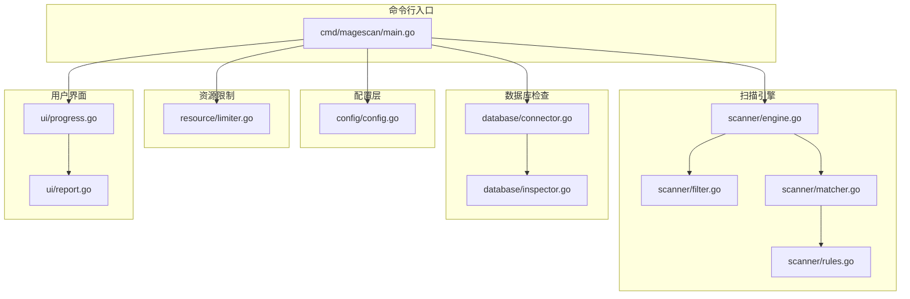
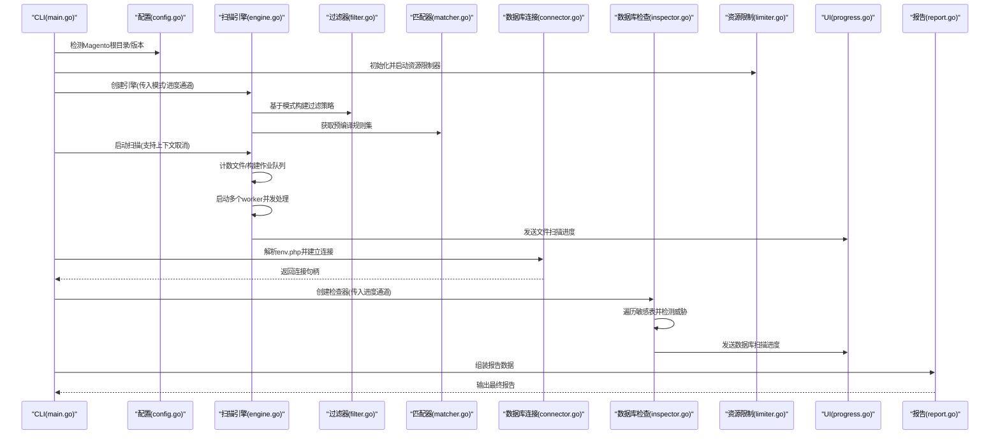
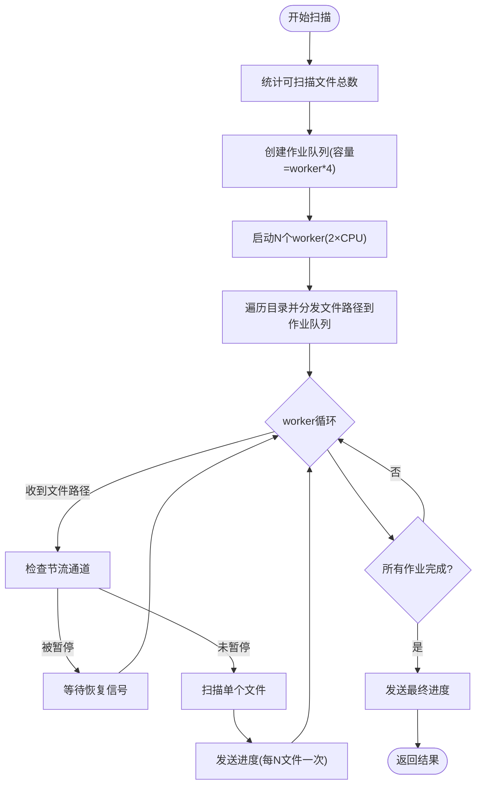
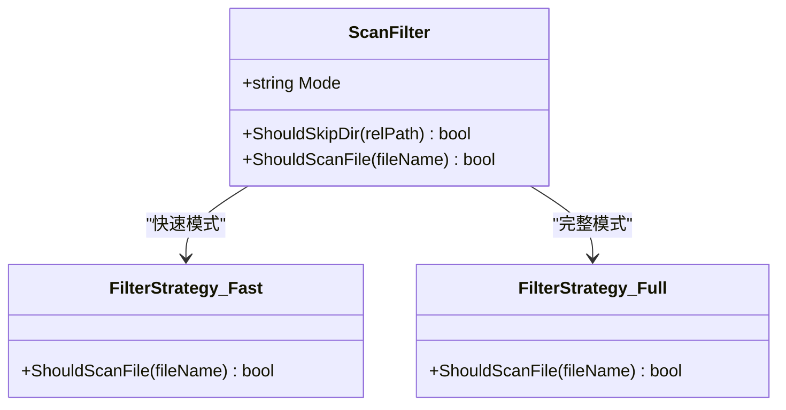
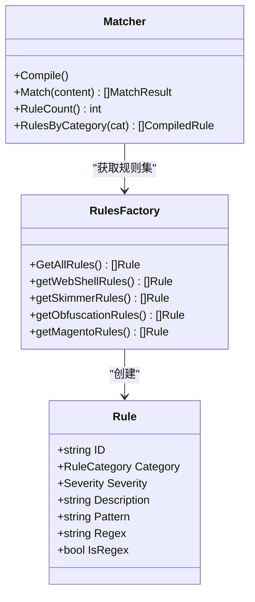
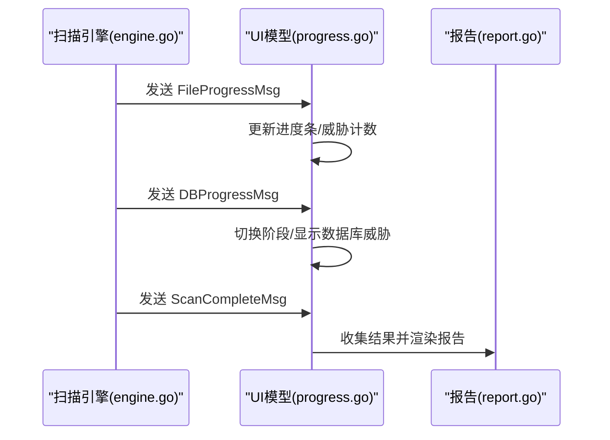
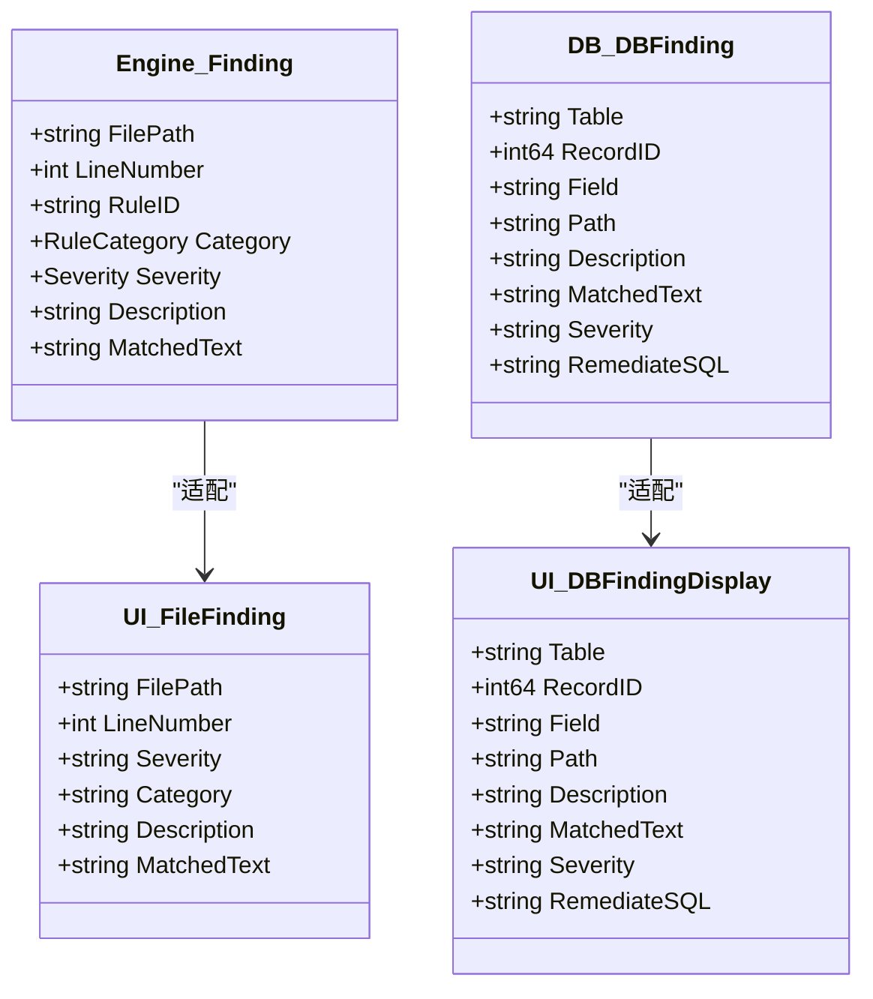
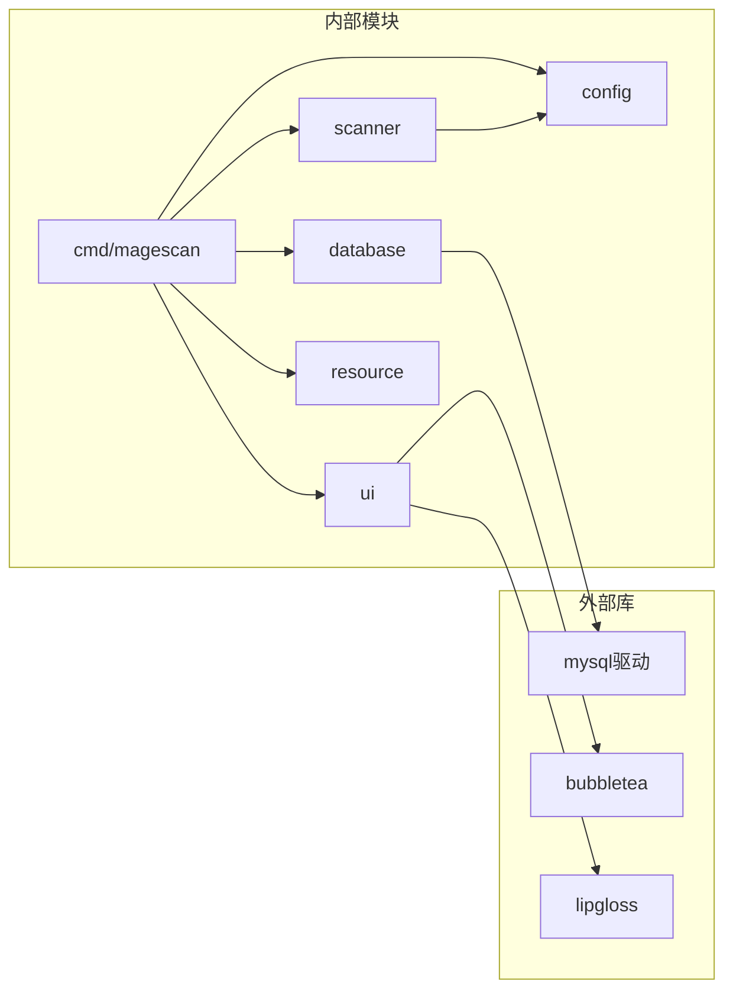

# 设计模式应用

<cite>
**本文档引用的文件**
- [main.go](file://cmd/magescan/main.go)
- [engine.go](file://scanner/engine.go)
- [filter.go](file://scanner/filter.go)
- [matcher.go](file://scanner/matcher.go)
- [rules.go](file://scanner/rules.go)
- [limiter.go](file://resource/limiter.go)
- [connector.go](file://database/connector.go)
- [inspector.go](file://database/inspector.go)
- [progress.go](file://ui/progress.go)
- [report.go](file://ui/report.go)
- [config.go](file://config/config.go)
- [README.md](file://README.md)
- [go.mod](file://go.mod)
</cite>

## 目录
1. [简介](#简介)
2. [项目结构](#项目结构)
3. [核心组件](#核心组件)
4. [架构总览](#架构总览)
5. [详细组件分析](#详细组件分析)
6. [依赖分析](#依赖分析)
7. [性能考虑](#性能考虑)
8. [故障排除指南](#故障排除指南)
9. [结论](#结论)

## 简介
本文件系统性梳理 MageScan 在扫描引擎与 UI 进度监控中所采用的设计模式，并结合实际代码路径进行深入解析。重点覆盖以下设计模式的应用场景：
- 工作池模式：在扫描引擎中实现 worker 的创建、任务队列管理与负载均衡
- 策略模式：在扫描模式切换中实现“快速扫描”与“完整扫描”的策略选择
- 工厂模式：在规则创建中按威胁类型生成相应的检测规则
- 观察者模式：在进度监控中实现 UI 对扫描进度变化的监听
- 适配器模式：在不同组件间进行数据转换（如从扫描结果到报告展示）

同时，本文提供面向开发者的实践建议与最佳实践，帮助读者在类似安全扫描或并发处理场景中复用这些设计模式。

## 项目结构
项目采用按功能域划分的模块化组织方式，清晰分离 CLI 入口、配置解析、扫描引擎、数据库检查、资源限制、UI 展示与报告渲染等职责。

图表来源
- [main.go:1-208](file://cmd/magescan/main.go#L1-L208)
- [config.go:1-108](file://config/config.go#L1-L108)
- [engine.go:1-323](file://scanner/engine.go#L1-L323)
- [filter.go:1-98](file://scanner/filter.go#L1-L98)
- [matcher.go:1-168](file://scanner/matcher.go#L1-L168)
- [rules.go:1-468](file://scanner/rules.go#L1-L468)
- [connector.go:1-58](file://database/connector.go#L1-L58)
- [inspector.go:1-359](file://database/inspector.go#L1-L359)
- [limiter.go:1-118](file://resource/limiter.go#L1-L118)
- [progress.go:1-289](file://ui/progress.go#L1-L289)
- [report.go:1-230](file://ui/report.go#L1-L230)

章节来源
- [README.md:239-259](file://README.md#L239-L259)
- [go.mod:1-31](file://go.mod#L1-L31)

## 核心组件
- 扫描引擎（工作池）：负责文件遍历、任务分发、并发扫描与进度上报
- 文件过滤器：根据扫描模式决定目录跳过与文件类型筛选
- 模式匹配器：预编译规则，线程安全地执行字面量与正则匹配
- 数据库连接器与检查器：只读连接、表前缀处理与威胁检测
- 资源限制器：CPU/内存监控与自动节流
- UI 模型与报告：TUI 进度监听与最终报告渲染

章节来源
- [engine.go:47-131](file://scanner/engine.go#L47-L131)
- [filter.go:8-98](file://scanner/filter.go#L8-L98)
- [matcher.go:22-82](file://scanner/matcher.go#L22-L82)
- [connector.go:10-58](file://database/connector.go#L10-L58)
- [inspector.go:63-114](file://database/inspector.go#L63-L114)
- [limiter.go:11-62](file://resource/limiter.go#L11-L62)
- [progress.go:54-82](file://ui/progress.go#L54-L82)
- [report.go:11-230](file://ui/report.go#L11-L230)

## 架构总览
下图展示了从 CLI 启动到 UI 渲染的端到端流程，以及各组件间的交互关系。

图表来源
- [main.go:24-207](file://cmd/magescan/main.go#L24-L207)
- [engine.go:61-121](file://scanner/engine.go#L61-L121)
- [filter.go:56-98](file://scanner/filter.go#L56-L98)
- [matcher.go:34-42](file://scanner/matcher.go#L34-L42)
- [connector.go:16-39](file://database/connector.go#L16-L39)
- [inspector.go:70-109](file://database/inspector.go#L70-L109)
- [limiter.go:34-52](file://resource/limiter.go#L34-L52)
- [progress.go:14-31](file://ui/progress.go#L14-L31)
- [report.go:57-168](file://ui/report.go#L57-L168)

## 详细组件分析

### 工作池模式：扫描引擎的并发实现
工作池模式通过固定数量的 worker 并发消费作业队列，实现高吞吐与负载均衡。在 MageScan 中：
- 作业队列容量：worker 数量的 4 倍，避免阻塞
- worker 数量：CPU 核心数的两倍，充分利用多核
- 节流通道：当内存超限时，通过通道信号暂停/恢复 worker
- 上下文取消：支持优雅退出，避免僵尸进程

图表来源
- [engine.go:76-121](file://scanner/engine.go#L76-L121)
- [engine.go:163-193](file://scanner/engine.go#L163-L193)
- [engine.go:195-227](file://scanner/engine.go#L195-L227)
- [engine.go:229-323](file://scanner/engine.go#L229-L323)
- [limiter.go:54-62](file://resource/limiter.go#L54-L62)
- [limiter.go:78-117](file://resource/limiter.go#L78-L117)

章节来源
- [engine.go:61-121](file://scanner/engine.go#L61-L121)
- [engine.go:195-227](file://scanner/engine.go#L195-L227)
- [limiter.go:34-62](file://resource/limiter.go#L34-L62)

最佳实践
- 作业队列容量应与 worker 数量成比例，避免过度阻塞
- 使用原子计数与互斥锁保护共享状态，确保线程安全
- 结合上下文取消与通道信号，实现优雅停机
- 大文件采用重叠分块读取，平衡内存占用与扫描效率

### 策略模式：扫描模式切换（快速 vs 完整）
策略模式通过封装不同的扫描策略（快速/完整），在运行时动态选择合适的策略。在 MageScan 中：
- 快速模式：仅扫描 .php 与 .phtml
- 完整模式：排除大量静态资源后扫描其余可疑文件
- 策略由过滤器根据模式参数选择

图表来源
- [filter.go:8-98](file://scanner/filter.go#L8-L98)

章节来源
- [filter.go:56-98](file://scanner/filter.go#L56-L98)

最佳实践
- 将模式切换逻辑集中到单一入口（过滤器），便于扩展新策略
- 保持策略接口稳定，避免频繁修改调用方代码
- 在 CLI 层明确传递模式参数，保证一致性

### 工厂模式：规则创建与分类
工厂模式用于按威胁类型创建相应的检测规则集合。在 MageScan 中：
- 规则工厂方法聚合四类规则：WebShell/Backdoor、Payment Skimmer、Obfuscation、Magento-Specific
- 匹配器在初始化时一次性编译所有规则，提升运行时性能

图表来源
- [rules.go:39-58](file://scanner/rules.go#L39-L58)
- [rules.go:50-58](file://scanner/rules.go#L50-L58)
- [matcher.go:34-42](file://scanner/matcher.go#L34-L42)
- [matcher.go:44-61](file://scanner/matcher.go#L44-L61)

章节来源
- [rules.go:50-58](file://scanner/rules.go#L50-L58)
- [matcher.go:34-61](file://scanner/matcher.go#L34-L61)

最佳实践
- 将规则定义与匹配逻辑解耦，便于维护与扩展
- 预编译正则表达式，减少运行时开销
- 提供按类别筛选规则的能力，支持精细化匹配

### 观察者模式：进度监控与 UI 更新
观察者模式通过消息通道实现 UI 对扫描进度的实时监听。在 MageScan 中：
- 文件扫描进度：通过通道发送 ScanProgress
- 数据库扫描进度：通过通道发送 DBProgress
- UI 模型接收消息并更新界面状态

图表来源
- [engine.go:105-113](file://scanner/engine.go#L105-L113)
- [engine.go:313-321](file://scanner/engine.go#L313-L321)
- [inspector.go:332-341](file://database/inspector.go#L332-L341)
- [progress.go:14-31](file://ui/progress.go#L14-L31)
- [progress.go:161-179](file://ui/progress.go#L161-L179)
- [progress.go:180-183](file://ui/progress.go#L180-L183)

章节来源
- [engine.go:38-45](file://scanner/engine.go#L38-L45)
- [inspector.go:23-29](file://database/inspector.go#L23-L29)
- [progress.go:14-31](file://ui/progress.go#L14-L31)

最佳实践
- 使用带缓冲的通道，避免阻塞生产者
- 在 UI 层统一处理消息，降低耦合度
- 提供阶段性完成信号，便于 UI 切换状态

### 适配器模式：组件间数据转换
适配器模式用于在不同组件之间进行数据格式转换，使 UI 展示与底层扫描结果解耦。在 MageScan 中：
- 扫描引擎输出 Finding -> UI FileFinding
- 数据库检查器输出 DBFinding -> UI DBFindingDisplay
- 报告渲染层统一格式化输出

图表来源
- [engine.go:19-28](file://scanner/engine.go#L19-L28)
- [inspector.go:11-21](file://database/inspector.go#L11-L21)
- [progress.go:32-52](file://ui/progress.go#L32-L52)
- [report.go:11-20](file://ui/report.go#L11-L20)

章节来源
- [engine.go:294-305](file://scanner/engine.go#L294-L305)
- [inspector.go:156-166](file://database/inspector.go#L156-L166)
- [progress.go:32-52](file://ui/progress.go#L32-L52)
- [report.go:163-187](file://ui/report.go#L163-L187)

最佳实践
- 明确适配边界，避免跨层直接依赖
- 在适配层做必要的字段映射与格式化
- 保持 UI 数据结构稳定，便于后续扩展

## 依赖分析
- 外部依赖：Bubble Tea（TUI）、MySQL 驱动、颜色样式库
- 内部模块：cmd/magescan 作为编排中心，协调 config、scanner、database、resource、ui
- 关键耦合点：通道通信（进度与节流）、上下文取消、规则工厂与匹配器

图表来源
- [go.mod:5-30](file://go.mod#L5-L30)
- [main.go:3-20](file://cmd/magescan/main.go#L3-L20)

章节来源
- [go.mod:1-31](file://go.mod#L1-L31)

## 性能考虑
- 并发策略：worker 数量为 CPU 核心数的两倍，兼顾吞吐与系统稳定性
- 内存控制：资源限制器以 500ms 为周期监控内存，超过阈值触发节流，降至 80% 恢复
- I/O 优化：大文件采用重叠分块读取，避免一次性加载导致内存峰值
- 正则编译：匹配器在初始化时一次性编译所有规则，运行时避免重复编译
- 通道缓冲：进度通道与作业队列均设置合理缓冲，降低阻塞概率

章节来源
- [engine.go:13-17](file://scanner/engine.go#L13-L17)
- [engine.go:66-68](file://scanner/engine.go#L66-L68)
- [engine.go:85-86](file://scanner/engine.go#L85-L86)
- [engine.go:262-285](file://scanner/engine.go#L262-L285)
- [matcher.go:44-61](file://scanner/matcher.go#L44-L61)
- [limiter.go:64-117](file://resource/limiter.go#L64-L117)

## 故障排除指南
- 扫描卡住或无响应
  - 检查是否达到内存上限被节流，适当提高内存限制或降低 CPU 限制
  - 确认上下文未提前取消（SIGINT/SIGTERM）
- 数据库扫描失败
  - 确认数据库连接信息正确，表前缀与目标环境一致
  - 某些表可能不存在，检查错误日志并确认表存在性
- UI 进度不更新
  - 确认进度通道已正确传入 UI 模型
  - 检查通道是否被阻塞或关闭

章节来源
- [limiter.go:78-117](file://resource/limiter.go#L78-L117)
- [inspector.go:98-106](file://database/inspector.go#L98-L106)
- [progress.go:161-179](file://ui/progress.go#L161-L179)

## 结论
MageScan 在扫描引擎与 UI 进度监控中成功应用了多种设计模式：
- 工作池模式确保高并发与可扩展性
- 策略模式使扫描模式切换灵活可控
- 工厂模式简化规则创建与分类管理
- 观察者模式实现 UI 与扫描过程的松耦合
- 适配器模式完成组件间的数据转换

这些设计模式共同构成了一个高性能、可维护且易于扩展的安全扫描工具。开发者可在类似场景中借鉴这些实践，结合自身需求进行定制与演进。