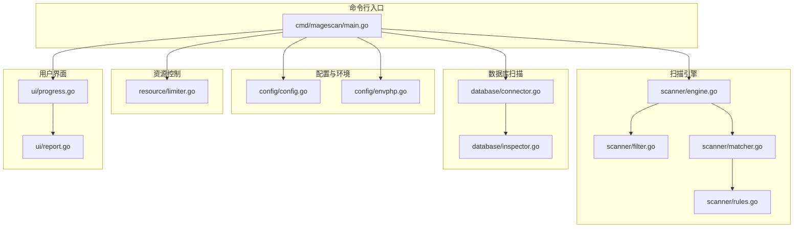
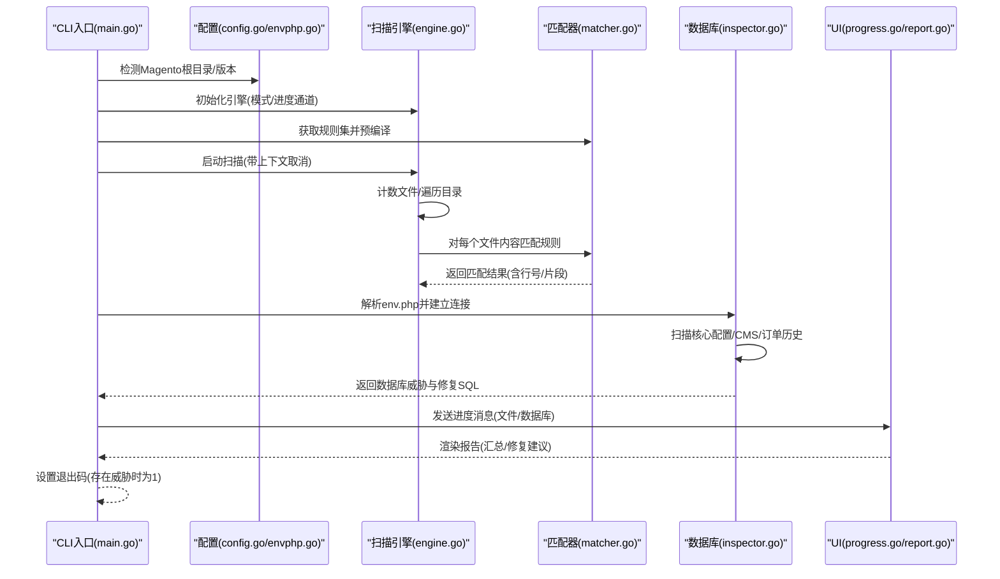
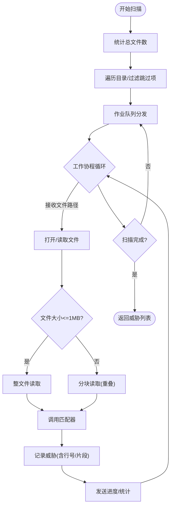
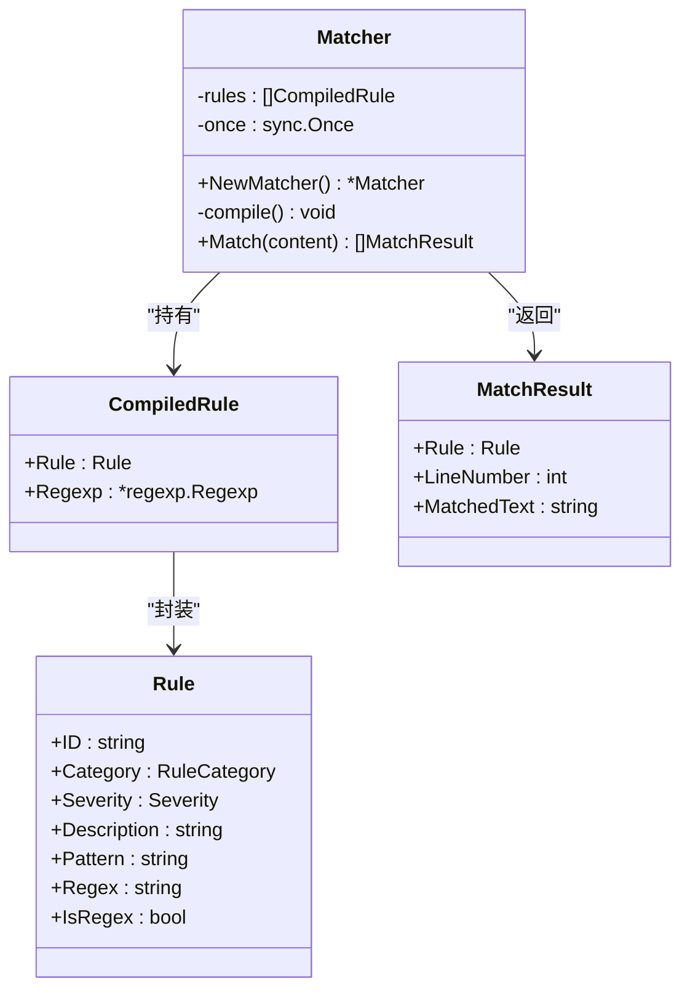
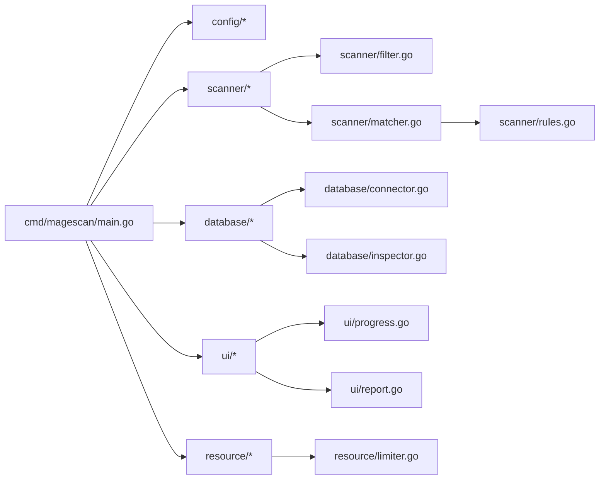

# Magento特定威胁检测

<cite>
**本文档引用的文件**
- [main.go](file://cmd/magescan/main.go)
- [engine.go](file://scanner/engine.go)
- [matcher.go](file://scanner/matcher.go)
- [rules.go](file://scanner/rules.go)
- [filter.go](file://scanner/filter.go)
- [config.go](file://config/config.go)
- [envphp.go](file://config/envphp.go)
- [connector.go](file://database/connector.go)
- [inspector.go](file://database/inspector.go)
- [limiter.go](file://resource/limiter.go)
- [progress.go](file://ui/progress.go)
- [report.go](file://ui/report.go)
- [go.mod](file://go.mod)
- [README.md](file://README.md)
</cite>

## 目录
1. [简介](#简介)
2. [项目结构](#项目结构)
3. [核心组件](#核心组件)
4. [架构总览](#架构总览)
5. [详细组件分析](#详细组件分析)
6. [依赖关系分析](#依赖关系分析)
7. [性能考量](#性能考量)
8. [故障排除指南](#故障排除指南)
9. [结论](#结论)
10. [附录](#附录)

## 简介
本技术文档面向Magento平台的安全运营与攻防人员，系统化阐述MageScan在Magento特定威胁检测方面的实现原理与检测规则。该工具专注于识别12类Magento特有攻击向量，包括但不限于：路径遍历包含Mage.php、非标准位置的Mage::app()调用、管理员凭据收集模式、支付数据写入图像文件、ForceType指令伪装PHP执行、JPEG头部Base64隐藏数据、Typosquatting会话Cookie、计划任务后门、修改.htaccess对非PHP文件启用PHP处理器、Magento配置文件凭据提取、直接数据库凭据访问、REST API令牌窃取等。文档从代码架构、匹配引擎、规则体系、数据库扫描、资源控制与UI呈现等维度进行深入解析，并提供检测方法、防护建议与最佳实践。

## 项目结构
项目采用分层模块化设计，围绕“只读扫描、并发高效、可扩展规则”三大目标构建：
- cmd/magescan：CLI入口，负责参数解析、环境探测、进度驱动与报告输出
- scanner：文件扫描引擎，含过滤器、匹配器、规则集与统计
- config：Magento根目录检测、版本识别、env.php解析
- database：数据库连接器与安全检查器，扫描核心配置表与CMS内容
- resource：CPU/内存限制器与自动节流
- ui：TUI进度显示与最终报告渲染

图表来源
- [main.go:24-207](file://cmd/magescan/main.go#L24-L207)
- [engine.go:61-323](file://scanner/engine.go#L61-L323)
- [matcher.go:34-168](file://scanner/matcher.go#L34-L168)
- [rules.go:50-468](file://scanner/rules.go#L50-L468)
- [filter.go:56-98](file://scanner/filter.go#L56-L98)
- [config.go:49-107](file://config/config.go#L49-L107)
- [envphp.go:14-87](file://config/envphp.go#L14-L87)
- [connector.go:16-57](file://database/connector.go#L16-L57)
- [inspector.go:70-359](file://database/inspector.go#L70-L359)
- [limiter.go:22-118](file://resource/limiter.go#L22-L118)
- [progress.go:116-289](file://ui/progress.go#L116-L289)
- [report.go:57-230](file://ui/report.go#L57-L230)

章节来源
- [README.md:24-249](file://README.md#L24-L249)
- [go.mod:1-31](file://go.mod#L1-L31)

## 核心组件
- 扫描引擎（Engine）：基于工作池并发扫描，支持快速/全量模式；对大文件采用重叠块读取避免内存峰值；内置进度通道与统计信息。
- 匹配器（Matcher）：预编译规则，支持字面量与正则两种匹配方式；线程安全，按行定位匹配文本片段。
- 规则集（Rules）：四大类别共70+签名，其中Magento特有威胁12条，覆盖WebShell、支付劫持、混淆与Magento特定攻击。
- 过滤器（ScanFilter）：根据模式跳过缓存、日志、静态资源与版本控制目录；按扩展名决定扫描范围。
- 配置与环境（Config/EnvPHP）：验证Magento根目录、读取版本信息、解析env.php中的数据库配置。
- 数据库扫描（Connector/Inspector）：连接MySQL，扫描核心配置表与CMS内容，生成修复SQL。
- 资源限制（Limiter）：动态监控内存使用，超限时阻塞工作线程，回落阈值恢复。
- UI（TUI/报告）：Bubble Tea驱动的实时进度，最终报告汇总威胁与修复建议。

章节来源
- [engine.go:47-323](file://scanner/engine.go#L47-L323)
- [matcher.go:22-168](file://scanner/matcher.go#L22-L168)
- [rules.go:50-468](file://scanner/rules.go#L50-L468)
- [filter.go:8-98](file://scanner/filter.go#L8-L98)
- [config.go:49-107](file://config/config.go#L49-L107)
- [envphp.go:14-87](file://config/envphp.go#L14-L87)
- [connector.go:16-57](file://database/connector.go#L16-L57)
- [inspector.go:70-359](file://database/inspector.go#L70-L359)
- [limiter.go:22-118](file://resource/limiter.go#L22-L118)
- [progress.go:116-289](file://ui/progress.go#L116-L289)
- [report.go:57-230](file://ui/report.go#L57-L230)

## 架构总览
下图展示从CLI到文件扫描、数据库扫描、资源控制与UI的完整流程。

图表来源
- [main.go:35-207](file://cmd/magescan/main.go#L35-L207)
- [engine.go:76-323](file://scanner/engine.go#L76-L323)
- [matcher.go:34-168](file://scanner/matcher.go#L34-L168)
- [inspector.go:79-359](file://database/inspector.go#L79-L359)
- [progress.go:140-197](file://ui/progress.go#L140-L197)
- [report.go:57-230](file://ui/report.go#L57-L230)

## 详细组件分析

### 扫描引擎（Engine）
- 并发模型：启动2×CPU核数的工作协程，通过作业通道分发文件路径；支持上下文取消与信号中断。
- 文件计数与遍历：先一次性统计待扫描文件数量，再遍历目录将文件路径投递至作业通道。
- 大文件处理：超过1MB的文件以1MB块+100字节重叠的方式读取，避免遗漏跨块匹配。
- 进度与统计：周期性发送扫描进度，记录已扫描文件数、威胁总数与当前文件名。
- 结果聚合：原子计数威胁数，线程安全追加发现项，最终返回全部威胁。

图表来源
- [engine.go:76-323](file://scanner/engine.go#L76-L323)

章节来源
- [engine.go:47-323](file://scanner/engine.go#L47-L323)

### 匹配器（Matcher）
- 规则加载：统一获取规则集，预编译正则表达式，忽略无效正则以防崩溃。
- 字面量匹配：使用bytes.Contains进行快速存在性检查，再逐行定位匹配行号。
- 正则匹配：对内容整体做快速匹配，再逐行查找子串，确保每行仅记录一次。
- 线程安全：规则集在初始化时一次性编译，后续只读共享；匹配过程无状态，可并发调用。

图表来源
- [matcher.go:22-168](file://scanner/matcher.go#L22-L168)
- [rules.go:39-48](file://scanner/rules.go#L39-L48)

章节来源
- [matcher.go:22-168](file://scanner/matcher.go#L22-L168)
- [rules.go:50-468](file://scanner/rules.go#L50-L468)

### 规则体系（Rules）
- 四大类别：
  - WebShell/Backdoor：34条，覆盖常见Web Shell、远程执行、上传持久化、LD_PRELOAD等。
  - Payment Skimmer：15条，覆盖CC数据访问、exfiltration、JS注入、WebSocket/WebRTC等。
  - Obfuscation：12条，覆盖编码、字符串拼接、变量变量、XOR解密等混淆手法。
  - Magento-Specific：12条，覆盖路径遍历包含、非标准位置的Mage::app()、管理员凭据收集、支付数据写入图像、ForceType伪装、JPEG头Base64隐藏、Typosquatting会话Cookie、计划任务后门、.htaccess修改、配置文件凭据提取、直接数据库凭据访问、REST API令牌窃取等。
- 规则字段：ID、分类、严重级别、描述、字面量或正则模式、是否正则。

章节来源
- [rules.go:50-468](file://scanner/rules.go#L50-L468)

### 过滤器（ScanFilter）
- 快速模式：仅扫描.php与.phtml文件，提升速度。
- 全量模式：排除图片、字体、CSS、媒体、日志、压缩包等常见非可疑类型。
- 目录跳过：缓存、日志、静态、版本控制、生成目录等。

章节来源
- [filter.go:8-98](file://scanner/filter.go#L8-L98)

### 配置与环境（Config/EnvPHP）
- Magento根目录检测：要求存在app/etc/env.php与bin/magento。
- 版本检测：从composer.json读取版本信息。
- env.php解析：提取数据库主机、端口、用户名、密码、数据库名与表前缀，支持host:port格式。

章节来源
- [config.go:49-107](file://config/config.go#L49-L107)
- [envphp.go:14-87](file://config/envphp.go#L14-L87)

### 数据库扫描（Connector/Inspector）
- 连接器：使用MySQL驱动，设置连接超时与最大连接数，Ping校验连通性。
- 安全检查器：扫描以下表与字段：
  - core_config_data：敏感路径与包含“script”/“html”的路径，以及任意HTML/脚本注入。
  - cms_block：content字段。
  - cms_page：content字段。
  - sales_order_status_history：最近1000条comment。
- 模式匹配：包含外部脚本、eval、iframe、javascript协议、document.write、base64_decode、可疑内联脚本、事件处理器注入、可疑TLD等。
- 修复SQL：为每个威胁生成UPDATE语句，提示管理员审查后执行。

章节来源
- [connector.go:16-57](file://database/connector.go#L16-L57)
- [inspector.go:79-359](file://database/inspector.go#L79-L359)

### 资源限制（Limiter）
- CPU限制：通过runtime.GOMAXPROCS设置最大并发；默认使用全部CPU核数。
- 内存限制：后台定时器每500ms读取内存统计，超过阈值触发节流；回落至80%阈值解除。
- 工作线程：通过单向通道阻塞/释放，实现非侵入式限流。

章节来源
- [limiter.go:22-118](file://resource/limiter.go#L22-L118)

### 用户界面（TUI/报告）
- TUI：实时显示文件扫描进度、当前文件、威胁数量与耗时；数据库扫描阶段显示当前阶段与记录数。
- 报告：汇总威胁数量与分类，按严重级别排序，输出文件威胁详情与数据库威胁详情及修复SQL。

章节来源
- [progress.go:116-289](file://ui/progress.go#L116-L289)
- [report.go:57-230](file://ui/report.go#L57-L230)

## 依赖关系分析
- 外部依赖：Bubble Tea用于TUI、MySQL驱动用于数据库连接。
- 模块间耦合：CLI作为编排者，依赖配置、扫描引擎、数据库与UI模块；扫描引擎内部由过滤器与匹配器协作；数据库模块独立于文件扫描但共享CLI的上下文与信号处理。

图表来源
- [main.go:13-20](file://cmd/magescan/main.go#L13-L20)
- [engine.go:3-11](file://scanner/engine.go#L3-L11)
- [matcher.go:3-7](file://scanner/matcher.go#L3-L7)
- [inspector.go:3-9](file://database/inspector.go#L3-L9)
- [limiter.go:3-9](file://resource/limiter.go#L3-L9)
- [progress.go:3-12](file://ui/progress.go#L3-L12)
- [report.go:3-9](file://ui/report.go#L3-L9)

章节来源
- [go.mod:5-10](file://go.mod#L5-L10)

## 性能考量
- 并发策略：工作协程数量为2×CPU核数，充分利用多核同时扫描文件。
- 内存优化：大文件分块读取并保留100字节重叠，避免跨块误判；内存超限时主动触发GC与休眠，降低峰值。
- I/O效率：字面量匹配使用bytes.Contains快速判断，减少正则开销；正则仅在存在潜在匹配时逐行扫描。
- 资源上限：CPU核数与内存MB可配置，防止在大型站点上占用过多资源。
- 上下文取消：支持SIGINT/SIGTERM优雅退出，避免资源泄漏。

[本节为通用性能讨论，无需具体文件分析]

## 故障排除指南
- 无法识别Magento根目录
  - 现象：提示缺少app/etc/env.php或bin/magento。
  - 排查：确认传入路径为Magento根目录，且文件存在。
  - 参考：[config.go:52-71](file://config/config.go#L52-L71)
- env.php解析失败
  - 现象：无法提取数据库配置。
  - 排查：检查env.php语法与键名一致性；确认host:port格式正确。
  - 参考：[envphp.go:14-87](file://config/envphp.go#L14-L87)
- 数据库连接失败
  - 现象：提示无法连接或Ping失败。
  - 排查：核对主机、端口、用户名、密码与数据库名；确认网络可达与权限足够。
  - 参考：[connector.go:18-39](file://database/connector.go#L18-L39)
- 扫描卡顿或内存过高
  - 现象：扫描缓慢或内存飙升。
  - 排查：降低cpu-limit与mem-limit；切换到fast模式；关闭不必要的后台进程。
  - 参考：[limiter.go:22-118](file://resource/limiter.go#L22-L118)
- 规则匹配异常
  - 现象：正则报错或未命中预期。
  - 排查：检查规则正则有效性；确认内容中存在换行导致的行级匹配问题。
  - 参考：[matcher.go:44-61](file://scanner/matcher.go#L44-L61)

章节来源
- [config.go:52-71](file://config/config.go#L52-L71)
- [envphp.go:14-87](file://config/envphp.go#L14-L87)
- [connector.go:18-39](file://database/connector.go#L18-L39)
- [limiter.go:22-118](file://resource/limiter.go#L22-L118)
- [matcher.go:44-61](file://scanner/matcher.go#L44-L61)

## 结论
MageScan通过高并发文件扫描、预编译规则匹配、数据库内容审计与资源自适应限流，形成对Magento平台的全栈威胁检测能力。其12条Magento特有规则精准覆盖了路径遍历、非标准调用、凭据窃取、支付劫持、伪装执行、隐藏数据、会话伪造、计划任务、.htaccess篡改、配置文件提取、数据库凭据直取与REST令牌窃取等关键攻击面。配合TUI进度与报告输出，既满足日常巡检，也便于应急响应与修复闭环。

[本节为总结性内容，无需具体文件分析]

## 附录

### Magento特有威胁检测规则详解
- 路径遍历包含Mage.php（MAGENTO-001）
  - 检测模式：包含../../../../../../app/Mage.php的路径遍历包含。
  - 影响：绕过标准入口直接加载核心框架，可能被用于后门执行。
  - 参考：[rules.go:405-410](file://scanner/rules.go#L405-L410)
- 非标准位置的Mage::app()调用（MAGENTO-002）
  - 检测模式：Mage::app()出现在非预期位置（如公共目录或模板文件）。
  - 影响：可能在非入口处初始化应用，隐藏恶意逻辑。
  - 参考：[rules.go:411-415](file://scanner/rules.go#L411-L415)
- 管理员凭据收集模式（MAGENTO-003）
  - 检测模式：admin_user与password相关的模式匹配。
  - 影响：尝试从请求或存储中提取管理员凭证。
  - 参考：[rules.go:416-420](file://scanner/rules.go#L416-L420)
- 支付数据写入图像文件（MAGENTO-004）
  - 检测模式：fopen与.jpg/.png/.gif结合，或payment/cc相关的写入。
  - 影响：将支付数据隐藏在图片文件中，规避常规审计。
  - 参考：[rules.go:421-425](file://scanner/rules.go#L421-L425)
- ForceType指令伪装PHP执行（MAGENTO-005）
  - 检测模式：ForceType application/x-httpd-php。
  - 影响：使非PHP扩展文件被Apache以PHP方式执行。
  - 参考：[rules.go:426-430](file://scanner/rules.go#L426-L430)
- JPEG头部Base64隐藏数据（MAGENTO-006）
  - 检测模式：JPEG-1.1与base64_encode相关模式。
  - 影响：在图片元数据中隐藏载荷。
  - 参考：[rules.go:431-435](file://scanner/rules.go#L431-L435)
- Typosquatting会话Cookie（MAGENTO-007）
  - 检测模式：setcookie("SESSIIID"等拼写错误的会话名。
  - 影响：伪造会话劫持。
  - 参考：[rules.go:436-440](file://scanner/rules.go#L436-L440)
- 计划任务后门（MAGENTO-008）
  - 检测模式：crontab、/etc/cron.*、schedule.*backdoor。
  - 影响：持久化后门，定期执行恶意逻辑。
  - 参考：[rules.go:441-445](file://scanner/rules.go#L441-L445)
- 修改.htaccess对非PHP文件启用PHP处理器（MAGENTO-009）
  - 检测模式：AddHandler.*php或AddType.*php.*\.(jpg|png|gif|css|js)。
  - 影响：扩大PHP执行范围，增加攻击面。
  - 参考：[rules.go:446-450](file://scanner/rules.go#L446-L450)
- Magento配置文件凭据提取（MAGENTO-010）
  - 检测模式：Mage::getConfig()->decrypt或decrypt.*password。
  - 影响：从配置中解密或读取敏感凭据。
  - 参考：[rules.go:451-455](file://scanner/rules.go#L451-L455)
- 直接数据库凭据访问（MAGENTO-011）
  - 检测模式：local.xml.*crypt或core_config_data.*payment。
  - 影响：直接读取数据库配置或支付相关配置。
  - 参考：[rules.go:456-460](file://scanner/rules.go#L456-L460)
- REST API令牌窃取（MAGENTO-012）
  - 检测模式：oauth_token.*secret或admin.*token.*bearer。
  - 影响：窃取管理API访问令牌。
  - 参考：[rules.go:461-465](file://scanner/rules.go#L461-L465)

### 检测方法与防护建议
- 检测方法
  - 使用fast模式进行快速筛查，定位可疑文件；必要时切换full模式扩大范围。
  - 结合数据库扫描，重点检查core_config_data、cms_block、cms_page与sales_order_status_history。
  - 利用TUI观察实时进度，结合报告中的修复SQL进行处置。
- 防护建议
  - 严格限制文件上传与写入权限，禁止在公共目录存放可执行代码。
  - 定期审计.htaccess与服务器配置，移除对非PHP文件启用PHP处理器的指令。
  - 强化会话管理，使用强随机会话名与安全Cookie属性。
  - 关闭不必要的计划任务与计划任务后门，定期清理异常cron条目。
  - 加固.env.php与配置文件，避免明文或弱加密存储敏感信息。
  - 建立数据库只读访问策略，限制可执行写操作的账户权限。

[本节为通用指导，无需具体文件分析]