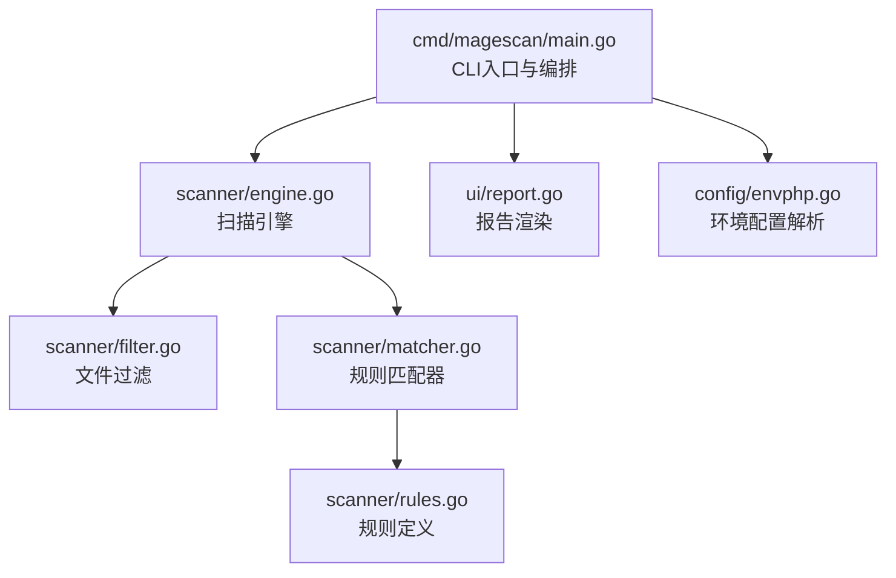
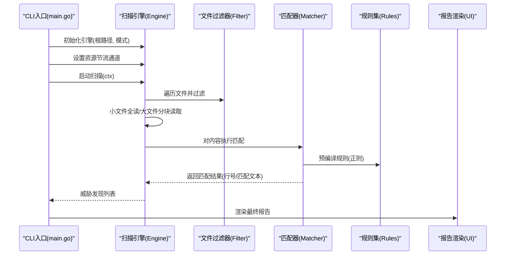
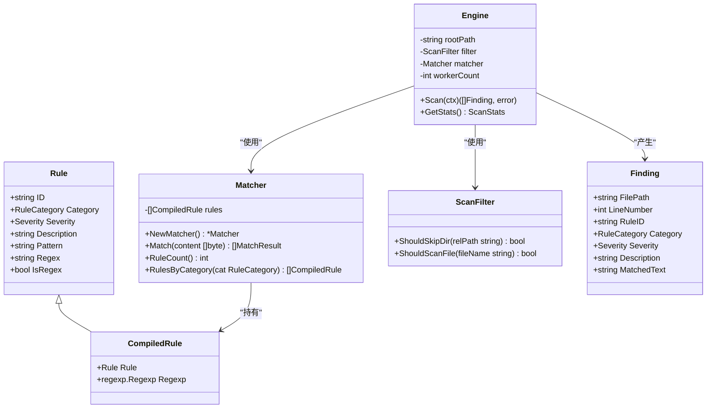

# Web Shell/Backdoor 检测

<cite>
**本文档引用的文件**
- [rules.go](file://scanner/rules.go)
- [matcher.go](file://scanner/matcher.go)
- [engine.go](file://scanner/engine.go)
- [filter.go](file://scanner/filter.go)
- [main.go](file://cmd/magescan/main.go)
- [report.go](file://ui/report.go)
- [README.md](file://README.md)
</cite>

## 目录
1. [简介](#简介)
2. [项目结构](#项目结构)
3. [核心组件](#核心组件)
4. [架构总览](#架构总览)
5. [详细组件分析](#详细组件分析)
6. [依赖关系分析](#依赖关系分析)
7. [性能考量](#性能考量)
8. [故障排查指南](#故障排查指南)
9. [结论](#结论)
10. [附录](#附录)

## 简介
本文件面向安全工程师与运维人员，系统化阐述该仓库中“Web Shell/Backdoor”检测能力的技术实现与规则体系。重点覆盖34个恶意签名的检测机制，包括但不限于：Base64编码eval执行、压缩编码eval、ROT13混淆eval、POST/GET/REQUEST数据直接eval、assert后门、动态函数创建、正则表达式/e修饰符、全局变量间接调用、系统命令执行、文件上传后门、PHP信息泄露、以及知名Web Shell标识符（c99shell、r57shell、WSO、FilesMan、b374k、Weevely）等。文档将从特征提取、正则匹配原理、字符串模式识别、严重级别分类与精度控制策略等方面进行深入解析，并提供具体示例与检测结果说明。

## 项目结构
该项目采用模块化分层设计：
- cmd/magescan：CLI入口，负责参数解析、环境探测、资源限制、进度通道与报告渲染。
- scanner：扫描引擎与规则集，包含规则定义、匹配器、过滤器与扫描流程。
- ui：终端用户界面与报告渲染。
- config：Magento根目录检测与env.php解析。
- database：数据库连接与威胁扫描（非本次主题）。
- resource：CPU/内存资源限制与自动节流。

图表来源
- [main.go:24-208](file://cmd/magescan/main.go#L24-L208)
- [engine.go:47-323](file://scanner/engine.go#L47-L323)
- [matcher.go:22-168](file://scanner/matcher.go#L22-L168)
- [rules.go:39-239](file://scanner/rules.go#L39-L239)
- [filter.go:8-98](file://scanner/filter.go#L8-L98)
- [report.go:57-230](file://ui/report.go#L57-L230)

章节来源
- [README.md:24-258](file://README.md#L24-L258)
- [main.go:24-208](file://cmd/magescan/main.go#L24-L208)

## 核心组件
- 规则定义（Rule）：包含ID、类别、严重级别、描述、字面量模式或正则表达式、是否为正则标志位。
- 匹配器（Matcher）：预编译所有正则规则，支持并发安全的快速匹配；提供字面量与正则两种匹配路径。
- 扫描引擎（Engine）：多工作线程并行扫描，支持大文件分块读取与重叠窗口，记录威胁发现并上报进度。
- 文件过滤器（ScanFilter）：根据扫描模式（fast/full）决定扫描范围，跳过缓存、日志、静态资源等目录与扩展名。
- 报告渲染（Report）：汇总统计、按严重级别排序、输出可读报告与修复建议。

章节来源
- [rules.go:39-239](file://scanner/rules.go#L39-L239)
- [matcher.go:22-168](file://scanner/matcher.go#L22-L168)
- [engine.go:47-323](file://scanner/engine.go#L47-L323)
- [filter.go:8-98](file://scanner/filter.go#L8-L98)
- [report.go:57-230](file://ui/report.go#L57-L230)

## 架构总览
下图展示从CLI到规则匹配与报告生成的端到端流程。

图表来源
- [main.go:94-126](file://cmd/magescan/main.go#L94-L126)
- [engine.go:76-121](file://scanner/engine.go#L76-L121)
- [engine.go:229-322](file://scanner/engine.go#L229-L322)
- [matcher.go:63-82](file://scanner/matcher.go#L63-L82)
- [rules.go:50-58](file://scanner/rules.go#L50-L58)

## 详细组件分析

### 规则体系与严重级别
- 规则类别：WebShell/Backdoor、Payment Skimmer、Obfuscation、Magento-Specific。
- 严重级别：CRITICAL/HIGH/MEDIUM/LOW，用于指导优先级处置。
- 规则加载：统一通过GetAllRules聚合各分类规则，WebShell类规则位于getWebShellRules。

章节来源
- [rules.go:29-37](file://scanner/rules.go#L29-L37)
- [rules.go:50-58](file://scanner/rules.go#L50-L58)
- [rules.go:66-239](file://scanner/rules.go#L66-L239)

### 字面量匹配与正则匹配
- 字面量匹配：使用bytes.Contains进行快速存在性检查，再逐行定位匹配行号，适合简单字符串模式。
- 正则匹配：在初始化时预编译规则，使用Find/FindAll等方法在逐行上查找，避免重复编译开销。
- 并发安全：匹配器内部使用sync.Once确保规则预编译仅执行一次，且Match方法可并发调用。

章节来源
- [matcher.go:44-61](file://scanner/matcher.go#L44-L61)
- [matcher.go:84-113](file://scanner/matcher.go#L84-L113)
- [matcher.go:115-143](file://scanner/matcher.go#L115-L143)

### 扫描引擎与文件处理
- 工作池：默认启动2×CPU核数的工作协程，提升扫描吞吐。
- 大文件处理：超过1MB的文件以1MB为块、100字节重叠的方式滑动读取，兼顾性能与完整性。
- 进度上报：周期性发送扫描进度消息，便于TUI实时反馈。
- 威胁记录：将匹配结果转换为Finding结构，包含文件路径、行号、规则ID、类别、严重级别、描述与匹配文本。

章节来源
- [engine.go:60-69](file://scanner/engine.go#L60-L69)
- [engine.go:195-227](file://scanner/engine.go#L195-L227)
- [engine.go:229-285](file://scanner/engine.go#L229-L285)
- [engine.go:287-322](file://scanner/engine.go#L287-L322)

### 文件过滤策略
- 快速模式（fast）：仅扫描.php与.phtml文件，显著减少扫描范围。
- 全量模式（full）：排除常见二进制与日志扩展名，保留可疑文本类型。
- 目录跳过：忽略缓存、日志、静态资源、版本控制与第三方依赖目录。

章节来源
- [filter.go:56-98](file://scanner/filter.go#L56-L98)

### 报告与严重级别呈现
- 统计汇总：按严重级别计数，输出总威胁数量。
- 排序规则：CRITICAL > HIGH > MEDIUM > LOW。
- 可读输出：高亮显示严重级别标签，截断过长匹配文本，提供修复建议（数据库威胁场景）。

章节来源
- [report.go:80-219](file://ui/report.go#L80-L219)

## 详细规则解析与检测机制

以下针对34个Web Shell/Backdoor检测规则逐一解析其特征、匹配原理与典型示例说明。为避免直接粘贴代码片段，本节仅提供路径与要点说明，便于读者在源码中定位对应规则。

### 1. Base64编码eval执行（WEBSHELL-001）
- 特征：eval(base64_decode(…)) 形式的远程代码执行。
- 匹配方式：字面量模式，快速定位。
- 严重级别：CRITICAL
- 示例说明：匹配到此类模式即视为高危后门入口，需立即隔离与清理。

章节来源
- [rules.go:68-72](file://scanner/rules.go#L68-L72)

### 2. 压缩编码eval（gzinflate/base64）（WEBSHELL-002）
- 特征：eval(gzinflate(base64_decode(…)))，常用于隐藏payload。
- 匹配方式：字面量模式。
- 严重级别：CRITICAL

章节来源
- [rules.go:74-77](file://scanner/rules.go#L74-L77)

### 3. 压缩编码eval（gzuncompress/base64）（WEBSHELL-003）
- 特征：eval(gzuncompress(base64_decode(…)))。
- 匹配方式：字面量模式。
- 严重级别：CRITICAL

章节来源
- [rules.go:80-82](file://scanner/rules.go#L80-L82)

### 4. ROT13混淆eval（WEBSHELL-004）
- 特征：eval(str_rot13(…))，通过ROT13混淆绕过简单检测。
- 匹配方式：字面量模式。
- 严重级别：CRITICAL

章节来源
- [rules.go:84-87](file://scanner/rules.go#L84-L87)

### 5. POST数据直接eval（WEBSHELL-005）
- 特征：eval($_POST[…])，接收外部请求执行任意代码。
- 匹配方式：字面量模式。
- 严重级别：CRITICAL

章节来源
- [rules.go:89-92](file://scanner/rules.go#L89-L92)

### 6. REQUEST数据直接eval（WEBSHELL-006）
- 特征：eval($_REQUEST[…])，同时兼容GET/POST。
- 匹配方式：字面量模式。
- 严重级别：CRITICAL

章节来源
- [rules.go:94-97](file://scanner/rules.go#L94-L97)

### 7. GET数据直接eval（WEBSHELL-007）
- 特征：eval($_GET[…])。
- 匹配方式：字面量模式。
- 严重级别：CRITICAL

章节来源
- [rules.go:99-102](file://scanner/rules.go#L99-L102)

### 8. Cookie数据直接eval（WEBSHELL-008）
- 特征：eval($_COOKIE[…])。
- 匹配方式：字面量模式。
- 严重级别：CRITICAL

章节来源
- [rules.go:104-107](file://scanner/rules.go#L104-L107)

### 9. assert后门（POST）（WEBSHELL-009）
- 特征：assert($_POST[…])，与eval类似但更隐蔽。
- 匹配方式：字面量模式。
- 严重级别：CRITICAL

章节来源
- [rules.go:110-112](file://scanner/rules.go#L110-L112)

### 10. assert后门（REQUEST）（WEBSHELL-010）
- 特征：assert($_REQUEST[…])。
- 匹配方式：字面量模式。
- 严重级别：CRITICAL

章节来源
- [rules.go:114-117](file://scanner/rules.go#L114-L117)

### 11. 动态函数创建（create_function）（WEBSHELL-011）
- 特征：create_function('', …)，动态构造函数执行输入。
- 匹配方式：字面量模式。
- 严重级别：HIGH

章节来源
- [rules.go:119-122](file://scanner/rules.go#L119-L122)

### 12. preg_replace与/e修饰符（WEBSHELL-012）
- 特征：preg_replace(..., '/e')，历史上允许代码执行（现已被弃用但仍具检测价值）。
- 匹配方式：正则模式，匹配/e修饰符。
- 严重级别：CRITICAL

章节来源
- [rules.go:124-127](file://scanner/rules.go#L124-L127)

### 13. GLOBALS间接函数调用（WEBSHELL-013）
- 特征：通过$GLOBALS数组间接调用函数，绕过静态分析。
- 匹配方式：正则模式，匹配$GLOBALS键值调用链。
- 严重级别：CRITICAL

章节来源
- [rules.go:129-132](file://scanner/rules.go#L129-L132)

### 14. system命令执行（WEBSHELL-014）
- 特征：system($_…)，执行系统命令。
- 匹配方式：字面量模式。
- 严重级别：CRITICAL

章节来源
- [rules.go:134-137](file://scanner/rules.go#L134-L137)

### 15. exec命令执行（WEBSHELL-015）
- 特征：exec($_…)，执行系统命令。
- 匹配方式：字面量模式。
- 严重级别：CRITICAL

章节来源
- [rules.go:139-142](file://scanner/rules.go#L139-L142)

### 16. passthru命令执行（WEBSHELL-016）
- 特征：passthru($_…)，透传命令输出。
- 匹配方式：字面量模式。
- 严重级别：CRITICAL

章节来源
- [rules.go:144-147](file://scanner/rules.go#L144-L147)

### 17. shell_exec命令执行（WEBSHELL-017）
- 特征：shell_exec($_…)，执行系统命令。
- 匹配方式：字面量模式。
- 严重级别：CRITICAL

章节来源
- [rules.go:149-152](file://scanner/rules.go#L149-L152)

### 18. popen命令执行（WEBSHELL-018）
- 特征：popen($_…)，打开进程管道。
- 匹配方式：字面量模式。
- 严重级别：CRITICAL

章节来源
- [rules.go:154-157](file://scanner/rules.go#L154-L157)

### 19. proc_open命令执行（WEBSHELL-019）
- 特征：proc_open(…, $_…)，高级进程控制。
- 匹配方式：正则模式，匹配proc_open与用户输入。
- 严重级别：CRITICAL

章节来源
- [rules.go:159-162](file://scanner/rules.go#L159-L162)

### 20. 文件上传后门（copy）（WEBSHELL-020）
- 特征：copy($_FILES[…], …)，将上传文件写入目标位置。
- 匹配方式：字面量模式。
- 严重级别：HIGH

章节来源
- [rules.go:164-167](file://scanner/rules.go#L164-L167)

### 21. 不受限制的文件上传（move_uploaded_file）（WEBSHELL-021）
- 特征：move_uploaded_file($_FILES[…], …)，未做类型校验。
- 匹配方式：字面量模式。
- 严重级别：HIGH

章节来源
- [rules.go:169-172](file://scanner/rules.go#L169-L172)

### 22. 文件写入（REQUEST数据）（WEBSHELL-022）
- 特征：file_put_contents(…, $_REQUEST/$_POST/$_GET)，持久化后门。
- 匹配方式：正则模式，匹配写入与用户输入。
- 严重级别：CRITICAL

章节来源
- [rules.go:174-177](file://scanner/rules.go#L174-L177)

### 23. PHP信息泄露（WEBSHELL-023）
- 特征：phpinfo()，暴露服务器敏感信息。
- 匹配方式：字面量模式。
- 严重级别：MEDIUM

章节来源
- [rules.go:179-182](file://scanner/rules.go#L179-L182)

### 24. c99shell标识符（WEBSHELL-024）
- 特征：字符串"c99shell"。
- 匹配方式：字面量模式。
- 严重级别：CRITICAL

章节来源
- [rules.go:184-187](file://scanner/rules.go#L184-L187)

### 25. r57shell标识符（WEBSHELL-025）
- 特征：字符串"r57shell"。
- 匹配方式：字面量模式。
- 严重级别：CRITICAL

章节来源
- [rules.go:189-192](file://scanner/rules.go#L189-L192)

### 26. WSO标识符（WEBSHELL-026）
- 特征：字符串"WSO"。
- 匹配方式：字面量模式。
- 严重级别：CRITICAL

章节来源
- [rules.go:194-197](file://scanner/rules.go#L194-L197)

### 27. FilesMan标识符（WEBSHELL-027）
- 特征：字符串"FilesMan"。
- 匹配方式：字面量模式。
- 严重级别：CRITICAL

章节来源
- [rules.go:199-202](file://scanner/rules.go#L199-L202)

### 28. b374k标识符（WEBSHELL-028）
- 特征：字符串"b374k"。
- 匹配方式：字面量模式。
- 严重级别：CRITICAL

章节来源
- [rules.go:204-207](file://scanner/rules.go#L204-L207)

### 29. Weevely标识符（WEBSHELL-029）
- 特征：字符串"weevely"。
- 匹配方式：字面量模式。
- 严重级别：CRITICAL

章节来源
- [rules.go:209-212](file://scanner/rules.go#L209-L212)

### 30. PHPShell标识符（WEBSHELL-030）
- 特征：字符串"PHPSHELL_VERSION"。
- 匹配方式：字面量模式。
- 严重级别：CRITICAL

章节来源
- [rules.go:214-217](file://scanner/rules.go#L214-L217)

### 31. phpFileManager标识符（WEBSHELL-031）
- 特征：字符串"phpFileManager"。
- 匹配方式：字面量模式。
- 严重级别：HIGH

章节来源
- [rules.go:219-222](file://scanner/rules.go#L219-L222)

### 32. Adminer标识符（潜在后门）（WEBSHELL-032）
- 特征：字符串"@link http://www.adminer.org"，数据库管理工具可能被滥用。
- 匹配方式：字面量模式。
- 严重级别：MEDIUM

章节来源
- [rules.go:224-227](file://scanner/rules.go#L224-L227)

### 33. Visbot后门（Magento）（WEBSHELL-033）
- 特征：正则匹配特定注释与版本标记，如包含"Magento.*Visbot"。
- 匹配方式：正则模式。
- 严重级别：CRITICAL

章节来源
- [rules.go:229-232](file://scanner/rules.go#L229-L232)

### 34. LD_PRELOAD后门（killall）（WEBSHELL-034）
- 特征：字符串"killall -9"，常与LD_PRELOAD结合进行系统级破坏。
- 匹配方式：字面量模式。
- 严重级别：CRITICAL

章节来源
- [rules.go:234-237](file://scanner/rules.go#L234-L237)

## 依赖关系分析

图表来源
- [rules.go:39-48](file://scanner/rules.go#L39-L48)
- [matcher.go:9-27](file://scanner/matcher.go#L9-L27)
- [engine.go:19-58](file://scanner/engine.go#L19-L58)
- [filter.go:8-98](file://scanner/filter.go#L8-L98)

章节来源
- [rules.go:39-48](file://scanner/rules.go#L39-L48)
- [matcher.go:9-27](file://scanner/matcher.go#L9-L27)
- [engine.go:19-58](file://scanner/engine.go#L19-L58)
- [filter.go:8-98](file://scanner/filter.go#L8-L98)

## 性能考量
- 规则预编译：在单例初始化阶段一次性编译所有正则规则，避免运行时重复编译成本。
- 并发匹配：Match方法支持并发调用，提高多核环境下的整体吞吐。
- 分块读取：大文件采用1MB块+100字节重叠滑窗，平衡内存占用与完整性。
- 资源限制：通过资源限制器与节流通道实现CPU/内存上限与自动暂停/恢复。
- 进度上报：周期性发送扫描进度，便于用户感知与中断控制。

章节来源
- [matcher.go:44-61](file://scanner/matcher.go#L44-L61)
- [engine.go:195-227](file://scanner/engine.go#L195-L227)
- [engine.go:261-285](file://scanner/engine.go#L261-L285)
- [main.go:62-66](file://cmd/magescan/main.go#L62-L66)

## 故障排查指南
- 规则无效或编译失败：匹配器在编译阶段会跳过无效正则，不会导致程序崩溃。若发现某条规则未生效，检查其正则语法。
- 大文件误报/漏报：确认是否为大文件场景，必要时调整扫描模式或增加内存限制。
- 过多误报：可通过切换到fast模式减少扫描范围，或在生产环境中配合人工复核。
- 进度卡顿：检查资源限制器是否触发节流，适当提高CPU/内存上限。

章节来源
- [matcher.go:52-58](file://scanner/matcher.go#L52-L58)
- [engine.go:261-285](file://scanner/engine.go#L261-L285)
- [main.go:62-66](file://cmd/magescan/main.go#L62-L66)

## 结论
该扫描器通过明确的规则分类与严格的匹配策略，实现了对34类Web Shell/Backdoor模式的高效检测。其核心优势在于：
- 规则集中管理与预编译优化；
- 并发扫描与分块读取兼顾性能与稳定性；
- 严谨的严重级别与报告呈现，便于优先处置与修复。

建议在生产环境中结合fast/full模式与资源限制策略，配合人工复核与修复，形成闭环的安全审计流程。

## 附录

### 检测精度控制策略
- 字面量匹配优先：对于确定性模式（如eval(base64_decode(…))），使用字面量匹配以获得更快响应。
- 正则匹配谨慎使用：仅在必要时启用，注意正则复杂度与回溯风险。
- 严重级别分级：CRITICAL/HIGH/MEDIUM/LOW用于指导处置优先级，避免“信息过载”。

章节来源
- [rules.go:66-239](file://scanner/rules.go#L66-L239)
- [matcher.go:84-143](file://scanner/matcher.go#L84-L143)