# 支付窃取器检测

<cite>
**本文档引用的文件**
- [main.go](file://cmd/magescan/main.go)
- [rules.go](file://scanner/rules.go)
- [engine.go](file://scanner/engine.go)
- [matcher.go](file://scanner/matcher.go)
- [filter.go](file://scanner/filter.go)
- [config.go](file://config/config.go)
- [inspector.go](file://database/inspector.go)
- [report.go](file://ui/report.go)
- [README.md](file://README.md)
</cite>

## 目录
1. [简介](#简介)
2. [项目结构](#项目结构)
3. [核心组件](#核心组件)
4. [架构概览](#架构概览)
5. [支付窃取器检测机制详解](#支付窃取器检测机制详解)
6. [Magecart攻击链检测策略](#magecart攻击链检测策略)
7. [数据外泄通道分析](#数据外泄通道分析)
8. [隐蔽传输技术检测](#隐蔽传输技术检测)
9. [性能考虑](#性能考虑)
10. [故障排除指南](#故障排除指南)
11. [结论](#结论)

## 简介

MageScan是一个专为Magento 2平台设计的高精度安全扫描器，专注于检测支付窃取器（Magecart）和其他恶意威胁。该工具通过70多个恶意签名规则，能够有效识别信用卡数据窃取、数据外泄和隐蔽传输技术，为电商平台提供全面的安全保障。

本文档深入分析了15个恶意签名的检测机制，包括信用卡号直接访问器、CVV数据访问器、邮件和CURL数据外泄、表单数据拦截、结账页面数据拦截、请求数据序列化外泄、CURL POST字段、已知窃取器域名模式、SVG onload脚本执行、WebSocket和RTCDataChannel隐蔽通道、支付拦截模式、Base64编码POST数据序列化、JavaScript键盘记录器等检测规则。

## 项目结构

MageScan采用模块化架构设计，主要包含以下核心模块：

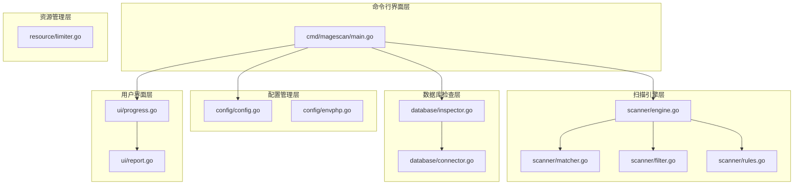

**图表来源**
- [main.go:1-208](file://cmd/magescan/main.go#L1-L208)
- [config.go:1-108](file://config/config.go#L1-L108)
- [engine.go:1-323](file://scanner/engine.go#L1-L323)

**章节来源**
- [main.go:24-126](file://cmd/magescan/main.go#L24-L126)
- [README.md:241-249](file://README.md#L241-L249)

## 核心组件

### 扫描引擎架构

MageScan的核心扫描引擎采用了高性能的并发架构，支持多线程文件扫描和智能资源管理：

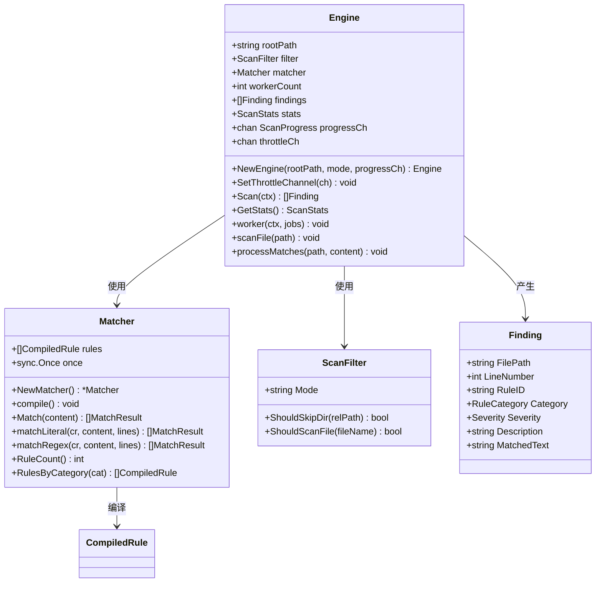

**图表来源**
- [engine.go:47-323](file://scanner/engine.go#L47-L323)
- [matcher.go:22-168](file://scanner/matcher.go#L22-L168)
- [filter.go:8-98](file://scanner/filter.go#L8-L98)

### 规则系统设计

支付窃取器检测规则系统采用分类化的签名匹配机制：

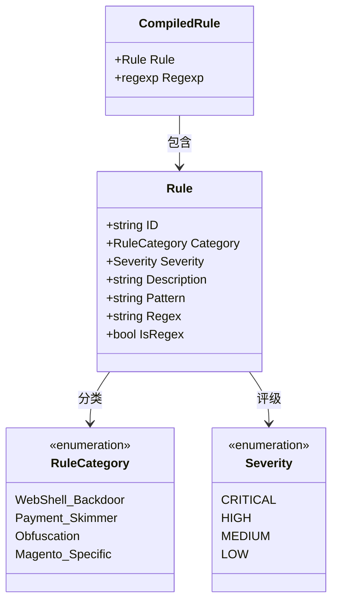

**图表来源**
- [rules.go:39-48](file://scanner/rules.go#L39-L48)
- [rules.go:29-37](file://scanner/rules.go#L29-L37)
- [rules.go:3-27](file://scanner/rules.go#L3-L27)

**章节来源**
- [engine.go:47-131](file://scanner/engine.go#L47-L131)
- [matcher.go:22-82](file://scanner/matcher.go#L22-L82)
- [rules.go:50-58](file://scanner/rules.go#L50-L58)

## 架构概览

MageScan的整体架构采用分层设计，确保了高性能和可维护性：

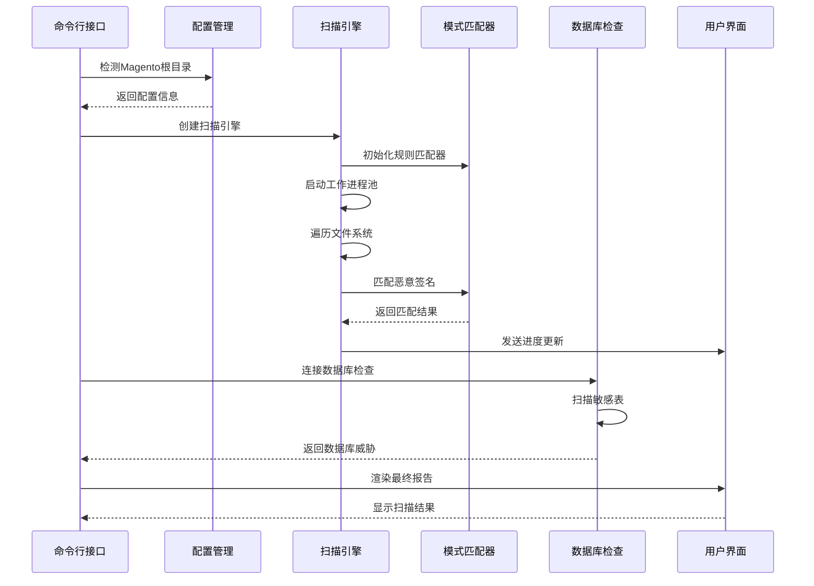

**图表来源**
- [main.go:94-126](file://cmd/magescan/main.go#L94-L126)
- [engine.go:76-121](file://scanner/engine.go#L76-L121)
- [inspector.go:79-109](file://database/inspector.go#L79-L109)

**章节来源**
- [main.go:24-207](file://cmd/magescan/main.go#L24-L207)
- [README.md:239-258](file://README.md#L239-L258)

## 支付窃取器检测机制详解

### 信用卡数据访问器检测

MageScan针对信用卡数据的直接访问模式进行了专门检测：

| 规则ID | 检测类型 | 描述 | 触发条件 |
|--------|----------|------|----------|
| SKIMMER-001 | 直接访问器 | 信用卡号直接访问器 | `getCcNumber()` 函数调用 |
| SKIMMER-002 | 直接访问器 | CVV数据访问器 | `getCcCid()` 函数调用 |

这些规则通过精确的函数名匹配来识别恶意的信用卡数据提取逻辑。

**章节来源**
- [rules.go:249-258](file://scanner/rules.go#L249-L258)

### 数据外泄通道检测

MageScan实现了多层次的数据外泄检测机制：

#### 邮件外泄检测
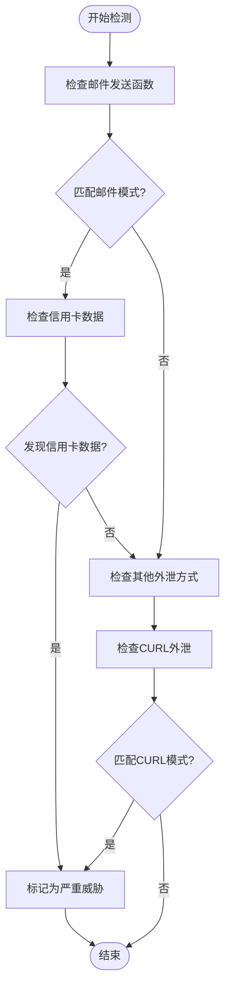

**图表来源**
- [rules.go:262-268](file://scanner/rules.go#L262-L268)

#### CURL数据外泄检测
- **SKIMMER-004**: 信用卡数据通过CURL进行外泄
- **SKIMMER-008**: CURL POST字段配置检测

**章节来源**
- [rules.go:269-288](file://scanner/rules.go#L269-L288)

### 表单数据拦截检测

MageScan能够识别恶意的表单数据拦截和修改行为：

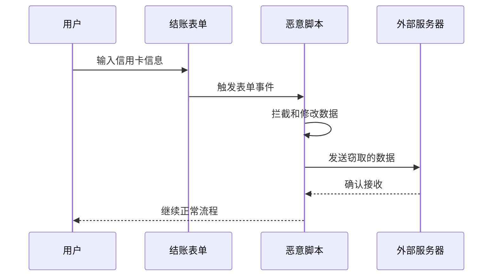

**图表来源**
- [rules.go:274-278](file://scanner/rules.go#L274-L278)

**章节来源**
- [rules.go:270-278](file://scanner/rules.go#L270-L278)

### 请求数据序列化检测

MageScan检测恶意的请求数据序列化和编码行为：

| 规则ID | 检测类型 | 描述 | 触发条件 |
|--------|----------|------|----------|
| SKIMMER-007 | 序列化检测 | 请求数据序列化用于外泄 | `base64_encode(serialize($_REQUEST` |
| SKIMMER-014 | 序列化检测 | Base64编码的POST数据序列化 | `base64_encode(serialize($_POST` |

**章节来源**
- [rules.go:280-288](file://scanner/rules.go#L280-L288)

### 已知窃取器域名模式检测

MageScan使用正则表达式检测已知的窃取器域名模式：

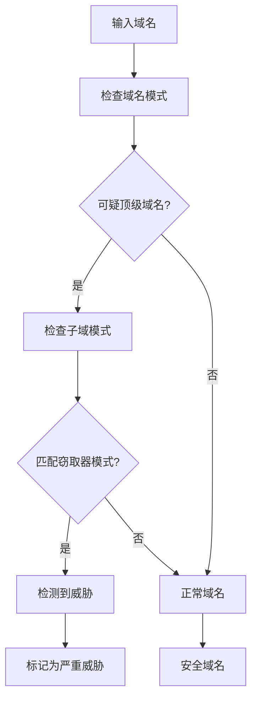

**图表来源**
- [rules.go:292-293](file://scanner/rules.go#L292-L293)

**章节来源**
- [rules.go:289-293](file://scanner/rules.go#L289-L293)

### SVG onload脚本执行检测

MageScan能够检测恶意的SVG脚本执行：

**章节来源**
- [rules.go:294-298](file://scanner/rules.go#L294-L298)

### WebSocket和RTCDataChannel隐蔽通道检测

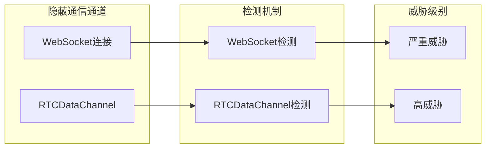

**图表来源**
- [rules.go:302-308](file://scanner/rules.go#L302-L308)

**章节来源**
- [rules.go:299-308](file://scanner/rules.go#L299-L308)

### 支付拦截模式检测

MageScan检测恶意的支付拦截和修改行为：

**章节来源**
- [rules.go:310-313](file://scanner/rules.go#L310-L313)

### JavaScript键盘记录器检测

MageScan能够检测嵌入在PHP中的JavaScript键盘记录器模式：

**章节来源**
- [rules.go:320-323](file://scanner/rules.go#L320-L323)

## Magecart攻击链检测策略

MageCart攻击通常遵循以下攻击链模式：

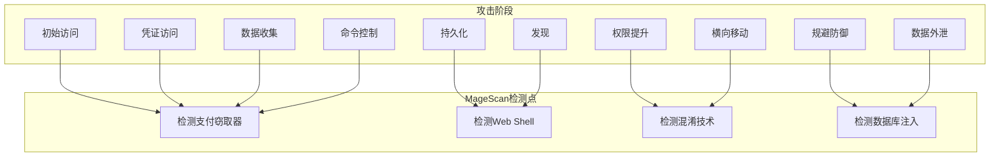

**图表来源**
- [README.md:163-200](file://README.md#L163-L200)

### 攻击链各阶段的检测策略

#### 初始访问阶段
- 检测Web Shell上传和执行
- 检测文件上传漏洞利用
- 检测路径遍历攻击

#### 数据收集阶段
- 检测信用卡数据访问器
- 检测键盘记录器
- 检测表单数据拦截

#### 数据外泄阶段
- 检测邮件外泄
- 检测CURL外泄
- 检测WebSocket通信
- 检测RTCDataChannel隐蔽通道

**章节来源**
- [README.md:150-200](file://README.md#L150-L200)

## 数据外泄通道分析

### 传统外泄通道

MageScan检测多种传统的数据外泄通道：

| 外泄通道 | 检测方法 | 威胁级别 |
|----------|----------|----------|
| 邮件外泄 | `cc_number.*mail\(|mail\(.*cc_number` | 严重 |
| CURL外泄 | `cc_number.*curl|curl.*cc_number` | 严重 |
| WebSocket | `new WebSocket(` | 高 |
| RTCDataChannel | `RTCDataChannel` | 高 |

### 隐蔽外泄通道

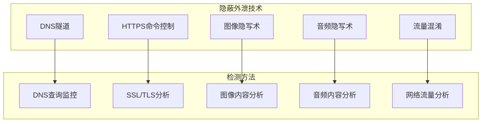

**图表来源**
- [rules.go:262-268](file://scanner/rules.go#L262-L268)
- [rules.go:301-308](file://scanner/rules.go#L301-L308)

**章节来源**
- [rules.go:262-268](file://scanner/rules.go#L262-L268)
- [rules.go:301-308](file://scanner/rules.go#L301-L308)

## 隐蔽传输技术检测

### 正则表达式匹配技术

MageScan使用精心设计的正则表达式来检测各种隐蔽传输技术：

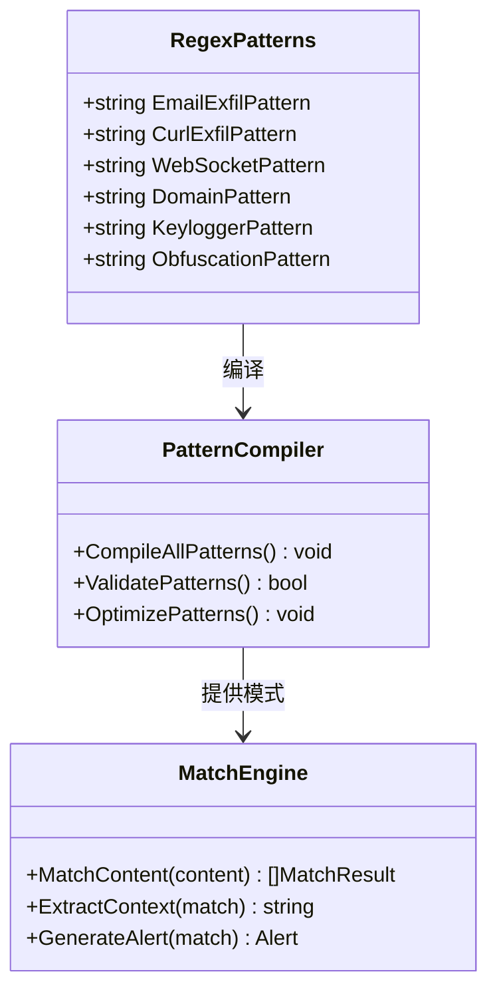

**图表来源**
- [matcher.go:44-61](file://scanner/matcher.go#L44-L61)
- [matcher.go:115-143](file://scanner/matcher.go#L115-L143)

### 文件过滤和扫描策略

MageScan采用智能的文件过滤策略来优化扫描性能：

**章节来源**
- [filter.go:13-97](file://scanner/filter.go#L13-L97)

## 性能考虑

### 并发扫描架构

MageScan采用了高效的并发扫描架构：

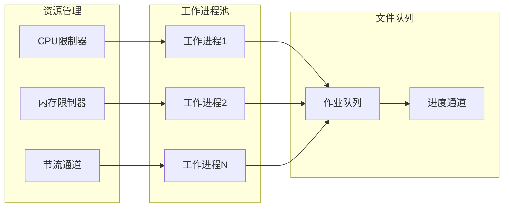

**图表来源**
- [engine.go:88-96](file://scanner/engine.go#L88-L96)
- [engine.go:195-227](file://scanner/engine.go#L195-L227)

### 内存管理和大文件处理

MageScan采用分块读取策略来处理大型文件：

**章节来源**
- [engine.go:13-17](file://scanner/engine.go#L13-L17)
- [engine.go:261-285](file://scanner/engine.go#L261-L285)

## 故障排除指南

### 常见问题诊断

| 问题类型 | 可能原因 | 解决方案 |
|----------|----------|----------|
| 扫描速度慢 | 文件过多或过大 | 使用快速扫描模式，调整CPU限制 |
| 内存不足 | 大文件处理 | 设置内存限制，使用分块读取 |
| 规则匹配失败 | 正则表达式错误 | 检查规则编译，验证正则表达式 |
| 数据库连接失败 | 配置错误 | 检查数据库配置，验证凭据 |

### 调试模式

MageScan提供了详细的调试信息输出：

**章节来源**
- [main.go:154-157](file://cmd/magescan/main.go#L154-L157)

## 结论

MageScan为Magento 2平台提供了全面的支付窃取器检测能力。通过70多个恶意签名规则，该工具能够有效识别和阻止各种形式的信用卡数据窃取和数据外泄攻击。

### 主要优势

1. **全面的检测覆盖**：涵盖15个恶意签名的支付窃取器检测
2. **高性能架构**：并发扫描和智能资源管理
3. **实时反馈**：TUI界面提供实时扫描进度
4. **数据库集成**：深度扫描Magento数据库中的威胁
5. **自动化程度高**：无需手动干预即可完成完整扫描

### 安全建议

1. **定期扫描**：建议每周进行一次完整的安全扫描
2. **规则更新**：及时更新恶意签名规则以应对新威胁
3. **监控告警**：建立基于MageScan结果的监控告警机制
4. **应急响应**：制定针对检测到的威胁的应急响应计划

通过合理使用MageScan，Magento 2商店可以显著提高其支付安全性，有效防范Magecart等支付窃取器攻击。