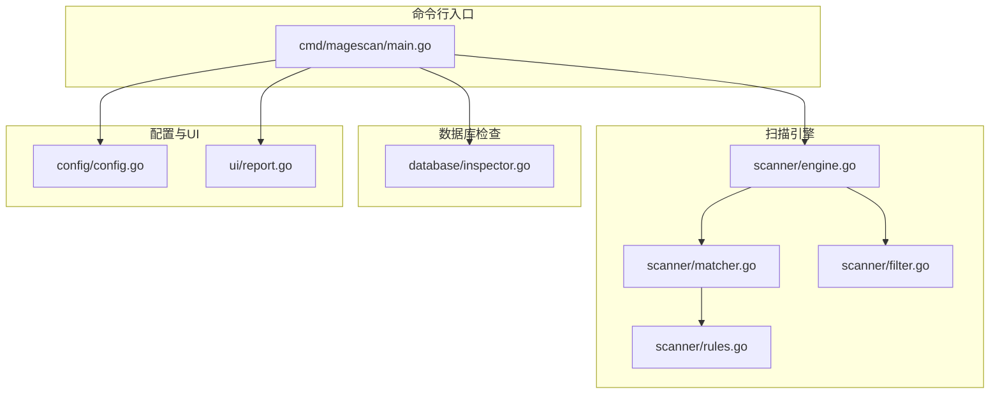
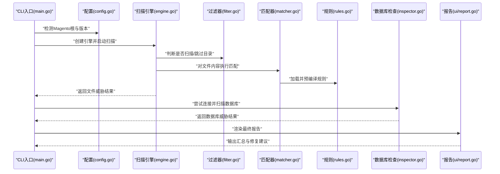
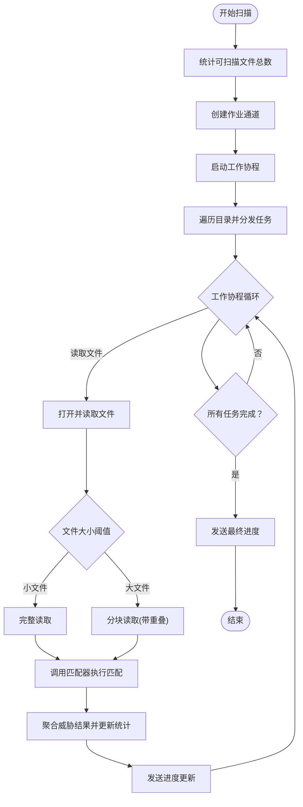
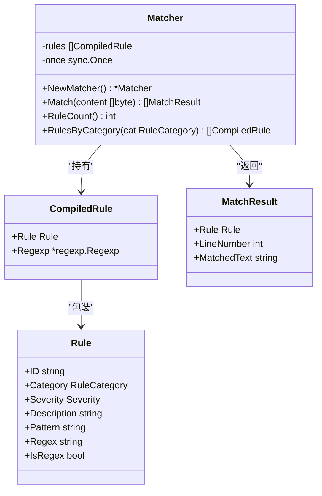
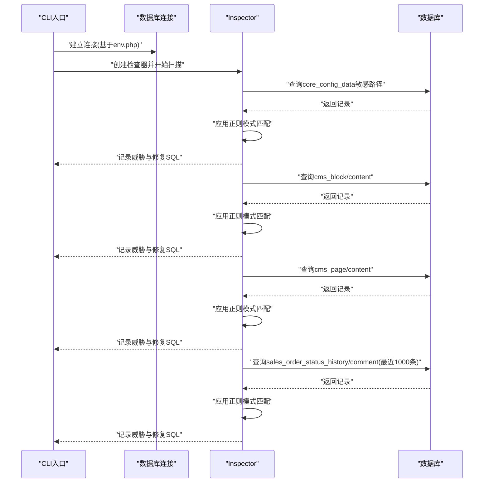
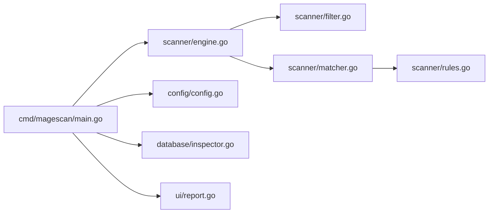

# 检测能力

<cite>
**本文引用的文件**
- [cmd/magescan/main.go](file://cmd/magescan/main.go)
- [scanner/engine.go](file://scanner/engine.go)
- [scanner/matcher.go](file://scanner/matcher.go)
- [scanner/rules.go](file://scanner/rules.go)
- [scanner/filter.go](file://scanner/filter.go)
- [database/inspector.go](file://database/inspector.go)
- [config/config.go](file://config/config.go)
- [ui/report.go](file://ui/report.go)
- [README.md](file://README.md)
</cite>

## 目录
1. [简介](#简介)
2. [项目结构](#项目结构)
3. [核心组件](#核心组件)
4. [架构总览](#架构总览)
5. [详细组件分析](#详细组件分析)
6. [依赖关系分析](#依赖关系分析)
7. [性能考量](#性能考量)
8. [故障排除指南](#故障排除指南)
9. [结论](#结论)
10. [附录](#附录)

## 简介
本文件面向安全分析师与开发者，深入解析 MageScan 的四类威胁检测能力：Web Shells/Backdoors（34个签名）、Payment Skimmers/Magecart（15个签名）、Obfuscation Techniques（12个签名）、Magento-Specific Threats（12个签名）。文档从代码级实现角度阐述检测机制、匹配算法、启发式策略、误报控制与规则更新流程，并结合实际检测示例与匹配规则说明，帮助读者全面掌握该工具的检测技术与最佳实践。

## 项目结构
项目采用分层模块化设计：
- cmd/magescan：CLI入口与扫描编排
- scanner：文件扫描引擎、规则匹配器、过滤器
- database：数据库连接与安全检查
- config：Magento环境检测与配置解析
- ui：终端用户界面与报告渲染
- resource：资源限制与自动节流

**图表来源**
- [cmd/magescan/main.go:24-126](file://cmd/magescan/main.go#L24-L126)
- [scanner/engine.go:47-121](file://scanner/engine.go#L47-L121)
- [scanner/matcher.go:22-82](file://scanner/matcher.go#L22-L82)
- [scanner/filter.go:8-98](file://scanner/filter.go#L8-L98)
- [scanner/rules.go:39-58](file://scanner/rules.go#L39-L58)
- [database/inspector.go:63-109](file://database/inspector.go#L63-L109)
- [config/config.go:13-71](file://config/config.go#L13-L71)
- [ui/report.go:57-168](file://ui/report.go#L57-L168)

**章节来源**
- [README.md:24-249](file://README.md#L24-L249)
- [cmd/magescan/main.go:24-126](file://cmd/magescan/main.go#L24-L126)

## 核心组件
- 扫描引擎（Engine）：负责目录遍历、文件过滤、并发工作池、进度上报与统计聚合
- 规则匹配器（Matcher）：预编译规则，支持字面量与正则两种匹配方式，线程安全
- 规则集（Rules）：定义四类威胁的签名集合，含ID、类别、严重级别、描述与匹配模式
- 文件过滤器（ScanFilter）：根据扫描模式决定扫描范围，跳过缓存、日志、静态资源等目录
- 数据库检查器（Inspector）：针对数据库表进行内容扫描，生成修复建议SQL
- 配置与环境检测（Config）：验证Magento根路径、读取版本信息、解析数据库配置
- 报告渲染（UI）：汇总文件与数据库威胁，按严重度排序输出

**章节来源**
- [scanner/engine.go:47-131](file://scanner/engine.go#L47-L131)
- [scanner/matcher.go:22-82](file://scanner/matcher.go#L22-L82)
- [scanner/rules.go:39-58](file://scanner/rules.go#L39-L58)
- [scanner/filter.go:8-98](file://scanner/filter.go#L8-L98)
- [database/inspector.go:63-109](file://database/inspector.go#L63-L109)
- [config/config.go:13-71](file://config/config.go#L13-L71)
- [ui/report.go:57-168](file://ui/report.go#L57-L168)

## 架构总览
下图展示从CLI入口到各子系统的调用链与数据流。

**图表来源**
- [cmd/magescan/main.go:94-126](file://cmd/magescan/main.go#L94-L126)
- [config/config.go:52-71](file://config/config.go#L52-L71)
- [scanner/engine.go:76-121](file://scanner/engine.go#L76-L121)
- [scanner/matcher.go:34-61](file://scanner/matcher.go#L34-L61)
- [database/inspector.go:79-109](file://database/inspector.go#L79-L109)
- [ui/report.go:57-168](file://ui/report.go#L57-L168)

## 详细组件分析

### 扫描引擎（Engine）
- 并发模型：创建工作池（2×CPU核数），使用作业通道分发文件路径，原子计数统计扫描进度与威胁数量
- 大文件处理：超过阈值的文件以重叠块方式读取，避免内存峰值
- 进度上报：周期性向UI通道发送扫描进度，支持完成信号
- 结果聚合：将匹配结果封装为Finding结构，包含文件路径、行号、规则ID、类别、严重度、描述与匹配文本片段

**图表来源**
- [scanner/engine.go:76-121](file://scanner/engine.go#L76-L121)
- [scanner/engine.go:195-227](file://scanner/engine.go#L195-L227)
- [scanner/engine.go:229-285](file://scanner/engine.go#L229-L285)
- [scanner/engine.go:287-322](file://scanner/engine.go#L287-L322)

**章节来源**
- [scanner/engine.go:47-131](file://scanner/engine.go#L47-L131)
- [scanner/engine.go:195-227](file://scanner/engine.go#L195-L227)
- [scanner/engine.go:229-285](file://scanner/engine.go#L229-L285)
- [scanner/engine.go:287-322](file://scanner/engine.go#L287-L322)

### 规则匹配器（Matcher）
- 预编译优化：在单例初始化时一次性编译所有正则规则，失败规则被跳过而非中断
- 双模式匹配：
  - 字面量匹配：使用快速包含检查后定位行号，避免全行正则开销
  - 正则匹配：先做全文快速匹配，再逐行查找定位，减少不必要的正则计算
- 线程安全：通过只读共享状态与局部结果收集保证并发安全
- 结果裁剪：匹配文本截断至固定长度，便于UI显示

**图表来源**
- [scanner/matcher.go:22-82](file://scanner/matcher.go#L22-L82)
- [scanner/matcher.go:84-143](file://scanner/matcher.go#L84-L143)
- [scanner/rules.go:39-48](file://scanner/rules.go#L39-L48)

**章节来源**
- [scanner/matcher.go:22-82](file://scanner/matcher.go#L22-L82)
- [scanner/matcher.go:84-143](file://scanner/matcher.go#L84-L143)
- [scanner/rules.go:39-48](file://scanner/rules.go#L39-L48)

### 文件过滤器（ScanFilter）
- 快速模式：仅扫描PHP与PHTML文件，显著降低扫描时间
- 全量模式：排除常见二进制与日志文件类型，保留可疑脚本与配置文件
- 目录跳过：内置大量Magento运行时目录与版本控制目录，避免无效扫描

**章节来源**
- [scanner/filter.go:8-98](file://scanner/filter.go#L8-L98)

### 四类威胁检测详解

#### 1) Web Shells/Backdoors（34个签名）
- 检测目标：远程代码执行、系统命令执行、文件上传持久化、已知后门标识、编码混淆执行链
- 关键特征与匹配策略：
  - 编码与解码执行链：如base64解码后eval执行、压缩后再解压执行等
  - 直接输入源执行：接收POST/GET/REQUEST/Cookie参数并执行
  - 系统命令执行：system/exec/passthru/shell_exec/popen/proc_open等
  - 文件写入与上传：通过copy/move_uploaded_file写入恶意载荷
  - 已知后门标识：c99shell、r57shell、WSO、FilesMan、b374k、weevely、PHPSHELL_VERSION等
  - 特定场景：GLOBALS间接调用、phpinfo信息泄露、LD_PRELOAD后门、Visbot特定注释标记
- 匹配算法：
  - 字面量匹配用于精确关键字检测
  - 正则匹配用于复杂上下文与通配模式（如/修饰符、函数调用链）

**章节来源**
- [scanner/rules.go:66-239](file://scanner/rules.go#L66-L239)

#### 2) Payment Skimmers/Magecart（15个签名）
- 检测目标：信用卡数据窃取、数据外泄通道、结账拦截、键盘记录、可疑域名与协议
- 关键特征与匹配策略：
  - 直接访问卡号/安全码：getCcNumber()/getCcCid()
  - 外泄通道：mail()、curl、序列化POST数据、WebSocket/WebRTC
  - 结账拦截：checkout页面数据捕获、表单拦截
  - 键盘记录：keypress/keydown事件监听
  - 域名与协议：可疑顶级域名、javascript:协议、SVG onload
- 匹配算法：正则优先，覆盖跨文件、跨行与上下文组合

**章节来源**
- [scanner/rules.go:247-325](file://scanner/rules.go#L247-L325)

#### 3) Obfuscation Techniques（12个签名）
- 检测目标：隐藏恶意载荷的编码与混淆技术
- 关键特征与匹配策略：
  - 超长编码串：极长base64字符串
  - hex编码变量名/字符串
  - 字符串拼接与chr()拼接
  - 变量变量函数执行、FOPO混淆、IonCube/Zend Guard标识
  - 反转字符串、位运算异或解密、数组拼装、动态函数名
- 匹配算法：正则强匹配，强调模式识别与上下文定位

**章节来源**
- [scanner/rules.go:333-396](file://scanner/rules.go#L333-L396)

#### 4) Magento-Specific Threats（12个签名）
- 检测目标：针对Magento内部机制的攻击与凭证窃取
- 关键特征与匹配策略：
  - 路径穿越与包含：include "../../../../../../app/Mage.php"
  - 管理员凭证窃取：admin_user密码相关模式
  - 支付数据写入图片：fopen写入图像文件
  - .htaccess与ForceType：非PHP扩展伪装为PHP执行
  - 会话Cookie伪造：typosquat名称
  - 计划任务后门：crontab/schedule
  - 数据库凭证直接访问：local.xml与core_config_data
  - REST令牌窃取：oauth_token与admin token
- 匹配算法：结合字面量与正则，覆盖配置与运行时行为

**章节来源**
- [scanner/rules.go:404-467](file://scanner/rules.go#L404-L467)

### 数据库威胁检测（Inspector）
- 扫描范围：core_config_data、cms_block、cms_page、sales_order_status_history
- 检测模式：外部脚本注入、eval、iframe、javascript协议、document.write、base64_decode、可疑内联脚本、事件处理器、可疑TLD
- 修复建议：为每个发现生成可执行的清理SQL语句，支持手动审查与执行

**图表来源**
- [database/inspector.go:79-109](file://database/inspector.go#L79-L109)
- [database/inspector.go:116-177](file://database/inspector.go#L116-L177)
- [database/inspector.go:179-230](file://database/inspector.go#L179-L230)
- [database/inspector.go:231-281](file://database/inspector.go#L231-L281)
- [database/inspector.go:283-330](file://database/inspector.go#L283-L330)

**章节来源**
- [database/inspector.go:31-50](file://database/inspector.go#L31-L50)
- [database/inspector.go:116-177](file://database/inspector.go#L116-L177)
- [database/inspector.go:179-230](file://database/inspector.go#L179-L230)
- [database/inspector.go:231-281](file://database/inspector.go#L231-L281)
- [database/inspector.go:283-330](file://database/inspector.go#L283-L330)

## 依赖关系分析
- 组件耦合：
  - Engine依赖Filter与Matcher；Matcher依赖Rules；Main依赖Config、Engine、Inspector、UI
  - 数据库检查器独立于文件扫描，但共享表前缀解析逻辑
- 外部依赖：
  - Go标准库（文件系统、正则、并发、JSON、SQL）
  - Bubble Tea用于TUI（在主程序中使用）
- 循环依赖：未发现循环导入

**图表来源**
- [cmd/magescan/main.go:13-20](file://cmd/magescan/main.go#L13-L20)
- [scanner/engine.go:47-69](file://scanner/engine.go#L47-L69)
- [scanner/matcher.go:34-42](file://scanner/matcher.go#L34-L42)
- [config/config.go:52-71](file://config/config.go#L52-L71)
- [database/inspector.go:79-109](file://database/inspector.go#L79-L109)
- [ui/report.go:57-168](file://ui/report.go#L57-L168)

**章节来源**
- [cmd/magescan/main.go:13-20](file://cmd/magescan/main.go#L13-L20)
- [scanner/engine.go:47-69](file://scanner/engine.go#L47-L69)
- [scanner/matcher.go:34-42](file://scanner/matcher.go#L34-L42)

## 性能考量
- 并发与吞吐：工作协程数量为CPU核数的两倍，最大化I/O与CPU利用率
- 内存管理：大文件采用重叠块读取，避免一次性加载导致内存峰值
- 资源限制：通过节流通道实现CPU/内存上限控制，达到阈值时暂停，回落到80%时恢复
- 匹配优化：预编译正则、快速包含检查、逐行定位，减少正则计算成本
- 过滤策略：快速模式仅扫描PHP/PHTML，全量模式排除常见二进制与日志文件

**章节来源**
- [scanner/engine.go:61-69](file://scanner/engine.go#L61-L69)
- [scanner/engine.go:261-285](file://scanner/engine.go#L261-L285)
- [scanner/matcher.go:44-61](file://scanner/matcher.go#L44-L61)
- [scanner/filter.go:87-98](file://scanner/filter.go#L87-L98)

## 故障排除指南
- 环境检测失败：
  - 症状：提示不是Magento根目录
  - 排查：确认存在app/etc/env.php与bin/magento；检查路径权限
- 数据库连接失败：
  - 症状：警告无法连接数据库或解析env.php
  - 排查：检查主机、端口、用户名、密码、数据库名；确认表前缀
- 扫描中断：
  - 症状：SIGINT/SIGTERM导致扫描提前结束
  - 处理：优雅关闭，结果仍可输出
- 误报与漏报：
  - 误报：正则过于宽松或匹配文本截断导致误判
  - 漏报：过滤器排除了真实威胁文件类型
  - 建议：调整扫描模式、细化规则、定期更新规则集

**章节来源**
- [config/config.go:52-71](file://config/config.go#L52-L71)
- [cmd/magescan/main.go:106-122](file://cmd/magescan/main.go#L106-L122)
- [scanner/filter.go:87-98](file://scanner/filter.go#L87-L98)

## 结论
MageScan通过“规则驱动 + 并发扫描 + 资源控制”的架构，在不修改目标系统的情况下，实现了对Web Shell、支付劫持、混淆技术与Magento特有威胁的高效检测。其预编译规则、双模式匹配与智能过滤策略确保了高精度与低误报，配合数据库威胁检测与修复SQL生成，为安全团队提供了完整的威胁发现与处置闭环。

## 附录

### 检测精度与误报控制
- 精度保障：
  - 预编译正则与快速包含检查减少误匹配
  - 行号定位与文本截断提升定位准确性
  - 分类严重度分级便于优先处置
- 误报控制：
  - 过滤器排除静态资源与日志文件
  - 正则模式严格限定上下文，避免泛匹配
  - 建议人工复核高危匹配项

**章节来源**
- [scanner/matcher.go:84-143](file://scanner/matcher.go#L84-L143)
- [scanner/filter.go:87-98](file://scanner/filter.go#L87-L98)

### 规则更新机制
- 规则集中管理：所有规则集中在单一文件中，便于维护与版本化
- 动态加载：匹配器在初始化时一次性加载并编译，保证运行期稳定性
- 更新流程建议：
  - 新增规则需明确类别、严重度与描述
  - 正则需经过充分测试，避免误报
  - 提供对应检测示例与修复建议

**章节来源**
- [scanner/rules.go:50-58](file://scanner/rules.go#L50-L58)
- [scanner/matcher.go:44-61](file://scanner/matcher.go#L44-L61)

### 威胁情报与发展趋势
- 威胁情报来源：
  - 已知后门与混淆工具标识（如FOPO、IonCube、Zend Guard）
  - 支付劫持与Magecart攻击模式（域名单、协议、事件监听）
  - Magento特有攻击手法（路径穿越、ForceType、计划任务）
- 发展趋势：
  - 更多基于上下文的启发式规则
  - 机器学习辅助的异常检测
  - 与CI/CD集成的自动化扫描

**章节来源**
- [scanner/rules.go:66-239](file://scanner/rules.go#L66-L239)
- [scanner/rules.go:247-325](file://scanner/rules.go#L247-L325)
- [scanner/rules.go:333-396](file://scanner/rules.go#L333-L396)
- [scanner/rules.go:404-467](file://scanner/rules.go#L404-L467)