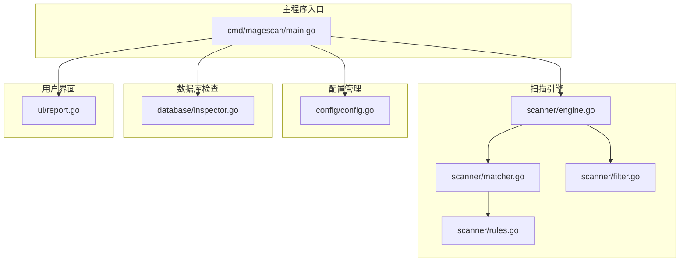
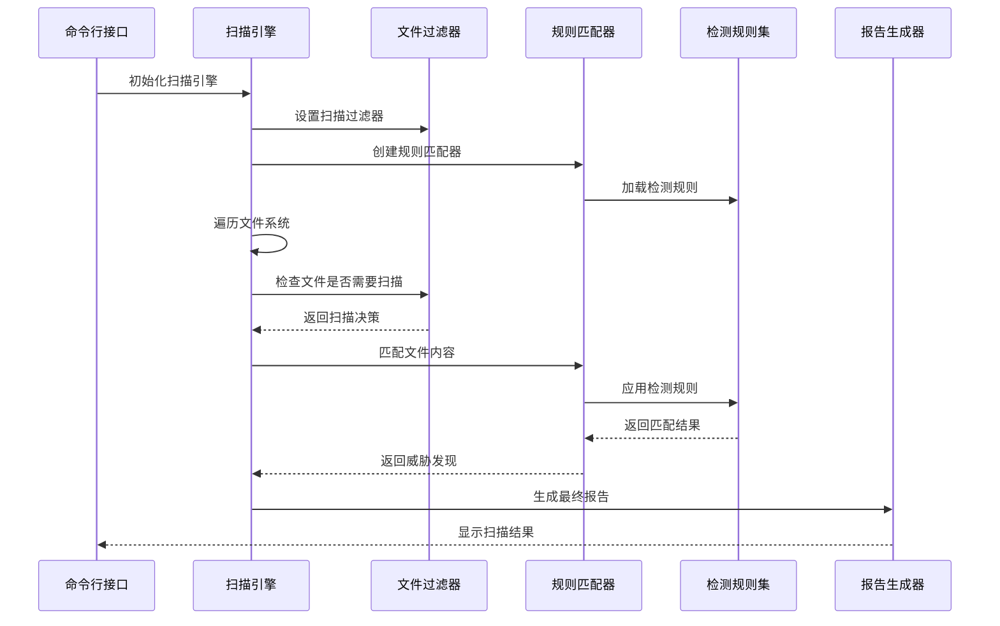
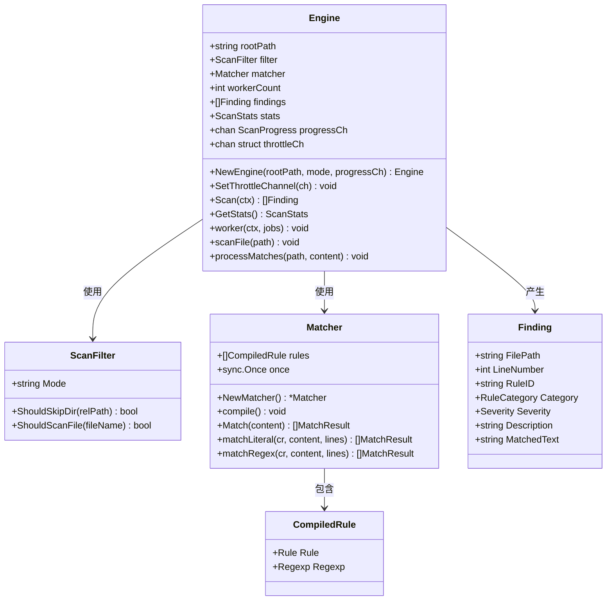
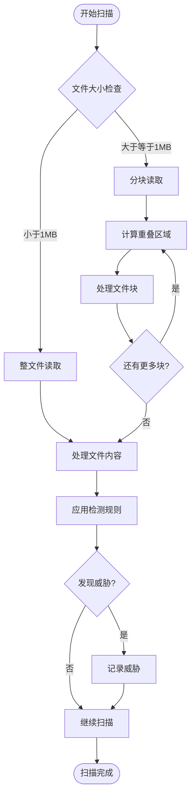

# 混淆技术检测

<cite>
**本文档引用的文件**
- [rules.go](file://scanner/rules.go)
- [matcher.go](file://scanner/matcher.go)
- [engine.go](file://scanner/engine.go)
- [filter.go](file://scanner/filter.go)
- [README.md](file://README.md)
</cite>

## 目录
1. [简介](#简介)
2. [项目结构](#项目结构)
3. [核心组件](#核心组件)
4. [架构概览](#架构概览)
5. [详细组件分析](#详细组件分析)
6. [混淆检测规则详解](#混淆检测规则详解)
7. [检测算法与启发式分析](#检测算法与启发式分析)
8. [性能考虑](#性能考虑)
9. [故障排除指南](#故障排除指南)
10. [结论](#结论)

## 简介

MageScan是一个高性能的Magento 2安全扫描器，专门设计用于检测和识别各种恶意代码混淆技术。该项目实现了12个专门针对混淆技术的检测规则，能够有效识别现代恶意软件常用的混淆手法，包括超长Base64编码、十六进制编码、字符串拼接混淆、chr()函数混淆、变量变量函数执行等多种高级混淆技术。

该工具采用纯只读操作，不会对目标系统进行任何修改，支持快速和完整两种扫描模式，并提供了实时的终端用户界面显示扫描进度。

## 项目结构

**图表来源**
- [main.go:1-208](file://cmd/magescan/main.go#L1-L208)
- [engine.go:1-323](file://scanner/engine.go#L1-L323)
- [matcher.go:1-168](file://scanner/matcher.go#L1-L168)

**章节来源**
- [main.go:1-208](file://cmd/magescan/main.go#L1-L208)
- [README.md:241-249](file://README.md#L241-L249)

## 核心组件

### 扫描引擎 (Scanner Engine)

扫描引擎是整个系统的中枢，负责协调文件扫描、规则匹配和结果收集。它采用了高效的并发架构，使用工作池模式来处理大量文件。

### 规则匹配器 (Rule Matcher)

规则匹配器实现了智能的签名匹配功能，支持字面量匹配和正则表达式匹配两种模式。所有正则表达式在初始化时预编译，确保运行时的高性能。

### 文件过滤器 (File Filter)

文件过滤器根据扫描模式自动选择要扫描的文件类型，快速跳过不需要检查的目录和文件，提高整体扫描效率。

**章节来源**
- [engine.go:47-58](file://scanner/engine.go#L47-L58)
- [matcher.go:22-27](file://scanner/matcher.go#L22-L27)
- [filter.go:8-11](file://scanner/filter.go#L8-L11)

## 架构概览

**图表来源**
- [engine.go:76-121](file://scanner/engine.go#L76-L121)
- [matcher.go:63-82](file://scanner/matcher.go#L63-L82)

## 详细组件分析

### 扫描引擎架构

扫描引擎采用了分层架构设计，每个组件都有明确的职责分工：

**图表来源**
- [engine.go:47-58](file://scanner/engine.go#L47-L58)
- [matcher.go:9-27](file://scanner/matcher.go#L9-L27)
- [engine.go:19-28](file://scanner/engine.go#L19-L28)

**章节来源**
- [engine.go:1-323](file://scanner/engine.go#L1-L323)
- [matcher.go:1-168](file://scanner/matcher.go#L1-L168)

## 混淆检测规则详解

### 超长Base64编码字符串检测

**规则ID**: OBFUSC-001  
**严重级别**: HIGH  
**检测模式**: 正则表达式匹配

该规则专门检测超过500字符的Base64编码字符串，这是现代恶意软件常用的隐藏payload技术。恶意代码通常会将压缩后的PHP代码编码为Base64字符串，然后在运行时解码执行。

**检测特征**:
- 字符串长度超过500个字符
- 包含标准Base64字符集：A-Z, a-z, 0-9, +, /
- 可能包含填充字符=

### 十六进制编码变量名和字符串检测

**规则ID**: OBFUSC-002  
**严重级别**: HIGH  
**检测模式**: 正则表达式匹配

十六进制编码是一种常见的混淆技术，恶意代码使用`\xHH`格式的十六进制转义序列来隐藏敏感字符串和变量名。

**检测特征**:
- `\x`前缀的十六进制转义序列
- 连续出现的十六进制编码
- 通常用于隐藏函数名、类名或敏感数据

### 字符串拼接混淆模式检测

**规则ID**: OBFUSC-003  
**严重级别**: MEDIUM  
**检测模式**: 正则表达式匹配

字符串拼接混淆通过将分散的字符串片段组合起来形成完整的恶意代码，增加静态分析的难度。

**检测特征**:
- 多个短字符串常量的连续拼接
- 使用点号(.)操作符连接
- 片段长度通常为2-4个字符

### chr()函数拼接混淆检测

**规则ID**: OBFUSC-004  
**严重级别**: HIGH  
**检测模式**: 正则表达式匹配

chr()函数混淆利用ASCII码值的拼接来构建字符串，这是PHP混淆的经典技术。

**检测特征**:
- `chr()`函数调用序列
- 多个chr()函数的连续拼接
- 通常用于构造eval、assert等危险函数名

### 变量变量函数执行检测

**规则ID**: OBFUSC-005  
**严重级别**: HIGH  
**检测模式**: 正则表达式匹配

变量变量是一种高级PHP特性，恶意代码利用这一特性实现动态函数调用，增加检测难度。

**检测特征**:
- 双美元符号($$)语法
- 动态函数名调用
- 运行时确定的函数执行

### 知名混淆器标识检测

**规则ID**: OBFUSC-006  
**严重级别**: HIGH  
**检测模式**: 字面量匹配

该规则专门检测知名在线PHP混淆器的标识信息，包括FOPO在线PHP混淆器的特征。

**检测特征**:
- "Free Online PHP Obfuscator"文本标识
- 混淆器特定的注释或元数据
- 已知混淆器的版本信息

### IonCube编码检测

**规则ID**: OBFUSC-007  
**严重级别**: MEDIUM  
**检测模式**: 字面量匹配

IonCube是最常用的PHP代码保护工具之一，虽然主要用于合法的商业软件保护，但也被恶意软件使用。

**检测特征**:
- "ionCube"文本标识
- 通常出现在编码后的文件中
- 需要额外的许可证才能正常运行

### Zend Guard编码检测

**规则ID**: OBFUSC-008  
**严重级别**: MEDIUM  
**检测模式**: 字面量匹配

Zend Guard是另一个流行的PHP代码保护工具，同样可能被恶意软件滥用。

**检测特征**:
- "Zend Guard"文本标识
- 编码后的PHP文件特征
- 与IonCube类似的保护机制

### 字符串反转eval检测

**规则ID**: OBFUSC-009  
**严重级别**: HIGH  
**检测模式**: 正则表达式匹配

字符串反转混淆通过将恶意代码以相反顺序存储，然后在运行时反转来执行。

**检测特征**:
- `strrev()`函数调用
- eval()函数配合字符串反转
- 反向字符串解码执行

### 按位XOR解密检测

**规则ID**: OBFUSC-010  
**严重级别**: HIGH  
**检测模式**: 正则表达式匹配

XOR解密是一种常见的数据加密混淆技术，恶意代码使用XOR操作来隐藏payload。

**检测特征**:
- 按位异或操作符(^)
- 变量间的XOR运算
- eval()函数配合解密逻辑

### 数组字符串组装检测

**规则ID**: OBFUSC-011  
**严重级别**: MEDIUM  
**检测模式**: 正则表达式匹配

数组组装混淆通过将字符串片段存储在数组中，然后按序号拼接来构建完整代码。

**检测特征**:
- 数组索引访问语法($var[0])
- 连续的数组元素拼接
- 通常用于构造长字符串

### 动态函数名检测

**规则ID**: OBFUSC-012  
**严重级别**: HIGH  
**检测模式**: 正则表达式匹配

动态函数名混淆通过变量存储函数名，然后动态调用的方式实现代码执行。

**检测特征**:
- 变量赋值给函数名
- 动态函数调用语法
- 运行时确定的函数执行

**章节来源**
- [rules.go:333-396](file://scanner/rules.go#L333-L396)

## 检测算法与启发式分析

### 正则表达式优化策略

规则匹配器采用了多种优化策略来确保高效检测：

1. **预编译正则表达式**: 所有正则表达式在初始化时编译，避免运行时重复编译开销
2. **快速存在性检查**: 对于正则表达式，先进行全局匹配检查，只有当内容包含潜在威胁时才进行逐行匹配
3. **线程安全设计**: 使用互斥锁保护共享状态，支持并发安全的匹配操作

### 文件扫描策略

扫描引擎采用了智能的文件处理策略：

**图表来源**
- [engine.go:248-285](file://scanner/engine.go#L248-L285)

### 并发扫描架构

系统采用了工作池并发模型：

- **工作进程数量**: `2 × NumCPU`，充分利用多核处理器性能
- **任务队列**: 使用带缓冲的通道作为任务队列
- **资源限制**: 支持CPU和内存使用限制，自动节流控制
- **优雅关闭**: 支持SIGINT/SIGTERM信号的优雅退出

### 启发式分析方法

除了基于规则的检测外，系统还采用了以下启发式分析方法：

1. **模式识别**: 识别常见的恶意代码模式组合
2. **上下文分析**: 分析代码的执行上下文和潜在风险
3. **行为推断**: 基于代码结构推断可能的恶意行为
4. **统计分析**: 分析可疑代码的统计特征

**章节来源**
- [matcher.go:44-61](file://scanner/matcher.go#L44-L61)
- [engine.go:195-227](file://scanner/engine.go#L195-L227)

## 性能考虑

### 内存管理优化

1. **分块读取**: 大文件采用1MB分块读取，减少内存占用
2. **重叠处理**: 相邻分块之间设置100字节重叠，确保跨块模式不被遗漏
3. **原子操作**: 使用原子计数器更新扫描统计信息，避免锁竞争

### CPU使用优化

1. **工作池**: 自动调整工作进程数量，通常为CPU核心数的两倍
2. **节流控制**: 当达到CPU限制时自动暂停，降低到80%阈值时恢复
3. **快速路径**: 对于简单字面量匹配使用快速路径，避免正则表达式开销

### I/O性能优化

1. **批量处理**: 将文件路径批量发送到工作进程
2. **异步进度**: 使用通道异步发送扫描进度，避免阻塞主流程
3. **错误处理**: 快速跳过无法读取的文件，继续处理其他文件

## 故障排除指南

### 常见问题诊断

1. **扫描速度慢**
   - 检查是否启用了完整扫描模式
   - 调整CPU限制参数
   - 确认没有大型文件影响性能

2. **内存使用过高**
   - 检查内存限制设置
   - 考虑使用快速扫描模式
   - 监控大文件处理情况

3. **规则匹配失败**
   - 检查正则表达式有效性
   - 验证规则加载状态
   - 确认文件编码格式

### 调试技巧

1. **日志输出**: 利用进度通道监控扫描过程
2. **规则验证**: 检查规则编译状态
3. **性能分析**: 监控CPU和内存使用情况

**章节来源**
- [engine.go:133-161](file://scanner/engine.go#L133-L161)
- [matcher.go:52-58](file://scanner/matcher.go#L52-L58)

## 结论

MageScan项目成功实现了12个针对现代恶意软件混淆技术的检测规则，涵盖了从基础的Base64编码到高级的变量变量执行等各种混淆手法。通过采用高效的并发架构、智能的文件处理策略和优化的正则表达式匹配算法，该工具能够在保持高性能的同时提供准确的威胁检测能力。

该系统的模块化设计使得未来可以轻松添加新的检测规则，适应不断演进的恶意软件威胁环境。同时，纯只读的设计确保了扫描过程的安全性和可靠性，不会对目标系统造成任何影响。

对于安全专业人员而言，这个项目不仅提供了一个实用的检测工具，更重要的是展示了如何构建一个可扩展、高性能的恶意软件检测系统，为其他类似项目提供了宝贵的参考和借鉴。