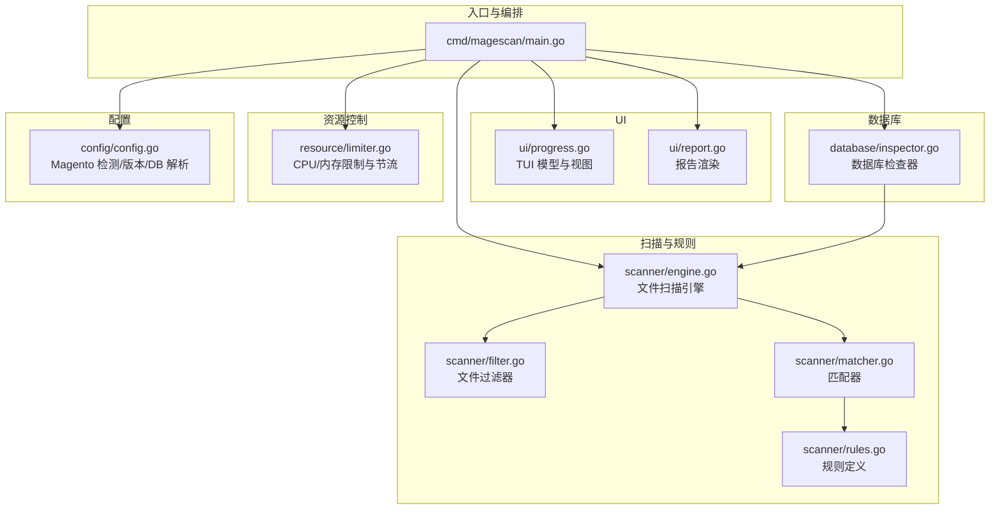
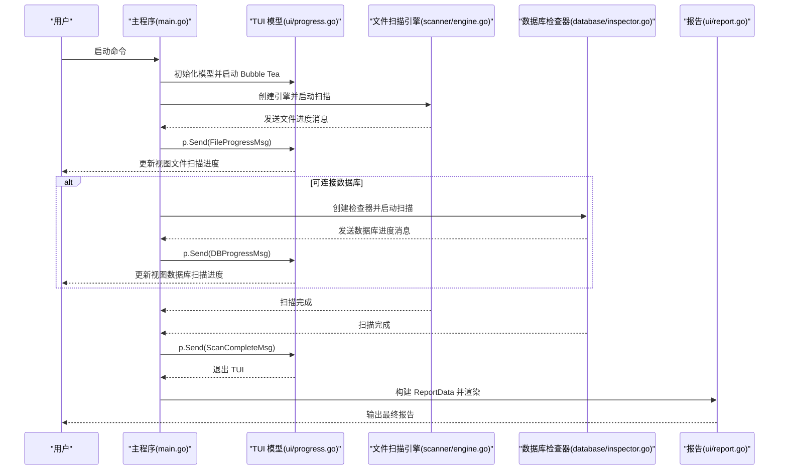
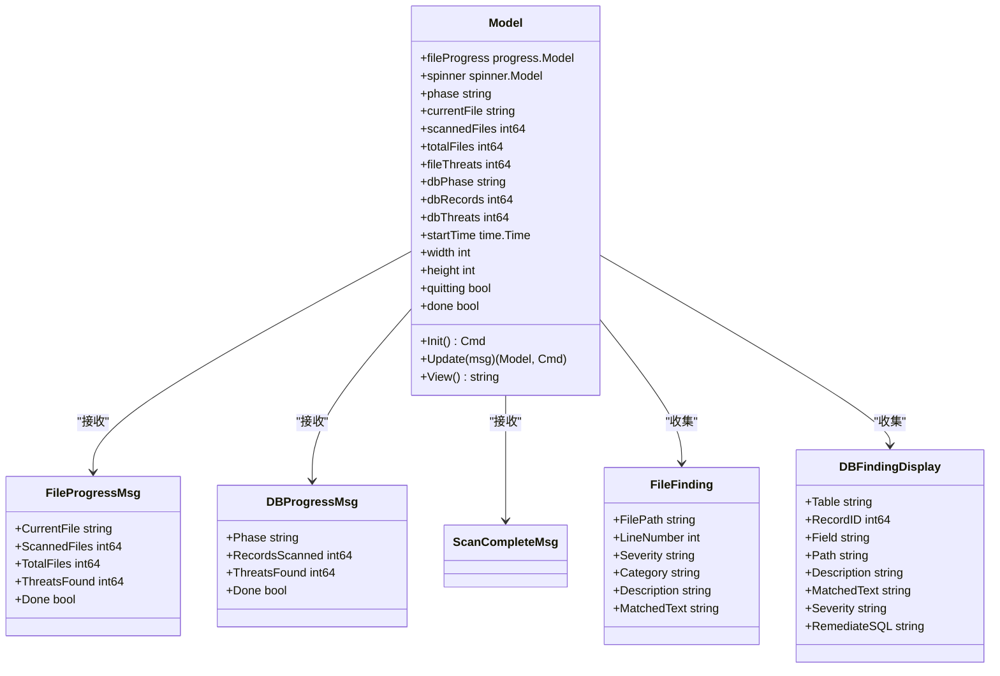
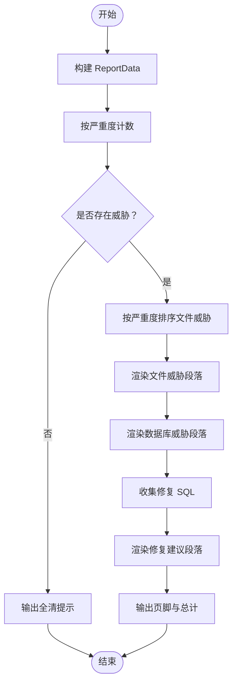
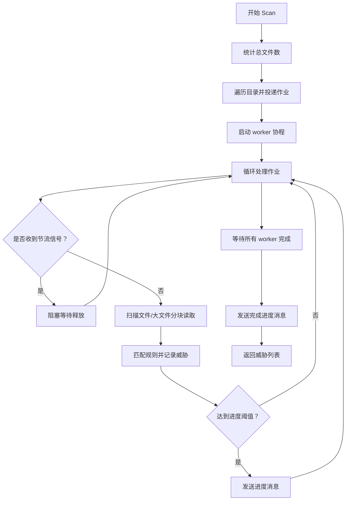
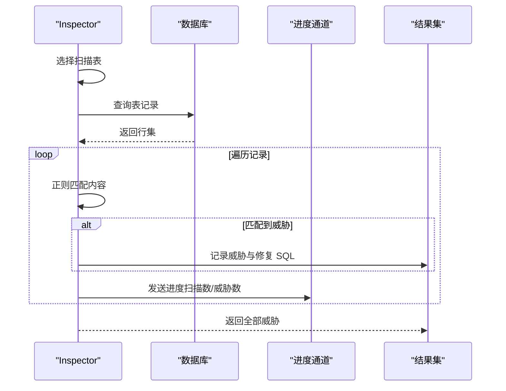
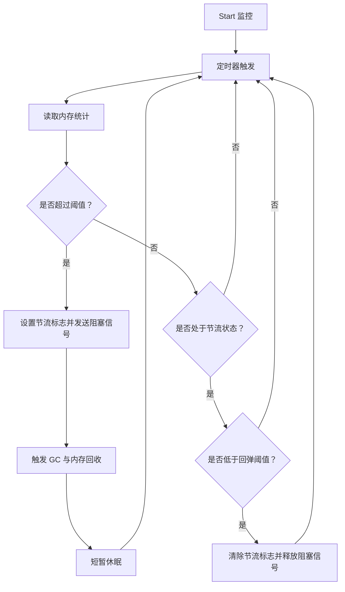
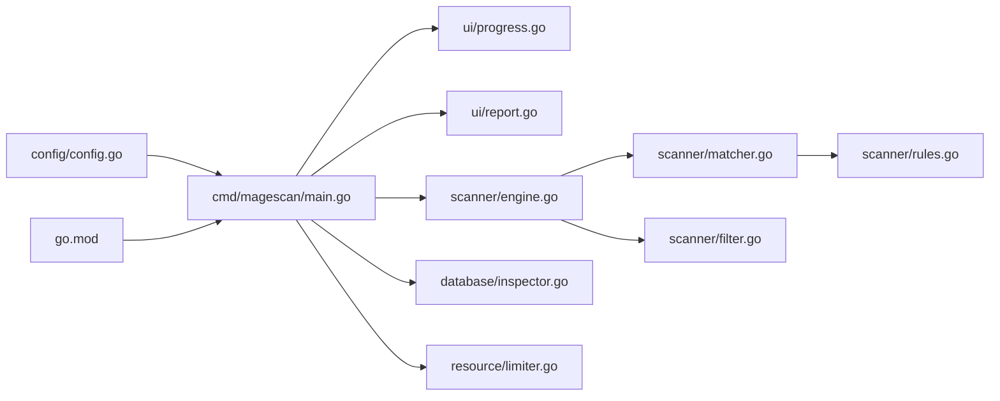

# 用户界面

<cite>
**本文引用的文件列表**
- [cmd/magescan/main.go](file://cmd/magescan/main.go)
- [ui/progress.go](file://ui/progress.go)
- [ui/report.go](file://ui/report.go)
- [scanner/engine.go](file://scanner/engine.go)
- [scanner/filter.go](file://scanner/filter.go)
- [scanner/matcher.go](file://scanner/matcher.go)
- [scanner/rules.go](file://scanner/rules.go)
- [database/inspector.go](file://database/inspector.go)
- [resource/limiter.go](file://resource/limiter.go)
- [config/config.go](file://config/config.go)
- [README.md](file://README.md)
- [go.mod](file://go.mod)
</cite>

## 目录
1. [简介](#简介)
2. [项目结构](#项目结构)
3. [核心组件](#核心组件)
4. [架构总览](#架构总览)
5. [组件详解](#组件详解)
6. [依赖关系分析](#依赖关系分析)
7. [性能与资源控制](#性能与资源控制)
8. [故障排查指南](#故障排查指南)
9. [结论](#结论)
10. [附录](#附录)

## 简介
本文件面向前端开发者与用户体验设计师，系统性阐述 MageScan 的用户界面组件，重点覆盖基于 Bubble Tea 的 TUI 实现、界面布局与样式、事件处理机制、进度显示系统、报告生成算法与格式化逻辑、键盘交互与体验优化、输出格式支持（终端与 JSON）、界面定制与扩展方法、以及测试与调试策略。目标是帮助读者在不深入 Go 语言的前提下，理解并高效使用与扩展该 TUI。

## 项目结构
- 入口程序位于 cmd/magescan/main.go，负责解析 CLI 参数、初始化 TUI、启动扫描引擎与数据库检查器，并在完成后渲染最终报告。
- UI 层分为两部分：
  - 进度显示：ui/progress.go 提供 Bubble Tea 模型与视图，实时展示文件扫描与数据库扫描阶段的状态。
  - 报告渲染：ui/report.go 负责将扫描结果汇总为可读性强的文本报告，含威胁计数、按严重度分组、SQL 修复建议等。
- 扫描引擎与规则：scanner/engine.go、matcher.go、filter.go、rules.go 提供文件扫描能力与规则集；database/inspector.go 提供数据库威胁检测与修复建议生成。
- 资源限制：resource/limiter.go 提供 CPU/内存限制与自动节流，保障扫描过程稳定。
- 配置与环境：config/config.go 提供 Magento 根路径检测、版本检测、DB 配置解析等。

图表来源
- [cmd/magescan/main.go:1-208](file://cmd/magescan/main.go#L1-L208)
- [ui/progress.go:1-289](file://ui/progress.go#L1-L289)
- [ui/report.go:1-230](file://ui/report.go#L1-L230)
- [scanner/engine.go:1-323](file://scanner/engine.go#L1-L323)
- [scanner/filter.go:1-98](file://scanner/filter.go#L1-L98)
- [scanner/matcher.go:1-168](file://scanner/matcher.go#L1-L168)
- [scanner/rules.go:1-200](file://scanner/rules.go#L1-L200)
- [database/inspector.go:1-359](file://database/inspector.go#L1-L359)
- [resource/limiter.go:1-118](file://resource/limiter.go#L1-L118)
- [config/config.go:1-108](file://config/config.go#L1-L108)

章节来源
- [cmd/magescan/main.go:1-208](file://cmd/magescan/main.go#L1-L208)
- [README.md:240-258](file://README.md#L240-L258)

## 核心组件
- TUI 模型与视图（ui/progress.go）
  - 定义消息类型（文件进度、数据库进度、扫描完成），模型字段（进度条、旋转指示器、阶段、统计、尺寸、退出标志），以及 Update/View 生命周期。
  - 使用 Bubble Tea 的 progress 与 spinner 组件，配合 Lipgloss 样式库进行主题化渲染。
- 报告渲染（ui/report.go）
  - 将文件与数据库威胁按严重度计数、排序与分组，生成带分隔线的报告文本；包含 SQL 修复建议集合。
- 扫描引擎（scanner/engine.go）
  - 基于工作池的并发扫描，支持大文件分块读取与重叠拼接，周期性发送进度消息，记录威胁并聚合结果。
- 匹配器与规则（scanner/matcher.go、scanner/rules.go）
  - 预编译规则，支持正则与字面量匹配，按类别与严重度组织威胁。
- 数据库检查器（database/inspector.go）
  - 针对敏感表执行模式匹配，生成威胁与修复 SQL。
- 资源限制（resource/limiter.go）
  - 周期性监控内存，超过阈值时通过通道阻塞工作协程，回落到阈值后再恢复，避免 OOM。
- 配置与环境（config/config.go）
  - 检测 Magento 根目录、读取版本信息、解析 env.php 获取 DB 配置。

章节来源
- [ui/progress.go:14-197](file://ui/progress.go#L14-L197)
- [ui/report.go:11-230](file://ui/report.go#L11-L230)
- [scanner/engine.go:47-121](file://scanner/engine.go#L47-L121)
- [scanner/matcher.go:22-82](file://scanner/matcher.go#L22-L82)
- [scanner/rules.go:39-58](file://scanner/rules.go#L39-L58)
- [database/inspector.go:63-109](file://database/inspector.go#L63-L109)
- [resource/limiter.go:11-62](file://resource/limiter.go#L11-L62)
- [config/config.go:49-107](file://config/config.go#L49-L107)

## 架构总览
下图展示了从入口到 UI 渲染的端到端流程，包括文件扫描、数据库扫描、进度消息传递与最终报告生成。

图表来源
- [cmd/magescan/main.go:78-157](file://cmd/magescan/main.go#L78-L157)
- [ui/progress.go:140-197](file://ui/progress.go#L140-L197)
- [scanner/engine.go:76-121](file://scanner/engine.go#L76-L121)
- [database/inspector.go:79-109](file://database/inspector.go#L79-L109)
- [ui/report.go:57-168](file://ui/report.go#L57-L168)

## 组件详解

### TUI 模型与事件处理（ui/progress.go）
- 消息类型
  - 文件进度消息：携带当前文件、已扫描/总数文件、威胁数量、是否完成。
  - 数据库进度消息：携带阶段名称、记录扫描数、威胁数、是否完成。
  - 扫描完成消息：触发 TUI 退出。
- 模型字段
  - 进度条与旋转指示器：用于文件扫描阶段的可视化反馈。
  - 阶段标识：文件扫描、数据库扫描、完成。
  - 统计数据：扫描时间、威胁计数、当前文件路径等。
  - 结果容器：收集文件与数据库威胁以便最终报告。
  - 尺寸与退出控制：窗口大小变化与退出标志。
- Update 处理
  - 键盘事件：支持 Ctrl+C 或 q 退出。
  - 窗口尺寸变更：动态调整进度条宽度。
  - 进度消息：更新阶段、统计数据与威胁计数。
  - Tick 消息：驱动 spinner 与 progress 动画。
- 视图渲染
  - 标题、阶段标题、进度条、当前文件、威胁计数与耗时。
  - 数据库阶段显示扫描状态与威胁计数。
  - 优雅退出提示。

图表来源
- [ui/progress.go:14-82](file://ui/progress.go#L14-L82)

章节来源
- [ui/progress.go:14-197](file://ui/progress.go#L14-L197)
- [ui/progress.go:199-289](file://ui/progress.go#L199-L289)

### 报告生成系统（ui/report.go）
- 数据结构
  - ReportData：包含 Magento 版本、扫描模式、目标路径、耗时、文件/数据库威胁等。
- 报告内容
  - 汇总统计：按严重度计数（Critical/High/Medium/Low），并给出总数。
  - 文件威胁：按严重度排序，显示文件路径、行号、规则描述与匹配片段。
  - 数据库威胁：显示表名、记录 ID、字段、路径（如适用）、问题描述、匹配片段与修复 SQL。
  - 修复建议：汇总所有数据库威胁对应的 SQL，便于管理员一键清理。
- 格式化与样式
  - 使用 Lipgloss 样式定义标题、严重度标签、路径、SQL、成功提示等。
  - 分隔线与对齐，确保报告可读性。

图表来源
- [ui/report.go:57-168](file://ui/report.go#L57-L168)
- [ui/report.go:186-229](file://ui/report.go#L186-L229)

章节来源
- [ui/report.go:11-230](file://ui/report.go#L11-L230)

### 扫描引擎与进度推送（scanner/engine.go）
- 工作池与任务分发
  - 统计总文件数后遍历目录，将文件路径投递到作业队列，启动多协程 worker 并发扫描。
- 大文件处理
  - 对大于阈值的文件采用重叠分块读取，避免一次性加载导致内存峰值。
- 进度推送
  - 周期性发送 ScanProgress 消息（每 N 个文件一次），包含当前文件、已扫描/总数、威胁数与完成标记。
- 结果聚合
  - 原子计数威胁数，线程安全地追加发现项，最终返回全部威胁。

图表来源
- [scanner/engine.go:76-121](file://scanner/engine.go#L76-L121)
- [scanner/engine.go:195-227](file://scanner/engine.go#L195-L227)
- [scanner/engine.go:229-285](file://scanner/engine.go#L229-L285)

章节来源
- [scanner/engine.go:47-121](file://scanner/engine.go#L47-L121)
- [scanner/engine.go:195-227](file://scanner/engine.go#L195-L227)

### 数据库检查器与修复建议（database/inspector.go）
- 表扫描策略
  - 针对 core_config_data、cms_block、cms_page、sales_order_status_history 等表执行模式匹配。
- 威胁识别
  - 使用预设正则模式检测外部脚本注入、eval、iframe、事件处理器注入、可疑 TLD 等。
- 修复 SQL
  - 为每个威胁生成 UPDATE 语句，便于管理员审查后执行。

图表来源
- [database/inspector.go:79-109](file://database/inspector.go#L79-L109)
- [database/inspector.go:116-177](file://database/inspector.go#L116-L177)
- [database/inspector.go:179-281](file://database/inspector.go#L179-L281)
- [database/inspector.go:283-330](file://database/inspector.go#L283-L330)

章节来源
- [database/inspector.go:11-31](file://database/inspector.go#L11-L31)
- [database/inspector.go:38-50](file://database/inspector.go#L38-L50)
- [database/inspector.go:332-341](file://database/inspector.go#L332-L341)

### 资源限制与节流（resource/limiter.go）
- CPU 限制
  - 在启动时设置 GOMAXPROCS，限制并发度。
- 内存监控
  - 定时读取运行时内存统计，超过阈值则通过通道阻塞 worker，触发 GC 并短暂休眠。
- 回弹阈值
  - 当内存回落至阈值的 80% 时解除阻塞，避免频繁抖动。
- 停止恢复
  - Stop 时关闭监控、恢复原始 GOMAXPROCS。

图表来源
- [resource/limiter.go:64-117](file://resource/limiter.go#L64-L117)

章节来源
- [resource/limiter.go:11-62](file://resource/limiter.go#L11-L62)
- [resource/limiter.go:64-117](file://resource/limiter.go#L64-L117)

### 键盘交互与用户体验优化
- 退出键
  - 支持 Ctrl+C 或 q 退出 TUI，保证快速中断扫描与报告生成。
- 自适应布局
  - 监听窗口尺寸变化，动态调整进度条宽度，适配不同终端尺寸。
- 实时反馈
  - 文件扫描阶段显示当前文件路径与威胁计数；数据库阶段显示扫描状态与威胁计数。
- 优雅收尾
  - 扫描完成后自动退出 TUI，进入报告渲染阶段。

章节来源
- [ui/progress.go:140-197](file://ui/progress.go#L140-L197)
- [ui/progress.go:199-289](file://ui/progress.go#L199-L289)

### 输出格式支持与应用场景
- 终端显示（默认）
  - TUI 实时进度 + 最终报告，适合交互式审计与快速定位问题。
- JSON 输出（预留）
  - CLI 提供 -output 标志，当前实现保留以支持未来扩展，便于集成到 CI/CD 或自动化工具链。

章节来源
- [cmd/magescan/main.go:24-34](file://cmd/magescan/main.go#L24-L34)
- [cmd/magescan/main.go:30](file://cmd/magescan/main.go#L30)
- [README.md:82](file://README.md#L82)

### 界面定制化与扩展方法
- 样式定制
  - 通过 Lipgloss 样式变量（标题、边框、严重度标签、路径、SQL、成功提示等）统一管理视觉风格，便于集中修改。
- 主题扩展
  - 可新增或替换样式变量，以适配不同终端配色方案。
- 报告结构扩展
  - 可在 ReportData 中增加新字段（如扫描参数、环境信息），并在 RenderReport 中扩展渲染逻辑。
- TUI 交互增强
  - 可在 Update 中添加更多键盘映射（如上下翻页、跳转到特定威胁），在 View 中增加更多面板或状态栏。

章节来源
- [ui/progress.go:84-114](file://ui/progress.go#L84-L114)
- [ui/report.go:22-55](file://ui/report.go#L22-L55)

## 依赖关系分析
- 外部依赖
  - Bubble Tea、Bubbles、Lipgloss：TUI 框架与样式库。
  - MySQL 驱动：数据库连接与查询。
- 内部模块耦合
  - 主程序与 UI：通过消息通道与 Bubble Tea 程序交互。
  - 主程序与扫描引擎：通过通道传递进度与结果。
  - 主程序与数据库检查器：条件性连接与进度传递。
  - 资源限制器与扫描引擎：通过节流通道影响 worker 行为。

图表来源
- [go.mod:5-10](file://go.mod#L5-L10)
- [cmd/magescan/main.go:13-20](file://cmd/magescan/main.go#L13-L20)

章节来源
- [go.mod:1-31](file://go.mod#L1-L31)
- [cmd/magescan/main.go:13-20](file://cmd/magescan/main.go#L13-L20)

## 性能与资源控制
- 并发策略
  - worker 数量为 CPU 核心数的两倍，提升吞吐同时注意 I/O 与内存占用。
- 大文件处理
  - 1MB 分块 + 重叠拼接，避免长匹配跨越边界遗漏。
- 节流机制
  - 内存超限自动阻塞 worker，触发 GC 并回弹至 80% 阈值再恢复，降低 OOM 风险。
- 上下文取消
  - 支持 SIGINT/SIGTERM，优雅终止扫描与 TUI。

章节来源
- [scanner/engine.go:60-74](file://scanner/engine.go#L60-L74)
- [scanner/engine.go:229-285](file://scanner/engine.go#L229-L285)
- [resource/limiter.go:64-117](file://resource/limiter.go#L64-L117)
- [cmd/magescan/main.go:67-77](file://cmd/magescan/main.go#L67-L77)

## 故障排查指南
- TUI 无法退出
  - 检查键盘映射与 Quit 命令是否被正确触发；确认消息通道未被阻塞。
- 进度不更新
  - 确认扫描引擎是否正常发送进度消息；检查通道容量与消费速度。
- 数据库扫描失败
  - 检查 env.php 解析与 DB 连接参数；确认表存在性与权限。
- 内存过高
  - 调整 -mem-limit；观察节流通道是否频繁触发；必要时降低 -cpu-limit。
- 报告为空
  - 确认扫描模式与过滤器设置；检查规则集是否加载成功。

章节来源
- [ui/progress.go:140-197](file://ui/progress.go#L140-L197)
- [scanner/engine.go:105-113](file://scanner/engine.go#L105-L113)
- [database/inspector.go:98-106](file://database/inspector.go#L98-L106)
- [resource/limiter.go:88-116](file://resource/limiter.go#L88-L116)

## 结论
MageScan 的 UI 以 Bubble Tea 为核心，结合 Lipgloss 样式与通道通信，实现了低耦合、高可维护性的 TUI 体验。文件扫描与数据库扫描通过清晰的消息契约与进度通道，确保了实时反馈与稳定运行。报告生成模块将威胁按严重度分组并提供修复 SQL，满足实战需求。资源限制器进一步增强了在受限环境中的可靠性。对于前端与 UX 设计师而言，可通过样式变量与报告结构扩展，持续优化视觉与交互体验。

## 附录
- CLI 与输出格式
  - -path/-mode/-cpu-limit/-mem-limit/-output：详见 README 的“CLI Flags”与“示例输出”。
- 关键实现位置
  - TUI 模型与视图：[ui/progress.go:14-289](file://ui/progress.go#L14-L289)
  - 报告渲染：[ui/report.go:57-168](file://ui/report.go#L57-L168)
  - 扫描引擎：[scanner/engine.go:76-121](file://scanner/engine.go#L76-L121)
  - 匹配器与规则：[scanner/matcher.go:63-82](file://scanner/matcher.go#L63-L82)、[scanner/rules.go:50-58](file://scanner/rules.go#L50-L58)
  - 数据库检查器：[database/inspector.go:79-109](file://database/inspector.go#L79-L109)
  - 资源限制器：[resource/limiter.go:64-117](file://resource/limiter.go#L64-L117)
  - 配置与环境：[config/config.go:49-107](file://config/config.go#L49-L107)