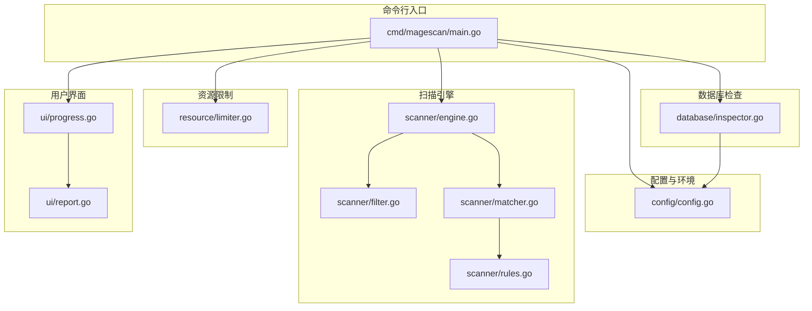
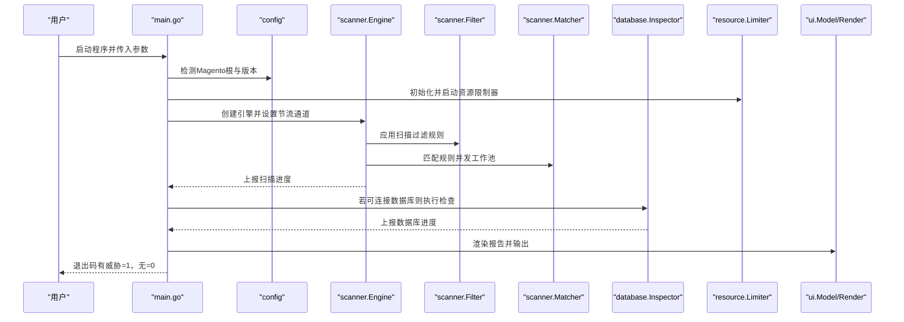
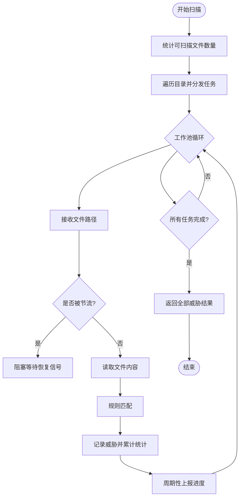
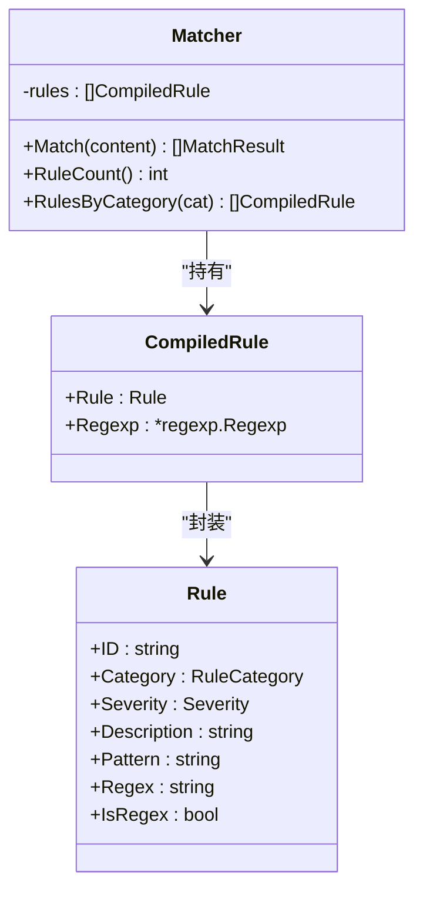
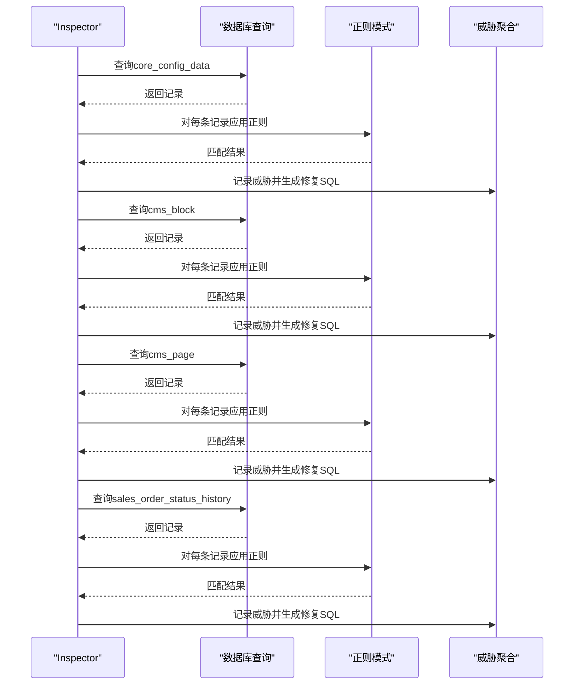
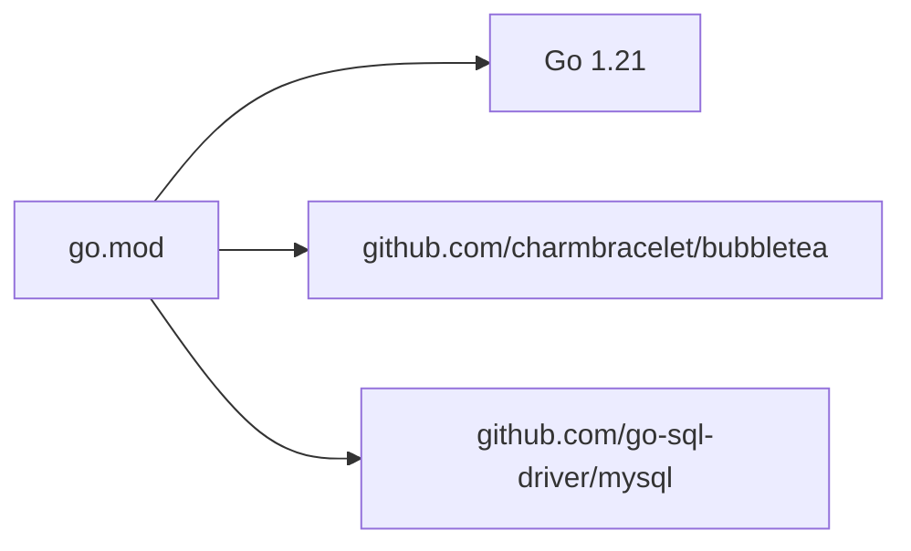
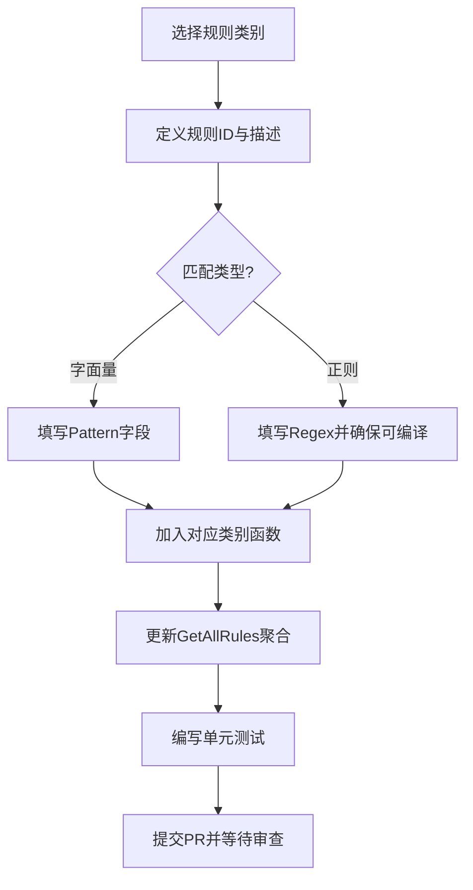

# 贡献指南

<cite>
**本文引用的文件**
- [README.md](file://README.md)
- [go.mod](file://go.mod)
- [cmd/magescan/main.go](file://cmd/magescan/main.go)
- [scanner/engine.go](file://scanner/engine.go)
- [scanner/filter.go](file://scanner/filter.go)
- [scanner/matcher.go](file://scanner/matcher.go)
- [scanner/rules.go](file://scanner/rules.go)
- [database/inspector.go](file://database/inspector.go)
- [resource/limiter.go](file://resource/limiter.go)
- [ui/progress.go](file://ui/progress.go)
- [ui/report.go](file://ui/report.go)
- [config/config.go](file://config/config.go)
</cite>

## 目录
1. [简介](#简介)
2. [项目结构](#项目结构)
3. [核心组件](#核心组件)
4. [架构总览](#架构总览)
5. [详细组件分析](#详细组件分析)
6. [依赖分析](#依赖分析)
7. [性能考虑](#性能考虑)
8. [故障排查指南](#故障排查指南)
9. [结论](#结论)
10. [附录](#附录)

## 简介
本指南面向希望参与 MageScan 开源项目的贡献者，涵盖从开发环境搭建、代码贡献流程、分支与提交规范，到新增恶意签名规则与检测算法、测试与质量保障、文档贡献、社区行为准则与沟通渠道、发布与版本管理策略，以及新贡献者的入门路径与学习资源。目标是帮助不同背景的开发者快速上手并高质量地参与项目。

## 项目结构
项目采用模块化分层设计，主要目录与职责如下：
- cmd/magescan：CLI 入口，负责参数解析、环境探测、进度通道与 TUI 驱动、扫描编排与退出码控制
- config：Magento 根目录与版本检测、env.php 解析、数据库连接配置
- scanner：文件扫描引擎（工作池、过滤器、匹配器、规则集）
- database：数据库连接器、安全检查器、威胁发现与修复 SQL 生成
- resource：CPU/内存限制器与自动节流
- ui：基于 Bubble Tea 的 TUI 进度显示与最终报告渲染
- tools.go：工具链声明（如 golangci-lint 等）

**图表来源**
- [cmd/magescan/main.go:1-208](file://cmd/magescan/main.go#L1-L208)
- [config/config.go:1-108](file://config/config.go#L1-L108)
- [scanner/engine.go:1-323](file://scanner/engine.go#L1-L323)
- [scanner/filter.go:1-98](file://scanner/filter.go#L1-L98)
- [scanner/matcher.go:1-168](file://scanner/matcher.go#L1-L168)
- [scanner/rules.go:1-468](file://scanner/rules.go#L1-L468)
- [database/inspector.go:1-359](file://database/inspector.go#L1-L359)
- [resource/limiter.go:1-118](file://resource/limiter.go#L1-L118)
- [ui/progress.go:1-289](file://ui/progress.go#L1-L289)
- [ui/report.go:1-230](file://ui/report.go#L1-L230)

**章节来源**
- [README.md:240-258](file://README.md#L240-L258)
- [go.mod:1-31](file://go.mod#L1-L31)

## 核心组件
- 命令行入口与编排：解析 CLI 参数、检测 Magento 根与版本、初始化资源限制器、启动 TUI、协调文件扫描与数据库检查、汇总报告与退出码
- 扫描引擎：工作池并发扫描、文件计数与遍历、大文件分块读取、进度上报、威胁聚合
- 规则与匹配：按类别组织的规则集（Web Shell、支付劫持、混淆、Magento 特定），支持字面量与正则匹配，线程安全
- 数据库检查：针对 core_config_data、cms_block、cms_page、sales_order_status_history 的敏感内容扫描与修复 SQL 生成
- 资源限制：CPU 核心数限制与内存阈值监控，自动节流与恢复
- 用户界面：实时进度 TUI 与最终报告渲染

**章节来源**
- [cmd/magescan/main.go:24-208](file://cmd/magescan/main.go#L24-L208)
- [scanner/engine.go:47-323](file://scanner/engine.go#L47-L323)
- [scanner/rules.go:39-58](file://scanner/rules.go#L39-L58)
- [database/inspector.go:63-359](file://database/inspector.go#L63-L359)
- [resource/limiter.go:11-118](file://resource/limiter.go#L11-L118)
- [ui/progress.go:54-289](file://ui/progress.go#L54-L289)
- [ui/report.go:11-230](file://ui/report.go#L11-L230)

## 架构总览
下图展示从 CLI 到各子系统的调用关系与数据流：

**图表来源**
- [cmd/magescan/main.go:35-207](file://cmd/magescan/main.go#L35-L207)
- [scanner/engine.go:61-121](file://scanner/engine.go#L61-L121)
- [scanner/filter.go:56-98](file://scanner/filter.go#L56-L98)
- [scanner/matcher.go:34-82](file://scanner/matcher.go#L34-L82)
- [database/inspector.go:79-109](file://database/inspector.go#L79-L109)
- [resource/limiter.go:34-76](file://resource/limiter.go#L34-L76)
- [ui/progress.go:136-197](file://ui/progress.go#L136-L197)
- [ui/report.go:57-168](file://ui/report.go#L57-L168)

## 详细组件分析

### 扫描引擎（Engine）与工作池
- 工作池规模为 CPU 核数的两倍，使用带缓冲的任务队列与 WaitGroup 协调
- 两阶段扫描：先统计总数，再遍历并分发任务；定期发送进度消息
- 大文件采用 1MB 分块重叠读取，避免内存峰值
- 支持资源限制器通过节流通道暂停/恢复工作

**图表来源**
- [scanner/engine.go:76-121](file://scanner/engine.go#L76-L121)
- [scanner/engine.go:195-227](file://scanner/engine.go#L195-L227)
- [scanner/engine.go:229-285](file://scanner/engine.go#L229-L285)
- [resource/limiter.go:54-76](file://resource/limiter.go#L54-L76)

**章节来源**
- [scanner/engine.go:47-323](file://scanner/engine.go#L47-L323)

### 文件过滤器（ScanFilter）
- 快速模式仅扫描 .php 与 .phtml
- 全量模式排除常见静态资源与日志扩展名
- 忽略缓存、日志、生成代码、版本控制与前端依赖目录

**章节来源**
- [scanner/filter.go:8-98](file://scanner/filter.go#L8-L98)

### 规则与匹配器（Matcher）
- 规则分为四类：Web Shell/Backdoor、Payment Skimmer、Obfuscation、Magento-Specific
- 字面量与正则两种匹配方式，正则在初始化时预编译以提升性能
- 并发安全，支持按类别筛选规则

**图表来源**
- [scanner/matcher.go:22-168](file://scanner/matcher.go#L22-L168)
- [scanner/rules.go:39-58](file://scanner/rules.go#L39-L58)

**章节来源**
- [scanner/matcher.go:22-168](file://scanner/matcher.go#L22-L168)
- [scanner/rules.go:50-468](file://scanner/rules.go#L50-L468)

### 数据库检查器（Inspector）
- 针对敏感配置路径、CMS 内容与订单状态历史进行扫描
- 使用正则模式识别可疑脚本注入、事件处理器注入、可疑外部资源等
- 为每个威胁生成可直接执行的修复 SQL

**图表来源**
- [database/inspector.go:79-359](file://database/inspector.go#L79-L359)

**章节来源**
- [database/inspector.go:31-359](file://database/inspector.go#L31-L359)

### 资源限制器（Limiter）
- 支持 CPU 核心上限与内存阈值（MB）
- 定时监控内存分配，超过阈值触发节流，低于阈值（滞回至 80%）恢复
- 提供节流通道供扫描工作池检查

**章节来源**
- [resource/limiter.go:11-118](file://resource/limiter.go#L11-L118)

### 用户界面（TUI 与报告）
- TUI 实时显示文件扫描进度、当前文件、威胁数量与耗时
- 数据库扫描阶段显示当前表与记录数
- 报告按严重级别排序，汇总威胁数量，并输出修复 SQL

**章节来源**
- [ui/progress.go:54-289](file://ui/progress.go#L54-L289)
- [ui/report.go:11-230](file://ui/report.go#L11-L230)

## 依赖分析
- Go 版本要求：1.21+
- 主要外部依赖：Bubble Tea（TUI）、MySQL 驱动
- 间接依赖：终端样式、颜色、同步工具等

**图表来源**
- [go.mod:1-31](file://go.mod#L1-L31)

**章节来源**
- [go.mod:1-31](file://go.mod#L1-L31)

## 性能考虑
- 并发模型：工作池大小为 CPU 数的两倍，最大化利用多核
- I/O 优化：大文件分块重叠读取，降低内存峰值
- 正则优化：规则在初始化时预编译，减少运行时开销
- 资源节流：内存超限自动暂停工作，GC 回收后滞回恢复，避免 OOM
- 进度上报：批量与周期性上报，降低 UI 更新压力

**章节来源**
- [scanner/engine.go:13-17](file://scanner/engine.go#L13-L17)
- [scanner/engine.go:66-68](file://scanner/engine.go#L66-L68)
- [scanner/matcher.go:44-61](file://scanner/matcher.go#L44-L61)
- [resource/limiter.go:64-117](file://resource/limiter.go#L64-L117)

## 故障排查指南
- 环境检测失败：确认目标路径包含 app/etc/env.php 与 bin/magento
- 数据库连接失败：检查 env.php 中的主机、端口、用户名、密码与数据库名
- 扫描卡住或内存过高：调整 -cpu-limit 与 -mem-limit 参数，启用资源限制器
- TUI 异常：尝试切换终端或禁用 alt screen；确保终端支持 ANSI 控制序列
- 退出码为 1：表示发现威胁，根据报告中的修复 SQL 进行处理

**章节来源**
- [config/config.go:49-107](file://config/config.go#L49-L107)
- [cmd/magescan/main.go:58-122](file://cmd/magescan/main.go#L58-L122)
- [resource/limiter.go:34-52](file://resource/limiter.go#L34-L52)

## 结论
MageScan 通过模块化设计与高性能扫描引擎，提供了对 Magento 2 的文件与数据库双重安全扫描能力。贡献者可在明确的流程与规范下，安全地扩展规则、优化性能、改进 UI 与文档，共同提升项目质量与社区协作效率。

## 附录

### 开发环境搭建
- 系统要求：Go 1.21+，可选 MySQL 用于数据库扫描
- 获取源码：克隆仓库后进入项目目录
- 构建二进制：使用 go build 在 cmd/magescan 目录构建
- 运行：直接执行生成的二进制，或参考 README 的使用示例

**章节来源**
- [README.md:40-58](file://README.md#L40-L58)
- [go.mod:3](file://go.mod#L3)

### 代码贡献流程
- 分支策略：采用功能分支开发，主分支仅接受通过 CI 的 PR
- 提交规范：遵循 Conventional Commits，主题前缀如 feat、fix、chore、docs、refactor
- 变更范围：尽量小而聚焦，避免无关格式化改动混入
- 测试与质量：新增规则需提供测试样例；保持覆盖率与性能不退步

### 新增恶意签名规则与检测算法
- 规则位置：在 scanner/rules.go 中按类别追加规则
- 规则字段：包含 ID、分类、严重级别、描述、字面量或正则表达式
- 正则建议：使用非贪婪匹配，避免误报；必要时配合上下文断言
- 性能注意：优先使用字面量匹配；正则仅在必要时启用
- 测试方法：编写单元测试覆盖关键匹配点，验证大小写、注释与边界情况

**图表来源**
- [scanner/rules.go:50-58](file://scanner/rules.go#L50-L58)
- [scanner/matcher.go:44-61](file://scanner/matcher.go#L44-L61)

**章节来源**
- [scanner/rules.go:50-468](file://scanner/rules.go#L50-L468)
- [scanner/matcher.go:34-82](file://scanner/matcher.go#L34-L82)

### 测试要求与质量保证
- 单元测试：覆盖规则匹配、过滤器逻辑、资源限制器行为
- 集成测试：端到端扫描（文件与数据库），验证报告输出与退出码
- 性能回归：对大文件扫描与高并发场景进行基准测试
- 文档一致性：随规则变更更新 README 的检测能力说明

### 文档贡献
- 文档位置：README.md 为主要文档
- 更新范围：功能变更、使用示例、检测能力说明
- 格式规范：使用一致的标题层级与表格格式，提供简洁示例

### 社区行为准则与沟通渠道
- 行为准则：尊重、包容、建设性反馈
- 沟通渠道：Issue/PR 讨论、邮件或即时通讯群组（如有）

### 发布流程与版本管理
- 版本策略：语义化版本（SemVer），主版本号用于破坏性变更
- 标签与发布：在合并 PR 后打标签并发布 Release
- 变更日志：记录重大功能、修复与破坏性变更

### 新贡献者入门与学习资源
- 学习路径：从 README 的使用与特性入手，阅读架构与核心组件，逐步深入到规则与匹配器
- 推荐资源：Go 官方文档、Bubble Tea 文档、MySQL 驱动文档