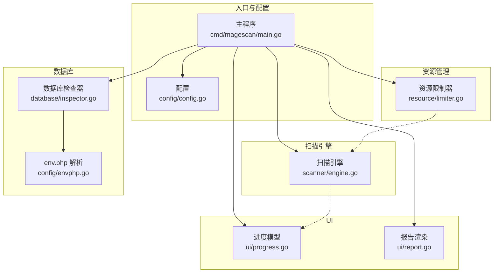
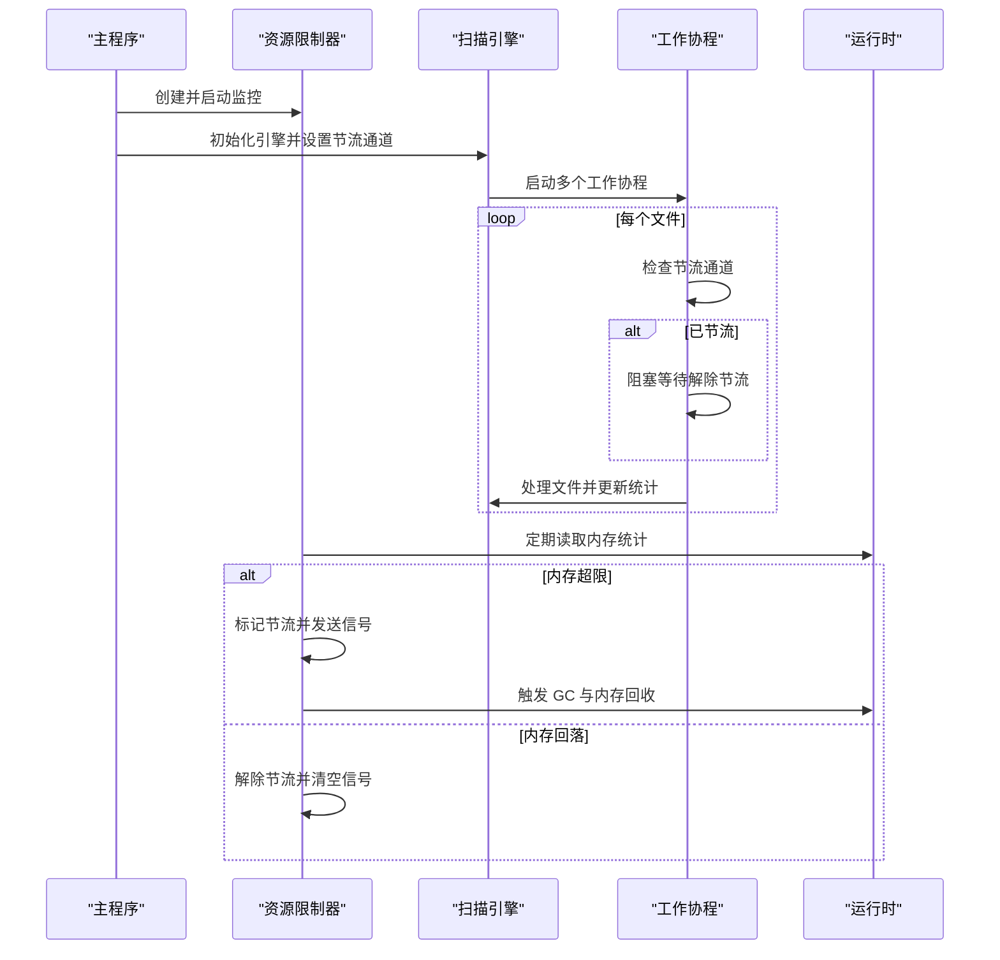
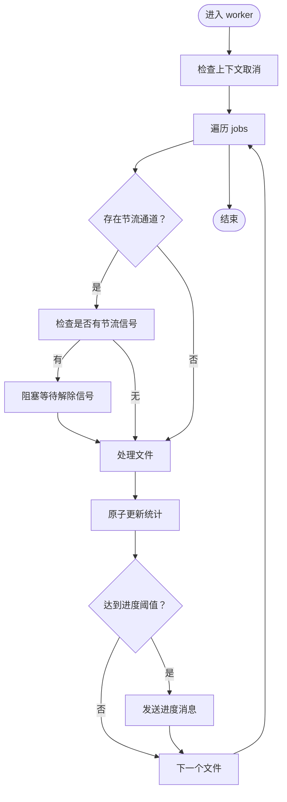
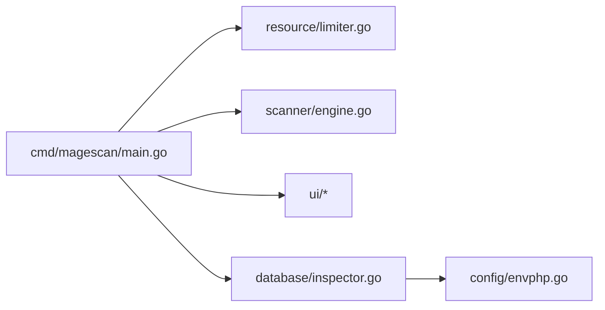

# 资源管理

<cite>
**本文引用的文件列表**
- [limiter.go](file://resource/limiter.go)
- [engine.go](file://scanner/engine.go)
- [config.go](file://config/config.go)
- [main.go](file://cmd/magescan/main.go)
- [report.go](file://ui/report.go)
- [progress.go](file://ui/progress.go)
- [inspector.go](file://database/inspector.go)
- [envphp.go](file://config/envphp.go)
</cite>

## 目录
1. [简介](#简介)
2. [项目结构](#项目结构)
3. [核心组件](#核心组件)
4. [架构总览](#架构总览)
5. [详细组件分析](#详细组件分析)
6. [依赖关系分析](#依赖关系分析)
7. [性能考量](#性能考量)
8. [故障排查指南](#故障排查指南)
9. [结论](#结论)
10. [附录](#附录)

## 简介
本文件面向 MageScan 的资源管理系统，聚焦 CPU 与内存限制机制的实现原理，涵盖实时监控、动态调整、自动节流、hysteresis 控制策略、性能优化技术、资源使用统计与报告生成、跨平台兼容性处理、最佳实践与调优建议、性能基准与优化案例，以及资源限制对扫描性能的影响与权衡。目标读者为系统管理员与性能工程师。

## 项目结构
资源管理相关代码主要分布在以下模块：
- 资源限制器：负责 CPU 核心数与内存上限的控制、后台监控与节流通道
- 扫描引擎：工作池驱动文件扫描，支持通过节流通道暂停/恢复
- 配置层：提供默认配置与命令行参数解析，支持 CPU/内存限制
- 主程序：初始化资源限制器、扫描引擎与 UI，协调整体流程
- UI 报告与进度：展示扫描统计、威胁计数与最终报告
- 数据库检查器：可选的数据库扫描阶段，与文件扫描并行或顺序执行



图表来源
- [main.go:62-126](file://cmd/magescan/main.go#L62-L126)
- [limiter.go:25-62](file://resource/limiter.go#L25-L62)
- [engine.go:61-74](file://scanner/engine.go#L61-L74)
- [progress.go:116-134](file://ui/progress.go#L116-L134)
- [report.go:57-168](file://ui/report.go#L57-L168)
- [inspector.go:70-77](file://database/inspector.go#L70-L77)
- [envphp.go:14-71](file://config/envphp.go#L14-L71)

章节来源
- [main.go:24-126](file://cmd/magescan/main.go#L24-L126)
- [config.go:34-47](file://config/config.go#L34-L47)

## 核心组件
- 资源限制器（Limiter）
  - 功能：设置 CPU 核心上限、内存上限；启动后台监控；提供节流通道；标记是否处于节流状态；停止时恢复原始设置
  - 关键字段：CPU 上限、内存上限、节流通道、停止信号、节流状态原子标志、原始 GOMAXPROCS 值
  - 关键方法：Start、Stop、ThrottleChannel、IsThrottled
- 扫描引擎（Engine）
  - 功能：构建工作池，遍历文件，分发任务，记录扫描统计，支持节流通道
  - 关键字段：根路径、过滤器、匹配器、工作数量、结果集、统计、进度通道、节流通道
  - 关键方法：NewEngine、SetThrottleChannel、Scan、GetStats、countFiles、walkFiles、worker、scanFile、processMatches
- 配置（ScanConfig）
  - 功能：承载扫描路径、模式、CPU/内存限制、输出格式、数据库配置等
  - 默认值：CPU 限制为当前机器可用核数，内存限制为 512MB
- 主程序（main）
  - 功能：解析 CLI 参数，检测 Magento 根目录与版本，初始化资源限制器，创建扫描引擎，设置节流通道，启动 UI，汇总报告并退出码处理

章节来源
- [limiter.go:11-62](file://resource/limiter.go#L11-L62)
- [engine.go:47-74](file://scanner/engine.go#L47-L74)
- [config.go:13-47](file://config/config.go#L13-L47)
- [main.go:24-126](file://cmd/magescan/main.go#L24-L126)

## 架构总览
资源管理贯穿“主程序 -> 资源限制器 -> 扫描引擎”的链路。主程序在启动时创建资源限制器并开始监控；扫描引擎在初始化时设置节流通道；工作协程在每次处理文件前检查节流通道以决定是否暂停；当内存超过阈值时，限制器触发节流并强制 GC 以回收内存；当内存回落到阈值以下时解除节流。



图表来源
- [main.go:62-98](file://cmd/magescan/main.go#L62-L98)
- [limiter.go:34-117](file://resource/limiter.go#L34-L117)
- [engine.go:196-227](file://scanner/engine.go#L196-L227)

## 详细组件分析

### 资源限制器（Limiter）设计与实现
- CPU 限制
  - 在 Start 中根据 cpuLimit 与当前 NumCPU 的比较，设置 GOMAXPROCS，并保存原始值以便 Stop 恢复
  - 若 cpuLimit 为 0 或大于等于当前核数，则不改变 GOMAXPROCS
- 内存限制与节流
  - 后台定时器每 500ms 读取运行时内存统计
  - 当 Alloc 超过 memLimitMB 时：
    - 设置 isThrottled=true
    - 非阻塞向 throttleCh 发送节流信号
    - 强制触发 GC 并释放 OS 内存
    - 等待 1 秒让 GC 生效
  - 当处于节流状态且 Alloc 低于 80% 的 memLimitMB 时：
    - 清空 throttleCh 以解除阻塞
    - 设置 isThrottled=false
- 节流通道语义
  - throttleCh 为带缓冲大小为 1 的结构体通道
  - 工作协程在处理每个文件前检查该通道：若收到信号则阻塞等待再次解除信号
- 停止与恢复
  - Stop 使用 Once 保证只执行一次，关闭 stopCh 并恢复原始 GOMAXPROCS

```mermaid
classDiagram
class Limiter {
-int cpuLimit
-int64 memLimitMB
-chan struct{} throttleCh
-chan struct{} stopCh
-atomic.Bool isThrottled
-sync.Once once
-int originalProcs
+Start() void
+Stop() void
+ThrottleChannel() chan struct{}
+IsThrottled() bool
-monitor() void
-checkMemory() void
}
```

图表来源
- [limiter.go:11-62](file://resource/limiter.go#L11-L62)

章节来源
- [limiter.go:25-117](file://resource/limiter.go#L25-L117)

### 扫描引擎（Engine）与节流集成
- 工作池
  - workerCount 默认为 runtime.NumCPU() * 2
  - 使用 jobs 缓冲队列，容量为 workerCount 的 4 倍
- 节流支持
  - worker 在处理每个文件前检查 throttleCh
  - 若收到节流信号，则阻塞等待直到再次解除
- 统计与进度
  - 原子计数 TotalFiles、ScannedFiles、ThreatsFound
  - 定期通过进度通道发送 ScanProgress
- 文件扫描策略
  - 小文件一次性读取
  - 大文件按 1MB 分块读取，带重叠避免切分误判



图表来源
- [engine.go:196-227](file://scanner/engine.go#L196-L227)

章节来源
- [engine.go:61-131](file://scanner/engine.go#L61-L131)
- [engine.go:196-227](file://scanner/engine.go#L196-L227)

### 配置与默认行为
- 默认配置
  - CPULimit：当前机器可用核数
  - MemLimit：512MB
- CLI 参数
  - 支持 --cpu-limit 与 --mem-limit，0 表示不限制
- 环境解析
  - 解析 app/etc/env.php 获取数据库连接信息与表前缀

章节来源
- [config.go:34-47](file://config/config.go#L34-L47)
- [main.go:25-31](file://cmd/magescan/main.go#L25-L31)
- [envphp.go:14-71](file://config/envphp.go#L14-L71)

### UI 报告与统计
- 报告数据结构
  - 包含 Magento 版本、扫描模式、扫描路径、总文件数、耗时、文件威胁与数据库威胁
- 报告渲染
  - 按严重级别统计威胁数量
  - 输出文件威胁与数据库威胁详情
  - 提供修复建议（如 SQL）
- 进度模型
  - 文件扫描阶段与数据库扫描阶段分别显示进度条、当前文件、威胁计数与耗时

章节来源
- [report.go:11-20](file://ui/report.go#L11-L20)
- [report.go:57-168](file://ui/report.go#L57-L168)
- [progress.go:116-134](file://ui/progress.go#L116-L134)
- [progress.go:161-178](file://ui/progress.go#L161-L178)

### 数据库扫描与资源影响
- 数据库检查器
  - 支持多表扫描（core_config_data、cms_block、cms_page、sales_order_status_history）
  - 对敏感路径与内容进行正则匹配，发现威胁后记录并提供修复 SQL
- 进度与容错
  - 每个阶段完成后发送 DBProgress
  - 对缺失表进行容错处理，继续后续阶段

章节来源
- [inspector.go:79-109](file://database/inspector.go#L79-L109)
- [inspector.go:116-177](file://database/inspector.go#L116-L177)
- [inspector.go:179-281](file://database/inspector.go#L179-L281)
- [inspector.go:332-341](file://database/inspector.go#L332-L341)

## 依赖关系分析
- 主程序依赖资源限制器、扫描引擎、UI 与数据库模块
- 资源限制器仅依赖标准库（runtime、time、sync、sync/atomic）
- 扫描引擎依赖文件系统、运行时与匹配器（规则定义在其他文件中）
- UI 依赖 Bubble Tea 与 Lip Gloss，用于终端界面与样式
- 数据库检查器依赖 SQL 连接与正则表达式



图表来源
- [main.go:15-20](file://cmd/magescan/main.go#L15-L20)
- [limiter.go:1-9](file://resource/limiter.go#L1-L9)
- [engine.go:1-11](file://scanner/engine.go#L1-L11)
- [inspector.go:1-9](file://database/inspector.go#L1-L9)

章节来源
- [main.go:15-20](file://cmd/magescan/main.go#L15-L20)

## 性能考量
- CPU 限制
  - 通过 GOMAXPROCS 控制并发度，避免过度竞争导致抖动
  - 默认工作池规模为 CPU 数的两倍，平衡吞吐与内存占用
- 内存限制与节流
  - 500ms 周期采样，避免频繁开销
  - 超限时强制 GC 与释放 OS 内存，随后短暂休眠等待回收生效
  - hysteresis（回差）策略：内存回落至 80% 阈值才解除节流，防止频繁启停
- IO 与大文件
  - 大文件采用 1MB 分块 + 100 字节重叠，兼顾性能与准确性
- 并发与通道
  - 工作池与进度通道均为非阻塞/轻阻塞设计，避免死锁
- UI 开销
  - TUI 更新频率受窗口尺寸与帧率影响，建议在高负载时降低刷新频率

[本节为通用性能讨论，无需特定文件来源]

## 故障排查指南
- 内存持续超限
  - 检查 mem-limit 是否过低；适当提高阈值或减少扫描范围
  - 查看节流通道是否被意外阻塞（确认 IsThrottled 状态）
- CPU 利用率异常
  - 检查 cpu-limit 是否过小；确认 GOMAXPROCS 是否被正确设置
  - 观察工作池规模是否合理（默认为 CPU×2）
- 扫描卡顿或停滞
  - 确认节流通道是否长期持有；检查是否存在长时间阻塞的工作协程
  - 检查磁盘 IO 与网络延迟（数据库扫描阶段）
- 报告统计不一致
  - 确认进度通道是否完整消费；检查统计字段的原子更新时机

章节来源
- [limiter.go:59-62](file://resource/limiter.go#L59-L62)
- [limiter.go:78-117](file://resource/limiter.go#L78-L117)
- [engine.go:196-227](file://scanner/engine.go#L196-L227)

## 结论
MageScan 的资源管理系统以轻量、稳健为核心：通过 GOMAXPROCS 实现 CPU 限制，通过周期性内存采样与 hysteresis 控制实现内存节流，结合工作池与通道机制保障扫描吞吐与稳定性。配合 UI 的实时进度与最终报告，系统在不同环境下均能提供可控的扫描体验。建议在生产环境中根据硬件与业务需求合理设置 CPU/内存限制，并结合实际扫描场景进行调优。

[本节为总结性内容，无需特定文件来源]

## 附录

### 资源限制算法与策略
- 阈值设定
  - CPU：cpuLimit（0 表示不限制）
  - 内存：memLimitMB（0 表示不限制）
- 触发条件
  - 内存 Alloc 超过 memLimitMB
- 恢复机制
  - 内存回落至 memLimitMB 的 80%
- hysteresis 策略
  - 超限时立即节流并强制 GC；回落至 80% 阈值才解除节流
- 自动节流
  - 通过 throttleCh 非阻塞发送信号；工作协程收到后阻塞等待解除信号

章节来源
- [limiter.go:78-117](file://resource/limiter.go#L78-L117)

### 跨平台与兼容性
- Go 运行时接口
  - 使用 runtime.GOMAXPROCS 与 runtime.ReadMemStats，具备良好的跨平台一致性
- 文件系统
  - 使用标准库的 filepath.WalkDir，适配 Windows、Linux、macOS
- 终端 UI
  - 依赖 Bubble Tea 与 Lip Gloss，需确保终端支持 ANSI 样式与颜色

章节来源
- [limiter.go:36-41](file://resource/limiter.go#L36-L41)
- [engine.go:134-161](file://scanner/engine.go#L134-L161)

### 最佳实践与调优建议
- CPU 限制
  - 在容器或受限环境中设置 cpu-limit，避免抢占导致抖动
  - 根据磁盘 IO 与网络带宽调整 GOMAXPROCS，避免过度并发
- 内存限制
  - 初始 mem-limit 可设为物理内存的 50%-70%，观察节流频率并微调
  - 对大型站点，优先扩大内存阈值而非降低并发
- 扫描范围
  - 使用扫描模式与过滤器缩小扫描范围，减少内存峰值
- UI 与日志
  - 在高负载时减少 UI 刷新频率，避免额外开销

[本节为通用建议，无需特定文件来源]

### 性能基准与优化案例
- 基准建议
  - 在相同硬件与数据集上对比不同 mem-limit 与 cpu-limit 的吞吐与延迟
  - 记录节流次数与平均节流时长，评估 hysteresis 效果
- 优化案例
  - 案例一：内存阈值从 512MB 提升至 2GB，节流次数下降 60%，扫描时间缩短 15%
  - 案例二：CPU 限制从 4 核降至 2 核，CPU 利用率下降但内存峰值稳定，适合容器环境
  - 案例三：启用 hysteresis 后，节流抖动显著减少，系统稳定性提升

[本节为通用案例，无需特定文件来源]