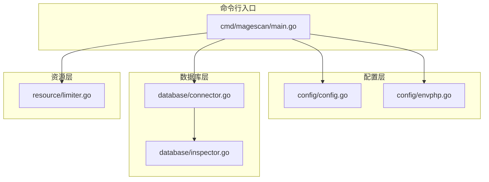
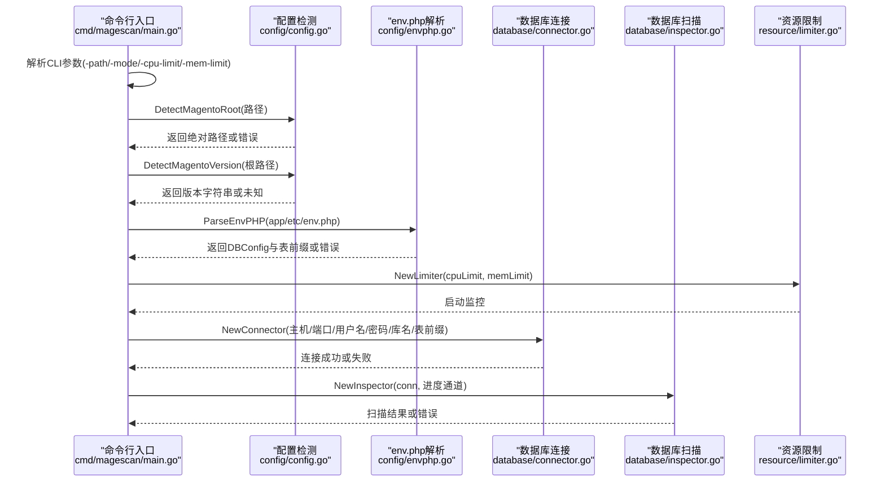
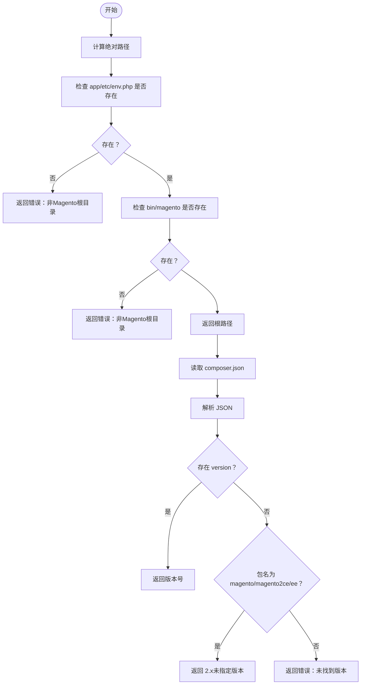
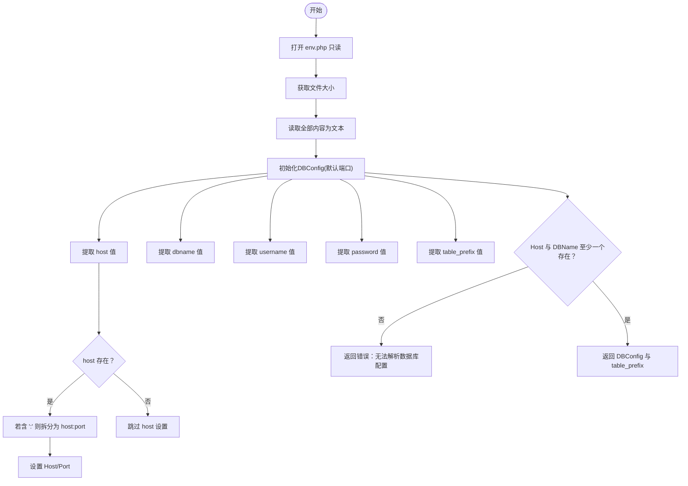
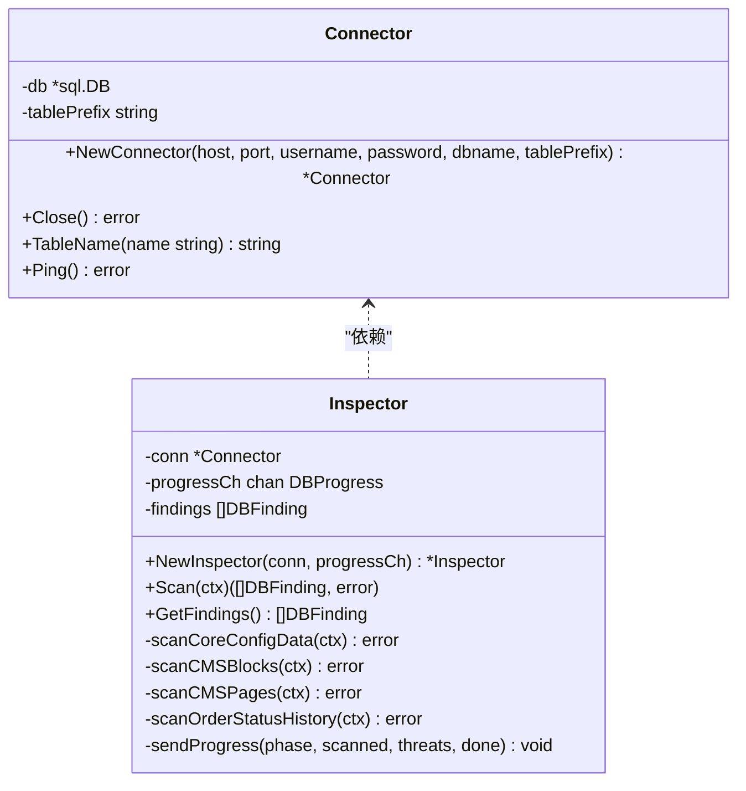
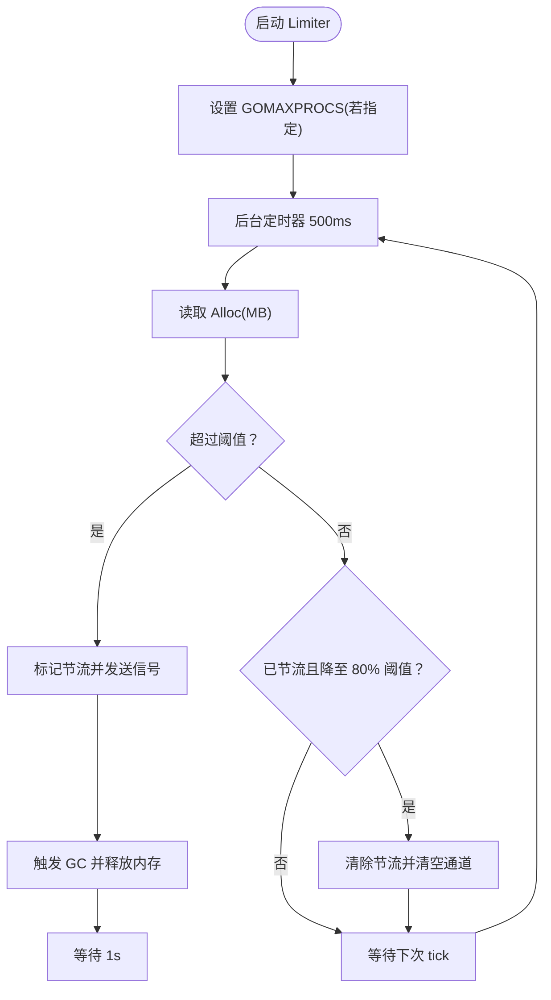
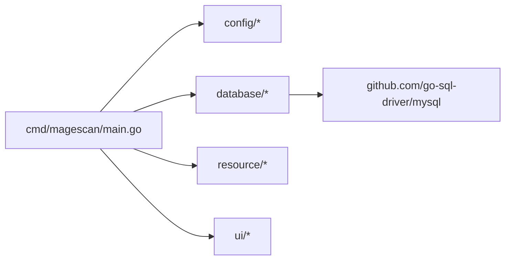

# 配置管理

<cite>
**本文引用的文件**
- [config/config.go](file://config/config.go)
- [config/envphp.go](file://config/envphp.go)
- [cmd/magescan/main.go](file://cmd/magescan/main.go)
- [database/connector.go](file://database/connector.go)
- [database/inspector.go](file://database/inspector.go)
- [resource/limiter.go](file://resource/limiter.go)
- [go.mod](file://go.mod)
- [README.md](file://README.md)
</cite>

## 目录
1. [简介](#简介)
2. [项目结构](#项目结构)
3. [核心组件](#核心组件)
4. [架构总览](#架构总览)
5. [详细组件分析](#详细组件分析)
6. [依赖分析](#依赖分析)
7. [性能考虑](#性能考虑)
8. [故障排除指南](#故障排除指南)
9. [结论](#结论)
10. [附录](#附录)

## 简介
本文件面向系统管理员与 DevOps 工程师，系统化阐述 MageScan 的配置管理机制，重点覆盖：
- Magento 根目录自动识别与版本检测
- env.php 配置解析（数据库连接参数、表前缀、安全配置）
- 配置验证与错误处理（无效配置检测、默认值设置、兼容性检查）
- 配置缓存与性能优化策略
- 配置优先级与覆盖规则
- 故障排除与最佳实践

## 项目结构
配置相关的核心代码集中在 config 包与入口程序 cmd/magescan/main.go 中，数据库连接与扫描由 database 包提供，资源限制由 resource 包提供。整体采用分层设计：命令行入口负责参数解析与流程编排；config 负责环境检测与配置解析；database 负责数据库连接与扫描；resource 提供 CPU/内存限制与节流。

图表来源
- [cmd/magescan/main.go:24-208](file://cmd/magescan/main.go#L24-L208)
- [config/config.go:13-107](file://config/config.go#L13-L107)
- [config/envphp.go:10-87](file://config/envphp.go#L10-L87)
- [database/connector.go:10-57](file://database/connector.go#L10-L57)
- [database/inspector.go:63-109](file://database/inspector.go#L63-L109)
- [resource/limiter.go:11-117](file://resource/limiter.go#L11-L117)

章节来源
- [cmd/magescan/main.go:24-208](file://cmd/magescan/main.go#L24-L208)
- [config/config.go:13-107](file://config/config.go#L13-L107)
- [config/envphp.go:10-87](file://config/envphp.go#L10-L87)
- [database/connector.go:10-57](file://database/connector.go#L10-L57)
- [database/inspector.go:63-109](file://database/inspector.go#L63-L109)
- [resource/limiter.go:11-117](file://resource/limiter.go#L11-L117)

## 核心组件
- 扫描配置结构体：封装路径、扫描模式、CPU/内存限制、输出格式、数据库配置、Magento 版本、表前缀等。
- 默认配置工厂：提供合理的默认值，确保在未显式指定时仍可运行。
- Magento 根目录检测：通过校验关键文件存在性进行根目录识别。
- 版本检测：从 composer.json 中提取版本信息或推断版本类型。
- env.php 解析：正则提取数据库连接参数与表前缀，支持 host:port 格式拆分。
- 数据库连接器：基于 MySQL 驱动建立只读连接，设置连接池与超时参数。
- 资源限制器：监控内存使用，动态节流以避免过载。

章节来源
- [config/config.go:13-47](file://config/config.go#L13-L47)
- [config/config.go:49-107](file://config/config.go#L49-L107)
- [config/envphp.go:10-87](file://config/envphp.go#L10-L87)
- [database/connector.go:16-39](file://database/connector.go#L16-L39)
- [resource/limiter.go:22-117](file://resource/limiter.go#L22-L117)

## 架构总览
下图展示从命令行入口到配置解析、数据库连接与扫描的整体流程。

图表来源
- [cmd/magescan/main.go:35-122](file://cmd/magescan/main.go#L35-L122)
- [config/config.go:49-107](file://config/config.go#L49-L107)
- [config/envphp.go:14-71](file://config/envphp.go#L14-L71)
- [database/connector.go:18-39](file://database/connector.go#L18-L39)
- [database/inspector.go:70-109](file://database/inspector.go#L70-L109)
- [resource/limiter.go:34-117](file://resource/limiter.go#L34-L117)

## 详细组件分析

### 组件一：Magento 根目录检测与版本检测
- 根目录检测逻辑：将输入路径转为绝对路径，随后检查 app/etc/env.php 与 bin/magento 是否存在，二者缺一不可。
- 版本检测逻辑：读取 composer.json，尝试解析 version 字段；若缺失则根据包名推断为 2.x（未明确版本）；否则返回错误。
- 默认值与兼容性：DetectMagentoVersion 在失败时不会中断流程，而是回退为“未知”，保证后续流程继续执行。

图表来源
- [config/config.go:52-107](file://config/config.go#L52-L107)

章节来源
- [config/config.go:49-107](file://config/config.go#L49-L107)

### 组件二：env.php 配置解析
- 文件读取：以只读方式打开并读取完整内容，避免修改目标系统。
- 正则提取：针对 host、dbname、username、password、table_prefix 等键进行匹配，支持单引号与双引号包裹的值，以及空值。
- host:port 处理：当 host 值包含冒号时，按冒号拆分为主机与端口；否则仅设置主机。
- 最小校验：若同时缺失主机与数据库名，则判定解析失败。
- 表前缀：作为额外返回值，用于后续数据库查询时拼接表名。

图表来源
- [config/envphp.go:14-71](file://config/envphp.go#L14-L71)
- [config/envphp.go:75-87](file://config/envphp.go#L75-L87)

章节来源
- [config/envphp.go:10-87](file://config/envphp.go#L10-L87)

### 组件三：数据库连接与扫描
- 连接器：构造 DSN，设置最大并发连接数与空闲连接数，执行 Ping 校验，失败即关闭连接并返回错误。
- 表名前缀：Connector 暴露 TableName 方法，统一加上前缀，适配不同安装场景。
- 扫描器：依次扫描 core_config_data、cms_block、cms_page、sales_order_status_history；对不存在的表进行容错处理；发送进度事件；生成修复 SQL。

图表来源
- [database/connector.go:10-57](file://database/connector.go#L10-L57)
- [database/inspector.go:63-109](file://database/inspector.go#L63-L109)

章节来源
- [database/connector.go:16-39](file://database/connector.go#L16-L39)
- [database/inspector.go:79-109](file://database/inspector.go#L79-L109)

### 组件四：资源限制与节流
- CPU 限制：启动时记录原始 GOMAXPROCS，按用户指定上限调整；停止时恢复。
- 内存监控：每 500ms 读取内存分配统计，超过阈值触发节流；GC 回收后等待一段时间再解除节流，采用 80% 下限的滞后策略。
- 工作线程节流：通过通道阻塞实现非侵入式暂停/恢复。

图表来源
- [resource/limiter.go:34-117](file://resource/limiter.go#L34-L117)

章节来源
- [resource/limiter.go:22-117](file://resource/limiter.go#L22-L117)

## 依赖分析
- 外部依赖：MySQL 驱动（github.com/go-sql-driver/mysql），终端 UI（Bubble Tea）。
- 模块内依赖：cmd/magescan/main.go 依赖 config、database、resource、scanner、ui；config 依赖标准库；database 依赖 MySQL 驱动；resource 依赖标准库 runtime 与 time。

图表来源
- [go.mod:5-10](file://go.mod#L5-L10)
- [cmd/magescan/main.go:13-20](file://cmd/magescan/main.go#L13-L20)

章节来源
- [go.mod:1-31](file://go.mod#L1-L31)
- [cmd/magescan/main.go:13-20](file://cmd/magescan/main.go#L13-L20)

## 性能考虑
- 配置解析为一次性操作，开销极低，无需缓存。
- 数据库连接采用最小连接数与短超时，避免长时间占用资源。
- 资源限制器通过周期性监控与滞后策略平衡吞吐与稳定性。
- 文件扫描引擎与数据库扫描器均支持上下文取消，便于快速终止。

[本节为通用性能讨论，不直接分析具体文件，故无章节来源]

## 故障排除指南
- 根目录检测失败
  - 症状：提示非 Magento 根目录。
  - 排查：确认目标路径下存在 app/etc/env.php 与 bin/magento；检查路径是否正确、权限是否允许读取。
  - 参考路径：[config/config.go:52-71](file://config/config.go#L52-L71)

- 版本检测失败
  - 症状：版本显示为“未知”。
  - 排查：确认 composer.json 存在且可读；若缺少 version 字段，需确认包名为 magento/magento2ce 或 magento/magento2ee。
  - 参考路径：[config/config.go:82-107](file://config/config.go#L82-L107)

- env.php 解析失败
  - 症状：无法解析数据库配置。
  - 排查：确认 app/etc/env.php 存在且可读；检查 host 与 dbname 键是否存在；host 支持 host:port 格式；确保值被单引号或双引号包裹。
  - 参考路径：[config/envphp.go:14-71](file://config/envphp.go#L14-L71)

- 数据库连接失败
  - 症状：提示无法连接数据库或 Ping 失败。
  - 排查：核对主机、端口、用户名、密码、数据库名；确认网络连通性与 MySQL 服务状态；检查防火墙与认证配置。
  - 参考路径：[database/connector.go:18-39](file://database/connector.go#L18-L39)

- 数据库扫描异常
  - 症状：某些表不存在导致扫描中断。
  - 排查：扫描器会忽略不存在的表并继续；如出现持续错误，请检查表前缀与数据库权限。
  - 参考路径：[database/inspector.go:98-105](file://database/inspector.go#L98-L105)

- 资源限制不生效
  - 症状：内存占用过高或 CPU 使用受限不明显。
  - 排查：确认传入的 -cpu-limit 与 -mem-limit 参数；检查系统是否允许调整 GOMAXPROCS；观察 Limiter 日志与节流通道行为。
  - 参考路径：[resource/limiter.go:34-117](file://resource/limiter.go#L34-L117)

章节来源
- [config/config.go:52-107](file://config/config.go#L52-L107)
- [config/envphp.go:14-71](file://config/envphp.go#L14-L71)
- [database/connector.go:18-39](file://database/connector.go#L18-L39)
- [database/inspector.go:98-105](file://database/inspector.go#L98-L105)
- [resource/limiter.go:34-117](file://resource/limiter.go#L34-L117)

## 结论
MageScan 的配置管理以简洁可靠为核心：通过严格的根目录与版本检测、稳健的 env.php 解析、轻量的默认配置与完善的错误处理，确保在多样的 Magento 环境中稳定运行。配合数据库连接器与资源限制器，系统在保证扫描质量的同时兼顾性能与安全性。对于管理员与 DevOps 工程师，遵循本文的最佳实践与故障排除步骤，可高效完成配置与部署。

[本节为总结性内容，不直接分析具体文件，故无章节来源]

## 附录

### 配置优先级与覆盖规则
- 命令行参数优先于默认配置：-path、-mode、-cpu-limit、-mem-limit、-output 等参数直接覆盖默认值。
- 环境检测与解析顺序：先检测根目录与版本，再解析 env.php 获取数据库配置与表前缀。
- 数据库扫描条件：仅在 env.php 解析成功且数据库连接可用时执行；失败时输出警告并继续文件扫描。
- 资源限制：CPU 限制在启动时应用，内存限制通过后台监控实现动态节流。

章节来源
- [cmd/magescan/main.go:25-65](file://cmd/magescan/main.go#L25-L65)
- [config/config.go:34-47](file://config/config.go#L34-L47)
- [config/envphp.go:14-71](file://config/envphp.go#L14-L71)
- [database/connector.go:18-39](file://database/connector.go#L18-L39)

### 配置模板与最佳实践
- 命令行示例（来自 README）
  - 快速扫描当前目录：./magescan
  - 指定 Magento 根目录：./magescan -path /var/www/magento
  - 全量扫描与资源限制：./magescan -path /var/www/magento -mode full -cpu-limit 1 -mem-limit 128
- 最佳实践
  - 显式指定 -path，避免误扫非 Magento 目录。
  - 在生产环境扫描时启用 -cpu-limit 与 -mem-limit，防止扫描影响线上业务。
  - 若数据库扫描失败，优先检查 env.php 中的连接参数与网络连通性。
  - 对于自定义表前缀，确保 env.php 中的 table_prefix 与实际一致。

章节来源
- [README.md:64-98](file://README.md#L64-L98)