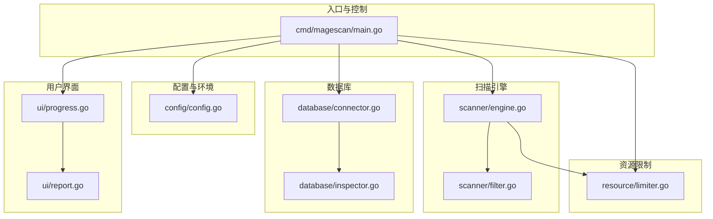
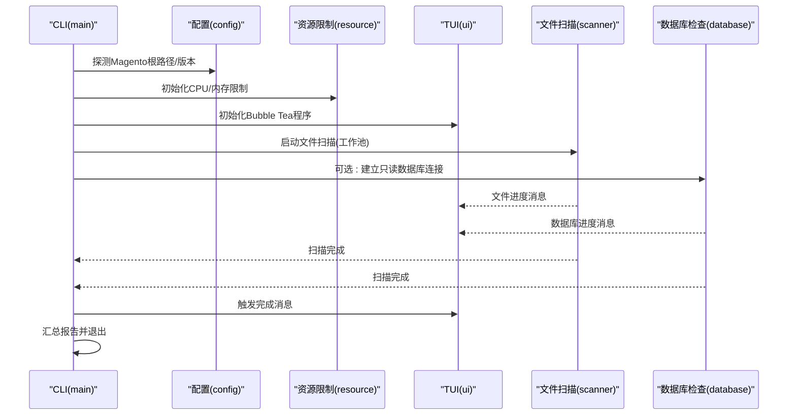
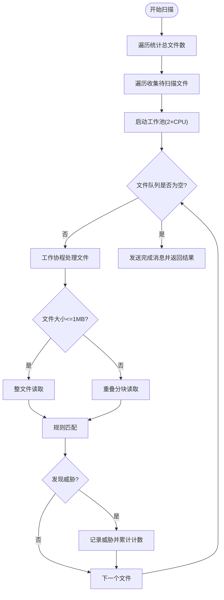
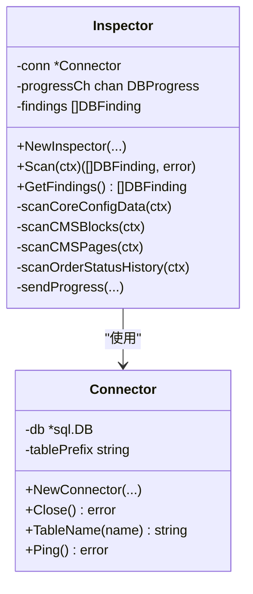
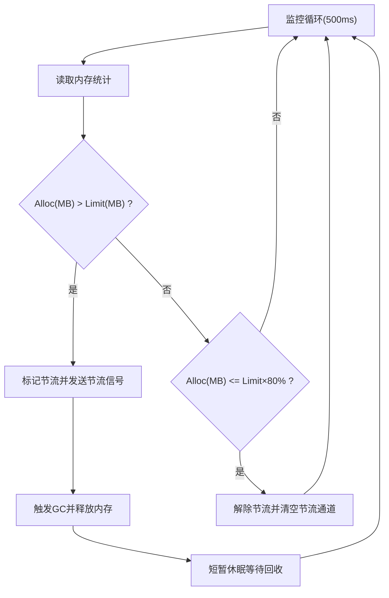
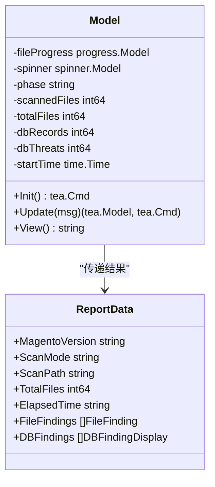
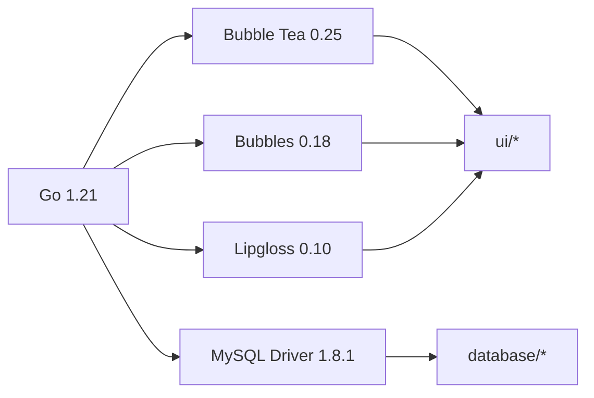

# 技术栈

<cite>
**本文引用的文件**
- [go.mod](file://go.mod)
- [tools.go](file://tools.go)
- [cmd/magescan/main.go](file://cmd/magescan/main.go)
- [README.md](file://README.md)
- [ui/progress.go](file://ui/progress.go)
- [ui/report.go](file://ui/report.go)
- [database/connector.go](file://database/connector.go)
- [database/inspector.go](file://database/inspector.go)
- [resource/limiter.go](file://resource/limiter.go)
- [scanner/engine.go](file://scanner/engine.go)
- [scanner/filter.go](file://scanner/filter.go)
- [config/config.go](file://config/config.go)
</cite>

## 目录
1. [简介](#简介)
2. [项目结构](#项目结构)
3. [核心组件](#核心组件)
4. [架构总览](#架构总览)
5. [详细组件分析](#详细组件分析)
6. [依赖关系分析](#依赖关系分析)
7. [性能与并发特性](#性能与并发特性)
8. [故障排查指南](#故障排查指南)
9. [结论](#结论)
10. [附录](#附录)

## 简介
本项目是一个高性能、只读的 Magento 2 安全扫描器，支持文件系统与数据库双重检测，提供实时终端界面（TUI）与可执行二进制输出。技术栈以 Go 1.21+ 为核心，结合 Charm 生态（Bubble Tea、Bubbles、Lipgloss）实现优雅的 TUI 交互，并通过标准库并发模型与资源限制机制保障稳定性与可控性。

## 项目结构
项目采用按功能域分层的目录组织方式：
- cmd/magescan：CLI 入口与控制流编排
- config：环境探测与配置解析（Magento 根路径、版本、数据库配置）
- scanner：文件扫描引擎（过滤、匹配、并发工作池、大文件分块扫描）
- database：数据库连接与安全检查（只读查询、威胁识别、修复建议 SQL）
- resource：CPU/内存资源限制与自动节流
- ui：TUI 进度展示与最终报告渲染
- tools.go：确保间接依赖被 go.mod 正确跟踪

图表来源
- [cmd/magescan/main.go:1-208](file://cmd/magescan/main.go#L1-L208)
- [config/config.go:1-108](file://config/config.go#L1-L108)
- [scanner/engine.go:1-323](file://scanner/engine.go#L1-L323)
- [scanner/filter.go:1-98](file://scanner/filter.go#L1-L98)
- [resource/limiter.go:1-118](file://resource/limiter.go#L1-L118)
- [database/connector.go:1-58](file://database/connector.go#L1-L58)
- [database/inspector.go:1-359](file://database/inspector.go#L1-L359)
- [ui/progress.go:1-289](file://ui/progress.go#L1-L289)
- [ui/report.go:1-230](file://ui/report.go#L1-L230)

章节来源
- [README.md:240-258](file://README.md#L240-L258)
- [cmd/magescan/main.go:24-207](file://cmd/magescan/main.go#L24-L207)

## 核心组件
- CLI 入口与控制流：负责参数解析、环境探测、信号处理、TUI 初始化、扫描任务调度与结果汇总。
- 扫描引擎：基于工作池的并发扫描，支持“快速/完整”两种模式；对大文件采用重叠分块读取策略。
- 数据库检查器：对核心配置表、CMS 内容与订单状态历史进行只读扫描，生成修复建议 SQL。
- 资源限制器：动态监控内存占用，按阈值触发节流通道，避免 OOM 并保持响应性。
- TUI 与报告：使用 Bubble Tea 实时进度展示，最终报告采用 Lipgloss 渲染样式。
- 配置模块：自动检测 Magento 根路径与版本，解析 env.php 获取数据库连接信息。

章节来源
- [cmd/magescan/main.go:24-207](file://cmd/magescan/main.go#L24-L207)
- [scanner/engine.go:47-121](file://scanner/engine.go#L47-L121)
- [database/inspector.go:63-109](file://database/inspector.go#L63-L109)
- [resource/limiter.go:11-52](file://resource/limiter.go#L11-L52)
- [ui/progress.go:54-82](file://ui/progress.go#L54-L82)
- [config/config.go:49-107](file://config/config.go#L49-L107)

## 架构总览
整体流程从 CLI 入口开始，先进行环境探测与配置解析，随后启动文件扫描与数据库扫描两个并行子任务，通过通道将进度回传至 TUI，最后汇总生成报告并退出。

图表来源
- [cmd/magescan/main.go:78-157](file://cmd/magescan/main.go#L78-L157)
- [ui/progress.go:140-197](file://ui/progress.go#L140-L197)
- [scanner/engine.go:76-121](file://scanner/engine.go#L76-L121)
- [database/inspector.go:79-109](file://database/inspector.go#L79-L109)

## 详细组件分析

### CLI 控制流与并发编排
- 参数解析与环境探测：解析 -path/-mode/-cpu-limit/-mem-limit/-output 等标志；检测 Magento 根路径与版本；解析 env.php 获取数据库配置。
- 信号处理：监听 SIGINT/SIGTERM，触发上下文取消，实现优雅退出。
- 并发与通道：文件扫描与数据库扫描分别在 goroutine 中运行；通过通道将进度消息转发到 TUI；扫描完成后发送完成消息。
- 结果汇总：统计耗时、转换发现项为报告数据结构，渲染报告并根据威胁数量设置退出码。

章节来源
- [cmd/magescan/main.go:24-207](file://cmd/magescan/main.go#L24-L207)

### 扫描引擎与文件过滤
- 工作池：工作数为 CPU 核心数的两倍，提高吞吐量。
- 过滤策略：
  - 快速模式：仅扫描 .php 与 .phtml。
  - 完整模式：排除常见静态/日志/媒体等扩展。
- 目录跳过：内置大量目录白名单（缓存、日志、静态资源、版本控制、第三方依赖等）。
- 大文件处理：超过 1MB 的文件采用重叠分块读取，避免一次性加载导致内存峰值。
- 进度上报：周期性发送扫描进度，包含当前文件、已扫描/总数、威胁计数。

图表来源
- [scanner/engine.go:76-121](file://scanner/engine.go#L76-L121)
- [scanner/engine.go:195-227](file://scanner/engine.go#L195-L227)
- [scanner/engine.go:229-285](file://scanner/engine.go#L229-L285)
- [scanner/filter.go:87-97](file://scanner/filter.go#L87-L97)

章节来源
- [scanner/engine.go:47-121](file://scanner/engine.go#L47-L121)
- [scanner/filter.go:13-97](file://scanner/filter.go#L13-L97)

### 数据库连接与安全检查
- 连接管理：使用标准库 database/sql，驱动为 go-sql-driver/mysql；DSN 设置连接超时与读取超时；限制最大连接数与空闲连接数；Ping 校验连通性。
- 表前缀感知：根据 env.php 解析的表前缀拼接实际表名，适配多租户或自定义前缀场景。
- 扫描范围：core_config_data、cms_block、cms_page、sales_order_status_history。
- 威胁模式：基于正则表达式集合检测外部脚本注入、eval、iframe、javascript 协议、document.write、base64_decode、可疑内联脚本、事件处理器注入、可疑顶级域名等。
- 修复建议：为每个威胁生成可直接执行的 SQL，提示管理员审阅后执行。

图表来源
- [database/connector.go:10-57](file://database/connector.go#L10-L57)
- [database/inspector.go:63-109](file://database/inspector.go#L63-L109)

章节来源
- [database/connector.go:16-57](file://database/connector.go#L16-L57)
- [database/inspector.go:116-330](file://database/inspector.go#L116-L330)

### 资源限制与自动节流
- CPU 限制：启动时调用 GOMAXPROCS 将并发上限限制到指定核数；停止时恢复原设置。
- 内存监控：后台定时器每 500ms 读取内存统计；超过阈值时通过节流通道阻塞工作协程，触发 GC 并短暂休眠；降至 80% 阈值时解除节流。
- 非阻塞节流：通过带缓冲的节流通道实现“有信号即暂停，无信号即继续”的非阻塞检查，避免频繁阻塞。

图表来源
- [resource/limiter.go:64-117](file://resource/limiter.go#L64-L117)

章节来源
- [resource/limiter.go:11-117](file://resource/limiter.go#L11-L117)

### TUI 与报告渲染
- TUI 模型：使用 Bubble Tea 的 Model/Update/View 模式，维护文件扫描与数据库扫描阶段状态、进度条、威胁计数、耗时等。
- 组件：Bubble Tea 进度条与旋转指示器；Lipgloss 样式化文本。
- 报告：按严重级别聚合统计，格式化输出文件威胁与数据库威胁详情，以及可执行的修复 SQL 列表。

图表来源
- [ui/progress.go:54-82](file://ui/progress.go#L54-L82)
- [ui/report.go:11-20](file://ui/report.go#L11-L20)

章节来源
- [ui/progress.go:140-289](file://ui/progress.go#L140-L289)
- [ui/report.go:57-168](file://ui/report.go#L57-L168)

## 依赖关系分析
- 版本要求与兼容性
  - Go 1.21（模块声明）
  - Bubble Tea 0.25、Bubbles 0.18、Lipgloss 0.10（TUI 框架与样式）
  - go-sql-driver/mysql 1.8.1（MySQL 驱动）
- 间接依赖：通过 tools.go 显式引入，确保 go.mod 跟踪所有依赖链。
- 平台：Linux/macOS/Windows（README 标注）

图表来源
- [go.mod:3-10](file://go.mod#L3-L10)
- [tools.go:7-12](file://tools.go#L7-L12)

章节来源
- [go.mod:3-30](file://go.mod#L3-L30)
- [README.md:40-47](file://README.md#L40-L47)

## 性能与并发特性
- 并发模型：使用标准库 goroutine 与 channel，避免引入第三方并发库，降低复杂度与维护成本。
- 工作池规模：2×CPU，兼顾吞吐与资源占用。
- 大文件处理：1MB 分块 + 100 字节重叠，平衡内存占用与跨边界匹配精度。
- 资源节流：基于 hysteresis 的内存阈值控制，减少频繁启停带来的抖动。
- 只读操作：数据库连接仅使用 SELECT 查询，不修改任何数据，保证安全性与可逆性。

章节来源
- [scanner/engine.go:61-69](file://scanner/engine.go#L61-L69)
- [scanner/engine.go:261-285](file://scanner/engine.go#L261-L285)
- [resource/limiter.go:78-117](file://resource/limiter.go#L78-L117)
- [database/connector.go:27-28](file://database/connector.go#L27-L28)

## 故障排查指南
- TUI 错误：若 TUI 初始化失败，CLI 会打印错误并退出。检查终端能力与 Bubble Tea 版本。
- 数据库连接失败：检查主机、端口、用户名、密码、数据库名与网络连通性；确认表前缀正确；查看错误中是否包含“表不存在”提示。
- 内存不足：适当提高 -mem-limit 或降低 -cpu-limit；观察资源限制器日志（stderr 输出）。
- 扫描中断：通过 Ctrl+C 或 SIGINT/SIGTERM 触发优雅退出；检查上下文取消后的返回码。

章节来源
- [cmd/magescan/main.go:154-157](file://cmd/magescan/main.go#L154-L157)
- [database/connector.go:30-33](file://database/connector.go#L30-L33)
- [database/inspector.go:99-105](file://database/inspector.go#L99-L105)

## 结论
本项目以 Go 1.21+ 为基础，结合 Charm 生态实现简洁可靠的 TUI 体验，配合标准库并发与资源限制机制，实现了高性能、可控制、可移植的 Magento 2 安全扫描工具。通过只读数据库扫描与自动修复建议，帮助管理员快速定位并清理潜在威胁。

## 附录

### 技术选型设计考量
- 为什么选择 Bubble Tea 而不是其他 TUI 框架？
  - 项目强调“非滚动终端界面”与“实时进度”，Bubble Tea 提供了成熟的消息驱动 UI 模型与丰富的组件生态（Bubbles、Lipgloss），适合本项目的交互需求。
- 为什么使用标准库并发而非第三方库？
  - 降低外部依赖复杂度，便于维护与升级；标准库 goroutine/channel 在本场景下已足够高效且稳定。
- 为什么使用 MySQL 驱动而非 ORM？
  - 仅执行只读查询，无需 ORM 的复杂映射；使用标准库 database/sql 更加轻量可控，便于定制化 SQL 与错误处理。

章节来源
- [README.md:32-36](file://README.md#L32-L36)
- [database/connector.go:22-38](file://database/connector.go#L22-L38)

### 构建系统与打包方式
- 构建命令：通过 go build 生成独立二进制，无需运行时依赖。
- 平台支持：Linux/macOS/Windows（README 标注）。
- 产物特性：单文件可执行，部署简单，适合在目标服务器直接运行。

章节来源
- [README.md:50-58](file://README.md#L50-L58)