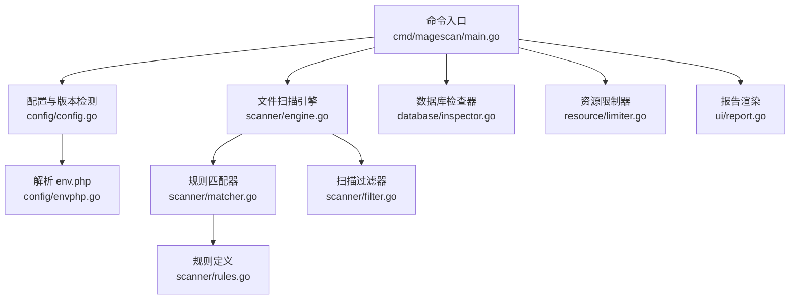
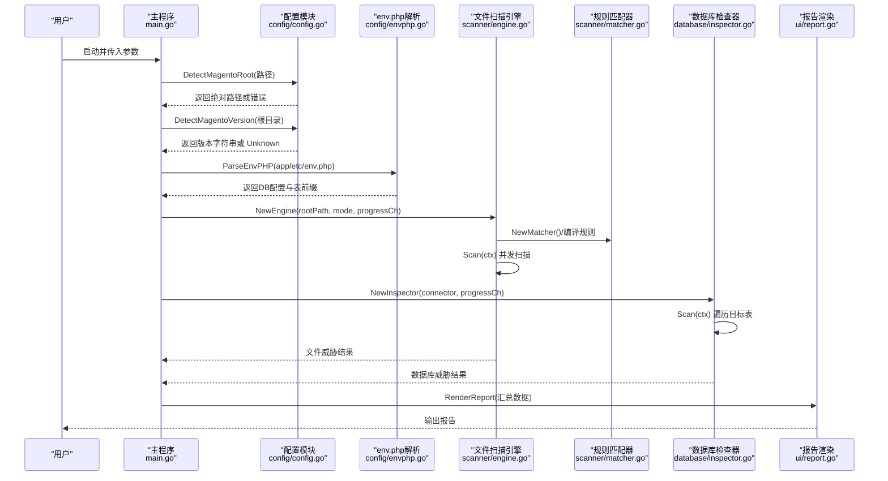
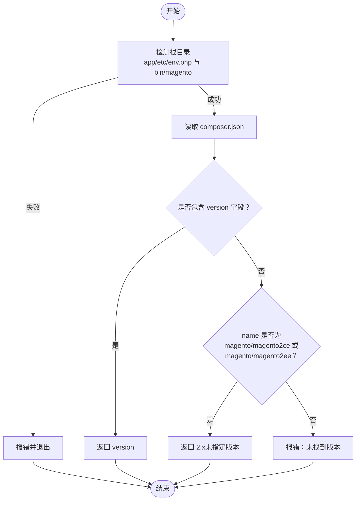
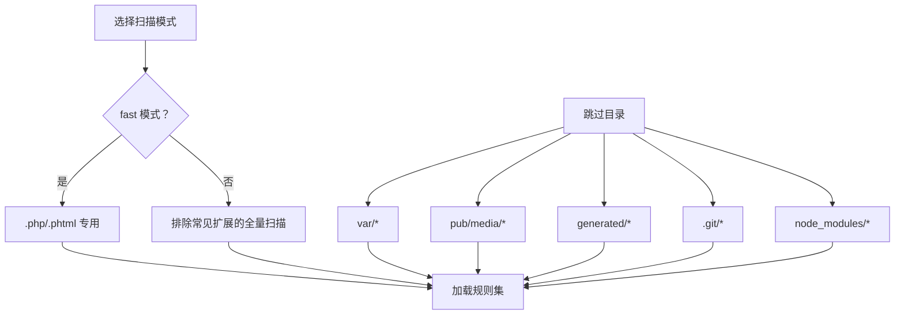
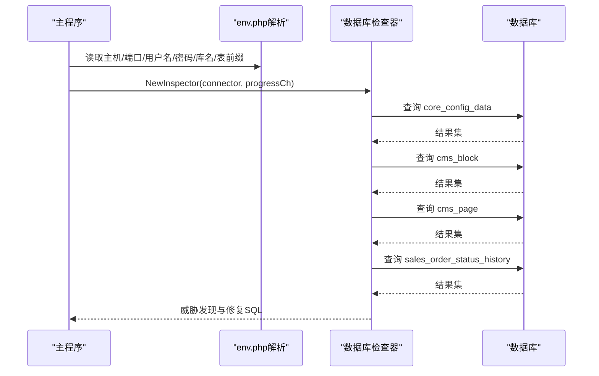
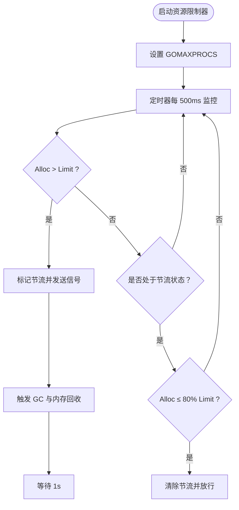
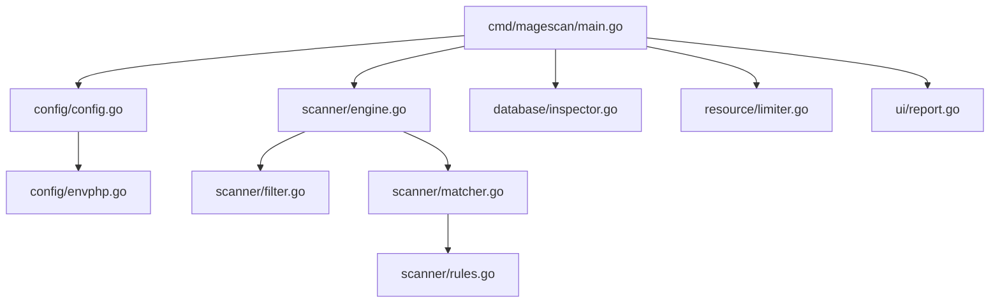

# 支持的 Magento 版本

<cite>
**本文引用的文件列表**
- [cmd/magescan/main.go](file://cmd/magescan/main.go)
- [config/config.go](file://config/config.go)
- [config/envphp.go](file://config/envphp.go)
- [scanner/engine.go](file://scanner/engine.go)
- [scanner/filter.go](file://scanner/filter.go)
- [scanner/matcher.go](file://scanner/matcher.go)
- [scanner/rules.go](file://scanner/rules.go)
- [database/inspector.go](file://database/inspector.go)
- [resource/limiter.go](file://resource/limiter.go)
- [ui/report.go](file://ui/report.go)
- [README.md](file://README.md)
- [go.mod](file://go.mod)
</cite>

## 目录
1. [简介](#简介)
2. [项目结构](#项目结构)
3. [核心组件](#核心组件)
4. [架构总览](#架构总览)
5. [详细组件分析](#详细组件分析)
6. [依赖分析](#依赖分析)
7. [性能考量](#性能考量)
8. [故障排查指南](#故障排查指南)
9. [结论](#结论)
10. [附录](#附录)

## 简介
本文件面向 MageScan 的使用者与维护者，系统化阐述其对 Magento 版本的支持范围、版本检测机制、兼容性矩阵、已知兼容性问题、新版本支持策略与升级路径，以及针对不同版本的最佳实践与注意事项。内容基于仓库源码与官方文档进行提炼与验证，确保可追溯与可操作。

## 项目结构
- 命令入口：cmd/magescan/main.go 负责解析参数、检测 Magento 根目录、读取 composer.json 获取版本信息、初始化扫描引擎与数据库检查器，并渲染报告。
- 配置与环境：config/config.go 提供 Magento 根目录检测与版本检测逻辑；config/envphp.go 解析 app/etc/env.php 获取数据库配置与表前缀。
- 扫描引擎：scanner/engine.go 实现文件扫描的并发与进度统计；scanner/filter.go 控制扫描范围（快速/全量模式）；scanner/matcher.go 编译规则并执行匹配；scanner/rules.go 定义威胁规则集合。
- 数据库检查：database/inspector.go 对 core_config_data、cms_block、cms_page、sales_order_status_history 等表进行安全扫描。
- 资源限制：resource/limiter.go 提供 CPU/内存限制与自动节流。
- 用户界面：ui/report.go 渲染最终报告。
- 文档与元数据：README.md 描述功能与版本支持；go.mod 指明 Go 版本要求。

**图表来源**
- [cmd/magescan/main.go:24-207](file://cmd/magescan/main.go#L24-L207)
- [config/config.go:49-107](file://config/config.go#L49-L107)
- [config/envphp.go:14-87](file://config/envphp.go#L14-L87)
- [scanner/engine.go:60-121](file://scanner/engine.go#L60-L121)
- [scanner/matcher.go:34-82](file://scanner/matcher.go#L34-L82)
- [scanner/rules.go:50-58](file://scanner/rules.go#L50-L58)
- [scanner/filter.go:56-97](file://scanner/filter.go#L56-L97)
- [database/inspector.go:79-109](file://database/inspector.go#L79-L109)
- [resource/limiter.go:22-57](file://resource/limiter.go#L22-L57)
- [ui/report.go:57-167](file://ui/report.go#L57-L167)

**章节来源**
- [cmd/magescan/main.go:24-207](file://cmd/magescan/main.go#L24-L207)
- [README.md:140-147](file://README.md#L140-L147)

## 核心组件
- 版本检测与根目录验证：通过检测 app/etc/env.php 与 bin/magento 存在性确认 Magento 根目录；从 composer.json 读取版本号，若未指定则尝试从包名推断为 2.x。
- 扫描模式：快速模式仅扫描 .php 与 .phtml；全量模式排除常见二进制/静态资源扩展后扫描可疑文件。
- 规则体系：涵盖 Web Shell/Backdoor、Payment Skimmer、Obfuscation、Magento-Specific 四类威胁规则，总计 70+ 签名。
- 数据库扫描：对 core_config_data、cms_block、cms_page、sales_order_status_history 进行模式匹配，生成修复 SQL。
- 资源控制：CPU 核数限制与内存阈值监控，超过上限时自动节流，回落至 80% 时恢复。

**章节来源**
- [config/config.go:49-107](file://config/config.go#L49-L107)
- [scanner/filter.go:56-97](file://scanner/filter.go#L56-L97)
- [scanner/rules.go:50-58](file://scanner/rules.go#L50-L58)
- [database/inspector.go:79-109](file://database/inspector.go#L79-L109)
- [resource/limiter.go:22-117](file://resource/limiter.go#L22-L117)

## 架构总览
下图展示从命令入口到各子系统的调用关系与数据流。

**图表来源**
- [cmd/magescan/main.go:35-126](file://cmd/magescan/main.go#L35-L126)
- [config/config.go:82-107](file://config/config.go#L82-L107)
- [config/envphp.go:14-87](file://config/envphp.go#L14-L87)
- [scanner/engine.go:60-121](file://scanner/engine.go#L60-L121)
- [scanner/matcher.go:34-82](file://scanner/matcher.go#L34-L82)
- [database/inspector.go:79-109](file://database/inspector.go#L79-L109)
- [ui/report.go:57-167](file://ui/report.go#L57-L167)

## 详细组件分析

### 版本检测机制
- 根目录验证：通过检查 app/etc/env.php 与 bin/magento 是否存在，确保当前路径为 Magento 2 根目录。
- 版本提取：读取 composer.json 中的 version 字段；若缺失，则根据 name 字段判断为 magento/magento2ce 或 magento/magento2ee，返回“2.x（composer.json 未指定版本）”提示。
- 版本显示：在启动日志中打印版本信息，便于审计记录与问题定位。

**图表来源**
- [config/config.go:52-107](file://config/config.go#L52-L107)

**章节来源**
- [config/config.go:52-107](file://config/config.go#L52-L107)
- [cmd/magescan/main.go:42-46](file://cmd/magescan/main.go#L42-L46)

### 扫描模式与兼容性
- 快速模式：仅扫描 .php 与 .phtml 文件，适合大多数生产环境的快速巡检。
- 全量模式：排除常见二进制/静态资源扩展后扫描可疑文件，覆盖更广但耗时更长。
- 目录跳过：默认跳过 var/cache、var/session、pub/media/catalog、pub/static、generated、.git、node_modules 等目录，减少误报与冗余扫描。
- 规则覆盖：四类威胁规则（Web Shell/Backdoor、Payment Skimmer、Obfuscation、Magento-Specific）适用于所有 Magento 2.x 版本。

**图表来源**
- [scanner/filter.go:56-97](file://scanner/filter.go#L56-L97)
- [scanner/rules.go:50-58](file://scanner/rules.go#L50-L58)

**章节来源**
- [scanner/filter.go:56-97](file://scanner/filter.go#L56-L97)
- [scanner/rules.go:50-58](file://scanner/rules.go#L50-L58)

### 数据库扫描与兼容性
- 目标表：core_config_data、cms_block、cms_page、sales_order_status_history。
- 检测模式：对敏感字段使用正则匹配，识别外部脚本注入、eval、iframe、事件处理器等可疑内容。
- 表前缀：通过 env.php 的 table_prefix 字段处理自定义表前缀，避免因前缀导致的查询失败。
- 错误容错：当某表不存在时记录进度并继续，不影响整体扫描。

**图表来源**
- [config/envphp.go:14-87](file://config/envphp.go#L14-L87)
- [database/inspector.go:79-109](file://database/inspector.go#L79-L109)

**章节来源**
- [config/envphp.go:14-87](file://config/envphp.go#L14-L87)
- [database/inspector.go:79-109](file://database/inspector.go#L79-L109)

### 资源限制与稳定性
- CPU 限制：通过 runtime.GOMAXPROCS 设置最大并发核数。
- 内存监控：每 500ms 读取运行时内存，超过阈值触发节流通道，暂停工作线程；回落至 80% 阈值后恢复。
- 自动 GC：在节流时主动触发垃圾回收以释放内存。

**图表来源**
- [resource/limiter.go:34-117](file://resource/limiter.go#L34-L117)

**章节来源**
- [resource/limiter.go:34-117](file://resource/limiter.go#L34-L117)

## 依赖分析
- Go 版本：go.mod 指定 go 1.21，确保与较新的语言特性兼容。
- 外部依赖：Bubble Tea/TUI、MySQL 驱动等，均用于终端交互与数据库连接。
- 组件耦合：主程序对配置、扫描、数据库、资源限制与 UI 的依赖清晰，职责分离良好，便于扩展与维护。

**图表来源**
- [go.mod:3-10](file://go.mod#L3-L10)
- [cmd/magescan/main.go:15-20](file://cmd/magescan/main.go#L15-L20)

**章节来源**
- [go.mod:3-10](file://go.mod#L3-L10)
- [cmd/magescan/main.go:15-20](file://cmd/magescan/main.go#L15-L20)

## 性能考量
- 并发模型：工作线程数量为 CPU 核数的两倍，兼顾吞吐与资源占用。
- 大文件处理：超过 1MB 的文件采用重叠分块读取，避免一次性加载导致内存峰值。
- 进度反馈：定期发送扫描进度，便于用户了解扫描状态。
- 资源节流：内存超限自动暂停，降低 OOM 风险；恢复阈值采用 80% hysteresis，避免频繁抖动。

**章节来源**
- [scanner/engine.go:60-121](file://scanner/engine.go#L60-L121)
- [scanner/engine.go:262-285](file://scanner/engine.go#L262-L285)
- [resource/limiter.go:64-117](file://resource/limiter.go#L64-L117)

## 故障排查指南
- 根目录检测失败
  - 症状：提示不是 Magento 根目录，缺少 app/etc/env.php 或 bin/magento。
  - 排查：确认传入路径正确且包含上述文件；检查权限。
  - 参考：[config/config.go:52-71](file://config/config.go#L52-L71)
- 版本检测异常
  - 症状：返回 Unknown 或报错未找到版本。
  - 排查：确认 composer.json 存在且可读；若未指定 version，需手动补充或接受“2.x（未指定版本）”提示。
  - 参考：[config/config.go:82-107](file://config/config.go#L82-L107)
- 数据库连接问题
  - 症状：无法解析 env.php 或连接数据库。
  - 排查：确认 app/etc/env.php 正确；检查主机/端口/用户名/密码/库名/表前缀；确保 MySQL 可访问。
  - 参考：[config/envphp.go:14-87](file://config/envphp.go#L14-L87)
- 表不存在
  - 症状：某些表扫描报错“不存在”。
  - 排查：部分表可能未启用或被删除；扫描器会跳过该阶段并继续，属预期行为。
  - 参考：[database/inspector.go:98-106](file://database/inspector.go#L98-L106)
- 内存不足或扫描缓慢
  - 症状：扫描卡顿或内存飙升。
  - 排查：降低 -cpu-limit 与 -mem-limit；优先使用 fast 模式；关闭不必要的后台进程。
  - 参考：[resource/limiter.go:22-57](file://resource/limiter.go#L22-L57)

**章节来源**
- [config/config.go:52-107](file://config/config.go#L52-L107)
- [config/envphp.go:14-87](file://config/envphp.go#L14-L87)
- [database/inspector.go:98-106](file://database/inspector.go#L98-L106)
- [resource/limiter.go:22-117](file://resource/limiter.go#L22-L117)

## 结论
- 版本支持：官方文档声明支持 Magento Open Source 2.0.x 至 2.4.x，以及 Adobe Commerce（Cloud 与 On-Premise）。源码中的版本检测逻辑与规则体系适用于所有 Magento 2.x。
- 检测机制：通过 composer.json 自动提取版本，结合根目录与 env.php 的解析实现环境确认与数据库配置读取。
- 兼容性：规则覆盖四类威胁，扫描模式与资源限制保障在不同规模环境下的稳定运行。
- 升级路径：建议优先升级至受支持的最新版本（如 2.4.x），并配合 MageScan 进行安全审计与回归测试。

[无需来源：本节为总结性内容]

## 附录

### 支持的 Magento 版本范围与兼容性矩阵
- Magento Open Source
  - 2.0.x 至 2.4.x：完全支持
  - 2.4.x：推荐版本，规则与数据库扫描覆盖完善
- Adobe Commerce
  - Cloud 与 On-Premise：完全支持
  - 2.x 变体：规则通用适用
- 版本检测来源：composer.json 的 version 或 name 字段
- 已知兼容性问题
  - 若 composer.json 未指定 version，将提示“2.x（未指定版本）”，不影响扫描执行
  - 某些表（如历史订单状态表）可能不存在，扫描器会跳过并继续
- 新版本支持策略
  - 规则库持续更新以覆盖新威胁模式
  - 建议在新版本上线前后使用 MageScan 进行安全审计
- 最佳实践与注意事项
  - 使用 fast 模式进行日常巡检，全量模式用于深度审计
  - 合理设置 -cpu-limit 与 -mem-limit，避免影响线上业务
  - 在生产环境执行前，先在预生产环境验证扫描策略
  - 关注数据库威胁的修复 SQL，按需人工执行清理

**章节来源**
- [README.md:140-147](file://README.md#L140-L147)
- [config/config.go:82-107](file://config/config.go#L82-L107)
- [database/inspector.go:98-106](file://database/inspector.go#L98-L106)