# 核心特性

<cite>
**本文档引用的文件**
- [main.go](file://cmd/magescan/main.go)
- [engine.go](file://scanner/engine.go)
- [rules.go](file://scanner/rules.go)
- [matcher.go](file://scanner/matcher.go)
- [filter.go](file://scanner/filter.go)
- [inspector.go](file://database/inspector.go)
- [connector.go](file://database/connector.go)
- [limiter.go](file://resource/limiter.go)
- [progress.go](file://ui/progress.go)
- [config.go](file://config/config.go)
- [README.md](file://README.md)
</cite>

## 目录
1. [引言](#引言)
2. [项目结构](#项目结构)
3. [核心特性概览](#核心特性概览)
4. [纯只读操作](#纯只读操作)
5. [双扫描模式](#双扫描模式)
6. [70+恶意签名检测](#70恶意签名检测)
7. [数据库安全检查](#数据库安全检查)
8. [实时TUI进度显示](#实时tui进度显示)
9. [资源限制](#资源限制)
10. [自动Magento环境检测](#自动magento环境检测)
11. [独立二进制文件](#独立二进制文件)
12. [架构设计](#架构设计)
13. [性能优化与安全性](#性能优化与安全性)
14. [使用示例与配置](#使用示例与配置)
15. [故障排除指南](#故障排除指南)
16. [结论](#结论)

## 引言

MageScan 是一个高性能的 Magento 2 安全扫描器，专为检测恶意软件、支付窃取器、混淆技术和数据库注入而设计。该项目采用纯 Go 语言开发，提供了完整的安全审计解决方案，能够在不修改目标系统的情况下进行全面的安全检查。

该工具集成了先进的并发扫描架构、智能资源管理、实时进度监控等功能，为 Magento 开发者和安全专业人员提供了强大的安全保障工具。

## 项目结构

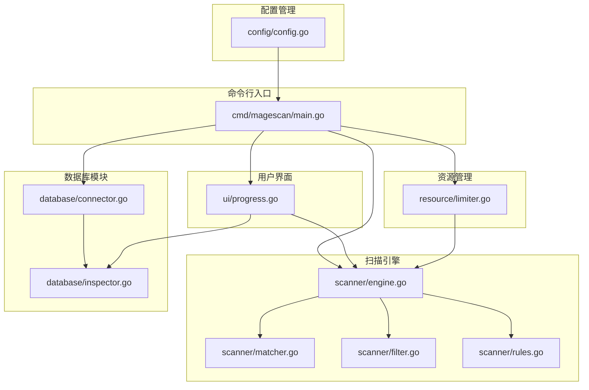

**图表来源**
- [main.go:1-208](file://cmd/magescan/main.go#L1-L208)
- [engine.go:1-323](file://scanner/engine.go#L1-L323)
- [connector.go:1-58](file://database/connector.go#L1-L58)

**章节来源**
- [main.go:24-207](file://cmd/magescan/main.go#L24-L207)
- [README.md:242-249](file://README.md#L242-L249)

## 核心特性概览

MageScan 具备八大核心特性，每个特性都经过精心设计以确保最佳的安全性和性能表现：

1. **纯只读操作** - 零修改目标系统
2. **双扫描模式** - 快速/完整两种模式
3. **70+恶意签名检测** - 四大威胁类别
4. **数据库安全检查** - 四个关键表扫描
5. **实时TUI进度显示** - Bubble Tea终端界面
6. **资源限制** - CPU/内存智能控制
7. **自动Magento环境检测** - 环境验证与版本识别
8. **独立二进制文件** - 单文件部署

## 纯只读操作

### 技术实现原理

MageScan 的纯只读设计体现在所有文件操作都使用只读模式打开，确保不会对任何文件进行修改。

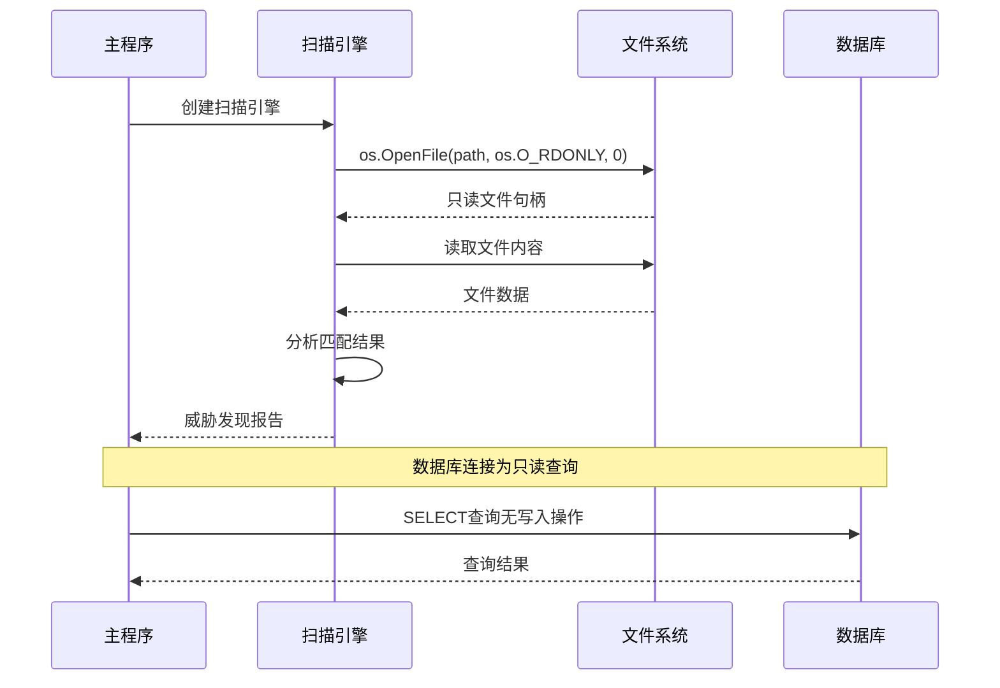

**图表来源**
- [engine.go:230-259](file://scanner/engine.go#L230-L259)
- [connector.go:18-39](file://database/connector.go#L18-L39)

### 使用场景和优势

- **生产环境安全审计** - 不会破坏现有系统状态
- **合规性要求** - 满足严格的审计标准
- **风险最小化** - 避免意外系统变更
- **可重复性** - 多次扫描结果一致

**章节来源**
- [engine.go:230-259](file://scanner/engine.go#L230-L259)
- [connector.go:18-39](file://database/connector.go#L18-L39)

## 双扫描模式

### 快速模式（Fast Mode）

快速模式专注于最可能包含恶意代码的文件类型，主要扫描 PHP 和 PHTML 文件。

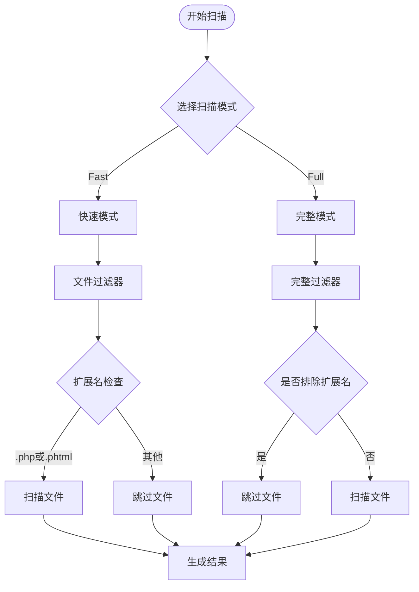

**图表来源**
- [filter.go:87-97](file://scanner/filter.go#L87-L97)
- [engine.go:196-227](file://scanner/engine.go#L196-L227)

### 完整模式（Full Mode）

完整模式扫描所有可疑文件类型，除了预定义的静态资源文件。

### 性能对比

| 特性 | 快速模式 | 完整模式 |
|------|----------|----------|
| 扫描时间 | 较快 | 较慢 |
| 内存占用 | 较低 | 中等 |
| 覆盖范围 | PHP/PHTML | 所有文件类型 |
| 精确度 | 高 | 更高 |
| 适用场景 | 快速检查 | 深入审计 |

**章节来源**
- [filter.go:13-97](file://scanner/filter.go#L13-L97)
- [engine.go:60-69](file://scanner/engine.go#L60-L69)

## 70+恶意签名检测

### 规则系统架构

MageScan 实现了一个灵活的规则系统，支持多种威胁类型的检测：

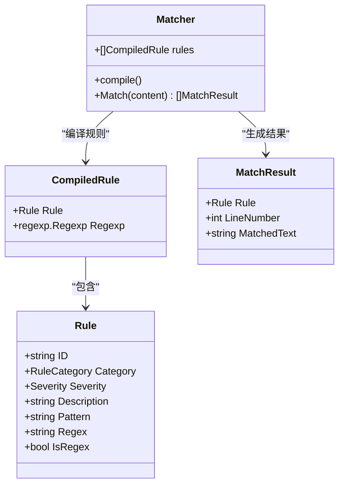

**图表来源**
- [rules.go:39-48](file://scanner/rules.go#L39-L48)
- [matcher.go:9-27](file://scanner/matcher.go#L9-L27)
- [matcher.go:15-20](file://scanner/matcher.go#L15-L20)

### 威胁分类

#### Web Shell/Backdoor（34个签名）

检测常见的PHP Web Shell和远程代码执行后门：

- 已知Shell检测：c99、r57、WSO、b374k、weevely、FilesMan、phpShell
- 自定义eval基础Shell：`eval($_POST[...]`、`eval(base64_decode(...)`
- 系统命令执行：`system()`、`exec()`、`passthru()`、`shell_exec()`、`popen()`、`proc_open()`
- 文件上传后门和写入持久化
- GLOBALS间接函数调用
- LD_PRELOAD和Visbot特定后门

#### Payment Skimmer（15个签名）

检测信用卡窃取和数据外泄：

- 直接CC数据访问器：`getCcNumber()`、`getCcCid()`
- 通过mail、CURL和序列化POST数据的数据外泄
- JavaScript注入和结账页面拦截
- WebSocket和WebRTC隐蔽外泄通道
- 键盘记录模式（keypress/keydown事件监听器）
- 已知窃取器域名模式（可疑TLD）
- SVG onload脚本执行

#### Obfuscation Techniques（12个签名）

检测隐藏有效载荷的代码混淆技术：

- 极长base64编码字符串（>500字符）
- `gzinflate`/`gzuncompress`链
- `chr()`连接混淆
- 字符串分段和数组组装
- 十六进制编码变量名
- 变量变量函数执行（`$$var()`)
- 按位XOR解密模式
- FOPO、IonCube、Zend Guard编码文件

#### Magento-Specific Threats（12个签名）

检测针对Magento内部系统的攻击：

- 核心文件修改和路径遍历包含
- 管理员凭据收集模式
- 支付数据写入图像文件
- `.htaccess`修改（非PHP扩展的PHP处理器）
- Cron作业后门
- 假会话Cookie（拼写错误名称）
- REST API令牌窃取
- 直接数据库凭据提取

### 匹配算法优化

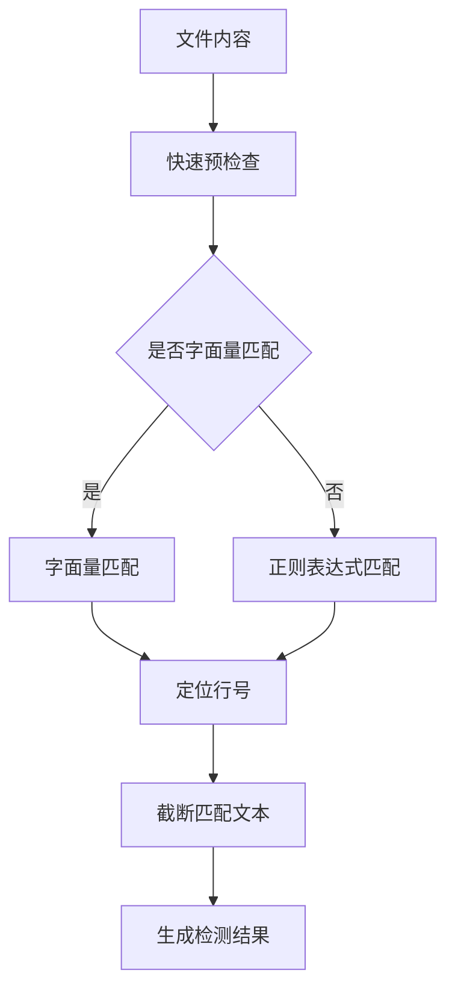

**图表来源**
- [matcher.go:65-82](file://scanner/matcher.go#L65-L82)
- [matcher.go:84-113](file://scanner/matcher.go#L84-L113)
- [matcher.go:115-143](file://scanner/matcher.go#L115-L143)

**章节来源**
- [rules.go:50-467](file://scanner/rules.go#L50-L467)
- [matcher.go:29-61](file://scanner/matcher.go#L29-L61)

## 数据库安全检查

### 扫描策略

MageScan 对Magento数据库的四个关键表进行安全检查：

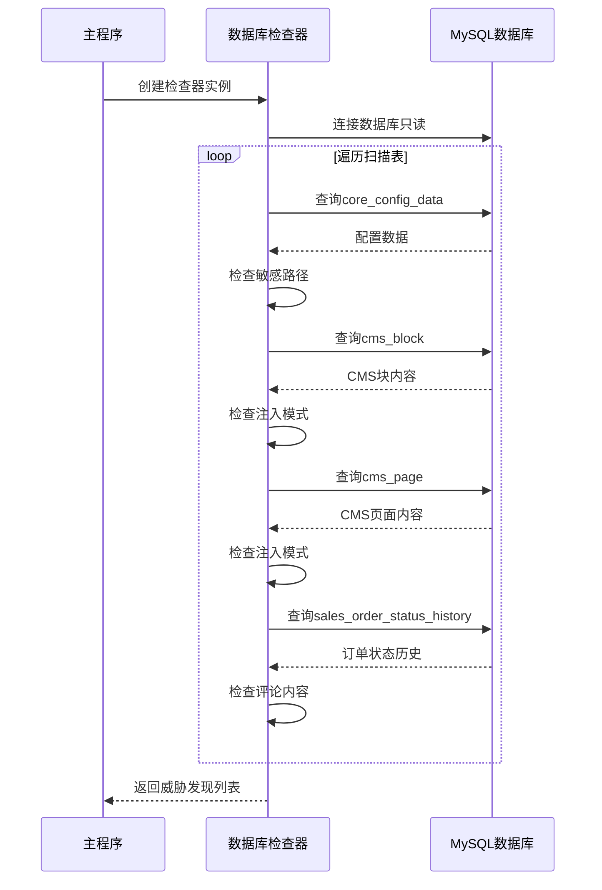

**图表来源**
- [inspector.go:80-109](file://database/inspector.go#L80-L109)
- [connector.go:18-39](file://database/connector.go#L18-L39)

### 检查的表和字段

| 表名 | 检查内容 | 关键字段 |
|------|----------|----------|
| `core_config_data` | 敏感配置路径和脚本相关路径 | `config_id`、`path`、`value` |
| `cms_block` | CMS块内容注入 | `block_id`、`identifier`、`content` |
| `cms_page` | CMS页面内容注入 | `page_id`、`identifier`、`content` |
| `sales_order_status_history` | 最近订单评论 | `entity_id`、`comment` |

### 检测模式

数据库检查器使用以下正则表达式模式检测威胁：

- 外部脚本注入：`<script[^>]*src\s*=\s*['"]https?://`
- CMS内容中的eval：`(?i)eval\(`
- IFrame注入（可能的重定向/钓鱼）：`(?i)<iframe`
- JavaScript协议注入：`(?i)javascript:`
- Document write注入：`(?i)document\.write\(`
- CMS内容中的base64解码：`(?i)base64_decode\(`
- 可疑内联脚本：`(?i)<script[^>]*>(?:(?!</script>).)*(?:atob|btoa|fetch|XMLHttpRequest)`
- onload事件处理器注入：`(?i)\bonload\s*=`
- onerror事件处理器注入：`(?i)\bonerror\s*=`
- 来自可疑TLD的外部资源：`(?:\.ru|\.cn|\.tk|\.pw|\.top|\.xyz|\.club|\.work|\.buzz)/`

### 修复建议生成

对于每个检测到的威胁，MageScan生成可直接执行的SQL语句：

```sql
-- 审查并清理cms_block ID 42（标识符：footer_links）
UPDATE cms_block SET content = '' WHERE block_id = 42;
```

**章节来源**
- [inspector.go:38-50](file://database/inspector.go#L38-L50)
- [inspector.go:116-177](file://database/inspector.go#L116-L177)
- [inspector.go:179-281](file://database/inspector.go#L179-L281)
- [inspector.go:283-330](file://database/inspector.go#L283-L330)

## 实时TUI进度显示

### 用户界面架构

MageScan使用Bubble Tea框架构建实时终端用户界面：

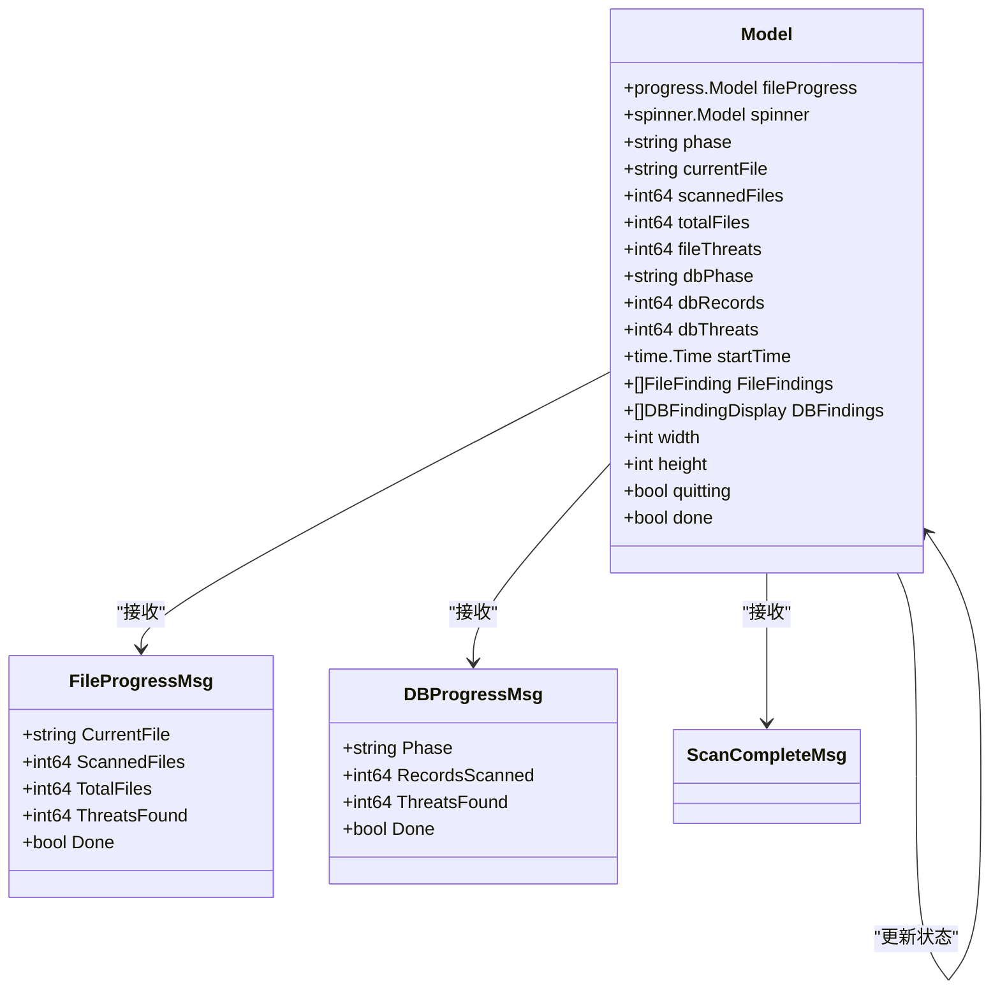

**图表来源**
- [progress.go:54-82](file://ui/progress.go#L54-L82)
- [progress.go:14-31](file://ui/progress.go#L14-L31)

### 界面组件

#### 文件扫描阶段

- **进度条**：显示已扫描文件数量和百分比
- **当前文件**：显示正在处理的文件路径
- **威胁计数**：实时显示发现的威胁数量
- **运行时间**：显示扫描持续时间

#### 数据库扫描阶段

- **阶段指示器**：显示当前扫描的数据库表
- **记录计数**：显示已扫描的记录数量
- **威胁计数**：显示数据库中发现的威胁数量
- **加载动画**：显示扫描正在进行中

### 实时更新机制

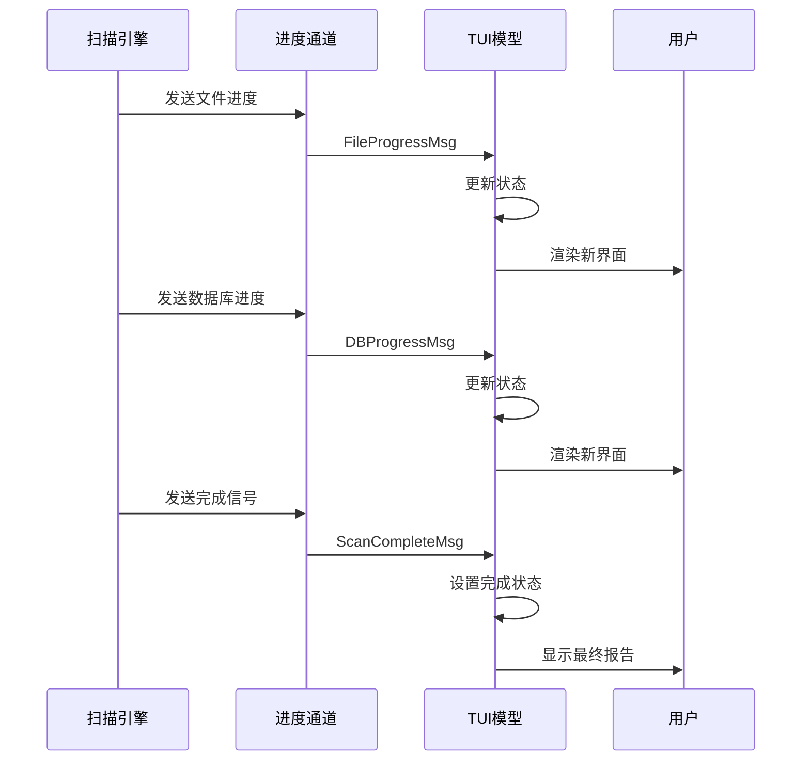

**图表来源**
- [main.go:129-151](file://cmd/magescan/main.go#L129-L151)
- [progress.go:161-183](file://ui/progress.go#L161-L183)

**章节来源**
- [progress.go:116-134](file://ui/progress.go#L116-L134)
- [progress.go:199-263](file://ui/progress.go#L199-L263)

## 资源限制

### 内存限制系统

MageScan实现了智能的内存监控和限制机制：

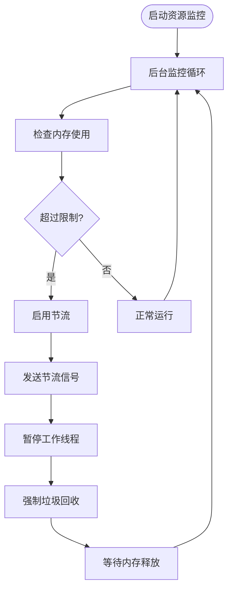

**图表来源**
- [limiter.go:64-117](file://resource/limiter.go#L64-L117)

### CPU限制

系统根据可用CPU核心数动态调整工作线程数量：

- **默认设置**：`2 × NumCPU` 个工作线程
- **限制设置**：用户可指定最大CPU核心数
- **自动调整**：超出限制时自动减少线程数

### 内存管理优化

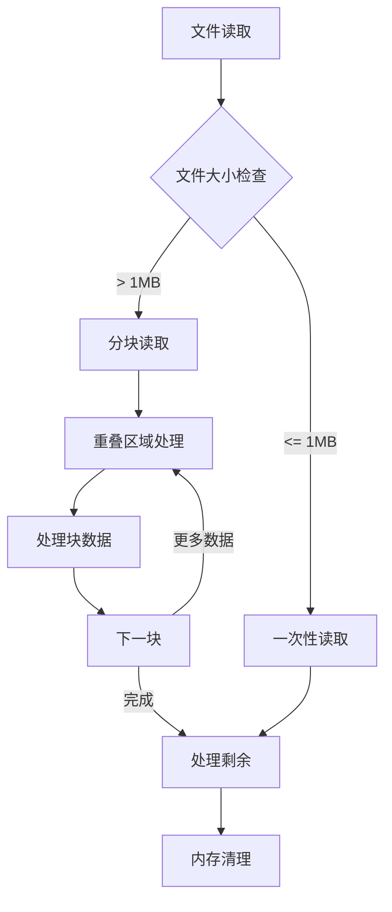

**图表来源**
- [engine.go:261-285](file://scanner/engine.go#L261-L285)

### 资源限制配置

| 参数 | 默认值 | 描述 |
|------|--------|------|
| `-cpu-limit` | `0`（使用全部） | 最大CPU核心数（0表示不限制） |
| `-mem-limit` | `0`（不限制） | 最大内存使用量（MB） |

**章节来源**
- [limiter.go:11-57](file://resource/limiter.go#L11-L57)
- [limiter.go:78-117](file://resource/limiter.go#L78-L117)
- [engine.go:13-17](file://scanner/engine.go#L13-L17)
- [engine.go:261-285](file://scanner/engine.go#L261-L285)

## 自动Magento环境检测

### 环境验证

MageScan通过检查关键文件来验证Magento安装的有效性：

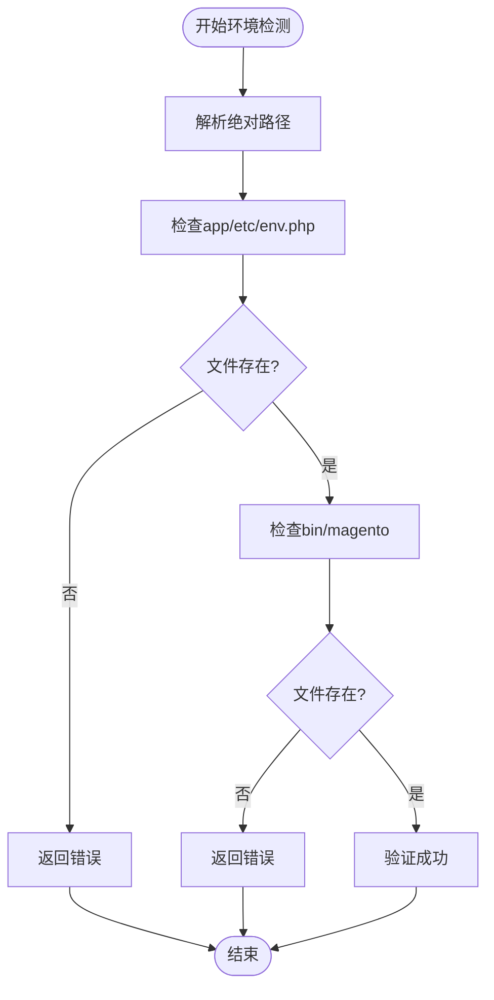

**图表来源**
- [config.go:52-71](file://config/config.go#L52-L71)

### 版本检测

系统从`composer.json`文件中自动检测Magento版本：

- **优先级**：读取`version`字段
- **回退**：根据`name`字段推断版本系列
- **格式**：支持具体版本号和版本系列标识

### 环境配置解析

从`app/etc/env.php`文件中提取数据库连接信息：

- **主机地址**：数据库服务器地址
- **端口**：数据库服务端口
- **用户名**：数据库访问用户名
- **密码**：数据库访问密码
- **数据库名**：Magento数据库名称
- **表前缀**：Magento表前缀（支持自定义）

**章节来源**
- [config.go:49-107](file://config/config.go#L49-L107)

## 独立二进制文件

### 构建特性

MageScan设计为完全独立的二进制文件，具有以下特点：

- **无运行时依赖**：无需安装Go运行时环境
- **单文件部署**：可直接复制到任意服务器
- **跨平台支持**：支持Linux、macOS、Windows
- **静态链接**：包含所有必需的依赖项

### 部署优势

- **简化部署**：单文件传输和部署
- **环境无关**：不受目标系统环境影响
- **权限最小化**：仅需执行权限
- **快速启动**：无需初始化过程

### 构建流程

```bash
# 克隆仓库
git clone <repo-url>
cd magescan

# 编译为独立二进制文件
go build -o magescan ./cmd/magescan/

# 验证二进制文件
./magescan --help
```

**章节来源**
- [README.md:50-58](file://README.md#L50-L58)

## 架构设计

### 整体架构

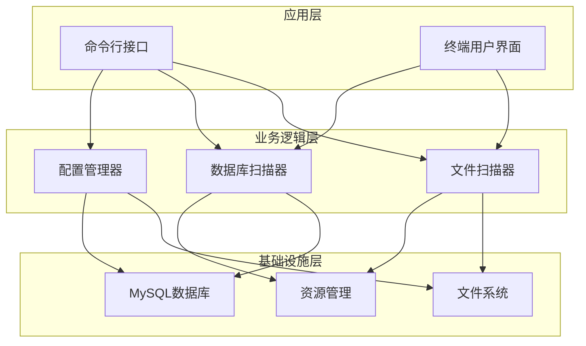

**图表来源**
- [main.go:24-207](file://cmd/magescan/main.go#L24-L207)

### 并发架构

MageScan采用高效的并发扫描架构：

- **工作池模式**：`2 × NumCPU` 个工作线程
- **任务队列**：动态分配扫描任务
- **进度同步**：线程安全的进度报告
- **资源控制**：智能的内存和CPU使用控制

### 错误处理策略

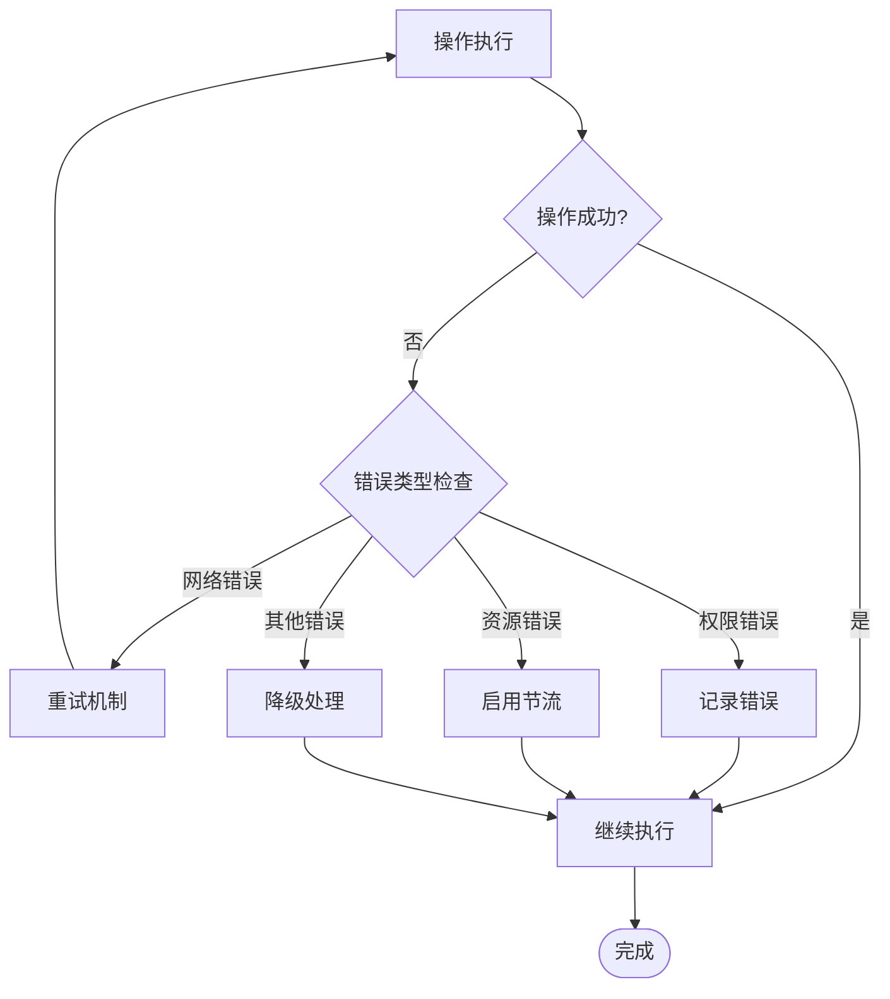

**图表来源**
- [engine.go:77-121](file://scanner/engine.go#L77-L121)
- [inspector.go:98-106](file://database/inspector.go#L98-L106)

**章节来源**
- [main.go:93-126](file://cmd/magescan/main.go#L93-L126)
- [engine.go:88-103](file://scanner/engine.go#L88-L103)

## 性能优化与安全性

### 性能优化技术

#### 并发扫描优化

- **工作线程池**：根据CPU核心数动态调整
- **任务分发**：基于文件路径的任务队列
- **进度报告**：异步进度更新，避免阻塞主流程
- **内存管理**：智能的内存使用和回收

#### I/O优化

- **分块读取**：大文件按1MB块读取，支持重叠区域
- **只读访问**：所有文件操作使用只读模式
- **缓存策略**：预编译正则表达式，避免重复编译
- **批量处理**：数据库查询使用批量处理

#### 内存优化

- **流式处理**：避免将整个文件加载到内存
- **垃圾回收**：定期触发垃圾回收
- **资源限制**：动态调整内存使用上限
- **连接池**：数据库连接池管理

### 安全性考虑

#### 零信任原则

- **只读访问**：所有文件和数据库操作都是只读的
- **权限最小化**：数据库连接使用最小权限
- **输入验证**：严格验证所有输入参数
- **错误隔离**：错误处理不影响系统稳定性

#### 防护措施

- **超时控制**：数据库连接和查询都有超时设置
- **资源监控**：实时监控CPU和内存使用情况
- **优雅关闭**：支持SIGINT/SIGTERM信号的优雅退出
- **状态恢复**：异常情况下能够恢复到安全状态

**章节来源**
- [engine.go:196-227](file://scanner/engine.go#L196-L227)
- [limiter.go:64-117](file://resource/limiter.go#L64-L117)
- [connector.go:18-39](file://database/connector.go#L18-L39)

## 使用示例与配置

### 基本使用

```bash
# 扫描当前目录（必须是Magento根目录）
./magescan

# 扫描特定Magento安装
./magescan -path /var/www/magento
```

### CLI标志详解

| 标志 | 默认值 | 描述 |
|------|--------|------|
| `-path` | `.` | Magento根路径 |
| `-mode` | `fast` | 扫描模式：`fast` 或 `full` |
| `-cpu-limit` | `0` | 最大CPU核心数（0=全部） |
| `-mem-limit` | `0` | 最大内存（MB，0=不限制） |
| `-output` | `terminal` | 输出格式：`terminal` 或 `json` |

### 高级使用示例

#### 快速扫描

```bash
# 仅扫描PHP和PHTML文件
./magescan -path /var/www/magento -mode fast
```

#### 完整扫描

```bash
# 扫描所有可疑文件类型
./magescan -path /var/www/magento -mode full
```

#### 资源限制扫描

```bash
# 限制为2个CPU核心和256MB内存
./magescan -path /var/www/magento -cpu-limit 2 -mem-limit 256

# 保守资源使用（1个CPU核心，128MB内存）
./magescan -path /var/www/magento -mode full -cpu-limit 1 -mem-limit 128
```

### 输出格式

#### 终端输出

MageScan提供详细的扫描报告，包括：

- **文件威胁**：发现的恶意文件及其详细信息
- **数据库威胁**：数据库中的注入和异常内容
- **统计信息**：扫描时间、文件数量、威胁总数
- **修复建议**：数据库威胁的修复SQL语句

#### JSON输出（预留）

虽然当前版本主要支持终端输出，但CLI接口已预留JSON格式支持，便于集成到自动化工具中。

**章节来源**
- [README.md:74-98](file://README.md#L74-L98)
- [README.md:100-136](file://README.md#L100-L136)

## 故障排除指南

### 常见问题

#### 环境检测失败

**症状**：提示不是Magento根目录

**原因**：
- 缺少`app/etc/env.php`文件
- 缺少`bin/magento`文件
- 路径不正确

**解决方法**：
```bash
# 验证Magento根目录
ls -la app/etc/env.php
ls -la bin/magento

# 使用正确的路径
./magescan -path /correct/magento/path
```

#### 数据库连接问题

**症状**：数据库扫描警告

**原因**：
- 数据库凭据错误
- 数据库服务不可达
- 表不存在或权限不足

**解决方法**：
```bash
# 检查数据库连接
mysql -h localhost -P 3306 -u username -p

# 验证Magento表前缀
./magescan -path /var/www/magento -mode full -cpu-limit 1 -mem-limit 128
```

#### 内存不足

**症状**：扫描过程中被系统终止

**解决方法**：
```bash
# 降低内存限制
./magescan -path /var/www/magento -mem-limit 256

# 使用快速模式
./magescan -path /var/www/magento -mode fast -mem-limit 128
```

#### CPU使用过高

**症状**：系统响应缓慢

**解决方法**：
```bash
# 限制CPU核心数
./magescan -path /var/www/magento -cpu-limit 2

# 同时限制内存
./magescan -path /var/www/magento -cpu-limit 1 -mem-limit 128
```

### 调试模式

MageScan支持优雅的信号处理：

- **SIGINT**（Ctrl+C）：请求优雅退出
- **SIGTERM**：请求终止扫描
- **上下文取消**：支持取消扫描操作

### 日志和诊断

系统会在标准错误输出中提供有用的诊断信息：

- **环境检测信息**：Magento版本和路径信息
- **数据库连接状态**：连接尝试和错误信息
- **资源使用统计**：内存和CPU使用情况
- **扫描进度**：实时进度和威胁发现

**章节来源**
- [main.go:71-76](file://cmd/magescan/main.go#L71-L76)
- [main.go:117-122](file://cmd/magescan/main.go#L117-L122)

## 结论

MageScan 是一个功能强大且设计精良的Magento 2安全扫描工具，它在安全性、性能和易用性之间取得了完美的平衡。通过纯只读操作、智能的双扫描模式、70+恶意签名检测、实时TUI进度显示、资源限制、自动环境检测和独立二进制部署等核心特性，MageScan为Magento生态系统提供了全面的安全保障。

该工具不仅满足了现代安全审计的需求，还通过先进的并发架构和内存优化技术确保了高效的性能表现。无论是用于日常安全检查还是深度渗透测试，MageScan都能提供可靠、准确和及时的安全评估结果。

随着Magento生态系统的不断发展，MageScan将继续演进，为保护Magento应用程序免受各种威胁提供强有力的技术支持。