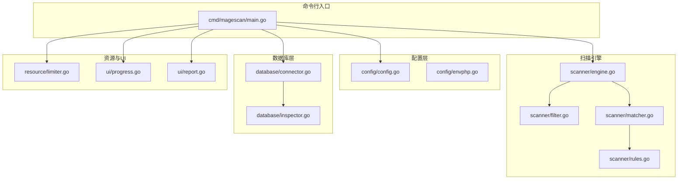
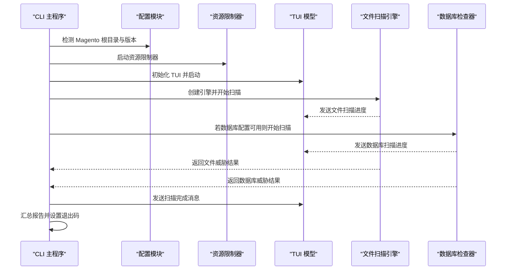
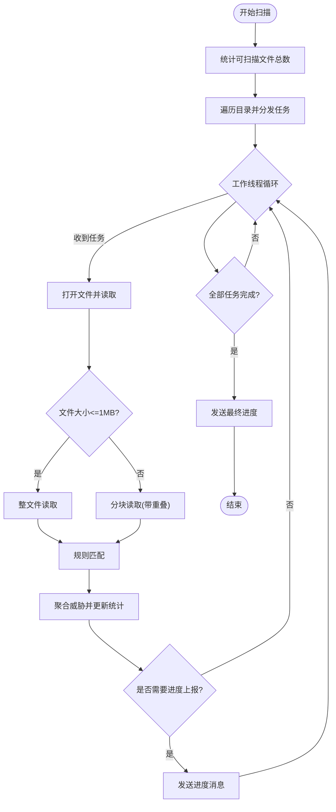
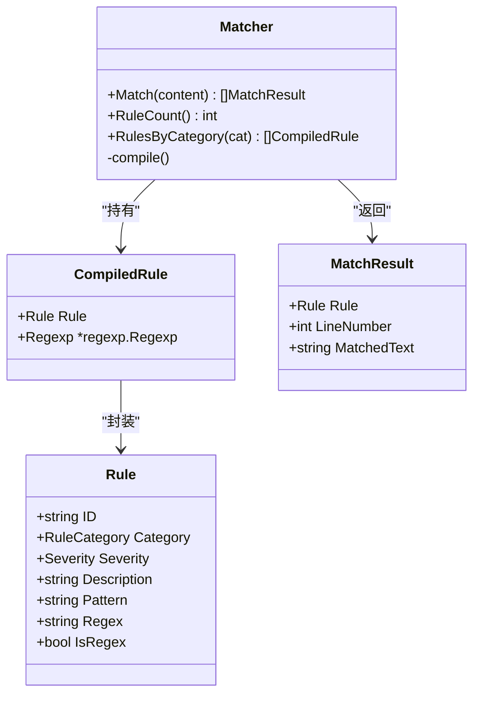
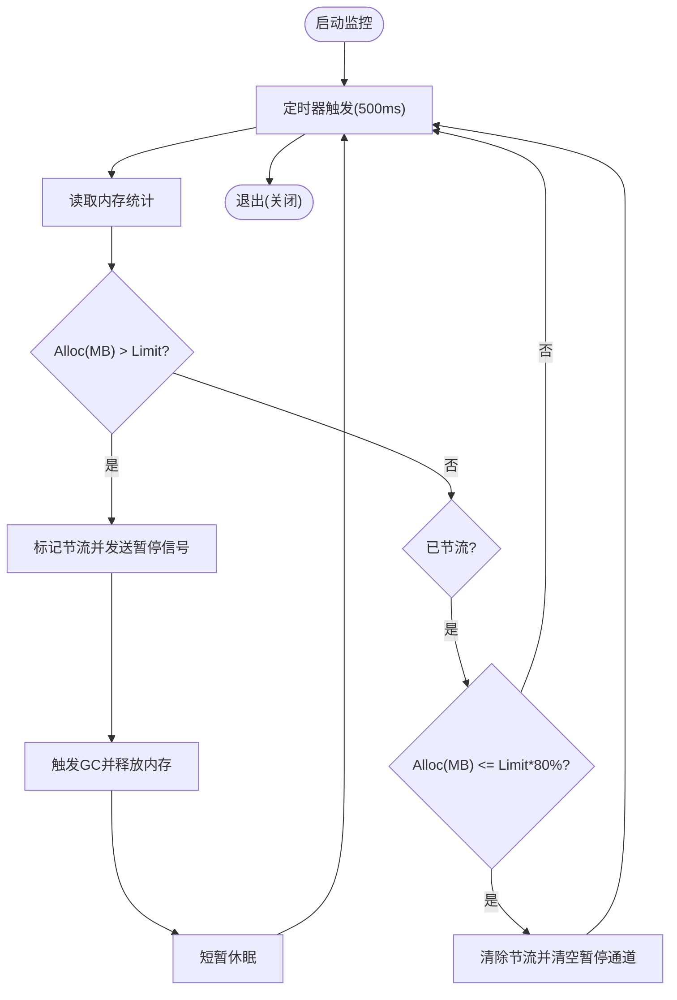
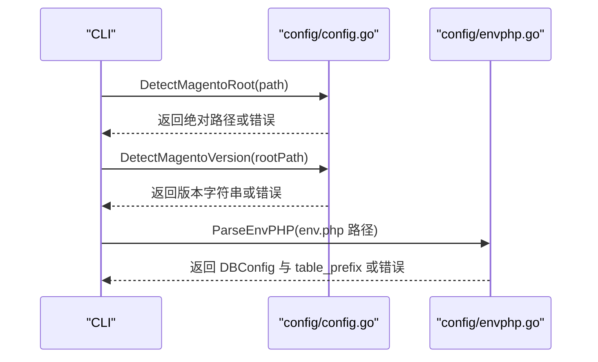
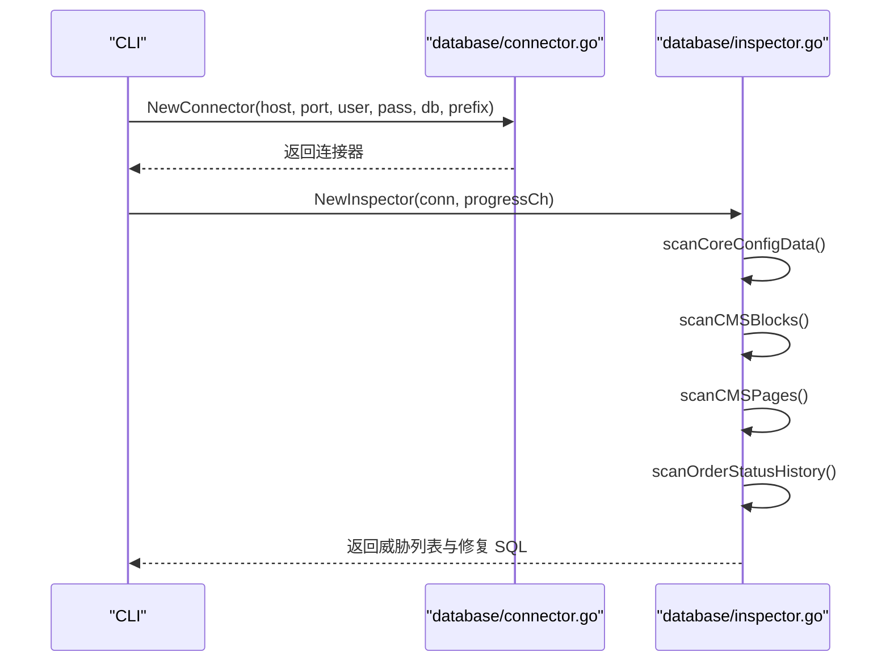
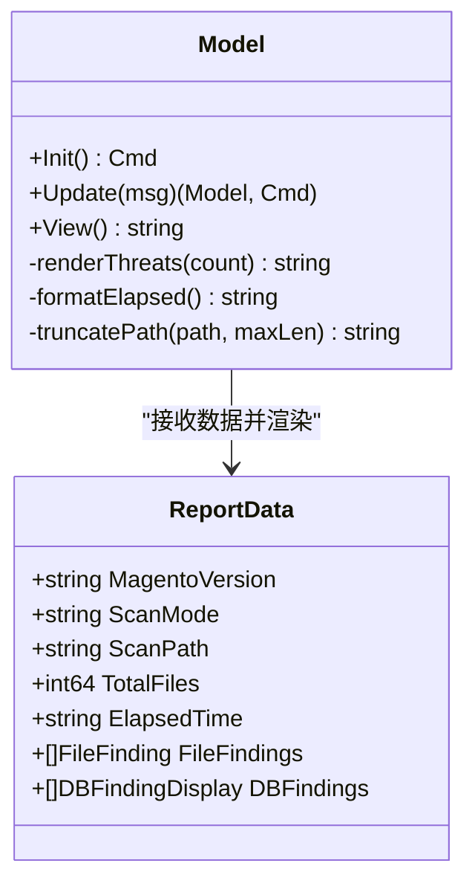
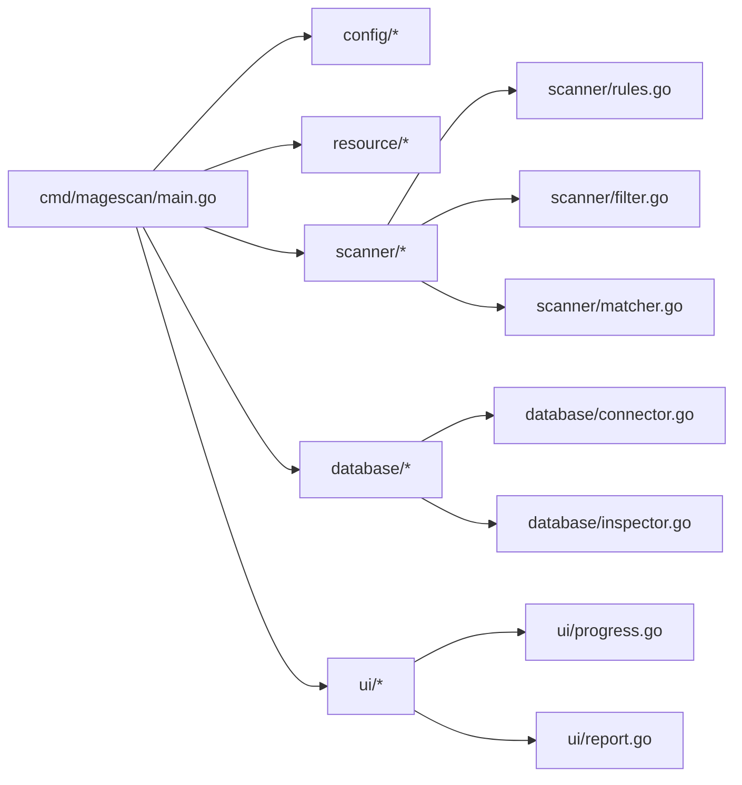

# 项目概述

<cite>
**本文引用的文件列表**
- [README.md](file://README.md)
- [cmd/magescan/main.go](file://cmd/magescan/main.go)
- [go.mod](file://go.mod)
- [scanner/engine.go](file://scanner/engine.go)
- [scanner/filter.go](file://scanner/filter.go)
- [scanner/matcher.go](file://scanner/matcher.go)
- [scanner/rules.go](file://scanner/rules.go)
- [resource/limiter.go](file://resource/limiter.go)
- [config/config.go](file://config/config.go)
- [config/envphp.go](file://config/envphp.go)
- [database/connector.go](file://database/connector.go)
- [database/inspector.go](file://database/inspector.go)
- [ui/progress.go](file://ui/progress.go)
- [ui/report.go](file://ui/report.go)
</cite>

## 目录
1. [简介](#简介)
2. [项目结构](#项目结构)
3. [核心组件](#核心组件)
4. [架构总览](#架构总览)
5. [详细组件分析](#详细组件分析)
6. [依赖关系分析](#依赖关系分析)
7. [性能考量](#性能考量)
8. [故障排查指南](#故障排查指南)
9. [结论](#结论)
10. [附录](#附录)

## 简介
MageScan 是一个高性能、纯只读的 Magento 2 安全扫描器，专注于检测 Web Shell、支付 skimmer、混淆恶意代码以及数据库注入等威胁。它受 Sansec eComscan 的启发，采用工作池并发架构、大文件分块读取、资源节流与自动环境检测等设计，确保在生产环境中安全、可控地完成扫描任务。项目提供实时 TUI 进度界面与可直接使用的数据库修复 SQL，帮助管理员快速定位并处理风险。

- 纯只读操作：不修改目标系统任何文件或数据库记录
- 双模式扫描：快速（仅 PHP/PHTML）与完整（全量可疑文件）
- 70+ 恶意签名：覆盖 Web Shell、支付 skimmer、混淆与 Magento 特定威胁
- 数据库安全检查：对 core_config_data、cms_block、cms_page、sales_order_status_history 扫描
- 实时 TUI 进度显示：基于 Bubble Tea 的非滚动终端界面
- 资源限制：可配置 CPU 核心数与内存上限，自动节流
- 自动 Magento 环境检测：自动识别根目录与 env.php 中的数据库配置
- 生成修复 SQL：为数据库威胁提供可直接执行的清理语句

**章节来源**
- [README.md:26-37](file://README.md#L26-L37)
- [README.md:150-200](file://README.md#L150-L200)
- [README.md:203-236](file://README.md#L203-L236)
- [README.md:239-258](file://README.md#L239-L258)

## 项目结构
项目采用按功能域划分的模块化组织方式：
- cmd/magescan：CLI 入口、参数解析、控制流程编排
- config：Magento 根目录检测、版本检测、env.php 解析
- scanner：文件扫描引擎、规则匹配器、过滤器
- database：数据库连接器、安全检查器、修复 SQL 生成
- resource：CPU/内存资源限制器与自动节流
- ui：TUI 进度模型与最终报告渲染

**图表来源**
- [cmd/magescan/main.go:24-126](file://cmd/magescan/main.go#L24-L126)
- [config/config.go:49-107](file://config/config.go#L49-L107)
- [config/envphp.go:14-71](file://config/envphp.go#L14-L71)
- [scanner/engine.go:47-121](file://scanner/engine.go#L47-L121)
- [scanner/filter.go:56-97](file://scanner/filter.go#L56-L97)
- [scanner/matcher.go:24-82](file://scanner/matcher.go#L24-L82)
- [scanner/rules.go:50-58](file://scanner/rules.go#L50-L58)
- [database/connector.go:16-57](file://database/connector.go#L16-L57)
- [database/inspector.go:63-109](file://database/inspector.go#L63-L109)
- [resource/limiter.go:22-52](file://resource/limiter.go#L22-L52)
- [ui/progress.go:116-134](file://ui/progress.go#L116-L134)
- [ui/report.go:57-168](file://ui/report.go#L57-L168)

**章节来源**
- [README.md:239-249](file://README.md#L239-L249)

## 核心组件
- CLI 主程序：负责参数解析、Magento 根目录与版本检测、资源限制器启动、TUI 初始化、文件扫描与数据库扫描的协调、结果汇总与退出码设置
- 扫描引擎：工作池并发扫描、文件计数与遍历、进度上报、大文件分块读取、匹配结果聚合
- 规则与匹配器：70+ 规则分类（Web Shell、Skimmer、Obfuscation、Magento 特定），预编译正则，线程安全匹配
- 过滤器：根据扫描模式选择文件类型，跳过缓存、日志、静态资源等目录
- 资源限制器：监控内存使用，周期性检查并在阈值超限时暂停工作线程，恢复到 hysteresis 阈值后继续
- 配置与环境：自动检测 Magento 根目录与版本，解析 env.php 获取数据库连接与表前缀
- 数据库检查器：针对敏感表进行内容扫描，生成修复 SQL
- UI：TUI 实时进度与最终报告渲染

**章节来源**
- [cmd/magescan/main.go:24-207](file://cmd/magescan/main.go#L24-L207)
- [scanner/engine.go:47-323](file://scanner/engine.go#L47-L323)
- [scanner/rules.go:50-468](file://scanner/rules.go#L50-L468)
- [scanner/matcher.go:24-168](file://scanner/matcher.go#L24-L168)
- [scanner/filter.go:8-97](file://scanner/filter.go#L8-L97)
- [resource/limiter.go:11-118](file://resource/limiter.go#L11-L118)
- [config/config.go:49-107](file://config/config.go#L49-L107)
- [config/envphp.go:14-71](file://config/envphp.go#L14-L71)
- [database/inspector.go:63-359](file://database/inspector.go#L63-L359)
- [database/connector.go:16-57](file://database/connector.go#L16-L57)
- [ui/progress.go:54-289](file://ui/progress.go#L54-L289)
- [ui/report.go:11-230](file://ui/report.go#L11-L230)

## 架构总览
整体采用“主程序编排 + 多子系统并行”的架构：
- 主程序负责生命周期管理、信号处理、通道通信与结果汇总
- 文件扫描与数据库扫描分别运行在独立 goroutine 中，通过通道向 TUI 推送进度
- 资源限制器在后台监控内存，必要时通过通道暂停/恢复工作线程
- UI 使用 Bubble Tea 提供非滚动的实时进度展示

**图表来源**
- [cmd/magescan/main.go:35-126](file://cmd/magescan/main.go#L35-L126)
- [ui/progress.go:116-197](file://ui/progress.go#L116-L197)
- [database/inspector.go:79-109](file://database/inspector.go#L79-L109)

**章节来源**
- [README.md:239-258](file://README.md#L239-L258)

## 详细组件分析

### 扫描引擎（工作池并发 + 分块读取）
- 工作池：工作线程数量为 CPU 核心数的两倍，提高吞吐能力
- 文件计数与遍历：先统计总数，再分发任务，避免一次性加载所有路径
- 进度上报：每处理 N 个文件或发现威胁即发送进度消息
- 大文件处理：超过 1MB 的文件以重叠窗口分块读取，避免内存峰值
- 匹配聚合：将匹配结果转换为统一结构并原子计数威胁数

**图表来源**
- [scanner/engine.go:76-121](file://scanner/engine.go#L76-L121)
- [scanner/engine.go:133-193](file://scanner/engine.go#L133-L193)
- [scanner/engine.go:195-227](file://scanner/engine.go#L195-L227)
- [scanner/engine.go:229-285](file://scanner/engine.go#L229-L285)
- [scanner/engine.go:287-323](file://scanner/engine.go#L287-L323)

**章节来源**
- [scanner/engine.go:47-323](file://scanner/engine.go#L47-L323)

### 规则与匹配器（70+ 签名 + 预编译正则）
- 规则分类：Web Shell/Backdoor、Payment Skimmer、Obfuscation、Magento-Specific
- 匹配策略：字面量快速检查 + 行号定位；正则按需编译，线程安全复用
- 性能优化：仅在首次创建时编译正则，避免重复开销；对大内容按行匹配减少回溯

**图表来源**
- [scanner/matcher.go:24-82](file://scanner/matcher.go#L24-L82)
- [scanner/matcher.go:86-143](file://scanner/matcher.go#L86-L143)
- [scanner/rules.go:39-48](file://scanner/rules.go#L39-L48)

**章节来源**
- [scanner/rules.go:50-468](file://scanner/rules.go#L50-L468)
- [scanner/matcher.go:24-168](file://scanner/matcher.go#L24-L168)

### 资源限制器（内存监控 + 自动节流）
- 周期性监控：每 500ms 读取内存分配统计
- 节流机制：超过阈值时通过通道阻塞工作线程，触发 GC 并短暂休眠
- 恢复策略：降至阈值的 80% 时解除阻塞，避免频繁抖动
- CPU 限制：在启动时设置 GOMAXPROCS，停止时恢复原值

**图表来源**
- [resource/limiter.go:64-117](file://resource/limiter.go#L64-L117)

**章节来源**
- [resource/limiter.go:11-118](file://resource/limiter.go#L11-L118)

### 配置与环境检测（Magento 根目录 + env.php）
- 根目录检测：校验 app/etc/env.php 与 bin/magento 是否存在
- 版本检测：从 composer.json 读取版本字符串
- 数据库配置：解析 env.php 中的 host、port、dbname、username、password、table_prefix

**图表来源**
- [config/config.go:49-107](file://config/config.go#L49-L107)
- [config/envphp.go:14-71](file://config/envphp.go#L14-L71)

**章节来源**
- [config/config.go:49-107](file://config/config.go#L49-L107)
- [config/envphp.go:14-71](file://config/envphp.go#L14-L71)

### 数据库检查器（多表扫描 + 修复 SQL）
- 扫描范围：core_config_data、cms_block、cms_page、sales_order_status_history
- 敏感路径：对 design/head/includes 等敏感配置路径进行重点检查
- 检测模式：外部脚本注入、eval、iframe、javascript 协议、base64_decode、可疑内联脚本、事件处理器、可疑 TLD 等
- 修复建议：为每个威胁生成可直接执行的 UPDATE 语句

**图表来源**
- [database/connector.go:16-57](file://database/connector.go#L16-L57)
- [database/inspector.go:79-109](file://database/inspector.go#L79-L109)
- [database/inspector.go:116-177](file://database/inspector.go#L116-L177)
- [database/inspector.go:179-281](file://database/inspector.go#L179-L281)
- [database/inspector.go:283-330](file://database/inspector.go#L283-L330)

**章节来源**
- [database/inspector.go:63-359](file://database/inspector.go#L63-L359)
- [database/connector.go:16-57](file://database/connector.go#L16-L57)

### UI（TUI 实时进度与报告）
- TUI 模型：包含文件扫描进度条、当前文件、威胁计数、数据库扫描阶段与记录数
- 报告渲染：按严重级别排序输出，包含文件威胁与数据库威胁详情及修复 SQL

**图表来源**
- [ui/progress.go:54-289](file://ui/progress.go#L54-L289)
- [ui/report.go:11-230](file://ui/report.go#L11-L230)

**章节来源**
- [ui/progress.go:54-289](file://ui/progress.go#L54-L289)
- [ui/report.go:11-230](file://ui/report.go#L11-L230)

## 依赖关系分析
- 外部依赖：Bubble Tea（TUI）、MySQL 驱动（数据库连接）
- 内部模块：CLI 主程序依赖配置、资源、扫描、数据库与 UI 模块
- 关键耦合点：通道通信（文件/数据库进度）、上下文取消（优雅退出）

**图表来源**
- [go.mod:5-10](file://go.mod#L5-L10)
- [cmd/magescan/main.go:15-20](file://cmd/magescan/main.go#L15-L20)

**章节来源**
- [go.mod:1-31](file://go.mod#L1-L31)

## 性能考量
- 并发策略：工作池规模为 2×CPU，充分利用多核提升吞吐
- I/O 优化：大文件分块读取，重叠窗口避免跨边界误判
- 正则优化：仅在初始化时编译一次，按行匹配减少回溯成本
- 资源控制：内存阈值触发节流与 GC，降低 OOM 风险
- 进度反馈：批量进度上报，减少 UI 更新频率

[本节为通用性能讨论，无需特定文件引用]

## 故障排查指南
- 环境检测失败
  - 症状：提示不是 Magento 根目录或缺少 bin/magento
  - 处理：确认传入路径为 Magento 根目录，确保 app/etc/env.php 与 bin/magento 存在
  - 参考：[config/config.go:49-71](file://config/config.go#L49-L71)
- 数据库连接问题
  - 症状：无法连接数据库或解析 env.php
  - 处理：检查主机、端口、用户名、密码与数据库名；确认 MySQL 可访问；查看解析错误输出
  - 参考：[config/envphp.go:14-71](file://config/envphp.go#L14-L71)，[database/connector.go:16-39](file://database/connector.go#L16-L39)
- 扫描卡顿或内存过高
  - 症状：扫描缓慢或系统内存飙升
  - 处理：设置更严格的 CPU 与内存限制；使用快速模式减少扫描范围
  - 参考：[resource/limiter.go:22-52](file://resource/limiter.go#L22-L52)，[cmd/magescan/main.go:26-31](file://cmd/magescan/main.go#L26-L31)
- TUI 显示异常
  - 症状：界面错位或无法退出
  - 处理：调整终端尺寸；按 q 键退出；重启程序
  - 参考：[ui/progress.go:140-197](file://ui/progress.go#L140-L197)

**章节来源**
- [config/config.go:49-107](file://config/config.go#L49-L107)
- [config/envphp.go:14-71](file://config/envphp.go#L14-L71)
- [database/connector.go:16-57](file://database/connector.go#L16-L57)
- [resource/limiter.go:22-52](file://resource/limiter.go#L22-L52)
- [ui/progress.go:140-197](file://ui/progress.go#L140-L197)

## 结论
MageScan 在保证纯只读与高安全性的同时，提供了高性能、可扩展且易用的 Magento 2 安全扫描能力。其工作池并发、分块读取与资源节流等设计，使其能够在生产环境中稳定运行；丰富的规则集与数据库检查进一步提升了威胁发现能力；TUI 与报告输出让安全审计过程更加直观高效。项目在设计理念上强调“最小侵入、最大收益”，适合安全团队与运维人员日常巡检与应急响应。

[本节为总结性内容，无需特定文件引用]

## 附录
- 使用场景示例
  - 快速扫描：仅扫描 PHP/PHTML 文件，适合日常巡检
  - 完整扫描：扫描全量可疑文件，适合深度审计
  - 资源受限：限制 CPU 与内存，避免影响线上业务
  - 数据库检查：在具备 MySQL 权限时，对敏感表进行内容扫描并生成修复 SQL

**章节来源**
- [README.md:62-98](file://README.md#L62-L98)
- [README.md:203-236](file://README.md#L203-L236)