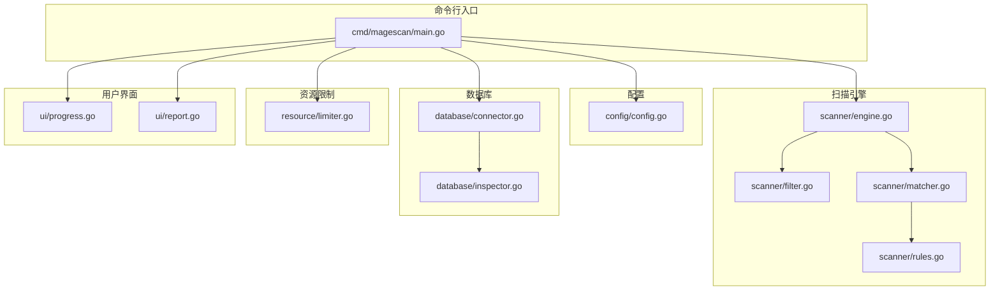
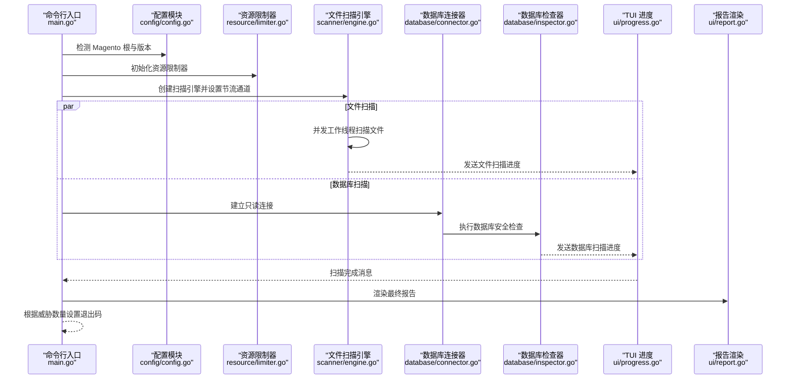
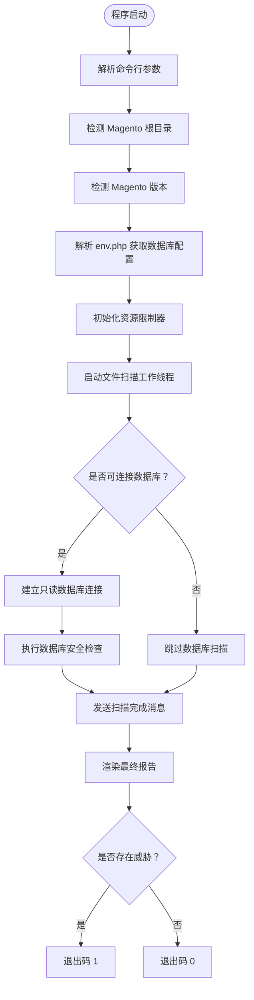
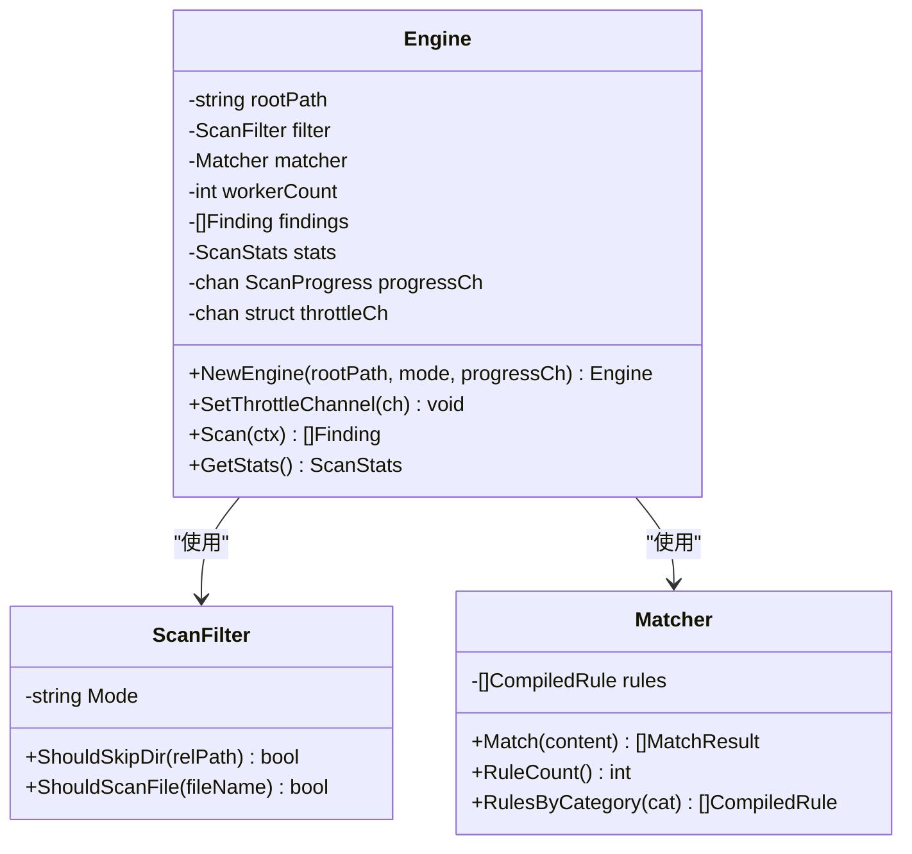
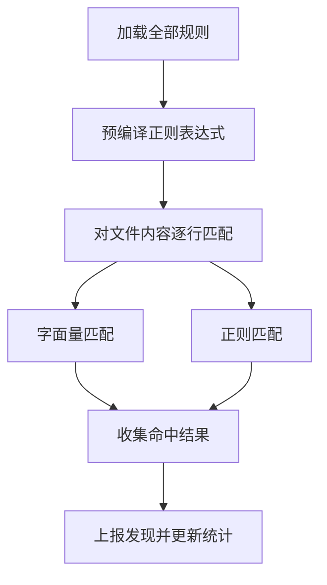
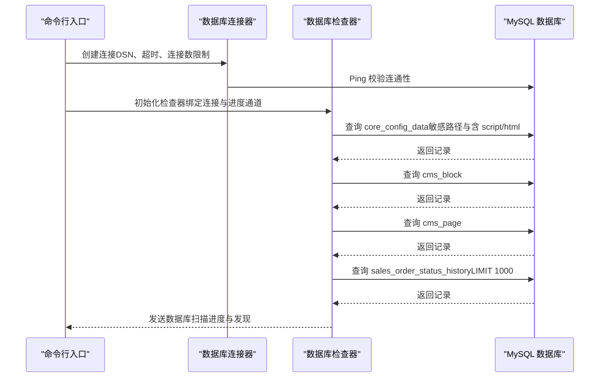
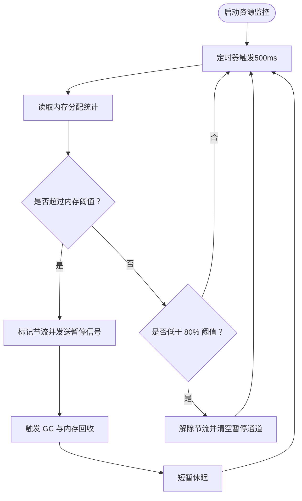
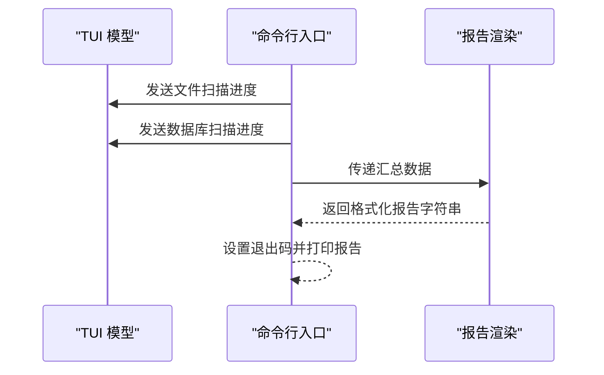
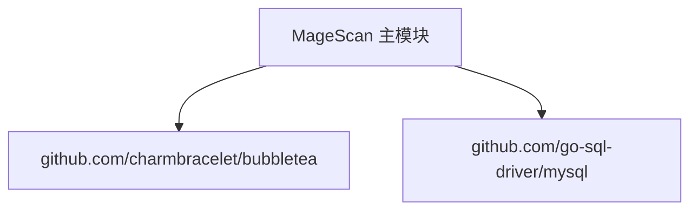

# 项目简介

<cite>
**本文引用的文件**
- [README.md](file://README.md)
- [main.go](file://cmd/magescan/main.go)
- [config.go](file://config/config.go)
- [engine.go](file://scanner/engine.go)
- [filter.go](file://scanner/filter.go)
- [matcher.go](file://scanner/matcher.go)
- [rules.go](file://scanner/rules.go)
- [connector.go](file://database/connector.go)
- [inspector.go](file://database/inspector.go)
- [limiter.go](file://resource/limiter.go)
- [progress.go](file://ui/progress.go)
- [report.go](file://ui/report.go)
- [go.mod](file://go.mod)
</cite>

## 目录
1. [引言](#引言)
2. [项目结构](#项目结构)
3. [核心组件](#核心组件)
4. [架构总览](#架构总览)
5. [详细组件分析](#详细组件分析)
6. [依赖分析](#依赖分析)
7. [性能考量](#性能考量)
8. [故障排查指南](#故障排查指南)
9. [结论](#结论)
10. [附录](#附录)

## 引言
MageScan 是一款专为 Magento 2 设计的高性能只读安全扫描器，专注于发现 Web Shell、支付 skimmer（Magecart）、混淆恶意代码以及数据库注入等威胁。它以“纯只读”为核心设计原则，确保在不修改目标系统任何文件或数据的前提下完成全面检测；同时通过多线程并发扫描、资源限制与自动节流、实时 TUI 进度展示、数据库安全检查与修复建议生成等能力，兼顾易用性与工程化实践。

项目灵感来源于 Sansec eComscan，围绕 Magento 生态中的真实攻击面构建了覆盖四大威胁类别的 70+ 签名规则，并提供针对核心配置表、CMS 内容与订单历史的数据库安全扫描，帮助管理员快速定位风险并生成可直接执行的修复 SQL。

技术栈方面，MageScan 基于 Go 1.21+ 构建，支持 Linux、macOS、Windows 平台，提供独立二进制部署，无需运行时 PHP 环境依赖。

法律与合规方面，项目明确声明仅用于授权安全审计，使用者需确保具备合法授权，避免触犯相关法律法规。

**章节来源**
- [README.md:1-272](file://README.md#L1-L272)

## 项目结构
仓库采用按职责分层的模块化组织方式，主要目录如下：
- cmd/magescan：命令行入口，负责参数解析、环境探测、进度通道与 UI 驱动、扫描编排与退出码控制
- config：Magento 根路径与版本检测、env.php 解析、数据库连接配置
- scanner：文件扫描引擎、过滤器、匹配器与规则集
- database：数据库连接器、安全检查器与修复 SQL 生成
- resource：CPU/内存资源限制器与自动节流
- ui：基于 Bubble Tea 的 TUI 实时进度显示与最终报告渲染

**图表来源**
- [main.go:1-208](file://cmd/magescan/main.go#L1-L208)
- [config.go:1-108](file://config/config.go#L1-L108)
- [engine.go:1-323](file://scanner/engine.go#L1-L323)
- [filter.go:1-98](file://scanner/filter.go#L1-L98)
- [matcher.go:1-168](file://scanner/matcher.go#L1-L168)
- [rules.go:1-468](file://scanner/rules.go#L1-L468)
- [connector.go:1-58](file://database/connector.go#L1-L58)
- [inspector.go:1-359](file://database/inspector.go#L1-L359)
- [limiter.go:1-118](file://resource/limiter.go#L1-L118)
- [progress.go:1-289](file://ui/progress.go#L1-L289)
- [report.go:1-230](file://ui/report.go#L1-L230)

**章节来源**
- [README.md:240-259](file://README.md#L240-L259)
- [go.mod:1-31](file://go.mod#L1-L31)

## 核心组件
- 纯只读操作：文件扫描与数据库检查均以只读方式进行，扫描器本身不写入任何内容，数据库检查通过 SELECT 查询生成修复 SQL 供管理员审阅后手动执行
- 双扫描模式：Fast 模式仅扫描 PHP/PHTML 文件，Full 模式扫描除预设静态资源外的所有文件，兼顾速度与覆盖面
- 多威胁检测：包含 Web Shell/Backdoor、Payment Skimmer、Obfuscation、Magento-Specific 四大类别，共计 70+ 规则签名
- 数据库安全检查：对 core_config_data、cms_block、cms_page、sales_order_status_history 等关键表进行敏感字段扫描，输出可执行修复 SQL
- 实时 TUI 进度：使用 Bubble Tea 提供非滚动终端界面，显示文件扫描进度、当前文件、威胁统计与数据库扫描阶段
- 资源限制与自动节流：可配置 CPU 核心数与内存上限，后台监控周期性检查内存占用，超过阈值时暂停工作线程，回落至 80% 阈值后恢复
- 自动环境识别：自动检测 Magento 根目录与版本，解析 env.php 获取数据库连接信息与表前缀
- 独立二进制：构建产物为自包含可执行文件，便于在任意服务器上部署与运行

**章节来源**
- [README.md:26-36](file://README.md#L26-L36)
- [README.md:150-200](file://README.md#L150-L200)
- [README.md:203-236](file://README.md#L203-L236)
- [README.md:251-258](file://README.md#L251-L258)

## 架构总览
下图展示了从命令行入口到各子系统的调用关系与数据流：

**图表来源**
- [main.go:24-207](file://cmd/magescan/main.go#L24-L207)
- [config.go:49-107](file://config/config.go#L49-L107)
- [limiter.go:34-117](file://resource/limiter.go#L34-L117)
- [engine.go:60-121](file://scanner/engine.go#L60-L121)
- [connector.go:16-57](file://database/connector.go#L16-L57)
- [inspector.go:79-109](file://database/inspector.go#L79-L109)
- [progress.go:140-197](file://ui/progress.go#L140-L197)
- [report.go:57-168](file://ui/report.go#L57-L168)

## 详细组件分析

### 命令行入口与控制流
- 参数解析：支持 path、mode、cpu-limit、mem-limit、output 等参数
- 环境探测：验证 Magento 根目录与版本，解析 env.php 获取数据库配置与表前缀
- 资源限制：启动后台监控 goroutine，周期性检查内存并发送节流信号
- 扫描编排：文件扫描与数据库扫描分别在 goroutine 中执行，TUI 通过通道接收进度并渲染
- 报告与退出码：汇总结果，渲染报告，根据是否发现威胁返回相应退出码

**图表来源**
- [main.go:24-207](file://cmd/magescan/main.go#L24-L207)

**章节来源**
- [main.go:24-207](file://cmd/magescan/main.go#L24-L207)

### 文件扫描引擎
- 工作池：默认工作线程数为 CPU 核心数的两倍，提升吞吐
- 目录与文件过滤：Fast 模式仅扫描 PHP/PHTML；Full 模式排除常见静态资源与日志；跳过 var、pub/media/catalog、pub/media/captcha、pub/static、generated、.git、node_modules、vendor/bin 等
- 大文件处理：超过 1MB 的文件采用重叠块读取策略，避免内存峰值
- 进度上报：每扫描 N 个文件或发现威胁即上报进度
- 线程安全：查找结果与统计通过互斥锁保护

**图表来源**
- [engine.go:47-131](file://scanner/engine.go#L47-L131)
- [filter.go:8-98](file://scanner/filter.go#L8-L98)
- [matcher.go:22-82](file://scanner/matcher.go#L22-L82)

**章节来源**
- [engine.go:60-121](file://scanner/engine.go#L60-L121)
- [engine.go:195-227](file://scanner/engine.go#L195-L227)
- [engine.go:229-285](file://scanner/engine.go#L229-L285)
- [filter.go:56-98](file://scanner/filter.go#L56-L98)

### 匹配器与规则集
- 规则分类：WebShell/Backdoor（34）、Payment Skimmer（15）、Obfuscation（12）、Magento-Specific（12）
- 匹配策略：预编译正则表达式，支持字面量与正则两种匹配；逐行扫描并记录命中文本片段
- 性能优化：使用 sync.Once 确保规则编译仅发生一次；字面量匹配使用 bytes.Contains 快速过滤

**图表来源**
- [matcher.go:34-82](file://scanner/matcher.go#L34-L82)
- [matcher.go:84-143](file://scanner/matcher.go#L84-L143)
- [rules.go:50-58](file://scanner/rules.go#L50-L58)

**章节来源**
- [matcher.go:34-82](file://scanner/matcher.go#L34-L82)
- [matcher.go:84-143](file://scanner/matcher.go#L84-L143)
- [rules.go:50-58](file://scanner/rules.go#L50-L58)

### 数据库连接与检查
- 连接管理：使用 MySQL 驱动，构造 DSN 并限制最大连接数与空闲连接数，Ping 成功后建立连接
- 表前缀感知：所有查询均基于带前缀的表名，兼容不同安装场景
- 检查范围：core_config_data（敏感路径与包含 script/html 的路径）、cms_block、cms_page、sales_order_status_history（最近 1000 条）
- 威胁识别：基于正则模式检测外部脚本注入、eval、iframe、javascript 协议、document.write、base64_decode、可疑内联脚本、事件处理器注入与可疑顶级域名等
- 修复建议：为每个发现生成可直接执行的 UPDATE 语句，提示管理员审阅后执行

**图表来源**
- [connector.go:16-57](file://database/connector.go#L16-L57)
- [inspector.go:79-109](file://database/inspector.go#L79-L109)
- [inspector.go:116-177](file://database/inspector.go#L116-L177)
- [inspector.go:179-281](file://database/inspector.go#L179-L281)
- [inspector.go:283-330](file://database/inspector.go#L283-L330)

**章节来源**
- [connector.go:16-57](file://database/connector.go#L16-L57)
- [inspector.go:79-109](file://database/inspector.go#L79-L109)
- [inspector.go:116-177](file://database/inspector.go#L116-L177)
- [inspector.go:179-281](file://database/inspector.go#L179-L281)
- [inspector.go:283-330](file://database/inspector.go#L283-L330)

### 资源限制与自动节流
- CPU 限制：通过 runtime.GOMAXPROCS 将可用逻辑核数限制在指定范围内
- 内存监控：每 500ms 读取内存分配统计，超过设定阈值触发节流
- 节流机制：向工作线程发送阻塞信号使其暂停，释放内存后再恢复；回落至 80% 阈值后解除节流
- 平滑恢复：强制 GC 并短暂休眠，避免频繁抖动

**图表来源**
- [limiter.go:64-117](file://resource/limiter.go#L64-L117)

**章节来源**
- [limiter.go:22-52](file://resource/limiter.go#L22-L52)
- [limiter.go:64-117](file://resource/limiter.go#L64-L117)

### 用户界面与报告
- TUI 进度：实时显示文件扫描进度条、当前文件、威胁数量与数据库扫描阶段；支持窗口大小自适应
- 报告渲染：按严重级别汇总威胁数量，分别列出文件威胁与数据库威胁详情，并提供修复 SQL 汇总
- 退出码：存在威胁时返回 1，否则返回 0

**图表来源**
- [progress.go:140-197](file://ui/progress.go#L140-L197)
- [report.go:57-168](file://ui/report.go#L57-L168)

**章节来源**
- [progress.go:140-197](file://ui/progress.go#L140-L197)
- [report.go:57-168](file://ui/report.go#L57-L168)

## 依赖分析
- Go 版本：1.21
- 外部依赖：Bubble Tea（TUI）、MySQL 驱动（数据库连接）
- 间接依赖：颜色、终端、同步等标准库与第三方工具包

**图表来源**
- [go.mod:5-10](file://go.mod#L5-L10)

**章节来源**
- [go.mod:1-31](file://go.mod#L1-L31)

## 性能考量
- 并发扫描：工作线程数为 CPU 数的两倍，充分利用多核 CPU
- 大文件处理：1MB 分块 + 100 字节重叠，避免重复匹配与内存峰值
- 正则优化：规则预编译，字面量匹配优先，减少正则开销
- 资源节流：内存阈值触发暂停，配合 hysteresis 防止频繁启停
- I/O 优化：文件只读打开，数据库连接池最小化，避免不必要的网络往返

[本节为通用性能讨论，不直接分析具体文件]

## 故障排查指南
- 无法检测到 Magento 根：确认目标路径包含 app/etc/env.php 与 bin/magento
- 无法连接数据库：检查 env.php 中主机、端口、用户名、密码与数据库名是否正确；确认 MySQL 服务可达且未启用强制 TLS
- 扫描卡住或内存过高：调整 -cpu-limit 与 -mem-limit 参数；若内存持续偏高，考虑降低并发或分批扫描
- TUI 显示异常：尝试更换终端或调整窗口大小；必要时切换为 JSON 输出（预留参数）
- 误报/漏报：核对规则类别与描述，必要时在规则集中补充或调整正则表达式

**章节来源**
- [config.go:49-107](file://config/config.go#L49-L107)
- [connector.go:16-57](file://database/connector.go#L16-L57)
- [limiter.go:22-52](file://resource/limiter.go#L22-L52)
- [README.md:74-98](file://README.md#L74-L98)

## 结论
MageScan 以“纯只读、高性能、多威胁检测”为核心价值主张，结合双扫描模式、实时 TUI 进度、数据库安全检查与修复建议生成，为 Magento 2 环境提供了实用、可靠且易于部署的安全扫描方案。其模块化设计与工程化细节（如资源限制、自动节流、规则预编译）确保在生产环境中稳定高效运行。建议在授权前提下定期执行扫描，配合修复建议与加固措施，持续提升系统安全性。

[本节为总结性内容，不直接分析具体文件]

## 附录
- 支持平台：Linux | macOS | Windows
- Go 要求：1.21+
- 许可证：MIT
- 法律声明：仅限授权安全审计使用

**章节来源**
- [README.md:3-6](file://README.md#L3-L6)
- [README.md:261-272](file://README.md#L261-L272)